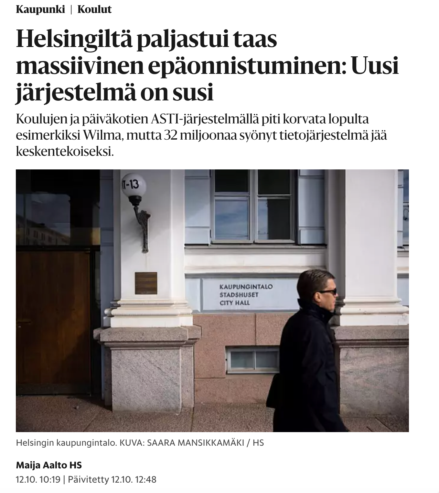
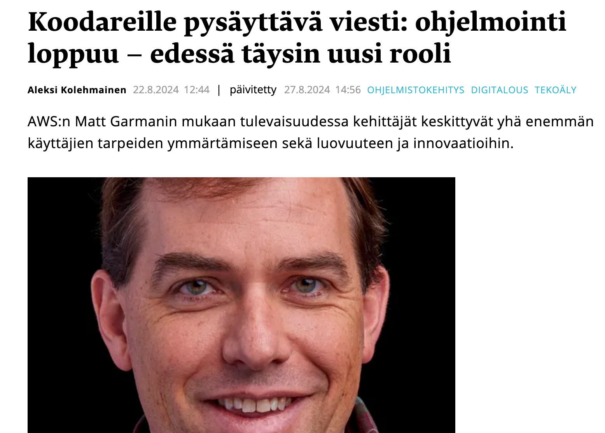
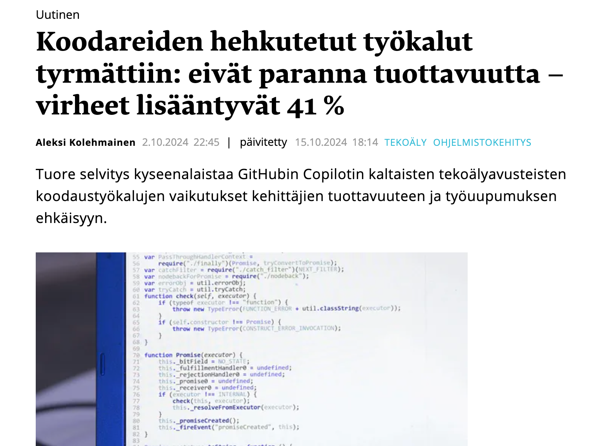
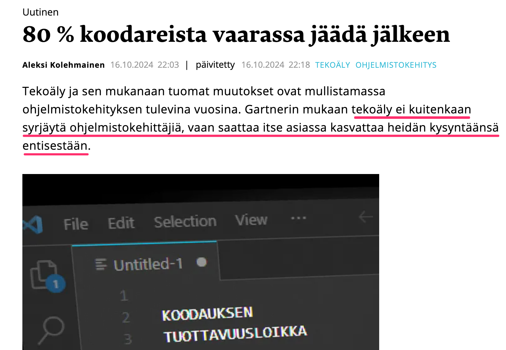

# Ohjelmistotuotanto

# Software production

Translations of # Ohjelmistotuotanto
[ Suomi -> English ]

# Ohjelmistotuotanto
    # Software production, # Software development

                                    Syksy 2024

                                   Autumn 2024

                                      Luento 1

                                     Lecture 1

                                    28.10.2024

                                    28.10.2024

#

#

{ width=400 }

{ width=400 }

# Ohjelmistotuotanto

# Software production

Translations of # Ohjelmistotuotanto
[ Suomi -> English ]

# Ohjelmistotuotanto
    # Software production, # Software development

Luenntot:

Lectures:

Translations of Luenntot:
[ Suomi -> English ]

Luenntot:
    Lectures:, The lectures:

- Matti Luukkainen

- Matti Luukkainen

Translations of - Matti Luukkainen
[ Suomi -> English ]

- Matti Luukkainen
    - Matti Luukkainen, Matti Luukkainen

- Joulukuun vierailijat

- December visitors

Translations of - Joulukuun vierailijat
[ Suomi -> English ]

- Joulukuun vierailijat
    - December visitors, - The December visitors

Ohjaajat:

Instructors:

Definitions of Ohjaajat:
[ Suomi -> English ]

noun
    supervisor
        ohjaaja, valvoja, työnvalvoja, valvojaopettaja
    pilot
        pilotti, lentäjä, ohjaaja, luotsi, merkkivalo, pilottiohjelma
    director
        johtaja, ohjaaja, esimies, suuntain
    instructor
        ohjaaja, opettaja, kouluttaja
    counselor
        neuvonantaja, ohjaaja, neuvoja, asianajaja
    driver
        kuljettaja, ajuri, ajaja, ohjaaja, draiveri, puuykkösmaila
    guide
        opas, ohjain, ohje, matkaopas, opaskirja, ohjaaja
    marshal
        marsalkka, seriffi, sotamarsalkka, käräjäkirjuri, ohjaaja, oikeudenkirjuri
    producer
        tuottaja, valmistaja, ohjaaja
    counsellor
        neuvonantaja, ohjaaja, neuvoja, asianajaja

Ohjaajat:
    Instructors:, Supervisors:

- Sini Arkko

- This is Arkko

Translations of - Sini Arkko
[ Bahasa Melayu -> English ]

- Sini Arkko
    - This is Arkko, - It's Arkko

- Taneli Härkönen

- Taneli Härkönen

Translations of - Taneli Härkönen
[ Suomi -> English ]

- Taneli Härkönen
    - Taneli Härkönen, Taneli Härkönen

- Riku Rauhala

- Riku Rauhala

Translations of - Riku Rauhala
[ Suomi -> English ]

- Riku Rauhala
    - Riku Rauhala, - Riku Calm down

- Pooki Vehviläinen

- Pooki Vehviläinen

Translations of - Pooki Vehviläinen
[ Suomi -> English ]

- Pooki Vehviläinen
    - Pooki Vehviläinen, - Pooki Vehvilainen

- Antti Vuorenmaa

- Antti Vuorenmaa

Translations of - Antti Vuorenmaa
[ Suomi -> English ]

- Antti Vuorenmaa
    - Antti Vuorenmaa, Antti Vuorenmaa

# Team Ohtu

# Team Danger

Translations of # Team Ohtu
[ Eesti -> English ]

# Team Ohtu
    # Team Danger, # Team Ohtu

{ width=300 }

{ width=300 }

# Ohjelmistotuotanto

# Software production

Translations of # Ohjelmistotuotanto
[ Suomi -> English ]

# Ohjelmistotuotanto
    # Software production, # Software development

                                       ?

                                       ?

# Ohjelmistotuotanto

# Software production

Translations of # Ohjelmistotuotanto
[ Suomi -> English ]

# Ohjelmistotuotanto
    # Software production, # Software development

Johdanto _ohjelmistotuotantoon_ (engl. software engineering), eli systemaattiseen tapaan tehdä hieman laajempia ohjelmistoja useamman hengen tiimissä ulkoiselle asiakkaalle

Introduction to _software engineering_ (eng. software engineering), i.e. the systematic way of making slightly larger software in a team of several people for an external customer

Translations of Johdanto _ohjelmistotuotantoon_ (engl. software engineering), eli systemaattiseen tapaan tehdä hieman laajempia ohjelmistoja useamman hengen tiimissä ulkoiselle asiakkaalle
[ Suomi -> English ]

Johdanto _ohjelmistotuotantoon_ (engl. software engineering), eli systemaattiseen tapaan tehdä hieman laajempia ohjelmistoja useamman hengen tiimissä ulkoiselle asiakkaalle
    Introduction to _software engineering_ (eng. software engineering), i.e. the systematic way of making slightly larger software in a team of several people for an external customer, Introduction to _software engineering_ (eng. software engineering), i.e. the systematic way of making slightly larger software in a team of several people for an external client

. . .

. . .

Erityinen paino ns.  ketterissä (engl. agile) ohjelmistotuotantomenetelmissä

The so-called special weight in agile software production methods

Translations of Erityinen paino ns.  ketterissä (engl. agile) ohjelmistotuotantomenetelmissä
[ Suomi -> English ]

Erityinen paino ns.
    The so-called special weight, Special weight, so-called
ketterissä (engl. agile) ohjelmistotuotantomenetelmissä
    in agile software production methods, in agile software development methods

# Kurssin oppimistavoitteet

# Learning objectives of the course

Translations of # Kurssin oppimistavoitteet
[ Suomi -> English ]

# Kurssin oppimistavoitteet
    # Learning objectives of the course, # Course learning goals

Tiedolliset ja tekniset valmiudet toimia _juniorikehittäjän roolissa_ pienessä ohjelmistotiimissä, esim.  _ohjelmistoprojektissa_ TKT20007

Knowledgeable and technical capabilities to act _in the role of a junior developer_ in a small software team, e.g. in the _software project_ TKT20007

Translations of Tiedolliset ja tekniset valmiudet toimia _juniorikehittäjän roolissa_ pienessä ohjelmistotiimissä, esim.  _ohjelmistoprojektissa_ TKT20007
[ Suomi -> English ]

Tiedolliset ja tekniset valmiudet toimia _juniorikehittäjän roolissa_ pienessä ohjelmistotiimissä, esim.
    Knowledgeable and technical capabilities to act _in the role of a junior developer_ in a small software team, e.g., Informative and technical capabilities to act _in the role of a junior developer_ in a small software team, e.g.
_ohjelmistoprojektissa_ TKT20007
    in the _software project_ TKT20007, in _software project_ TKT20007

. . .

. . .

Suoritettuaan kurssin opiskelija

After completing the course, the student

Translations of Suoritettuaan kurssin opiskelija
[ Suomi -> English ]

Suoritettuaan kurssin opiskelija
    After completing the course, the student, After completing the course, a student

- tuntee ohjelmistoprosessin vaiheet (vaatimusmäärittely, suunnittelu, toteutus ja laadunhallinta)

- knows the phases of the software process (requirement definition, design, implementation and quality management)

Translations of - tuntee ohjelmistoprosessin vaiheet (vaatimusmäärittely, suunnittelu, toteutus ja laadunhallinta)
[ Suomi -> English ]

- tuntee ohjelmistoprosessin vaiheet (vaatimusmäärittely, suunnittelu, toteutus ja laadunhallinta)
    - knows the phases of the software process (requirement definition, design, implementation and quality management), - knows the stages of the software process (requirement definition, planning, implementation and quality management)

. . .

. . .

- tietää miten vaatimuksia hallitaan ketterässä ohjelmistotuotantoprosessissa

- know how requirements are managed in an agile software production process

Translations of - tietää miten vaatimuksia hallitaan ketterässä ohjelmistotuotantoprosessissa
[ Suomi -> English ]

- tietää miten vaatimuksia hallitaan ketterässä ohjelmistotuotantoprosessissa
    - know how requirements are managed in an agile software production process, - knows how to manage requirements in an agile software production process

. . .

. . .

- ymmärtää suunnittelun, toteutuksen ja testauksen vastuut ja luonteen ketterässä ohjelmistotuotannossa

- understand the responsibilities and nature of planning, implementation and testing in agile software production

Translations of - ymmärtää suunnittelun, toteutuksen ja testauksen vastuut ja luonteen ketterässä ohjelmistotuotannossa
[ Suomi -> English ]

- ymmärtää suunnittelun, toteutuksen ja testauksen vastuut ja luonteen ketterässä ohjelmistotuotannossa
    - understand the responsibilities and nature of planning, implementation and testing in agile software production, - understands the responsibilities and nature of design, implementation and testing in agile software production

. . .

. . .

- ymmärtää laadunhallinnan perusteet

- understand the basics of quality management

Translations of - ymmärtää laadunhallinnan perusteet
[ Suomi -> English ]

- ymmärtää laadunhallinnan perusteet
    - understand the basics of quality management, - understand the fundamentals of quality control

. . .

. . .

- osaa toimia ympäristössä, jossa ohjelmistokehitys tapahtuu hallitusti ja toistettavalla tavalla

- knows how to work in an environment where software development takes place in a controlled and repeatable manner

Translations of - osaa toimia ympäristössä, jossa ohjelmistokehitys tapahtuu hallitusti ja toistettavalla tavalla
[ Suomi -> English ]

- osaa toimia ympäristössä, jossa ohjelmistokehitys tapahtuu hallitusti ja toistettavalla tavalla
    - knows how to work in an environment where software development takes place in a controlled and repeatable manner, - can work in an environment where software development takes place in a controlled and repeatable manner

# Esitietovaatimukset

# Prerequisites

Translations of # Esitietovaatimukset
[ Suomi -> English ]

# Esitietovaatimukset
    # Prerequisites, # Pre-knowledge requirements

- Tietokannat ja Internet tai vastaavat tiedot

- Databases and Internet or similar information

Translations of - Tietokannat ja Internet tai vastaavat tiedot
[ Suomi -> English ]

- Tietokannat ja Internet tai vastaavat tiedot
    - Databases and Internet or similar information, - Databases and the Internet or similar data

. . .

. . .

- Vanhalta nimeltään _ Aineopintojen harjoitustyö: tietokantasovellus _

- Formerly called _ Coursework exercise: database application _

Translations of - Vanhalta nimeltään _ Aineopintojen harjoitustyö: tietokantasovellus _
[ Suomi -> English ]

- Vanhalta nimeltään _ Aineopintojen harjoitustyö: tietokantasovellus _
    - Formerly called _ Coursework exercise: database application _, - Formerly called _ Exercise work for subject studies: database application _

. . .

. . .

- ja näiden esitiedot: Ohpe, Ohja, Tikape

- and prerequisites for these: Ohpe, Ohja, Tikape

Translations of - ja näiden esitiedot: Ohpe, Ohja, Tikape
[ Suomi -> English ]

- ja näiden esitiedot: Ohpe, Ohja, Tikape
    - and prerequisites for these: Ohpe, Ohja, Tikape, - and the preliminary information of these: Ohpe, Ohja, Tikape

- hyötyä jos Ohte ja Lapio

- useful if Ohte and Spade

Translations of - hyötyä jos Ohte ja Lapio
[ Suomi -> English ]

- hyötyä jos Ohte ja Lapio
    - useful if Ohte and Spade, - beneficial if Ohte and Spade

# Kurssin rakenne

# Structure of the course

Translations of # Kurssin rakenne
[ Suomi -> English ]

# Kurssin rakenne
    # Structure of the course, # Course structure

- Luennot

- Lectures

Definitions of - Luennot
[ Suomi -> English ]

noun
    lecture
        luento, esitelmä, saarna, nuhdesaarna, läksytys

- Luennot
    - Lectures, - The lectures

- ma ja ti 12-14, paitsi

- Mon and Tue 12-2pm, except

Translations of - ma ja ti 12-14, paitsi
[ Suomi -> English ]

- ma ja ti 12-14, paitsi
    - Mon and Tue 12-2pm, except, - Mon and Tue 12-14, except

- viikko 1: ei luentoa

- week 1: no lecture

Translations of - viikko 1: ei luentoa
[ Suomi -> English ]

- viikko 1: ei luentoa
    - week 1: no lecture, - week 1: no class

- viikko 2: ti 12, to 12, pe 12

- week 2: Tue 12, Thu 12, Fri 12

Translations of - viikko 2: ti 12, to 12, pe 12
[ Suomi -> English ]

- viikko 2: ti 12, to 12, pe 12
    - week 2: Tue 12, Thu 12, Fri 12, - week 2: Tues 12, Thurs 12, Fri 12

- Ohjelmistotuotantoon liittyvää käsitteistöä ja teoriaa

- Conceptualization and theory related to software production

Translations of - Ohjelmistotuotantoon liittyvää käsitteistöä ja teoriaa
[ Suomi -> English ]

- Ohjelmistotuotantoon liittyvää käsitteistöä ja teoriaa
    - Conceptualization and theory related to software production, - Software production-related concepts and theory

- Vierailuluennot (2 viimeistä viikkoa)

- Visiting lectures (last 2 weeks)

Translations of - Vierailuluennot (2 viimeistä viikkoa)
[ Suomi -> English ]

- Vierailuluennot (2 viimeistä viikkoa)
    - Visiting lectures (last 2 weeks), - Guest lectures (2 last weeks)

. . .

. . .

- Laskarit

- Calculators

Translations of - Laskarit
[ Suomi -> English ]

- Laskarit
    - Calculators, - The calculators

- teoriaa kertaavat _ monivalintatehtävät _, deadline su 23.59

- theory review _ multiple choice tasks _, deadline Sun 23.59

Translations of - teoriaa kertaavat _ monivalintatehtävät _, deadline su 23.59
[ Suomi -> English ]

- teoriaa kertaavat _ monivalintatehtävät _, deadline su 23.59
    - theory review _ multiple choice tasks _, deadline Sun 23.59, - theory review _ multiple-choice assignments _, deadline Sun 23.59

- viikon 1 deadline poikkeaa

- week 1 deadline differs

Translations of - viikon 1 deadline poikkeaa
[ Suomi -> English ]

- viikon 1 deadline poikkeaa
    - week 1 deadline differs, - the deadline of week 1 differs

- versionhallintaa, testaamista ja ohjelmistojen konfigurointia käsittelevät, deadline _maanantaina klo 23:59_

- dealing with version control, testing and software configuration, deadline _Monday at 23:59_

Translations of - versionhallintaa, testaamista ja ohjelmistojen konfigurointia käsittelevät, deadline _maanantaina klo 23:59_
[ Suomi -> English ]

- versionhallintaa, testaamista ja ohjelmistojen konfigurointia käsittelevät, deadline _maanantaina klo 23:59_
    - dealing with version control, testing and software configuration, deadline _Monday at 23:59_, - those dealing with version control, testing and software configuration, deadline _Monday at 11:59 p.m._

. . .

. . .

- oletettu kuormittavuus on noin 8 tuntia ensimmäisen kahden viikon aikana, viikolla 3 noin 6 tuntia  ja 4 tuntia sen jälkeen

- the expected workload is about 8 hours during the first two weeks, about 6 hours in week 3 and 4 hours after that

Translations of - oletettu kuormittavuus on noin 8 tuntia ensimmäisen kahden viikon aikana, viikolla 3 noin 6 tuntia  ja 4 tuntia sen jälkeen
[ Suomi -> English ]

- oletettu kuormittavuus on noin 8 tuntia ensimmäisen kahden viikon aikana, viikolla 3 noin 6 tuntia  ja 4 tuntia sen jälkeen
    - the expected workload is about 8 hours during the first two weeks, about 6 hours in week 3 and 4 hours after that, - the assumed load capacity is about 8 hours during the first two weeks, about 6 hours in week 3 and 4 hours after that

- monivalintoihin vastaaminen nopeaa, jos...

- answering multiple choices quickly, if...

Translations of - monivalintoihin vastaaminen nopeaa, jos...
[ Suomi -> English ]

- monivalintoihin vastaaminen nopeaa, jos...
    - answering multiple choices quickly, if..., - answering multiple choice questions quickly if...

. . .

. . .

- Miniprojekti

- Mini projects

Translations of - Miniprojekti
[ Lëtzebuergesch -> English ]

- Miniprojekti
    - Mini projects, - mini-projects

- alkaa kurssin 3. viikolla

- starts in the 3rd week of the course

Translations of - alkaa kurssin 3. viikolla
[ Suomi -> English ]

- alkaa kurssin 3. viikolla
    - starts in the 3rd week of the course, - begins in the 3rd week of the course

- yhdistää teorian ja käytännön

- combines theory and practice

Translations of - yhdistää teorian ja käytännön
[ Suomi -> English ]

- yhdistää teorian ja käytännön
    - combines theory and practice, - connects theory and practice

# Miniprojekti

# Mini projects

Translations of # Miniprojekti
[ Lëtzebuergesch -> English ]

# Miniprojekti
    # Mini projects, # Miniprojects

- kurssin viikoilla 3-7

- during course weeks 3-7

Translations of - kurssin viikoilla 3-7
[ Suomi -> English ]

- kurssin viikoilla 3-7
    - during course weeks 3-7, - in weeks 3-7 of the course

- ryhmätyö: koodataan hiukan, harjotellaan projektinhallintaa sekä eräitä laadunhallintatekniikoita

- group work: we code a little, practice project management and some quality management techniques

Translations of - ryhmätyö: koodataan hiukan, harjotellaan projektinhallintaa sekä eräitä laadunhallintatekniikoita
[ Suomi -> English ]

- ryhmätyö: koodataan hiukan, harjotellaan projektinhallintaa sekä eräitä laadunhallintatekniikoita
    - group work: we code a little, practice project management and some quality management techniques, - teamwork: coding a little, practicing project management and some quality management techniques

. . .

. . .

- ryhmässä 4-6 opiskelijaa, ryhmillä on myös asiakas, jota tavataan viikoittain

- 4-6 students in a group, the groups also have a client who meets weekly

Translations of - ryhmässä 4-6 opiskelijaa, ryhmillä on myös asiakas, jota tavataan viikoittain
[ Suomi -> English ]

- ryhmässä 4-6 opiskelijaa, ryhmillä on myös asiakas, jota tavataan viikoittain
    - 4-6 students in a group, the groups also have a client who meets weekly, - 4-6 students in a group, the groups also have a client, who is met weekly

- ensimmäisellä viikolla asiakastapaamiseen tulee varata 90 minuuttia, jälkimmäisillä 30 minuuttia

- in the first week, 90 minutes should be reserved for the customer meeting, in the latter 30 minutes

Translations of - ensimmäisellä viikolla asiakastapaamiseen tulee varata 90 minuuttia, jälkimmäisillä 30 minuuttia
[ Suomi -> English ]

- ensimmäisellä viikolla asiakastapaamiseen tulee varata 90 minuuttia, jälkimmäisillä 30 minuuttia
    - in the first week, 90 minutes should be reserved for the customer meeting, in the latter 30 minutes, - in the first week, you should reserve 90 minutes for the customer meeting, 30 minutes in the latter

- kurssin lopussa on miniprojektien yhteinen 2h kestoinen demotilaisuus

- at the end of the course there is a joint 2-hour demo session of the mini-projects

Translations of - kurssin lopussa on miniprojektien yhteinen 2h kestoinen demotilaisuus
[ Suomi -> English ]

- kurssin lopussa on miniprojektien yhteinen 2h kestoinen demotilaisuus
    - at the end of the course there is a joint 2-hour demo session of the mini-projects, - at the end of the course, there is a joint 2-hour demo event for the mini-projects

. . .

. . .

- miniprojekteissa työskentelyyn tulee varata aikaa noin 6 tuntia viikossa

- about 6 hours a week should be reserved for working on mini-projects

Translations of - miniprojekteissa työskentelyyn tulee varata aikaa noin 6 tuntia viikossa
[ Suomi -> English ]

- miniprojekteissa työskentelyyn tulee varata aikaa noin 6 tuntia viikossa
    - about 6 hours a week should be reserved for working on mini-projects, - about 6 hours per week should be reserved for working on mini projects

_Kurssin läpäisyn edellytyksenä_ on hyväksytysti suoritettu tai hyväksiluettu miniprojekti

_A prerequisite for passing the course_ is a mini-project that has been successfully completed or approved

Translations of _Kurssin läpäisyn edellytyksenä_ on hyväksytysti suoritettu tai hyväksiluettu miniprojekti
[ Suomi -> English ]

_Kurssin läpäisyn edellytyksenä_ on hyväksytysti suoritettu tai hyväksiluettu miniprojekti
    _A prerequisite for passing the course_ is a mini-project that has been successfully completed or approved, _A prerequisite for passing the course_ is a mini-project that has been successfully completed or read with credit

# Miniprojektin hyväksilukeminen

# Validating the mini-project

Translations of # Miniprojektin hyväksilukeminen
[ Suomi -> English ]

# Miniprojektin hyväksilukeminen
    # Validating the mini-project, # Testing the mini-project

Vähintään kolmen kuukauden työkokemus tiimityönä tehtävästä ohjelmistokehityksestä

At least three months of work experience in team-based software development

Translations of Vähintään kolmen kuukauden työkokemus tiimityönä tehtävästä ohjelmistokehityksestä
[ Suomi -> English ]

Vähintään kolmen kuukauden työkokemus tiimityönä tehtävästä ohjelmistokehityksestä
    At least three months of work experience in team-based software development, At least three months' work experience in software development performed as a team

Lähetä emailia sen jälkeen kun olet palauttanut viikon 1 tehtävät

Send an email after you have returned the assignments from week 1

Translations of Lähetä emailia sen jälkeen kun olet palauttanut viikon 1 tehtävät
[ Suomi -> English ]

Lähetä emailia sen jälkeen kun olet palauttanut viikon 1 tehtävät
    Send an email after you have returned the assignments from week 1, Send an email after you have returned the tasks of week 1

# Kurssin arvostelu

# Course review

Translations of # Kurssin arvostelu
[ Suomi -> English ]

# Kurssin arvostelu
    # Course review, # Review of the course

Jaossa yhteensä 40 pistettä

A total of 40 points in the division

Translations of Jaossa yhteensä 40 pistettä
[ Suomi -> English ]

Jaossa yhteensä 40 pistettä
    A total of 40 points in the division, A total of 40 points are awarded

- laskarit 10 pistettä

- calculators 10 points

Translations of - laskarit 10 pistettä
[ Suomi -> English ]

- laskarit 10 pistettä
    - calculators 10 points, - counters 10 points

- monivalintatehtävät 2 pistettä

- multiple choice tasks 2 points

Translations of - monivalintatehtävät 2 pistettä
[ Suomi -> English ]

- monivalintatehtävät 2 pistettä
    - multiple choice tasks 2 points, - multiple choice exercises 2 points

- viikoittaiset ohjelmointi/versionhallinta/konfigurointitehtävät 8 pistettä

- weekly programming/version control/configuration tasks 8 points

Translations of - viikoittaiset ohjelmointi/versionhallinta/konfigurointitehtävät 8 pistettä
[ Suomi -> English ]

- viikoittaiset ohjelmointi/versionhallinta/konfigurointitehtävät 8 pistettä
    - weekly programming/version control/configuration tasks 8 points, - weekly programming/version management/configuration assignments 8 points

- miniprojekti 11 pistettä

- mini project 11 points

Translations of - miniprojekti 11 pistettä
[ Suomi -> English ]

- miniprojekti 11 pistettä
    - mini project 11 points, - a mini-project 11 points

- koe 18 pistettä

- experience 18 points

Translations of - koe 18 pistettä
[ Suomi -> English ]

- koe 18 pistettä
    - experience 18 points, - try 18 points

- osallistuminen vierailuluennoille 1 piste (0.33 pistettä per luentokerta)

- participation in visiting lectures 1 point (0.33 points per lecture session)

Translations of - osallistuminen vierailuluennoille 1 piste (0.33 pistettä per luentokerta)
[ Suomi -> English ]

- osallistuminen vierailuluennoille 1 piste (0.33 pistettä per luentokerta)
    - participation in visiting lectures 1 point (0.33 points per lecture session), - participation in guest lectures 1 point (0.33 points per lecture)

Arvosanaan 1 riittää 20 pistettä, arvosanaan 5 tarvitaan 36 pistettä.

20 points are enough for a grade of 1, 36 points are needed for a grade of 5.

Translations of Arvosanaan 1 riittää 20 pistettä, arvosanaan 5 tarvitaan 36 pistettä.
[ Suomi -> English ]

Arvosanaan 1 riittää 20 pistettä, arvosanaan 5 tarvitaan 36 pistettä.
    20 points are enough for a grade of 1, 36 points are needed for a grade of 5., 20 points are enough for grade 1, 36 points are required for grade 5.

Läpipääsy edellyttää lisäksi miniprojektin hyväksyttyä suoritusta (tai hyväksilukua) ja vähintään puolia kokeen pisteistä

Passing also requires an approved completion of the mini-project (or a passing grade) and at least half of the exam points

Translations of Läpipääsy edellyttää lisäksi miniprojektin hyväksyttyä suoritusta (tai hyväksilukua) ja vähintään puolia kokeen pisteistä
[ Suomi -> English ]

Läpipääsy edellyttää lisäksi miniprojektin hyväksyttyä suoritusta (tai hyväksilukua) ja vähintään puolia kokeen pisteistä
    Passing also requires an approved completion of the mini-project (or a passing grade) and at least half of the exam points, Passing also requires an approved completion of the mini-project (or passing the exam) and at least half of the exam points

# Luennot - laskarit - miniprojekti

# Lectures - calculators - mini project

Translations of # Luennot - laskarit - miniprojekti
[ Suomi -> English ]

# Luennot - laskarit - miniprojekti
    # Lectures - calculators - mini project, # Lectures - calculators - mini-project

**Luennoilla** ohjelmistokehityksen teoriaa ja käsitteistöä

**Lectures** software development theory and concepts

Translations of **Luennoilla** ohjelmistokehityksen teoriaa ja käsitteistöä
[ Suomi -> English ]

**Luennoilla** ohjelmistokehityksen teoriaa ja käsitteistöä
    **Lectures** software development theory and concepts, **Lectures** software development theory and conceptualization

- laskarien _monivalintatehtävät_ liittyvät kunkin viikon luentoihin

- the calculators' _multiple choice tasks_ are related to each week's lectures

Translations of - laskarien _monivalintatehtävät_ liittyvät kunkin viikon luentoihin
[ Suomi -> English ]

- laskarien _monivalintatehtävät_ liittyvät kunkin viikon luentoihin
    - the calculators' _multiple choice tasks_ are related to each week's lectures, - the _multiple-choice assignments_ of the calculators are related to the lectures of each week

. . .

. . .

Versionhallintaa, konfigurointia, testausta ja ohjelmointia käsittelevien **teknisempien laskarien** aihepiirejä ei paljoa käsitellä luennoilla

The topics of **more technical calculators** dealing with version control, configuration, testing and programming are not covered much in the lectures

Translations of Versionhallintaa, konfigurointia, testausta ja ohjelmointia käsittelevien **teknisempien laskarien** aihepiirejä ei paljoa käsitellä luennoilla
[ Suomi -> English ]

Versionhallintaa, konfigurointia, testausta ja ohjelmointia käsittelevien **teknisempien laskarien** aihepiirejä ei paljoa käsitellä luennoilla
    The topics of **more technical calculators** dealing with version control, configuration, testing and programming are not covered much in the lectures, The topics of **more technical calculators** dealing with version management, configuration, testing and programming are not covered much in lectures

. . .

. . .

**Miniprojekti** yhdistää luentojen teoria ja laskareissa käsitellyt teknisemmät asiat, ja soveltaa niitä käytännössä

**Mini project** combines the theory of the lectures and the more technical issues discussed in the calculators, and applies them in practice

Translations of **Miniprojekti** yhdistää luentojen teoria ja laskareissa käsitellyt teknisemmät asiat, ja soveltaa niitä käytännössä
[ Suomi -> English ]

**Miniprojekti** yhdistää luentojen teoria ja laskareissa käsitellyt teknisemmät asiat, ja soveltaa niitä käytännössä
    **Mini project** combines the theory of the lectures and the more technical issues discussed in the calculators, and applies them in practice, **Mini-project** combines the theory of the lectures and the more technical issues covered in the calculators, and applies them in practice

. . .

. . .

**Kokeessa** suurin painoarvo teoriassa ja sen soveltamisessa käytäntöön

**In the exam**, the greatest weight is on theory and its application in practice

Translations of **Kokeessa** suurin painoarvo teoriassa ja sen soveltamisessa käytäntöön
[ Suomi -> English ]

**Kokeessa** suurin painoarvo teoriassa ja sen soveltamisessa käytäntöön
    **In the exam**, the greatest weight is on theory and its application in practice, In the **examination**, the greatest emphasis is placed on theory and its application in practice

- laskareiden teknisimpiä asioita ei kokeessa tulla kysymään

- the most technical things about calculators will not be asked in the exam

Translations of - laskareiden teknisimpiä asioita ei kokeessa tulla kysymään
[ Suomi -> English ]

- laskareiden teknisimpiä asioita ei kokeessa tulla kysymään
    - the most technical things about calculators will not be asked in the exam, - the most technical aspects of calculators will not be asked in the exam

- tarkemmin kokeesta kurssin viimeisellä luennolla

- more details about the exam in the last lecture of the course

Translations of - tarkemmin kokeesta kurssin viimeisellä luennolla
[ Suomi -> English ]

- tarkemmin kokeesta kurssin viimeisellä luennolla
    - more details about the exam in the last lecture of the course, - in more detail about the test in the last lecture of the course

# Versionhallinta 1 op

# Versionhallinta 1 op

Saat suoritusmerkinnän tekemällä kaikki kurssin versiohallintatehtävät ja suorittamalla hyväksytysti miniprojektin

You will receive a performance mark by completing all course version control tasks and successfully completing the mini-project

Translations of Saat suoritusmerkinnän tekemällä kaikki kurssin versiohallintatehtävät ja suorittamalla hyväksytysti miniprojektin
[ Suomi -> English ]

Saat suoritusmerkinnän tekemällä kaikki kurssin versiohallintatehtävät ja suorittamalla hyväksytysti miniprojektin
    You will receive a performance mark by completing all course version control tasks and successfully completing the mini-project, You will receive a mark of completion by completing all version control tasks in the course and successfully completing the mini-project

# Kurssimateriaali

# Course material

Translations of # Kurssimateriaali
[ Suomi -> English ]

# Kurssimateriaali
    # Course material, # Course materials

https://translate.google.com/translate?hl=en&sl=auto&tl=en&u=https://ohjelmistotuotanto-hy.github.io/

# Kurssipalaute

# Course feedback

Translations of # Kurssipalaute
[ Suomi -> English ]

# Kurssipalaute
    # Course feedback, # Lesson feedback

. . .

. . .

- Kurssipalaute

- Course feedback

Translations of - Kurssipalaute
[ Suomi -> English ]

- Kurssipalaute
    - Course feedback, - Lesson feedback

- Kurssilla lopussa kerättävän palautteen lisäksi ns.  jatkuva palaute https://norppa.helsinki.fi

- In addition to the feedback collected at the end of the course, the so-called continuous feedback https://norppa.helsinki.fi

Translations of - Kurssilla lopussa kerättävän palautteen lisäksi ns.  jatkuva palaute https://norppa.helsinki.fi
[ Suomi -> English ]

- Kurssilla lopussa kerättävän palautteen lisäksi ns.
    - In addition to the feedback collected at the end of the course, the so-called, - In addition to the feedback gathered at the end of the course, so-called
jatkuva palaute https://norppa.helsinki.fi
    continuous feedback https://norppa.helsinki.fi, ongoing feedback https://norppa.helsinki.fi

. . .

. . .

- Kurssipalaute **vaikuttaa**

- Course feedback **has an effect**

Translations of - Kurssipalaute **vaikuttaa**
[ Suomi -> English ]

- Kurssipalaute **vaikuttaa**
    - Course feedback **has an effect**, - Course feedback **affects**

- Edellisen kurssin palautteen "moitteita"

- "reprimands" from the previous course's feedback

Translations of - Edellisen kurssin palautteen "moitteita"
[ Suomi -> English ]

- Edellisen kurssin palautteen "moitteita"
    - "reprimands" from the previous course's feedback, - "Criticisms" from the previous course feedback

- Miniprojekti

- Mini projects

Translations of - Miniprojekti
[ Lëtzebuergesch -> English ]

- Miniprojekti
    - Mini projects, - mini-projects

- tekniset haasteet: boilerplate

- technical challenges: boilerplate

Translations of - tekniset haasteet: boilerplate
[ Suomi -> English ]

- tekniset haasteet: boilerplate
    - technical challenges: boilerplate, - tech challenges: boilerplate

- ryhmätyöskentely: ohjeita

- teamwork: instructions

Translations of - ryhmätyöskentely: ohjeita
[ Suomi -> English ]

- ryhmätyöskentely: ohjeita
    - teamwork: instructions, - group work: guidelines

- Kokeen painoarvo ja ylipäätään merkitys

- The importance of the exam and its importance in general

Translations of - Kokeen painoarvo ja ylipäätään merkitys
[ Suomi -> English ]

- Kokeen painoarvo ja ylipäätään merkitys
    - The importance of the exam and its importance in general, - The importance of the exam and overall importance

- Materiaalin navigoitavuus

- Navigability of the material

Translations of - Materiaalin navigoitavuus
[ Suomi -> English ]

- Materiaalin navigoitavuus
    - Navigability of the material, - Material navigability

. . .

. . .

- Monivalintoihin kohdistunut kritiikki vähentynyt

- Criticism of multiple choices decreased

Translations of - Monivalintoihin kohdistunut kritiikki vähentynyt
[ Suomi -> English ]

- Monivalintoihin kohdistunut kritiikki vähentynyt
    - Criticism of multiple choices decreased, - Criticism directed at multiple choices has decreased

- haastavampia väittämiä paranneltu/poistettu

- more challenging statements improved/removed

Translations of - haastavampia väittämiä paranneltu/poistettu
[ Suomi -> English ]

- haastavampia väittämiä paranneltu/poistettu
    - more challenging statements improved/removed, - improved/removed more challenging statements

# Monivalintojen korvaaminen luentopäiväkirjalla

# Replacing multiple choices with a lecture diary

Translations of # Monivalintojen korvaaminen luentopäiväkirjalla
[ Suomi -> English ]

# Monivalintojen korvaaminen luentopäiväkirjalla
    # Replacing multiple choices with a lecture diary, # Replacement of multiple choices with a lecture diary

. . .

. . .

- Kurssin viikoilla 1-5 viikon luentoja kertaavat monivalinnat (2/40 kurssin pisteistä)

- During the weeks of the course, multiple choices repeat the lectures of weeks 1-5 (2/40 of the course points)

Translations of - Kurssin viikoilla 1-5 viikon luentoja kertaavat monivalinnat (2/40 kurssin pisteistä)
[ Suomi -> English ]

- Kurssin viikoilla 1-5 viikon luentoja kertaavat monivalinnat (2/40 kurssin pisteistä)
    - During the weeks of the course, multiple choices repeat the lectures of weeks 1-5 (2/40 of the course points), - During the weeks of the course, multiple choices repeat the lectures of weeks 1-5 (2/40 of the course's points)

. . .

. . .

- Monivalinnat herättäneet tunteita, en ole itsekään niiden fani

- Multiple choices aroused emotions, I'm not a fan of them myself

Translations of - Monivalinnat herättäneet tunteita, en ole itsekään niiden fani
[ Suomi -> English ]

- Monivalinnat herättäneet tunteita, en ole itsekään niiden fani
    - Multiple choices aroused emotions, I'm not a fan of them myself, - The multiple choices aroused emotions, I'm not a fan of them myself

- Hyödyt ovat kiistattomat, kokeet menevät nykyään paremmin kuin monivalintoja edeltävänä aikana

- The benefits are indisputable, exams go better today than in the time before multiple choice

Translations of - Hyödyt ovat kiistattomat, kokeet menevät nykyään paremmin kuin monivalintoja edeltävänä aikana
[ Suomi -> English ]

- Hyödyt ovat kiistattomat, kokeet menevät nykyään paremmin kuin monivalintoja edeltävänä aikana
    - The benefits are indisputable, exams go better today than in the time before multiple choice, - The benefits are indisputable, the exams are going better today than in the time before multiple choice

. . .

. . .

- Tarjolla vaihtoehto: **viikoittainen luentopäiväkirja**

- Option available: **weekly lecture diary**

Translations of - Tarjolla vaihtoehto: **viikoittainen luentopäiväkirja**
[ Suomi -> English ]

- Tarjolla vaihtoehto: **viikoittainen luentopäiväkirja**
    - Option available: **weekly lecture diary**, - Available option: **weekly lecture diary**

- Noin A4:n kokoinen omin sanoin tehty yhteenveto viikon luentojen asioista

- A summary of the week's lectures in my own words, about A4 size

Translations of - Noin A4:n kokoinen omin sanoin tehty yhteenveto viikon luentojen asioista
[ Suomi -> English ]

- Noin A4:n kokoinen omin sanoin tehty yhteenveto viikon luentojen asioista
    - A summary of the week's lectures in my own words, about A4 size, - A summary of the topics of the week's lectures, made in my own words, about the size of A4

- voi olla tehty käsin, joko tekstiä, lista ranskalaisia viivoja tai esim.  mind map

- can be made by hand, either text, a list of French lines or e.g. mind map

Translations of - voi olla tehty käsin, joko tekstiä, lista ranskalaisia viivoja tai esim.  mind map
[ Suomi -> English ]

- voi olla tehty käsin, joko tekstiä, lista ranskalaisia viivoja tai esim.
    - can be made by hand, either text, a list of French lines or e.g., - can be made by hand, either a text, a list of French lines or, for example,
mind map
    mind map, mindmap

- ei kuitenkaan missään tapauksessa plagiaatti tai ChatGPT:llä generoitu (opintovilppi: käsitellään HY:n prosessin mukaan)

- however, in no case plagiarism or generated with ChatGPT (study fraud: handled according to HY's process)

Translations of - ei kuitenkaan missään tapauksessa plagiaatti tai ChatGPT:llä generoitu (opintovilppi: käsitellään HY:n prosessin mukaan)
[ Suomi -> English ]

- ei kuitenkaan missään tapauksessa plagiaatti tai ChatGPT:llä generoitu (opintovilppi: käsitellään HY:n prosessin mukaan)
    - however, in no case plagiarism or generated with ChatGPT (study fraud: handled according to HY's process), - however, in no case is it plagiarized or generated with ChatGPT (study fraud: handled according to the HY process)

. . .

. . .

- Deadline kunkin viikon sunnuntai klo 23:59, lähetetään emailitse matti.luukkainen@helsinki.fi (poikkeus vko 1 jonka deadline samaan aikaan kuin vko 2)

- Deadline Sunday of each week at 23:59, sent by email matti.luukkainen@helsinki.fi (exception week 1 whose deadline is the same as week 2)

Translations of - Deadline kunkin viikon sunnuntai klo 23:59, lähetetään emailitse matti.luukkainen@helsinki.fi (poikkeus vko 1 jonka deadline samaan aikaan kuin vko 2)
[ Suomi -> English ]

- Deadline kunkin viikon sunnuntai klo 23:59, lähetetään emailitse matti.luukkainen@helsinki.fi (poikkeus vko 1 jonka deadline samaan aikaan kuin vko 2)
    - Deadline Sunday of each week at 23:59, sent by email matti.luukkainen@helsinki.fi (exception week 1 whose deadline is the same as week 2), - Deadline Sunday of each week at 23:59, sent by email matti.luukkainen@helsinki.fi (exception for week 1 whose deadline is the same as week 2)

- Arvostelu, ks kurssimateriaalin osa 0

- Evaluation, see part 0 of the course material

Translations of - Arvostelu, ks kurssimateriaalin osa 0
[ Suomi -> English ]

- Arvostelu, ks kurssimateriaalin osa 0
    - Evaluation, see part 0 of the course material, - Assessment, see part 0 of the course material

# Ohjelmistotuotanto engl.  software engineering

# Software production in English software engineering

Translations of # Ohjelmistotuotanto engl.  software engineering
[ Suomi -> English ]

# Ohjelmistotuotanto engl.
    # Software production in English, # Software production engl.
software engineering
    software engineering, software engineer

. . .

. . .

The IEEE Computer Society defines software engineering as:

The IEEE Computer Society defines software engineering as:

- _The application of a systematic, disciplined, quantifiable approach to the development, operation, and maintenance of software; that is, the application of engineering to software_

- _The application of a systematic, disciplined, quantifiable approach to the development, operation, and maintenance of software; that is, the application of engineering to software_

# Ohjelmistotuotanto engl.  software engineering

# Software production in English software engineering

Translations of # Ohjelmistotuotanto engl.  software engineering
[ Suomi -> English ]

# Ohjelmistotuotanto engl.
    # Software production in English, # Software production engl.
software engineering
    software engineering, software engineer

The IEEE Computer Society defines software engineering as:

The IEEE Computer Society defines software engineering as:

- _Systemaattisen, kurinalaisen ja mitattavissa olevan lähestymistavan soveltaminen ohjelmistojen kehittämiseen, käyttöön ja ylläpitoon, eli "insinöörityön" soveltaminen ohjelmistoihin_

- _Applying a systematic, disciplined and measurable approach to software development, use and maintenance, i.e. applying "engineering" to software_

Translations of - _Systemaattisen, kurinalaisen ja mitattavissa olevan lähestymistavan soveltaminen ohjelmistojen kehittämiseen, käyttöön ja ylläpitoon, eli "insinöörityön" soveltaminen ohjelmistoihin_
[ Suomi -> English ]

- _Systemaattisen, kurinalaisen ja mitattavissa olevan lähestymistavan soveltaminen ohjelmistojen kehittämiseen, käyttöön ja ylläpitoon, eli "insinöörityön" soveltaminen ohjelmistoihin_
    - _Applying a systematic, disciplined and measurable approach to software development, use and maintenance, i.e. applying "engineering" to software_, - _Applying a systematic, disciplined and measurable approach to the development, use and maintenance of software, i.e. the application of "engineering" to software_

. . .

. . .

Lähde _SWEBOK_ eli _Guide to the Software Engineering Body of Knowledge_

Lähde _SWEBOK_ eli _Guide to the Software Engineering Body of Knowledge_

- ison komitean yritys määritellä mitä ohjelmistotuotannolla tarkoitetaan ja mitä osa-alueita siihen kuuluu

- the big committee's attempt to define what is meant by software production and what areas it includes

Translations of - ison komitean yritys määritellä mitä ohjelmistotuotannolla tarkoitetaan ja mitä osa-alueita siihen kuuluu
[ Suomi -> English ]

- ison komitean yritys määritellä mitä ohjelmistotuotannolla tarkoitetaan ja mitä osa-alueita siihen kuuluu
    - the big committee's attempt to define what is meant by software production and what areas it includes, - the large committee's attempt to define what is meant by software production and which areas it includes

- uusin versio ilmestyi 15.11.2024!

- the latest version appeared on 15.11.2024!

Translations of - uusin versio ilmestyi 15.11.2024!
[ Suomi -> English ]

- uusin versio ilmestyi 15.11.2024!
    - the latest version appeared on 15.11.2024!, - the latest version came out on 15 November 2024!

# Ohjelmistotuotannon osa-alueet SWEBOK:in mukaan

# Areas of software production according to SWEBOK

Translations of # Ohjelmistotuotannon osa-alueet SWEBOK:in mukaan
[ Suomi -> English ]

# Ohjelmistotuotannon osa-alueet SWEBOK:in mukaan
    # Areas of software production according to SWEBOK, # Software production areas according to SWEBOK

- Software requirements eli **vaatimusmäärittely**

- Software requirements, i.e. **requirement definition**

Translations of - Software requirements eli **vaatimusmäärittely**
[ Suomi -> English ]

- Software requirements eli **vaatimusmäärittely**
    - Software requirements, i.e. **requirement definition**, - Software requirements, i.e. **requirement specification**

- Software design eli **suunnittelu**

- Software design or **planning**

Translations of - Software design eli **suunnittelu**
[ Suomi -> English ]

- Software design eli **suunnittelu**
    - Software design or **planning**, - Software design, i.e. **design**

- Software construction eli **toteutus/ohjelmointi**

- Software construction, i.e. **implementation/programming**

Translations of - Software construction eli **toteutus/ohjelmointi**
[ Suomi -> English ]

- Software construction eli **toteutus/ohjelmointi**
    - Software construction, i.e. **implementation/programming**, - Software construction or **implementation/programming**

- Software testing eli **testaus**

- Software testing or **testing**

Translations of - Software testing eli **testaus**
[ Suomi -> English ]

- Software testing eli **testaus**
    - Software testing or **testing**, - Software testing, i.e. **testing**

- Software maintenance eli **ylläpito**

- Software maintenance or **maintenance**

Translations of - Software maintenance eli **ylläpito**
[ Suomi -> English ]

- Software maintenance eli **ylläpito**
    - Software maintenance or **maintenance**, - Software maintenance, i.e. **maintenance**

. . .

. . .

- Software configuration management eli **konfiguraatiot**

- Software configuration management eli **konfiguraatiot**

- Software engineering tools and methods eli **työkalut**

- Software engineering tools and methods, i.e. **tools**

Translations of - Software engineering tools and methods eli **työkalut**
[ Suomi -> English ]

- Software engineering tools and methods eli **työkalut**
    - Software engineering tools and methods, i.e. **tools**, - Software engineering tools and methods or **tools**

- Software quality eli **laadunhallinta**

- Software quality or **quality management**

Translations of - Software quality eli **laadunhallinta**
[ Suomi -> English ]

- Software quality eli **laadunhallinta**
    - Software quality or **quality management**, - Software quality, i.e. **quality management**

- Software engineering process eli **ohjelmistotuotantoprosessi**

- Software engineering process or **software production process**

Translations of - Software engineering process eli **ohjelmistotuotantoprosessi**
[ Suomi -> English ]

- Software engineering process eli **ohjelmistotuotantoprosessi**
    - Software engineering process or **software production process**, - Software engineering process, i.e. **software production process**

- Software engineering management eli **projektien johtaminen**

- Software engineering management, i.e. **project management**

Translations of - Software engineering management eli **projektien johtaminen**
[ Suomi -> English ]

- Software engineering management eli **projektien johtaminen**
    - Software engineering management, i.e. **project management**, - Software engineering management or **project management**

. . .

. . .

- Software architecture eli **arkkitehtuuri**

- Software architecture or **architecture**

Translations of - Software architecture eli **arkkitehtuuri**
[ Suomi -> English ]

- Software architecture eli **arkkitehtuuri**
    - Software architecture or **architecture**, - Software architecture, i.e. **architecture**

- Software engineering operations eli **operointi tuotannossa**

- Software engineering operations, i.e. **operations in production**

Translations of - Software engineering operations eli **operointi tuotannossa**
[ Suomi -> English ]

- Software engineering operations eli **operointi tuotannossa**
    - Software engineering operations, i.e. **operations in production**, - Software engineering operations, or **operations in production**

- Software security eli **tietoturva**

- Software security or **information security**

Translations of - Software security eli **tietoturva**
[ Suomi -> English ]

- Software security eli **tietoturva**
    - Software security or **information security**, - Software security, i.e. **data security**

- Software engineering economics eli **talous**

- Software engineering Economics or **economics**

Translations of - Software engineering economics eli **talous**
[ Suomi -> English ]

- Software engineering economics eli **talous**
    - Software engineering Economics or **economics**, - Software engineering Economics

- Software engineering professional practice eli **ammattietiikka ja ryhmärynamiikka**

- Software engineering professional practice, i.e. **professional ethics and group dynamics**

Translations of - Software engineering professional practice eli **ammattietiikka ja ryhmärynamiikka**
[ Suomi -> English ]

- Software engineering professional practice eli **ammattietiikka ja ryhmärynamiikka**
    - Software engineering professional practice, i.e. **professional ethics and group dynamics**, - Software engineering professional practice, i.e. **professional ethics and team dynamics**

# Ohjelmiston elinkaari (software lifecycle)

# Software lifecycle

Translations of # Ohjelmiston elinkaari (software lifecycle)
[ Suomi -> English ]

# Ohjelmiston elinkaari (software lifecycle)
    # Software lifecycle, # Software life cycle (software lifecycle)

Riippumatta tyylistä ja tavasta, jolla ohjelmisto tehdään, käy ohjelmisto läpi seuraavat _vaiheet_

Regardless of the style and way the software is made, the software goes through the following _stages_

Translations of Riippumatta tyylistä ja tavasta, jolla ohjelmisto tehdään, käy ohjelmisto läpi seuraavat _vaiheet_
[ Suomi -> English ]

Riippumatta tyylistä ja tavasta, jolla ohjelmisto tehdään, käy ohjelmisto läpi seuraavat _vaiheet_
    Regardless of the style and way the software is made, the software goes through the following _stages_, Regardless of the style and manner in which the software is made, the software goes through the following _phases_

- Vaatimusten analysointi ja määrittely

- Analysis and definition of requirements

Translations of - Vaatimusten analysointi ja määrittely
[ Suomi -> English ]

- Vaatimusten analysointi ja määrittely
    - Analysis and definition of requirements, - Requirements analysis and definition

- Suunnittelu

- Planning

Definitions of - Suunnittelu
[ Suomi -> English ]

noun
    design
        design, malli, suunnittelu, muotoilu, kuvio, suunnitelma
    planning
        suunnittelu, kaavoitus
    designing
        suunnittelu, muotoilu, design
    contemplation
        miettiminen, mietiskely, suunnittelu

- Suunnittelu
    - Planning, - The design

- Toteutus

- Implementation

Definitions of - Toteutus
[ Suomi -> English ]

noun
    achievement
        saavutus, saavuttaminen, suoritus, toteutus

- Toteutus
    - Implementation, - Execution

- Testaus

- Testing

Definitions of - Testaus
[ Suomi -> English ]

noun
    testing
        testaus, koestus

- Testaus
    - Testing, - A test

- Ohjelmiston ylläpito ja evoluutio

- Software maintenance and evolution

Translations of - Ohjelmiston ylläpito ja evoluutio
[ Suomi -> English ]

- Ohjelmiston ylläpito ja evoluutio
    - Software maintenance and evolution, - Maintenance and evolution of the software

. . .

. . .

Vaiheista muodostuu ohjelmiston "elinkaari"

The phases make up the "life cycle" of the software

Translations of Vaiheista muodostuu ohjelmiston "elinkaari"
[ Suomi -> English ]

Vaiheista muodostuu ohjelmiston "elinkaari"
    The phases make up the "life cycle" of the software, The stages make up the software's "life cycle"

. . .

. . .

Käytetty **ohjelmistotuotantoprosessi** määrittelee miten vaiheet suhtautuvat toisiinsa

The **software production process** used defines how the phases relate to each other

Translations of Käytetty **ohjelmistotuotantoprosessi** määrittelee miten vaiheet suhtautuvat toisiinsa
[ Suomi -> English ]

Käytetty **ohjelmistotuotantoprosessi** määrittelee miten vaiheet suhtautuvat toisiinsa
    The **software production process** used defines how the phases relate to each other, The used **software production process** defines how the phases relate to each other

. . .

. . .

Eri vaiheiden sisältöön palaamme myöhemmin tarkemmin

We will return to the content of the different stages in more detail later

Translations of Eri vaiheiden sisältöön palaamme myöhemmin tarkemmin
[ Suomi -> English ]

Eri vaiheiden sisältöön palaamme myöhemmin tarkemmin
    We will return to the content of the different stages in more detail later, We will come back to the content of the different phases in more detail later

# Alussa (ja osin edelleen) code'n'fix

# In the beginning (and partly still) code'n'fix

Translations of # Alussa (ja osin edelleen) code'n'fix
[ Suomi -> English ]

# Alussa (ja osin edelleen) code'n'fix
    # In the beginning (and partly still) code'n'fix, # In the beginning (and still in part) code'n'fix

Historian alkuaikoina laitteet maksoivat paljon, ohjelmat olivat laitteistoihin nähden "triviaaleja"

In the early days of history, devices cost a lot, programs were "trivial" compared to the hardware

Translations of Historian alkuaikoina laitteet maksoivat paljon, ohjelmat olivat laitteistoihin nähden "triviaaleja"
[ Suomi -> English ]

Historian alkuaikoina laitteet maksoivat paljon, ohjelmat olivat laitteistoihin nähden "triviaaleja"
    In the early days of history, devices cost a lot, programs were "trivial" compared to the hardware, In the early days of history, the devices cost a lot, the programs were "trivial" compared to the hardware

- ohjelmointi konekielellä

- programming in machine language

Translations of - ohjelmointi konekielellä
[ Suomi -> English ]

- ohjelmointi konekielellä
    - programming in machine language, - machine language programming

- sovelluksen käyttäjä ohjelmoi itse ohjelmansa

(♂) - the user of the application programs his own program
(♀) - the user of the application programs her own program

Translations of - sovelluksen käyttäjä ohjelmoi itse ohjelmansa
[ Suomi -> English ]

- sovelluksen käyttäjä ohjelmoi itse ohjelmansa
    - the user of the application programs his own program, - the application user programs his own program

. . .

. . .

Vähitellen ohjelmistot alkavat kasvaa ja kehitettiin korkeamman tason ohjelmointikieliä (Fortran, Cobol, Algol)

Gradually, software began to grow and higher-level programming languages were developed (Fortran, Cobol, Algol)

Translations of Vähitellen ohjelmistot alkavat kasvaa ja kehitettiin korkeamman tason ohjelmointikieliä (Fortran, Cobol, Algol)
[ Suomi -> English ]

Vähitellen ohjelmistot alkavat kasvaa ja kehitettiin korkeamman tason ohjelmointikieliä (Fortran, Cobol, Algol)
    Gradually, software began to grow and higher-level programming languages were developed (Fortran, Cobol, Algol), Gradually, the software started to grow and higher level programming languages were developed (Fortran, Cobol, Algol)

- sovellusalue laajenee monille elämänaloille

- the application area expands to many areas of life

Translations of - sovellusalue laajenee monille elämänaloille
[ Suomi -> English ]

- sovellusalue laajenee monille elämänaloille
    - the application area expands to many areas of life, - the field of application expands to many areas of life

. . .

. . .

Pikkuhiljaa homma alkaa karata käsistä:

Little by little, things are getting out of hand:

Translations of Pikkuhiljaa homma alkaa karata käsistä:
[ Suomi -> English ]

Pikkuhiljaa homma alkaa karata käsistä:
    Little by little, things are getting out of hand:, Little by little things start to get out of hand:

- budjetit ylittyivät ja projektit myöhästyivät aikatauluista

- budgets were exceeded and projects were behind schedule

Translations of - budjetit ylittyivät ja projektit myöhästyivät aikatauluista
[ Suomi -> English ]

- budjetit ylittyivät ja projektit myöhästyivät aikatauluista
    - budgets were exceeded and projects were behind schedule, - budgets were exceeded and projects were late

- ohjelmistot olivat tehottomia, niiden laatu oli huono ja ne eivät toimineet käyttäjien tarpeiden mukaan

- the software was inefficient, its quality was poor and it did not work according to the users' needs

Translations of - ohjelmistot olivat tehottomia, niiden laatu oli huono ja ne eivät toimineet käyttäjien tarpeiden mukaan
[ Suomi -> English ]

- ohjelmistot olivat tehottomia, niiden laatu oli huono ja ne eivät toimineet käyttäjien tarpeiden mukaan
    - the software was inefficient, its quality was poor and it did not work according to the users' needs, - the software was inefficient, of poor quality and did not work according to the users' needs

- koodin ylläpito ja laajentaminen oli vaikeaa

- maintaining and extending the code was difficult

Translations of - koodin ylläpito ja laajentaminen oli vaikeaa
[ Suomi -> English ]

- koodin ylläpito ja laajentaminen oli vaikeaa
    - maintaining and extending the code was difficult, - code maintenance and expansion was difficult

- usein ohjelmistoja ei hyvistä aikeista huolimatta saatu ollenkaan toimitettua

- often software was not delivered at all despite good intentions

Translations of - usein ohjelmistoja ei hyvistä aikeista huolimatta saatu ollenkaan toimitettua
[ Suomi -> English ]

- usein ohjelmistoja ei hyvistä aikeista huolimatta saatu ollenkaan toimitettua
    - often software was not delivered at all despite good intentions, - often, despite good intentions, the software was not delivered at all

# Ohjelmistokriisi

# Software crisis

Translations of # Ohjelmistokriisi
[ Suomi -> English ]

# Ohjelmistokriisi
    # Software crisis, # The software crisis

Termi Software crisis lanseerataan kesällä 1968

The term Software crisis is launched in the summer of 1968

Translations of Termi Software crisis lanseerataan kesällä 1968
[ Suomi -> English ]

Termi Software crisis lanseerataan kesällä 1968
    The term Software crisis is launched in the summer of 1968, The term software crisis is launched in summer 1968

- In essence, it refers to the difficulty of writing correct, understandable, and verifiable computer programs.

- In essence, it refers to the difficulty of writing correct, understandable, and verifiable computer programs.

. . .

. . .

Edsger Dijkstra:

Edsger Dijkstra:

Translations of Edsger Dijkstra:
[ Nederlands -> English ]

Edsger Dijkstra:
    Edsger Dijkstra:, Edsger Dijkstra :

- **as long as there were no machines, programming was no problem at all**

- **as long as there were no machines, programming was no problem at all**

. . .

. . .

- when we had a few weak computers, programming became a mild problem

- when we had a few weak computers, programming became a mild problem

. . .

. . .

- **now we have gigantic computers, programming has become an equally gigantic problem**.

- **now we have gigantic computers, programming has become an equally gigantic problem**.

# Kriisi ei ole ohi (syksy 2023)

# The crisis is not over (autumn 2023)

Translations of # Kriisi ei ole ohi (syksy 2023)
[ Suomi -> English ]

# Kriisi ei ole ohi (syksy 2023)
    # The crisis is not over (autumn 2023), # The crisis is not over (fall 2023)

{ width=400 }

{ width=400 }

# Software development as Engineering

# Software development as Engineering

. . .

. . .

Termi **software engineering** määritellään ensimmäistä kertaa 1968:

The term **software engineering** is defined for the first time in 1968:

Translations of Termi **software engineering** määritellään ensimmäistä kertaa 1968:
[ Suomi -> English ]

Termi **software engineering** määritellään ensimmäistä kertaa 1968:
    The term **software engineering** is defined for the first time in 1968:, The term **software engineering** was first defined in 1968:

- _The establishment and use of sound engineering principles in order to obtain economically software that is reliable and works efficiently on real machines_

- _The establishment and use of sound engineering principles in order to obtain economically software that is reliable and works efficiently on real machines_

. . .

. . .

Ajatus siitä, että ohjelmistojen tekemisen tulisi olla kuin mikä tahansa muu insinöörityö

The idea that making software should be like any other engineering job

Translations of Ajatus siitä, että ohjelmistojen tekemisen tulisi olla kuin mikä tahansa muu insinöörityö
[ Suomi -> English ]

Ajatus siitä, että ohjelmistojen tekemisen tulisi olla kuin mikä tahansa muu insinöörityö
    The idea that making software should be like any other engineering job, The idea that software development should be like any other engineering job

- ensin rakennettava artefakti _ määritellään _ (requirements)

- the first artifact to be built _ is defined _ (requirements)

Translations of - ensin rakennettava artefakti _ määritellään _ (requirements)
[ Suomi -> English ]

- ensin rakennettava artefakti _ määritellään _ (requirements)
    - the first artifact to be built _ is defined _ (requirements), - the artifact to be built first _ is defined _ (requirements)

- ja _suunnitellan_ (design) aukottomasti

- and I _plan_ (design) endlessly

Translations of - ja _suunnitellan_ (design) aukottomasti
[ Suomi -> English ]

- ja _suunnitellan_ (design) aukottomasti
    - and I _plan_ (design) endlessly, - and I _plan_ (design) without any gaps

- tämän jälkeen _rakentaminen_ (construction) on melko suoraviivainen vaihe

- after this _construction_ (construction) is a fairly straightforward step

Translations of - tämän jälkeen _rakentaminen_ (construction) on melko suoraviivainen vaihe
[ Suomi -> English ]

- tämän jälkeen _rakentaminen_ (construction) on melko suoraviivainen vaihe
    - after this _construction_ (construction) is a fairly straightforward step, - after this, construction is a fairly straightforward step

# Vesiputousmalli

# Waterfall model

Translations of # Vesiputousmalli
[ Suomi -> English ]

# Vesiputousmalli
    # Waterfall model, # Waterfall template

Winston W. Royce: Management of the development of Large Software, 1970

Winston W. Royce: Management of the development of Large Software, 1970

Sivulla 2 Royce esittelee yksinkertaisen prosessimallin, jossa elinkaaren vaiheet suoritetaan lineaarisesti peräkkäin:

On page 2, Royce presents a simple process model in which the stages of the life cycle are performed in a linear sequence:

Translations of Sivulla 2 Royce esittelee yksinkertaisen prosessimallin, jossa elinkaaren vaiheet suoritetaan lineaarisesti peräkkäin:
[ Suomi -> English ]

Sivulla 2 Royce esittelee yksinkertaisen prosessimallin, jossa elinkaaren vaiheet suoritetaan lineaarisesti peräkkäin:
    On page 2, Royce presents a simple process model in which the stages of the life cycle are performed in a linear sequence:, On page 2, Royce presents a simple process model in which life cycle stages are performed in a linear sequence:

{ width=440 }

{ width=440 }

# Vesiputousmalli Roycen artikkelista

# Waterfall model from Royce's article

Translations of # Vesiputousmalli Roycen artikkelista
[ Suomi -> English ]

# Vesiputousmalli Roycen artikkelista
    # Waterfall model from Royce's article, # Waterfall pattern from Royce's article

{ width=440 }

{ width=440 }

# Vesiputousmallin suosion taustaa

# The background to the popularity of the waterfall model

Translations of # Vesiputousmallin suosion taustaa
[ Suomi -> English ]

# Vesiputousmallin suosion taustaa
    # The background to the popularity of the waterfall model, # Background of the popularity of the waterfall model

Vesiputousmalli saavutti nopeasti suosiota

The waterfall model quickly gained popularity

Translations of Vesiputousmalli saavutti nopeasti suosiota
[ Suomi -> English ]

Vesiputousmalli saavutti nopeasti suosiota
    The waterfall model quickly gained popularity, The waterfall model gained popularity quickly

Yhdysvaltain puolustusministerö rupesi vaatimaan kaikilta alihankkijoiltaan vesiputousmallin noudattamista

The US Department of Defense began to require all of its subcontractors to follow the waterfall model

Translations of Yhdysvaltain puolustusministerö rupesi vaatimaan kaikilta alihankkijoiltaan vesiputousmallin noudattamista
[ Suomi -> English ]

Yhdysvaltain puolustusministerö rupesi vaatimaan kaikilta alihankkijoiltaan vesiputousmallin noudattamista
    The US Department of Defense began to require all of its subcontractors to follow the waterfall model, The US Ministry of Defense began to demand that all its subcontractors follow the waterfall model

- Standardi DoD STD 2167

- DoD STD 2167

Translations of - Standardi DoD STD 2167
[ Eesti -> English ]

- Standardi DoD STD 2167
    - DoD STD 2167, - DoD STD 2167 of the standard

. . .

. . .

Muutkin ohjelmistoja tuottaneet tahot ajattelivat, että koska DoD vaatii vesiputousmallia, tapa kannattaa omaksua itselleen

Other parties that produced software also thought that since the DoD requires a waterfall model, the way should be adopted for themselves

Translations of Muutkin ohjelmistoja tuottaneet tahot ajattelivat, että koska DoD vaatii vesiputousmallia, tapa kannattaa omaksua itselleen
[ Suomi -> English ]

Muutkin ohjelmistoja tuottaneet tahot ajattelivat, että koska DoD vaatii vesiputousmallia, tapa kannattaa omaksua itselleen
    Other parties that produced software also thought that since the DoD requires a waterfall model, the way should be adopted for themselves, Other parties who produced software also thought that since the DoD requires a waterfall model, it is worth adopting the way for themselves

# Vesiputousmallin oletuksia

# Waterfall model assumptions

Translations of # Vesiputousmallin oletuksia
[ Suomi -> English ]

# Vesiputousmallin oletuksia
    # Waterfall model assumptions, # Assumptions of the waterfall model

Vesiputousmalli perustuu vahvasti siihen, että _eri vaiheet ovat erillisten tuotantotiimien tekemiä_

The waterfall model is strongly based on the fact that _different stages are done by separate production teams_

Translations of Vesiputousmalli perustuu vahvasti siihen, että _eri vaiheet ovat erillisten tuotantotiimien tekemiä_
[ Suomi -> English ]

Vesiputousmalli perustuu vahvasti siihen, että _eri vaiheet ovat erillisten tuotantotiimien tekemiä_
    The waterfall model is strongly based on the fact that _different stages are done by separate production teams_, The waterfall model is strongly based on the fact that _the different phases are done by separate production teams_

- Tämän takia kunkin vaiheen tulokset _dokumentoidaan tarkoin_

- For this reason, the results of each phase are _documented precisely_

Translations of - Tämän takia kunkin vaiheen tulokset _dokumentoidaan tarkoin_
[ Suomi -> English ]

- Tämän takia kunkin vaiheen tulokset _dokumentoidaan tarkoin_
    - For this reason, the results of each phase are _documented precisely_, - This is why the results of each phase are _documented precisely_

. . .

. . .

_Vaiheet tehdään peräkkäin_

_The steps are done one after the other_

Translations of _Vaiheet tehdään peräkkäin_
[ Suomi -> English ]

_Vaiheet tehdään peräkkäin_
    _The steps are done one after the other_, _The steps are done consecutively_

- esim.  tekninen suunnittelu aloitetaan kun vaatimusmäärittely on valmis

- e.g. technical planning is started when the requirement definition is ready

Translations of - esim.  tekninen suunnittelu aloitetaan kun vaatimusmäärittely on valmis
[ Suomi -> English ]

- esim.
    - e.g., - for example
tekninen suunnittelu aloitetaan kun vaatimusmäärittely on valmis
    technical planning is started when the requirement definition is ready, the technical design is started when the requirement specification is ready

. . .

. . .

Vesiputousmallin mukainen ohjelmistoprosessi on yleensä etukäteen _tarkkaan suunniteltu, resursoitu ja aikataulutettu_

The software process according to the waterfall model is usually _precisely planned, resourced and scheduled_ in advance

Translations of Vesiputousmallin mukainen ohjelmistoprosessi on yleensä etukäteen _tarkkaan suunniteltu, resursoitu ja aikataulutettu_
[ Suomi -> English ]

Vesiputousmallin mukainen ohjelmistoprosessi on yleensä etukäteen _tarkkaan suunniteltu, resursoitu ja aikataulutettu_
    The software process according to the waterfall model is usually _precisely planned, resourced and scheduled_ in advance, The software process according to the waterfall model is usually planned in advance _exactly, resourced and scheduled_

. . .

. . .

**Vesiputousmallin mukainen ohjelmistotuotanto ei ole osoittautunut erityisen onnistuneeksi**

**Software production according to the waterfall model has not proven to be particularly successful**

Translations of **Vesiputousmallin mukainen ohjelmistotuotanto ei ole osoittautunut erityisen onnistuneeksi**
[ Suomi -> English ]

**Vesiputousmallin mukainen ohjelmistotuotanto ei ole osoittautunut erityisen onnistuneeksi**
    **Software production according to the waterfall model has not proven to be particularly successful**, **Software production based on the waterfall model has not proven to be particularly successful**

# Vesiputousmallin ongelmia

# Problems with the waterfall model

Translations of # Vesiputousmallin ongelmia
[ Suomi -> English ]

# Vesiputousmallin ongelmia
    # Problems with the waterfall model, # Waterfall model problems

Asiakkaan _vaatimukset muuttuvat_ usein matkan varrella:

The customer's _requirements_ often change along the way:

Translations of Asiakkaan _vaatimukset muuttuvat_ usein matkan varrella:
[ Suomi -> English ]

Asiakkaan _vaatimukset muuttuvat_ usein matkan varrella:
    The customer's _requirements_ often change along the way:, The customer's _demands_ often change along the way:

- Asiakas ei tiedä tai osaa sanoa mitä haluaa/tarvitsee

(♂) - The customer does not know or can say what he wants/needs
(♀) - The customer does not know or can say what she wants / needs

Translations of - Asiakas ei tiedä tai osaa sanoa mitä haluaa/tarvitsee
[ Suomi -> English ]

- Asiakas ei tiedä tai osaa sanoa mitä haluaa/tarvitsee
    - The customer does not know or can say what he wants/needs, - The customer does not know or know how to say what he wants/needs

- Asiakkaan tarve muuttuu projektin kuluessa

- The customer's needs change during the project

Translations of - Asiakkaan tarve muuttuu projektin kuluessa
[ Suomi -> English ]

- Asiakkaan tarve muuttuu projektin kuluessa
    - The customer's needs change during the project, - The client's need changes during the project

- Asiakas alkaa haluta muutoksia kun näkee lopputuotteen

(♂) - The customer starts wanting changes when he sees the final product
(♀) - The customer starts wanting changes when she sees the final product

Translations of - Asiakas alkaa haluta muutoksia kun näkee lopputuotteen
[ Suomi -> English ]

- Asiakas alkaa haluta muutoksia kun näkee lopputuotteen
    - The customer starts wanting changes when he sees the final product, - The customer starts to want changes when they see the final product

. . .

. . .

Vaatimusmäärittelyn, suunnittelun ja toteutuksen erottaminen ei järkevää

It does not make sense to separate requirement definition, planning and implementation

Translations of Vaatimusmäärittelyn, suunnittelun ja toteutuksen erottaminen ei järkevää
[ Suomi -> English ]

Vaatimusmäärittelyn, suunnittelun ja toteutuksen erottaminen ei järkevää
    It does not make sense to separate requirement definition, planning and implementation, It doesn't make sense to separate requirements definition, planning and implementation

- Ohjelmaa on mahdotonta suunnitella siten, että toteutus on suoraviivaista

- It is impossible to plan the program in such a way that the implementation is straightforward

Translations of - Ohjelmaa on mahdotonta suunnitella siten, että toteutus on suoraviivaista
[ Suomi -> English ]

- Ohjelmaa on mahdotonta suunnitella siten, että toteutus on suoraviivaista
    - It is impossible to plan the program in such a way that the implementation is straightforward, - It is impossible to plan the program so that the implementation is straightforward

- Toteutusteknologiat vaikuttavat suuresti määriteltyjen ominaisuuksien hintaan

- Implementation technologies greatly affect the price of the specified features

Translations of - Toteutusteknologiat vaikuttavat suuresti määriteltyjen ominaisuuksien hintaan
[ Suomi -> English ]

- Toteutusteknologiat vaikuttavat suuresti määriteltyjen ominaisuuksien hintaan
    - Implementation technologies greatly affect the price of the specified features, - The implementation technologies greatly affect the price of the defined features

- Osa suunnittelusta tapahtuu pakosti vasta ohjelmoitaessa

- Part of the planning necessarily happens only when programming

Translations of - Osa suunnittelusta tapahtuu pakosti vasta ohjelmoitaessa
[ Suomi -> English ]

- Osa suunnittelusta tapahtuu pakosti vasta ohjelmoitaessa
    - Part of the planning necessarily happens only when programming, - Part of the planning is necessarily only done when programming

. . .

. . .

_Lopuksi tapahtuva laadunhallinta_ paljastaa ongelmat liian myöhään

_Finally quality control_ reveals problems too late

Translations of _Lopuksi tapahtuva laadunhallinta_ paljastaa ongelmat liian myöhään
[ Suomi -> English ]

_Lopuksi tapahtuva laadunhallinta_ paljastaa ongelmat liian myöhään
    _Finally quality control_ reveals problems too late, _Finally, quality control_ will reveal problems too late

- Korjaukset mahdollisesti kalliita: voi paljastua ongelmia jotka pakottavat muuttamaan ohjelmiston vaatimuksia

- Repairs potentially expensive: problems may be revealed that force you to change the software's requirements

Translations of - Korjaukset mahdollisesti kalliita: voi paljastua ongelmia jotka pakottavat muuttamaan ohjelmiston vaatimuksia
[ Suomi -> English ]

- Korjaukset mahdollisesti kalliita: voi paljastua ongelmia jotka pakottavat muuttamaan ohjelmiston vaatimuksia
    - Repairs potentially expensive: problems may be revealed that force you to change the software's requirements, - Repairs possibly expensive: problems may be revealed that force you to change the software requirements

# Vesiputous oli väärinymmärrys

# The waterfall was a misunderstanding

Translations of # Vesiputous oli väärinymmärrys
[ Suomi -> English ]

# Vesiputous oli väärinymmärrys
    # The waterfall was a misunderstanding, # The waterfall was a miscommunication

Paradoksaalista kyllä vesiputousmallin isänä pidetty Royce **ei suosittele** artikkelissaan suoraviivaisen lineaarisen mallin käyttöä

Paradoxically, Royce, who is considered the father of the waterfall model, **does not recommend** using a straightforward linear model in his article

Translations of Paradoksaalista kyllä vesiputousmallin isänä pidetty Royce **ei suosittele** artikkelissaan suoraviivaisen lineaarisen mallin käyttöä
[ Suomi -> English ]

Paradoksaalista kyllä vesiputousmallin isänä pidetty Royce **ei suosittele** artikkelissaan suoraviivaisen lineaarisen mallin käyttöä
    Paradoxically, Royce, who is considered the father of the waterfall model, **does not recommend** using a straightforward linear model in his article, Paradoxically, Royce, who is considered the father of the waterfall model, **does not recommend** the use of a straight linear model in his article

. . .

. . .

Royce esittelee lineaarisen vesiputousmallin **sivulla 2**, mutta toteaa että se **ei sovellu** monimutkaisiin ohjelmistoprojekteihin

Royce introduces the linear waterfall model **on page 2**, but notes that it is **not suitable** for complex software projects

Translations of Royce esittelee lineaarisen vesiputousmallin **sivulla 2**, mutta toteaa että se **ei sovellu** monimutkaisiin ohjelmistoprojekteihin
[ Suomi -> English ]

Royce esittelee lineaarisen vesiputousmallin **sivulla 2**, mutta toteaa että se **ei sovellu** monimutkaisiin ohjelmistoprojekteihin
    Royce introduces the linear waterfall model **on page 2**, but notes that it is **not suitable** for complex software projects, Royce presents the linear waterfall model **on page 2**, but states that it is **not suitable** for complex software projects

. . .

. . .

Roycen mukaan

According to Royce

Translations of Roycen mukaan
[ Suomi -> English ]

Roycen mukaan
    According to Royce, By Royce

- ensin tulee tehdä prototyyppi

- first you have to make a prototype

Translations of - ensin tulee tehdä prototyyppi
[ Suomi -> English ]

- ensin tulee tehdä prototyyppi
    - first you have to make a prototype, - a prototype must be made first

- ja siitä saatujen kokemusten valossa suunnitellaan ja toteutetaan lopullinen ohjelmisto

- and in the light of the experiences gained from it, the final software is planned and implemented

Translations of - ja siitä saatujen kokemusten valossa suunnitellaan ja toteutetaan lopullinen ohjelmisto
[ Suomi -> English ]

- ja siitä saatujen kokemusten valossa suunnitellaan ja toteutetaan lopullinen ohjelmisto
    - and in the light of the experiences gained from it, the final software is planned and implemented, - and in the light of the experiences gained from it, the final software will be designed and implemented

# Roycen kahden iteraation malli

# Royce's two-iteration model

Translations of # Roycen kahden iteraation malli
[ Suomi -> English ]

# Roycen kahden iteraation malli
    # Royce's two-iteration model, # Royce's two iterations model

{ width=400 }

{ width=400 }

# Iteratiivinen ohjelmistokehitys

# Iterative software development

Translations of # Iteratiivinen ohjelmistokehitys
[ Suomi -> English ]

# Iteratiivinen ohjelmistokehitys
    # Iterative software development, # Iterative Software Development

Vesiputousmallin ongelmiin reagoinut _iteratiivinen_ tapa tehdä ohjelmistoja alkoi yleistyä 90-luvulla

The _iterative_ way of making software, which responded to the problems of the waterfall model, started to become common in the 90s

Translations of Vesiputousmallin ongelmiin reagoinut _iteratiivinen_ tapa tehdä ohjelmistoja alkoi yleistyä 90-luvulla
[ Suomi -> English ]

Vesiputousmallin ongelmiin reagoinut _iteratiivinen_ tapa tehdä ohjelmistoja alkoi yleistyä 90-luvulla
    The _iterative_ way of making software, which responded to the problems of the waterfall model, started to become common in the 90s, The _iterative_ way of making software, which responded to the problems of the waterfall model, began to become common in the 90s

- mm. spiraalimalli, prototyyppimalli, Rational Unified Process

- mm. spiraalimalli, prototyyppimalli, Rational Unified Process

. . .

. . .

Interatiivisessa ohjelmistokehityksessä

In interactive software development

Translations of Interatiivisessa ohjelmistokehityksessä
[ Suomi -> English ]

Interatiivisessa ohjelmistokehityksessä
    In interactive software development, In interactive software engineering

- ohjelmistotuotanto jaetaan jaksoihin, eli _iteraatioihin_

- Software production is divided into periods, i.e. _iterations_

Translations of - ohjelmistotuotanto jaetaan jaksoihin, eli _iteraatioihin_
[ Suomi -> English ]

- ohjelmistotuotanto jaetaan jaksoihin, eli _iteraatioihin_
    - Software production is divided into periods, i.e. _iterations_, - Software production is divided into cycles, i.e. into _iterations_

- jokaisen iteraation aikana määritellään, suunnitellaan toteutetaan ja testataan ohjelmistoa

- during each iteration, the software is defined, planned, implemented and tested

Translations of - jokaisen iteraation aikana määritellään, suunnitellaan toteutetaan ja testataan ohjelmistoa
[ Suomi -> English ]

- jokaisen iteraation aikana määritellään, suunnitellaan toteutetaan ja testataan ohjelmistoa
    - during each iteration, the software is defined, planned, implemented and tested, - during each iteration, software is defined, designed, implemented and tested

- eli ohjelmisto kehittyy vähitellen (inkrementaalisesti)

- i.e. the software develops gradually (incrementally)

Translations of - eli ohjelmisto kehittyy vähitellen (inkrementaalisesti)
[ Suomi -> English ]

- eli ohjelmisto kehittyy vähitellen (inkrementaalisesti)
    - i.e. the software develops gradually (incrementally), - that is, the software develops gradually (incrementally)

# Iteratiivinen ohjelmistokehitys

# Iterative software development

Translations of # Iteratiivinen ohjelmistokehitys
[ Suomi -> English ]

# Iteratiivinen ohjelmistokehitys
    # Iterative software development, # Iterative Software Development

{ width=400 }

{ width=400 }

. . .

. . .

- asiakasta tavataan jokaisen iteraation välissä

- the client is met between each iteration

Translations of - asiakasta tavataan jokaisen iteraation välissä
[ Suomi -> English ]

- asiakasta tavataan jokaisen iteraation välissä
    - the client is met between each iteration, - the customer is met between each iteration

- asiakas näkee sen hetkisen version ohjelmasta ja pystyy vaikuttamaan seuraavien iteraatioiden kulkuun

- the customer sees the current version of the program and is able to influence the course of the next iterations

Translations of - asiakas näkee sen hetkisen version ohjelmasta ja pystyy vaikuttamaan seuraavien iteraatioiden kulkuun
[ Suomi -> English ]

- asiakas näkee sen hetkisen version ohjelmasta ja pystyy vaikuttamaan seuraavien iteraatioiden kulkuun
    - the customer sees the current version of the program and is able to influence the course of the next iterations, - the customer sees the current version of the program and can influence the course of the next iterations

# Iteratiivinen ohjelmistokehitys ei ole uusi keksintö

# Iterative software development is not a new invention

Translations of # Iteratiivinen ohjelmistokehitys ei ole uusi keksintö
[ Suomi -> English ]

# Iteratiivinen ohjelmistokehitys ei ole uusi keksintö
    # Iterative software development is not a new invention, # Iterative software development is not new

Yhdysvaltojen puolustusministeriön 2000 julkaisema standardi (MIL-STD-498) alkaa suositella iteratiivista ohjelmistoprosessia:

A standard published by the United States Department of Defense in 2000 (MIL-STD-498) begins to recommend an iterative software process:

Translations of Yhdysvaltojen puolustusministeriön 2000 julkaisema standardi (MIL-STD-498) alkaa suositella iteratiivista ohjelmistoprosessia:
[ Suomi -> English ]

Yhdysvaltojen puolustusministeriön 2000 julkaisema standardi (MIL-STD-498) alkaa suositella iteratiivista ohjelmistoprosessia:
    A standard published by the United States Department of Defense in 2000 (MIL-STD-498) begins to recommend an iterative software process:, The US Department of Defense standard published in 2000 (MIL-STD-498) begins to recommend an iterative software process:

- There are two approaches, evolutionary (_iterative_) and single step (_waterfall_), to full capability. An _evolutionary approach is preferred_...

- There are two approaches, evolutionary (_iterative_) and single step (_waterfall_), to full capability. An _evolutionary approach is preferred_...

. . .

. . .

Iteratiivinen ohjelmistokehitys on paljon vanhempi idea kun vesiputosmalli

Iterative software development is a much older idea than the waterfall model

Translations of Iteratiivinen ohjelmistokehitys on paljon vanhempi idea kun vesiputosmalli
[ Suomi -> English ]

Iteratiivinen ohjelmistokehitys on paljon vanhempi idea kun vesiputosmalli
    Iterative software development is a much older idea than the waterfall model, Iterative software development is a much older concept than the waterfall model

- esim.  NASA:n ensimmäisen amerikkalaisen avaruuteen vieneen Project Mercuryn ohjelmisto kehitettiin iteratiivisesti

- e.g. The software for NASA's Project Mercury, the first American in space, was developed iteratively

Translations of - esim.  NASA:n ensimmäisen amerikkalaisen avaruuteen vieneen Project Mercuryn ohjelmisto kehitettiin iteratiivisesti
[ Suomi -> English ]

- esim.
    - e.g., - for example
NASA:n ensimmäisen amerikkalaisen avaruuteen vieneen Project Mercuryn ohjelmisto kehitettiin iteratiivisesti
    The software for NASA's Project Mercury, the first American in space, was developed iteratively, The software for NASA's Project Mercury, the first American into space, was iteratively developed

- avaruussukkuloiden ohjelmisto tehtiin vesiputousmallin valtakaudella, mutta iteratiivisesti

- space shuttle software was made during the waterfall model era, but iteratively

Translations of - avaruussukkuloiden ohjelmisto tehtiin vesiputousmallin valtakaudella, mutta iteratiivisesti
[ Suomi -> English ]

- avaruussukkuloiden ohjelmisto tehtiin vesiputousmallin valtakaudella, mutta iteratiivisesti
    - space shuttle software was made during the waterfall model era, but iteratively, - the software for space shuttles was made during the waterfall model era, but iteratively

- 8 viikon iteraatioissa, 31 kuukaudessa

- in 8-week iterations, 31 per month

Translations of - 8 viikon iteraatioissa, 31 kuukaudessa
[ Suomi -> English ]

- 8 viikon iteraatioissa, 31 kuukaudessa
    - in 8-week iterations, 31 per month, - In 8 week iterations, 31 per month

. . .

. . .

Roycen artikkelikin (vuonna 1970) ehdotti _kahden iteraation_ menetelmää ohjelmistojen tekemiseen

Even Royce's article (in 1970) proposed a _two iteration_ method for making software

Translations of Roycen artikkelikin (vuonna 1970) ehdotti _kahden iteraation_ menetelmää ohjelmistojen tekemiseen
[ Suomi -> English ]

Roycen artikkelikin (vuonna 1970) ehdotti _kahden iteraation_ menetelmää ohjelmistojen tekemiseen
    Even Royce's article (in 1970) proposed a _two iteration_ method for making software, Even Royce's article (in 1970) proposed a _two iteration_ method for software development

#  Ketterien menetelmien synty...

# The birth of agile methods...

Translations of #  Ketterien menetelmien synty...
[ Suomi -> English ]

#  Ketterien menetelmien synty...
    # The birth of agile methods..., # The emergence of agile methods...

Perinteisissä prosessimalleissa korostettiin

In traditional process models, emphasis was placed on

Translations of Perinteisissä prosessimalleissa korostettiin
[ Suomi -> English ]

Perinteisissä prosessimalleissa korostettiin
    In traditional process models, emphasis was placed on, Traditional process models emphasized

- huolellista projektisuunnittelua

- careful project planning

Translations of - huolellista projektisuunnittelua
[ Suomi -> English ]

- huolellista projektisuunnittelua
    - careful project planning, - meticulous project planning

- formaalia laadunvalvontaa

- formal quality control

Translations of - formaalia laadunvalvontaa
[ Suomi -> English ]

- formaalia laadunvalvontaa
    - formal quality control, - formal quality assurance

- yksityiskohtaisia analyysi- ja suunnittelumenetelmiä

- detailed analysis and design methods

Translations of - yksityiskohtaisia analyysi- ja suunnittelumenetelmiä
[ Suomi -> English ]

- yksityiskohtaisia analyysi- ja suunnittelumenetelmiä
    - detailed analysis and design methods, - detailed methods of analysis and design

- täsmällistä, tarkasti ohjattua ohjelmistoprosessia

- precise, precisely controlled software process

Translations of - täsmällistä, tarkasti ohjattua ohjelmistoprosessia
[ Suomi -> English ]

- täsmällistä, tarkasti ohjattua ohjelmistoprosessia
    - precise, precisely controlled software process, - an accurate, precisely controlled software process

. . .

. . .

_Tukivat erityisesti laajojen, pitkäikäisten ohjelmistojen kehitystyötä_

_They especially supported the development of extensive, long-lived software_

Translations of _Tukivat erityisesti laajojen, pitkäikäisten ohjelmistojen kehitystyötä_
[ Suomi -> English ]

_Tukivat erityisesti laajojen, pitkäikäisten ohjelmistojen kehitystyötä_
    _They especially supported the development of extensive, long-lived software_, _They particularly supported the development of large, long-lived software_

- pienten ja keskisuurten ohjelmistojen tekoon turhan jäykkiä

- making small and medium-sized software too rigid

Translations of - pienten ja keskisuurten ohjelmistojen tekoon turhan jäykkiä
[ Suomi -> English ]

- pienten ja keskisuurten ohjelmistojen tekoon turhan jäykkiä
    - making small and medium-sized software too rigid, - to make small and medium-sized software unnecessarily rigid

. . .

. . .

Pyrittiin työtä tekevän yksilön merkityksen minimoimiseen

Efforts were made to minimize the importance of the working individual

Translations of Pyrittiin työtä tekevän yksilön merkityksen minimoimiseen
[ Suomi -> English ]

Pyrittiin työtä tekevän yksilön merkityksen minimoimiseen
    Efforts were made to minimize the importance of the working individual, An effort was made to minimize the importance of the individual doing the work

- yksilö on "tehdastyöläinen", joka voidaan helposti korvata toisella ja tällä ei ole ohjelmiston kehittämiseen vaikutusta

- an individual is a "factory worker" who can easily be replaced by another and this has no effect on the development of the software

Translations of - yksilö on "tehdastyöläinen", joka voidaan helposti korvata toisella ja tällä ei ole ohjelmiston kehittämiseen vaikutusta
[ Suomi -> English ]

- yksilö on "tehdastyöläinen", joka voidaan helposti korvata toisella ja tällä ei ole ohjelmiston kehittämiseen vaikutusta
    - an individual is a "factory worker" who can easily be replaced by another and this has no effect on the development of the software, - an individual is a "factory worker" who can easily be replaced by another person and this has no effect on the software development

# Ketterien menetelmien synty

# The birth of agile methods

Translations of # Ketterien menetelmien synty
[ Suomi -> English ]

# Ketterien menetelmien synty
    # The birth of agile methods, # The emergence of agile methods

Ristiriita/turhauma synnytti joukon **ketteriä prosessimalleja** (agile)

The conflict/frustration gave birth to a set of **agile process models** (agile)

Translations of Ristiriita/turhauma synnytti joukon **ketteriä prosessimalleja** (agile)
[ Suomi -> English ]

Ristiriita/turhauma synnytti joukon **ketteriä prosessimalleja** (agile)
    The conflict/frustration gave birth to a set of **agile process models** (agile), Conflict/frustration gave rise to a set of **agile process models** (agile)

- korostivat itse ohjelmistoa sekä ohjelmiston asiakkaan ja toteuttajien merkitystä yksityiskohtaisen suunnittelun ja dokumentaation sijaan

- emphasized the software itself and the importance of the customer and implementers of the software instead of detailed planning and documentation

Translations of - korostivat itse ohjelmistoa sekä ohjelmiston asiakkaan ja toteuttajien merkitystä yksityiskohtaisen suunnittelun ja dokumentaation sijaan
[ Suomi -> English ]

- korostivat itse ohjelmistoa sekä ohjelmiston asiakkaan ja toteuttajien merkitystä yksityiskohtaisen suunnittelun ja dokumentaation sijaan
    - emphasized the software itself and the importance of the customer and implementers of the software instead of detailed planning and documentation, - emphasized the software itself and the importance of the client and the implementers of the software instead of detailed planning and documentation

. . .

. . .

- Useita samanhenkisiä menetelmiä 90-luvun luppupuolelta lähtien

- Several similar methods since the end of the 90s

Translations of - Useita samanhenkisiä menetelmiä 90-luvun luppupuolelta lähtien
[ Suomi -> English ]

- Useita samanhenkisiä menetelmiä 90-luvun luppupuolelta lähtien
    - Several similar methods since the end of the 90s, - Several like-minded methods since the end of the 90's

# Ketterä manifesti 2001

# Agile Manifesto 2001

Translations of # Ketterä manifesti 2001
[ Suomi -> English ]

# Ketterä manifesti 2001
    # Agile Manifesto 2001, # The agile manifesto 2001

. . .

. . .

{ width=400 }

{ width=400 }

# Ketterä manifesti 2001

# Agile Manifesto 2001

Translations of # Ketterä manifesti 2001
[ Suomi -> English ]

# Ketterä manifesti 2001
    # Agile Manifesto 2001, # The agile manifesto 2001

We are uncovering better ways of developing software by doing it and helping others do it.

We are uncovering better ways of developing software by doing it and helping others do it.

Through this work we have come to value:

Through this work we have come to value:

- **Individuals and interactions** over processes and tools

- **Individuals and interactions** over processes and tools

- **Working software** over comprehensive documentation

- **Working software** over comprehensive documentation

- **Customer collaboration** over contract negotiation

- **Customer collaboration** over contract negotiation

- **Responding to change** over following a plan

- **Responding to change** over following a plan

That is, while there is value in the items on the right, we value the items on the left more

That is, while there is value in the items on the right, we value the items on the left more

. . .

. . .

Manifestin laativat ja allekirjoittivat 17 ketterien menetelmien varhaista pioneeria, mm.  Kent Beck, Robert Martin, Ken Schwaber ja Martin Fowler

The manifesto was drawn up and signed by 17 early pioneers of agile methods, e.g. Kent Beck, Robert Martin, Ken Schwaber and Martin Fowler

Translations of Manifestin laativat ja allekirjoittivat 17 ketterien menetelmien varhaista pioneeria, mm.  Kent Beck, Robert Martin, Ken Schwaber ja Martin Fowler
[ Suomi -> English ]

Manifestin laativat ja allekirjoittivat 17 ketterien menetelmien varhaista pioneeria, mm.
    The manifesto was drawn up and signed by 17 early pioneers of agile methods, e.g., The Manifesto was prepared and signed by 17 early pioneers of agile methods, e.g.
Kent Beck, Robert Martin, Ken Schwaber ja Martin Fowler
    Kent Beck, Robert Martin, Ken Schwaber and Martin Fowler, By Kent Beck, Robert Martin, Ken Schwaber, and Martin Fowler

# Ketterät periaatteet, osa 1

# Agile principles, part 1

Translations of # Ketterät periaatteet, osa 1
[ Suomi -> English ]

# Ketterät periaatteet, osa 1
    # Agile principles, part 1, # Agile Principles Part 1

. . .

. . .

Our highest priority is to satisfy the customer through **early and

Our highest priority is to satisfy the customer through **early and

continuous delivery of valuable software**

continuous delivery of valuable software**

. . .

. . .

**Deliver working software frequently**, from a couple of weeks to

**Deliver working software frequently**, from a couple of weeks to

a couple of months, with a preference to the shorter timescale

a couple of months, with a preference to the shorter timescale

. . .

. . .

Business people and developers must **work together daily** throughout the project

Business people and developers must **work together daily** throughout the project

. . .

. . .

The most efficient and effective method of conveying information to and within a development team is **face-to-face** conversation

The most efficient and effective method of conveying information to and within a development team is **face-to-face** conversation

. . .

. . .

**Welcome changing requirements**, even late in development. Agile processes harness change for the customer's competitive advantage

**Welcome changing requirements**, even late in development. Agile processes harness change for the customer's competitive advantage

# Ketterät periaatteet, osa 2

# Agile principles, part 2

Translations of # Ketterät periaatteet, osa 2
[ Suomi -> English ]

# Ketterät periaatteet, osa 2
    # Agile principles, part 2, # Agile Principles Part 2

Build projects around motivated individuals. Give them the environment and support they need, and **trust them to get the job done**

Build projects around motivated individuals. Give them the environment and support they need, and **trust them to get the job done**

. . .

. . .

The best architectures, requirements, and designs emerge from **self-organizing teams**

The best architectures, requirements, and designs emerge from **self-organizing teams**

. . .

. . .

At regular intervals, the **team reflects on how to become more effective**, then tunes and adjusts its behavior accordingly

At regular intervals, the **team reflects on how to become more effective**, then tunes and adjusts its behavior accordingly

. . .

. . .

**Simplicity** – the art of maximizing the amount of work not done – is essential

**Simplicity** – the art of maximizing the amount of work not done – is essential

. . .

. . .

Continuous attention to **technical excellence and good design** enhances agility

Continuous attention to **technical excellence and good design** enhances agility

. . .

. . .

Agile processes promote **sustainable development**. The sponsors, developers, and users should be able to maintain a constant pace indefinitely

Agile processes promote **sustainable development**. The sponsors, developers, and users should be able to maintain a constant pace indefinitely

# Ketterät menetelmät

# Agile methods

Translations of # Ketterät menetelmät
[ Suomi -> English ]

# Ketterät menetelmät
    # Agile methods, # Agile methodologies

Sateenvarjotermi useille ketterille prosessimalleille

An umbrella term for several agile process models

Translations of Sateenvarjotermi useille ketterille prosessimalleille
[ Suomi -> English ]

Sateenvarjotermi useille ketterille prosessimalleille
    An umbrella term for several agile process models, An umbrella term for a number of agile process models

- Näistä tunnetuimpia Scrum ja eXtreme programming eli XP

- The most famous of these are Scrum and eXtreme programming, i.e. XP

Translations of - Näistä tunnetuimpia Scrum ja eXtreme programming eli XP
[ Suomi -> English ]

- Näistä tunnetuimpia Scrum ja eXtreme programming eli XP
    - The most famous of these are Scrum and eXtreme programming, i.e. XP, - The best known of these are Scrum and eXtreme programming, or XP

- Molempiin, erityisesti Scrumiin tutustutaan kurssin aikana

- Both, especially Scrum, will be introduced during the course

Translations of - Molempiin, erityisesti Scrumiin tutustutaan kurssin aikana
[ Suomi -> English ]

- Molempiin, erityisesti Scrumiin tutustutaan kurssin aikana
    - Both, especially Scrum, will be introduced during the course, - Both of them, especially Scrum, will be introduced during the course

. . .

. . .

Ketterä ohjelmistotuotanto on ottanut vaikutteita myös Toyota production systemin taustalla olevasta _lean-ajattelusta_

Agile software production has also been influenced by the underlying _lean thinking_ of the Toyota production system

Translations of Ketterä ohjelmistotuotanto on ottanut vaikutteita myös Toyota production systemin taustalla olevasta _lean-ajattelusta_
[ Suomi -> English ]

Ketterä ohjelmistotuotanto on ottanut vaikutteita myös Toyota production systemin taustalla olevasta _lean-ajattelusta_
    Agile software production has also been influenced by the underlying _lean thinking_ of the Toyota production system, Agile software production has also been influenced by the _lean thinking_ underlying the Toyota production system

Viime vuosina syntynyt joukko "lean-menetelmiä"

A number of "lean methods" that have emerged in recent years

Translations of Viime vuosina syntynyt joukko "lean-menetelmiä"
[ Suomi -> English ]

Viime vuosina syntynyt joukko "lean-menetelmiä"
    A number of "lean methods" that have emerged in recent years, A set of "lean methods" that emerged in recent years

ー 看板
(̄ Kanban)

- Signboard

Translations of ー 看板
[ 日本語 -> English ]

ー 看板
    - Signboard, - Sign board

- Scrumban

- Crumb

Translations of - Scrumban
[ Română -> English ]

- Scrumban
    - Crumb, - Crumbling

. . .

. . .

... sekä laajan mittakaavan leaniin ja ketterään kehitykseen tarkoitettuja menetelmiä kuten SaFe

... and methods for large-scale lean and agile development such as SaFe

Translations of ... sekä laajan mittakaavan leaniin ja ketterään kehitykseen tarkoitettuja menetelmiä kuten SaFe
[ Suomi -> English ]

... sekä laajan mittakaavan leaniin ja ketterään kehitykseen tarkoitettuja menetelmiä kuten SaFe
    ... and methods for large-scale lean and agile development such as SaFe, ... as well as methods for large-scale lean and agile development, such as SaFe

Myös nämä kuuluvat kurssin aihepiiriin

These are also covered by the course

Translations of Myös nämä kuuluvat kurssin aihepiiriin
[ Suomi -> English ]

Myös nämä kuuluvat kurssin aihepiiriin
    These are also covered by the course, These are also included in the scope of the course

# Viikon 1 laskarit

# Week 1 calculators

Translations of # Viikon 1 laskarit
[ Suomi -> English ]

# Viikon 1 laskarit
    # Week 1 calculators, # Week 1 scores

. . .

. . .

Ohjelmistokehityksen käytännön työkaluja

Practical tools for software development

Translations of Ohjelmistokehityksen käytännön työkaluja
[ Suomi -> English ]

Ohjelmistokehityksen käytännön työkaluja
    Practical tools for software development, Software development practical tools

- Versionhallinta: Git

- Version control: Git

Translations of - Versionhallinta: Git
[ Suomi -> English ]

- Versionhallinta: Git
    - Version control: Git, - Version management: Git

- Automatisoitu testaus: Unittest

- Automated testing: Unittest

Translations of - Automatisoitu testaus: Unittest
[ Suomi -> English ]

- Automatisoitu testaus: Unittest
    - Automated testing: Unittest, - Automated Testing: Unittest

- Projektin riippuvuuksienhallinta ja "buildaus": Poetry

- Project dependency management and "building": Poetry

Translations of - Projektin riippuvuuksienhallinta ja "buildaus": Poetry
[ Suomi -> English ]

- Projektin riippuvuuksienhallinta ja "buildaus": Poetry
    - Project dependency management and "building": Poetry, - Project's dependency management and "build": Poetry

- CI- ja build-palvelinohjelmisto: Github Action

- CI and build server software: Github Action

Translations of - CI- ja build-palvelinohjelmisto: Github Action
[ Suomi -> English ]

- CI- ja build-palvelinohjelmisto: Github Action
    - CI and build server software: Github Action, - CI & build server software: Github Action

Tavoitteena mahdollistaa hallittu- ja toistettavissa oleva ohjelmistokehitys

The goal is to enable controlled and repeatable software development

Translations of Tavoitteena mahdollistaa hallittu- ja toistettavissa oleva ohjelmistokehitys
[ Suomi -> English ]

Tavoitteena mahdollistaa hallittu- ja toistettavissa oleva ohjelmistokehitys
    The goal is to enable controlled and repeatable software development, The goal is to enable managed and repeatable software development

. . .

. . .

_Deadline maanantaina klo 23:59_

_Deadline Monday at 23:59_

Translations of _Deadline maanantaina klo 23:59_
[ Suomi -> English ]

_Deadline maanantaina klo 23:59_
    _Deadline Monday at 23:59_, _Deadline on Monday at 11:59 p.m._

# AI: viekö se koodarin työt?

# AI: does it take the coder's work?

Translations of # AI: viekö se koodarin työt?
[ Suomi -> English ]

# AI: viekö se koodarin työt?
    # AI: does it take the coder's work?, # AI: does it take away the work of the coder?

{ width=400 }

{ width=400 }

# Mikä on juniorikoodarin tulevaisuus

# What is the future of the junior coder

Translations of # Mikä on juniorikoodarin tulevaisuus
[ Suomi -> English ]

# Mikä on juniorikoodarin tulevaisuus
    # What is the future of the junior coder, # What is the future of junior coding

{ width=400 }

{ width=400 }

# AI: voi olla itseasiassa aika huono

# AI: can actually be pretty bad

Translations of # AI: voi olla itseasiassa aika huono
[ Suomi -> English ]

# AI: voi olla itseasiassa aika huono
    # AI: can actually be pretty bad, # AI: can be quite bad actually

{ width=400 }

{ width=400 }

# AI: voi myös olla uhka

# AI: can also be a threat

Translations of # AI: voi myös olla uhka
[ Suomi -> English ]

# AI: voi myös olla uhka
    # AI: can also be a threat, # AI: can be a threat too

{ width=400 }

{ width=400 }

# AI: työn painopiste saattaa muuttua

# AI: the focus of work may change

Translations of # AI: työn painopiste saattaa muuttua
[ Suomi -> English ]

# AI: työn painopiste saattaa muuttua
    # AI: the focus of work may change, # AI: work focus may change

{ width=340 }

{ width=340 }

# AI: uusia temppuja tarvitaan mutta ehkä duuni säilyy

# AI: new tricks are needed, but maybe the dune will remain

Translations of # AI: uusia temppuja tarvitaan mutta ehkä duuni säilyy
[ Suomi -> English ]

# AI: uusia temppuja tarvitaan mutta ehkä duuni säilyy
    # AI: new tricks are needed, but maybe the dune will remain, # AI: new tricks are needed, but maybe duni will be preserved

{ width=400 }

{ width=400 }

# AI: hyvä renki, huono isäntä/emäntä

# AI: good ring, bad host/hostess

Translations of # AI: hyvä renki, huono isäntä/emäntä
[ Suomi -> English ]

# AI: hyvä renki, huono isäntä/emäntä
    # AI: good ring, bad host/hostess, # AI: good ring, bad master/mistress

{ width=450 }

{ width=450 }

. . .

. . .

https://translate.google.com/translate?hl=en&sl=auto&tl=en&u=https://curre.helsinki.fi/chat/chats
