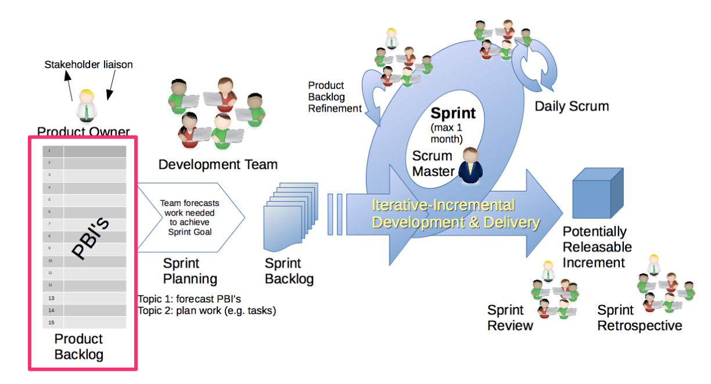
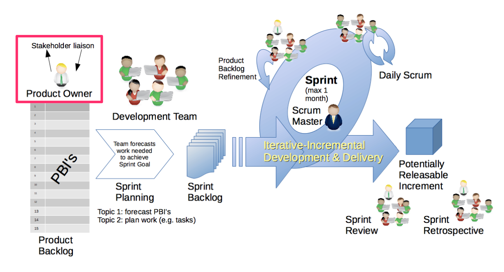
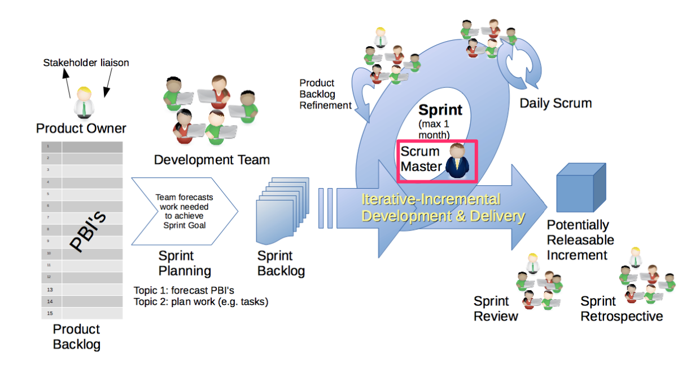
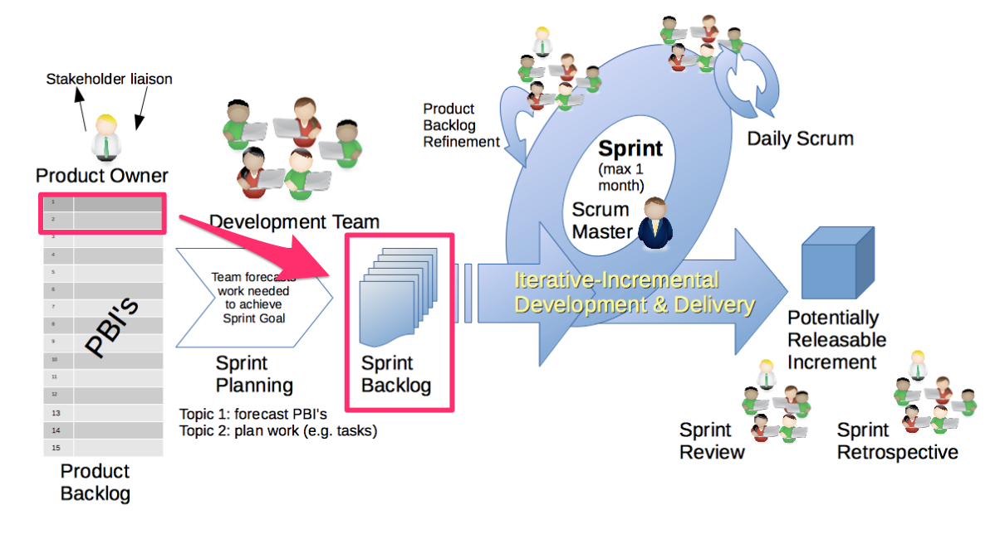
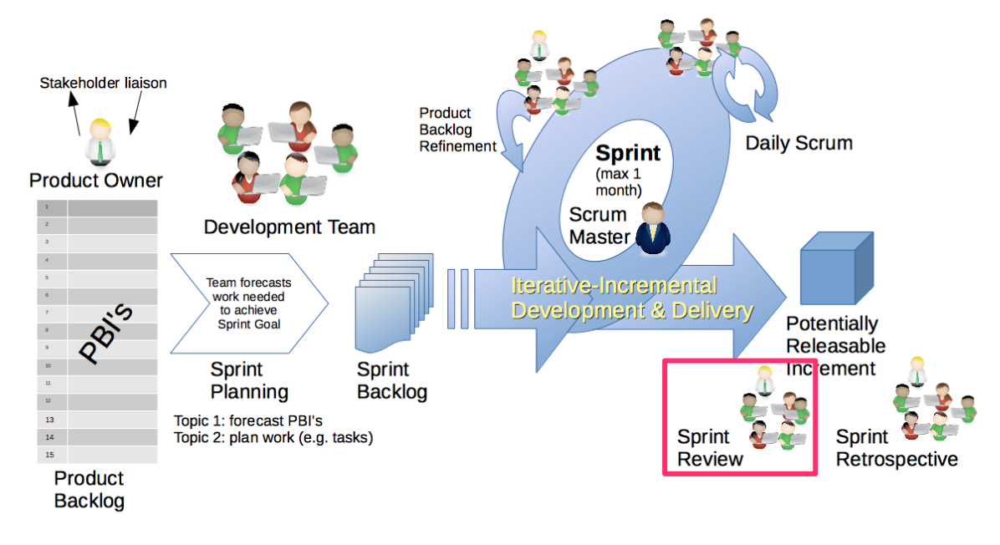
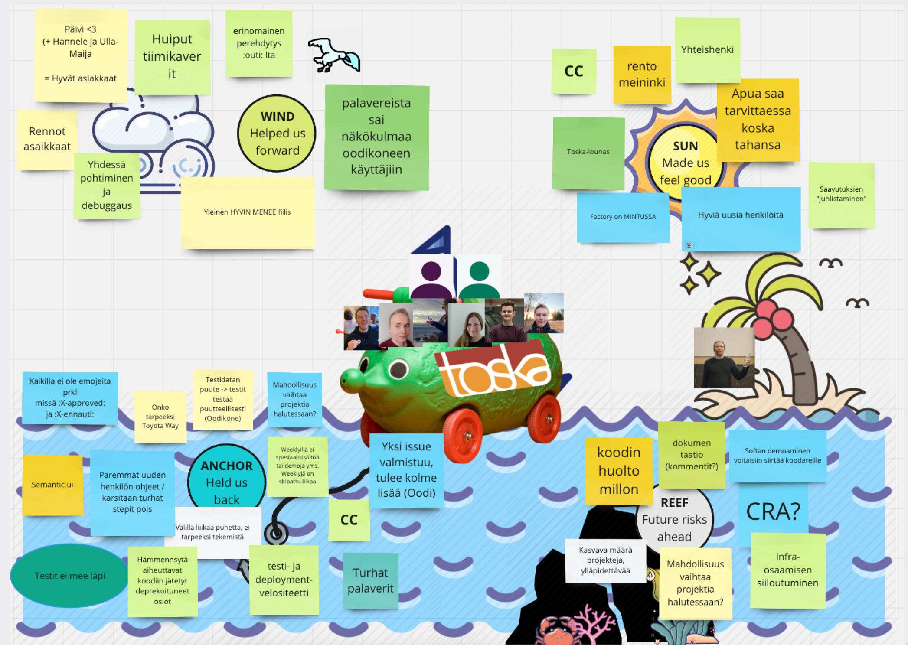

% Ohjelmistotuotanto

% Software production

Translations of % Ohjelmistotuotanto
[ Suomi -> English ]

% Ohjelmistotuotanto
    % Software production, % Software manufacturing

% Matti Luukkainen ja ohjaajat Antti, Pooki, Riku, Sini, Taneli

% Matti Luukkainen and directors Antti, Pooki, Riku, Sini, Taneli

Translations of % Matti Luukkainen ja ohjaajat Antti, Pooki, Riku, Sini, Taneli
[ Suomi -> English ]

% Matti Luukkainen ja ohjaajat Antti, Pooki, Riku, Sini, Taneli
    % Matti Luukkainen and directors Antti, Pooki, Riku, Sini, Taneli, % Matti Luukkainen and the instructors Antti, Pooki, Riku, Sini, Taneli

% syksy 2024

% autumn 2024

Translations of % syksy 2024
[ Suomi -> English ]

% syksy 2024
    % autumn 2024, % fall 2024

#

#

                                      Luento 2

                                     Lecture 2

                                    5.11.2024

                                    5.11.2024

# Kurssipalaute

# Course feedback

Translations of # Kurssipalaute
[ Suomi -> English ]

# Kurssipalaute
    # Course feedback, # Lesson feedback

- Kurssipalaute

- Course feedback

Translations of - Kurssipalaute
[ Suomi -> English ]

- Kurssipalaute
    - Course feedback, - Lesson feedback

- Kurssilla lopussa kerättävän palautteen lisäksi ns.  jatkuva palaute https://norppa.helsinki.fi

- In addition to the feedback collected at the end of the course, the so-called continuous feedback https://norppa.helsinki.fi

Translations of - Kurssilla lopussa kerättävän palautteen lisäksi ns.  jatkuva palaute https://norppa.helsinki.fi
[ Suomi -> English ]

- Kurssilla lopussa kerättävän palautteen lisäksi ns.
    - In addition to the feedback collected at the end of the course, the so-called, - In addition to the feedback gathered at the end of the course, so-called
jatkuva palaute https://norppa.helsinki.fi
    continuous feedback https://norppa.helsinki.fi, ongoing feedback https://norppa.helsinki.fi

# Paja

# Straw

Definitions of # Paja
[ Español -> English ]

noun
    straw
        paja, pajita, popote, sorbete, pitillo
    thatch
        paja, techo de paja, cubierta de paja
    chaff
        paja, barcia, paja menuda, bagazo, burlas
    padding
        relleno, acolchado, paja
    waffle
        gofre, palabrería, paja, palabras
    masturbation
        masturbación, paja
    blow job
        mamada, paja, francés
    blah
        paja
    tap
        grifo, golpecito, llave, derivación, canilla, paja

# Paja
    # Straw, #straw

- BK107

- BK107

Translations of - BK107
[ Türkçe -> English ]

- BK107
    - BK107, –BK107

- ma 14-16

- ma 14-16

- to 13-15

- to 13-15

- pe 12-14 (8.11. poikkeuksellisesti klo 14-16)

- Friday 12-14 (8.11. exceptionally from 14-16)

Translations of - pe 12-14 (8.11. poikkeuksellisesti klo 14-16)
[ Suomi -> English ]

- pe 12-14 (8.11. poikkeuksellisesti klo 14-16)
    - Friday 12-14 (8.11. exceptionally from 14-16), - Fri 12-14 (8.11. exceptionally 14-16)

# Miniprojektit

# Mini projects

Translations of # Miniprojektit
[ Suomi -> English ]

# Miniprojektit
    # Mini projects, # Mini-projects

- Käynnistyvät 11.11 alkavalla viikolla

- Will start in the week starting 11.11

Translations of - Käynnistyvät 11.11 alkavalla viikolla
[ Suomi -> English ]

- Käynnistyvät 11.11 alkavalla viikolla
    - Will start in the week starting 11.11, - Starts in the week starting 11.11

- **Ilmoittautumisen deadline su 10.11.  klo 23.59**

- **Registration deadline Sun 10.11. at 23:59**

Translations of - **Ilmoittautumisen deadline su 10.11.  klo 23.59**
[ Suomi -> English ]

- **Ilmoittautumisen deadline su 10.11.
    - **Registration deadline Sun 10.11., - **Deadline for registration Sun 10.11.
klo 23.59**
    at 23:59**, at 11:59 p.m.**

- Aloitustilaisuudet

- Opening ceremonies

Translations of - Aloitustilaisuudet
[ Suomi -> English ]

- Aloitustilaisuudet
    - Opening ceremonies, - Kick-off events

- ti 14-16

- of 14-16

Translations of - ti 14-16
[ Yorùbá -> English ]

- ti 14-16
    - of 14-16, - from 14 to 16

- ke 14-16

- the 14-16

Translations of - ke 14-16
[ ʻŌlelo Hawaiʻi -> English ]

- ke 14-16
    - the 14-16, - 14-16

- ke 16-18

- when 16-18

Translations of - ke 16-18
[ ʻŌlelo Hawaiʻi -> English ]

- ke 16-18
    - when 16-18, - 16-18

- to 10-12

- to 10-12

- to 14-16

- to 14-16

- Seuraavat viikot: sprinttien katselmus ja suunnittelu samassa aikaikkunassa

- Next weeks: review and planning of sprints in the same time window

Translations of - Seuraavat viikot: sprinttien katselmus ja suunnittelu samassa aikaikkunassa
[ Suomi -> English ]

- Seuraavat viikot: sprinttien katselmus ja suunnittelu samassa aikaikkunassa
    - Next weeks: review and planning of sprints in the same time window, - The following weeks: sprint review and planning in the same time window

- Loppudemot

- End of life

Translations of - Loppudemot
[ Svenska -> English ]

- Loppudemot
    - End of life, - Lopmodemot

- ke 11.12.  klo 12-14 B123

- to 11.12. klo 12-14 B123

Translations of - ke 11.12.  klo 12-14 B123
[ Bahasa Indonesia -> English ]

- ke 11.12.
    - to 11.12., - 11.12.
klo 12-14 B123
    klo 12-14 B123, 12-14 B123

- to 12.12. klo 12-14 CK112

- to 12.12. klo 12-14 CK112

# Vesiputousmalli

# Waterfall model

Translations of # Vesiputousmalli
[ Suomi -> English ]

# Vesiputousmalli
    # Waterfall model, # Waterfall template

{ width=440 }

{ width=440 }

# Vesiputousmallin suurimmat ongelmat

# The biggest problems with the waterfall model

Translations of # Vesiputousmallin suurimmat ongelmat
[ Suomi -> English ]

# Vesiputousmallin suurimmat ongelmat
    # The biggest problems with the waterfall model, # The biggest issues with the waterfall model

. . .

. . .

- Vaatimukset mahdotonta määritellä tyhjentävästi heti alussa

- It is impossible to define the requirements exhaustively at the very beginning

Translations of - Vaatimukset mahdotonta määritellä tyhjentävästi heti alussa
[ Suomi -> English ]

- Vaatimukset mahdotonta määritellä tyhjentävästi heti alussa
    - It is impossible to define the requirements exhaustively at the very beginning, - It is impossible to define the requirements exhaustively right from the start

- asiakas ei ymmärrä vielä alussa mitä haluaa

- the customer doesn't understand what he wants at the beginning

Translations of - asiakas ei ymmärrä vielä alussa mitä haluaa
[ Suomi -> English ]

- asiakas ei ymmärrä vielä alussa mitä haluaa
    - the customer doesn't understand what he wants at the beginning, - the customer does not yet understand what he wants at the beginning

- bisnesympäristö muuttuu projektin kuluessa

- the business environment changes during the project

Translations of - bisnesympäristö muuttuu projektin kuluessa
[ Suomi -> English ]

- bisnesympäristö muuttuu projektin kuluessa
    - the business environment changes during the project, - the business environment changes during the course of the project

. . .

. . .

- Suunnittelu sillä tasolla, että ohjelmointi on suoraviivainen "rakennusvaihe" on mahdotonta

- Planning at the level that programming is a straightforward "building phase" is impossible

Translations of - Suunnittelu sillä tasolla, että ohjelmointi on suoraviivainen "rakennusvaihe" on mahdotonta
[ Suomi -> English ]

- Suunnittelu sillä tasolla, että ohjelmointi on suoraviivainen "rakennusvaihe" on mahdotonta
    - Planning at the level that programming is a straightforward "building phase" is impossible, - Designing at the level that programming is a straightforward "construction phase" is impossible

- ohjelmointi on osa suunnitteluprosessia, ohjelmakoodi on tuotteen lopullinen suunnitelma

- programming is part of the design process, the program code is the final design of the product

Translations of - ohjelmointi on osa suunnitteluprosessia, ohjelmakoodi on tuotteen lopullinen suunnitelma
[ Suomi -> English ]

- ohjelmointi on osa suunnitteluprosessia, ohjelmakoodi on tuotteen lopullinen suunnitelma
    - programming is part of the design process, the program code is the final design of the product, - programming is a part of the design process, the program code is the final plan of the product

. . .

. . .

- Suunnittelu taas on teknisesti haastavaa, riskejä sisältävää toimintaa

- Planning, on the other hand, is a technically challenging, risky activity

Translations of - Suunnittelu taas on teknisesti haastavaa, riskejä sisältävää toimintaa
[ Suomi -> English ]

- Suunnittelu taas on teknisesti haastavaa, riskejä sisältävää toimintaa
    - Planning, on the other hand, is a technically challenging, risky activity, - Planning, on the other hand, is a technically challenging activity that involves risks

. . .

. . .

- Lopussa tehtävä testaus paljastaa ongelmat liian myöhään

- The testing done at the end reveals the problems too late

Translations of - Lopussa tehtävä testaus paljastaa ongelmat liian myöhään
[ Suomi -> English ]

- Lopussa tehtävä testaus paljastaa ongelmat liian myöhään
    - The testing done at the end reveals the problems too late, - Testing at the end reveals problems too late

- onglemien korjaaminen voi edellyttää kalliita muutoksia

- fixing problems may require expensive changes

Translations of - onglemien korjaaminen voi edellyttää kalliita muutoksia
[ Suomi -> English ]

- onglemien korjaaminen voi edellyttää kalliita muutoksia
    - fixing problems may require expensive changes, - correcting problems may require expensive changes

# Ohjelmiston tuottaminen ei ole kontrolloitu prosessi

# Software production is not a controlled process

Translations of # Ohjelmiston tuottaminen ei ole kontrolloitu prosessi
[ Suomi -> English ]

# Ohjelmiston tuottaminen ei ole kontrolloitu prosessi
    # Software production is not a controlled process, # Producing the software is not a controlled process

- 90-luvun iteratiiviset prosessimallit korjaavat monia edellisen kalvon epäkohdista

- The iterative process models of the 90s correct many of the shortcomings of the previous film

Translations of - 90-luvun iteratiiviset prosessimallit korjaavat monia edellisen kalvon epäkohdista
[ Suomi -> English ]

- 90-luvun iteratiiviset prosessimallit korjaavat monia edellisen kalvon epäkohdista
    - The iterative process models of the 90s correct many of the shortcomings of the previous film, - The iterative process models of the 90s correct many of the flaws of the previous film

- Olivat edelleen tarkkoihin etukäteissuunnitelmiin perustuvia

- They were still based on precise advance plans

Translations of - Olivat edelleen tarkkoihin etukäteissuunnitelmiin perustuvia
[ Suomi -> English ]

- Olivat edelleen tarkkoihin etukäteissuunnitelmiin perustuvia
    - They were still based on precise advance plans, - They were still based on precise plans in advance

- Tarkka projektisuunnitelma ja sen noudattaminen

- Accurate project plan and its compliance

Translations of - Tarkka projektisuunnitelma ja sen noudattaminen
[ Suomi -> English ]

- Tarkka projektisuunnitelma ja sen noudattaminen
    - Accurate project plan and its compliance, - Exact project plan and its compliance

- Selkeä roolijako: projektipäälliköt, analyytikot, arkkitehdit, ohjelmoijat, testaajat

- Clear division of roles: project managers, analysts, architects, programmers, testers

Translations of - Selkeä roolijako: projektipäälliköt, analyytikot, arkkitehdit, ohjelmoijat, testaajat
[ Suomi -> English ]

- Selkeä roolijako: projektipäälliköt, analyytikot, arkkitehdit, ohjelmoijat, testaajat
    - Clear division of roles: project managers, analysts, architects, programmers, testers, - Clear role division: project managers, analysts, architects, programmers, testers

. . .

. . .

- eli ne olettivat että ohjelmistotuotanto on jossain määrin kontrolloitavissa oleva prosessi_

- i.e. they assumed that software production is a somewhat controllable process_

Translations of - eli ne olettivat että ohjelmistotuotanto on jossain määrin kontrolloitavissa oleva prosessi_
[ Suomi -> English ]

- eli ne olettivat että ohjelmistotuotanto on jossain määrin kontrolloitavissa oleva prosessi_
    - i.e. they assumed that software production is a somewhat controllable process_, - i.e. they assumed that Software Production is a process that can be controlled to some extent_

# Ketterien menetelmien perusolettamuksia

# Basic assumptions of agile methods

Translations of # Ketterien menetelmien perusolettamuksia
[ Suomi -> English ]

# Ketterien menetelmien perusolettamuksia
    # Basic assumptions of agile methods, # Basic assumptions of agile methodologies

. . .

. . .

- Useimmat ohjelmistoprojektit ovat laadultaan uniikkeja

- Most software projects are unique in quality

Translations of - Useimmat ohjelmistoprojektit ovat laadultaan uniikkeja
[ Suomi -> English ]

- Useimmat ohjelmistoprojektit ovat laadultaan uniikkeja
    - Most software projects are unique in quality, - Most of the software projects are unique in quality

- **Vaatimukset erilaiset** kuin millään jo tehdyllä ohjelmistolla

- **The requirements are different** than with any software already made

Translations of - **Vaatimukset erilaiset** kuin millään jo tehdyllä ohjelmistolla
[ Suomi -> English ]

- **Vaatimukset erilaiset** kuin millään jo tehdyllä ohjelmistolla
    - **The requirements are different** than with any software already made, - **Requirements different** than any software already made

- **Uusi tekijätiimi**, varustettu omanlaisilla kompetensseilla ja persoonallisuuksilla

- **New author team**, equipped with unique competencies and personalities

Translations of - **Uusi tekijätiimi**, varustettu omanlaisilla kompetensseilla ja persoonallisuuksilla
[ Suomi -> English ]

- **Uusi tekijätiimi**, varustettu omanlaisilla kompetensseilla ja persoonallisuuksilla
    - **New author team**, equipped with unique competencies and personalities, - **A new team of authors**, equipped with unique competencies and personalities

- **Toteutusteknologiat kehittyvät** tehdään todennäköisesti tavalla, joka ei ole kaikille tuttu

- **Implementation technologies are developing** will probably be done in a way that is not familiar to everyone

Translations of - **Toteutusteknologiat kehittyvät** tehdään todennäköisesti tavalla, joka ei ole kaikille tuttu
[ Suomi -> English ]

- **Toteutusteknologiat kehittyvät** tehdään todennäköisesti tavalla, joka ei ole kaikille tuttu
    - **Implementation technologies are developing** will probably be done in a way that is not familiar to everyone, - **Implementation technologies are developing** probably done in a way that is not familiar to everyone

. . .

. . .

- Järkevää lähteä oletuksesta että kyseessä ei ole _kontrolloitu prosessi_, joka voidaan tarkkaan etukäteen aikatauluttaa ja suunnitella

- It makes sense to start from the assumption that it is not a _controlled process_ that can be precisely scheduled and planned in advance

Translations of - Järkevää lähteä oletuksesta että kyseessä ei ole _kontrolloitu prosessi_, joka voidaan tarkkaan etukäteen aikatauluttaa ja suunnitella
[ Suomi -> English ]

- Järkevää lähteä oletuksesta että kyseessä ei ole _kontrolloitu prosessi_, joka voidaan tarkkaan etukäteen aikatauluttaa ja suunnitella
    - It makes sense to start from the assumption that it is not a _controlled process_ that can be precisely scheduled and planned in advance, - It makes sense to start from the assumption that it is not a _controlled process_ that can be precisely scheduled and planned beforehand

. . .

. . .

- Parempi ajatella _tuotekehitysprojektina_, jonka kontrollointiin sopii paremmin _empiirinen prosessi_ jonka periaatteina

- Better to think of it as a _product development project_, whose control is better suited to an _empirical process_ whose principles

Translations of - Parempi ajatella _tuotekehitysprojektina_, jonka kontrollointiin sopii paremmin _empiirinen prosessi_ jonka periaatteina
[ Suomi -> English ]

- Parempi ajatella _tuotekehitysprojektina_, jonka kontrollointiin sopii paremmin _empiirinen prosessi_ jonka periaatteina
    - Better to think of it as a _product development project_, whose control is better suited to an _empirical process_ whose principles, - Better to think of it as a _product development project_, the control of which is better suited to an _empirical process_, the principles of which

- _transparency_ läpinäkyvyys

- _transparency_ transparency

Translations of - _transparency_ läpinäkyvyys
[ Suomi -> English ]

- _transparency_ läpinäkyvyys
    - _transparency_ transparency, - transparency

- _inspection_ tarkkailu

- _inspection_ observation

Translations of - _inspection_ tarkkailu
[ Suomi -> English ]

- _inspection_ tarkkailu
    - _inspection_ observation, - _inspection_ monitoring

- _adaption_ mukauttaminen

- adaptation of _adaption_

Translations of - _adaption_ mukauttaminen
[ Suomi -> English ]

- _adaption_ mukauttaminen
    - adaptation of _adaption_, - _adaption_ adaptation

# Ketterien menetelmien perusolettamuksia

# Basic assumptions of agile methods

Translations of # Ketterien menetelmien perusolettamuksia
[ Suomi -> English ]

# Ketterien menetelmien perusolettamuksia
    # Basic assumptions of agile methods, # Basic assumptions of agile methodologies

- Tekijät yksilöitä: toimivat paremmin kun heihin luotetaan ja annetaan tiimille vapaus organisoida itse toimintansa

- Individuals: work better when they are trusted and the team is given the freedom to organize its own activities

Translations of - Tekijät yksilöitä: toimivat paremmin kun heihin luotetaan ja annetaan tiimille vapaus organisoida itse toimintansa
[ Suomi -> English ]

- Tekijät yksilöitä: toimivat paremmin kun heihin luotetaan ja annetaan tiimille vapaus organisoida itse toimintansa
    - Individuals: work better when they are trusted and the team is given the freedom to organize its own activities, - Individual contributors: work better when they are trusted and the team is given the freedom to organize its own activities

. . .

. . .

- Oletuksena että perinteinen command-and-control ja jako eri vastuualueisiin ei tuota optimaalista tulosta

- Assuming that traditional command-and-control and division into different areas of responsibility does not produce optimal results

Translations of - Oletuksena että perinteinen command-and-control ja jako eri vastuualueisiin ei tuota optimaalista tulosta
[ Suomi -> English ]

- Oletuksena että perinteinen command-and-control ja jako eri vastuualueisiin ei tuota optimaalista tulosta
    - Assuming that traditional command-and-control and division into different areas of responsibility does not produce optimal results, - On the assumption that the traditional command-and-control and division into different areas of responsibility does not produce an optimal result

. . .

. . .

- "The whole team"-periaate: tiimi kollektiivina vastuussa aikaansaannoksesta

- "The whole team" principle: the team as a collective is responsible for the achievement

Translations of - "The whole team"-periaate: tiimi kollektiivina vastuussa aikaansaannoksesta
[ Suomi -> English ]

- "The whole team"-periaate: tiimi kollektiivina vastuussa aikaansaannoksesta
    - "The whole team" principle: the team as a collective is responsible for the achievement, - "The whole team" principle: the team collectively responsible for the achievement

. . .

. . .

Ensimmäisellä luennolla käsitelty _ketterän manifesti_ heijastelee näitä olettamuksia

The _agile manifesto_ discussed in the first lecture reflects these assumptions

Translations of Ensimmäisellä luennolla käsitelty _ketterän manifesti_ heijastelee näitä olettamuksia
[ Suomi -> English ]

Ensimmäisellä luennolla käsitelty _ketterän manifesti_ heijastelee näitä olettamuksia
    The _agile manifesto_ discussed in the first lecture reflects these assumptions, The _agile manifesto_ covered in the first lecture reflects these assumptions

. . .

. . .

Ovatko nämä valideja olettamuksia?

Are these valid assumptions?

Translations of Ovatko nämä valideja olettamuksia?
[ Suomi -> English ]

Ovatko nämä valideja olettamuksia?
    Are these valid assumptions?, Are these valid hypotheses?

# Scrum

noun
    an ordered formation of players, used to restart play, in which the forwards of a team form up with arms interlocked and heads down, and push forward against a similar group from the opposing side. The ball is thrown into the scrum and the players try to gain possession of it by kicking it backward toward their own side.

    a set of practices used in agile project management that emphasize daily communication and the flexible reassessment of plans that are carried out in short, iterative phases of work.

verb
    form or take part in a scrum.
        - "the two men scrummed down together for University College, Dublin"

- Tutustumme kurssilla Scrumiin, joka on tällä hetkellä selvästi suosituin ketterä menetelmä/prosessimalli

- In the course, we get to know Scrum, which is currently clearly the most popular agile method/process model

Translations of - Tutustumme kurssilla Scrumiin, joka on tällä hetkellä selvästi suosituin ketterä menetelmä/prosessimalli
[ Suomi -> English ]

- Tutustumme kurssilla Scrumiin, joka on tällä hetkellä selvästi suosituin ketterä menetelmä/prosessimalli
    - In the course, we get to know Scrum, which is currently clearly the most popular agile method/process model, - In the course, we get to know Scrum, which is clearly the most popular agile method/process model at the moment

. . .

. . .

- Kehittäjiensä mukaa Scrum on

- According to its developers, Scrum is

Translations of - Kehittäjiensä mukaa Scrum on
[ Suomi -> English ]

- Kehittäjiensä mukaa Scrum on
    - According to its developers, Scrum is, - According to the developers, Scrum is

- menetelmäkehys

- method framework

Translations of - menetelmäkehys
[ Suomi -> English ]

- menetelmäkehys
    - method framework, - the method framework

- monimutkaisten ongelmien ratkaisuun

- for solving complex problems

Translations of - monimutkaisten ongelmien ratkaisuun
[ Suomi -> English ]

- monimutkaisten ongelmien ratkaisuun
    - for solving complex problems, - to the solution of complex problems

- tuottavalla, luovalla ja maksimaalisen arvoa tuottavalla tavalla

- in a productive, creative and maximum value generating way

Translations of - tuottavalla, luovalla ja maksimaalisen arvoa tuottavalla tavalla
[ Suomi -> English ]

- tuottavalla, luovalla ja maksimaalisen arvoa tuottavalla tavalla
    - in a productive, creative and maximum value generating way, - in a productive, creative and maximum value-producing manner

. . .

. . .

- Scrum on:

- Scrum on:

- kevyt (lightweight)

- lightweight

Translations of - kevyt (lightweight)
[ Suomi -> English ]

- kevyt (lightweight)
    - lightweight, - lightweight (lightweight)

- helppo ymmärtää

- easy to understand

Translations of - helppo ymmärtää
[ Suomi -> English ]

- helppo ymmärtää
    - easy to understand, - simple to understand

- mutta **äärimmäisen vaikea hallita** (extremely difficult to master)

- but **extremely difficult to master**

Translations of - mutta **äärimmäisen vaikea hallita** (extremely difficult to master)
[ Suomi -> English ]

- mutta **äärimmäisen vaikea hallita** (extremely difficult to master)
    - but **extremely difficult to master**, - but **extremely hard to master**

# Scrum kuvana

# Scrum for kids

Translations of # Scrum kuvana
[ chiShona -> English ]

# Scrum kuvana
    # Scrum for kids, # Scrum for children

{ width=440 }

{ width=440 }

# Scrum: roles, artifacts and events

# Scrum: roles, artifacts and events

Terminologiaa

Terminology

Definitions of Terminologiaa
[ Suomi -> English ]

noun
    terminology
        terminologia, oppisanasto, ammattisanasto
    nomenclature
        nimistö, terminologia

Terminologiaa
    Terminology, Some terminology

- Scrum määrittelee 3 erilaista **roolia**:

- Scrum defines 3 different **roles**:

Translations of - Scrum määrittelee 3 erilaista **roolia**:
[ Suomi -> English ]

- Scrum määrittelee 3 erilaista **roolia**:
    - Scrum defines 3 different **roles**:, - Scrum defines three different **roles**:

- Kehittäjä

- Developer

Definitions of - Kehittäjä
[ Suomi -> English ]

noun
    developer
        kehittäjä, kehite, rakentaja, aluerakentaja, grynderi
    generator
        generaattori, kehittäjä

- Kehittäjä
    - Developer, - The developer

- Scrum master

- Scrum master

- Product owner

- Product owner

. . .

. . .

- Scrumiin kuuluvat **artefaktit** eli ”konkreettiset asiat” ovat

- The **artifacts** that belong to Scrum, i.e. "concrete things" are

Translations of - Scrumiin kuuluvat **artefaktit** eli ”konkreettiset asiat” ovat
[ Suomi -> English ]

- Scrumiin kuuluvat **artefaktit** eli ”konkreettiset asiat” ovat
    - The **artifacts** that belong to Scrum, i.e. "concrete things" are, - The **artifacts** that belong to Scrum, i.e. "tangible things" are

- Product backlog eli projektin kehitysjono

- Product backlog, i.e. the project's development queue

Translations of - Product backlog eli projektin kehitysjono
[ Suomi -> English ]

- Product backlog eli projektin kehitysjono
    - Product backlog, i.e. the project's development queue, - Product backlog i.e. project development queue

- Sprint backlog eli sprintin tehtävälista

- Sprint backlog, i.e. sprint task list

Translations of - Sprint backlog eli sprintin tehtävälista
[ Suomi -> English ]

- Sprint backlog eli sprintin tehtävälista
    - Sprint backlog, i.e. sprint task list, - Sprint backlog i.e. the sprint task list

- Työn alla olevan ohjelmiston uudet versiot (product increment)

- New versions of the software under work (product increment)

Translations of - Työn alla olevan ohjelmiston uudet versiot (product increment)
[ Suomi -> English ]

- Työn alla olevan ohjelmiston uudet versiot (product increment)
    - New versions of the software under work (product increment), - New versions (product increment) of the software under work

. . .

. . .

- Scrumissa tekeminen rytmittyy sprintteihin eli 1-4 viikon mittaisiin iteraatioihin

- Doing things in Scrum is rhythmic in sprints, i.e. iterations lasting 1-4 weeks

Translations of - Scrumissa tekeminen rytmittyy sprintteihin eli 1-4 viikon mittaisiin iteraatioihin
[ Suomi -> English ]

- Scrumissa tekeminen rytmittyy sprintteihin eli 1-4 viikon mittaisiin iteraatioihin
    - Doing things in Scrum is rhythmic in sprints, i.e. iterations lasting 1-4 weeks, - Doing in Scrum is rhythmic in sprints, i.e. 1-4 week iterations

. . .

. . .

- Sprintteihin kuuluu muutamia **standardipalavereja** (events):

- Sprints include a few **standard meetings** (events):

Translations of - Sprintteihin kuuluu muutamia **standardipalavereja** (events):
[ Suomi -> English ]

- Sprintteihin kuuluu muutamia **standardipalavereja** (events):
    - Sprints include a few **standard meetings** (events):, - Sprints include several **standard meetings** (events):

- Sprintin suunnittelupalaveri

- Sprint planning meeting

Translations of - Sprintin suunnittelupalaveri
[ Suomi -> English ]

- Sprintin suunnittelupalaveri
    - Sprint planning meeting, - Sprint's design meeting

- Daily scrum -palaverit

- Daily Scrum meetings

Translations of - Daily scrum -palaverit
[ Suomi -> English ]

- Daily scrum -palaverit
    - Daily Scrum meetings, - Daily Scrum sessions

- Sprintin katselmointi

- Viewing Sprint

Translations of - Sprintin katselmointi
[ Suomi -> English ]

- Sprintin katselmointi
    - Viewing Sprint, - Sprint viewing

- Retrospektiivi

- Retrospective

Translations of - Retrospektiivi
[ Eesti -> English ]

- Retrospektiivi
    - Retrospective, - In retrospect

# Product backlog

# Product backlog

{ width=440 }

{ width=440 }

# Product backlog

# Product backlog

- Priorisoitu lista asiakkaan tuotteelle asettamista _vaatimuksista_

- A prioritized list of the customer's _requirements_ for the product

Translations of - Priorisoitu lista asiakkaan tuotteelle asettamista _vaatimuksista_
[ Suomi -> English ]

- Priorisoitu lista asiakkaan tuotteelle asettamista _vaatimuksista_
    - A prioritized list of the customer's _requirements_ for the product, - A prioritized list of _requirements_ set by the customer for the product

- asiakkaan tasolla olevia _arvoa tuottavia_ toiminnallisuuksia, kirjattuna asiakkaan ymmärtämällä kielellä

- customer-level _value-producing_ functionalities, recorded in a language the customer understands

Translations of - asiakkaan tasolla olevia _arvoa tuottavia_ toiminnallisuuksia, kirjattuna asiakkaan ymmärtämällä kielellä
[ Suomi -> English ]

- asiakkaan tasolla olevia _arvoa tuottavia_ toiminnallisuuksia, kirjattuna asiakkaan ymmärtämällä kielellä
    - customer-level _value-producing_ functionalities, recorded in a language the customer understands, - customer-level _value-generating_ functionalities, written in a language the customer understands

. . .

. . .

- Priorisoidun listan kärkipään vaatimukset valitaan toteutettavaksi seuraaviin sprintteihin

- The requirements at the top of the prioritized list are selected to be implemented in the following sprints

Translations of - Priorisoidun listan kärkipään vaatimukset valitaan toteutettavaksi seuraaviin sprintteihin
[ Suomi -> English ]

- Priorisoidun listan kärkipään vaatimukset valitaan toteutettavaksi seuraaviin sprintteihin
    - The requirements at the top of the prioritized list are selected to be implemented in the following sprints, - The requirements at the top of the prioritized list are selected to be implemented in the next sprints

- kirjattu tarkemmin kuin backlogin häntäpään vaatimukset

- recorded more precisely than the tail end requirements of the backlog

Translations of - kirjattu tarkemmin kuin backlogin häntäpään vaatimukset
[ Suomi -> English ]

- kirjattu tarkemmin kuin backlogin häntäpään vaatimukset
    - recorded more precisely than the tail end requirements of the backlog, - recorded in more detail than the backlog tail end requirements

. . .

. . .

- Vaatimukset ovat usein _estimoituja_ eli toteutuksen vaatima työmäärä on arvioitu

- The requirements are often _estimated_, i.e. the amount of work required by the implementation has been estimated

Translations of - Vaatimukset ovat usein _estimoituja_ eli toteutuksen vaatima työmäärä on arvioitu
[ Suomi -> English ]

- Vaatimukset ovat usein _estimoituja_ eli toteutuksen vaatima työmäärä on arvioitu
    - The requirements are often _estimated_, i.e. the amount of work required by the implementation has been estimated, - Requirements are often _estimated_, i.e. the amount of work required by the implementation is estimated

- Työmääräarviot tekee kehittäjätiimi

- Workload estimates are made by the development team

Translations of - Työmääräarviot tekee kehittäjätiimi
[ Suomi -> English ]

- Työmääräarviot tekee kehittäjätiimi
    - Workload estimates are made by the development team, - The workload estimates are made by the development team

. . .

. . .

- Scrum ei määrittele missä muodossa backlog ja siinä olevat vaatimukset esitetään

- Scrum does not define in what form the backlog and the requirements in it are presented

Translations of - Scrum ei määrittele missä muodossa backlog ja siinä olevat vaatimukset esitetään
[ Suomi -> English ]

- Scrum ei määrittele missä muodossa backlog ja siinä olevat vaatimukset esitetään
    - Scrum does not define in what form the backlog and the requirements in it are presented, - Scrum does not specify in which form the backlog and the requirements in it are presented

- nykyään käytetään usein _user story_ -formaattia

- nowadays the _user story_ format is often used

Translations of - nykyään käytetään usein _user story_ -formaattia
[ Suomi -> English ]

- nykyään käytetään usein _user story_ -formaattia
    - nowadays the _user story_ format is often used, - the _user story_ format is often used nowadays

# Product owner

# Product owner

{ width=440 }

{ width=440 }

# Product owner

# Product owner

- Scrumin mukaan kuka vaan voi milloin tahansa lisätä backlogiin vaatimuksia

- According to Scrum, anyone can add requirements to the backlog at any time

Translations of - Scrumin mukaan kuka vaan voi milloin tahansa lisätä backlogiin vaatimuksia
[ Suomi -> English ]

- Scrumin mukaan kuka vaan voi milloin tahansa lisätä backlogiin vaatimuksia
    - According to Scrum, anyone can add requirements to the backlog at any time, - According to Scrum, anyone can add requirements to the backlog anytime

- Backlogia priorisoi ainoastaan _product owner_ eli tuotteen omistaja

- Backlog is prioritized only by the _product owner_

Translations of - Backlogia priorisoi ainoastaan _product owner_ eli tuotteen omistaja
[ Suomi -> English ]

- Backlogia priorisoi ainoastaan _product owner_ eli tuotteen omistaja
    - Backlog is prioritized only by the _product owner_, - The backlog is prioritized only by the _product owner_

. . .

. . .

- Product owner on yksittäinen henkilö

- Product owner is an individual person

Translations of - Product owner on yksittäinen henkilö
[ Suomi -> English ]

- Product owner on yksittäinen henkilö
    - Product owner is an individual person, - A product owner is a single person

- Priorisointiin voi toki olla vaikuttamassa useampikin henkilö

- Of course, more than one person can influence the prioritization

Translations of - Priorisointiin voi toki olla vaikuttamassa useampikin henkilö
[ Suomi -> English ]

- Priorisointiin voi toki olla vaikuttamassa useampikin henkilö
    - Of course, more than one person can influence the prioritization, - Of course, there can be more than one person influencing the prioritization

- Product owner tekee lopulliset päätökset prioriteettien suhteen

- Product owner makes final decisions regarding priorities

Translations of - Product owner tekee lopulliset päätökset prioriteettien suhteen
[ Suomi -> English ]

- Product owner tekee lopulliset päätökset prioriteettien suhteen
    - Product owner makes final decisions regarding priorities, - The product owner makes the final decisions regarding priorities

. . .

. . .

- Product owner on vastuussa backlogista

- The product owner is responsible for the backlog

Translations of - Product owner on vastuussa backlogista
[ Suomi -> English ]

- Product owner on vastuussa backlogista
    - The product owner is responsible for the backlog, - Product owner is responsible for backlog

- Varmistaa että kehittäjätiimi ymmärtää toteutettavaksi valitut vaatimukset

- Ensures that the development team understands the requirements selected for implementation

Translations of - Varmistaa että kehittäjätiimi ymmärtää toteutettavaksi valitut vaatimukset
[ Suomi -> English ]

- Varmistaa että kehittäjätiimi ymmärtää toteutettavaksi valitut vaatimukset
    - Ensures that the development team understands the requirements selected for implementation, - Makes sure that the development team understands the requirements chosen for implementation

- Priorisoi vaatimukset maksimoiden asiakkaan tuotteesta saaman hyödyn/arvon

- Prioritize the requirements, maximizing the benefit/value the customer gets from the product

Translations of - Priorisoi vaatimukset maksimoiden asiakkaan tuotteesta saaman hyödyn/arvon
[ Suomi -> English ]

- Priorisoi vaatimukset maksimoiden asiakkaan tuotteesta saaman hyödyn/arvon
    - Prioritize the requirements, maximizing the benefit/value the customer gets from the product, - Prioritize requirements maximizing the benefit/value the customer gets from the product

# Scrum master

# Scrum master

{ width=440 }

{ width=440 }

# Scrum master

# Scrum master

- Tiimeillä on _scrum master_, eli henkilö joka huolehtii siitä että ohjelmistokehitys etenee sujuvasti

- Teams have a _scrum master_, i.e. a person who makes sure that software development progresses smoothly

Translations of - Tiimeillä on _scrum master_, eli henkilö joka huolehtii siitä että ohjelmistokehitys etenee sujuvasti
[ Suomi -> English ]

- Tiimeillä on _scrum master_, eli henkilö joka huolehtii siitä että ohjelmistokehitys etenee sujuvasti
    - Teams have a _scrum master_, i.e. a person who makes sure that software development progresses smoothly, - The teams have a _scrum master_, i.e. a person who makes sure that the software development progresses smoothly

. . .

. . .

- Ei perinteinen projektipäällikkö vaan _servant-leader_

- Not a traditional project manager but a _servant-leader_

Translations of - Ei perinteinen projektipäällikkö vaan _servant-leader_
[ Suomi -> English ]

- Ei perinteinen projektipäällikkö vaan _servant-leader_
    - Not a traditional project manager but a _servant-leader_, - Not a traditional project manager, but a _servant leader_

- järjestää Scrumiin liittyvät palaverit

- organizes meetings related to Scrum

Translations of - järjestää Scrumiin liittyvät palaverit
[ Suomi -> English ]

- järjestää Scrumiin liittyvät palaverit
    - organizes meetings related to Scrum, - organizes Scrum-related meetings

- huolehtii että Scrumia noudatetaan järkevällä tavalla

- ensures that Scrum is followed in a reasonable way

Translations of - huolehtii että Scrumia noudatetaan järkevällä tavalla
[ Suomi -> English ]

- huolehtii että Scrumia noudatetaan järkevällä tavalla
    - ensures that Scrum is followed in a reasonable way, - makes sure that Scrum is followed in a reasonable manner

- opastaa hyvien käytänteiden noudattamisessa

- guides in following good practices

Translations of - opastaa hyvien käytänteiden noudattamisessa
[ Suomi -> English ]

- opastaa hyvien käytänteiden noudattamisessa
    - guides in following good practices, - guides in the observance of good practices

- rohkaisee ja auttaa tiimiä itseorganisoitumisessa

- encourages and helps the team in self-organization

Translations of - rohkaisee ja auttaa tiimiä itseorganisoitumisessa
[ Suomi -> English ]

- rohkaisee ja auttaa tiimiä itseorganisoitumisessa
    - encourages and helps the team in self-organization, - encourages and helps the team self-organize

. . .

. . .

- Pyrkii poistamaan kehitystyön **esteitä**

- Strives to remove **obstacles** to development work

Translations of - Pyrkii poistamaan kehitystyön **esteitä**
[ Suomi -> English ]

- Pyrkii poistamaan kehitystyön **esteitä**
    - Strives to remove **obstacles** to development work, - Strives to remove the **obstacles** of the development work

- voi olla tiimistä riippumaton asia, jonka poistamiseksi scrum master joutuu neuvottelemaan yrityksen hallinnon kanssa

- can be a matter independent of the team, to eliminate which the Scrum master has to negotiate with the company administration

Translations of - voi olla tiimistä riippumaton asia, jonka poistamiseksi scrum master joutuu neuvottelemaan yrityksen hallinnon kanssa
[ Suomi -> English ]

- voi olla tiimistä riippumaton asia, jonka poistamiseksi scrum master joutuu neuvottelemaan yrityksen hallinnon kanssa
    - can be a matter independent of the team, to eliminate which the Scrum master has to negotiate with the company administration, - can be a matter independent of the team, to eliminate which the Scrum master has to negotiate with the company's management

- voi liittyä ryhmän työtapoihin, tällöin scrum master opastaa ryhmää toimimaan siten, että este poistuu

- can join the group's working methods, in which case the Scrum master guides the group to act in such a way that the obstacle is removed

Translations of - voi liittyä ryhmän työtapoihin, tällöin scrum master opastaa ryhmää toimimaan siten, että este poistuu
[ Suomi -> English ]

- voi liittyä ryhmän työtapoihin, tällöin scrum master opastaa ryhmää toimimaan siten, että este poistuu
    - can join the group's working methods, in which case the Scrum master guides the group to act in such a way that the obstacle is removed, - can join the working methods of the group, in which case the Scrum master guides the group to act in such a way that the obstacle is removed

. . .

. . .

- Scrum master tekee kaikkensa, jotta tiimillä olisi optimaaliset olosuhteen kehittää tuotetta

- The scrum master does everything to ensure that the team has optimal conditions to develop the product

Translations of - Scrum master tekee kaikkensa, jotta tiimillä olisi optimaaliset olosuhteen kehittää tuotetta
[ Suomi -> English ]

- Scrum master tekee kaikkensa, jotta tiimillä olisi optimaaliset olosuhteen kehittää tuotetta
    - The scrum master does everything to ensure that the team has optimal conditions to develop the product, - The scrum master does everything he can to ensure that the team has the optimal conditions to develop the product

# Kehittäjätiimi

# Development team

Translations of # Kehittäjätiimi
[ Suomi -> English ]

# Kehittäjätiimi
    # Development team, # The development team

{ width=440 }

{ width=440 }

# Kehittäjätiimi

# Development team

Translations of # Kehittäjätiimi
[ Suomi -> English ]

# Kehittäjätiimi
    # Development team, # The development team

- Kehittäjätiimi koostuu noin 3-9:stä henkilöstä, kaikista käytetään nimikettä developer

- The development team consists of approximately 3-9 people, all of whom use the title Developer

Translations of - Kehittäjätiimi koostuu noin 3-9:stä henkilöstä, kaikista käytetään nimikettä developer
[ Suomi -> English ]

- Kehittäjätiimi koostuu noin 3-9:stä henkilöstä, kaikista käytetään nimikettä developer
    - The development team consists of approximately 3-9 people, all of whom use the title Developer, - The development team consists of about 3-9 people, all of whom use the title Developer

- vaikka kaikilla nimike developer, voivat jotkut tiimin jäsenistä olla erikoistuneet omaan osa-alueeseensa

- although everyone has the title developer, some of the team members may be specialized in their own area

Translations of - vaikka kaikilla nimike developer, voivat jotkut tiimin jäsenistä olla erikoistuneet omaan osa-alueeseensa
[ Suomi -> English ]

- vaikka kaikilla nimike developer, voivat jotkut tiimin jäsenistä olla erikoistuneet omaan osa-alueeseensa
    - although everyone has the title developer, some of the team members may be specialized in their own area, - although everyone has the title developer, some team members may be specialized in their own area

. . .

. . .

- koko tiimi kantaa aina yhteisen vastuun kehitystyöstä

- the whole team always bears joint responsibility for the development work

Translations of - koko tiimi kantaa aina yhteisen vastuun kehitystyöstä
[ Suomi -> English ]

- koko tiimi kantaa aina yhteisen vastuun kehitystyöstä
    - the whole team always bears joint responsibility for the development work, - the entire team always bears joint responsibility for development work

. . .

. . .

- Oletuksena on että tiimin jäsenet työskentelevät tiimissä 100%:lla työajalla

- The assumption is that team members work in the team 100% of the time

Translations of - Oletuksena on että tiimin jäsenet työskentelevät tiimissä 100%:lla työajalla
[ Suomi -> English ]

- Oletuksena on että tiimin jäsenet työskentelevät tiimissä 100%:lla työajalla
    - The assumption is that team members work in the team 100% of the time, - It is assumed that the team members work in the team 100% of the time

. . .

. . .

- Tiimin tulee oletusarvoisesti työskennellä samassa paikassa, mieluiten yhteisessä tiimille varatussa avokonttorissa

- By default, the team should work in the same place, preferably in a common open office reserved for the team

Translations of - Tiimin tulee oletusarvoisesti työskennellä samassa paikassa, mieluiten yhteisessä tiimille varatussa avokonttorissa
[ Suomi -> English ]

- Tiimin tulee oletusarvoisesti työskennellä samassa paikassa, mieluiten yhteisessä tiimille varatussa avokonttorissa
    - By default, the team should work in the same place, preferably in a common open office reserved for the team, - By default, the team should work in the same place, preferably in a shared office space reserved for the team

- COVID ja sen jälkeinen hybridityöskentely aiheuttaneet haasteita...

- COVID and subsequent hybrid working caused challenges...

Translations of - COVID ja sen jälkeinen hybridityöskentely aiheuttaneet haasteita...
[ Suomi -> English ]

- COVID ja sen jälkeinen hybridityöskentely aiheuttaneet haasteita...
    - COVID and subsequent hybrid working caused challenges..., - COVID and the hybrid working that followed caused challenges...

# Kehittäjätiimi

# Development team

Translations of # Kehittäjätiimi
[ Suomi -> English ]

# Kehittäjätiimi
    # Development team, # The development team

- Tiimi on _cross-functional_, eli sen tulisi sisältää kaikki tarvittava osaaminen järjestelmän suunnitteluun, toteuttamiseen ja testaamiseen

- The team is _cross-functional_, i.e. it should include all the necessary expertise for planning, implementing and testing the system

Translations of - Tiimi on _cross-functional_, eli sen tulisi sisältää kaikki tarvittava osaaminen järjestelmän suunnitteluun, toteuttamiseen ja testaamiseen
[ Suomi -> English ]

- Tiimi on _cross-functional_, eli sen tulisi sisältää kaikki tarvittava osaaminen järjestelmän suunnitteluun, toteuttamiseen ja testaamiseen
    - The team is _cross-functional_, i.e. it should include all the necessary expertise for planning, implementing and testing the system, - The team is _cross-functional_, i.e. it should include all the necessary expertise for system planning, implementation and testing

. . .

. . .

- Kehitystiimiä ei johdeta ulkopuolelta

- The development team is not managed from the outside

Translations of - Kehitystiimiä ei johdeta ulkopuolelta
[ Suomi -> English ]

- Kehitystiimiä ei johdeta ulkopuolelta
    - The development team is not managed from the outside, - The development team is not led from outside

- päättää mihin tavoitteisiin se kussakin sprintissä sitoutuu, eli miten paljon vaatimuksia backlogilta valitaan sprintiin

- decide which goals it commits to in each sprint, i.e. how many requirements from the backlog are selected for the Sprint

Translations of - päättää mihin tavoitteisiin se kussakin sprintissä sitoutuu, eli miten paljon vaatimuksia backlogilta valitaan sprintiin
[ Suomi -> English ]

- päättää mihin tavoitteisiin se kussakin sprintissä sitoutuu, eli miten paljon vaatimuksia backlogilta valitaan sprintiin
    - decide which goals it commits to in each sprint, i.e. how many requirements from the backlog are selected for the Sprint, - decide which goals it commits to in each sprint, that is, how many requirements from the backlog are selected for the Sprint

- päättää myös (tiettyjen reunaehtojen puitteissa) itse miten se sprintin tavoiteen toteuttaa

- also decides (within certain boundary conditions) how to realize the sprint goal

Translations of - päättää myös (tiettyjen reunaehtojen puitteissa) itse miten se sprintin tavoiteen toteuttaa
[ Suomi -> English ]

- päättää myös (tiettyjen reunaehtojen puitteissa) itse miten se sprintin tavoiteen toteuttaa
    - also decides (within certain boundary conditions) how to realize the sprint goal, - also decides (within certain boundary conditions) himself how to realize the sprint goal

. . .

. . .

- Tiimi on siis _ itseorganisoituva _ (self organizing)

- So the team is _ self-organizing _ (self organizing)

Translations of - Tiimi on siis _ itseorganisoituva _ (self organizing)
[ Suomi -> English ]

- Tiimi on siis _ itseorganisoituva _ (self organizing)
    - So the team is _ self-organizing _ (self organizing), - The team is therefore _ self-organizing _ (self organizing)

# Sprintti

# Sprint

Translations of # Sprintti
[ Suomi -> English ]

# Sprintti
    # Sprint, # The sprint

{ width=440 }

{ width=440 }

# Sprintti

# Sprint

Translations of # Sprintti
[ Suomi -> English ]

# Sprintti
    # Sprint, # The sprint

- Scrumissa kehitystyö siis jakautuu 1-4 viikon mittaisiin iteraatioihin eli sprintteihin

- In Scrum, the development work is therefore divided into 1-4 week iterations, i.e. sprints

Translations of - Scrumissa kehitystyö siis jakautuu 1-4 viikon mittaisiin iteraatioihin eli sprintteihin
[ Suomi -> English ]

- Scrumissa kehitystyö siis jakautuu 1-4 viikon mittaisiin iteraatioihin eli sprintteihin
    - In Scrum, the development work is therefore divided into 1-4 week iterations, i.e. sprints, - In Scrum, the development work is thus divided into 1-4 week iterations, or sprints

- Sprintti on _time-boxed_, sitä ei missään olosuhteissa pidennetä

- The sprint is _time-boxed_, it cannot be extended under any circumstances

Translations of - Sprintti on _time-boxed_, sitä ei missään olosuhteissa pidennetä
[ Suomi -> English ]

- Sprintti on _time-boxed_, sitä ei missään olosuhteissa pidennetä
    - The sprint is _time-boxed_, it cannot be extended under any circumstances, - The sprint is _time-boxed_, under no circumstances will it be extended

. . .

. . .

- Jokaisen sprintin alussa tiimi valitsee projektin backlog lista sprintin aikana toteutettavat vaatimukset

- At the beginning of each sprint, the team selects the requirements to be implemented during the sprint from the project backlog list

Translations of - Jokaisen sprintin alussa tiimi valitsee projektin backlog lista sprintin aikana toteutettavat vaatimukset
[ Suomi -> English ]

- Jokaisen sprintin alussa tiimi valitsee projektin backlog lista sprintin aikana toteutettavat vaatimukset
    - At the beginning of each sprint, the team selects the requirements to be implemented during the sprint from the project backlog list, - At the beginning of each sprint, the team selects the project's backlog list of requirements to be implemented during the sprint

- Backlog on priorisoitu ja vaatimukset valitaan aina priorisoidun listan kärjestä

- The backlog is prioritized and the requirements are always selected from the top of the prioritized list

Translations of - Backlog on priorisoitu ja vaatimukset valitaan aina priorisoidun listan kärjestä
[ Suomi -> English ]

- Backlog on priorisoitu ja vaatimukset valitaan aina priorisoidun listan kärjestä
    - The backlog is prioritized and the requirements are always selected from the top of the prioritized list, - The backlog is prioritized and requirements are always chosen from the top of the prioritized list

- Product ownerin asettama prioriteettijärjestys määrää missä missä järjestyksessä asioita toteutetaan

- The order of priority set by the Product Owner determines in which order things are implemented

Translations of - Product ownerin asettama prioriteettijärjestys määrää missä missä järjestyksessä asioita toteutetaan
[ Suomi -> English ]

- Product ownerin asettama prioriteettijärjestys määrää missä missä järjestyksessä asioita toteutetaan
    - The order of priority set by the Product Owner determines in which order things are implemented, - The priority order set by the Product Owner determines in which order things are implemented

. . .

. . .

- Tiimi valitsee sprinttiin ainoastaan sen verran toteutettavaa minkä valmistumiseen se uskoo kykenevänsä sitoutumaan

- The team chooses only as much to implement for the sprint as it believes it can commit to completion

Translations of - Tiimi valitsee sprinttiin ainoastaan sen verran toteutettavaa minkä valmistumiseen se uskoo kykenevänsä sitoutumaan
[ Suomi -> English ]

- Tiimi valitsee sprinttiin ainoastaan sen verran toteutettavaa minkä valmistumiseen se uskoo kykenevänsä sitoutumaan
    - The team chooses only as much to implement for the sprint as it believes it can commit to completion, - The team only chooses to implement as much for the sprint as it believes it can commit to completing

. . .

. . .

- Sprintin aikana scrum-tiimi toteuttaa _itseorganisoidusti_ sprinttiin valitut ohjelmiston ominaisuudet

- During the sprint, the scrum team implements _self-organized_ the features of the software selected for the sprint

Translations of - Sprintin aikana scrum-tiimi toteuttaa _itseorganisoidusti_ sprinttiin valitut ohjelmiston ominaisuudet
[ Suomi -> English ]

- Sprintin aikana scrum-tiimi toteuttaa _itseorganisoidusti_ sprinttiin valitut ohjelmiston ominaisuudet
    - During the sprint, the scrum team implements _self-organized_ the features of the software selected for the sprint, - During the sprint, the scrum team implements the software features selected for the sprint in a _self-organized manner

- Sprintin aikana tiimille ei esitetä uusia vaatimuksia

- During the sprint, no new requirements are presented to the team

Translations of - Sprintin aikana tiimille ei esitetä uusia vaatimuksia
[ Suomi -> English ]

- Sprintin aikana tiimille ei esitetä uusia vaatimuksia
    - During the sprint, no new requirements are presented to the team, - No new requirements are presented to the team during the sprint

. . .

. . .

- Sprintin lopuksi tuotteesta on oltava olemassa _toimiva versio_ (potentially shippable product increment)

- At the end of the sprint, there must be a _working version_ of the product (potentially shippable product increment)

Translations of - Sprintin lopuksi tuotteesta on oltava olemassa _toimiva versio_ (potentially shippable product increment)
[ Suomi -> English ]

- Sprintin lopuksi tuotteesta on oltava olemassa _toimiva versio_ (potentially shippable product increment)
    - At the end of the sprint, there must be a _working version_ of the product (potentially shippable product increment), - At the end of the sprint, there must be a _working version_ (potentially shippable product increment) of the product.

# TAUKO

# PAUSE

Definitions of # TAUKO
[ Suomi -> English ]

noun
    break
        tauko, katkos, murtuma, keskeytys, murtuminen, muutos
    pause
        tauko, keskeytys, paussi, fermaatti
    interval
        intervalli, väli, aikaväli, väliaika, tauko, välimatka
    stop
        stop, pysäkki, pysäytys, pysähdys, pysäytin, tauko
    lull
        tauko, pysähdys, tyven, hiljainen kausi
    recess
        syvennys, välitunti, tauko, loma, alkovi, uumenet
    cessation
        lakkaaminen, keskeyttäminen, tauko
    interlude
        välisoitto, väliaika, välinäytös, tauko, katko
    respite
        hengähdystauko, lykkäys, helpotus, armonaika, tauko
    let-up
        pysähdys, tauko, hellittäminen
    time-out
        tauko, aikalisä

# TAUKO
    # PAUSE, # BREAK

# Definition of done

# Definition of done

- Jokaisessa sprintissä lopputuloksena toimiva, valmiiksi tehty osa ohjelmistoa

- In each sprint, a functional, ready-made part of the software is the end result

Translations of - Jokaisessa sprintissä lopputuloksena toimiva, valmiiksi tehty osa ohjelmistoa
[ Suomi -> English ]

- Jokaisessa sprintissä lopputuloksena toimiva, valmiiksi tehty osa ohjelmistoa
    - In each sprint, a functional, ready-made part of the software is the end result, - In each sprint, a working, ready-made part of the software is the final result

. . .

. . .

- Scrumissa on määriteltävä projektio tasolla definition of done: mitä tarkoittaa, että jokin vaatimus on toteutettu valmiiksi

- In Scrum, the projection must be defined at the definition of done level: what does it mean that a requirement has already been implemented

Translations of - Scrumissa on määriteltävä projektio tasolla definition of done: mitä tarkoittaa, että jokin vaatimus on toteutettu valmiiksi
[ Suomi -> English ]

- Scrumissa on määriteltävä projektio tasolla definition of done: mitä tarkoittaa, että jokin vaatimus on toteutettu valmiiksi
    - In Scrum, the projection must be defined at the definition of done level: what does it mean that a requirement has already been implemented, - In Scrum, the projection must be defined at the level of definition of done: what does it mean that a requirement has been implemented already

. . .

. . .

- Määritellään yleensä tarkoittamaan sitä, että vaatimus on

- Usually defined to mean that the requirement is

Translations of - Määritellään yleensä tarkoittamaan sitä, että vaatimus on
[ Suomi -> English ]

- Määritellään yleensä tarkoittamaan sitä, että vaatimus on
    - Usually defined to mean that the requirement is, - Usually defined to mean that the claim is

- _analysoitu, suunniteltu, ohjelmoitu, testattu, testaus automatisoitu, dokumentoitu, integroitu muuhun ohjelmistoon ja viety tuotantoympäristöön_

- _analyzed, designed, programmed, tested, testing automated, documented, integrated with other software and exported to the production environment_

Translations of - _analysoitu, suunniteltu, ohjelmoitu, testattu, testaus automatisoitu, dokumentoitu, integroitu muuhun ohjelmistoon ja viety tuotantoympäristöön_
[ Suomi -> English ]

- _analysoitu, suunniteltu, ohjelmoitu, testattu, testaus automatisoitu, dokumentoitu, integroitu muuhun ohjelmistoon ja viety tuotantoympäristöön_
    - _analyzed, designed, programmed, tested, testing automated, documented, integrated with other software and exported to the production environment_, - _analysed, planned, programmed, tested, testing automated, documented, integrated with other software and exported to the production environment_

. . .

. . .

- Jos Sprintissä on toteutettu joitain vaatimuksia puutteellisesti DoD:in kannalta, niitä ei tule raportoida valmiina

- If some requirements in the Sprint have been implemented incompletely from DoD's point of view, they should not be reported as ready

Translations of - Jos Sprintissä on toteutettu joitain vaatimuksia puutteellisesti DoD:in kannalta, niitä ei tule raportoida valmiina
[ Suomi -> English ]

- Jos Sprintissä on toteutettu joitain vaatimuksia puutteellisesti DoD:in kannalta, niitä ei tule raportoida valmiina
    - If some requirements in the Sprint have been implemented incompletely from DoD's point of view, they should not be reported as ready, - If in the Sprint some requirements have been implemented incompletely from DoD's point of view, they should not be reported as ready

. . .

. . .

- Jos sprintin aikana osoittautuu että tiimi ei ehdi toteuttamaan kaikkia vaatimuksia _laadusta ei tingitä_

- If during the sprint it turns out that the team does not have time to implement all the requirements _quality is not compromised_

Translations of - Jos sprintin aikana osoittautuu että tiimi ei ehdi toteuttamaan kaikkia vaatimuksia _laadusta ei tingitä_
[ Suomi -> English ]

- Jos sprintin aikana osoittautuu että tiimi ei ehdi toteuttamaan kaikkia vaatimuksia _laadusta ei tingitä_
    - If during the sprint it turns out that the team does not have time to implement all the requirements _quality is not compromised_, - If it turns out during the sprint that the team does not have time to implement all the requirements _quality is not compromised_

- osa vaatimuksista jätetään seuraavaan sprinttiin

- some requirements are left for the next sprint

Translations of - osa vaatimuksista jätetään seuraavaan sprinttiin
[ Suomi -> English ]

- osa vaatimuksista jätetään seuraavaan sprinttiin
    - some requirements are left for the next sprint, - some of the requirements are left to the next sprint

# Sprintin suunnittelu

# Sprint planning

Translations of # Sprintin suunnittelu
[ Suomi -> English ]

# Sprintin suunnittelu
    # Sprint planning, # Planning the Sprint

{ width=440 }

{ width=440 }

# Sprintin suunnittelu

# Sprint planning

Translations of # Sprintin suunnittelu
[ Suomi -> English ]

# Sprintin suunnittelu
    # Sprint planning, # Planning the Sprint

- Ennen jokaista sprinttiä järjestetään sprintin _ suunnittelukokous _

- Before each sprint, a sprint _ planning meeting _ is organized

Translations of - Ennen jokaista sprinttiä järjestetään sprintin _ suunnittelukokous _
[ Suomi -> English ]

- Ennen jokaista sprinttiä järjestetään sprintin _ suunnittelukokous _
    - Before each sprint, a sprint _ planning meeting _ is organized, - A sprint _ planning meeting _ is organized before each sprint

- Kokouksella kaksi tavoitetta, Scrumin sanoin _aiheetta_

- The meeting has two goals, in the words of Scrum _no topic_

Translations of - Kokouksella kaksi tavoitetta, Scrumin sanoin _aiheetta_
[ Suomi -> English ]

- Kokouksella kaksi tavoitetta, Scrumin sanoin _aiheetta_
    - The meeting has two goals, in the words of Scrum _no topic_, - The meeting has two objectives, in the words of Scrum _no subject_

. . .

. . .

- Ensimmäisen aihe on selvittää **mitä** sprintin aikana tehdään

- The subject of the first one is to find out **what** will be done during the sprint

Translations of - Ensimmäisen aihe on selvittää **mitä** sprintin aikana tehdään
[ Suomi -> English ]

- Ensimmäisen aihe on selvittää **mitä** sprintin aikana tehdään
    - The subject of the first one is to find out **what** will be done during the sprint, - The topic of the first one is to find out **what** is done during the sprint

- Product owner esittelee product backlogin kärjessä olevat vaatimukset

- The product owner presents the requirements at the top of the product backlog

Translations of - Product owner esittelee product backlogin kärjessä olevat vaatimukset
[ Suomi -> English ]

- Product owner esittelee product backlogin kärjessä olevat vaatimukset
    - The product owner presents the requirements at the top of the product backlog, - Product owner presents the top requirements of the product backlog

- Tiimin tulee olla selvillä siitä, mitä vaatimuksilla tarkoitetaan

- The team must be clear about what is meant by the requirements

Translations of - Tiimin tulee olla selvillä siitä, mitä vaatimuksilla tarkoitetaan
[ Suomi -> English ]

- Tiimin tulee olla selvillä siitä, mitä vaatimuksilla tarkoitetaan
    - The team must be clear about what is meant by the requirements, - The team should be clear about what the requirements mean

- Tiimi arvioi kuinka monta backlogin vaatimuksista se kykenee sprintin aikana toteuttamaan

- The team estimates how many of the backlog requirements it is able to implement during the sprint

Translations of - Tiimi arvioi kuinka monta backlogin vaatimuksista se kykenee sprintin aikana toteuttamaan
[ Suomi -> English ]

- Tiimi arvioi kuinka monta backlogin vaatimuksista se kykenee sprintin aikana toteuttamaan
    - The team estimates how many of the backlog requirements it is able to implement during the sprint, - The team evaluates how many of the backlog requirements it is able to fulfill during the sprint

# Sprintin suunnittelu

# Sprint planning

Translations of # Sprintin suunnittelu
[ Suomi -> English ]

# Sprintin suunnittelu
    # Sprint planning, # Planning the Sprint

- Suunnittelukokouksen toisena aiheena on selvittää **miten** sprintin tavoitteet saavutetaan

- The second topic of the planning meeting is to find out **how** the goals of the sprint will be achieved

Translations of - Suunnittelukokouksen toisena aiheena on selvittää **miten** sprintin tavoitteet saavutetaan
[ Suomi -> English ]

- Suunnittelukokouksen toisena aiheena on selvittää **miten** sprintin tavoitteet saavutetaan
    - The second topic of the planning meeting is to find out **how** the goals of the sprint will be achieved, - Another topic of the planning meeting is to find out **how** the goals of the sprint are achieved

. . .

. . .

- Tämä yleensä edellyttää että tiimi suunnittelee toteutettavaksi valitut vaatimukset tarvittavalla tasolla

- This usually requires that the team plans the requirements selected for implementation at the necessary level

Translations of - Tämä yleensä edellyttää että tiimi suunnittelee toteutettavaksi valitut vaatimukset tarvittavalla tasolla
[ Suomi -> English ]

- Tämä yleensä edellyttää että tiimi suunnittelee toteutettavaksi valitut vaatimukset tarvittavalla tasolla
    - This usually requires that the team plans the requirements selected for implementation at the necessary level, - This usually requires that the team plans the requirements selected to be implemented at the required level

- Aikaansaannoksena on usein lista teknisistä _tehtävistä_ (task), jotka sprintin aikana on toteutettava

- The time commitment is often a list of technical _tasks_ (task) that must be implemented during the sprint

Translations of - Aikaansaannoksena on usein lista teknisistä _tehtävistä_ (task), jotka sprintin aikana on toteutettava
[ Suomi -> English ]

- Aikaansaannoksena on usein lista teknisistä _tehtävistä_ (task), jotka sprintin aikana on toteutettava
    - The time commitment is often a list of technical _tasks_ (task) that must be implemented during the sprint, - The time limit is often a list of technical _tasks_ (tasks) that must be implemented during the sprint

. . .

. . .

- Suunnittelun aikana identifioidut tehtävät kirjataan _sprintin backlogiin_ eli sprintin tehtävälistaan

- The tasks identified during planning are recorded in the _sprint backlog_, i.e. the sprint task list

Translations of - Suunnittelun aikana identifioidut tehtävät kirjataan _sprintin backlogiin_ eli sprintin tehtävälistaan
[ Suomi -> English ]

- Suunnittelun aikana identifioidut tehtävät kirjataan _sprintin backlogiin_ eli sprintin tehtävälistaan
    - The tasks identified during planning are recorded in the _sprint backlog_, i.e. the sprint task list, - Tasks identified during planning are recorded in the _sprint's backlog_, i.e. the sprint's task list

. . .

. . .

Palaamme sprintin suunnitteluun tarkemmin ja konkreettisten esimerkkien kanssa torstaina

We will return to sprint planning in more detail and with concrete examples on Thursday

Translations of Palaamme sprintin suunnitteluun tarkemmin ja konkreettisten esimerkkien kanssa torstaina
[ Suomi -> English ]

Palaamme sprintin suunnitteluun tarkemmin ja konkreettisten esimerkkien kanssa torstaina
    We will return to sprint planning in more detail and with concrete examples on Thursday, We will come back to the sprint planning in more detail and with concrete examples on Thursday

# Sprintin suunnittelu: *product backlogilta sprint backlogille*

# Sprint planning: *from product backlog to Sprint backlog*

Translations of # Sprintin suunnittelu: *product backlogilta sprint backlogille*
[ Suomi -> English ]

# Sprintin suunnittelu: *product backlogilta sprint backlogille*
    # Sprint planning: *from product backlog to Sprint backlog*, # Planning the sprint: *from product backlog to sprint backlog*

{ width=440 }

{ width=440 }

# Daily scrum – päiväpalaveri

# Daily Scrum – daily meeting

Translations of # Daily scrum – päiväpalaveri
[ Suomi -> English ]

# Daily scrum – päiväpalaveri
    # Daily Scrum – daily meeting, # Daily Scrum – a day meeting

{ width=440 }

{ width=440 }

# Daily scrum – päiväpalaveri

# Daily Scrum – daily meeting

Translations of # Daily scrum – päiväpalaveri
[ Suomi -> English ]

# Daily scrum – päiväpalaveri
    # Daily Scrum – daily meeting, # Daily Scrum – a day meeting

- Jokainen päivä sprintin aikana aloitetaan _daily scrumilla_ eli korkeintaan 15 minuutin mittaisella palaverilla

- Each day during the sprint starts with a _daily scrum_, i.e. a meeting lasting no more than 15 minutes

Translations of - Jokainen päivä sprintin aikana aloitetaan _daily scrumilla_ eli korkeintaan 15 minuutin mittaisella palaverilla
[ Suomi -> English ]

- Jokainen päivä sprintin aikana aloitetaan _daily scrumilla_ eli korkeintaan 15 minuutin mittaisella palaverilla
    - Each day during the sprint starts with a _daily scrum_, i.e. a meeting lasting no more than 15 minutes, - Every day during the sprint starts with a _daily scrum_, i.e. with a meeting lasting no more than 15 minutes

- Aina samaan aikaan, samassa paikassa, kaikkien kehittäjien oltava paikalla

- Always at the same time, in the same place, all developers must be there

Translations of - Aina samaan aikaan, samassa paikassa, kaikkien kehittäjien oltava paikalla
[ Suomi -> English ]

- Aina samaan aikaan, samassa paikassa, kaikkien kehittäjien oltava paikalla
    - Always at the same time, in the same place, all developers must be there, - Always at the same time, in the same place, all the developers must be present

. . .

. . .

- Jokainen tiimin jäsen vastaa vuorollaan kolmeen kysymykseen

- Each team member answers three questions in turn

Translations of - Jokainen tiimin jäsen vastaa vuorollaan kolmeen kysymykseen
[ Suomi -> English ]

- Jokainen tiimin jäsen vastaa vuorollaan kolmeen kysymykseen
    - Each team member answers three questions in turn, - Each member of the team takes turns answering three questions

- Mitä sain aikaan edellisen tapaamisen jälkeen?

- What did I accomplish after the last meeting?

Translations of - Mitä sain aikaan edellisen tapaamisen jälkeen?
[ Suomi -> English ]

- Mitä sain aikaan edellisen tapaamisen jälkeen?
    - What did I accomplish after the last meeting?, - What did I accomplish after the previous meeting?

- Mitä aion saada aikaan ennen seuraavaa tapaamista?

- What am I going to accomplish before the next meeting?

Translations of - Mitä aion saada aikaan ennen seuraavaa tapaamista?
[ Suomi -> English ]

- Mitä aion saada aikaan ennen seuraavaa tapaamista?
    - What am I going to accomplish before the next meeting?, - What will I accomplish before the next meeting?

- Mitä esteitä etenemiselläni on?

- What are the obstacles to my progress?

Translations of - Mitä esteitä etenemiselläni on?
[ Suomi -> English ]

- Mitä esteitä etenemiselläni on?
    - What are the obstacles to my progress?, - What obstacles are there in my progress?

. . .

. . .

- Kuka tahansa saa olla seuraamassa daily scrumia, mutta vain tiimin jäsenillä on puheoikeus

- Anyone can follow the daily scrum, but only team members have the right to speak

Translations of - Kuka tahansa saa olla seuraamassa daily scrumia, mutta vain tiimin jäsenillä on puheoikeus
[ Suomi -> English ]

- Kuka tahansa saa olla seuraamassa daily scrumia, mutta vain tiimin jäsenillä on puheoikeus
    - Anyone can follow the daily scrum, but only team members have the right to speak, - Anyone can be watching the daily scrum, but only team members have the right to speak

. . .

. . .

- Palaverin on tarkoitus olla lyhyt, muu keskustelu ei sallittua

- The meeting is supposed to be short, no other conversation is allowed

Translations of - Palaverin on tarkoitus olla lyhyt, muu keskustelu ei sallittua
[ Suomi -> English ]

- Palaverin on tarkoitus olla lyhyt, muu keskustelu ei sallittua
    - The meeting is supposed to be short, no other conversation is allowed, - The meeting is meant to be short, no other discussion is allowed

- Jos jollakin on ongelmia, scrum master keskustelee asianomaisen kanssa daily scrumin jälkeen

- If someone has problems, the Scrum master talks with the person concerned after the daily Scrum

Translations of - Jos jollakin on ongelmia, scrum master keskustelee asianomaisen kanssa daily scrumin jälkeen
[ Suomi -> English ]

- Jos jollakin on ongelmia, scrum master keskustelee asianomaisen kanssa daily scrumin jälkeen
    - If someone has problems, the Scrum master talks with the person concerned after the daily Scrum, - If someone has problems, the Scrum master will talk to the person concerned after the daily Scrum

. . .

. . .

- Jos muuhun palaverointiin tarvetta, tulee palaverit järjestää daily scrumista erillään

- If there is a need for other meetings, the meetings should be organized separately from the daily scrum

Translations of - Jos muuhun palaverointiin tarvetta, tulee palaverit järjestää daily scrumista erillään
[ Suomi -> English ]

- Jos muuhun palaverointiin tarvetta, tulee palaverit järjestää daily scrumista erillään
    - If there is a need for other meetings, the meetings should be organized separately from the daily scrum, - If there is a need for other meetings, meetings should be organized separately from daily scrum

# Sprintin katselmointi

# Sprint viewing

Translations of # Sprintin katselmointi
[ Suomi -> English ]

# Sprintin katselmointi
    # Sprint viewing, # Viewing the sprint

{ width=440 }

{ width=440 }

# Sprintin katselmointi

# Sprint viewing

Translations of # Sprintin katselmointi
[ Suomi -> English ]

# Sprintin katselmointi
    # Sprint viewing, # Viewing the sprint

- Sprintin päätteeksi järjestetään _ sprint review _ eli katselmointi

- Sprint review is organized at the end of the sprint

Translations of - Sprintin päätteeksi järjestetään _ sprint review _ eli katselmointi
[ Suomi -> English ]

- Sprintin päätteeksi järjestetään _ sprint review _ eli katselmointi
    - Sprint review is organized at the end of the sprint, - At the end of the Sprint, _ Sprint review _ is organized

- Katselmointiin voi osallistua kuka tahansa

- Anyone can participate in the viewing

Translations of - Katselmointiin voi osallistua kuka tahansa
[ Suomi -> English ]

- Katselmointiin voi osallistua kuka tahansa
    - Anyone can participate in the viewing, - Anyone can take part in viewing

. . .

. . .

- Tiimi esittelee sprintin aikaansaannoksia

- The team presents the achievements of the sprint

Translations of - Tiimi esittelee sprintin aikaansaannoksia
[ Suomi -> English ]

- Tiimi esittelee sprintin aikaansaannoksia
    - The team presents the achievements of the sprint, - The team presents the sprint achievements

- tarkastellaan/demotaan toteutettua toimivaa ohjelmistoa

- we look at/demo the implemented working software

Translations of - tarkastellaan/demotaan toteutettua toimivaa ohjelmistoa
[ Suomi -> English ]

- tarkastellaan/demotaan toteutettua toimivaa ohjelmistoa
    - we look at/demo the implemented working software, - the implemented working software is examined/demozed

. . .

. . .

- Scrum master huolehtii, että ainoastaan definition of donen mukaisesti toteutetut vaatimukset demotaan

- The scrum master ensures that only the requirements implemented according to the definition of done are demoted

Translations of - Scrum master huolehtii, että ainoastaan definition of donen mukaisesti toteutetut vaatimukset demotaan
[ Suomi -> English ]

- Scrum master huolehtii, että ainoastaan definition of donen mukaisesti toteutetut vaatimukset demotaan
    - The scrum master ensures that only the requirements implemented according to the definition of done are demoted, - The Scrum master ensures that only the requirements implemented in accordance with the definition of done are demoted

. . .

. . .

- Product owner varmistaa, mitkä vaatimuksista toteutettiin hyväksyttävällä tavalla

- The product owner verifies which of the requirements were implemented in an acceptable manner

Translations of - Product owner varmistaa, mitkä vaatimuksista toteutettiin hyväksyttävällä tavalla
[ Suomi -> English ]

- Product owner varmistaa, mitkä vaatimuksista toteutettiin hyväksyttävällä tavalla
    - The product owner verifies which of the requirements were implemented in an acceptable manner, - The product owner verifies which of the requirements were implemented in an acceptable way

- Ne vaatimukset joita ei hyväksytä toteutetuksi siirretään takaisin product backlogiin

- The requirements that are not accepted as implemented are moved back to the product backlog

Translations of - Ne vaatimukset joita ei hyväksytä toteutetuksi siirretään takaisin product backlogiin
[ Suomi -> English ]

- Ne vaatimukset joita ei hyväksytä toteutetuksi siirretään takaisin product backlogiin
    - The requirements that are not accepted as implemented are moved back to the product backlog, - The requirements that are not accepted as implemented are transferred back to the product backlog

# Sprintin katselmointi

# Sprint viewing

Translations of # Sprintin katselmointi
[ Suomi -> English ]

# Sprintin katselmointi
    # Sprint viewing, # Viewing the sprint

- Katselmoinnin aikana kuka tahansa saa antaa palautetta tuotteesta ja esim.  ehdottaa uusia vaatimuksia lisättäväksi product backlogiin

- During the viewing, anyone can give feedback about the product and e.g. suggests new requirements to be added to the product backlog

Translations of - Katselmoinnin aikana kuka tahansa saa antaa palautetta tuotteesta ja esim.  ehdottaa uusia vaatimuksia lisättäväksi product backlogiin
[ Suomi -> English ]

- Katselmoinnin aikana kuka tahansa saa antaa palautetta tuotteesta ja esim.
    - During the viewing, anyone can give feedback about the product and e.g., - During viewing, anyone can give feedback on the product and e.g.
ehdottaa uusia vaatimuksia lisättäväksi product backlogiin
    suggests new requirements to be added to the product backlog, propose new requirements to be added to the product backlog

. . .

. . .

- Katselmointi aiheuttaa usein myös tarpeen product backlogin uudelleenpriorisoimiseen

- Viewing often also causes the need to reprioritize the product backlog

Translations of - Katselmointi aiheuttaa usein myös tarpeen product backlogin uudelleenpriorisoimiseen
[ Suomi -> English ]

- Katselmointi aiheuttaa usein myös tarpeen product backlogin uudelleenpriorisoimiseen
    - Viewing often also causes the need to reprioritize the product backlog, - Review often also causes the need to reprioritize the product backlog

# Retrospektiivi

# Retrospective

Translations of # Retrospektiivi
[ Eesti -> English ]

# Retrospektiivi
    # Retrospective, # In retrospect

{ width=440 }

{ width=440 }

# Retrospektiivi

# Retrospective

Translations of # Retrospektiivi
[ Eesti -> English ]

# Retrospektiivi
    # Retrospective, # In retrospect

- _Retrospektiivi_ on sprintin katselmoinnin ja seuraavan sprintin alun välissä pidettävä palaveri, jonka aikana tiimi tarkastelee omaa työskentelyprosessiaan

- _Retrospective_ is a meeting held between the sprint review and the start of the next sprint, during which the team examines its own working process

Translations of - _Retrospektiivi_ on sprintin katselmoinnin ja seuraavan sprintin alun välissä pidettävä palaveri, jonka aikana tiimi tarkastelee omaa työskentelyprosessiaan
[ Suomi -> English ]

- _Retrospektiivi_ on sprintin katselmoinnin ja seuraavan sprintin alun välissä pidettävä palaveri, jonka aikana tiimi tarkastelee omaa työskentelyprosessiaan
    - _Retrospective_ is a meeting held between the sprint review and the start of the next sprint, during which the team examines its own working process, - _Retrospective_ is a meeting held between the review of the sprint and the start of the next sprint, during which the team reviews its own working process

. . .

. . .

- Identifioidaan mikä meni hyvin ja missä asioissa on parantamisen varaa

- We identify what went well and where there is room for improvement

Translations of - Identifioidaan mikä meni hyvin ja missä asioissa on parantamisen varaa
[ Suomi -> English ]

- Identifioidaan mikä meni hyvin ja missä asioissa on parantamisen varaa
    - We identify what went well and where there is room for improvement, - We will identify what went well and in which areas there is room for improvement

. . .

. . .

- Mietitään ratkaisuja ongelmakohtiin, joita pyritään korjaamaan seuraavan sprintin aikana

- Let's think about solutions to problem areas, which we aim to fix during the next sprint

Translations of - Mietitään ratkaisuja ongelmakohtiin, joita pyritään korjaamaan seuraavan sprintin aikana
[ Suomi -> English ]

- Mietitään ratkaisuja ongelmakohtiin, joita pyritään korjaamaan seuraavan sprintin aikana
    - Let's think about solutions to problem areas, which we aim to fix during the next sprint, - Let's think about solutions to problem areas, which will be corrected during the next sprint

# Retrospektiivi

# Retrospective

Translations of # Retrospektiivi
[ Eesti -> English ]

# Retrospektiivi
    # Retrospective, # In retrospect

{ width=440 }

{ width=440 }

# Transparency - inspect - adapt

# Transparency - inspect - adapt

- Scrumin taustaperiaatteet ovat

- The underlying principles of Scrum are

Translations of - Scrumin taustaperiaatteet ovat
[ Suomi -> English ]

- Scrumin taustaperiaatteet ovat
    - The underlying principles of Scrum are, - The basic principles of Scrum are

- _transparency_ (läpinäkyvyys)

- _transparency_ (transparency)

Translations of - _transparency_ (läpinäkyvyys)
[ Suomi -> English ]

- _transparency_ (läpinäkyvyys)
    - _transparency_ (transparency), - _transparency_

- _inspection_ (tarkkailu)

- _inspection_ (observation)

Translations of - _inspection_ (tarkkailu)
[ Suomi -> English ]

- _inspection_ (tarkkailu)
    - _inspection_ (observation), - _inspection_

- _adaption_ (mukauttaminen)

- _adaption_ (adaptation)

Translations of - _adaption_ (mukauttaminen)
[ Suomi -> English ]

- _adaption_ (mukauttaminen)
    - _adaption_ (adaptation), - _adaption_

. . .

. . .

- Asioiden läpinäkyvyys mahdollistaa niiden jatkuvan tarkkailun

- The transparency of things enables them to be constantly monitored

Translations of - Asioiden läpinäkyvyys mahdollistaa niiden jatkuvan tarkkailun
[ Suomi -> English ]

- Asioiden läpinäkyvyys mahdollistaa niiden jatkuvan tarkkailun
    - The transparency of things enables them to be constantly monitored, - The transparency of things enables them to be monitored continuously

- ja sen seurauksena toimintatapoja ja kehitettävää tuotetta on mahdollista mukauttaa

- and as a result, it is possible to adapt the operating methods and the product being developed

Translations of - ja sen seurauksena toimintatapoja ja kehitettävää tuotetta on mahdollista mukauttaa
[ Suomi -> English ]

- ja sen seurauksena toimintatapoja ja kehitettävää tuotetta on mahdollista mukauttaa
    - and as a result, it is possible to adapt the operating methods and the product being developed, - and as a result, it is possible to adapt the operating methods and the product under development

. . .

. . .

- Läpinäkyvyys: backlogit, daily scrum, definition of done, sprintin katselmointi, product increment...

- Transparency: backlogs, daily scrum, definition of done, sprint review, product increment...

Translations of - Läpinäkyvyys: backlogit, daily scrum, definition of done, sprintin katselmointi, product increment...
[ Suomi -> English ]

- Läpinäkyvyys: backlogit, daily scrum, definition of done, sprintin katselmointi, product increment...
    - Transparency: backlogs, daily scrum, definition of done, sprint review, product increment..., - Transparency: backlogs, daily scrum, definition of done, sprint viewing, product increment...

. . .

. . .

- Lyhyt kehityssykli mahdollistaa sekä tuotteen että toimintatapojen nopean inkrementaalisen parantamisen

- A short development cycle enables rapid incremental improvement of both the product and the operating methods

Translations of - Lyhyt kehityssykli mahdollistaa sekä tuotteen että toimintatapojen nopean inkrementaalisen parantamisen
[ Suomi -> English ]

- Lyhyt kehityssykli mahdollistaa sekä tuotteen että toimintatapojen nopean inkrementaalisen parantamisen
    - A short development cycle enables rapid incremental improvement of both the product and the operating methods, - The short development cycle enables fast incremental improvement of both the product and the operating methods

- backlogia uudelleenpriorisoidaan ja muokataan palautteen sekä opitun perusteella

- the backlog is reprioritized and edited based on feedback and lessons learned

Translations of - backlogia uudelleenpriorisoidaan ja muokataan palautteen sekä opitun perusteella
[ Suomi -> English ]

- backlogia uudelleenpriorisoidaan ja muokataan palautteen sekä opitun perusteella
    - the backlog is reprioritized and edited based on feedback and lessons learned, - the backlog is re-prioritised and modified based on feedback and lessons learned

- retrospektiivi kannustaa tiimiä jatkuvasti parantamaan työprosessiaan

- the retrospective encourages the team to continuously improve their work process

Translations of - retrospektiivi kannustaa tiimiä jatkuvasti parantamaan työprosessiaan
[ Suomi -> English ]

- retrospektiivi kannustaa tiimiä jatkuvasti parantamaan työprosessiaan
    - the retrospective encourages the team to continuously improve their work process, - the retrospective encourages the team to constantly improve its work process

# Scrumin arvot

# The values of Scrum

Translations of # Scrumin arvot
[ Suomi -> English ]

# Scrumin arvot
    # The values of Scrum, # Scrum's values

- Scrum sisältää joukon _arvoja_ joiden noudattamista se pitää oleellisena: _commitment, focus, courage, respect_

- Scrum contains a set of _values_ whose observance it considers essential: _commitment, focus, courage, respect_

Translations of - Scrum sisältää joukon _arvoja_ joiden noudattamista se pitää oleellisena: _commitment, focus, courage, respect_
[ Suomi -> English ]

- Scrum sisältää joukon _arvoja_ joiden noudattamista se pitää oleellisena: _commitment, focus, courage, respect_
    - Scrum contains a set of _values_ whose observance it considers essential: _commitment, focus, courage, respect_, - Scrum contains a set of _values_ which it considers essential to follow: _commitment, focus, courage, respect_

. . .

. . .

- tiimin tulee olla _sitoutunut_ (commitment) yhteisen tavoitteen saavuttamiseksi

- the team must be _committed_ (commitment) to achieve the common goal

Translations of - tiimin tulee olla _sitoutunut_ (commitment) yhteisen tavoitteen saavuttamiseksi
[ Suomi -> English ]

- tiimin tulee olla _sitoutunut_ (commitment) yhteisen tavoitteen saavuttamiseksi
    - the team must be _committed_ (commitment) to achieve the common goal, - the team must be _committed_ to achieve a common goal

. . .

. . .

- ja _fokusoitua_ (focus) oikeiden asioiden tekemiseen

- and to _focus_ on doing the right things

Translations of - ja _fokusoitua_ (focus) oikeiden asioiden tekemiseen
[ Suomi -> English ]

- ja _fokusoitua_ (focus) oikeiden asioiden tekemiseen
    - and to _focus_ on doing the right things, - and to _focus_ (focus) on doing the right things

. . .

. . .

- tulee olla _rohkeutta_ (courage) tehdä päätöksiä ja kohdata myös vaikeimpia asioita

- you must have _courage_ to make decisions and face even the most difficult things

Translations of - tulee olla _rohkeutta_ (courage) tehdä päätöksiä ja kohdata myös vaikeimpia asioita
[ Suomi -> English ]

- tulee olla _rohkeutta_ (courage) tehdä päätöksiä ja kohdata myös vaikeimpia asioita
    - you must have _courage_ to make decisions and face even the most difficult things, - one must have _courage_ to make decisions and face even the most difficult issues

- tulee olla avoimia sekä onnistumisten että ongelmien suhteen

- must be open about both successes and problems

Translations of - tulee olla avoimia sekä onnistumisten että ongelmien suhteen
[ Suomi -> English ]

- tulee olla avoimia sekä onnistumisten että ongelmien suhteen
    - must be open about both successes and problems, - should be open to both successes and problems

. . .

. . .

- oleellista on _kunnioittaa_ (respect) koko ajan kaikkia kehitystiimin jäseniä sekä ohjelmiston sidosryhmiä

- it is essential to _respect_ all the members of the development team and the stakeholders of the software at all times

Translations of - oleellista on _kunnioittaa_ (respect) koko ajan kaikkia kehitystiimin jäseniä sekä ohjelmiston sidosryhmiä
[ Suomi -> English ]

- oleellista on _kunnioittaa_ (respect) koko ajan kaikkia kehitystiimin jäseniä sekä ohjelmiston sidosryhmiä
    - it is essential to _respect_ all the members of the development team and the stakeholders of the software at all times, - it is essential to _respect_ all the development team members and software stakeholders at all times

# Scrumin tehokas soveltaminen

# Effective application of Scrum

Translations of # Scrumin tehokas soveltaminen
[ Suomi -> English ]

# Scrumin tehokas soveltaminen
    # Effective application of Scrum, # Efficient application of scrum

- Jotta Scrum toimisi _tehokkaasti_, tarvitaan sen soveltamiseen sopiva asenne ja orientaatio, eli on noudatettava Scrumin arvoja

- In order for Scrum to work _effectively_, a suitable attitude and orientation are needed for its application, i.e. the values of Scrum must be followed

Translations of - Jotta Scrum toimisi _tehokkaasti_, tarvitaan sen soveltamiseen sopiva asenne ja orientaatio, eli on noudatettava Scrumin arvoja
[ Suomi -> English ]

- Jotta Scrum toimisi _tehokkaasti_, tarvitaan sen soveltamiseen sopiva asenne ja orientaatio, eli on noudatettava Scrumin arvoja
    - In order for Scrum to work _effectively_, a suitable attitude and orientation are needed for its application, i.e. the values of Scrum must be followed, - In order for Scrum to work _effectively_, an attitude and orientation suitable for its application are needed, i.e. the values of Scrum must be followed

. . .

. . .

- Scrumin tekemisen ei ole tarkoitus olla ainoastaan pelisäänöjen orjallista noudattamista

- Doing Scrum is not meant to be only slavishly following the rules of the game

Translations of - Scrumin tekemisen ei ole tarkoitus olla ainoastaan pelisäänöjen orjallista noudattamista
[ Suomi -> English ]

- Scrumin tekemisen ei ole tarkoitus olla ainoastaan pelisäänöjen orjallista noudattamista
    - Doing Scrum is not meant to be only slavishly following the rules of the game, - Doing Scrum is not meant to be only slavishly following the game rules

. . .

. . .

- Scrumin inspect-and-adapt (tarkkaile ja mukauta) -luonne ohjaa siihen, **tiimien on koko ajan mukautettava toimintaansa**

- The inspect-and-adapt nature of Scrum leads to **teams must constantly adapt their operations**

Translations of - Scrumin inspect-and-adapt (tarkkaile ja mukauta) -luonne ohjaa siihen, **tiimien on koko ajan mukautettava toimintaansa**
[ Suomi -> English ]

- Scrumin inspect-and-adapt (tarkkaile ja mukauta) -luonne ohjaa siihen, **tiimien on koko ajan mukautettava toimintaansa**
    - The inspect-and-adapt nature of Scrum leads to **teams must constantly adapt their operations**, - Scrum's inspect-and-adapt nature guides it, **teams must constantly adapt their actions**

. . .

. . .

- *Tiimien optimaalisen toiminnan kannalta on joskus parempi toimia jopa joidenkin Scrumin ohjeiden vastaisesti*

- *In terms of the optimal functioning of teams, it is sometimes better to act even against some Scrum guidelines*

Translations of - *Tiimien optimaalisen toiminnan kannalta on joskus parempi toimia jopa joidenkin Scrumin ohjeiden vastaisesti*
[ Suomi -> English ]

- *Tiimien optimaalisen toiminnan kannalta on joskus parempi toimia jopa joidenkin Scrumin ohjeiden vastaisesti*
    - *In terms of the optimal functioning of teams, it is sometimes better to act even against some Scrum guidelines*, - *In terms of the optimal functioning of the teams, it is sometimes better to act even against some Scrum instructions*

# Scrumin ongelmat

# Problems with Scrum

Translations of # Scrumin ongelmat
[ Suomi -> English ]

# Scrumin ongelmat
    # Problems with Scrum, # Scrum issues

- Scrum on osoittautunut monin paikoin paremmaksi tavaksi ohjelmistojen tuottamiseen kuin vesiputousmalli tai muut suunnitelmavetoiset mallit

- In many places, Scrum has proven to be a better way to produce software than the waterfall model or other plan-driven models

Translations of - Scrum on osoittautunut monin paikoin paremmaksi tavaksi ohjelmistojen tuottamiseen kuin vesiputousmalli tai muut suunnitelmavetoiset mallit
[ Suomi -> English ]

- Scrum on osoittautunut monin paikoin paremmaksi tavaksi ohjelmistojen tuottamiseen kuin vesiputousmalli tai muut suunnitelmavetoiset mallit
    - In many places, Scrum has proven to be a better way to produce software than the waterfall model or other plan-driven models, - Scrum has proven in many places to be a better method for producing software than the waterfall model or other plan-driven models

. . .

. . .

- Yleinen ratkaisu ohjelmistotuotannon ongelmiin se ei ole

- It is not a general solution to the problems of software production

Translations of - Yleinen ratkaisu ohjelmistotuotannon ongelmiin se ei ole
[ Suomi -> English ]

- Yleinen ratkaisu ohjelmistotuotannon ongelmiin se ei ole
    - It is not a general solution to the problems of software production, - It's not a general solution to software production problems

- Scrumin käytön yleistyessä myös epäonnistuneiden Scrum-projektien määrä kasvaa

- As the use of Scrum becomes more common, the number of failed Scrum projects also increases

Translations of - Scrumin käytön yleistyessä myös epäonnistuneiden Scrum-projektien määrä kasvaa
[ Suomi -> English ]

- Scrumin käytön yleistyessä myös epäonnistuneiden Scrum-projektien määrä kasvaa
    - As the use of Scrum becomes more common, the number of failed Scrum projects also increases, - As the use of Scrum becomes more common, the number of failed Scrum projects increases as well

. . .

. . .

- Yksi ongelmista on ns.  **scrumbut**

- One of the problems is the so-called **scrumbut**

Translations of - Yksi ongelmista on ns.  **scrumbut**
[ Suomi -> English ]

- Yksi ongelmista on ns.
    - One of the problems is the so-called, - One of the problems is the
**scrumbut**
    **scrumbut**, **scrumbs**

- We use Scrum, **but** having a Daily Scrum every day is too much overhead, so we only have one per week.

- We use Scrum, **but** having a Daily Scrum every day is too much overhead, so we only have one per week.

- We use Scrum, **but** retrospectives are a waste of time, so we don't do them.

- We use Scrum, **but** retrospectives are a waste of time, so we don't do them.

- We use Scrum, **but** we can't build a piece of functionality in two weeks, so our Sprints are 3 months long

- We use Scrum, **but** we can't build a piece of functionality in two weeks, so our Sprints are 3 months long

. . .

. . .

- Transparency-inspect-adapt voi vaarantua

- Transparency-inspect-adapt can be compromised

Translations of - Transparency-inspect-adapt voi vaarantua
[ Suomi -> English ]

- Transparency-inspect-adapt voi vaarantua
    - Transparency-inspect-adapt can be compromised, - Transparency-inspect-adapt could be compromised

# Scrumin ongelmia Robert Martinin listaamina

# Problems with Scrum as listed by Robert Martin

Translations of # Scrumin ongelmia Robert Martinin listaamina
[ Suomi -> English ]

# Scrumin ongelmia Robert Martinin listaamina
    # Problems with Scrum as listed by Robert Martin, # Scrum problems listed by Robert Martin

- No Technical Practices

- No Technical Practices

. . .

. . .

- Automated Testing

- Automated Testing

. . .

. . .

- Certification in CSM

- Certification in CSM

. . .

. . .

- Scrum Master sometimes turns into Project Manager

- Scrum Master sometimes turns into Project Manager

. . .

. . .

- Scrum carries an anti-management undercurrent: "Scrum over-emphasizes the role of the team as self-managing

- Scrum carries an anti-management undercurrent: "Scrum over-emphasizes the role of the team as self-managing

. . .

. . .

- Scrum and generic Agile have little to say about how to scale

- Scrum and generic Agile have little to say about how to scale

. . .

. . .

- Insufficient Guidance Regarding the Product Backlog

- Insufficient Guidance Regarding the Product Backlog

# Waterscrumfall

# Waterscrumfall

- Yleisesti raportoitu ongelma ketterään ohjelmistokehitykseen siirryttäessä on se, että muu organisaatio jää ennalleen

- A commonly reported problem when moving to agile software development is that the rest of the organization remains the same

Translations of - Yleisesti raportoitu ongelma ketterään ohjelmistokehitykseen siirryttäessä on se, että muu organisaatio jää ennalleen
[ Suomi -> English ]

- Yleisesti raportoitu ongelma ketterään ohjelmistokehitykseen siirryttäessä on se, että muu organisaatio jää ennalleen
    - A commonly reported problem when moving to agile software development is that the rest of the organization remains the same, - A commonly reported problem when transitioning to agile software development is that the rest of the organization remains the same

. . .

. . .

- Waterscrumfall

- Waterscrumfall

- ohjelmistokehitys tapahtuu Scrumia mukaillen

- software development takes place according to Scrum

Translations of - ohjelmistokehitys tapahtuu Scrumia mukaillen
[ Suomi -> English ]

- ohjelmistokehitys tapahtuu Scrumia mukaillen
    - software development takes place according to Scrum, - software development is done in accordance with Scrum

- budjetointi, vaatimusten hallinta sekä tuotantoonvienti etenevät edelleen vanhoja kontrolloituja prosesseja noudattaen

- budgeting, requirements management and production import continue to follow the old controlled processes

Translations of - budjetointi, vaatimusten hallinta sekä tuotantoonvienti etenevät edelleen vanhoja kontrolloituja prosesseja noudattaen
[ Suomi -> English ]

- budjetointi, vaatimusten hallinta sekä tuotantoonvienti etenevät edelleen vanhoja kontrolloituja prosesseja noudattaen
    - budgeting, requirements management and production import continue to follow the old controlled processes, - budgeting, requirements management and production import and export continue to follow the old controlled processes

. . .

. . .

- Päätetään alustava Scrumiin tutustumisemme menetelmän kehittäjien sanoihin:

- Let's conclude our preliminary introduction to Scrum with the words of the developers of the method:

Translations of - Päätetään alustava Scrumiin tutustumisemme menetelmän kehittäjien sanoihin:
[ Suomi -> English ]

- Päätetään alustava Scrumiin tutustumisemme menetelmän kehittäjien sanoihin:
    - Let's conclude our preliminary introduction to Scrum with the words of the developers of the method:, - Let's conclude our preliminary introduction to Scrum with the words of the method developers:

**Scrum is easy to undestand but extremely difficult to master**

**Scrum is easy to undestand but extremely difficult to master**
