% Ohjelmistotuotanto

% Software production

Translations of % Ohjelmistotuotanto
[ Suomi -> English ]

% Ohjelmistotuotanto
    % Software production, % Software manufacturing

% Matti Luukkainen ja ohjaajat Antti, Pooki, Riku, Sini, Taneli

% Matti Luukkainen and directors Antti, Pooki, Riku, Sini, Taneli

Translations of % Matti Luukkainen ja ohjaajat Antti, Pooki, Riku, Sini, Taneli
[ Suomi -> English ]

% Matti Luukkainen ja ohjaajat Antti, Pooki, Riku, Sini, Taneli
    % Matti Luukkainen and directors Antti, Pooki, Riku, Sini, Taneli, % Matti Luukkainen and the instructors Antti, Pooki, Riku, Sini, Taneli

% syksy 2024

% autumn 2024

Translations of % syksy 2024
[ Suomi -> English ]

% syksy 2024
    % autumn 2024, % fall 2024

#

#

                                      Luento 4

                                     Lecture 4

                                    8.11.2024

                                    8.11.2024

# Kurssipalaute

# Course feedback

Translations of # Kurssipalaute
[ Suomi -> English ]

# Kurssipalaute
    # Course feedback, # Lesson feedback

- Kurssipalaute

- Course feedback

Translations of - Kurssipalaute
[ Suomi -> English ]

- Kurssipalaute
    - Course feedback, - Lesson feedback

- Kurssilla lopussa kerättävän palautteen lisäksi ns.  jatkuva palaute https://norppa.helsinki.fi

- In addition to the feedback collected at the end of the course, the so-called continuous feedback https://norppa.helsinki.fi

Translations of - Kurssilla lopussa kerättävän palautteen lisäksi ns.  jatkuva palaute https://norppa.helsinki.fi
[ Suomi -> English ]

- Kurssilla lopussa kerättävän palautteen lisäksi ns.
    - In addition to the feedback collected at the end of the course, the so-called, - In addition to the feedback gathered at the end of the course, so-called
jatkuva palaute https://norppa.helsinki.fi
    continuous feedback https://norppa.helsinki.fi, ongoing feedback https://norppa.helsinki.fi

#

#

- Luennot

- Lectures

Definitions of - Luennot
[ Suomi -> English ]

noun
    lecture
        luento, esitelmä, saarna, nuhdesaarna, läksytys

- Luennot
    - Lectures, - The lectures

- huomenna klo 12-14 B123

- tomorrow from 12:00 to 14:00 B123

Translations of - huomenna klo 12-14 B123
[ Suomi -> English ]

- huomenna klo 12-14 B123
    - tomorrow from 12:00 to 14:00 B123, - tomorrow from 12-14 B123

- ensi viikosta alkaen ma ja ti 12-14 B123

- starting next week Mon and Tue 12-14 B123

Translations of - ensi viikosta alkaen ma ja ti 12-14 B123
[ Suomi -> English ]

- ensi viikosta alkaen ma ja ti 12-14 B123
    - starting next week Mon and Tue 12-14 B123, - starting next week, Mon and Tue 12-2 PM B123

- Pajaa salissa BK107

- Workshop in hall BK107

Translations of - Pajaa salissa BK107
[ Suomi -> English ]

- Pajaa salissa BK107
    - Workshop in hall BK107, - The workshop in hall BK107

- ma 14-16

- ma 14-16

- to 13-15

- to 13-15

- pe 12-14 (huomenna poikkeuksellisesti klo 14-16)

- Friday 12-14 (exceptionally tomorrow 14-16)

Translations of - pe 12-14 (huomenna poikkeuksellisesti klo 14-16)
[ Suomi -> English ]

- pe 12-14 (huomenna poikkeuksellisesti klo 14-16)
    - Friday 12-14 (exceptionally tomorrow 14-16), - Friday 12-2pm (exceptionally tomorrow 2-4pm)

# Miniprojektit

# Mini projects

Translations of # Miniprojektit
[ Suomi -> English ]

# Miniprojektit
    # Mini projects, # Mini-projects

- Käynnistyvät 11.11 alkavalla viikolla

- Will start in the week starting 11.11

Translations of - Käynnistyvät 11.11 alkavalla viikolla
[ Suomi -> English ]

- Käynnistyvät 11.11 alkavalla viikolla
    - Will start in the week starting 11.11, - Starts in the week starting 11.11

- **Ilmoittautumisen deadline su 10.11.  klo 23.59**

- **Registration deadline Sun 10.11. at 23:59**

Translations of - **Ilmoittautumisen deadline su 10.11.  klo 23.59**
[ Suomi -> English ]

- **Ilmoittautumisen deadline su 10.11.
    - **Registration deadline Sun 10.11., - **Deadline for registration Sun 10.11.
klo 23.59**
    at 23:59**, at 11:59 p.m.**

- Aloitustilaisuudet

- Opening ceremonies

Translations of - Aloitustilaisuudet
[ Suomi -> English ]

- Aloitustilaisuudet
    - Opening ceremonies, - Kick-off events

- ti 14-16

- of 14-16

Translations of - ti 14-16
[ Yorùbá -> English ]

- ti 14-16
    - of 14-16, - from 14 to 16

- ke 14-16

- the 14-16

Translations of - ke 14-16
[ ʻŌlelo Hawaiʻi -> English ]

- ke 14-16
    - the 14-16, - 14-16

- ke 16-18

- when 16-18

Translations of - ke 16-18
[ ʻŌlelo Hawaiʻi -> English ]

- ke 16-18
    - when 16-18, - 16-18

- to 10-12

- to 10-12

- to 14-16

- to 14-16

- Seuraavat viikot: sprinttien katselmus ja suunnittelu samassa aikaikkunassa

- Next weeks: review and planning of sprints in the same time window

Translations of - Seuraavat viikot: sprinttien katselmus ja suunnittelu samassa aikaikkunassa
[ Suomi -> English ]

- Seuraavat viikot: sprinttien katselmus ja suunnittelu samassa aikaikkunassa
    - Next weeks: review and planning of sprints in the same time window, - The following weeks: sprint review and planning in the same time window

- Loppudemot

- End of life

Translations of - Loppudemot
[ Svenska -> English ]

- Loppudemot
    - End of life, - Lopmodemot

- ke 11.12.  klo 12-14 B123

- to 11.12. klo 12-14 B123

Translations of - ke 11.12.  klo 12-14 B123
[ Bahasa Indonesia -> English ]

- ke 11.12.
    - to 11.12., - 11.12.
klo 12-14 B123
    klo 12-14 B123, 12-14 B123

- to 12.12. klo 12-14 CK112

- to 12.12. klo 12-14 CK112

# Nopea kertaus eiliseltä

# Quick recap from yesterday

Translations of # Nopea kertaus eiliseltä
[ Suomi -> English ]

# Nopea kertaus eiliseltä
    # Quick recap from yesterday, # Quick review from yesterday

- User story

- User story

- description

noun
    a spoken or written representation or account of a person, object, or event.
        - "people who had seen him were able to give a description"
    Synonyms: account, explanation, elucidation, illustration, representation, interpretation, chronicle, report, narration, narrative, story, recounting, rendition, relation, commentary, version, portrayal, portrait, word picture, evocation, details

    a sort, kind, or class of people or things.
        - "ships of every description"
    Synonyms: sort, variety, kind, style, type, category, order, breed, species, class, designation, specification, genre, genus, brand, make, character, ilk, kidney, grain, stamp, mold, stripe

Synonyms
    noun
        - account, explanation, elucidation, illustration, representation, interpretation, chronicle, report, narration, narrative, story, recounting, rendition, relation, commentary, version, portrayal, portrait, word picture, evocation, details
        - sort, variety, kind, style, type, category, order, breed, species, class, designation, specification, genre, genus, brand, make, character, ilk, kidney, grain, stamp, mold, stripe

- conversations

noun
    a talk, especially an informal one, between two or more people, in which news and ideas are exchanged.
        - "she picked up the phone and held a conversation in French"
    Synonyms: palaver, colloquy, converse

Synonyms
    noun
        - confabulation
        - confab, jaw, chitchat, rap, gas, powwow, chinwag, natter, rabbit, crack, bull session, skull session, gabfest, schmooze, convo, yarn
        - discussion, talk, chat, gossip, tête-à-tête, heart-to-heart, head-to-head, exchange, dialogue, parley, consultation, conference, adda, korero
        - palaver, colloquy, converse

See also
    conversation

- acceptance criteria

- acceptance criteria

. . .

. . .

- Hyvä user story: INVEST

- Good user story: INVEST

Translations of - Hyvä user story: INVEST
[ Suomi -> English ]

- Hyvä user story: INVEST
    - Good user story: INVEST, - A good user story: INVEST

. . .

. . .

- Estimointi

- Estimation

Translations of - Estimointi
[ Suomi -> English ]

- Estimointi
    - Estimation, - An estimate

- Miksi?  Kuka?  Miten?

- Why? Who? How?

Translations of - Miksi?  Kuka?  Miten?
[ Suomi -> English ]

- Miksi?
    - Why?, Why?
Kuka?
    Who?, Which?, who
Miten?
    How?, What?, how

. . .

. . .

- Product Backlog

- Product Backlog

- Kuka vastuussa?

- Who is responsible?

Translations of - Kuka vastuussa?
[ Suomi -> English ]

- Kuka vastuussa?
    - Who is responsible?, - Who's in charge?

- Miten saadaan projektin alussa muodostettua?

- How can we be formed at the beginning of the project?

Translations of - Miten saadaan projektin alussa muodostettua?
[ Suomi -> English ]

- Miten saadaan projektin alussa muodostettua?
    - How can we be formed at the beginning of the project?, - How do you get formed at the beginning of the project?

# Hyvä product backlog on DEEP

# A good product backlog is DEEP

Translations of # Hyvä product backlog on DEEP
[ Suomi -> English ]

# Hyvä product backlog on DEEP
    # A good product backlog is DEEP, # Good product backlog is DEEP

- Mike Cohn lanseerasi lyhenteen DEEP kuvaamaan hyvän backlogin ominaisuuksia

- Mike Cohn launched the acronym DEEP to describe the characteristics of a good backlog

Translations of - Mike Cohn lanseerasi lyhenteen DEEP kuvaamaan hyvän backlogin ominaisuuksia
[ Suomi -> English ]

- Mike Cohn lanseerasi lyhenteen DEEP kuvaamaan hyvän backlogin ominaisuuksia
    - Mike Cohn launched the acronym DEEP to describe the characteristics of a good backlog, - Mike Cohn launched the abbreviation DEEP to describe the characteristics of a good backlog

- Detailed appropriatly

- Detailed appropriatly

- Estimated

adjective
    (of a value or number) roughly calculated; approximate.
        - "an estimated cost of $1,000 million"

Synonyms
    verb
        - roughly calculate, approximate, make an estimate of, guess, evaluate, judge, gauge, reckon, rate, appraise, form an opinion of, form an impression of, get the measure of, determine, weigh up
        - size up, guesstimate
        - consider, believe, guess, reckon, deem, hold, judge, adjudge, surmise, rate, gauge, take, suppose, regard as being, view as being, see as being, class as being, think of as being, look on as being, be of the opinion, conjecture
        - opine

See also
    estimate

- Emergent

adjective
    in the process of coming into being or becoming prominent.
        - "blockchains are still an emergent technology"
    Synonyms: emerging, beginning, coming out, arising, dawning, developing, budding, burgeoning, embryonic, infant, fledgling, nascent, incipient, rising, promising, potential, up-and-coming

    of or denoting a plant which is taller than the surrounding vegetation, especially a tall tree in a forest.

noun
    an emergent property.
        - "knowledge is an emergent of this interactive process"

    an emergent tree or other plant.
        - "emergents tower above the top canopy"

Synonyms
    adjective
        - emerging, beginning, coming out, arising, dawning, developing, budding, burgeoning, embryonic, infant, fledgling, nascent, incipient, rising, promising, potential, up-and-coming

- Prioritized

verb
    designate or treat (something) as more important than other things.
        - "prioritize your credit card debt"

See also
    prioritize

#

#

- Estimated, Prioritized

- Estimated, Prioritized

. . .

. . .

- _Detailed appropriately_ eli sopivan detaljoitu

- _Detailed appropriately_

Translations of - _Detailed appropriately_ eli sopivan detaljoitu
[ Suomi -> English ]

- _Detailed appropriately_ eli sopivan detaljoitu
    - _Detailed appropriately_, - _Detailed appropriately_ i.e. appropriately detailed

- ylempänä tarkkoja

- more specific above

Translations of - ylempänä tarkkoja
[ Suomi -> English ]

- ylempänä tarkkoja
    - more specific above, - above, more specific

- alempana suurpiirteisempiä

- lower ones with larger features

Translations of - alempana suurpiirteisempiä
[ Suomi -> English ]

- alempana suurpiirteisempiä
    - lower ones with larger features, - below, more large-scale ones

{ width=350 }

{ width=350 }

#

#

- _Emergent_ kuvaa backlogin muuttuvaa luonnetta:

- _Emergent_ describes the changing nature of the backlog:

Translations of - _Emergent_ kuvaa backlogin muuttuvaa luonnetta:
[ Suomi -> English ]

- _Emergent_ kuvaa backlogin muuttuvaa luonnetta:
    - _Emergent_ describes the changing nature of the backlog:, - _Emergent_ describes the changing character of the backlog:

- uusia storyja tulee

- new stories will come

Translations of - uusia storyja tulee
[ Suomi -> English ]

- uusia storyja tulee
    - new stories will come, - there will be new stories

- vanhoja poistetaan, uudelleenpriorisoidaan ja uudelleenestimoidaan, muokataan ja pilkotaan

- old ones are deleted, re-prioritized and re-estimated, edited and chopped

Translations of - vanhoja poistetaan, uudelleenpriorisoidaan ja uudelleenestimoidaan, muokataan ja pilkotaan
[ Suomi -> English ]

- vanhoja poistetaan, uudelleenpriorisoidaan ja uudelleenestimoidaan, muokataan ja pilkotaan
    - old ones are deleted, re-prioritized and re-estimated, edited and chopped, - old ones are deleted, re-prioritised and re-estimated, modified and chopped

. . .

. . .

- Muuttuvan luonteen takia backlogia tulee hoitaa projektin edetessä (engl. backlog refinement/grooming)

- Due to its changing nature, the backlog must be handled as the project progresses (eng. backlog refinement/grooming)

Translations of - Muuttuvan luonteen takia backlogia tulee hoitaa projektin edetessä (engl. backlog refinement/grooming)
[ Suomi -> English ]

- Muuttuvan luonteen takia backlogia tulee hoitaa projektin edetessä (engl. backlog refinement/grooming)
    - Due to its changing nature, the backlog must be handled as the project progresses (eng. backlog refinement/grooming), - Due to the changing nature of the backlog, the backlog must be handled as the project progresses (eng. backlog refinement/grooming)

- Pääasiallinen vastuu on product ownerilla

- The main responsibility lies with the product owner

Translations of - Pääasiallinen vastuu on product ownerilla
[ Suomi -> English ]

- Pääasiallinen vastuu on product ownerilla
    - The main responsibility lies with the product owner, - The product owner has the main responsibility

- Backlogin hoitamiseen osallistuu koko kehitystiimi

- The entire development team participates in managing the backlog

Translations of - Backlogin hoitamiseen osallistuu koko kehitystiimi
[ Suomi -> English ]

- Backlogin hoitamiseen osallistuu koko kehitystiimi
    - The entire development team participates in managing the backlog, - The whole development team participates in handling the backlog

- Scrum suosittelee että noin 10% sprintin työajasta käytetään backlog refinement in

- Scrum recommends that about 10% of the working time of the sprint is used for backlog refinement

Translations of - Scrum suosittelee että noin 10% sprintin työajasta käytetään backlog refinement in
[ Suomi -> English ]

- Scrum suosittelee että noin 10% sprintin työajasta käytetään backlog refinement in
    - Scrum recommends that about 10% of the working time of the sprint is used for backlog refinement, - Scrum recommends that about 10% of the working time of the sprint is spent on backlog refinement

# "Ready" story ja epiikki

# "Ready" story and epic

Translations of # "Ready" story ja epiikki
[ Suomi -> English ]

# "Ready" story ja epiikki
    # "Ready" story and epic, # "Ready" story and the epic

- Hyvä story on siis INVEST (independent, negotiable, valuable, estimable, small, testable)

- Hyvä story on siis INVEST (independent, negotiable, valuable, estimable, small, testable)

- DEEP taas taas sanoo, että backlogin pitää olla _sopivan_ detaljoitu

- DEEP, on the other hand, says that the backlog must be _suitably_ detailed

Translations of - DEEP taas taas sanoo, että backlogin pitää olla _sopivan_ detaljoitu
[ Suomi -> English ]

- DEEP taas taas sanoo, että backlogin pitää olla _sopivan_ detaljoitu
    - DEEP, on the other hand, says that the backlog must be _suitably_ detailed, - DEEP again says that the backlog must be _appropriately_ detailed

. . .

. . .

- INVEST päteekin vain backlogin korkeamman prioriteetin storyihin

- INVEST only applies to higher priority stories in the backlog

Translations of - INVEST päteekin vain backlogin korkeamman prioriteetin storyihin
[ Suomi -> English ]

- INVEST päteekin vain backlogin korkeamman prioriteetin storyihin
    - INVEST only applies to higher priority stories in the backlog, - INVEST only applies to stories with a higher priority in the backlog

- Joskus sanotaan että story on **ready**, kun se on valmiina toteutettavaksi (hyvin tunnettu ja INVEST)

- Sometimes it is said that a story is **ready** when it is ready to be implemented (well known and INVEST)

Translations of - Joskus sanotaan että story on **ready**, kun se on valmiina toteutettavaksi (hyvin tunnettu ja INVEST)
[ Suomi -> English ]

- Joskus sanotaan että story on **ready**, kun se on valmiina toteutettavaksi (hyvin tunnettu ja INVEST)
    - Sometimes it is said that a story is **ready** when it is ready to be implemented (well known and INVEST), - Sometimes it is said that a story is **ready** when it is ready for implementation (well known and INVEST)

. . .

. . .

- Alemman prioriteetin storyt voivat olla **epiikkejä** (epic)

- Lower priority stories can be **epics** (epic)

Translations of - Alemman prioriteetin storyt voivat olla **epiikkejä** (epic)
[ Suomi -> English ]

- Alemman prioriteetin storyt voivat olla **epiikkejä** (epic)
    - Lower priority stories can be **epics** (epic), - Stories with a lower priority can be **epics** (epic)

- scope ei tiedossa, ei mielekästä estimoida

- scope is unknown, it is not meaningful to estimate

Translations of - scope ei tiedossa, ei mielekästä estimoida
[ Suomi -> English ]

- scope ei tiedossa, ei mielekästä estimoida
    - scope is unknown, it is not meaningful to estimate, - scope not known, no meaningful estimation

# Velositeetti

# Velocity

Translations of # Velositeetti
[ Suomi -> English ]

# Velositeetti
    # Velocity, # Speed

- Estimoinnin yksi tarkoitus on mahdollistaa koko projektin viemän aikamäärän summittainen arviointi

- One purpose of the estimate is to enable a rough estimate of the amount of time the entire project will take

Translations of - Estimoinnin yksi tarkoitus on mahdollistaa koko projektin viemän aikamäärän summittainen arviointi
[ Suomi -> English ]

- Estimoinnin yksi tarkoitus on mahdollistaa koko projektin viemän aikamäärän summittainen arviointi
    - One purpose of the estimate is to enable a rough estimate of the amount of time the entire project will take, - One purpose of estimation is to enable a rough estimate of the amount of time taken by the entire project

. . .

. . .

- Estimoinnin yksikkönä on abstrakti käsite _story point_, miten sen avulla voidaan arvioida projektin kestoa?

- The unit of estimation is the abstract concept _story point_, how can it be used to estimate the duration of the project?

Translations of - Estimoinnin yksikkönä on abstrakti käsite _story point_, miten sen avulla voidaan arvioida projektin kestoa?
[ Suomi -> English ]

- Estimoinnin yksikkönä on abstrakti käsite _story point_, miten sen avulla voidaan arvioida projektin kestoa?
    - The unit of estimation is the abstract concept _story point_, how can it be used to estimate the duration of the project?, - The unit of estimation is the abstract concept _story point_, how can it be used to estimate the project's duration?

. . .

. . .

- Kehitystiimin _velositeetti_ (engl velocity) tarjoaa osittaisen ratkaisun tähän

- The development team's _velocity_ offers a partial solution to this

Translations of - Kehitystiimin _velositeetti_ (engl velocity) tarjoaa osittaisen ratkaisun tähän
[ Suomi -> English ]

- Kehitystiimin _velositeetti_ (engl velocity) tarjoaa osittaisen ratkaisun tähän
    - The development team's _velocity_ offers a partial solution to this, - The _velocity_ of the development team offers a partial solution to this

- Velositeetilla tarkoitetaan _tiimin keskimäärin yhdessä sprintissä toteuttamien story pointtien määrää_

- Velocity refers to _the average number of story points the team implements in one sprint_

Translations of - Velositeetilla tarkoitetaan _tiimin keskimäärin yhdessä sprintissä toteuttamien story pointtien määrää_
[ Suomi -> English ]

- Velositeetilla tarkoitetaan _tiimin keskimäärin yhdessä sprintissä toteuttamien story pointtien määrää_
    - Velocity refers to _the average number of story points the team implements in one sprint_, - Velocity means _the average number of story points that the team implements in one sprint_

. . .

. . .

- Jos velositeetti selvillä ja toteutettavaksi tarkoitetut storyt estimoitu, projektin keston arvio on helppo laskea

- If the velocity is known and the stories intended to be implemented are estimated, the project duration estimate is easy to calculate

Translations of - Jos velositeetti selvillä ja toteutettavaksi tarkoitetut storyt estimoitu, projektin keston arvio on helppo laskea
[ Suomi -> English ]

- Jos velositeetti selvillä ja toteutettavaksi tarkoitetut storyt estimoitu, projektin keston arvio on helppo laskea
    - If the velocity is known and the stories intended to be implemented are estimated, the project duration estimate is easy to calculate, - If the velocity is known and the stories intended to be implemented are estimated, it is easy to calculate the project duration estimate

_(storyjen estimaattien summa) / velositeetti \* sprintin pituus_

_(sum of story estimates) / velocity \* sprint length_

Translations of _(storyjen estimaattien summa) / velositeetti \* sprintin pituus_
[ Suomi -> English ]

_(storyjen estimaattien summa) / velositeetti \* sprintin pituus_
    _(sum of story estimates) / velocity \* sprint length_, _(sum of estimates of stories) / velocity \* length of sprint_

#

#

- Projektin alkaessa velositeetti ei ole selvillä, ellei kyseessä ole jo yhdessä työskennellyt tiimi

- When the project starts, the velocity is not clear, unless it is a team that has already worked together

Translations of - Projektin alkaessa velositeetti ei ole selvillä, ellei kyseessä ole jo yhdessä työskennellyt tiimi
[ Suomi -> English ]

- Projektin alkaessa velositeetti ei ole selvillä, ellei kyseessä ole jo yhdessä työskennellyt tiimi
    - When the project starts, the velocity is not clear, unless it is a team that has already worked together, - At the beginning of the project, the velocity is not clear, unless it is a team that has already worked together

. . .

. . .

- Velositeetti vaihtelee alussa melko paljon

- Velocity varies quite a lot at the beginning

Translations of - Velositeetti vaihtelee alussa melko paljon
[ Suomi -> English ]

- Velositeetti vaihtelee alussa melko paljon
    - Velocity varies quite a lot at the beginning, - The velocity varies quite a lot in the beginning

- Estimointi aluksi vaikeampaa varsinkin jos sovellusalue ja käytetyt teknologiat eivät ole täysin tuttuja

- Estimation more difficult at first, especially if the application area and the technologies used are not completely familiar

Translations of - Estimointi aluksi vaikeampaa varsinkin jos sovellusalue ja käytetyt teknologiat eivät ole täysin tuttuja
[ Suomi -> English ]

- Estimointi aluksi vaikeampaa varsinkin jos sovellusalue ja käytetyt teknologiat eivät ole täysin tuttuja
    - Estimation more difficult at first, especially if the application area and the technologies used are not completely familiar, - Estimation is initially more difficult, especially if the application area and the technologies used are not completely familiar

{ width=300 }

{ width=300 }

. . .

. . .

- Velositeetti ja siihen perustuva projektin keston arvio alkaakin tarkentumaan pikkuhiljaa

- Velocity and the estimate of project duration based on it are starting to become more precise little by little

Translations of - Velositeetti ja siihen perustuva projektin keston arvio alkaakin tarkentumaan pikkuhiljaa
[ Suomi -> English ]

- Velositeetti ja siihen perustuva projektin keston arvio alkaakin tarkentumaan pikkuhiljaa
    - Velocity and the estimate of project duration based on it are starting to become more precise little by little, - Velocity and the estimate of project duration based on it are starting to become more precise

#

#

- Ketterissä menetelmissä on oleellista kuvata mahdollisimman realistisesti projektin etenemistä

- In agile methods, it is essential to describe the progress of the project as realistically as possible

Translations of - Ketterissä menetelmissä on oleellista kuvata mahdollisimman realistisesti projektin etenemistä
[ Suomi -> English ]

- Ketterissä menetelmissä on oleellista kuvata mahdollisimman realistisesti projektin etenemistä
    - In agile methods, it is essential to describe the progress of the project as realistically as possible, - In agile methods, it is essential to describe the project's progress as realistically as possible

. . .

. . .

- Velositeettiin lasketaan mukaan ainoastaan definition of donen mukaisesti toteutetut storyt

- Only stories implemented in accordance with the definition of Done are included in the velocity

Translations of - Velositeettiin lasketaan mukaan ainoastaan definition of donen mukaisesti toteutetut storyt
[ Suomi -> English ]

- Velositeettiin lasketaan mukaan ainoastaan definition of donen mukaisesti toteutetut storyt
    - Only stories implemented in accordance with the definition of Done are included in the velocity, - Only stories realized according to the definition of Done are included in the velocity

- "lähes valmiiksi" tehtyä työtä ei katsota ollenkaan tehdyksi

- "almost finished" work is not considered done at all

Translations of - "lähes valmiiksi" tehtyä työtä ei katsota ollenkaan tehdyksi
[ Suomi -> English ]

- "lähes valmiiksi" tehtyä työtä ei katsota ollenkaan tehdyksi
    - "almost finished" work is not considered done at all, - work that is "almost finished" is not considered to be done at all

{ width=350 }

{ width=350 }

# Burndown

# Burndown

- Projektin etenemistä kuvataan joskus release burndown -kaavion avulla

- The progress of the project is sometimes described using a release burndown diagram

Translations of - Projektin etenemistä kuvataan joskus release burndown -kaavion avulla
[ Suomi -> English ]

- Projektin etenemistä kuvataan joskus release burndown -kaavion avulla
    - The progress of the project is sometimes described using a release burndown diagram, - Project progress is sometimes described using a release burndown diagram

. . .

. . .

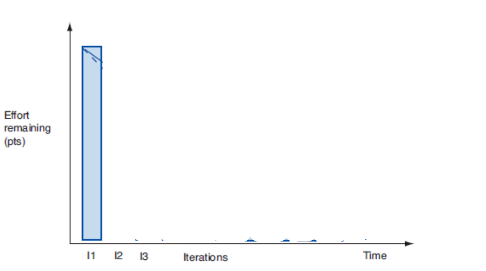{ width=350 }

{ width=350 }

# Burndown

# Burndown

- Projektin etenemistä kuvataan yleensä release burndown -kaavion avulla

- The progress of the project is usually described using a release burndown diagram

Translations of - Projektin etenemistä kuvataan yleensä release burndown -kaavion avulla
[ Suomi -> English ]

- Projektin etenemistä kuvataan yleensä release burndown -kaavion avulla
    - The progress of the project is usually described using a release burndown diagram, - The progress of the project is usually described using the release burndown chart

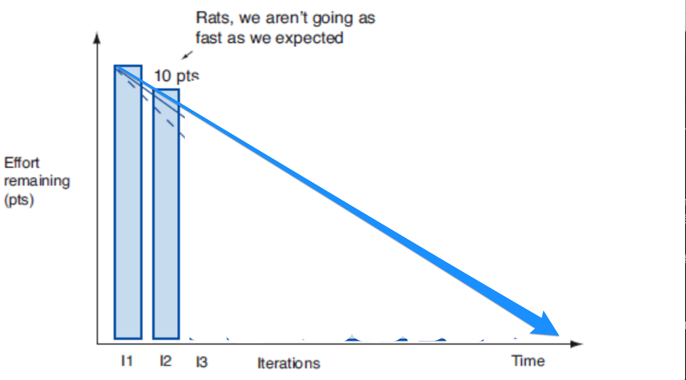{ width=350 }

{ width=350 }

# Burndown

# Burndown

- Projektin etenemistä kuvataan yleensä release burndown -kaavion avulla

- The progress of the project is usually described using a release burndown diagram

Translations of - Projektin etenemistä kuvataan yleensä release burndown -kaavion avulla
[ Suomi -> English ]

- Projektin etenemistä kuvataan yleensä release burndown -kaavion avulla
    - The progress of the project is usually described using a release burndown diagram, - The progress of the project is usually described using the release burndown chart

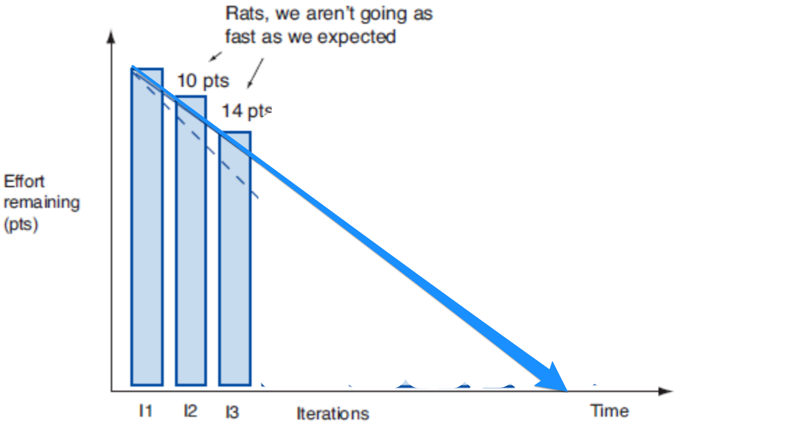{ width=350 }

{ width=350 }

# Burndown

# Burndown

- Projektin etenemistä kuvataan yleensä release burndown -kaavion avulla

- The progress of the project is usually described using a release burndown diagram

Translations of - Projektin etenemistä kuvataan yleensä release burndown -kaavion avulla
[ Suomi -> English ]

- Projektin etenemistä kuvataan yleensä release burndown -kaavion avulla
    - The progress of the project is usually described using a release burndown diagram, - The progress of the project is usually described using the release burndown chart

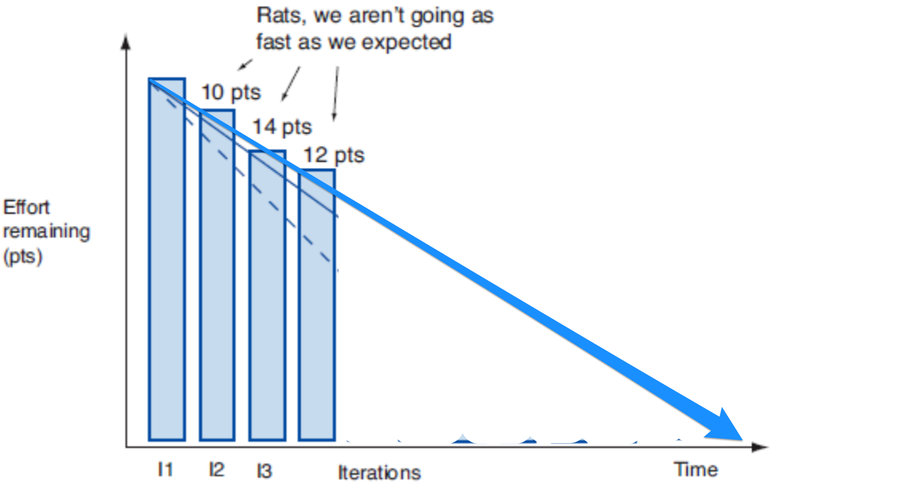{ width=350 }

{ width=350 }

# Burndown

# Burndown

- Projektin etenemistä kuvataan yleensä release burndown -kaavion avulla

- The progress of the project is usually described using a release burndown diagram

Translations of - Projektin etenemistä kuvataan yleensä release burndown -kaavion avulla
[ Suomi -> English ]

- Projektin etenemistä kuvataan yleensä release burndown -kaavion avulla
    - The progress of the project is usually described using a release burndown diagram, - The progress of the project is usually described using the release burndown chart

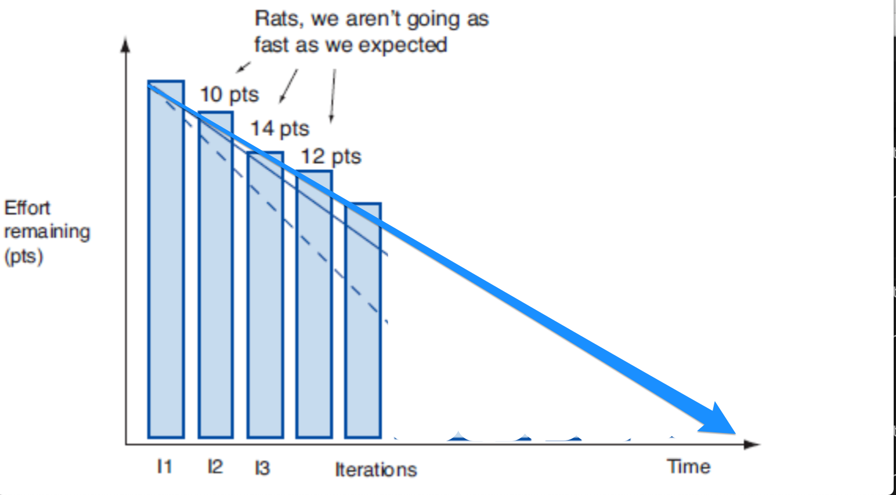{ width=350 }

{ width=350 }

# Burndown

# Burndown

- Projektin etenemistä kuvataan yleensä release burndown -kaavion avulla

- The progress of the project is usually described using a release burndown diagram

Translations of - Projektin etenemistä kuvataan yleensä release burndown -kaavion avulla
[ Suomi -> English ]

- Projektin etenemistä kuvataan yleensä release burndown -kaavion avulla
    - The progress of the project is usually described using a release burndown diagram, - The progress of the project is usually described using the release burndown chart

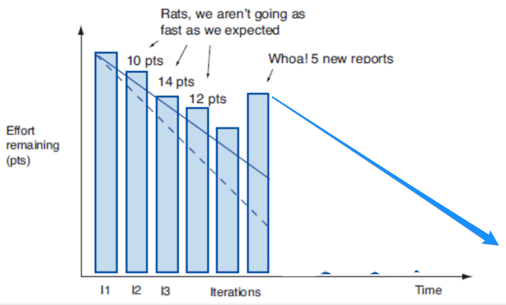{ width=350 }

{ width=350 }

# Burndown

# Burndown

- Projektin etenemistä kuvataan yleensä release burndown -kaavion avulla

- The progress of the project is usually described using a release burndown diagram

Translations of - Projektin etenemistä kuvataan yleensä release burndown -kaavion avulla
[ Suomi -> English ]

- Projektin etenemistä kuvataan yleensä release burndown -kaavion avulla
    - The progress of the project is usually described using a release burndown diagram, - The progress of the project is usually described using the release burndown chart

{ width=350 }

{ width=350 }

# Kannattaako estimointi?  #NoEstimates

# Is the estimate worth it? #NoEstimates

Translations of # Kannattaako estimointi?  #NoEstimates
[ Suomi -> English ]

# Kannattaako estimointi?
    # Is the estimate worth it?, # Is it worth the estimate?
#NoEstimates
    #NoEstimates, #NoEstimates

- Storyjen viemän työmäärän arvioimiseen kaksi motivaatiota

- There are two motivations for evaluating the amount of work required by stories

Translations of - Storyjen viemän työmäärän arvioimiseen kaksi motivaatiota
[ Suomi -> English ]

- Storyjen viemän työmäärän arvioimiseen kaksi motivaatiota
    - There are two motivations for evaluating the amount of work required by stories, - There are two motivations for evaluating the amount of work the stories take

- auttaa asiakasta priorisoinnissa

- helps the customer with prioritization

Translations of - auttaa asiakasta priorisoinnissa
[ Suomi -> English ]

- auttaa asiakasta priorisoinnissa
    - helps the customer with prioritization, - helps the customer in prioritizing

- mahdollistaa koko projektin tai kokonaisuuden viemän ajan ja kustannuksen arvioinnin

- enables the evaluation of the time and cost of the entire project or entity

Translations of - mahdollistaa koko projektin tai kokonaisuuden viemän ajan ja kustannuksen arvioinnin
[ Suomi -> English ]

- mahdollistaa koko projektin tai kokonaisuuden viemän ajan ja kustannuksen arvioinnin
    - enables the evaluation of the time and cost of the entire project or entity, - makes it possible to estimate the time and cost of the entire project or the whole

. . .

. . .

- Story point -pohjainen suhteellinen estimointi on saavuttanut vankan aseman

- Story point-based relative estimation has reached a solid position

Translations of - Story point -pohjainen suhteellinen estimointi on saavuttanut vankan aseman
[ Suomi -> English ]

- Story point -pohjainen suhteellinen estimointi on saavuttanut vankan aseman
    - Story point-based relative estimation has reached a solid position, - Story point-based relative estimation has achieved a solid position

- Scrum guide mainitsee että backlogin vaatimukset estimoituja

- The Scrum guide mentions that the backlog requirements are estimated

Translations of - Scrum guide mainitsee että backlogin vaatimukset estimoituja
[ Suomi -> English ]

- Scrum guide mainitsee että backlogin vaatimukset estimoituja
    - The Scrum guide mentions that the backlog requirements are estimated, - The Scrum guide mentions that the requirements of the backlog are estimated

- Samoin kuten monet parhaat käytänteet kuten DEEP

- As well as many best practices such as DEEP

Translations of - Samoin kuten monet parhaat käytänteet kuten DEEP
[ Suomi -> English ]

- Samoin kuten monet parhaat käytänteet kuten DEEP
    - As well as many best practices such as DEEP, - Just like many best practices like DEEP

. . .

. . .

- _#NoEstimates_-liike ruvennut kyseenalaistamaan story point -perustaista estimointitapaa

- The _#NoEstimates_ movement started to question the story point-based estimation method

Translations of - _#NoEstimates_-liike ruvennut kyseenalaistamaan story point -perustaista estimointitapaa
[ Suomi -> English ]

- _#NoEstimates_-liike ruvennut kyseenalaistamaan story point -perustaista estimointitapaa
    - The _#NoEstimates_ movement started to question the story point-based estimation method, - The _#NoEstimates_ movement has begun to question the story point-based estimation method

- pitää siitä saavutettuja hyötyjä liian vähäisinä verrattuna käytettyyn aikaan ja vaivaan

- considers the benefits achieved from it to be too small compared to the time and effort spent

Translations of - pitää siitä saavutettuja hyötyjä liian vähäisinä verrattuna käytettyyn aikaan ja vaivaan
[ Suomi -> English ]

- pitää siitä saavutettuja hyötyjä liian vähäisinä verrattuna käytettyyn aikaan ja vaivaan
    - considers the benefits achieved from it to be too small compared to the time and effort spent, - considers the benefits achieved from it too small compared to the time and effort spent

. . .

. . .

- Yksinkertainen vaihtoehto: **arvioidaan velositeetti laskemalla kussakin sprintissä valmistuneiden storyjen lukumäärä**

- A simple option: **evaluate the velocity by counting the number of stories completed in each sprint**

Translations of - Yksinkertainen vaihtoehto: **arvioidaan velositeetti laskemalla kussakin sprintissä valmistuneiden storyjen lukumäärä**
[ Suomi -> English ]

- Yksinkertainen vaihtoehto: **arvioidaan velositeetti laskemalla kussakin sprintissä valmistuneiden storyjen lukumäärä**
    - A simple option: **evaluate the velocity by counting the number of stories completed in each sprint**, - Simple option: **evaluate velocity by counting the number of stories completed in each sprint**

. . .

. . .

- Toimii jos storyt riittävän tasakokoisia?

- Does it work if the stories are sufficiently uniform in size?

Translations of - Toimii jos storyt riittävän tasakokoisia?
[ Suomi -> English ]

- Toimii jos storyt riittävän tasakokoisia?
    - Does it work if the stories are sufficiently uniform in size?, - Does it work if the stories are of a sufficiently uniform size?

# Tauko 10 min

# Break 10 min

Translations of # Tauko 10 min
[ Suomi -> English ]

# Tauko 10 min
    # Break 10 min, # Break for 10 min

# Sprintti

# Sprint

Translations of # Sprintti
[ Suomi -> English ]

# Sprintti
    # Sprint, # The sprint

# Sprintin suunnittelu

# Sprint planning

Translations of # Sprintin suunnittelu
[ Suomi -> English ]

# Sprintin suunnittelu
    # Sprint planning, # Planning the Sprint

- Kertauksena alkuviikolta: Scrum määrittelee pidettäväksi ennen jokaista sprinttiä _suunnittelupalaverin_

- As a recap from the beginning of the week: Scrum defines a _planning meeting_ to be held before every sprint

Translations of - Kertauksena alkuviikolta: Scrum määrittelee pidettäväksi ennen jokaista sprinttiä _suunnittelupalaverin_
[ Suomi -> English ]

- Kertauksena alkuviikolta: Scrum määrittelee pidettäväksi ennen jokaista sprinttiä _suunnittelupalaverin_
    - As a recap from the beginning of the week: Scrum defines a _planning meeting_ to be held before every sprint, - To repeat from the beginning of the week: Scrum defines a _planning meeting_ to be held before each sprint

. . .

. . .

- Palaverin ensimmäinen tavoite on selvittää mitä sprintin aikana tehdään

- The first goal of the meeting is to find out what will be done during the sprint

Translations of - Palaverin ensimmäinen tavoite on selvittää mitä sprintin aikana tehdään
[ Suomi -> English ]

- Palaverin ensimmäinen tavoite on selvittää mitä sprintin aikana tehdään
    - The first goal of the meeting is to find out what will be done during the sprint, - The first goal of the palaver is to find out what is done during the sprint

- Lähtökohtana DEEP product backlog

- DEEP product backlog as a starting point

Translations of - Lähtökohtana DEEP product backlog
[ Suomi -> English ]

- Lähtökohtana DEEP product backlog
    - DEEP product backlog as a starting point, - As a starting point, DEEP product backlog

. . .

. . .

- Product owner esittelee backlogin kärjessä olevat vaatimukset

- Product owner presents the requirements at the top of the backlog

Translations of - Product owner esittelee backlogin kärjessä olevat vaatimukset
[ Suomi -> English ]

- Product owner esittelee backlogin kärjessä olevat vaatimukset
    - Product owner presents the requirements at the top of the backlog, - The product owner presents the top requirements of the backlog

- Tiimin on tarkoitus olla riittävällä tasolla selvillä mitä vaatimuksilla tarkoitetaan

- The team is supposed to be sufficiently clear about what the requirements mean

Translations of - Tiimin on tarkoitus olla riittävällä tasolla selvillä mitä vaatimuksilla tarkoitetaan
[ Suomi -> English ]

- Tiimin on tarkoitus olla riittävällä tasolla selvillä mitä vaatimuksilla tarkoitetaan
    - The team is supposed to be sufficiently clear about what the requirements mean, - The team is supposed to be clear at a sufficient level what is meant by the requirements

. . .

. . .

- Tiimi valitsee niin monta storyä kuin se arvioi kykenevänsä sprintin aikana toteuttamaan definition of donen laadulla

- The team chooses as many stories as it estimates it will be able to implement during the sprint with the quality of the definition of Done

Translations of - Tiimi valitsee niin monta storyä kuin se arvioi kykenevänsä sprintin aikana toteuttamaan definition of donen laadulla
[ Suomi -> English ]

- Tiimi valitsee niin monta storyä kuin se arvioi kykenevänsä sprintin aikana toteuttamaan definition of donen laadulla
    - The team chooses as many stories as it estimates it will be able to implement during the sprint with the quality of the definition of Done, - The team chooses as many stories as it estimates it will be able to implement during the sprint with the quality of definition of done

# Sprintin tavoite

# Sprint goal

Translations of # Sprintin tavoite
[ Suomi -> English ]

# Sprintin tavoite
    # Sprint goal, # Goal of the sprint

- Suunnittelun yhteydessä määritellään _sprintin tavoite_ (goal)

- In connection with planning, the _sprint goal_ (goal) is defined

Translations of - Suunnittelun yhteydessä määritellään _sprintin tavoite_ (goal)
[ Suomi -> English ]

- Suunnittelun yhteydessä määritellään _sprintin tavoite_ (goal)
    - In connection with planning, the _sprint goal_ (goal) is defined, - The _sprint goal_ (goal) is defined in connection with the planning

- Lyhyt, yhden tai kahden lauseen kuvausta siitä, mitä tiimi on aikeissa sprintin aikana tehdä

- A short, one or two sentence description of what the team is going to do during the sprint

Translations of - Lyhyt, yhden tai kahden lauseen kuvausta siitä, mitä tiimi on aikeissa sprintin aikana tehdä
[ Suomi -> English ]

- Lyhyt, yhden tai kahden lauseen kuvausta siitä, mitä tiimi on aikeissa sprintin aikana tehdä
    - A short, one or two sentence description of what the team is going to do during the sprint, - A brief, one or two sentence description of what the team is going to do during the sprint

. . .

. . .

- K. Schwaber, ensimmäisen sprintin tavoite: _demonstrate a key piece of user functionality on the selected technology_

- K. Schwaber, ensimmäisen sprintin tavoite: _demonstrate a key piece of user functionality on the selected technology_

. . .

. . .

- Verkkokaupan sprinttien tavoitteita voisivat olla:

- The goals of e-commerce sprints could be:

Translations of - Verkkokaupan sprinttien tavoitteita voisivat olla:
[ Suomi -> English ]

- Verkkokaupan sprinttien tavoitteita voisivat olla:
    - The goals of e-commerce sprints could be:, - The goals of the online store sprints could be:

- Ostoskorin perustoiminnallisuus: tuotteiden lisäys ja poisto

- Basic functionality of the shopping cart: adding and removing products

Translations of - Ostoskorin perustoiminnallisuus: tuotteiden lisäys ja poisto
[ Suomi -> English ]

- Ostoskorin perustoiminnallisuus: tuotteiden lisäys ja poisto
    - Basic functionality of the shopping cart: adding and removing products, - The basic functionality of the shopping basket: adding and removing products

- Ostosten maksaminen ja toimitustavan valinta

- Paying for purchases and choosing a delivery method

Translations of - Ostosten maksaminen ja toimitustavan valinta
[ Suomi -> English ]

- Ostosten maksaminen ja toimitustavan valinta
    - Paying for purchases and choosing a delivery method, - Paying for purchases and selecting a delivery method

. . .

. . .

- Lyhyt kuvaus parempi niille sidosryhmäläisille, joita ei kiinnosta seurata tapahtumia yksittäisten storyjen tarkkuudella

- A short description is better for those stakeholders who are not interested in following events with the precision of individual stories

Translations of - Lyhyt kuvaus parempi niille sidosryhmäläisille, joita ei kiinnosta seurata tapahtumia yksittäisten storyjen tarkkuudella
[ Suomi -> English ]

- Lyhyt kuvaus parempi niille sidosryhmäläisille, joita ei kiinnosta seurata tapahtumia yksittäisten storyjen tarkkuudella
    - A short description is better for those stakeholders who are not interested in following events with the precision of individual stories, - A short description is better for those stakeholders who are not interested in following the events with the accuracy of individual stories

# Sprintiin valittavat storyt

# Stories selected for Sprint

Translations of # Sprintiin valittavat storyt
[ Suomi -> English ]

# Sprintiin valittavat storyt
    # Stories selected for Sprint, # Stories to be selected for Sprint

- Sprintin tavoitteen asettamisen lisäksi tulee valita backlogista sprintin aikana toteutettavat storyt

- In addition to setting the goal of the sprint, the stories to be implemented during the sprint must be selected from the backlog

Translations of - Sprintin tavoitteen asettamisen lisäksi tulee valita backlogista sprintin aikana toteutettavat storyt
[ Suomi -> English ]

- Sprintin tavoitteen asettamisen lisäksi tulee valita backlogista sprintin aikana toteutettavat storyt
    - In addition to setting the goal of the sprint, the stories to be implemented during the sprint must be selected from the backlog, - In addition to setting the goal of the sprint, the stories to be executed during the sprint must be selected from the backlog

- Kehitystiimi päättää kuinka monta storya sprinttiin otetaan

- The development team decides how many stories to take into the sprint

Translations of - Kehitystiimi päättää kuinka monta storya sprinttiin otetaan
[ Suomi -> English ]

- Kehitystiimi päättää kuinka monta storya sprinttiin otetaan
    - The development team decides how many stories to take into the sprint, - The development team decides how many stories will be included in the sprint

. . .

. . .

- Jos velositeetti on selvillä, on valinta periaatteessa helppo

- If the velocity is known, the choice is basically easy

Translations of - Jos velositeetti on selvillä, on valinta periaatteessa helppo
[ Suomi -> English ]

- Jos velositeetti on selvillä, on valinta periaatteessa helppo
    - If the velocity is known, the choice is basically easy, - If the speed is clear, the choice is basically easy

{ width=230 }

{ width=230 }

- Jos velositettia ei tiedossa, käytetään harkintaa

- If the debit note is not known, discretion is used

Translations of - Jos velositettia ei tiedossa, käytetään harkintaa
[ Suomi -> English ]

- Jos velositettia ei tiedossa, käytetään harkintaa
    - If the debit note is not known, discretion is used, - If the debit card is not known, judgment is used

#

#

- Product owner voi vaikuttaa sprinttiin mukaan otettaviin storyihin tekemällä uudelleenpriorisointia

- The product owner can influence the stories included in the sprint by reprioritizing

Translations of - Product owner voi vaikuttaa sprinttiin mukaan otettaviin storyihin tekemällä uudelleenpriorisointia
[ Suomi -> English ]

- Product owner voi vaikuttaa sprinttiin mukaan otettaviin storyihin tekemällä uudelleenpriorisointia
    - The product owner can influence the stories included in the sprint by reprioritizing, - The product owner can influence the stories to be included in the sprint by re-prioritizing

{ width=230 }

{ width=230 }

- Entä jos myös D halutaan sprinttiin?

- What if D is also wanted for the sprint?

Translations of - Entä jos myös D halutaan sprinttiin?
[ Suomi -> English ]

- Entä jos myös D halutaan sprinttiin?
    - What if D is also wanted for the sprint?, - What if you also want D to sprint?

#

#

- Uudelleenpriorisoidaan

- We will reprioritize

Translations of - Uudelleenpriorisoidaan
[ Suomi -> English ]

- Uudelleenpriorisoidaan
    - We will reprioritize, - Re-prioritising

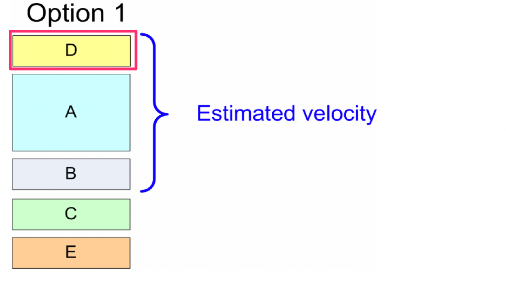{ width=250 }

{ width=250 }

. . .

. . .

- Entä jos myös C halutaan mukaan?

- What if C is also wanted?

Translations of - Entä jos myös C halutaan mukaan?
[ Suomi -> English ]

- Entä jos myös C halutaan mukaan?
    - What if C is also wanted?, - What if you also want C to join?

#

#

- Pienennetään A:n kuvaamaa toiminnallisuutta

- Let's reduce the functionality described by A

Translations of - Pienennetään A:n kuvaamaa toiminnallisuutta
[ Suomi -> English ]

- Pienennetään A:n kuvaamaa toiminnallisuutta
    - Let's reduce the functionality described by A, - The functionality described by A is reduced

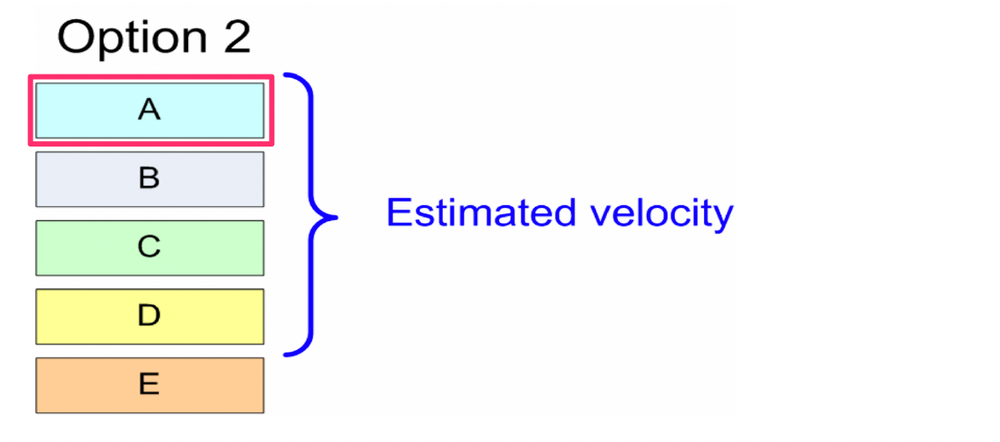{ width=280 }

{ width=280 }

. . .

. . .

- Entä jos A ei saa pienentyä

- What if A is not allowed to decrease

Translations of - Entä jos A ei saa pienentyä
[ Suomi -> English ]

- Entä jos A ei saa pienentyä
    - What if A is not allowed to decrease, - What if A can't get smaller

#

#

- Jaetaan A kahteen osaan

- Let's divide A into two parts

Translations of - Jaetaan A kahteen osaan
[ Suomi -> English ]

- Jaetaan A kahteen osaan
    - Let's divide A into two parts, - Divide A into two parts

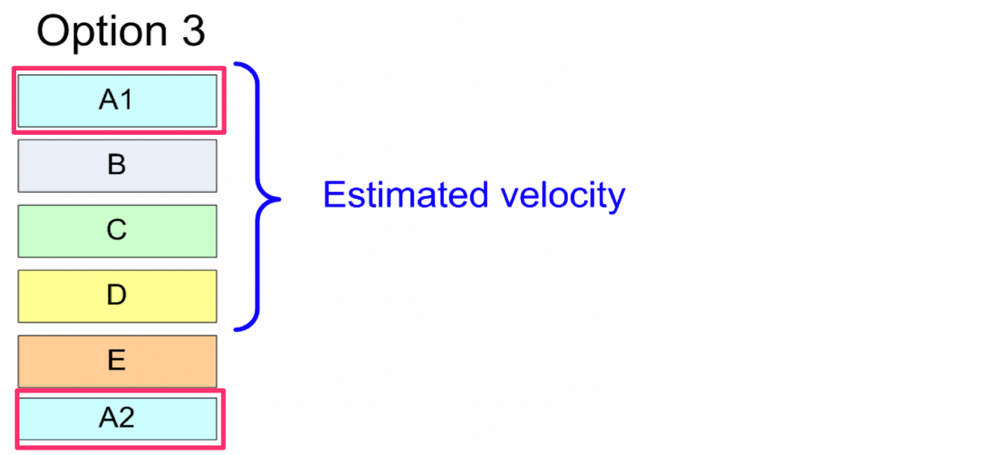{ width=280 }

{ width=280 }

- Tärkeämpi osa toiminnallisuutta eli A1 mahtuu mukaan sprinttiin, vähemmän tärkeät osat eli A2 jää myöhempiin sprintteihin

- The more important part of the functionality, i.e. A1, can be included in the sprint, the less important parts, i.e. A2, are left for later sprints

Translations of - Tärkeämpi osa toiminnallisuutta eli A1 mahtuu mukaan sprinttiin, vähemmän tärkeät osat eli A2 jää myöhempiin sprintteihin
[ Suomi -> English ]

- Tärkeämpi osa toiminnallisuutta eli A1 mahtuu mukaan sprinttiin, vähemmän tärkeät osat eli A2 jää myöhempiin sprintteihin
    - The more important part of the functionality, i.e. A1, can be included in the sprint, the less important parts, i.e. A2, are left for later sprints, - The more important part of the functionality, i.e. A1, can be included in the sprint, the less important parts, i.e. A2, remain in later sprints

# User storyjen jakaminen useampaan osaan

# Dividing user stories into several parts

Translations of # User storyjen jakaminen useampaan osaan
[ Suomi -> English ]

# User storyjen jakaminen useampaan osaan
    # Dividing user stories into several parts, # Dividing user stories into multiple parts

- Haastava aihe, palataan siihen tänään jos aikaa jää

- Challenging topic, let's get back to it today if there's time

Translations of - Haastava aihe, palataan siihen tänään jos aikaa jää
[ Suomi -> English ]

- Haastava aihe, palataan siihen tänään jos aikaa jää
    - Challenging topic, let's get back to it today if there's time, - Challenging subject, let's come back to it today if there's time

- Kurssinmateriaalissa jonkin verran ohjeistusta asiaan

- Some guidance on the matter in the course material

Translations of - Kurssinmateriaalissa jonkin verran ohjeistusta asiaan
[ Suomi -> English ]

- Kurssinmateriaalissa jonkin verran ohjeistusta asiaan
    - Some guidance on the matter in the course material, - In the course material, there are some instructions on the matter

- Pääperiaate: jakamisessa syntyvien storyjen edelleen noudatettava INVEST-kriteerejä

- Main principle: the stories created in sharing must still follow the INVEST criteria

Translations of - Pääperiaate: jakamisessa syntyvien storyjen edelleen noudatettava INVEST-kriteerejä
[ Suomi -> English ]

- Pääperiaate: jakamisessa syntyvien storyjen edelleen noudatettava INVEST-kriteerejä
    - Main principle: the stories created in sharing must still follow the INVEST criteria, - The main principle: the stories created in the sharing must still follow the INVEST criteria

# Miten sprintin tavoitteeseen päästään?

# How to reach the goal of the sprint?

Translations of # Miten sprintin tavoitteeseen päästään?
[ Suomi -> English ]

# Miten sprintin tavoitteeseen päästään?
    # How to reach the goal of the sprint?, # How do you reach the sprint goal?

- Sprintin suunnittelun yhteydessä sprinttiin valituille user storyille tehdään karkean tason suunnittelu

- In connection with the planning of the sprint, rough level planning is done for the user stories selected for the sprint

Translations of - Sprintin suunnittelun yhteydessä sprinttiin valituille user storyille tehdään karkean tason suunnittelu
[ Suomi -> English ]

- Sprintin suunnittelun yhteydessä sprinttiin valituille user storyille tehdään karkean tason suunnittelu
    - In connection with the planning of the sprint, rough level planning is done for the user stories selected for the sprint, - In connection with the planning of the sprint, the user stories selected for the sprint are designed at a rough level

. . .

. . .

- Mietitään mitä _teknisen tason tehtäviä_ (task) on toteutettava, jotta user story saadaan valmiiksi

- Let's think about what _technical level tasks_ (task) need to be implemented in order to complete the user story

Translations of - Mietitään mitä _teknisen tason tehtäviä_ (task) on toteutettava, jotta user story saadaan valmiiksi
[ Suomi -> English ]

- Mietitään mitä _teknisen tason tehtäviä_ (task) on toteutettava, jotta user story saadaan valmiiksi
    - Let's think about what _technical level tasks_ (task) need to be implemented in order to complete the user story, - Let's think about what _technical level tasks_ (task) must be implemented in order to complete the user story

. . .

. . .

- Suunnitellaan komponentteja ja rajapintoja karkealla tasolla

- We design components and interfaces on a rough level

Translations of - Suunnitellaan komponentteja ja rajapintoja karkealla tasolla
[ Suomi -> English ]

- Suunnitellaan komponentteja ja rajapintoja karkealla tasolla
    - We design components and interfaces on a rough level, - We plan components and interfaces at a rough level

. . .

. . .

- Huomioidaan uusien storyjen aiheuttamat muutokset olemassa olevaan osaan sovelluksesta

- Changes to the existing part of the application caused by new stories are taken into account

Translations of - Huomioidaan uusien storyjen aiheuttamat muutokset olemassa olevaan osaan sovelluksesta
[ Suomi -> English ]

- Huomioidaan uusien storyjen aiheuttamat muutokset olemassa olevaan osaan sovelluksesta
    - Changes to the existing part of the application caused by new stories are taken into account, - The changes caused by new stories to the existing part of the application are taken into account

# Storyn jako taskeihin, esimerkki

# Story division into pockets, example

Translations of # Storyn jako taskeihin, esimerkki
[ Suomi -> English ]

# Storyn jako taskeihin, esimerkki
    # Story division into pockets, example, # Dividing the Story into pockets, example

- Esimerkiksi _tuotteen lisääminen ostoskoriin_, voitaisiin jakaa seuraaviin teknisiin taskeihin:

- For example _adding a product to the shopping cart_ could be divided into the following technical pockets:

Translations of - Esimerkiksi _tuotteen lisääminen ostoskoriin_, voitaisiin jakaa seuraaviin teknisiin taskeihin:
[ Suomi -> English ]

- Esimerkiksi _tuotteen lisääminen ostoskoriin_, voitaisiin jakaa seuraaviin teknisiin taskeihin:
    - For example _adding a product to the shopping cart_ could be divided into the following technical pockets:, - For example, _adding a product to the shopping cart_, could be divided into the following technical tasks:

- sessio, joka muistaa asiakkaan tila

- a session that remembers the client's state

Translations of - sessio, joka muistaa asiakkaan tila
[ Suomi -> English ]

- sessio, joka muistaa asiakkaan tila
    - a session that remembers the client's state, - a session that remembers the state of the client

- oliot ja tietorakenteet ostoskorin ja ostoksen esittämiseen

- objects and data structures for presenting the shopping cart and the purchase

Translations of - oliot ja tietorakenteet ostoskorin ja ostoksen esittämiseen
[ Suomi -> English ]

- oliot ja tietorakenteet ostoskorin ja ostoksen esittämiseen
    - objects and data structures for presenting the shopping cart and the purchase, - entities and data structures for presenting the shopping cart and purchase

- laajennus tietokantaskeemaan

- extension to the database schema

Translations of - laajennus tietokantaskeemaan
[ Suomi -> English ]

- laajennus tietokantaskeemaan
    - extension to the database schema, - an extension to a database schema

- html-näkymää päivitettävä tarvittavilla painikkeilla

- the html view can be updated with the necessary buttons

Translations of - html-näkymää päivitettävä tarvittavilla painikkeilla
[ Suomi -> English ]

- html-näkymää päivitettävä tarvittavilla painikkeilla
    - the html view can be updated with the necessary buttons, - html view to be updated with the necessary buttons

- kontrolleri painikkeiden käsittelyyn

- controller for handling buttons

Translations of - kontrolleri painikkeiden käsittelyyn
[ Suomi -> English ]

- kontrolleri painikkeiden käsittelyyn
    - controller for handling buttons, - a controller for handling the buttons

- yksikkötestit kontrollerille ja ostoskorin logiikalle

- unit tests for the controller and the Shopping Cart logic

Translations of - yksikkötestit kontrollerille ja ostoskorin logiikalle
[ Suomi -> English ]

- yksikkötestit kontrollerille ja ostoskorin logiikalle
    - unit tests for the controller and the Shopping Cart logic, - unit tests for controller and Shopping Cart logic

- hyväksymätestien automatisointi

- automation of acceptance tests

Translations of - hyväksymätestien automatisointi
[ Suomi -> English ]

- hyväksymätestien automatisointi
    - automation of acceptance tests, - acceptance test automation

. . .

. . .

- Kaikkia storyyn liittyviä taskeja ei sprintin suunnittelun aikana löydetä

- Not all story-related tasks are found during sprint planning

Translations of - Kaikkia storyyn liittyviä taskeja ei sprintin suunnittelun aikana löydetä
[ Suomi -> English ]

- Kaikkia storyyn liittyviä taskeja ei sprintin suunnittelun aikana löydetä
    - Not all story-related tasks are found during sprint planning, - Not all tasks related to the story are found during the sprint planning

- Uusia taskeja generoidaan tarvittaessa sprintin edetessä

- New tasks are generated if necessary as the sprint progresses

Translations of - Uusia taskeja generoidaan tarvittaessa sprintin edetessä
[ Suomi -> English ]

- Uusia taskeja generoidaan tarvittaessa sprintin edetessä
    - New tasks are generated if necessary as the sprint progresses, - New tasks are generated if needed as the sprint progresses

# Sprint backlog

# Sprint backlog

- _Sprint backlog_ koostuu sprintiin valituista storyista ja niihin liittyvistä tehtävistä eli taskeista

- _Sprint backlog_ consists of the stories selected for the Sprint and the tasks associated with them

Translations of - _Sprint backlog_ koostuu sprintiin valituista storyista ja niihin liittyvistä tehtävistä eli taskeista
[ Suomi -> English ]

- _Sprint backlog_ koostuu sprintiin valituista storyista ja niihin liittyvistä tehtävistä eli taskeista
    - _Sprint backlog_ consists of the stories selected for the Sprint and the tasks associated with them, - _Sprint backlog_ consists of the stories selected for the Sprint and the related tasks, i.e. tasks

. . .

. . .

- Sprint backlog usein organisoitu taskboardiksi

- Sprint backlog often organized as a taskboard

Translations of - Sprint backlog usein organisoitu taskboardiksi
[ Suomi -> English ]

- Sprint backlog usein organisoitu taskboardiksi
    - Sprint backlog often organized as a taskboard, - Sprint backlog is often organized as a taskboard

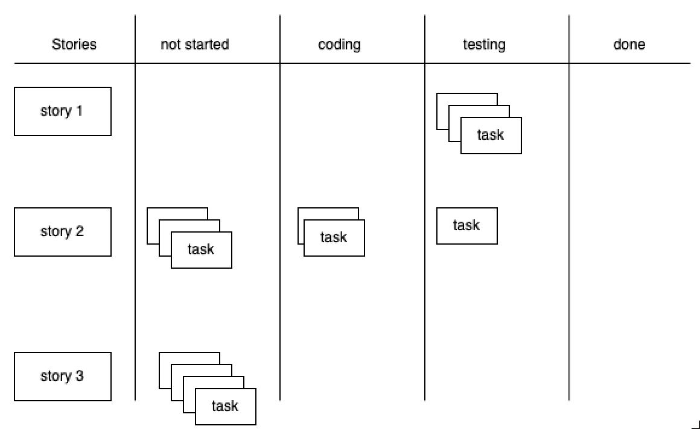{ width=250 }

{ width=250 }

- Taskit niiden valmistumisastetta kuvaavassa sarakkeessa

- Tasks in the column describing their degree of completion

Translations of - Taskit niiden valmistumisastetta kuvaavassa sarakkeessa
[ Suomi -> English ]

- Taskit niiden valmistumisastetta kuvaavassa sarakkeessa
    - Tasks in the column describing their degree of completion, - Tasks in the column describing their completion level

# Sprint backlogin työmääräarviot

# Sprint backlog workload estimates

Translations of # Sprint backlogin työmääräarviot
[ Suomi -> English ]

# Sprint backlogin työmääräarviot
    # Sprint backlog workload estimates, # Workload estimates of the Sprint backlog

- Sprintissä arvioidaan päivittäin kunkin taskin _jäljellä olevaksi arvioitua työmäärää_

- In Sprint, the _estimated amount of work left for each task_ is evaluated daily

Translations of - Sprintissä arvioidaan päivittäin kunkin taskin _jäljellä olevaksi arvioitua työmäärää_
[ Suomi -> English ]

- Sprintissä arvioidaan päivittäin kunkin taskin _jäljellä olevaksi arvioitua työmäärää_
    - In Sprint, the _estimated amount of work left for each task_ is evaluated daily, - In the Sprint, the _estimated amount of work left for each task_ is estimated daily

- Usein tapana tehdä arviot tunteina

- It is often customary to make estimates in hours

Translations of - Usein tapana tehdä arviot tunteina
[ Suomi -> English ]

- Usein tapana tehdä arviot tunteina
    - It is often customary to make estimates in hours, - Often used to make assessments in hours

. . .

. . .

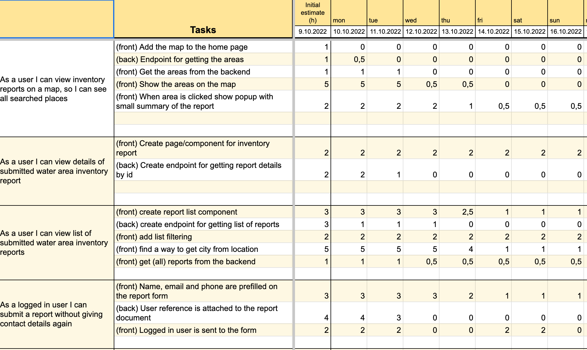{ width=400 }

{ width=400 }

# Sprintin burndown etenemisen seurantaan

# To monitor the sprint's burndown progress

Translations of # Sprintin burndown etenemisen seurantaan
[ Suomi -> English ]

# Sprintin burndown etenemisen seurantaan
    # To monitor the sprint's burndown progress, # To track the progress of the sprint burndown

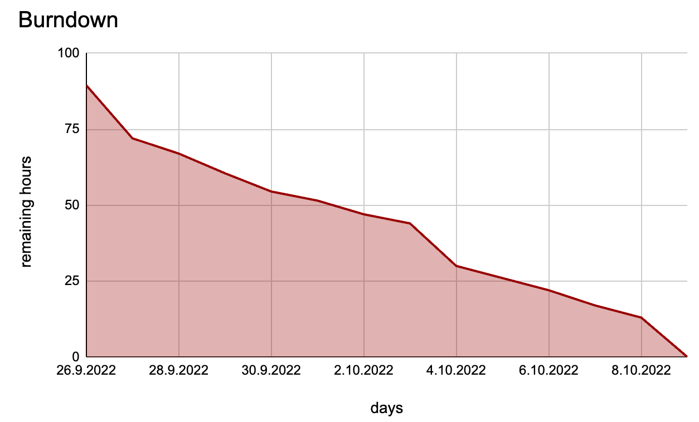{ width=450 }

{ width=450 }

# Kannattaako taskeille tehdä työmääräarviot?

# Is it worth making workload estimates for tasks?

Translations of # Kannattaako taskeille tehdä työmääräarviot?
[ Suomi -> English ]

# Kannattaako taskeille tehdä työmääräarviot?
    # Is it worth making workload estimates for tasks?, # Is it worth doing workload estimates for the tasks?

- A Scrum book 2019_ ei suosittele taskien tasolla tehtävää työmäärä arviointia

- A Scrum book 2019_ does not recommend workload evaluation at the task level

Translations of - A Scrum book 2019_ ei suosittele taskien tasolla tehtävää työmäärä arviointia
[ Suomi -> English ]

- A Scrum book 2019_ ei suosittele taskien tasolla tehtävää työmäärä arviointia
    - A Scrum book 2019_ does not recommend workload evaluation at the task level, - A Scrum book 2019_ does not recommend workload assessment at the task level

- Kehottaa seuraamaan sprinttien aikana ainoastaan sitä kuinka monen story pointin verran storyja saatu valmiiksi

- Urges to monitor during sprints only how many Story Points worth of stories have been completed

Translations of - Kehottaa seuraamaan sprinttien aikana ainoastaan sitä kuinka monen story pointin verran storyja saatu valmiiksi
[ Suomi -> English ]

- Kehottaa seuraamaan sprinttien aikana ainoastaan sitä kuinka monen story pointin verran storyja saatu valmiiksi
    - Urges to monitor during sprints only how many Story Points worth of stories have been completed, - Urges to monitor only how many story points worth of stories have been completed during sprints

. . .

. . .

- On mahdollista, että tiimi saa sprintissä valmiiksi lähes kaikki taskit, saamatta valmiiksi yhtäkään storya

- It is possible that the team will complete almost all tasks in the sprint, without completing a single story

Translations of - On mahdollista, että tiimi saa sprintissä valmiiksi lähes kaikki taskit, saamatta valmiiksi yhtäkään storya
[ Suomi -> English ]

- On mahdollista, että tiimi saa sprintissä valmiiksi lähes kaikki taskit, saamatta valmiiksi yhtäkään storya
    - It is possible that the team will complete almost all tasks in the sprint, without completing a single story, - It is possible that the team will finish almost all the tasks in the sprint, without finishing a single story

- Burn down voi näyttää pitkään melko hyvältä, mutta asiakkaan saama arvo on lopulta nolla

- Burn down can look pretty good for a long time, but the value the customer gets is zero in the end

Translations of - Burn down voi näyttää pitkään melko hyvältä, mutta asiakkaan saama arvo on lopulta nolla
[ Suomi -> English ]

- Burn down voi näyttää pitkään melko hyvältä, mutta asiakkaan saama arvo on lopulta nolla
    - Burn down can look pretty good for a long time, but the value the customer gets is zero in the end, - Burn down can look quite good for a long time, but the value the customer receives is zero in the end

. . .

. . .

- Yksinkertainen tapa sprintin etenemisen seurantaan

- A simple way to track sprint progress

Translations of - Yksinkertainen tapa sprintin etenemisen seurantaan
[ Suomi -> English ]

- Yksinkertainen tapa sprintin etenemisen seurantaan
    - A simple way to track sprint progress, - A simple way to track the progress of a sprint

- laske, tai katsoa taskboardilta, mikä on jo valmiiden ja vielä valmistumattomien sprinttiin kuuluvien taskien lukumäärä

- calculate, or look at the taskboard, the number of completed and yet to be completed tasks belonging to the sprint

Translations of - laske, tai katsoa taskboardilta, mikä on jo valmiiden ja vielä valmistumattomien sprinttiin kuuluvien taskien lukumäärä
[ Suomi -> English ]

- laske, tai katsoa taskboardilta, mikä on jo valmiiden ja vielä valmistumattomien sprinttiin kuuluvien taskien lukumäärä
    - calculate, or look at the taskboard, the number of completed and yet to be completed tasks belonging to the sprint, - calculate, or look at the taskboard, the number of completed and yet to be completed sprint tasks

# Joskus Sprinteissä ...

# Sometimes in Sprints ...

Translations of # Joskus Sprinteissä ...
[ Suomi -> English ]

# Joskus Sprinteissä ...
    # Sometimes in Sprints ..., # Sometimes in the Sprints...

{ width=350 }

{ width=350 }

# Joskus Sprinteissä käy näin

# Sometimes this happens in Sprints

Translations of # Joskus Sprinteissä käy näin
[ Suomi -> English ]

# Joskus Sprinteissä käy näin
    # Sometimes this happens in Sprints, # Sometimes Sprints happen like this

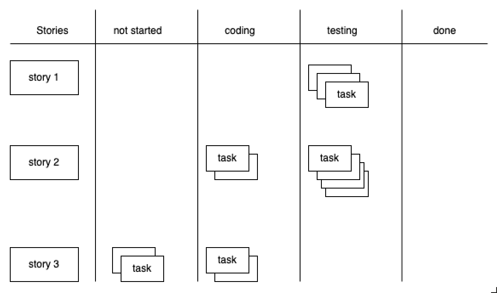{ width=350 }

{ width=350 }

# Puolivalmis työ kasautuu ja asiat eivät valmistu

# Half-finished work piles up and things don't get done

Translations of # Puolivalmis työ kasautuu ja asiat eivät valmistu
[ Suomi -> English ]

# Puolivalmis työ kasautuu ja asiat eivät valmistu
    # Half-finished work piles up and things don't get done, # Half-finished work accumulates and things do not get done

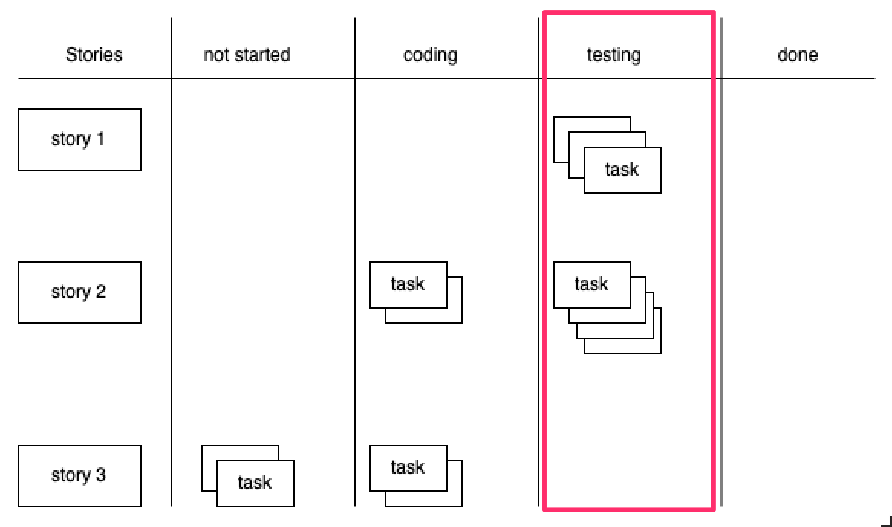{ width=350 }

{ width=350 }

# WIP-rajoitteet

# WIP constraints

Translations of # WIP-rajoitteet
[ Suomi -> English ]

# WIP-rajoitteet
    # WIP constraints, # WIP limits

- Yhtä aikaa työn alla olevien taskien suuri määrä voi koitua ongelmaksi

- A large number of tasks being worked on at the same time can be a problem

Translations of - Yhtä aikaa työn alla olevien taskien suuri määrä voi koitua ongelmaksi
[ Suomi -> English ]

- Yhtä aikaa työn alla olevien taskien suuri määrä voi koitua ongelmaksi
    - A large number of tasks being worked on at the same time can be a problem, - A large number of tasks that are being worked on at the same time can be a problem

- Riski sille, että sprintin päätyttyä paljon osittain valmiita storyja kasvaa

- The risk that after the end of the sprint, a lot of partially finished stories will grow

Translations of - Riski sille, että sprintin päätyttyä paljon osittain valmiita storyja kasvaa
[ Suomi -> English ]

- Riski sille, että sprintin päätyttyä paljon osittain valmiita storyja kasvaa
    - The risk that after the end of the sprint, a lot of partially finished stories will grow, - The risk that after the end of the sprint, a lot of partially finished stories will increase

. . .

. . .

- Ratkaisu: _work in progress eli WIP_ -rajoitteet

- Solution: _work in progress or WIP_ constraints

Translations of - Ratkaisu: _work in progress eli WIP_ -rajoitteet
[ Suomi -> English ]

- Ratkaisu: _work in progress eli WIP_ -rajoitteet
    - Solution: _work in progress or WIP_ constraints, - Solution: _work in progress or WIP_ restrictions

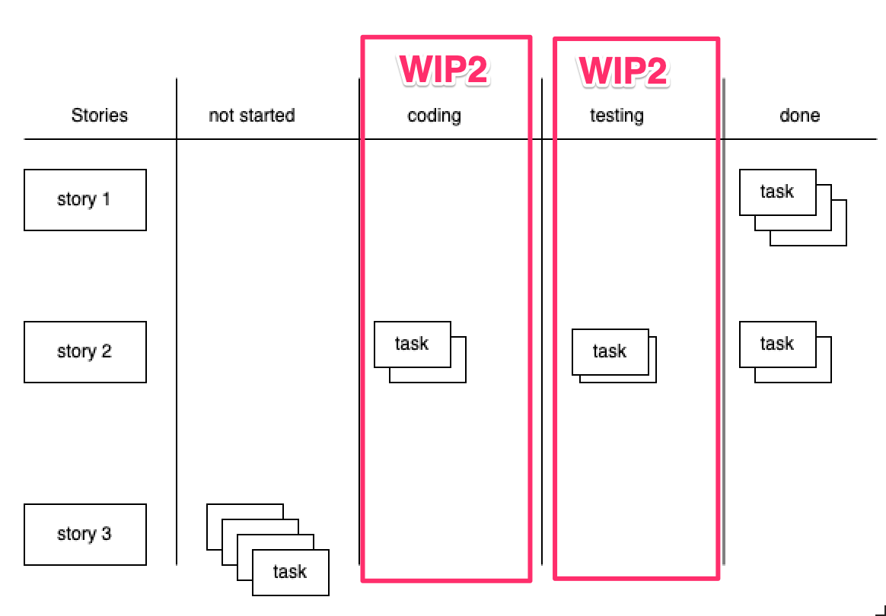{ width=300 }

{ width=300 }

# Kanban ja Lean

# Kanban and Lean

Translations of # Kanban ja Lean
[ Suomi -> English ]

# Kanban ja Lean
    # Kanban and Lean, # Kanban & Lean

- WIP-rajoitusten idea on peräisin _Kanban_-menetelmästä, joka on eräs keskeisimmistä _Lean_-ajattelun työkaluista

- The idea of WIP limits comes from the _Kanban_ method, which is one of the most central tools of _Lean_ thinking

Translations of - WIP-rajoitusten idea on peräisin _Kanban_-menetelmästä, joka on eräs keskeisimmistä _Lean_-ajattelun työkaluista
[ Suomi -> English ]

- WIP-rajoitusten idea on peräisin _Kanban_-menetelmästä, joka on eräs keskeisimmistä _Lean_-ajattelun työkaluista
    - The idea of WIP limits comes from the _Kanban_ method, which is one of the most central tools of _Lean_ thinking, - The idea of WIP restrictions comes from the _Kanban_ method, which is one of the most central tools of _Lean_ thinking

- Lean-ajattelu on peräisin jo kymmeniä vuosia vanhasta Toyota Production Systemistä

- Lean thinking comes from the decades-old Toyota Production System

Translations of - Lean-ajattelu on peräisin jo kymmeniä vuosia vanhasta Toyota Production Systemistä
[ Suomi -> English ]

- Lean-ajattelu on peräisin jo kymmeniä vuosia vanhasta Toyota Production Systemistä
    - Lean thinking comes from the decades-old Toyota Production System, - Lean thinking originates from the Toyota Production System, which is already decades old

. . .

. . .

- Lean-ajattelun taustalla on idea _hukan_ eli asiakkaalle arvoa tuottamattomien asioiden eliminoimisessa

- Lean thinking is based on the idea of _waste_, i.e. eliminating things that do not produce value for the customer

Translations of - Lean-ajattelun taustalla on idea _hukan_ eli asiakkaalle arvoa tuottamattomien asioiden eliminoimisessa
[ Suomi -> English ]

- Lean-ajattelun taustalla on idea _hukan_ eli asiakkaalle arvoa tuottamattomien asioiden eliminoimisessa
    - Lean thinking is based on the idea of _waste_, i.e. eliminating things that do not produce value for the customer, - Lean thinking is based on the idea of eliminating _waste_, i.e. things that do not produce value for the customer

. . .

. . .

- Toiminnallisuudet tuovat arvoa vasta käytössä, sitä ennen ne sitovat turhaan kustannuksia ja tuovat riskejä

- Functionalities only bring value in use, before that they bind unnecessary costs and bring risks

Translations of - Toiminnallisuudet tuovat arvoa vasta käytössä, sitä ennen ne sitovat turhaan kustannuksia ja tuovat riskejä
[ Suomi -> English ]

- Toiminnallisuudet tuovat arvoa vasta käytössä, sitä ennen ne sitovat turhaan kustannuksia ja tuovat riskejä
    - Functionalities only bring value in use, before that they bind unnecessary costs and bring risks, - Functionalities only add value when they are used, before that they bind unnecessary costs and introduce risks

. . .

. . .

- Hukkaa muun muassa: **osittain tehty työ, välivarastointi ja turha odottaminen**

- Waste, among other things: **partially done work, temporary storage and unnecessary waiting**

Translations of - Hukkaa muun muassa: **osittain tehty työ, välivarastointi ja turha odottaminen**
[ Suomi -> English ]

- Hukkaa muun muassa: **osittain tehty työ, välivarastointi ja turha odottaminen**
    - Waste, among other things: **partially done work, temporary storage and unnecessary waiting**, - Waste, among other things: **partly done work, interim storage and unnecessary waiting**

# WIP-rajoitteiden soveltaminen

# Applying WIP limits

Translations of # WIP-rajoitteiden soveltaminen
[ Suomi -> English ]

# WIP-rajoitteiden soveltaminen
    # Applying WIP limits, # Application of WIP restrictions

- WIP-rajoitteita voidaan soveltaa Scrumin yhteydessä monella tavalla

- WIP restrictions can be applied in connection with Scrum in many ways

Translations of - WIP-rajoitteita voidaan soveltaa Scrumin yhteydessä monella tavalla
[ Suomi -> English ]

- WIP-rajoitteita voidaan soveltaa Scrumin yhteydessä monella tavalla
    - WIP restrictions can be applied in connection with Scrum in many ways, - WIP constraints can be applied in the context of Scrum in many ways

. . .

. . .

- Aika tavallista on rajoittaa eri työvaiheessa, esim.  toteutuksen olevien taskien määrää

- It is quite common to restrict in different work phases, e.g. the number of tasks in the implementation

Translations of - Aika tavallista on rajoittaa eri työvaiheessa, esim.  toteutuksen olevien taskien määrää
[ Suomi -> English ]

- Aika tavallista on rajoittaa eri työvaiheessa, esim.
    - It is quite common to restrict in different work phases, e.g., - It is quite common to limit in different work stages, e.g.
toteutuksen olevien taskien määrää
    the number of tasks in the implementation, the number of tasks in the execution

. . .

. . .

- tai yksittäisellä sovelluskehittäjän kerrallaan työn alla olevien töiden määrää

- or the amount of work in progress by an individual application developer at a time

Translations of - tai yksittäisellä sovelluskehittäjän kerrallaan työn alla olevien töiden määrää
[ Suomi -> English ]

- tai yksittäisellä sovelluskehittäjän kerrallaan työn alla olevien töiden määrää
    - or the amount of work in progress by an individual application developer at a time, - or the amount of work in progress for an individual application developer at any one time

. . .

. . .

- Järkevintä lienee rajoittaa sprintin aikana yhtäaikaa työn alla olevien storyjen määrää mahdollisimman pieneksi

- The most sensible thing to do is to limit the number of stories that are being worked on at the same time during the sprint to as small as possible

Translations of - Järkevintä lienee rajoittaa sprintin aikana yhtäaikaa työn alla olevien storyjen määrää mahdollisimman pieneksi
[ Suomi -> English ]

- Järkevintä lienee rajoittaa sprintin aikana yhtäaikaa työn alla olevien storyjen määrää mahdollisimman pieneksi
    - The most sensible thing to do is to limit the number of stories that are being worked on at the same time during the sprint to as small as possible, - It probably makes the most sense to limit the number of stories that are being worked on at the same time during the sprint to the smallest possible

. . .

. . .

- WIP-rajoitteita säädetään usein retrospektiivien yhteydessä jos kehitystyössä havaitaan ongelmia

- WIP limits are often adjusted in connection with retrospectives if problems are detected in the development work

Translations of - WIP-rajoitteita säädetään usein retrospektiivien yhteydessä jos kehitystyössä havaitaan ongelmia
[ Suomi -> English ]

- WIP-rajoitteita säädetään usein retrospektiivien yhteydessä jos kehitystyössä havaitaan ongelmia
    - WIP limits are often adjusted in connection with retrospectives if problems are detected in the development work, - WIP restrictions are often adjusted in connection with retrospectives if problems are detected in development work

#

#

# Storyjen jakaminen

# Sharing stories

Translations of # Storyjen jakaminen
[ Suomi -> English ]

# Storyjen jakaminen
    # Sharing stories, # Sharing of Stories

- Haastava aihe aloittelijalle ja joskus myös kokeneille ohjelmistokehittäjille

- Challenging topic for beginners and sometimes also for experienced software developers

Translations of - Haastava aihe aloittelijalle ja joskus myös kokeneille ohjelmistokehittäjille
[ Suomi -> English ]

- Haastava aihe aloittelijalle ja joskus myös kokeneille ohjelmistokehittäjille
    - Challenging topic for beginners and sometimes also for experienced software developers, - A challenging topic for beginners and sometimes also experienced software developers

- Pääperiaate: jakamisessa syntyvien storyjen edelleen noudatettava INVEST-kriteerejä

- Main principle: the stories created in sharing must still follow the INVEST criteria

Translations of - Pääperiaate: jakamisessa syntyvien storyjen edelleen noudatettava INVEST-kriteerejä
[ Suomi -> English ]

- Pääperiaate: jakamisessa syntyvien storyjen edelleen noudatettava INVEST-kriteerejä
    - Main principle: the stories created in sharing must still follow the INVEST criteria, - The main principle: the stories created in the sharing must still follow the INVEST criteria

- Richard Lawrencen ohjeita

- Instructions by Richard Lawrence

Translations of - Richard Lawrencen ohjeita
[ Suomi -> English ]

- Richard Lawrencen ohjeita
    - Instructions by Richard Lawrence, - Richard Lawrence's instructions

# Pattern 1: business rule variations

# Pattern 1: business rule variations

_As a user, I can search for flights with flexible dates._

_As a user, I can search for flights with flexible dates._

. . .

. . .

kannattaa jakaa siten että jokainen näistä ehdoista eritellään omaksi storykseen

it is worth sharing in such a way that each of these conditions is separated into its own story

Translations of kannattaa jakaa siten että jokainen näistä ehdoista eritellään omaksi storykseen
[ Suomi -> English ]

kannattaa jakaa siten että jokainen näistä ehdoista eritellään omaksi storykseen
    it is worth sharing in such a way that each of these conditions is separated into its own story, it is worth sharing so that each of these conditions is separated into its own story

- _... as "between dates x and y"_

- _... as "between dates x and y"_

- _... as "a weekend in December"_

- _... as "a weekend in December"_

- _... as "± n days of dates x and y"_

- _... as "± n days of dates x and y"_

# Pattern 2: simple/complex

# Pattern 2: simple/complex

_As a user, I can search for flights between two destinations_

_As a user, I can search for flights between two destinations_

. . .

. . .

voidaan jakaa seuraavasti

can be divided as follows

Translations of voidaan jakaa seuraavasti
[ Suomi -> English ]

voidaan jakaa seuraavasti
    can be divided as follows, can be broken down as follows

- _... when only direct flights used_

- _... when only direct flights used_

- _... specifying a max number of stops_

- _... specifying a max number of stops_

- _... including nearby airports_

- _... including nearby airports_

- _... using flexible dates_

- _... using flexible dates_

# Pattern 3: major effort

# Pattern 3: major effort

_As a user, I can pay for my flight with VISA, MasterCard, Diners Club, or American Expres._

_As a user, I can pay for my flight with VISA, MasterCard, Diners Club, or American Expres._

. . .

. . .

voitaisiin jakaa kahtia, missä ensimmäisessä storyssa vasta hoidettaisiin yksi luottokorttityyppi, ja seuraava story yleistäisi toiminnan kaikkiin kortteihin:

could be divided into two, where the first story would only handle one type of credit card, and the next story would generalize the operation to all cards:

Translations of voitaisiin jakaa kahtia, missä ensimmäisessä storyssa vasta hoidettaisiin yksi luottokorttityyppi, ja seuraava story yleistäisi toiminnan kaikkiin kortteihin:
[ Suomi -> English ]

voitaisiin jakaa kahtia, missä ensimmäisessä storyssa vasta hoidettaisiin yksi luottokorttityyppi, ja seuraava story yleistäisi toiminnan kaikkiin kortteihin:
    could be divided into two, where the first story would only handle one type of credit card, and the next story would generalize the operation to all cards:, could be split in two, where the first story would only handle one type of credit card, and the next story would generalize the operation to all cards:

- _... I can pay with VISA_

- _... I can pay with VISA_

- _... I can pay with all four credit card types (VISA, MC, DC, AMEX) (given one card type already implemented)_

- _... I can pay with all four credit card types (VISA, MC, DC, AMEX) (given one card type already implemented)_

# Pattern 4: data entry methods

# Pattern 4: data entry methods

_As a user, I can search for flights between two destinations_

_As a user, I can search for flights between two destinations_

. . .

. . .

jakaantuukin helposti kahteen esim.  seuraavasti

is easily divided into two, e.g. as follows

Translations of jakaantuukin helposti kahteen esim.  seuraavasti
[ Suomi -> English ]

jakaantuukin helposti kahteen esim.
    is easily divided into two, e.g., can easily be divided into two, e.g.
seuraavasti
    as follows, the following

- _... using simple date input_

- _... using simple date input_

- _... with a fancy calendar UI_

- _... with a fancy calendar UI_

# Pattern 5: Defer Performance

# Pattern 5: Defer Performance

_As a user, I can search for flights between two destinations_

_As a user, I can search for flights between two destinations_

. . .

. . .

jakaantuu kahtia seuraavasti:

splits into two as follows:

Translations of jakaantuu kahtia seuraavasti:
[ Suomi -> English ]

jakaantuu kahtia seuraavasti:
    splits into two as follows:, is divided into two as follows:

- _... slow—just get it done, show a "searching" animation_

- _... slow—just get it done, show a "searching" animation_

- _... in under 5 seconds_

- _... in under 5 seconds_

# Pattern 6: Operations

# Pattern 6: Operations

_As a user, I can manage my account_

_As a user, I can manage my account_

. . .

. . .

jakaantuu moneen osaan

is divided into several parts

Translations of jakaantuu moneen osaan
[ Suomi -> English ]

jakaantuu moneen osaan
    is divided into several parts, splits into many parts

- _... I can sign up for an account_

- _... I can sign up for an account_

- _... I can edit my account settings_

- _... I can edit my account settings_

- _... I can cancel my account_

- _... I can cancel my account_

# Pattern 7: Break Out a Spike

# Pattern 7: Break Out a Spike

Jos tiimi ei ole toteuttanut koskaan luottokorttimaksuun liittyvää toiminnallisuutta, user storysta

If the team has never implemented functionality related to credit card payment, from the user story

Translations of Jos tiimi ei ole toteuttanut koskaan luottokorttimaksuun liittyvää toiminnallisuutta, user storysta
[ Suomi -> English ]

Jos tiimi ei ole toteuttanut koskaan luottokorttimaksuun liittyvää toiminnallisuutta, user storysta
    If the team has never implemented functionality related to credit card payment, from the user story, If the team has never implemented a function related to credit card payment, from the user story

_As a user, I can pay by credit card_

_As a user, I can pay by credit card_

kannattaa eriyttää aikarajattu eksperimentti joka suoritetaan aiemmassa sprintissä.

it is worth differentiating a time-limited experiment that is carried out in an earlier sprint.

Translations of kannattaa eriyttää aikarajattu eksperimentti joka suoritetaan aiemmassa sprintissä.
[ Suomi -> English ]

kannattaa eriyttää aikarajattu eksperimentti joka suoritetaan aiemmassa sprintissä.
    it is worth differentiating a time-limited experiment that is carried out in an earlier sprint., it is worth differentiating a time-limited experiment that is performed in a previous sprint.

Tämän jälkeen toivon mukaan varsinaisen toiminnallisuuden toteuttava story osataan estimoida paremmin:

After this, I hope that the story that implements the actual functionality will be better estimated:

Translations of Tämän jälkeen toivon mukaan varsinaisen toiminnallisuuden toteuttava story osataan estimoida paremmin:
[ Suomi -> English ]

Tämän jälkeen toivon mukaan varsinaisen toiminnallisuuden toteuttava story osataan estimoida paremmin:
    After this, I hope that the story that implements the actual functionality will be better estimated:, After this, I hope that the story implementing the actual functionality will be better estimated:

- _Investigate credit card processing_

- _Investigate credit card processing_

- _Implement credit card processing_

- _Implement credit card processing_
