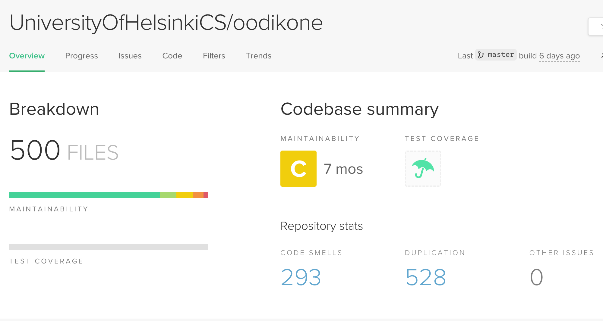
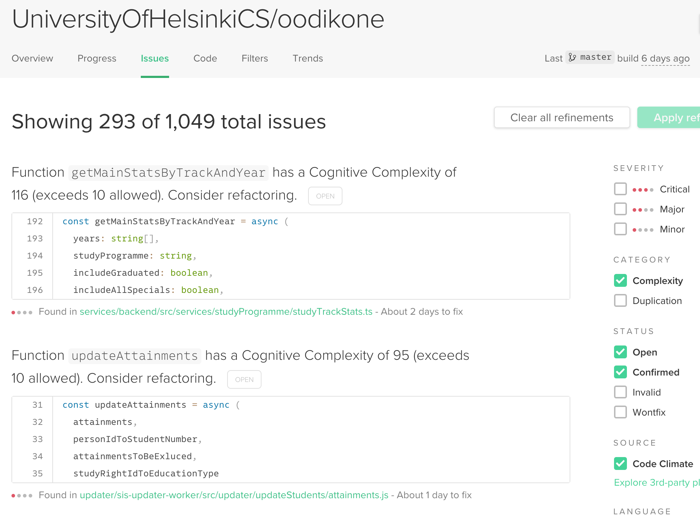
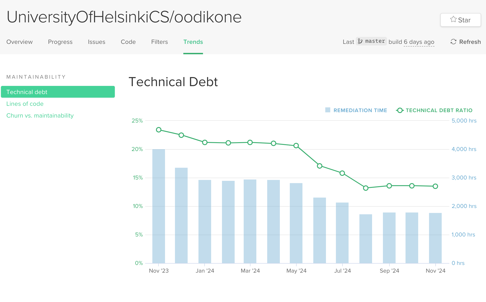
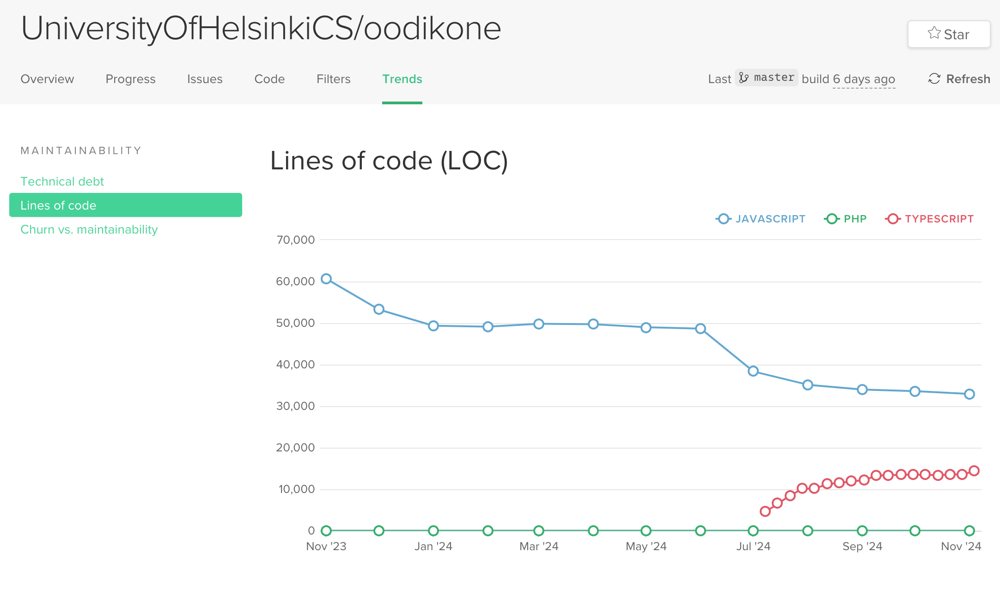
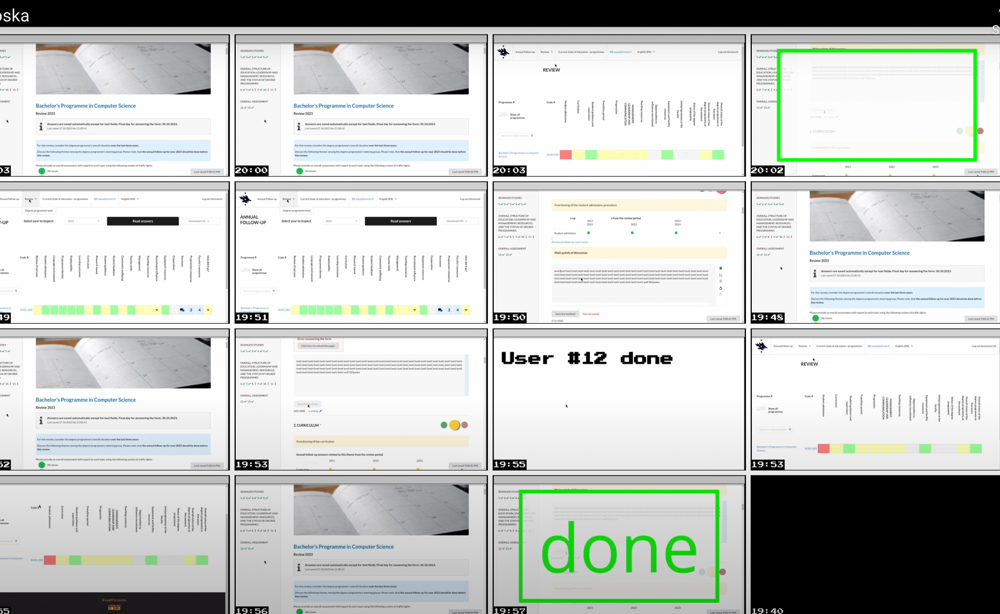
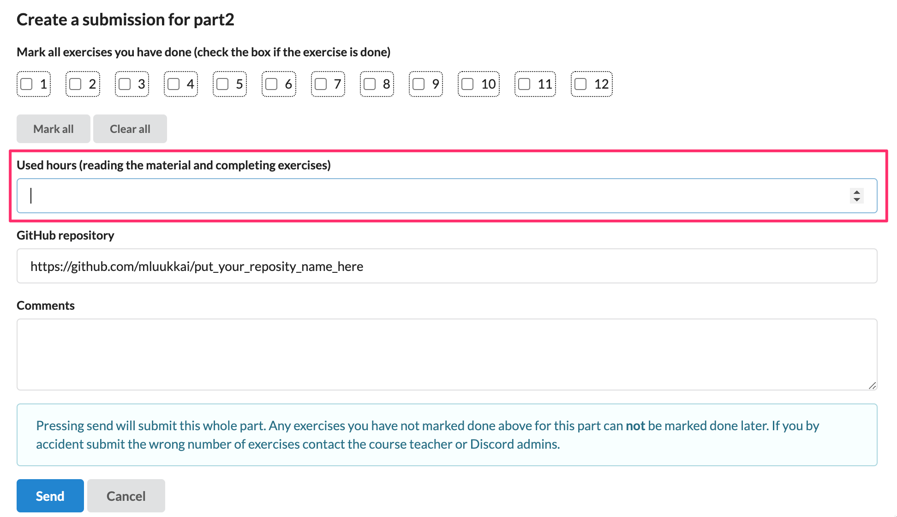

% Ohjelmistotuotanto

% Software production

Translations of % Ohjelmistotuotanto
[ Suomi -> English ]

% Ohjelmistotuotanto
    % Software production, % Software manufacturing

% Matti Luukkainen ja ohjaajat Antti, Pooki, Riku, Sini, Taneli

% Matti Luukkainen and directors Antti, Pooki, Riku, Sini, Taneli

Translations of % Matti Luukkainen ja ohjaajat Antti, Pooki, Riku, Sini, Taneli
[ Suomi -> English ]

% Matti Luukkainen ja ohjaajat Antti, Pooki, Riku, Sini, Taneli
    % Matti Luukkainen and directors Antti, Pooki, Riku, Sini, Taneli, % Matti Luukkainen and the instructors Antti, Pooki, Riku, Sini, Taneli

% syksy 2024

% autumn 2024

Translations of % syksy 2024
[ Suomi -> English ]

% syksy 2024
    % autumn 2024, % fall 2024

#

#

                                      Luento 5

                                     Lecture 5

                                    11.11.2024

                                    11.11.2024

# Kurssipalaute

# Course feedback

Translations of # Kurssipalaute
[ Suomi -> English ]

# Kurssipalaute
    # Course feedback, # Lesson feedback

- Kurssipalaute

- Course feedback

Translations of - Kurssipalaute
[ Suomi -> English ]

- Kurssipalaute
    - Course feedback, - Lesson feedback

- Kurssilla lopussa kerättävän palautteen lisäksi ns.  jatkuva palaute https://norppa.helsinki.fi

- In addition to the feedback collected at the end of the course, the so-called continuous feedback https://norppa.helsinki.fi

Translations of - Kurssilla lopussa kerättävän palautteen lisäksi ns.  jatkuva palaute https://norppa.helsinki.fi
[ Suomi -> English ]

- Kurssilla lopussa kerättävän palautteen lisäksi ns.
    - In addition to the feedback collected at the end of the course, the so-called, - In addition to the feedback gathered at the end of the course, so-called
jatkuva palaute https://norppa.helsinki.fi
    continuous feedback https://norppa.helsinki.fi, ongoing feedback https://norppa.helsinki.fi

# Pajaa salissa BK107

# Workshop in hall BK107

Translations of # Pajaa salissa BK107
[ Suomi -> English ]

# Pajaa salissa BK107
    # Workshop in hall BK107, # The workshop in hall BK107



- ma 14-16

- ma 14-16

- to 13-15

- to 13-15

- pe 12-14 (tänä pe poikkeuksellisesti klo 13-15)

- Fri 12-14 (this Friday exceptionally from 13-15)

Translations of - pe 12-14 (tänä pe poikkeuksellisesti klo 13-15)
[ Suomi -> English ]

- pe 12-14 (tänä pe poikkeuksellisesti klo 13-15)
    - Fri 12-14 (this Friday exceptionally from 13-15), - Fri 12-14 (this Friday, exceptionally, 1-3 pm)

# Miniprojektit

# Mini projects

Translations of # Miniprojektit
[ Suomi -> English ]

# Miniprojektit
    # Mini projects, # Mini-projects

- Käynnistyvät huomenna!

- Starting tomorrow!

Translations of - Käynnistyvät huomenna!
[ Suomi -> English ]

- Käynnistyvät huomenna!
    - Starting tomorrow!, - They will start tomorrow!

- Aloitustilaisuudet

- Opening ceremonies

Translations of - Aloitustilaisuudet
[ Suomi -> English ]

- Aloitustilaisuudet
    - Opening ceremonies, - Kick-off events

- ti 14-16

- of 14-16

Translations of - ti 14-16
[ Yorùbá -> English ]

- ti 14-16
    - of 14-16, - from 14 to 16

- ke 14-16

- the 14-16

Translations of - ke 14-16
[ ʻŌlelo Hawaiʻi -> English ]

- ke 14-16
    - the 14-16, - 14-16

- ke 16-18

- when 16-18

Translations of - ke 16-18
[ ʻŌlelo Hawaiʻi -> English ]

- ke 16-18
    - when 16-18, - 16-18

- to 10-12

- to 10-12

- to 14-16

- to 14-16

- Seuraavat viikot: sprinttien katselmus ja suunnittelu samassa aikaikkunassa

- Next weeks: review and planning of sprints in the same time window

Translations of - Seuraavat viikot: sprinttien katselmus ja suunnittelu samassa aikaikkunassa
[ Suomi -> English ]

- Seuraavat viikot: sprinttien katselmus ja suunnittelu samassa aikaikkunassa
    - Next weeks: review and planning of sprints in the same time window, - The following weeks: sprint review and planning in the same time window

- Loppudemot

- End of life

Translations of - Loppudemot
[ Svenska -> English ]

- Loppudemot
    - End of life, - Lopmodemot

- ke 11.12.  klo 12-14 B123

- to 11.12. klo 12-14 B123

Translations of - ke 11.12.  klo 12-14 B123
[ Bahasa Indonesia -> English ]

- ke 11.12.
    - to 11.12., - 11.12.
klo 12-14 B123
    klo 12-14 B123, 12-14 B123

- to 12.12. klo 12-14 CK112

- to 12.12. klo 12-14 CK112

# Ohjelmiston elinkaari (software lifecycle)

# Software lifecycle

Translations of # Ohjelmiston elinkaari (software lifecycle)
[ Suomi -> English ]

# Ohjelmiston elinkaari (software lifecycle)
    # Software lifecycle, # Software life cycle (software lifecycle)

- Vaatimusten analysointi ja määrittely

- Analysis and definition of requirements

Translations of - Vaatimusten analysointi ja määrittely
[ Suomi -> English ]

- Vaatimusten analysointi ja määrittely
    - Analysis and definition of requirements, - Requirements analysis and definition

- Suunnittelu

- Planning

Definitions of - Suunnittelu
[ Suomi -> English ]

noun
    design
        design, malli, suunnittelu, muotoilu, kuvio, suunnitelma
    planning
        suunnittelu, kaavoitus
    designing
        suunnittelu, muotoilu, design
    contemplation
        miettiminen, mietiskely, suunnittelu

- Suunnittelu
    - Planning, - The design

- Toteutus

- Implementation

Definitions of - Toteutus
[ Suomi -> English ]

noun
    achievement
        saavutus, saavuttaminen, suoritus, toteutus

- Toteutus
    - Implementation, - Execution

- **Testaus ja laadunhallinta**

- **Testing and quality control**

Translations of - **Testaus ja laadunhallinta**
[ Suomi -> English ]

- **Testaus ja laadunhallinta**
    - **Testing and quality control**, - **Testing and Quality Management**

- Ohjelmiston ylläpito ja evoluutio

- Software maintenance and evolution

Translations of - Ohjelmiston ylläpito ja evoluutio
[ Suomi -> English ]

- Ohjelmiston ylläpito ja evoluutio
    - Software maintenance and evolution, - Maintenance and evolution of the software

# Ohjelmistojen laadunhallinta

# Software quality management

Translations of # Ohjelmistojen laadunhallinta
[ Suomi -> English ]

# Ohjelmistojen laadunhallinta
    # Software quality management, # Quality control of software

- Laadunhallinnan kaksi oleellista kysymystä

- Two essential questions of quality management

Translations of - Laadunhallinnan kaksi oleellista kysymystä
[ Suomi -> English ]

- Laadunhallinnan kaksi oleellista kysymystä
    - Two essential questions of quality management, - Two essential issues of quality management

- verifiointi: _are we building the product right_

- verifiointi: _are we building the product right_

- validointi: _are we building the right product_

- validointi: _are we building the right product_

. . .

. . .

- **Verifiointi**: varmistetaan, että ohjelmisto toteuttaa vaatimusmäärittelyn aikana asetetut vaatimukset

- **Verification**: it is ensured that the software fulfills the requirements set during the requirements definition

Translations of - **Verifiointi**: varmistetaan, että ohjelmisto toteuttaa vaatimusmäärittelyn aikana asetetut vaatimukset
[ Suomi -> English ]

- **Verifiointi**: varmistetaan, että ohjelmisto toteuttaa vaatimusmäärittelyn aikana asetetut vaatimukset
    - **Verification**: it is ensured that the software fulfills the requirements set during the requirements definition, - **Verification**: it is ensured that the software implements the requirements set during the requirement definition

- Testataan toiminnalliset ja ei-toiminnalliset vaatimukset

- Functional and non-functional requirements are tested

Translations of - Testataan toiminnalliset ja ei-toiminnalliset vaatimukset
[ Suomi -> English ]

- Testataan toiminnalliset ja ei-toiminnalliset vaatimukset
    - Functional and non-functional requirements are tested, - We test the functional and non-functional requirements

. . .

. . .

- **Validointi**: varmistetaan, että ohjelmisto täyttää käyttäjän odotukset

- **Validation**: ensuring that the software meets the user's expectations

Translations of - **Validointi**: varmistetaan, että ohjelmisto täyttää käyttäjän odotukset
[ Suomi -> English ]

- **Validointi**: varmistetaan, että ohjelmisto täyttää käyttäjän odotukset
    - **Validation**: ensuring that the software meets the user's expectations, - **Validation**: making sure that the software meets the user's expectations

- Vaatimusmäärittelyn aikana kirjatut vaatimukset eivät ole aina se mitä käyttäjä todella tarvitsee

- The requirements recorded during requirements definition are not always what the user really needs

Translations of - Vaatimusmäärittelyn aikana kirjatut vaatimukset eivät ole aina se mitä käyttäjä todella tarvitsee
[ Suomi -> English ]

- Vaatimusmäärittelyn aikana kirjatut vaatimukset eivät ole aina se mitä käyttäjä todella tarvitsee
    - The requirements recorded during requirements definition are not always what the user really needs, - The requirements recorded during the requirement definition are not always what the user really needs

# Verifiointi ja Validointi

# Verification and Validation

Translations of # Verifiointi ja Validointi
[ Suomi -> English ]

# Verifiointi ja Validointi
    # Verification and Validation, # Verify and Validate

- Tavoitteena on varmistaa että ohjelma on "riittävän hyvä" käyttötarkoitukseensa

- The goal is to ensure that the program is "good enough" for its purpose

Translations of - Tavoitteena on varmistaa että ohjelma on "riittävän hyvä" käyttötarkoitukseensa
[ Suomi -> English ]

- Tavoitteena on varmistaa että ohjelma on "riittävän hyvä" käyttötarkoitukseensa
    - The goal is to ensure that the program is "good enough" for its purpose, - The goal is to ensure that the program is "good enough" for its intended use

- Hyvyys on suhteellista ja riippuu ohjelman käyttötarkoituksesta

- Goodness is relative and depends on the intended use of the program

Translations of - Hyvyys on suhteellista ja riippuu ohjelman käyttötarkoituksesta
[ Suomi -> English ]

- Hyvyys on suhteellista ja riippuu ohjelman käyttötarkoituksesta
    - Goodness is relative and depends on the intended use of the program, - Goodness is relative and depends on the program's intended use

- Ohjelman ei yleensä tarvitse olla virheetön ollakseen riittävän hyvä käytettäväksi

- The program usually does not have to be error-free to be good enough to use

Translations of - Ohjelman ei yleensä tarvitse olla virheetön ollakseen riittävän hyvä käytettäväksi
[ Suomi -> English ]

- Ohjelman ei yleensä tarvitse olla virheetön ollakseen riittävän hyvä käytettäväksi
    - The program usually does not have to be error-free to be good enough to use, - In general, a program does not need to be error-free to be good enough to use

. . .

. . .

- Verifioinnin ja validoinnin suorittamista käytetään yleisesti nimitystä _laadunhallinta_ (engl. quality assurance, QA)

- Performing verification and validation is commonly referred to as _quality assurance_ (eng. quality assurance, QA)

Translations of - Verifioinnin ja validoinnin suorittamista käytetään yleisesti nimitystä _laadunhallinta_ (engl. quality assurance, QA)
[ Suomi -> English ]

- Verifioinnin ja validoinnin suorittamista käytetään yleisesti nimitystä _laadunhallinta_ (engl. quality assurance, QA)
    - Performing verification and validation is commonly referred to as _quality assurance_ (eng. quality assurance, QA), - Performing verification and validation is commonly referred to as quality assurance (QA).

- Jos laadunhallinta on erillisen tiimin vastuulla, käytetään tästä usein nimitystä _QA-tiimi_

- If quality management is the responsibility of a separate team, this is often called the _QA team_

Translations of - Jos laadunhallinta on erillisen tiimin vastuulla, käytetään tästä usein nimitystä _QA-tiimi_
[ Suomi -> English ]

- Jos laadunhallinta on erillisen tiimin vastuulla, käytetään tästä usein nimitystä _QA-tiimi_
    - If quality management is the responsibility of a separate team, this is often called the _QA team_, - If quality management is the responsibility of a separate team, this is often referred to as the _QA team_

# Verifioinnin ja Validoinnin tekniikat

# Verification and Validation techniques

Translations of # Verifioinnin ja Validoinnin tekniikat
[ Suomi -> English ]

# Verifioinnin ja Validoinnin tekniikat
    # Verification and Validation techniques, # The techniques of verification and validation

- Verifioinnissa käytetään kahta erilaista tekniikkaa

- Two different techniques are used for verification

Translations of - Verifioinnissa käytetään kahta erilaista tekniikkaa
[ Suomi -> English ]

- Verifioinnissa käytetään kahta erilaista tekniikkaa
    - Two different techniques are used for verification, - Two different technologies are used in the verification

- Katselmointeja

- Views

Translations of - Katselmointeja
[ Suomi -> English ]

- Katselmointeja
    - Views, - Observations

- Testausta

- Testing

Definitions of - Testausta
[ Suomi -> English ]

noun
    testing
        testaus, koestus

- Testausta
    - Testing, - The testing

. . .

. . .

- **Katselmoinneissa** (review) käydään läpi tuotantoprosessin aikana tehtyjä dokumentteja ja ohjelmakoodia, ja etsitään näistä ongelmia

- In **reviews** (review) documents and program code made during the production process are reviewed, and problems are looked for

Translations of - **Katselmoinneissa** (review) käydään läpi tuotantoprosessin aikana tehtyjä dokumentteja ja ohjelmakoodia, ja etsitään näistä ongelmia
[ Suomi -> English ]

- **Katselmoinneissa** (review) käydään läpi tuotantoprosessin aikana tehtyjä dokumentteja ja ohjelmakoodia, ja etsitään näistä ongelmia
    - In **reviews** (review) documents and program code made during the production process are reviewed, and problems are looked for, - In **reviews** (reviews), documents and program code made during the production process are reviewed, and problems are looked for

. . .

. . .

- Katselmointi on _staattinen tekniikka_, suorituskelpoista ohjelmakoodia ei tarvita

- Viewing is a _static technique_, no executable program code is needed

Translations of - Katselmointi on _staattinen tekniikka_, suorituskelpoista ohjelmakoodia ei tarvita
[ Suomi -> English ]

- Katselmointi on _staattinen tekniikka_, suorituskelpoista ohjelmakoodia ei tarvita
    - Viewing is a _static technique_, no executable program code is needed, - Viewing is a _static technology_, executable program code is not needed

- Jos katselmoinnin kohteena on ohjelmakoodi, ei sitä katselmoinnissa suoriteta

- If the object of the viewing is a program code, it will not be performed during the viewing

Translations of - Jos katselmoinnin kohteena on ohjelmakoodi, ei sitä katselmoinnissa suoriteta
[ Suomi -> English ]

- Jos katselmoinnin kohteena on ohjelmakoodi, ei sitä katselmoinnissa suoriteta
    - If the object of the viewing is a program code, it will not be performed during the viewing, - If the object of viewing is a program code, it will not be executed during viewing

. . .

. . .

- **Testauksessa** tarkkaillaan miten ohjelma reagoi annettuihin testiä syötteisiin

- **Testing** observes how the program reacts to the given test inputs

Translations of - **Testauksessa** tarkkaillaan miten ohjelma reagoi annettuihin testiä syötteisiin
[ Suomi -> English ]

- **Testauksessa** tarkkaillaan miten ohjelma reagoi annettuihin testiä syötteisiin
    - **Testing** observes how the program reacts to the given test inputs, - **Testing** observes how the program reacts to the test inputs given

- _dynaaminen tekniikka_, edellyttää ohjelmakoodin suorittamista

- _dynamic technology_, requires the execution of program code

Translations of - _dynaaminen tekniikka_, edellyttää ohjelmakoodin suorittamista
[ Suomi -> English ]

- _dynaaminen tekniikka_, edellyttää ohjelmakoodin suorittamista
    - _dynamic technology_, requires the execution of program code, - _dynamic technique_, requires program code to be executed

#

#

                                      Katselmointi

                                     Viewing

# Vaatimusten validointi katselmoimalla dokumentaatiota

# Validation of requirements by viewing the documentation

Translations of # Vaatimusten validointi katselmoimalla dokumentaatiota
[ Suomi -> English ]

# Vaatimusten validointi katselmoimalla dokumentaatiota
    # Validation of requirements by viewing the documentation, # Validation of requirements by looking at the documentation

. . .

. . .

- Ohjelmistolle määritellyt vaatimukset on validoitava:

- The requirements defined for the software must be validated:

Translations of - Ohjelmistolle määritellyt vaatimukset on validoitava:
[ Suomi -> English ]

- Ohjelmistolle määritellyt vaatimukset on validoitava:
    - The requirements defined for the software must be validated:, - The requirements defined for the software have to be validated:

- varmistettava, että määrittelydokumentti määrittelee oikeanlaisen ohjelmiston

- ensure that the specification document defines the right kind of software

Translations of - varmistettava, että määrittelydokumentti määrittelee oikeanlaisen ohjelmiston
[ Suomi -> English ]

- varmistettava, että määrittelydokumentti määrittelee oikeanlaisen ohjelmiston
    - ensure that the specification document defines the right kind of software, - make sure that the specification document defines the right type of software

. . .

. . .

- Vesiputousmallissa määrittelydokumentin kirjattujen vaatimusten validointi suoritetaan _katselmoimalla_

- Validation of the requirements recorded in the specification document in the waterfall model is performed by _viewing_

Translations of - Vesiputousmallissa määrittelydokumentin kirjattujen vaatimusten validointi suoritetaan _katselmoimalla_
[ Suomi -> English ]

- Vesiputousmallissa määrittelydokumentin kirjattujen vaatimusten validointi suoritetaan _katselmoimalla_
    - Validation of the requirements recorded in the specification document in the waterfall model is performed by _viewing_, - In the waterfall model, the validation of the requirements recorded in the specification document is performed _by viewing_

. . .

. . .

- Vaatimusmäärittelyn lopuksi asiakas tarkastaa vastaako määrittelydokumentti mielikuvaa tilattavasta järjestelmästä

- At the end of the requirement specification, the customer checks whether the specification document corresponds to the image of the ordered system

Translations of - Vaatimusmäärittelyn lopuksi asiakas tarkastaa vastaako määrittelydokumentti mielikuvaa tilattavasta järjestelmästä
[ Suomi -> English ]

- Vaatimusmäärittelyn lopuksi asiakas tarkastaa vastaako määrittelydokumentti mielikuvaa tilattavasta järjestelmästä
    - At the end of the requirement specification, the customer checks whether the specification document corresponds to the image of the ordered system, - At the end of the requirements specification, the customer checks whether the specification document corresponds to the image of the system to be ordered

. . .

. . .

- Katselmoinnin jälkeen määrittelydokumentti jäädytetään ja sen muuttaminen vaatii yleensä monimutkaista prosessia

- After the review, the specification document is frozen and changing it usually requires a complicated process

Translations of - Katselmoinnin jälkeen määrittelydokumentti jäädytetään ja sen muuttaminen vaatii yleensä monimutkaista prosessia
[ Suomi -> English ]

- Katselmoinnin jälkeen määrittelydokumentti jäädytetään ja sen muuttaminen vaatii yleensä monimutkaista prosessia
    - After the review, the specification document is frozen and changing it usually requires a complicated process, - After the inspection, the specification document is frozen, and changing it usually requires a complicated process

# Vaatimusten ketterä validointi

# Agile validation of requirements

Translations of # Vaatimusten ketterä validointi
[ Suomi -> English ]

# Vaatimusten ketterä validointi
    # Agile validation of requirements, # Agile requirements validation

- Ketterässä ohjelmistotuotannossa vaatimusten validointi tapahtuu sprinttien päättävien demonstraatioiden yhteydessä

- In agile software production, the validation of requirements takes place in connection with the demonstrations that end the sprints

Translations of - Ketterässä ohjelmistotuotannossa vaatimusten validointi tapahtuu sprinttien päättävien demonstraatioiden yhteydessä
[ Suomi -> English ]

- Ketterässä ohjelmistotuotannossa vaatimusten validointi tapahtuu sprinttien päättävien demonstraatioiden yhteydessä
    - In agile software production, the validation of requirements takes place in connection with the demonstrations that end the sprints, - In agile software production, the validation of requirements takes place in connection with the demonstrations that conclude the sprints

. . .

. . .

- Asiakkaalle näytetään ohjelman toimivaa versiota

- The working version of the program is shown to the customer

Translations of - Asiakkaalle näytetään ohjelman toimivaa versiota
[ Suomi -> English ]

- Asiakkaalle näytetään ohjelman toimivaa versiota
    - The working version of the program is shown to the customer, - The client is shown a working version of the program

. . .

. . .

- Asiakas voi itse verrata onko lopputulos haluttu

- The customer can compare himself whether the end result is desired

Translations of - Asiakas voi itse verrata onko lopputulos haluttu
[ Suomi -> English ]

- Asiakas voi itse verrata onko lopputulos haluttu
    - The customer can compare himself whether the end result is desired, - The customer can compare whether the final result is desired

- Jos ei, on seuraavassa sprintissä mahdollista ottaa korjausliike

- If not, it is possible to take a corrective action in the next sprint

Translations of - Jos ei, on seuraavassa sprintissä mahdollista ottaa korjausliike
[ Suomi -> English ]

- Jos ei, on seuraavassa sprintissä mahdollista ottaa korjausliike
    - If not, it is possible to take a corrective action in the next sprint, - If not, it is possible to take a correction movement in the next sprint

# Koodin katselmointi

# Viewing the code

Translations of # Koodin katselmointi
[ Suomi -> English ]

# Koodin katselmointi
    # Viewing the code, # Code viewing

. . .

. . .

- Koodin katselmointi eli lukeminen jonkun muun kuin ohjelmoijan toimesta on tehokas keino laadun parantamisessa

- Viewing the code, i.e. reading it by someone other than a programmer, is an effective way to improve quality

Translations of - Koodin katselmointi eli lukeminen jonkun muun kuin ohjelmoijan toimesta on tehokas keino laadun parantamisessa
[ Suomi -> English ]

- Koodin katselmointi eli lukeminen jonkun muun kuin ohjelmoijan toimesta on tehokas keino laadun parantamisessa
    - Viewing the code, i.e. reading it by someone other than a programmer, is an effective way to improve quality, - Viewing the code, i.e. reading it by someone other than the programmer, is an effective way to improve quality

. . .

. . .

- Voidaan havaita koodista ongelmia, joita testaus ei havaitse

- Problems can be detected in the code that testing does not detect

Translations of - Voidaan havaita koodista ongelmia, joita testaus ei havaitse
[ Suomi -> English ]

- Voidaan havaita koodista ongelmia, joita testaus ei havaitse
    - Problems can be detected in the code that testing does not detect, - It is possible to detect problems in the code that the testing does not detect

- noudattaako koodi sovittua tyyliä

- whether the code follows the agreed style

Translations of - noudattaako koodi sovittua tyyliä
[ Suomi -> English ]

- noudattaako koodi sovittua tyyliä
    - whether the code follows the agreed style, - does the code follow an agreed style

- onko koodi ylläpidettävää

- is the code maintainable

Translations of - onko koodi ylläpidettävää
[ Suomi -> English ]

- onko koodi ylläpidettävää
    - is the code maintainable, - whether the code is maintainable

- onko koodissa tietoturvan kannalta vaarallisia piirteitä

- does the code have dangerous features in terms of information security

Translations of - onko koodissa tietoturvan kannalta vaarallisia piirteitä
[ Suomi -> English ]

- onko koodissa tietoturvan kannalta vaarallisia piirteitä
    - does the code have dangerous features in terms of information security, - does the code contain dangerous features from the point of view of information security

. . .

. . .

- Perinteisesti käyty läpi onko koodissa tiettyjä checklisteissä listattuja riskialttiita piirteitä

- Traditionally, it has been reviewed whether the code contains certain risky features listed in the checklists

Translations of - Perinteisesti käyty läpi onko koodissa tiettyjä checklisteissä listattuja riskialttiita piirteitä
[ Suomi -> English ]

- Perinteisesti käyty läpi onko koodissa tiettyjä checklisteissä listattuja riskialttiita piirteitä
    - Traditionally, it has been reviewed whether the code contains certain risky features listed in the checklists, - Traditionally, it has been checked whether the code has certain risky features listed in the checklists

#

#

{ width=400 }

{ width=400 }

# Staattinen analyysi

# Static analysis

Translations of # Staattinen analyysi
[ Suomi -> English ]

# Staattinen analyysi
    # Static analysis, # Static Analysis

- Nykyään on tarjolla katselmointia automatisoivia _staattista analyysiä_ tekeviä työkaluja

- Today, there are _static analysis_ tools that automate viewing

Translations of - Nykyään on tarjolla katselmointia automatisoivia _staattista analyysiä_ tekeviä työkaluja
[ Suomi -> English ]

- Nykyään on tarjolla katselmointia automatisoivia _staattista analyysiä_ tekeviä työkaluja
    - Today, there are _static analysis_ tools that automate viewing, - Today there are _static analysis_ tools available that automate viewing

- Pythonilla Pylint

- Pylint with Python

Translations of - Pythonilla Pylint
[ Suomi -> English ]

- Pythonilla Pylint
    - Pylint with Python, - With Python, Pylint

- JavaScriptilla ESlint

- JavaScriptilla ESlint

. . .

. . .

- Myös pilvipalveluna toimivia työkaluja (esim. Codeclimate)

- Also tools that function as a cloud service (e.g. Codeclimate)

Translations of - Myös pilvipalveluna toimivia työkaluja (esim. Codeclimate)
[ Suomi -> English ]

- Myös pilvipalveluna toimivia työkaluja (esim. Codeclimate)
    - Also tools that function as a cloud service (e.g. Codeclimate), - Also tools that work as cloud services (e.g. Codeclimate)

- Suorittavat tarkastukset aina kun uutta koodia pushataan GitHubiin

- Perform checks every time new code is pushed to GitHub

Translations of - Suorittavat tarkastukset aina kun uutta koodia pushataan GitHubiin
[ Suomi -> English ]

- Suorittavat tarkastukset aina kun uutta koodia pushataan GitHubiin
    - Perform checks every time new code is pushed to GitHub, - Perform checks whenever new code is pushed to GitHub

- Huomaavat koodin laadun muutoksista, esim.  jos koodin kompleksisuus kasvaa muutosten yhteydessä

- Notice changes in code quality, e.g. if the complexity of the code increases with the changes

Translations of - Huomaavat koodin laadun muutoksista, esim.  jos koodin kompleksisuus kasvaa muutosten yhteydessä
[ Suomi -> English ]

- Huomaavat koodin laadun muutoksista, esim.
    - Notice changes in code quality, e.g., - Noticing changes in the quality of the code, e.g.
jos koodin kompleksisuus kasvaa muutosten yhteydessä
    if the complexity of the code increases with the changes, if the code complexity increases with the changes

# Esimerkki Codeclimatesta

# An example from Codeclimate

Translations of # Esimerkki Codeclimatesta
[ Suomi -> English ]

# Esimerkki Codeclimatesta
    # An example from Codeclimate, # Example of Codeclimate



{ width=400 }

{ width=400 }

#

#

{ width=400 }

{ width=400 }

#

#

{ width=400 }

{ width=400 }

#

#

{ width=400 }

{ width=400 }

# Koodin katselmointi: GitHub ja pull requestit

# Code review: GitHub and pull requests

Translations of # Koodin katselmointi: GitHub ja pull requestit
[ Suomi -> English ]

# Koodin katselmointi: GitHub ja pull requestit
    # Code review: GitHub and pull requests, # Viewing the code: GitHub and pull requests

- GitHubin _pull requestit_ tarjoavat hyvän työkalun koodikatselmointiin

- GitHub's _pull requests_ offer a good tool for code review

Translations of - GitHubin _pull requestit_ tarjoavat hyvän työkalun koodikatselmointiin
[ Suomi -> English ]

- GitHubin _pull requestit_ tarjoavat hyvän työkalun koodikatselmointiin
    - GitHub's _pull requests_ offer a good tool for code review, - GitHub's _pull requests_ provide a good tool for code reviews

. . .

. . .

- Työn kulku on seuraava

- The workflow is as follows

Translations of - Työn kulku on seuraava
[ Suomi -> English ]

- Työn kulku on seuraava
    - The workflow is as follows, - The flow of work is as follows

- Sovelluskehittäjä forkkaa repositorin itselleen, tekee muutokset omaan repositorioon ja tekee pull requestin

- The application developer forks the repository for himself, makes changes to his own repository and makes a pull request

Translations of - Sovelluskehittäjä forkkaa repositorin itselleen, tekee muutokset omaan repositorioon ja tekee pull requestin
[ Suomi -> English ]

- Sovelluskehittäjä forkkaa repositorin itselleen, tekee muutokset omaan repositorioon ja tekee pull requestin
    - The application developer forks the repository for himself, makes changes to his own repository and makes a pull request, - The application developer forks the repository for himself, makes the changes to his repository and makes a pull request

- Joku, esim.  _senior developer_ tekee katselmoinnin pull requestille

- Someone, e.g. _senior developer_ does the review for the pull request

Translations of - Joku, esim.  _senior developer_ tekee katselmoinnin pull requestille
[ Suomi -> English ]

- Joku, esim.
    - Someone, e.g., - Someone, for example
_senior developer_ tekee katselmoinnin pull requestille
    _senior developer_ does the review for the pull request, _senior developer_ does the review for pull requests

- Jos koodi ei ole riittävän hyvää, annetaan pull requests tekijälle parannusehdotuksia

- If the code is not good enough, suggestions for improvement are given to the author of pull requests

Translations of - Jos koodi ei ole riittävän hyvää, annetaan pull requests tekijälle parannusehdotuksia
[ Suomi -> English ]

- Jos koodi ei ole riittävän hyvää, annetaan pull requests tekijälle parannusehdotuksia
    - If the code is not good enough, suggestions for improvement are given to the author of pull requests, - If the code is not good enough, suggestions for improvement will be given to the author of the pull requests

- Muutosten ollessa hyväksyttäviä, pull request mergetään päärepositorioon

- If the changes are acceptable, the pull request is merged into the main repository

Translations of - Muutosten ollessa hyväksyttäviä, pull request mergetään päärepositorioon
[ Suomi -> English ]

- Muutosten ollessa hyväksyttäviä, pull request mergetään päärepositorioon
    - If the changes are acceptable, the pull request is merged into the main repository, - When the changes are acceptable, the pull request will be merged into the main repository

# Pullrequest TMC:hen

# Pullrequest TMC:hen

{ width=350 }

{ width=350 }

#

#

{ width=350 }

{ width=350 }

# Koodin katselmointi ketterissä menetelmissä

# Code review in agile methods

Translations of # Koodin katselmointi ketterissä menetelmissä
[ Suomi -> English ]

# Koodin katselmointi ketterissä menetelmissä
    # Code review in agile methods, # Viewing the code in agile methods

. . .

. . .

- Toisin kuin Scrum, eXtreme Programming eli XP määrittelee useita sovelluskehityksen käytänteitä

- Unlike Scrum, eXtreme Programming or XP defines several application development practices

Translations of - Toisin kuin Scrum, eXtreme Programming eli XP määrittelee useita sovelluskehityksen käytänteitä
[ Suomi -> English ]

- Toisin kuin Scrum, eXtreme Programming eli XP määrittelee useita sovelluskehityksen käytänteitä
    - Unlike Scrum, eXtreme Programming or XP defines several application development practices, - Unlike Scrum, eXtreme Programming, or XP, defines several practices of application development

- Suuri osa näistä on hyvin tunnettuja _best practiseja_, vietynä äärimmäiseen (extreme) muotoon

- A large part of these are well-known _best practices_, taken to an extreme form

Translations of - Suuri osa näistä on hyvin tunnettuja _best practiseja_, vietynä äärimmäiseen (extreme) muotoon
[ Suomi -> English ]

- Suuri osa näistä on hyvin tunnettuja _best practiseja_, vietynä äärimmäiseen (extreme) muotoon
    - A large part of these are well-known _best practices_, taken to an extreme form, - Most of these are well-known _best practices_, taken to an extreme form

. . .

. . .

- Osa käytänteistä tähtää laadun maksimoimiseen, kolmen voidaan ajatella olevan katselmoinnin äärimmäinen muoto

- Some of the practices aim at maximizing quality, the three can be thought of as the extreme form of viewing

Translations of - Osa käytänteistä tähtää laadun maksimoimiseen, kolmen voidaan ajatella olevan katselmoinnin äärimmäinen muoto
[ Suomi -> English ]

- Osa käytänteistä tähtää laadun maksimoimiseen, kolmen voidaan ajatella olevan katselmoinnin äärimmäinen muoto
    - Some of the practices aim at maximizing quality, the three can be thought of as the extreme form of viewing, - Some of the practices aim at maximizing quality, the three can be considered to be the extreme form of viewing

# Pariohjelmointi

# Pair programming

Translations of # Pariohjelmointi
[ Suomi -> English ]

# Pariohjelmointi
    # Pair programming, # Pair Programming

- _Pariohjelmoinnissa_ (pair programming) kaksi ohjelmoijaa työskentelee yhdessä samalla koneella

- In _pair programming_ two programmers work together on the same machine

Translations of - _Pariohjelmoinnissa_ (pair programming) kaksi ohjelmoijaa työskentelee yhdessä samalla koneella
[ Suomi -> English ]

- _Pariohjelmoinnissa_ (pair programming) kaksi ohjelmoijaa työskentelee yhdessä samalla koneella
    - In _pair programming_ two programmers work together on the same machine, - In _pair programming_ two programmers work together on the same computer

. . .

. . .

- Koodia kirjoittava osapuoli toimii _ohjaajana_ (driver) ja toinen _navigoijana_ (navigator)

- The party writing the code acts as a _driver_ (driver) and the other as a _navigator_ (navigator)

Translations of - Koodia kirjoittava osapuoli toimii _ohjaajana_ (driver) ja toinen _navigoijana_ (navigator)
[ Suomi -> English ]

- Koodia kirjoittava osapuoli toimii _ohjaajana_ (driver) ja toinen _navigoijana_ (navigator)
    - The party writing the code acts as a _driver_ (driver) and the other as a _navigator_ (navigator), - The party writing the code acts as the _driver_ (driver) and the other as the _navigator_ (navigator)

- Roolia vaihdetaan sopivin väliajoin

- The role is changed at suitable intervals

Translations of - Roolia vaihdetaan sopivin väliajoin
[ Suomi -> English ]

- Roolia vaihdetaan sopivin väliajoin
    - The role is changed at suitable intervals, - Roles are changed at appropriate intervals

. . .

. . .

- Navigoija tekee koodiin jatkuvaa katselmointia

- The navigator makes continuous viewing of the code

Translations of - Navigoija tekee koodiin jatkuvaa katselmointia
[ Suomi -> English ]

- Navigoija tekee koodiin jatkuvaa katselmointia
    - The navigator makes continuous viewing of the code, - The navigator is constantly looking at the code

# Pariohjelmoinnin etuja

# Advantages of pair programming

Translations of # Pariohjelmoinnin etuja
[ Suomi -> English ]

# Pariohjelmoinnin etuja
    # Advantages of pair programming, # The benefits of pair programming

- Parantaa ohjelmoijien kuria ja työhön keskittymistä

- Improves programmers' discipline and focus on work

Translations of - Parantaa ohjelmoijien kuria ja työhön keskittymistä
[ Suomi -> English ]

- Parantaa ohjelmoijien kuria ja työhön keskittymistä
    - Improves programmers' discipline and focus on work, - Improves the programmers' discipline and concentration on work

. . .

. . .

- Hyvä oppimisen väline

- A good learning tool

Translations of - Hyvä oppimisen väline
[ Suomi -> English ]

- Hyvä oppimisen väline
    - A good learning tool, - Good tool for learning

- ohjelmoijat oppivat toisiltaan erityisesti noviisit kokeneimmilta, järjestelmän tietyn osan tuntee aina useampi ohjelmoija

- programmers learn from each other, especially novices from the most experienced, several programmers always know a certain part of the system

Translations of - ohjelmoijat oppivat toisiltaan erityisesti noviisit kokeneimmilta, järjestelmän tietyn osan tuntee aina useampi ohjelmoija
[ Suomi -> English ]

- ohjelmoijat oppivat toisiltaan erityisesti noviisit kokeneimmilta, järjestelmän tietyn osan tuntee aina useampi ohjelmoija
    - programmers learn from each other, especially novices from the most experienced, several programmers always know a certain part of the system, - programmers learn from each other, especially novices from the most experienced ones, a certain part of the system is always known by more than one programmer

. . .

. . .

- Todettu vähentävän bugien määrää 15-50%, kokonaisresurssin kulutus nousee hieman

- Found to reduce the number of bugs by 15-50%, total resource consumption increases slightly

Translations of - Todettu vähentävän bugien määrää 15-50%, kokonaisresurssin kulutus nousee hieman
[ Suomi -> English ]

- Todettu vähentävän bugien määrää 15-50%, kokonaisresurssin kulutus nousee hieman
    - Found to reduce the number of bugs by 15-50%, total resource consumption increases slightly, - Proven to reduce the number of bugs by 15-50%, the total resource consumption increases slightly

# Pariohjelmoinnin yleisyys

# Prevalence of pair programming

Translations of # Pariohjelmoinnin yleisyys
[ Suomi -> English ]

# Pariohjelmoinnin yleisyys
    # Prevalence of pair programming, # Commonality of pair programming

- Pariohjelmointi tai useamman ihmisen versio siitä, mob-programming on melko yleistä

- Pair programming or a multi-person version of it, mob programming is quite common

Translations of - Pariohjelmointi tai useamman ihmisen versio siitä, mob-programming on melko yleistä
[ Suomi -> English ]

- Pariohjelmointi tai useamman ihmisen versio siitä, mob-programming on melko yleistä
    - Pair programming or a multi-person version of it, mob programming is quite common, - Pair programming or a multi-person version of it, mob programming is fairly common

. . .

. . .

- "Määritelmän" mukaista systemaattista pariohjelmointia tehdään aika harvassa paikassa aamusta iltaan

- Systematic pair programming according to the "definition" is done in very few places from morning to night

Translations of - "Määritelmän" mukaista systemaattista pariohjelmointia tehdään aika harvassa paikassa aamusta iltaan
[ Suomi -> English ]

- "Määritelmän" mukaista systemaattista pariohjelmointia tehdään aika harvassa paikassa aamusta iltaan
    - Systematic pair programming according to the "definition" is done in very few places from morning to night, - Systematic pair programming according to the "definition" is carried out in very few places from morning to night

. . .

. . .

- Yleensä ohjelmoidaan yksin, mutta spontaania pariutumista ja ryhmäytymistä tapahtuu

- Usually programmed alone, but spontaneous mating and grouping occurs

Translations of - Yleensä ohjelmoidaan yksin, mutta spontaania pariutumista ja ryhmäytymistä tapahtuu
[ Suomi -> English ]

- Yleensä ohjelmoidaan yksin, mutta spontaania pariutumista ja ryhmäytymistä tapahtuu
    - Usually programmed alone, but spontaneous mating and grouping occurs, - Usually, programming is done alone, but spontaneous pairing and grouping occurs

- erityisesti teknisesti haasteellisissa koodin osissa

- especially in technically challenging parts of the code

Translations of - erityisesti teknisesti haasteellisissa koodin osissa
[ Suomi -> English ]

- erityisesti teknisesti haasteellisissa koodin osissa
    - especially in technically challenging parts of the code, - especially in technically challenging code parts

- tai jos kyse itselle tuntemattomasta osasta koodia

- or if it's about a part of the code you don't know

Translations of - tai jos kyse itselle tuntemattomasta osasta koodia
[ Suomi -> English ]

- tai jos kyse itselle tuntemattomasta osasta koodia
    - or if it's about a part of the code you don't know, - or if it's a part of the code that you don't know

# Koodin katselmointi ketterissä menetelmissä

# Code review in agile methods

Translations of # Koodin katselmointi ketterissä menetelmissä
[ Suomi -> English ]

# Koodin katselmointi ketterissä menetelmissä
    # Code review in agile methods, # Viewing the code in agile methods

- _Koodin yhteisomistajuus_ (collective code ownership): kukaan yksittäinen ohjelmoija ei hallitse yksin mitään kohtaa koodista

- _Collective code ownership_: no individual programmer controls any part of the code alone

Translations of - _Koodin yhteisomistajuus_ (collective code ownership): kukaan yksittäinen ohjelmoija ei hallitse yksin mitään kohtaa koodista
[ Suomi -> English ]

- _Koodin yhteisomistajuus_ (collective code ownership): kukaan yksittäinen ohjelmoija ei hallitse yksin mitään kohtaa koodista
    - _Collective code ownership_: no individual programmer controls any part of the code alone, - _Collective code ownership_ (collective code ownership): no single programmer controls any part of the code alone

- Kaikilla lupa tehdä muutoksia mihin tahansa kohtaan koodia

- Everyone is allowed to make changes to any part of the code

Translations of - Kaikilla lupa tehdä muutoksia mihin tahansa kohtaan koodia
[ Suomi -> English ]

- Kaikilla lupa tehdä muutoksia mihin tahansa kohtaan koodia
    - Everyone is allowed to make changes to any part of the code, - Everyone has the permission to make changes to any part of the code

. . .

. . .

- Pariohjelmointi tukee yhteisomistajuutta

- Pair programming supports joint ownership

Translations of - Pariohjelmointi tukee yhteisomistajuutta
[ Suomi -> English ]

- Pariohjelmointi tukee yhteisomistajuutta
    - Pair programming supports joint ownership, - Pair programming supports shared ownership

. . .

. . .

- Yhteisomistajuudessa on riskinsä: koodia tuntematon voi saada pahaa jälkeä aikaan

- Joint ownership has its risks: someone who doesn't know the code can have bad consequences

Translations of - Yhteisomistajuudessa on riskinsä: koodia tuntematon voi saada pahaa jälkeä aikaan
[ Suomi -> English ]

- Yhteisomistajuudessa on riskinsä: koodia tuntematon voi saada pahaa jälkeä aikaan
    - Joint ownership has its risks: someone who doesn't know the code can have bad consequences, - Joint ownership has its risks: someone who doesn't know the code can have a bad effect

- XP eliminoi riskejä testauksiin liittyvillä käytänteillä

- XP eliminates risks with practices related to testing

Translations of - XP eliminoi riskejä testauksiin liittyvillä käytänteillä
[ Suomi -> English ]

- XP eliminoi riskejä testauksiin liittyvillä käytänteillä
    - XP eliminates risks with practices related to testing, - XP eliminates risks with testing practices

. . .

. . .

- _Ohjelmointistandardi_ (coding standards): tiimi määrittelee koodityylin, johon kaikki ohjelmoijat sitoutuvat

- _Programming standard_ (coding standards): the team defines a code style to which all programmers commit

Translations of - _Ohjelmointistandardi_ (coding standards): tiimi määrittelee koodityylin, johon kaikki ohjelmoijat sitoutuvat
[ Suomi -> English ]

- _Ohjelmointistandardi_ (coding standards): tiimi määrittelee koodityylin, johon kaikki ohjelmoijat sitoutuvat
    - _Programming standard_ (coding standards): the team defines a code style to which all programmers commit, - _Programming standard_ (coding standards): the team defines a style of code that all programmers commit to

- Tyylillä tarkoitetaan nimeämiskäytäntöä, koodin muotoilua ja myös tiettyjä ohjelman rakenteeseen liittyviä seikkoja

- Style refers to the naming convention, code formatting and also certain aspects related to the structure of the program

Translations of - Tyylillä tarkoitetaan nimeämiskäytäntöä, koodin muotoilua ja myös tiettyjä ohjelman rakenteeseen liittyviä seikkoja
[ Suomi -> English ]

- Tyylillä tarkoitetaan nimeämiskäytäntöä, koodin muotoilua ja myös tiettyjä ohjelman rakenteeseen liittyviä seikkoja
    - Style refers to the naming convention, code formatting and also certain aspects related to the structure of the program, - Style refers to naming convention, code formatting and also certain aspects related to the program structure

. . .

. . .

- Noudattamista kontrolloidaan katselmoimalla sekä automaattisesti staattisen analyysin työkaluilla kuten Pylintillä

- Compliance is controlled by viewing and automatically with static analysis tools such as Pylint

Translations of - Noudattamista kontrolloidaan katselmoimalla sekä automaattisesti staattisen analyysin työkaluilla kuten Pylintillä
[ Suomi -> English ]

- Noudattamista kontrolloidaan katselmoimalla sekä automaattisesti staattisen analyysin työkaluilla kuten Pylintillä
    - Compliance is controlled by viewing and automatically with static analysis tools such as Pylint, - Compliance is controlled by viewing and automatically with static analysis tools like Pylint

# TAUKO 10 min

# BREAK 10 min

Translations of # TAUKO 10 min
[ Suomi -> English ]

# TAUKO 10 min
    # BREAK 10 min, # BREAK for 10 min

#

#

                                      Testaus

                                     Testing

# Testaus

# Testing

Definitions of # Testaus
[ Suomi -> English ]

noun
    testing
        testaus, koestus

# Testaus
    # Testing, # The test

- Ohjelmien osoittaminen virheettömäksi on mahdotonta

- It is impossible to prove that programs are error-free

Translations of - Ohjelmien osoittaminen virheettömäksi on mahdotonta
[ Suomi -> English ]

- Ohjelmien osoittaminen virheettömäksi on mahdotonta
    - It is impossible to prove that programs are error-free, - It is impossible to prove that the programs are flawless

. . .

. . .

- Testauksen tarkoituksena vakuuttaa asiakas ja kehittäjät siitä, että ohjelmisto on _tarpeeksi hyvä_ käytettäväksi

- The purpose of testing is to convince the customer and developers that the software is _good enough_ to use

Translations of - Testauksen tarkoituksena vakuuttaa asiakas ja kehittäjät siitä, että ohjelmisto on _tarpeeksi hyvä_ käytettäväksi
[ Suomi -> English ]

- Testauksen tarkoituksena vakuuttaa asiakas ja kehittäjät siitä, että ohjelmisto on _tarpeeksi hyvä_ käytettäväksi
    - The purpose of testing is to convince the customer and developers that the software is _good enough_ to use, - The purpose of the testing is to convince the customer and the developers that the software is _good enough_ to use

. . .

. . .

- Testauksella on kaksi eriävää tavoitetta

- Testing has two different goals

Translations of - Testauksella on kaksi eriävää tavoitetta
[ Suomi -> English ]

- Testauksella on kaksi eriävää tavoitetta
    - Testing has two different goals, - Testing has two different objectives

- osoittaa, että ohjelmisto täyttää sille asetetut vaatimukset

- shows that the software meets the requirements set for it

Translations of - osoittaa, että ohjelmisto täyttää sille asetetut vaatimukset
[ Suomi -> English ]

- osoittaa, että ohjelmisto täyttää sille asetetut vaatimukset
    - shows that the software meets the requirements set for it, - indicates that the software fulfills the requirements set for it

- löytää ohjelmistosta virheitä

- find errors in the software

Translations of - löytää ohjelmistosta virheitä
[ Suomi -> English ]

- löytää ohjelmistosta virheitä
    - find errors in the software, - find bugs in the software

. . .

. . .

- Tähtää ohjelman _ulkoisen laadun_ (external quality) eli käyttäjän kokeman laadun parantamiseen

- Aims at improving the _external quality_ (external quality) of the program, i.e. the quality experienced by the user

Translations of - Tähtää ohjelman _ulkoisen laadun_ (external quality) eli käyttäjän kokeman laadun parantamiseen
[ Suomi -> English ]

- Tähtää ohjelman _ulkoisen laadun_ (external quality) eli käyttäjän kokeman laadun parantamiseen
    - Aims at improving the _external quality_ (external quality) of the program, i.e. the quality experienced by the user, - Aims at improving the program's _external quality_ (external quality), i.e. the quality experienced by the user

- sopiiko sovellus sen käyttötarkoitukseen

- whether the application is suitable for its purpose

Translations of - sopiiko sovellus sen käyttötarkoitukseen
[ Suomi -> English ]

- sopiiko sovellus sen käyttötarkoitukseen
    - whether the application is suitable for its purpose, - whether the application is suitable for its intended use

- toteuttaako halutun toiminnallisuuden

- whether it implements the desired functionality

Translations of - toteuttaako halutun toiminnallisuuden
[ Suomi -> English ]

- toteuttaako halutun toiminnallisuuden
    - whether it implements the desired functionality, - implements the desired functionality

- onko riittävän bugiton käytettäväksi

- is bug-free enough to use

Translations of - onko riittävän bugiton käytettäväksi
[ Suomi -> English ]

- onko riittävän bugiton käytettäväksi
    - is bug-free enough to use, - is it bug free enough to use

# Testauksen tasot

# Levels of testing

Translations of # Testauksen tasot
[ Suomi -> English ]

# Testauksen tasot
    # Levels of testing, # Test levels

. . .

. . .

- _ Yksikkötestaus _ (unit testing)

- _ Unit testing _ (unit testing)

Translations of - _ Yksikkötestaus _ (unit testing)
[ Suomi -> English ]

- _ Yksikkötestaus _ (unit testing)
    - _ Unit testing _ (unit testing), - _ Unit testing

- Yksittäisten luokkien, metodien ja moduulien testaus erillään muusta kokonaisuudesta

- Testing of individual classes, methods and modules separately from the rest of the entity

Translations of - Yksittäisten luokkien, metodien ja moduulien testaus erillään muusta kokonaisuudesta
[ Suomi -> English ]

- Yksittäisten luokkien, metodien ja moduulien testaus erillään muusta kokonaisuudesta
    - Testing of individual classes, methods and modules separately from the rest of the entity, - Testing of individual classes, methods and modules separately from the rest of the whole

. . .

. . .

- _Integraatiotestaus_ (integration testing)

- _Integraatiotestaus_ (integration testing)

- Yksittäin testattujen komponenttien liittäminen yhteen eli integrointi ja kokonaisuuden testaus

- Connecting individually tested components together, i.e. integration and overall testing

Translations of - Yksittäin testattujen komponenttien liittäminen yhteen eli integrointi ja kokonaisuuden testaus
[ Suomi -> English ]

- Yksittäin testattujen komponenttien liittäminen yhteen eli integrointi ja kokonaisuuden testaus
    - Connecting individually tested components together, i.e. integration and overall testing, - Connecting the individually tested components together, i.e. integration and testing the whole

. . .

. . .

- _ Järjestelmätestaus _ (system testing)

- _ System testing _ (system testing)

Translations of - _ Järjestelmätestaus _ (system testing)
[ Suomi -> English ]

- _ Järjestelmätestaus _ (system testing)
    - _ System testing _ (system testing), - _ System testing

- Toimiiko ohjelmisto vaatimuksiin kirjatulla tavalla?

- Does the software work as stated in the requirements?

Translations of - Toimiiko ohjelmisto vaatimuksiin kirjatulla tavalla?
[ Suomi -> English ]

- Toimiiko ohjelmisto vaatimuksiin kirjatulla tavalla?
    - Does the software work as stated in the requirements?, - Does the software work as stated in the specifications?

- Tutkii järjestelmää kokonaisuudessaan: _end to end -testaus_

- Examines the system as a whole: _end to end testing_

Translations of - Tutkii järjestelmää kokonaisuudessaan: _end to end -testaus_
[ Suomi -> English ]

- Tutkii järjestelmää kokonaisuudessaan: _end to end -testaus_
    - Examines the system as a whole: _end to end testing_, - Examines the entire system: _end to end testing_

- Jakautuu useisiin alalajeihin

- Divided into several subspecies

Translations of - Jakautuu useisiin alalajeihin
[ Suomi -> English ]

- Jakautuu useisiin alalajeihin
    - Divided into several subspecies, - It is divided into several subspecies

. . .

. . .

- _ Käyttäjän hyväksymistestaus _ (user acceptance testing)

- _ User acceptance testing _ (user acceptance testing)

Translations of - _ Käyttäjän hyväksymistestaus _ (user acceptance testing)
[ Suomi -> English ]

- _ Käyttäjän hyväksymistestaus _ (user acceptance testing)
    - _ User acceptance testing _ (user acceptance testing), - _ User Acceptance Testing _ (user acceptance testing)

- Loppukäyttäjän tuotteelle suorittama testaus

- Testing performed by the end user on the product

Translations of - Loppukäyttäjän tuotteelle suorittama testaus
[ Suomi -> English ]

- Loppukäyttäjän tuotteelle suorittama testaus
    - Testing performed by the end user on the product, - Testing of the product by the end user

# "V-malli"

# "V-malli"

{ width=400 }

{ width=400 }

# Järjestelmätestaus

# System testing

Translations of # Järjestelmätestaus
[ Suomi -> English ]

# Järjestelmätestaus
    # System testing, # System Test

- Tarkoitus varmistaa, että järjestelmä toimii vaatimuksiin kirjatulla tavalla

- The purpose is to ensure that the system works as written in the requirements

Translations of - Tarkoitus varmistaa, että järjestelmä toimii vaatimuksiin kirjatulla tavalla
[ Suomi -> English ]

- Tarkoitus varmistaa, että järjestelmä toimii vaatimuksiin kirjatulla tavalla
    - The purpose is to ensure that the system works as written in the requirements, - The purpose is to ensure that the system works in the manner written in the requirements

- Kehittäjäorganisaatio suorittaa järjestelmätestauksen

- The developer organization performs system testing

Translations of - Kehittäjäorganisaatio suorittaa järjestelmätestauksen
[ Suomi -> English ]

- Kehittäjäorganisaatio suorittaa järjestelmätestauksen
    - The developer organization performs system testing, - The developer organization carries out system testing

. . .

. . .

- Testaus tapahtuu yleensä ilman tietoa järjestelmän sisäisestä rakenteesta eli kyseessä _black box_ -testaus

- Testing usually takes place without knowledge of the internal structure of the system, i.e. it is _black box_ testing

Translations of - Testaus tapahtuu yleensä ilman tietoa järjestelmän sisäisestä rakenteesta eli kyseessä _black box_ -testaus
[ Suomi -> English ]

- Testaus tapahtuu yleensä ilman tietoa järjestelmän sisäisestä rakenteesta eli kyseessä _black box_ -testaus
    - Testing usually takes place without knowledge of the internal structure of the system, i.e. it is _black box_ testing, - The testing usually takes place without knowledge of the system's internal structure, i.e. it is _black box_ testing

. . .

. . .

- Testataan järjestelmää saman rajapinnan kautta, jonka kautta järjestelmää käytetään

- Let's test the system through the same interface through which the system is used

Translations of - Testataan järjestelmää saman rajapinnan kautta, jonka kautta järjestelmää käytetään
[ Suomi -> English ]

- Testataan järjestelmää saman rajapinnan kautta, jonka kautta järjestelmää käytetään
    - Let's test the system through the same interface through which the system is used, - We test the system via the same interface through which the system is used

. . .

. . .

- Tarkastelevat sovelluksen toiminnallisuutta kaikilla tasoilla käyttöliittymästä sovellus logiikkaan ja tietokantaan

- They examine the functionality of the application at all levels, from the user interface to the application logic and database

Translations of - Tarkastelevat sovelluksen toiminnallisuutta kaikilla tasoilla käyttöliittymästä sovellus logiikkaan ja tietokantaan
[ Suomi -> English ]

- Tarkastelevat sovelluksen toiminnallisuutta kaikilla tasoilla käyttöliittymästä sovellus logiikkaan ja tietokantaan
    - They examine the functionality of the application at all levels, from the user interface to the application logic and database, - They look at the application's functionality at all levels, from the user interface to the application logic and database

- Käytetään nimitystä _End to End -testaus_

- The term _End to End testing_ is used

Translations of - Käytetään nimitystä _End to End -testaus_
[ Suomi -> English ]

- Käytetään nimitystä _End to End -testaus_
    - The term _End to End testing_ is used, - We use the name _End to End testing_

# Järjestelmätestaus

# System testing

Translations of # Järjestelmätestaus
[ Suomi -> English ]

# Järjestelmätestaus
    # System testing, # System Test

- Perustuu järjestelmän potentiaalisiin käyttöskenaarioihin

- Based on the system's potential usage scenarios

Translations of - Perustuu järjestelmän potentiaalisiin käyttöskenaarioihin
[ Suomi -> English ]

- Perustuu järjestelmän potentiaalisiin käyttöskenaarioihin
    - Based on the system's potential usage scenarios, - Based on the potential use scenarios of the system

- user storyinä olevista vaatimuksista helppo muotoilla testejä

- easy to formulate tests from requirements that are user stories

Translations of - user storyinä olevista vaatimuksista helppo muotoilla testejä
[ Suomi -> English ]

- user storyinä olevista vaatimuksista helppo muotoilla testejä
    - easy to formulate tests from requirements that are user stories, - easy to formulate tests from the requirements in user stories

- jos storyillä hyväksymiskriteerit, tilanne on vieläkin parempi

- if stories have acceptance criteria, the situation is even better

Translations of - jos storyillä hyväksymiskriteerit, tilanne on vieläkin parempi
[ Suomi -> English ]

- jos storyillä hyväksymiskriteerit, tilanne on vieläkin parempi
    - if stories have acceptance criteria, the situation is even better, - if the story has the acceptance criteria, the situation is even better

. . .

. . .

- Kutsutaan myös _toiminnallisiksi testeiksi_ (functional test)

- Also called _functional tests_ (functional test)

Translations of - Kutsutaan myös _toiminnallisiksi testeiksi_ (functional test)
[ Suomi -> English ]

- Kutsutaan myös _toiminnallisiksi testeiksi_ (functional test)
    - Also called _functional tests_ (functional test), - Also known as _functional tests_ (functional test)

. . .

. . .

- Toiminnallisen testauksen lisäksi järjestelmätestaukseen kuuluu mm.

- In addition to functional testing, system testing includes e.g.

Translations of - Toiminnallisen testauksen lisäksi järjestelmätestaukseen kuuluu mm.
[ Suomi -> English ]

- Toiminnallisen testauksen lisäksi järjestelmätestaukseen kuuluu mm.
    - In addition to functional testing, system testing includes e.g., - Besides functional testing, system testing includes e.g.

- Käytettävyystestaus

- Usability testing

Translations of - Käytettävyystestaus
[ Suomi -> English ]

- Käytettävyystestaus
    - Usability testing, - Usability Testing

- Suorituskykytestaus

- Performance testing

Translations of - Suorituskykytestaus
[ Suomi -> English ]

- Suorituskykytestaus
    - Performance testing, - Performance test

- Kuormitustestaus

- Load testing

Translations of - Kuormitustestaus
[ Suomi -> English ]

- Kuormitustestaus
    - Load testing, - Stress testing

- Tietoturvan testaus

- Data security testing

Translations of - Tietoturvan testaus
[ Suomi -> English ]

- Tietoturvan testaus
    - Data security testing, - Testing of information security

- Saavutettavuuden testaus

- Accessibility testing

Translations of - Saavutettavuuden testaus
[ Suomi -> English ]

- Saavutettavuuden testaus
    - Accessibility testing, - Testing accessibility

# Kuormitustestaus: esimerkki

# Load testing: example

Translations of # Kuormitustestaus: esimerkki
[ Suomi -> English ]

# Kuormitustestaus: esimerkki
    # Load testing: example, # Load testing: an example

. . .

. . .

{ width=400 }

{ width=400 }

# Kuormitustestaus: ennen

# Load testing: before

Translations of # Kuormitustestaus: ennen
[ Suomi -> English ]

# Kuormitustestaus: ennen
    # Load testing: before, # Load Testing: Before

{ width=400 }

{ width=400 }

# Kuormitustestaus: jälkeen

# Load testing: after

Translations of # Kuormitustestaus: jälkeen
[ Suomi -> English ]

# Kuormitustestaus: jälkeen
    # Load testing: after, # Load test: after

{ width=400 }

{ width=400 }

# Testitapausten valinta

# Selection of test cases

Translations of # Testitapausten valinta
[ Suomi -> English ]

# Testitapausten valinta
    # Selection of test cases, # Test case selection

- Yksi _Testitapaus_ testaa toiminnallisuutta joillakin syötteillä

- One _Test Case_ tests the functionality with some inputs

Translations of - Yksi _Testitapaus_ testaa toiminnallisuutta joillakin syötteillä
[ Suomi -> English ]

- Yksi _Testitapaus_ testaa toiminnallisuutta joillakin syötteillä
    - One _Test Case_ tests the functionality with some inputs, - One _Test Case_ tests functionality with some inputs

. . .

. . .

- Kattava testaaminen on mahdotonta ja testaus työlästä

- Comprehensive testing is impossible and testing is tedious

Translations of - Kattava testaaminen on mahdotonta ja testaus työlästä
[ Suomi -> English ]

- Kattava testaaminen on mahdotonta ja testaus työlästä
    - Comprehensive testing is impossible and testing is tedious, - Comprehensive testing is impossible and testing is laborious

- Oleellista löytää kohtuullisen kokoinen _testitapausten joukko_, jonka avulla löytyy suuri määrä virheitä

- It is essential to find a reasonably sized _set of test cases_, with which a large number of errors can be found

Translations of - Oleellista löytää kohtuullisen kokoinen _testitapausten joukko_, jonka avulla löytyy suuri määrä virheitä
[ Suomi -> English ]

- Oleellista löytää kohtuullisen kokoinen _testitapausten joukko_, jonka avulla löytyy suuri määrä virheitä
    - It is essential to find a reasonably sized _set of test cases_, with which a large number of errors can be found, - It is essential to find a reasonably sized _set of test cases_, which will help to find a large number of errors

. . .

. . .

- Useat syötteet ohjelmiston toiminnan kannalta samanlaisia

- Several inputs are similar in terms of software operation

Translations of - Useat syötteet ohjelmiston toiminnan kannalta samanlaisia
[ Suomi -> English ]

- Useat syötteet ohjelmiston toiminnan kannalta samanlaisia
    - Several inputs are similar in terms of software operation, - Several inputs are similar in terms of the software's functionality

- nämä muodostavat _ekvivalenssiluokan_

- these form an _equivalence class_

Translations of - nämä muodostavat _ekvivalenssiluokan_
[ Suomi -> English ]

- nämä muodostavat _ekvivalenssiluokan_
    - these form an _equivalence class_, - these constitute an _equivalence class_

. . .

. . .

- Jaetaan syötteet ekvivalenssiluokkiin ja tehdään yksi testitapaus jokaiseta ekvivalenssiluokkasta

- Let's divide the inputs into equivalence classes and make one test case from each equivalence class

Translations of - Jaetaan syötteet ekvivalenssiluokkiin ja tehdään yksi testitapaus jokaiseta ekvivalenssiluokkasta
[ Suomi -> English ]

- Jaetaan syötteet ekvivalenssiluokkiin ja tehdään yksi testitapaus jokaiseta ekvivalenssiluokkasta
    - Let's divide the inputs into equivalence classes and make one test case from each equivalence class, - Divide the inputs into equivalence classes and make one test case from each equivalence class

. . .

. . .

- Erityisen kiinnostavia syötearvoja ovat ekvivalenssiluokkien väliset _raja-arvot_

- Input values of particular interest are the _limit values_ between equivalence classes

Translations of - Erityisen kiinnostavia syötearvoja ovat ekvivalenssiluokkien väliset _raja-arvot_
[ Suomi -> English ]

- Erityisen kiinnostavia syötearvoja ovat ekvivalenssiluokkien väliset _raja-arvot_
    - Input values of particular interest are the _limit values_ between equivalence classes, - Particularly interesting input values are the _limit values_ between equivalence classes

. . .

. . .

- Henkilötietoja käsittelevä järjestelmä: henkilön iän ekvivalenssiluokat?

- A system that handles personal data: equivalence classes for a person's age?

Translations of - Henkilötietoja käsittelevä järjestelmä: henkilön iän ekvivalenssiluokat?
[ Suomi -> English ]

- Henkilötietoja käsittelevä järjestelmä: henkilön iän ekvivalenssiluokat?
    - A system that handles personal data: equivalence classes for a person's age?, - A system that handles personal data: equivalence classes for the age of a person?

- 0-6, 7-17, 18-65, 66-

- 0-6, 7-17, 18-65, 66-

# Testisyötteiden valinta: palautussovellus

# Selection of test feeds: recovery application

Translations of # Testisyötteiden valinta: palautussovellus
[ Suomi -> English ]

# Testisyötteiden valinta: palautussovellus
    # Selection of test feeds: recovery application, # Selection of test feeds: recovery app

- Mitä testitapauksia kannattaisi valita palautussovelluksen testaamiseen?

- Which test cases should be chosen for testing the recovery application?

Translations of - Mitä testitapauksia kannattaisi valita palautussovelluksen testaamiseen?
[ Suomi -> English ]

- Mitä testitapauksia kannattaisi valita palautussovelluksen testaamiseen?
    - Which test cases should be chosen for testing the recovery application?, - Which test cases should be selected for testing the recovery application?

{ width=350 }

{ width=350 }

# Testisyötteiden valinta: palautussovellus

# Selection of test feeds: recovery application

Translations of # Testisyötteiden valinta: palautussovellus
[ Suomi -> English ]

# Testisyötteiden valinta: palautussovellus
    # Selection of test feeds: recovery application, # Selection of test feeds: recovery app

- Tunnit

- Hours

Definitions of - Tunnit
[ Suomi -> English ]

noun
    hour
        tunti, hetki, ajankohta, päiväjärjestys
    lesson
        oppitunti, opetus, läksy, tunti, kappale, saarnateksti
    period
        aika, jakso, ajanjakso, kausi, vaihe, tunti

- Tunnit
    - Hours, - The lessons

- tyhjä

- empty

Definitions of - tyhjä
[ Suomi -> English ]

adjective
    blank
        tyhjä, ilmeetön, puhdas, kirjoittamaton, täyttämätön, sisällyksetön
    empty
        tyhjä, tyhjänpäiväinen, mitäänsanomaton, joutava
    idle
        toimeton, tyhjä, joutilas, laiska, turha, joutava
    clear
        selkeä, selvä, kirkas, ilmeinen, vapaa, tyhjä
    void
        mitätön, pätemätön, tyhjä
    null
        nolla-, tyhjä
    flat
        tasainen, litteä, kiinteä, tyhjä, laakea, lattea
    dead
        kuollut, kuolleet, tyhjä, eloton, hyödytön, sammunut
    hollow
        ontto, tyhjä, kumea, petollinen, painunut, kuopallaan oleva
    vacant
        vapaa, tyhjä, avoin, täyttämätön, ontto, hengetön
    open
        avoin, auki, avoinna, avattu, avonainen, tyhjä
    unoccupied
        tyhjillään, tyhjä, vapaa, asumaton, miehittämätön, varaamaton
    clean
        puhdas, siisti, selvä, tyhjä, viaton, täydellinen
    bare
        paljas, pelkkä, alasti, tyhjä, alaston, niukka
    spent
        käytetty, tyhjä, loppuun käytetty, uupunut
    vacuous
        ontto, sieluton, tyhjä, merkityksetön, eloton
    barren
        karu, hedelmätön, tuottamaton, maho, niukka, tyhjä
    down
        laskenut, masentunut, pysähtynyt, alaspäin kulkeva, etelään menevä, tyhjä
    run-down
        ränsistynyt, rähjäinen, huonossa kunnossa, uupunut, loppuun ajettu, tyhjä

adverb
    down
        alas, alaspäin, alhaalla, maahan, pois, tyhjä

- tyhjä
    - empty, - blank

- negatiivinen

- negative

Definitions of - negatiivinen
[ Suomi -> English ]

adjective
    negative
        negatiivinen, kieltävä, kielteinen, negatiivi-, hylkäävä, kielto-
    minus
        negatiivinen, vähennys-

- negatiivinen
    - negative, - the negative

- nolla

- zero

Definitions of - nolla
[ Suomi -> English ]

noun
    zero
        nolla, nollapiste
    nil
        nolla, ei yhtään
    nothing
        nolla, tyhjänpäiväisyys
    naught
        nolla, ei mitään
    cipher
        salakirjoitus, nolla, numero, avain, koodi
    O
        nolla, o-kirjain
    zip
        postinumero, vetoketju, puhti, nolla, tarmo, viuhahdus
    love
        rakkaus, rakas, kulta, rakastettu, lempi, nolla
    dud
        suutari, fiasko, pannukakku, epäkelpo, nolla, räjähtämätön ammus
    cypher
        koodi, salakirjoitus, avain, numero, nolla
    nought
        nolla, ei mitään

    zero
        nolla

- nolla
    - zero, - nil

- positiivinen järkevä arvo (esim. 5)

- a positive rational value (e.g. 5)

Translations of - positiivinen järkevä arvo (esim. 5)
[ Suomi -> English ]

- positiivinen järkevä arvo (esim. 5)
    - a positive rational value (e.g. 5), - a positive reasonable value (e.g. 5)

- positiivinen mutta epärealistinen (esim. 1000)

- positive but unrealistic (e.g. 1000)

Translations of - positiivinen mutta epärealistinen (esim. 1000)
[ Suomi -> English ]

- positiivinen mutta epärealistinen (esim. 1000)
    - positive but unrealistic (e.g. 1000), - positive but unrealistic (eg 1,000)

- merkkejä sisältävä syöte

- input containing characters

Translations of - merkkejä sisältävä syöte
[ Suomi -> English ]

- merkkejä sisältävä syöte
    - input containing characters, - an input with characters

. . .

. . .

- Repositorio

- Repository

Definitions of - Repositorio
[ Português Brasileiro -> English ]

noun
    repository
        repositório, receptáculo, armazém, museu, loja

- Repositorio
    - Repository, – repository

- tyhjä

- empty

Definitions of - tyhjä
[ Suomi -> English ]

adjective
    blank
        tyhjä, ilmeetön, puhdas, kirjoittamaton, täyttämätön, sisällyksetön
    empty
        tyhjä, tyhjänpäiväinen, mitäänsanomaton, joutava
    idle
        toimeton, tyhjä, joutilas, laiska, turha, joutava
    clear
        selkeä, selvä, kirkas, ilmeinen, vapaa, tyhjä
    void
        mitätön, pätemätön, tyhjä
    null
        nolla-, tyhjä
    flat
        tasainen, litteä, kiinteä, tyhjä, laakea, lattea
    dead
        kuollut, kuolleet, tyhjä, eloton, hyödytön, sammunut
    hollow
        ontto, tyhjä, kumea, petollinen, painunut, kuopallaan oleva
    vacant
        vapaa, tyhjä, avoin, täyttämätön, ontto, hengetön
    open
        avoin, auki, avoinna, avattu, avonainen, tyhjä
    unoccupied
        tyhjillään, tyhjä, vapaa, asumaton, miehittämätön, varaamaton
    clean
        puhdas, siisti, selvä, tyhjä, viaton, täydellinen
    bare
        paljas, pelkkä, alasti, tyhjä, alaston, niukka
    spent
        käytetty, tyhjä, loppuun käytetty, uupunut
    vacuous
        ontto, sieluton, tyhjä, merkityksetön, eloton
    barren
        karu, hedelmätön, tuottamaton, maho, niukka, tyhjä
    down
        laskenut, masentunut, pysähtynyt, alaspäin kulkeva, etelään menevä, tyhjä
    run-down
        ränsistynyt, rähjäinen, huonossa kunnossa, uupunut, loppuun ajettu, tyhjä

adverb
    down
        alas, alaspäin, alhaalla, maahan, pois, tyhjä

- tyhjä
    - empty, - blank

- validi repositoriolinkki

- a valid repository link

Translations of - validi repositoriolinkki
[ Suomi -> English ]

- validi repositoriolinkki
    - a valid repository link, - valid repository link

- epävalidi merkkijono

- invalid string

Translations of - epävalidi merkkijono
[ Suomi -> English ]

- epävalidi merkkijono
    - invalid string, - invalid character string

# Yksikkötestaus

# Unit testing

Translations of # Yksikkötestaus
[ Suomi -> English ]

# Yksikkötestaus
    # Unit testing, # Unit test

. . .

. . .

- Kohteena siis yksittäiset metodit ja luokat

- So the target is individual methods and classes

Translations of - Kohteena siis yksittäiset metodit ja luokat
[ Suomi -> English ]

- Kohteena siis yksittäiset metodit ja luokat
    - So the target is individual methods and classes, - Individual methods and classes are the target

- _Developer testing_: sovelluskehittäjien vastuulla

- _Developer testing_: the responsibility of application developers

Translations of - _Developer testing_: sovelluskehittäjien vastuulla
[ Suomi -> English ]

- _Developer testing_: sovelluskehittäjien vastuulla
    - _Developer testing_: the responsibility of application developers, - _Developer testing_: responsibility of the application developers



. . .

. . .

- Testattavan koodin rakenne otetaan huomioon testejä laatiessa, _lasilaatikkotestausta_ (white box testing)

- The structure of the code to be tested is taken into account when preparing tests, _glass box testing_ (white box testing)

Translations of - Testattavan koodin rakenne otetaan huomioon testejä laatiessa, _lasilaatikkotestausta_ (white box testing)
[ Suomi -> English ]

- Testattavan koodin rakenne otetaan huomioon testejä laatiessa, _lasilaatikkotestausta_ (white box testing)
    - The structure of the code to be tested is taken into account when preparing tests, _glass box testing_ (white box testing), - The structure of the code to be tested is taken into account when preparing tests, _white box testing_ (white box testing)

. . .

. . .

- Päätarkoitus _sisäisen laadun_ (internal quality) kontrollointi

- Main purpose _internal quality_ (internal quality) control

Translations of - Päätarkoitus _sisäisen laadun_ (internal quality) kontrollointi
[ Suomi -> English ]

- Päätarkoitus _sisäisen laadun_ (internal quality) kontrollointi
    - Main purpose _internal quality_ (internal quality) control, - The main purpose is _internal quality_ control

- onko virheiden jäljitys ja korjaaminen helppoa

- is it easy to trace and correct errors

Translations of - onko virheiden jäljitys ja korjaaminen helppoa
[ Suomi -> English ]

- onko virheiden jäljitys ja korjaaminen helppoa
    - is it easy to trace and correct errors, - is it easy to track down and fix errors

- onko koodia helppo laajentaa ja jatkokehittää

- is the code easy to expand and further develop

Translations of - onko koodia helppo laajentaa ja jatkokehittää
[ Suomi -> English ]

- onko koodia helppo laajentaa ja jatkokehittää
    - is the code easy to expand and further develop, - is the code easy to expand and develop further?

- pystytäänkö koodin toiminnallisuuden oikeellisuus varmistamaan muutoksia tehtäessä

- is it possible to ensure the correctness of the functionality of the code when making changes

Translations of - pystytäänkö koodin toiminnallisuuden oikeellisuus varmistamaan muutoksia tehtäessä
[ Suomi -> English ]

- pystytäänkö koodin toiminnallisuuden oikeellisuus varmistamaan muutoksia tehtäessä
    - is it possible to ensure the correctness of the functionality of the code when making changes, - whether it is possible to ensure the correctness of the code's functionality when making changes

# Yksikkötestaus

# Unit testing

Translations of # Yksikkötestaus
[ Suomi -> English ]

# Yksikkötestaus
    # Unit testing, # Unit test

- Iteratiivisessa kehityksessä sisäisellä laadulla suuri merkitys

- In iterative development, internal quality is of great importance

Translations of - Iteratiivisessa kehityksessä sisäisellä laadulla suuri merkitys
[ Suomi -> English ]

- Iteratiivisessa kehityksessä sisäisellä laadulla suuri merkitys
    - In iterative development, internal quality is of great importance, - In iterative development, internal quality plays a big role

- ohjelmistoa laajennetaan koko ajan

- the software is being expanded all the time

Translations of - ohjelmistoa laajennetaan koko ajan
[ Suomi -> English ]

- ohjelmistoa laajennetaan koko ajan
    - the software is being expanded all the time, - the software is constantly being expanded

. . .

. . .

- Edesauttaa myös ulkoista eli asiakkaan kokemaa laatua

- It also contributes to the external quality, i.e. the quality experienced by the customer

Translations of - Edesauttaa myös ulkoista eli asiakkaan kokemaa laatua
[ Suomi -> English ]

- Edesauttaa myös ulkoista eli asiakkaan kokemaa laatua
    - It also contributes to the external quality, i.e. the quality experienced by the customer, - It also contributes to the external, i.e. quality experienced by the customer

- Yksikkötestit voivat eliminoida joitain asiakkaalle näkyviä virheitä, joita järjestelmätestauksen testitapaukset eivät löydä

- Unit tests can eliminate some bugs visible to the customer that system testing test cases cannot find

Translations of - Yksikkötestit voivat eliminoida joitain asiakkaalle näkyviä virheitä, joita järjestelmätestauksen testitapaukset eivät löydä
[ Suomi -> English ]

- Yksikkötestit voivat eliminoida joitain asiakkaalle näkyviä virheitä, joita järjestelmätestauksen testitapaukset eivät löydä
    - Unit tests can eliminate some bugs visible to the customer that system testing test cases cannot find, - Unit tests can eliminate some errors visible to the customer, which the test cases of system testing do not find

. . .

. . .

- Bugit on taloudellisesti edullista paikallistaa mahdollisimman aikaisessa vaiheessa

- It is economically advantageous to localize bugs as early as possible

Translations of - Bugit on taloudellisesti edullista paikallistaa mahdollisimman aikaisessa vaiheessa
[ Suomi -> English ]

- Bugit on taloudellisesti edullista paikallistaa mahdollisimman aikaisessa vaiheessa
    - It is economically advantageous to localize bugs as early as possible, - Bugs are economically advantageous to localize as early as possible

- yksikkötestauksessa löydetty bugi on halvempi ja nopeampi korjata kuin järjestelmä- tai integraatiotestauksessa löytyvä

- a bug found in unit testing is cheaper and faster to fix than a bug found in system or integration testing

Translations of - yksikkötestauksessa löydetty bugi on halvempi ja nopeampi korjata kuin järjestelmä- tai integraatiotestauksessa löytyvä
[ Suomi -> English ]

- yksikkötestauksessa löydetty bugi on halvempi ja nopeampi korjata kuin järjestelmä- tai integraatiotestauksessa löytyvä
    - a bug found in unit testing is cheaper and faster to fix than a bug found in system or integration testing, - a bug discovered in unit testing is cheaper and faster to fix than one found in system or integration testing

. . .

. . .

- Koska yksikkötestejä joudutaan suorittamaan moneen kertaan, tulee niiden suorittaminen _automatisoida_

- Since unit tests have to be executed many times, their execution should be _automated_

Translations of - Koska yksikkötestejä joudutaan suorittamaan moneen kertaan, tulee niiden suorittaminen _automatisoida_
[ Suomi -> English ]

- Koska yksikkötestejä joudutaan suorittamaan moneen kertaan, tulee niiden suorittaminen _automatisoida_
    - Since unit tests have to be executed many times, their execution should be _automated_, - Because unit tests have to be executed many times, their execution should be _automated_

# Mitä tulisi (yksikkö)testata?

# What should be (unit) tested?

Translations of # Mitä tulisi (yksikkö)testata?
[ Suomi -> English ]

# Mitä tulisi (yksikkö)testata?
    # What should be (unit) tested?, # What should (the unit) be tested?

- Automatisoidun testauksen esi-isän Kent Beckin vastaus:

- Answer from the father of automated testing, Kent Beck:

Translations of - Automatisoidun testauksen esi-isän Kent Beckin vastaus:
[ Suomi -> English ]

- Automatisoidun testauksen esi-isän Kent Beckin vastaus:
    - Answer from the father of automated testing, Kent Beck:, - Answer by Kent Beck, the father of automated testing:

- "Do I have to write a test for everything?"

- "Do I have to write a test for everything?"

- "No, just test everything that could reasonably break"

- "No, just test everything that could reasonably break"

. . .

. . .

- Optimitilanteessa testitapaukset

- Test cases in the optimal situation

Translations of - Optimitilanteessa testitapaukset
[ Suomi -> English ]

- Optimitilanteessa testitapaukset
    - Test cases in the optimal situation, - Test cases in optimal conditions

- kaikkien metodit ja niiden kutsukombinaatiot hyväksyttävillä parametrien arvoilla

- all methods and their call combinations with acceptable parameter values

Translations of - kaikkien metodit ja niiden kutsukombinaatiot hyväksyttävillä parametrien arvoilla
[ Suomi -> English ]

- kaikkien metodit ja niiden kutsukombinaatiot hyväksyttävillä parametrien arvoilla
    - all methods and their call combinations with acceptable parameter values, - all the methods and their call combinations with acceptable parameter values

- ja virheellisillä parametrien arvoilla

- and with incorrect parameter values

Translations of - ja virheellisillä parametrien arvoilla
[ Suomi -> English ]

- ja virheellisillä parametrien arvoilla
    - and with incorrect parameter values, - and with incorrect values of parameters

. . .

. . .

- Ekvivalenssiluokat ja niiden raja-arvot kannattaa huomioida

- Equivalence classes and their limit values should be taken into account

Translations of - Ekvivalenssiluokat ja niiden raja-arvot kannattaa huomioida
[ Suomi -> English ]

- Ekvivalenssiluokat ja niiden raja-arvot kannattaa huomioida
    - Equivalence classes and their limit values should be taken into account, - Equivalence classes and their limit values should be considered

- testien parametrien ekvivalenssiluokat ja raja-arvot pääteltävissä koodista

- equivalence classes and limit values of test parameters can be deduced from the code

Translations of - testien parametrien ekvivalenssiluokat ja raja-arvot pääteltävissä koodista
[ Suomi -> English ]

- testien parametrien ekvivalenssiluokat ja raja-arvot pääteltävissä koodista
    - equivalence classes and limit values of test parameters can be deduced from the code, - the equivalence classes and limit values of the parameters of the tests can be deduced from the code

# Testauskattavuus

# Testing coverage

Translations of # Testauskattavuus
[ Suomi -> English ]

# Testauskattavuus
    # Testing coverage, # Test Coverage

- Testien laajuutta voidaan mitata _testauskattavuuden_ (test coverage) käsitteellä

- The scope of the tests can be measured with the concept of _test coverage_

Translations of - Testien laajuutta voidaan mitata _testauskattavuuden_ (test coverage) käsitteellä
[ Suomi -> English ]

- Testien laajuutta voidaan mitata _testauskattavuuden_ (test coverage) käsitteellä
    - The scope of the tests can be measured with the concept of _test coverage_, - The extent of tests can be measured with the concept of _test coverage_

. . .

. . .

- Muutamaa eri tyyppiä

- A few different types

Translations of - Muutamaa eri tyyppiä
[ Suomi -> English ]

- Muutamaa eri tyyppiä
    - A few different types, - A couple of different types

- **rivikattavuus**

- **line coverage**

Translations of - **rivikattavuus**
[ Suomi -> English ]

- **rivikattavuus**
    - **line coverage**, - **row coverage**

- **haarautumakattavuus**

- **branch coverage**

Translations of - **haarautumakattavuus**
[ Suomi -> English ]

- **haarautumakattavuus**
    - **branch coverage**, - **fork coverage**

- ehtokattavuus

- conditional coverage

Translations of - ehtokattavuus
[ Suomi -> English ]

- ehtokattavuus
    - conditional coverage, - conditional cover

- polkukattavuus

- path coverage

Translations of - polkukattavuus
[ Suomi -> English ]

- polkukattavuus
    - path coverage, - trail coverage

. . .

. . .

- Rivi- ja haarautumakattavuudelle hyvä työkalutuki, esim.  coverage Pythonille

- Good tool support for line and branch coverage, e.g. coverage for Python

Translations of - Rivi- ja haarautumakattavuudelle hyvä työkalutuki, esim.  coverage Pythonille
[ Suomi -> English ]

- Rivi- ja haarautumakattavuudelle hyvä työkalutuki, esim.
    - Good tool support for line and branch coverage, e.g., - Good tool support for row and branching coverage, e.g.
coverage Pythonille
    coverage for Python, coverage of Python

#

#

{ width=400 }

{ width=400 }

# Ohjelmiston integraatio

# Software integration

Translations of # Ohjelmiston integraatio
[ Suomi -> English ]

# Ohjelmiston integraatio
    # Software integration, # Software Integration

. . .

. . .

- Järjestelmän yksittäiset, erillään yksikkötestatut luokat tulee integroida toimivaksi kokonaisuudeksi

- The individual, separately unit-tested classes of the system must be integrated into a functioning whole

Translations of - Järjestelmän yksittäiset, erillään yksikkötestatut luokat tulee integroida toimivaksi kokonaisuudeksi
[ Suomi -> English ]

- Järjestelmän yksittäiset, erillään yksikkötestatut luokat tulee integroida toimivaksi kokonaisuudeksi
    - The individual, separately unit-tested classes of the system must be integrated into a functioning whole, - The individual, separately unit-tested classes of the system must be integrated into a functional entity

. . .

. . .

- Integroinnin yhteydessä tai sen jälkeen suoritetaan integrointitestaus

- Integration testing is performed during or after integration

Translations of - Integroinnin yhteydessä tai sen jälkeen suoritetaan integrointitestaus
[ Suomi -> English ]

- Integroinnin yhteydessä tai sen jälkeen suoritetaan integrointitestaus
    - Integration testing is performed during or after integration, - Integration testing is performed in connection with or after integration

- Toimivatko komponentit yhdessä?

- Do the components work together?

Translations of - Toimivatko komponentit yhdessä?
[ Suomi -> English ]

- Toimivatko komponentit yhdessä?
    - Do the components work together?, - Do the components function together?

. . .

. . .

- Kaksi lähestymistapaa:

- Two approaches:

Translations of - Kaksi lähestymistapaa:
[ Suomi -> English ]

- Kaksi lähestymistapaa:
    - Two approaches:, - Two Approaches:

- rakenteeseen perustuva

- structure-based

Translations of - rakenteeseen perustuva
[ Suomi -> English ]

- rakenteeseen perustuva
    - structure-based, - based on the structure

- toiminnallisuuksiin perustuva

- based on functionalities

Translations of - toiminnallisuuksiin perustuva
[ Suomi -> English ]

- toiminnallisuuksiin perustuva
    - based on functionalities, - functionality-based

