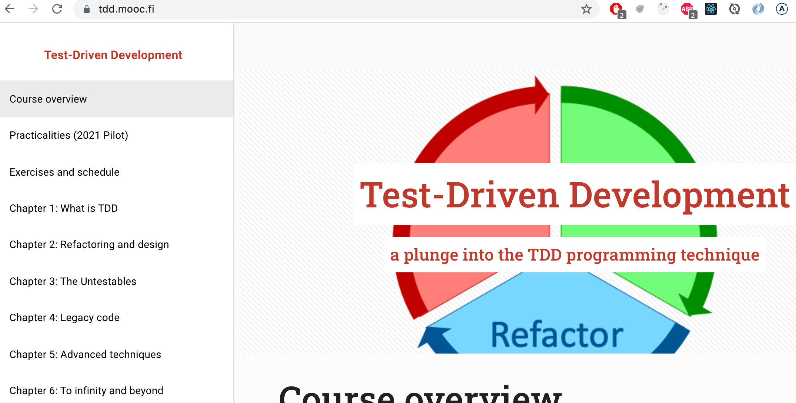
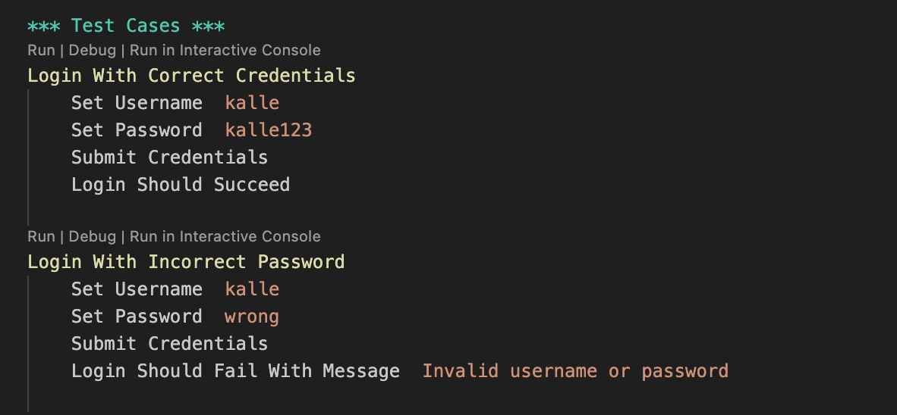
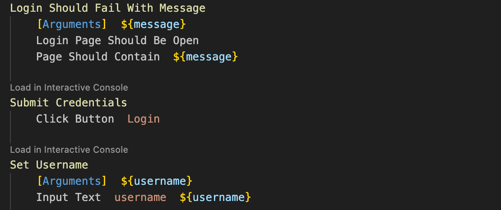
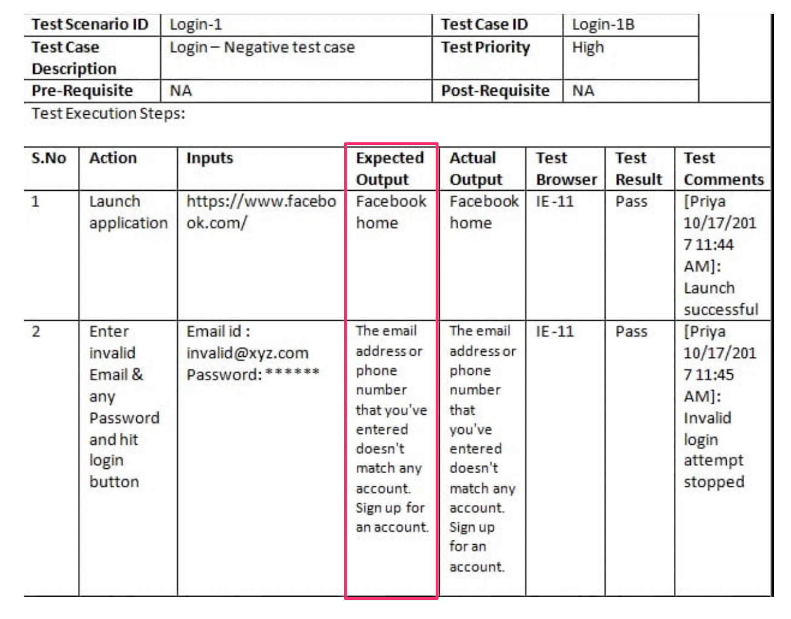
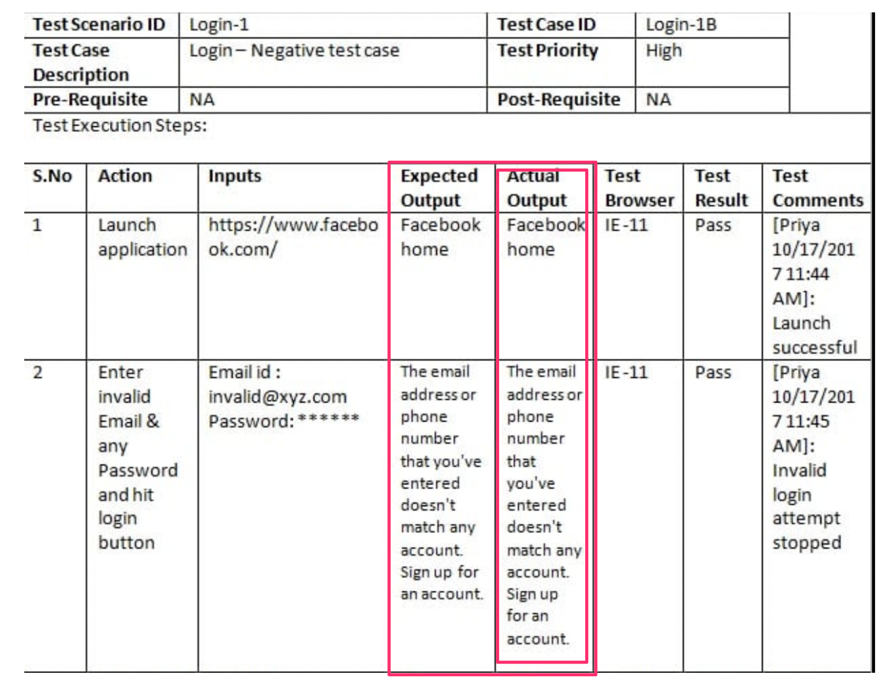
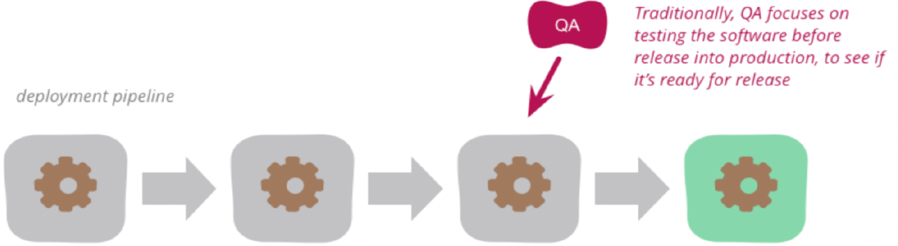
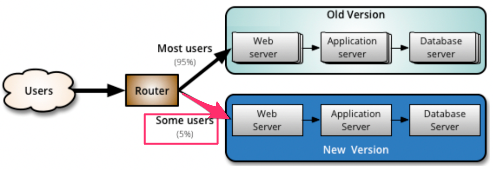

% Ohjelmistotuotanto

% Software production

Translations of % Ohjelmistotuotanto
[ Suomi -> English ]

% Ohjelmistotuotanto
    % Software production, % Software manufacturing

% Matti Luukkainen ja ohjaajat Antti, Pooki, Riku, Sini, Taneli

% Matti Luukkainen and directors Antti, Pooki, Riku, Sini, Taneli

Translations of % Matti Luukkainen ja ohjaajat Antti, Pooki, Riku, Sini, Taneli
[ Suomi -> English ]

% Matti Luukkainen ja ohjaajat Antti, Pooki, Riku, Sini, Taneli
    % Matti Luukkainen and directors Antti, Pooki, Riku, Sini, Taneli, % Matti Luukkainen and the instructors Antti, Pooki, Riku, Sini, Taneli

% syksy 2024

% autumn 2024

Translations of % syksy 2024
[ Suomi -> English ]

% syksy 2024
    % autumn 2024, % fall 2024

#

#

                                      Luento 6

                                     Lecture 6

                                    12.11.2024

                                    12.11.2024

# Kurssipalaute

# Course feedback

Translations of # Kurssipalaute
[ Suomi -> English ]

# Kurssipalaute
    # Course feedback, # Lesson feedback

- Kurssipalaute

- Course feedback

Translations of - Kurssipalaute
[ Suomi -> English ]

- Kurssipalaute
    - Course feedback, - Lesson feedback

- Kurssilla lopussa kerättävän palautteen lisäksi ns.  jatkuva palaute https://norppa.helsinki.fi

- In addition to the feedback collected at the end of the course, the so-called continuous feedback https://norppa.helsinki.fi

Translations of - Kurssilla lopussa kerättävän palautteen lisäksi ns.  jatkuva palaute https://norppa.helsinki.fi
[ Suomi -> English ]

- Kurssilla lopussa kerättävän palautteen lisäksi ns.
    - In addition to the feedback collected at the end of the course, the so-called, - In addition to the feedback gathered at the end of the course, so-called
jatkuva palaute https://norppa.helsinki.fi
    continuous feedback https://norppa.helsinki.fi, ongoing feedback https://norppa.helsinki.fi

#

#

- Luennot

- Lectures

Definitions of - Luennot
[ Suomi -> English ]

noun
    lecture
        luento, esitelmä, saarna, nuhdesaarna, läksytys

- Luennot
    - Lectures, - The lectures

- ma ja ti 12-14

- I'm 12-14

Translations of - ma ja ti 12-14
[ Hrvatski -> English ]

- ma ja ti 12-14
    - I'm 12-14, - but I'm 12-14

- vierailuluentojen ajankohdassa pieni muutos...

- a slight change in the timing of visiting lectures...

Translations of - vierailuluentojen ajankohdassa pieni muutos...
[ Suomi -> English ]

- vierailuluentojen ajankohdassa pieni muutos...
    - a slight change in the timing of visiting lectures..., - a slight change in the time of the visiting lectures...

- Pajaa salissa BK107

- Workshop in hall BK107

Translations of - Pajaa salissa BK107
[ Suomi -> English ]

- Pajaa salissa BK107
    - Workshop in hall BK107, - The workshop in hall BK107

- ma 14-16

- ma 14-16

- to 13-15

- to 13-15

- pe 12-14 (tänä pe poikkeuksellisesti klo 13-15)

- Fri 12-14 (this Friday exceptionally from 13-15)

Translations of - pe 12-14 (tänä pe poikkeuksellisesti klo 13-15)
[ Suomi -> English ]

- pe 12-14 (tänä pe poikkeuksellisesti klo 13-15)
    - Fri 12-14 (this Friday exceptionally from 13-15), - Fri 12-14 (this Friday, exceptionally, 1-3 pm)

# Miniprojektit

# Mini projects

Translations of # Miniprojektit
[ Suomi -> English ]

# Miniprojektit
    # Mini projects, # Mini-projects

- Kohta alkaa!

- It's about to start!

Translations of - Kohta alkaa!
[ Suomi -> English ]

- Kohta alkaa!
    - It's about to start!, - It's time to begin!

- Aloitustilaisuudet

- Opening ceremonies

Translations of - Aloitustilaisuudet
[ Suomi -> English ]

- Aloitustilaisuudet
    - Opening ceremonies, - Kick-off events

- ti 14-16

- of 14-16

Translations of - ti 14-16
[ Yorùbá -> English ]

- ti 14-16
    - of 14-16, - from 14 to 16

- ke 14-16

- the 14-16

Translations of - ke 14-16
[ ʻŌlelo Hawaiʻi -> English ]

- ke 14-16
    - the 14-16, - 14-16

- ke 16-18

- when 16-18

Translations of - ke 16-18
[ ʻŌlelo Hawaiʻi -> English ]

- ke 16-18
    - when 16-18, - 16-18

- to 10-12

- to 10-12

- to 14-16

- to 14-16

- Seuraavat viikot: sprinttien katselmus ja suunnittelu samassa aikaikkunassa

- Next weeks: review and planning of sprints in the same time window

Translations of - Seuraavat viikot: sprinttien katselmus ja suunnittelu samassa aikaikkunassa
[ Suomi -> English ]

- Seuraavat viikot: sprinttien katselmus ja suunnittelu samassa aikaikkunassa
    - Next weeks: review and planning of sprints in the same time window, - The following weeks: sprint review and planning in the same time window

- Loppudemot

- End of life

Translations of - Loppudemot
[ Svenska -> English ]

- Loppudemot
    - End of life, - Lopmodemot

- ke 11.12.  klo 12-14 B123

- to 11.12. klo 12-14 B123

Translations of - ke 11.12.  klo 12-14 B123
[ Bahasa Indonesia -> English ]

- ke 11.12.
    - to 11.12., - 11.12.
klo 12-14 B123
    klo 12-14 B123, 12-14 B123

- to 12.12. klo 12-14 CK112

- to 12.12. klo 12-14 CK112

# Testauksen tasot

# Levels of testing

Translations of # Testauksen tasot
[ Suomi -> English ]

# Testauksen tasot
    # Levels of testing, # Test levels

- _ Yksikkötestaus _ (unit testing)

- _ Unit testing _ (unit testing)

Translations of - _ Yksikkötestaus _ (unit testing)
[ Suomi -> English ]

- _ Yksikkötestaus _ (unit testing)
    - _ Unit testing _ (unit testing), - _ Unit testing

- Yksittäisten luokkien, metodien ja moduulien testaus erillään muusta kokonaisuudesta

- Testing of individual classes, methods and modules separately from the rest of the entity

Translations of - Yksittäisten luokkien, metodien ja moduulien testaus erillään muusta kokonaisuudesta
[ Suomi -> English ]

- Yksittäisten luokkien, metodien ja moduulien testaus erillään muusta kokonaisuudesta
    - Testing of individual classes, methods and modules separately from the rest of the entity, - Testing of individual classes, methods and modules separately from the rest of the whole

- _Integraatiotestaus_ (integration testing)

- _Integraatiotestaus_ (integration testing)

- Yksittäin testattujen komponenttien liittäminen yhteen eli integrointi ja kokonaisuuden testaus

- Connecting individually tested components together, i.e. integration and overall testing

Translations of - Yksittäin testattujen komponenttien liittäminen yhteen eli integrointi ja kokonaisuuden testaus
[ Suomi -> English ]

- Yksittäin testattujen komponenttien liittäminen yhteen eli integrointi ja kokonaisuuden testaus
    - Connecting individually tested components together, i.e. integration and overall testing, - Connecting the individually tested components together, i.e. integration and testing the whole

- _ Järjestelmätestaus _ (system testing)

- _ System testing _ (system testing)

Translations of - _ Järjestelmätestaus _ (system testing)
[ Suomi -> English ]

- _ Järjestelmätestaus _ (system testing)
    - _ System testing _ (system testing), - _ System testing

- Toimiiko ohjelmisto vaatimuksiin kirjatulla tavalla?

- Does the software work as stated in the requirements?

Translations of - Toimiiko ohjelmisto vaatimuksiin kirjatulla tavalla?
[ Suomi -> English ]

- Toimiiko ohjelmisto vaatimuksiin kirjatulla tavalla?
    - Does the software work as stated in the requirements?, - Does the software work as stated in the specifications?

- Tutkii järjestelmää kokonaisuudessaan: _end to end -testaus_

- Examines the system as a whole: _end to end testing_

Translations of - Tutkii järjestelmää kokonaisuudessaan: _end to end -testaus_
[ Suomi -> English ]

- Tutkii järjestelmää kokonaisuudessaan: _end to end -testaus_
    - Examines the system as a whole: _end to end testing_, - Examines the entire system: _end to end testing_

- Jakautuu useisiin alalajeihin

- Divided into several subspecies

Translations of - Jakautuu useisiin alalajeihin
[ Suomi -> English ]

- Jakautuu useisiin alalajeihin
    - Divided into several subspecies, - It is divided into several subspecies

- _ Käyttäjän hyväksymistestaus _ (user acceptance testing)

- _ User acceptance testing _ (user acceptance testing)

Translations of - _ Käyttäjän hyväksymistestaus _ (user acceptance testing)
[ Suomi -> English ]

- _ Käyttäjän hyväksymistestaus _ (user acceptance testing)
    - _ User acceptance testing _ (user acceptance testing), - _ User Acceptance Testing _ (user acceptance testing)

- Loppukäyttäjän tuotteelle suorittama testaus

- Testing performed by the end user on the product

Translations of - Loppukäyttäjän tuotteelle suorittama testaus
[ Suomi -> English ]

- Loppukäyttäjän tuotteelle suorittama testaus
    - Testing performed by the end user on the product, - Testing of the product by the end user

# Regressiotestaus

# Regressiotestaus

- Iteratiivisessa ohjelmistotuotannossa, jokainen iteraatio tuottaa ohjelmistoon uusia ominaisuuksia

- In iterative software production, each iteration produces new features for the software

Translations of - Iteratiivisessa ohjelmistotuotannossa, jokainen iteraatio tuottaa ohjelmistoon uusia ominaisuuksia
[ Suomi -> English ]

- Iteratiivisessa ohjelmistotuotannossa, jokainen iteraatio tuottaa ohjelmistoon uusia ominaisuuksia
    - In iterative software production, each iteration produces new features for the software, - In iterative software production, every iteration produces new features for the software

- Samalla tulee huolehtia, että ei rikota jo toimivia osia

- At the same time, care must be taken not to damage already working parts

Translations of - Samalla tulee huolehtia, että ei rikota jo toimivia osia
[ Suomi -> English ]

- Samalla tulee huolehtia, että ei rikota jo toimivia osia
    - At the same time, care must be taken not to damage already working parts, - At the same time, care must be taken not to damage the already functioning parts

. . .

. . .

- Testit on suoritettava uudelleen aina kun ohjelmistoon tehdään muutoksia

- The tests must be performed again whenever changes are made to the software

Translations of - Testit on suoritettava uudelleen aina kun ohjelmistoon tehdään muutoksia
[ Suomi -> English ]

- Testit on suoritettava uudelleen aina kun ohjelmistoon tehdään muutoksia
    - The tests must be performed again whenever changes are made to the software, - The tests must be performed again every time changes are made to the software

- Tätä käytäntöä sanotaan _regressiotestaukseksi_

- This practice is called _regression testing_

Translations of - Tätä käytäntöä sanotaan _regressiotestaukseksi_
[ Suomi -> English ]

- Tätä käytäntöä sanotaan _regressiotestaukseksi_
    - This practice is called _regression testing_, - This practice is known as _regression testing_

. . .

. . .

- Testaus on työlästä ja regressiotestauksen tarve tekee siitä entistä työläämpää

- Testing is tedious and the need for regression testing makes it even more tedious

Translations of - Testaus on työlästä ja regressiotestauksen tarve tekee siitä entistä työläämpää
[ Suomi -> English ]

- Testaus on työlästä ja regressiotestauksen tarve tekee siitä entistä työläämpää
    - Testing is tedious and the need for regression testing makes it even more tedious, - Testing is laborious, and the need for regression testing makes it even more laborious

- syytä automatisoida

- reason to automate

Translations of - syytä automatisoida
[ Suomi -> English ]

- syytä automatisoida
    - reason to automate, - need to automate

# Ketterien menetelmien testauskäytänteet

# Testing practices for agile methods

Translations of # Ketterien menetelmien testauskäytänteet
[ Suomi -> English ]

# Ketterien menetelmien testauskäytänteet
    # Testing practices for agile methods, # Agile methodology testing practices

. . .

. . .

- Testauksen rooli ketterissä menetelmissä poikkeaa huomattavasti vesiputousmallista

- The role of testing in agile methods is significantly different from the waterfall model

Translations of - Testauksen rooli ketterissä menetelmissä poikkeaa huomattavasti vesiputousmallista
[ Suomi -> English ]

- Testauksen rooli ketterissä menetelmissä poikkeaa huomattavasti vesiputousmallista
    - The role of testing in agile methods is significantly different from the waterfall model, - The role of testing in agile methods differs considerably from the waterfall model

- Sprintin aikana toteutettavat ominaisuudet integroidaan muuhun koodiin sekä testataan

- The features implemented during the sprint are integrated into the rest of the code and tested

Translations of - Sprintin aikana toteutettavat ominaisuudet integroidaan muuhun koodiin sekä testataan
[ Suomi -> English ]

- Sprintin aikana toteutettavat ominaisuudet integroidaan muuhun koodiin sekä testataan
    - The features implemented during the sprint are integrated into the rest of the code and tested, - The features implemented during the sprint are integrated with other code and tested

. . .

. . .

- Sykli ominaisuuden määrittelystä siihen että se on valmis ja testattu on erittäin lyhyt

- The cycle from defining a feature to when it is ready and tested is very short

Translations of - Sykli ominaisuuden määrittelystä siihen että se on valmis ja testattu on erittäin lyhyt
[ Suomi -> English ]

- Sykli ominaisuuden määrittelystä siihen että se on valmis ja testattu on erittäin lyhyt
    - The cycle from defining a feature to when it is ready and tested is very short, - The cycle from the definition of a feature to its completion and testing is very short

. . .

. . .

- Testausta tehdään sprintin "ensimmäisestä päivästä" lähtien, testaus integroitu suunnitteluun ja toteutukseen

- Testing is done from the "first day" of the sprint, testing is integrated into planning and implementation

Translations of - Testausta tehdään sprintin "ensimmäisestä päivästä" lähtien, testaus integroitu suunnitteluun ja toteutukseen
[ Suomi -> English ]

- Testausta tehdään sprintin "ensimmäisestä päivästä" lähtien, testaus integroitu suunnitteluun ja toteutukseen
    - Testing is done from the "first day" of the sprint, testing is integrated into planning and implementation, - Testing is done from the "first day" of the sprint, testing is integrated into the design and implementation

. . .

. . .

- Automatisointi erittäin tärkeässä roolissa

- Automation in a very important role

Translations of - Automatisointi erittäin tärkeässä roolissa
[ Suomi -> English ]

- Automatisointi erittäin tärkeässä roolissa
    - Automation in a very important role, - Automation plays an extremely important role

- testejä suoritetaan usein

- tests are performed frequently

Translations of - testejä suoritetaan usein
[ Suomi -> English ]

- testejä suoritetaan usein
    - tests are performed frequently, - tests are carried out often

# Testaajat osana kehitystiimiä

# Testers as part of the development team

Translations of # Testaajat osana kehitystiimiä
[ Suomi -> English ]

# Testaajat osana kehitystiimiä
    # Testers as part of the development team, # Testers as part of development team

- Ideaalitilanteessa testaajia sijoitettu kehittäjätiimiin, myös ohjelmoijat kirjoittavat testejä

- In an ideal situation, testers are placed in the development team, programmers also write tests

Translations of - Ideaalitilanteessa testaajia sijoitettu kehittäjätiimiin, myös ohjelmoijat kirjoittavat testejä
[ Suomi -> English ]

- Ideaalitilanteessa testaajia sijoitettu kehittäjätiimiin, myös ohjelmoijat kirjoittavat testejä
    - In an ideal situation, testers are placed in the development team, programmers also write tests, - In an ideal situation, testers are placed in the development team, also programmers write tests

- tiimit _cross functional_

- tiimit _cross functional_

. . .

. . .

- Testaajan rooli: _virheiden etsijästä virheiden estäjään_

- The tester's role: _from finding errors to preventing errors_

Translations of - Testaajan rooli: _virheiden etsijästä virheiden estäjään_
[ Suomi -> English ]

- Testaajan rooli: _virheiden etsijästä virheiden estäjään_
    - The tester's role: _from finding errors to preventing errors_, - The role of the tester: _from finding bugs to preventing bugs_

- testaaja auttaa tiimiä kirjoittamaan automatisoituja testejä, jotka pyrkivät estämään bugien pääsyn koodiin

- the tester helps the team write automated tests that aim to prevent bugs from entering the code

Translations of - testaaja auttaa tiimiä kirjoittamaan automatisoituja testejä, jotka pyrkivät estämään bugien pääsyn koodiin
[ Suomi -> English ]

- testaaja auttaa tiimiä kirjoittamaan automatisoituja testejä, jotka pyrkivät estämään bugien pääsyn koodiin
    - the tester helps the team write automated tests that aim to prevent bugs from entering the code, - the tester helps the team to write automated tests that try to prevent bugs from entering the code

- _build quality in_

- _build quality in_

# Ketterien menetelmien testauskäytänteitä

# Testing practices for agile methods

Translations of # Ketterien menetelmien testauskäytänteitä
[ Suomi -> English ]

# Ketterien menetelmien testauskäytänteitä
    # Testing practices for agile methods, # Agile methodology testing practices

Tänään aiheena

Today's topic

Translations of Tänään aiheena
[ Suomi -> English ]

Tänään aiheena
    Today's topic, Today's subject

. . .

. . .

- Test driven development (TDD)

- Test driven development (TDD)

- User storyjen tasolla tapahtuva automatisoitu testaus

- Automated testing at the level of user stories

Translations of - User storyjen tasolla tapahtuva automatisoitu testaus
[ Suomi -> English ]

- User storyjen tasolla tapahtuva automatisoitu testaus
    - Automated testing at the level of user stories, - Automated testing at user story level

- Continuous Integration (CI) eli jatkuva integraatio

- Continuous Integration (CI) i.e. continuous integration

Translations of - Continuous Integration (CI) eli jatkuva integraatio
[ Suomi -> English ]

- Continuous Integration (CI) eli jatkuva integraatio
    - Continuous Integration (CI) i.e. continuous integration, - Continuous Integration (CI) or continuous integration

- Exploratory testing, suomeksi tutkiva testaus

- Exploratory testing, in Finnish

Translations of - Exploratory testing, suomeksi tutkiva testaus
[ Suomi -> English ]

- Exploratory testing, suomeksi tutkiva testaus
    - Exploratory testing, in Finnish, - Exploratory testing, in Finnish, exploratory testing

- Tuotannossa tapahtuva testaus

- Testing in production

Translations of - Tuotannossa tapahtuva testaus
[ Suomi -> English ]

- Tuotannossa tapahtuva testaus
    - Testing in production, - Testing that takes place in production

# Test driven development (TDD)

# Test driven development (TDD)

{ width=340 }

{ width=340 }

. . .

. . .

1. Kirjoitetaan sen verran testiä että testi ei mene läpi

1. Let's write enough tests that the test doesn't pass

Translations of 1. Kirjoitetaan sen verran testiä että testi ei mene läpi
[ Suomi -> English ]

1. Kirjoitetaan sen verran testiä että testi ei mene läpi
    1. Let's write enough tests that the test doesn't pass, 1. Let's write so much test that the test doesn't pass

. . .

. . .

2. Kirjoitetaan koodia sen verran, että testi menee läpi

2. Let's write enough code to pass the test

Translations of 2. Kirjoitetaan koodia sen verran, että testi menee läpi
[ Suomi -> English ]

2. Kirjoitetaan koodia sen verran, että testi menee läpi
    2. Let's write enough code to pass the test, 2. Let's write enough code that the test passes

. . .

. . .

3. Jos huomataan koodin rakenteen menneen huonoksi refaktoroidaan koodin rakenne paremmaksi

3. If it is noticed that the structure of the code has gone bad, the structure of the code will be refactored to make it better

Translations of 3. Jos huomataan koodin rakenteen menneen huonoksi refaktoroidaan koodin rakenne paremmaksi
[ Suomi -> English ]

3. Jos huomataan koodin rakenteen menneen huonoksi refaktoroidaan koodin rakenne paremmaksi
    3. If it is noticed that the structure of the code has gone bad, the structure of the code will be refactored to make it better, 3. If it is noticed that the structure of the code has gone bad, the structure of the code is refactored to be better

. . .

. . .

4. Jatketaan askeleesta 1

4. Let's continue from step 1

Translations of 4. Jatketaan askeleesta 1
[ Suomi -> English ]

4. Jatketaan askeleesta 1
    4. Let's continue from step 1, 4. Continue from step 1

# Test driven development (TDD)

# Test driven development (TDD)

- Yksi XP:n käytänteistä, Kent Beckin kehittämä

- One of the practices of XP, developed by Kent Beck

Translations of - Yksi XP:n käytänteistä, Kent Beckin kehittämä
[ Suomi -> English ]

- Yksi XP:n käytänteistä, Kent Beckin kehittämä
    - One of the practices of XP, developed by Kent Beck, - One of XP's practices, developed by Kent Beck

- Joskus käytössä test first development

- Sometimes used test first development

Translations of - Joskus käytössä test first development
[ Suomi -> English ]

- Joskus käytössä test first development
    - Sometimes used test first development, - Test first development is sometimes used

. . .

. . .

- TDD:llä ohjelmoitaessa toteutettavaa komponenttia ei yleensä ole tapana suunnitella tyhjentävästi etukäteen

- When programming with TDD, it is usually not customary to exhaustively plan the component to be implemented in advance

Translations of - TDD:llä ohjelmoitaessa toteutettavaa komponenttia ei yleensä ole tapana suunnitella tyhjentävästi etukäteen
[ Suomi -> English ]

- TDD:llä ohjelmoitaessa toteutettavaa komponenttia ei yleensä ole tapana suunnitella tyhjentävästi etukäteen
    - When programming with TDD, it is usually not customary to exhaustively plan the component to be implemented in advance, - When programming with TDD, the implemented component is usually not planned exhaustively in advance

. . .

. . .

- Testit kirjoitetaan ensisijaisesti ajatellen komponentin käyttöä

- Tests are primarily written with the use of the component in mind

Translations of - Testit kirjoitetaan ensisijaisesti ajatellen komponentin käyttöä
[ Suomi -> English ]

- Testit kirjoitetaan ensisijaisesti ajatellen komponentin käyttöä
    - Tests are primarily written with the use of the component in mind, - Tests are written primarily with the component's use in mind

- huomio komponentin rajapinnassa ja sen helppokäyttöisyydessä

- attention to the interface of the component and its ease of use

Translations of - huomio komponentin rajapinnassa ja sen helppokäyttöisyydessä
[ Suomi -> English ]

- huomio komponentin rajapinnassa ja sen helppokäyttöisyydessä
    - attention to the interface of the component and its ease of use, - attention to the component's interface and its ease of use

- ei niinkään komponentin sisäisessä toteutuksessa

- not so much in the internal implementation of the component

Translations of - ei niinkään komponentin sisäisessä toteutuksessa
[ Suomi -> English ]

- ei niinkään komponentin sisäisessä toteutuksessa
    - not so much in the internal implementation of the component, - not so much in the component's internal implementation

. . .

. . .

- Komponentin sisäinen rakenne muotoutuu refaktorointien kautta

- The internal structure of the component takes shape through refactorings

Translations of - Komponentin sisäinen rakenne muotoutuu refaktorointien kautta
[ Suomi -> English ]

- Komponentin sisäinen rakenne muotoutuu refaktorointien kautta
    - The internal structure of the component takes shape through refactorings, - The internal structure of the component is shaped through refactoring

. . .

. . .

- _"Ensin testataan, sitten koodataan, suunnitellaan vasta lopussa"_

- _"First we test, then we code, we plan only at the end"_

Translations of - _"Ensin testataan, sitten koodataan, suunnitellaan vasta lopussa"_
[ Suomi -> English ]

- _"Ensin testataan, sitten koodataan, suunnitellaan vasta lopussa"_
    - _"First we test, then we code, we plan only at the end"_, - _"First we test, then code, only at the end do we design"_

#

#

- TDD:ssä korostetaan lopputuloksen yksinkertaisuutta

- TDD emphasizes the simplicity of the end result

Translations of - TDD:ssä korostetaan lopputuloksen yksinkertaisuutta
[ Suomi -> English ]

- TDD:ssä korostetaan lopputuloksen yksinkertaisuutta
    - TDD emphasizes the simplicity of the end result, - In TDD, the simplicity of the final result is emphasized

. . .

. . .

- Toteutetaan toiminnallisuutta vain sen verran, mitä testien läpimeno edellyttää

- Functionality is implemented only to the extent required to pass the tests

Translations of - Toteutetaan toiminnallisuutta vain sen verran, mitä testien läpimeno edellyttää
[ Suomi -> English ]

- Toteutetaan toiminnallisuutta vain sen verran, mitä testien läpimeno edellyttää
    - Functionality is implemented only to the extent required to pass the tests, - Functionality is implemented only to the extent that the passing of the tests requires

- Ei toteuteta ”varalta” ekstratoiminnallisuutta, sillä "You ain't gonna need it" (YAGNI)

- Extra functionality is not implemented "just in case", because "You ain't gonna need it" (YAGNI)

Translations of - Ei toteuteta ”varalta” ekstratoiminnallisuutta, sillä "You ain't gonna need it" (YAGNI)
[ Suomi -> English ]

- Ei toteuteta ”varalta” ekstratoiminnallisuutta, sillä "You ain't gonna need it" (YAGNI)
    - Extra functionality is not implemented "just in case", because "You ain't gonna need it" (YAGNI), - No "just in case" extra functionality is implemented, because "You ain't gonna need it" (YAGNI)

- _Simplicity – the art of maximizing the amount of work not done – is essential_

- _Simplicity – the art of maximizing the amount of work not done – is essential_

. . .

. . .

- Koodista on vaikea tehdä testattavaa jos se ei ole modulaarista ja löyhästi kytketyistä komponenteista koostuvaa

- It is difficult to make the code testable if it is not composed of modular and loosely connected components

Translations of - Koodista on vaikea tehdä testattavaa jos se ei ole modulaarista ja löyhästi kytketyistä komponenteista koostuvaa
[ Suomi -> English ]

- Koodista on vaikea tehdä testattavaa jos se ei ole modulaarista ja löyhästi kytketyistä komponenteista koostuvaa
    - It is difficult to make the code testable if it is not composed of modular and loosely connected components, - It is difficult to make the code testable if it is not modular and consists of loosely coupled components

- koodista laadukasta ylläpidettävyyden ja laajennettavuuden kannalta

- code quality in terms of maintainability and extensibility

Translations of - koodista laadukasta ylläpidettävyyden ja laajennettavuuden kannalta
[ Suomi -> English ]

- koodista laadukasta ylläpidettävyyden ja laajennettavuuden kannalta
    - code quality in terms of maintainability and extensibility, - high quality of code in terms of maintainability and extensibility

. . .

. . .

- Muita TDD:n hyviä puolia:

- Other good aspects of TDD:

Translations of - Muita TDD:n hyviä puolia:
[ Suomi -> English ]

- Muita TDD:n hyviä puolia:
    - Other good aspects of TDD:, - Other advantages of TDD:

- Rohkaisee ottamaan pieniä askelia kerrallaan ja toimimaan fokusoidusti

- Encourages to take small steps at a time and to act focused

Translations of - Rohkaisee ottamaan pieniä askelia kerrallaan ja toimimaan fokusoidusti
[ Suomi -> English ]

- Rohkaisee ottamaan pieniä askelia kerrallaan ja toimimaan fokusoidusti
    - Encourages to take small steps at a time and to act focused, - Encourages to take small steps at a time and to act in a focused manner

- Virheet havaitaan nopeasti suuren testijoukon takia

- Errors are detected quickly due to the large test set

Translations of - Virheet havaitaan nopeasti suuren testijoukon takia
[ Suomi -> English ]

- Virheet havaitaan nopeasti suuren testijoukon takia
    - Errors are detected quickly due to the large test set, - Errors are quickly detected due to the large test set

# TDD:llä on myös ikävät puolensa

# TDD also has its downsides

Translations of # TDD:llä on myös ikävät puolensa
[ Suomi -> English ]

# TDD:llä on myös ikävät puolensa
    # TDD also has its downsides, # TDD has its downsides too

- Testikoodia tulee paljon, usein suunnilleen saman verran kuin varsinaista koodia

- There will be a lot of test code, often about the same amount as the actual code

Translations of - Testikoodia tulee paljon, usein suunnilleen saman verran kuin varsinaista koodia
[ Suomi -> English ]

- Testikoodia tulee paljon, usein suunnilleen saman verran kuin varsinaista koodia
    - There will be a lot of test code, often about the same amount as the actual code, - There is a lot of test code, often approximately the same amount as the actual code

- Toisaalta TDD:llä tehty tuotantokoodi on usein hieman normaalisti tehtyä koodia lyhempi

- On the other hand, production code made with TDD is often slightly shorter than code made normally

Translations of - Toisaalta TDD:llä tehty tuotantokoodi on usein hieman normaalisti tehtyä koodia lyhempi
[ Suomi -> English ]

- Toisaalta TDD:llä tehty tuotantokoodi on usein hieman normaalisti tehtyä koodia lyhempi
    - On the other hand, production code made with TDD is often slightly shorter than code made normally, - On the other hand, the production code made with TDD is often a little shorter than the code made normally

. . .

. . .

- Jos ja kun koodi muuttuu, tulee testejä ylläpitää

- If and when the code changes, tests must be maintained

Translations of - Jos ja kun koodi muuttuu, tulee testejä ylläpitää
[ Suomi -> English ]

- Jos ja kun koodi muuttuu, tulee testejä ylläpitää
    - If and when the code changes, tests must be maintained, - If and when the code changes, the tests should be maintained

- Legacy-koodin laajentaminen TDD:llä voi olla haastavaa

- Extending legacy code with TDD can be challenging

Translations of - Legacy-koodin laajentaminen TDD:llä voi olla haastavaa
[ Suomi -> English ]

- Legacy-koodin laajentaminen TDD:llä voi olla haastavaa
    - Extending legacy code with TDD can be challenging, - Extending legacy code using TDD can be challenging

. . .

. . .

- Tutkimusnäyttö TDD:n hyödyistä vähäistä

- Research evidence on the benefits of TDD is limited

Translations of - Tutkimusnäyttö TDD:n hyödyistä vähäistä
[ Suomi -> English ]

- Tutkimusnäyttö TDD:n hyödyistä vähäistä
    - Research evidence on the benefits of TDD is limited, - Research evidence of the benefits of TDD is scant

# 15.1.2025-

# 15.1.2025-

. . .

. . .

Open Uni: Test-Driven Development 4 + 1 cr

Open Uni: Test-Driven Development 4 + 1 cr

- Esko Luontola Nitor (Suomen johtava TDD-asiantuntija)

- Esko Luontola Nitor (Finland's leading TDD expert)

Translations of - Esko Luontola Nitor (Suomen johtava TDD-asiantuntija)
[ Suomi -> English ]

- Esko Luontola Nitor (Suomen johtava TDD-asiantuntija)
    - Esko Luontola Nitor (Finland's leading TDD expert), - Esko Luontola Nitor (leading TDD expert in Finland)

{ width=350 }

{ width=350 }

Translations of { width=350 }
[  -> English ]

{ width=350 }
    { width=350 }, { width=350 }

# Storyjen testaaminen

# Testing stories

Translations of # Storyjen testaaminen
[ Suomi -> English ]

# Storyjen testaaminen
    # Testing stories, # Testing the stories

. . .

. . .

- User storyn käsite pitää sisällään _ hyväksymiskriteerit _

- The concept of User Story includes _ acceptance criteria _

Translations of - User storyn käsite pitää sisällään _ hyväksymiskriteerit _
[ Suomi -> English ]

- User storyn käsite pitää sisällään _ hyväksymiskriteerit _
    - The concept of User Story includes _ acceptance criteria _, - The concept of a User Story contains _ acceptance criteria _

- _tests that convey and document details and that will be used to determine that the story is complete_

- _tests that convey and document details and that will be used to determine that the story is complete_

. . .

. . .

- Storyn _asiakas voi lisätä tuotteen ostoskoriin_ eräs hyväksymiskriteeri voisi olla

- Story's _customer can add the product to the shopping cart_ could be an acceptance criterion

Translations of - Storyn _asiakas voi lisätä tuotteen ostoskoriin_ eräs hyväksymiskriteeri voisi olla
[ Suomi -> English ]

- Storyn _asiakas voi lisätä tuotteen ostoskoriin_ eräs hyväksymiskriteeri voisi olla
    - Story's _customer can add the product to the shopping cart_ could be an acceptance criterion, - Story's _customer can add the product to the shopping basket_ could be one of the acceptance criteria

- ollessaan tuotelistauksessa ja valitessaan tuotteen jota on varastossa, menee tuote ostoskoriin

- when in the product listing and selecting a product that is in stock, the product goes to the shopping cart

Translations of - ollessaan tuotelistauksessa ja valitessaan tuotteen jota on varastossa, menee tuote ostoskoriin
[ Suomi -> English ]

- ollessaan tuotelistauksessa ja valitessaan tuotteen jota on varastossa, menee tuote ostoskoriin
    - when in the product listing and selecting a product that is in stock, the product goes to the shopping cart, - when in the product listing and choosing a product that is in stock, the product goes to the shopping cart

- ja ostoskorin hinta sekä korissa olevien tuotteiden määrä päivittyy oikein

- and the price of the shopping basket and the number of products in the basket are updated correctly

Translations of - ja ostoskorin hinta sekä korissa olevien tuotteiden määrä päivittyy oikein
[ Suomi -> English ]

- ja ostoskorin hinta sekä korissa olevien tuotteiden määrä päivittyy oikein
    - and the price of the shopping basket and the number of products in the basket are updated correctly, - and the price of the shopping cart as well as the number of products in the cart are updated correctly

. . .

. . .

- Hyväksymiskriteereistä saadaan muodostettua suurin osa ohjelmiston järjestelmätason toiminnallisista testeistä

- Most of the system-level functional tests of the software can be formed from the acceptance criteria

Translations of - Hyväksymiskriteereistä saadaan muodostettua suurin osa ohjelmiston järjestelmätason toiminnallisista testeistä
[ Suomi -> English ]

- Hyväksymiskriteereistä saadaan muodostettua suurin osa ohjelmiston järjestelmätason toiminnallisista testeistä
    - Most of the system-level functional tests of the software can be formed from the acceptance criteria, - Most of the software's system level functional tests can be formed from the acceptance criteria

# Järjestelmätestauksen automatisointi, ATDD ja BDD

# Automation of system testing, ATDD and BDD

Translations of # Järjestelmätestauksen automatisointi, ATDD ja BDD
[ Suomi -> English ]

# Järjestelmätestauksen automatisointi, ATDD ja BDD
    # Automation of system testing, ATDD and BDD, # System testing automation, ATDD and BDD

- Hyväksymiskriteerit on tarkoituksenmukaista kirjoittaa heti storyn toteuttavan sprintin alussa

- It is appropriate to write the acceptance criteria right at the beginning of the sprint that implements the Story

Translations of - Hyväksymiskriteerit on tarkoituksenmukaista kirjoittaa heti storyn toteuttavan sprintin alussa
[ Suomi -> English ]

- Hyväksymiskriteerit on tarkoituksenmukaista kirjoittaa heti storyn toteuttavan sprintin alussa
    - It is appropriate to write the acceptance criteria right at the beginning of the sprint that implements the Story, - It is appropriate to write the acceptance criteria immediately at the beginning of the sprint that implements the Story

- yhteistyössä kehitystiimin ja product ownerin kesken

- in cooperation between the development team and the product owner

Translations of - yhteistyössä kehitystiimin ja product ownerin kesken
[ Suomi -> English ]

- yhteistyössä kehitystiimin ja product ownerin kesken
    - in cooperation between the development team and the product owner, - in collaboration between the development team and product owner

- asiakkaan kielellä, käyttämättä teknistä jargonia

- in the customer's language, without using technical jargon

Translations of - asiakkaan kielellä, käyttämättä teknistä jargonia
[ Suomi -> English ]

- asiakkaan kielellä, käyttämättä teknistä jargonia
    - in the customer's language, without using technical jargon, - in the language of the customer, without using technical jargon

. . .

. . .

- Ideaalitilanteessa storyjen hyväksymiskriteereistä tehdään automaattisesti suoritettavia

- In an ideal situation, the acceptance criteria for stories are made automatically executable

Translations of - Ideaalitilanteessa storyjen hyväksymiskriteereistä tehdään automaattisesti suoritettavia
[ Suomi -> English ]

- Ideaalitilanteessa storyjen hyväksymiskriteereistä tehdään automaattisesti suoritettavia
    - In an ideal situation, the acceptance criteria for stories are made automatically executable, - In an ideal situation, the criteria for accepting stories are made automatically executable

. . .

. . .

- Olemassa monia työkaluja

- Many tools exist

Translations of - Olemassa monia työkaluja
[ Suomi -> English ]

- Olemassa monia työkaluja
    - Many tools exist, - There are many tools available

- eräs suosituimmista on suomalainen Python-pohjainen _Robot framework_ jota kurssin Python-versio käyttää

- one of the most popular is the Finnish Python-based _Robot framework_, which the Python version of the course uses

Translations of - eräs suosituimmista on suomalainen Python-pohjainen _Robot framework_ jota kurssin Python-versio käyttää
[ Suomi -> English ]

- eräs suosituimmista on suomalainen Python-pohjainen _Robot framework_ jota kurssin Python-versio käyttää
    - one of the most popular is the Finnish Python-based _Robot framework_, which the Python version of the course uses, - one of the most popular is the Finnish Python-based _Robot framework_ which is used by the Python version of the course

. . .

. . .

- Käytetään nimitystä _Acceptance test driven development_ (ATDD) tai _Behavior driven development_ (BDD)

- The name _Acceptance test driven development_ (ATDD) or _Behavior driven development_ (BDD) is used

Translations of - Käytetään nimitystä _Acceptance test driven development_ (ATDD) tai _Behavior driven development_ (BDD)
[ Suomi -> English ]

- Käytetään nimitystä _Acceptance test driven development_ (ATDD) tai _Behavior driven development_ (BDD)
    - The name _Acceptance test driven development_ (ATDD) or _Behavior driven development_ (BDD) is used, - We use the name _Acceptance test driven development_ (ATDD) or _Behavior driven development_ (BDD)

- erityisesti jos testit toteutetaan jo iteraation alkupuolella, ennen kun story koodattu

- especially if the tests are already implemented at the beginning of the iteration, before the story is coded

Translations of - erityisesti jos testit toteutetaan jo iteraation alkupuolella, ennen kun story koodattu
[ Suomi -> English ]

- erityisesti jos testit toteutetaan jo iteraation alkupuolella, ennen kun story koodattu
    - especially if the tests are already implemented at the beginning of the iteration, before the story is coded, - especially if the tests are carried out already at the beginning of the iteration, before the story is coded

# Käyttäjähallinnan tarjoama palvelu

# Service provided by user management

Translations of # Käyttäjähallinnan tarjoama palvelu
[ Suomi -> English ]

# Käyttäjähallinnan tarjoama palvelu
    # Service provided by user management, # A service provided by the user management

- Palvelun vaatimukset määrittelevät user storyt

- Service requirements are defined by user stories

Translations of - Palvelun vaatimukset määrittelevät user storyt
[ Suomi -> English ]

- Palvelun vaatimukset määrittelevät user storyt
    - Service requirements are defined by user stories, - User stories define the requirements of the service

- A new user account can be created if a proper unused username and a proper password are given

- A new user account can be created if a proper unused username and a proper password are given

- User can log in with a valid username/password-combination

- User can log in with a valid username/password-combination

. . .

. . .

- Robot-frameworkia käytettäessä jokaisesta storystä kirjoitetaan .robot- päätteinen tiedosto

- When using the robot framework, a file ending in .robot is written from each story

Translations of - Robot-frameworkia käytettäessä jokaisesta storystä kirjoitetaan .robot- päätteinen tiedosto
[ Suomi -> English ]

- Robot-frameworkia käytettäessä jokaisesta storystä kirjoitetaan .robot- päätteinen tiedosto
    - When using the robot framework, a file ending in .robot is written from each story, - When using the robot framework, a file with the extension .robot is written from each story

- sisältää joukon storyyn liittyvä hyväksymistestejä

- contains a set of acceptance tests related to the story

Translations of - sisältää joukon storyyn liittyvä hyväksymistestejä
[ Suomi -> English ]

- sisältää joukon storyyn liittyvä hyväksymistestejä
    - contains a set of acceptance tests related to the story, - includes a set of story-related acceptance tests

. . .

. . .

- Storyn hyväksymä testit kirjoitetaan hyödyntäen _ avainsanoja _

- Tests approved by Story are written using _ keywords _

Translations of - Storyn hyväksymä testit kirjoitetaan hyödyntäen _ avainsanoja _
[ Suomi -> English ]

- Storyn hyväksymä testit kirjoitetaan hyödyntäen _ avainsanoja _
    - Tests approved by Story are written using _ keywords _, - Tests accepted by Story are written using _ keywords _

# Testit asiakkan kielellä

# Tests in the customer's language

Translations of # Testit asiakkan kielellä
[ Suomi -> English ]

# Testit asiakkan kielellä
    # Tests in the customer's language, # Tests in the language of the customer

{ width=400 }

{ width=400 }

- Set username _, _ Submit credentials _ ym avainsanoja

- Set username _, _ Submit Credentials _ and other keywords

Translations of - Set username _, _ Submit credentials _ ym avainsanoja
[ Suomi -> English ]

- Set username _, _ Submit credentials _ ym avainsanoja
    - Set username _, _ Submit Credentials _ and other keywords, - Set username _, _ Submit Credentials _, etc. keywords

# Avainsanat mäpätään suoritettavaksi

# Keywords are mapped for execution

Translations of # Avainsanat mäpätään suoritettavaksi
[ Suomi -> English ]

# Avainsanat mäpätään suoritettavaksi
    # Keywords are mapped for execution, # The keywords are mapped to execute

- Avainsanojen määrittely toisten avainsanojen avulla

- Defining keywords using other keywords

Translations of - Avainsanojen määrittely toisten avainsanojen avulla
[ Suomi -> English ]

- Avainsanojen määrittely toisten avainsanojen avulla
    - Defining keywords using other keywords, - Defining keywords with the help of other keywords

{ width=340 }

{ width=340 }

- osa avainsanoista SeleniumLibraryn tarjoamia

- some keywords provided by SeleniumLibrary

Translations of - osa avainsanoista SeleniumLibraryn tarjoamia
[ Suomi -> English ]

- osa avainsanoista SeleniumLibraryn tarjoamia
    - some keywords provided by SeleniumLibrary, - some of the keywords provided by SeleniumLibrary

. . .

. . .

- టై కూడిన
(- Ṭai kūḍina)

- with a tie

Translations of - టై కూడిన
[ తెలుగు -> English ]

- టై కూడిన
    - with a tie, - tie included

# Motivaatio käyttäjän kielellä kirjoitetuille testeille

# Motivation for tests written in the user's language

Translations of # Motivaatio käyttäjän kielellä kirjoitetuille testeille
[ Suomi -> English ]

# Motivaatio käyttäjän kielellä kirjoitetuille testeille
    # Motivation for tests written in the user's language, # Motivation for tests written in the language of the user

. . .

. . .

- Product owner kirjoittaa tiimin kanssa storyyn liittyvät testit

- The product owner writes the tests related to the story with the team

Translations of - Product owner kirjoittaa tiimin kanssa storyyn liittyvät testit
[ Suomi -> English ]

- Product owner kirjoittaa tiimin kanssa storyyn liittyvät testit
    - The product owner writes the tests related to the story with the team, - Product owner writes tests related to the story with the team

- storyn haluttu toiminnallisuus tulee dokumentoitua ja ohjelmoijat ymmärtävät mistä on kyse

- The desired functionality of the Story must be documented and the programmers understand what it is all about

Translations of - storyn haluttu toiminnallisuus tulee dokumentoitua ja ohjelmoijat ymmärtävät mistä on kyse
[ Suomi -> English ]

- storyn haluttu toiminnallisuus tulee dokumentoitua ja ohjelmoijat ymmärtävät mistä on kyse
    - The desired functionality of the Story must be documented and the programmers understand what it is all about, - The desired functionality of Story must be documented and the programmers understand what it is about

. . .

. . .

- Koodaajat/testaajat toteuttavat avainsanat siten, että testien automaattinen suoritus onnistuu

- Coders/testers implement the keywords in such a way that the automatic execution of the tests is successful

Translations of - Koodaajat/testaajat toteuttavat avainsanat siten, että testien automaattinen suoritus onnistuu
[ Suomi -> English ]

- Koodaajat/testaajat toteuttavat avainsanat siten, että testien automaattinen suoritus onnistuu
    - Coders/testers implement the keywords in such a way that the automatic execution of the tests is successful, - Coders/testers implement the keywords in such a way that the automatic execution of the tests succeeds

. . .

. . .

- Ei toistaiseksi vielä kovin yleinen tyyli, useimmiten hyväksymätestit kirjoitettu suoraan "normalilla" testikirjastolla

- So far not a very common style, mostly the accepted tests are written directly with the "normal" test library

Translations of - Ei toistaiseksi vielä kovin yleinen tyyli, useimmiten hyväksymätestit kirjoitettu suoraan "normalilla" testikirjastolla
[ Suomi -> English ]

- Ei toistaiseksi vielä kovin yleinen tyyli, useimmiten hyväksymätestit kirjoitettu suoraan "normalilla" testikirjastolla
    - So far not a very common style, mostly the accepted tests are written directly with the "normal" test library, - So far not a very common style, most of the approved tests are written directly with a "normal" test library

- JUnit, Mocha, Jest, Rspec ...

- JUnit, Mocha, Jest, Rspec...

Translations of - JUnit, Mocha, Jest, Rspec ...
[ Polski -> English ]

- JUnit, Mocha, Jest, Rspec ...
    - JUnit, Mocha, Jest, Rspec..., - JUnit, Mocha, Jest, Rspec…

- Cypress, Playwright

- Cypress, Playwright

# Tauko 10 min ehkä nyt...

# Break 10 min maybe now...

Translations of # Tauko 10 min ehkä nyt...
[ Suomi -> English ]

# Tauko 10 min ehkä nyt...
    # Break 10 min maybe now..., # Break for 10 mins maybe now...

# Ohjelmiston integraatio

# Software integration

Translations of # Ohjelmiston integraatio
[ Suomi -> English ]

# Ohjelmiston integraatio
    # Software integration, # Software Integration

. . .

. . .

- Vesiputousmallissa toteutusvaiheen päättää integrointi

- In the waterfall model, the implementation phase ends with integration

Translations of - Vesiputousmallissa toteutusvaiheen päättää integrointi
[ Suomi -> English ]

- Vesiputousmallissa toteutusvaiheen päättää integrointi
    - In the waterfall model, the implementation phase ends with integration, - In the waterfall model, the implementation phase is completed by integration

- Yksittäin testatut komponentit yhdessä toimivaksi kokonaisuudeksi

- Individually tested components into a unit that works together

Translations of - Yksittäin testatut komponentit yhdessä toimivaksi kokonaisuudeksi
[ Suomi -> English ]

- Yksittäin testatut komponentit yhdessä toimivaksi kokonaisuudeksi
    - Individually tested components into a unit that works together, - Individually tested components into a working whole

- Yhteistoiminnallisuus varmistetaan **integraatiotestien** avulla

- Interoperability is ensured by means of **integration tests**

Translations of - Yhteistoiminnallisuus varmistetaan **integraatiotestien** avulla
[ Suomi -> English ]

- Yhteistoiminnallisuus varmistetaan **integraatiotestien** avulla
    - Interoperability is ensured by means of **integration tests**, - Cooperativeness is ensured by **integration tests**

. . .

. . .

- Perinteisesti integrointi on tuonut esiin paljon ongelmia

- Traditionally, integration has brought up a lot of problems

Translations of - Perinteisesti integrointi on tuonut esiin paljon ongelmia
[ Suomi -> English ]

- Perinteisesti integrointi on tuonut esiin paljon ongelmia
    - Traditionally, integration has brought up a lot of problems, - Traditionally, integration has brought out many problems

- Tarkasta suunnittelusta huolimatta erillisten tiimien toteuttamat komponentit epäyhteensopivia

- Despite careful planning, components implemented by separate teams are incompatible

Translations of - Tarkasta suunnittelusta huolimatta erillisten tiimien toteuttamat komponentit epäyhteensopivia
[ Suomi -> English ]

- Tarkasta suunnittelusta huolimatta erillisten tiimien toteuttamat komponentit epäyhteensopivia
    - Despite careful planning, components implemented by separate teams are incompatible, - Despite careful planning, the components implemented by separate teams are not compatible

. . .

. . .

- Suurten projektien integrointivaihe on kestänyt ennakoimattoman kauan

- The integration phase of large projects has taken an unpredictably long time

Translations of - Suurten projektien integrointivaihe on kestänyt ennakoimattoman kauan
[ Suomi -> English ]

- Suurten projektien integrointivaihe on kestänyt ennakoimattoman kauan
    - The integration phase of large projects has taken an unpredictably long time, - The integration phase of large projects has taken an unforeseeable time

. . .

. . .

- Integrointivaiheen ongelmat ovat aiheuttaneet ohjelmaan suunnittelutason muutoksia

- The problems of the integration phase have caused design level changes to the program

Translations of - Integrointivaiheen ongelmat ovat aiheuttaneet ohjelmaan suunnittelutason muutoksia
[ Suomi -> English ]

- Integrointivaiheen ongelmat ovat aiheuttaneet ohjelmaan suunnittelutason muutoksia
    - The problems of the integration phase have caused design level changes to the program, - The problems of the integration phase have caused changes in the program at the planning level

. . .

. . .

- **Integratiohelvetti**

- **Integratiohelvetti**

# Pois integraatiohelvetistä

# Get out of integration hell

Translations of # Pois integraatiohelvetistä
[ Suomi -> English ]

# Pois integraatiohelvetistä
    # Get out of integration hell, # Away from integration hell

- 90-luvulla huomattiin, että riskien minimoimiseksi integraatio kannattaa tehdä useammin kuin vain projektin lopussa

- In the 90s, it was noticed that in order to minimize risks, integration should be done more often than just at the end of the project

Translations of - 90-luvulla huomattiin, että riskien minimoimiseksi integraatio kannattaa tehdä useammin kuin vain projektin lopussa
[ Suomi -> English ]

- 90-luvulla huomattiin, että riskien minimoimiseksi integraatio kannattaa tehdä useammin kuin vain projektin lopussa
    - In the 90s, it was noticed that in order to minimize risks, integration should be done more often than just at the end of the project, - In the 90s, it was noticed that to minimize risks, integration should be done more often than just at the end of the project

. . .

. . .

- Muodostui uusi paras käytänne: daily builds ja smoke test

- A new best practice was formed: daily builds and smoke test

Translations of - Muodostui uusi paras käytänne: daily builds ja smoke test
[ Suomi -> English ]

- Muodostui uusi paras käytänne: daily builds ja smoke test
    - A new best practice was formed: daily builds and smoke test, - A new best practice was established: daily builds and smoke test

- The _smoke test_ should exercise the entire system from end to end.

- The _smoke test_ should exercise the entire system from end to end.

- It does not have to be exhaustive,

- It does not have to be exhaustive,

- but it should be capable of exposing major problems

- but it should be capable of exposing major problems

. . .

. . .

- Daily buildia ja smoke testiä käytettäessä järjestelmän integraatio tehdään (ainakin jollain tarkkuustasolla) joka päivä

- When using daily build and smoke test, system integration is done (at least with some accuracy level) every day

Translations of - Daily buildia ja smoke testiä käytettäessä järjestelmän integraatio tehdään (ainakin jollain tarkkuustasolla) joka päivä
[ Suomi -> English ]

- Daily buildia ja smoke testiä käytettäessä järjestelmän integraatio tehdään (ainakin jollain tarkkuustasolla) joka päivä
    - When using daily build and smoke test, system integration is done (at least with some accuracy level) every day, - When using daily build and smoke test, the integration of the system is done (at least with some level of accuracy) every day

. . .

. . .

- Komponenttien yhteensopivuusongelmat huomataan nopeasti ja niiden korjaaminen helpottuu

- Component compatibility problems are noticed quickly and their correction becomes easier

Translations of - Komponenttien yhteensopivuusongelmat huomataan nopeasti ja niiden korjaaminen helpottuu
[ Suomi -> English ]

- Komponenttien yhteensopivuusongelmat huomataan nopeasti ja niiden korjaaminen helpottuu
    - Component compatibility problems are noticed quickly and their correction becomes easier, - Compatibility problems of components are noticed quickly and their correction is easier

. . .

. . .

- **Tiimin moraali paranee**, kun ohjelmistosta on olemassa päivittäin kasvava toimiva versio

- **Team morale improves** when there is a daily growing working version of the software

Translations of - **Tiimin moraali paranee**, kun ohjelmistosta on olemassa päivittäin kasvava toimiva versio
[ Suomi -> English ]

- **Tiimin moraali paranee**, kun ohjelmistosta on olemassa päivittäin kasvava toimiva versio
    - **Team morale improves** when there is a daily growing working version of the software, - **Team morale improves** when there is a working version of the software that is growing every day

# Päivittäisestä jatkuvaan integraatioon

# From daily to continuous integration

Translations of # Päivittäisestä jatkuvaan integraatioon
[ Suomi -> English ]

# Päivittäisestä jatkuvaan integraatioon
    # From daily to continuous integration, # From day-to-day to continuous integration

- Syntyi idea toistaa integraatiota vielä päivittäistä sykliäkin useammin: _jatkuva integraatio eli continuous integration_

- The idea was born to repeat the integration even more often than the daily cycle: _continuous integration, i.e. continuous integration_

Translations of - Syntyi idea toistaa integraatiota vielä päivittäistä sykliäkin useammin: _jatkuva integraatio eli continuous integration_
[ Suomi -> English ]

- Syntyi idea toistaa integraatiota vielä päivittäistä sykliäkin useammin: _jatkuva integraatio eli continuous integration_
    - The idea was born to repeat the integration even more often than the daily cycle: _continuous integration, i.e. continuous integration_, - The idea was born to repeat the integration even more often than the daily cycle: _continuous integration_

- eräs XP:n käytenäteistä

- one of XP's uses

Translations of - eräs XP:n käytenäteistä
[ Suomi -> English ]

- eräs XP:n käytenäteistä
    - one of XP's uses, - one of the ways to use XP

. . .

. . .

- Koodi, automatisoidut testi, konfiguraatiot ja build-skriptit pidetään keskitetyssä repositoriossa

- Code, automated test, configurations and build scripts are kept in a centralized repository

Translations of - Koodi, automatisoidut testi, konfiguraatiot ja build-skriptit pidetään keskitetyssä repositoriossa
[ Suomi -> English ]

- Koodi, automatisoidut testi, konfiguraatiot ja build-skriptit pidetään keskitetyssä repositoriossa
    - Code, automated test, configurations and build scripts are kept in a centralized repository, - The code, automated test, configurations and build scripts are kept in a centralized repository

. . .

. . .

- _CI-palvelin_: vastaa konfiguraatioilta mahdollisimman läheisesti tuotantopalvelinta

- _CI server_: corresponds as closely as possible to the production server in terms of configuration

Translations of - _CI-palvelin_: vastaa konfiguraatioilta mahdollisimman läheisesti tuotantopalvelinta
[ Suomi -> English ]

- _CI-palvelin_: vastaa konfiguraatioilta mahdollisimman läheisesti tuotantopalvelinta
    - _CI server_: corresponds as closely as possible to the production server in terms of configuration, - _CI server_: corresponds as close as possible to the production server in terms of configurations

. . .

. . .

- CI-palvelin tarkkailee repositoriota, muutosten tapahtuessa se hakee koodin, kääntää sen ja suorittaa testit

- The CI server monitors the repository, when changes occur it retrieves the code, compiles it and runs the tests

Translations of - CI-palvelin tarkkailee repositoriota, muutosten tapahtuessa se hakee koodin, kääntää sen ja suorittaa testit
[ Suomi -> English ]

- CI-palvelin tarkkailee repositoriota, muutosten tapahtuessa se hakee koodin, kääntää sen ja suorittaa testit
    - The CI server monitors the repository, when changes occur it retrieves the code, compiles it and runs the tests, - The CI server monitors the repository, when changes occur, it retrieves the code, compiles it and runs tests

. . .

. . .

- Jos koodi ei käänny tai testit eivät mene läpi, seurauksena poikkeustilanne joka korjattava _välittömästi_

- If the code doesn't compile or the tests don't pass, the result is an exception that needs to be fixed _immediately_

Translations of - Jos koodi ei käänny tai testit eivät mene läpi, seurauksena poikkeustilanne joka korjattava _välittömästi_
[ Suomi -> English ]

- Jos koodi ei käänny tai testit eivät mene läpi, seurauksena poikkeustilanne joka korjattava _välittömästi_
    - If the code doesn't compile or the tests don't pass, the result is an exception that needs to be fixed _immediately_, - If the code doesn't compile or the tests don't pass, the result is an exception situation that must be fixed _immediately_

. . .

. . .

- **Integraatiosta vaivaton operaatio**: ohjelmistosta olemassa koko ajan integroitu ja testattu tuore versio

- **Effortless integration**: a fresh version of the software is always integrated and tested

Translations of - **Integraatiosta vaivaton operaatio**: ohjelmistosta olemassa koko ajan integroitu ja testattu tuore versio
[ Suomi -> English ]

- **Integraatiosta vaivaton operaatio**: ohjelmistosta olemassa koko ajan integroitu ja testattu tuore versio
    - **Effortless integration**: a fresh version of the software is always integrated and tested, - **Effortless integration**: a fresh version of the software that is integrated and tested all the time

#

#

- Sovelluskehittäjä aloittaa työskentelyn hakemalla koodin uusimman version versionhallinnasta

- The application developer starts working by getting the latest version of the code from the version control

Translations of - Sovelluskehittäjä aloittaa työskentelyn hakemalla koodin uusimman version versionhallinnasta
[ Suomi -> English ]

- Sovelluskehittäjä aloittaa työskentelyn hakemalla koodin uusimman version versionhallinnasta
    - The application developer starts working by getting the latest version of the code from the version control, - The application developer starts working by searching for the latest version of the code from version control

. . .

. . .

- Kehittäjä integroi koodinsa heti muuhun koodiin ja tekee riittävän määrän automatisoituja testejä

- The developer immediately integrates his code with other code and performs a sufficient number of automated tests

Translations of - Kehittäjä integroi koodinsa heti muuhun koodiin ja tekee riittävän määrän automatisoituja testejä
[ Suomi -> English ]

- Kehittäjä integroi koodinsa heti muuhun koodiin ja tekee riittävän määrän automatisoituja testejä
    - The developer immediately integrates his code with other code and performs a sufficient number of automated tests, - The developer integrates his code immediately with other code and performs a sufficient number of automated tests

. . .

. . .

- Tarkoitus että jokainen kehittäjä integroi koodinsa muuhun koodiin mahdollisimman usein, vähintään kerran päivässä

(♂) - The purpose is that every developer integrates his code with other code as often as possible, at least once a day
(♀) - The purpose is that every developer integrates her code with other code as often as possible, at least once a day

Translations of - Tarkoitus että jokainen kehittäjä integroi koodinsa muuhun koodiin mahdollisimman usein, vähintään kerran päivässä
[ Suomi -> English ]

- Tarkoitus että jokainen kehittäjä integroi koodinsa muuhun koodiin mahdollisimman usein, vähintään kerran päivässä
    - The purpose is that every developer integrates his code with other code as often as possible, at least once a day, - The purpose is that each developer integrates their code with other code as often as possible, at least once a day

. . .

. . .

- CI rohkaisee jakamaan työn pieniin osiin, sellaisiin jotka saadaan testeineen valmiiksi yhden työpäivän aikana

- CI encourages dividing the work into small parts, such that can be completed with tests within one working day

Translations of - CI rohkaisee jakamaan työn pieniin osiin, sellaisiin jotka saadaan testeineen valmiiksi yhden työpäivän aikana
[ Suomi -> English ]

- CI rohkaisee jakamaan työn pieniin osiin, sellaisiin jotka saadaan testeineen valmiiksi yhden työpäivän aikana
    - CI encourages dividing the work into small parts, such that can be completed with tests within one working day, - CI encourages dividing the work into small parts, such that can be completed with the tests in one working day

- **CI-työprosessin noudattaminen vaatii kurinalaisuutta**

- **Following the CI work process requires discipline**

Translations of - **CI-työprosessin noudattaminen vaatii kurinalaisuutta**
[ Suomi -> English ]

- **CI-työprosessin noudattaminen vaatii kurinalaisuutta**
    - **Following the CI work process requires discipline**, - **Complying with the CI workflow requires discipline**

. . .

. . .

- Laskareissa käytetty _GitHub Actions_ suosituin SaaS-palveluna toimiva CI-ratkaisu

- _GitHub Actions_, the most popular CI solution as a SaaS service, used in calculators

Translations of - Laskareissa käytetty _GitHub Actions_ suosituin SaaS-palveluna toimiva CI-ratkaisu
[ Suomi -> English ]

- Laskareissa käytetty _GitHub Actions_ suosituin SaaS-palveluna toimiva CI-ratkaisu
    - _GitHub Actions_, the most popular CI solution as a SaaS service, used in calculators, - _GitHub Actions_, the most popular SaaS-service CI solution used in calculators

. . .

. . .

- Vanhempi Jenkins lienee edelleen maailmalla eniten käytetty CI-palvelinohjelmisto

- The older Jenkins is probably still the most used CI server software in the world

Translations of - Vanhempi Jenkins lienee edelleen maailmalla eniten käytetty CI-palvelinohjelmisto
[ Suomi -> English ]

- Vanhempi Jenkins lienee edelleen maailmalla eniten käytetty CI-palvelinohjelmisto
    - The older Jenkins is probably still the most used CI server software in the world, - The older Jenkins is probably still the world's most used CI server software

- Jenkinsin käyttö edellyttää sen asentamista omalle palvelimelle

- Using Jenkins requires installing it on your own server

Translations of - Jenkinsin käyttö edellyttää sen asentamista omalle palvelimelle
[ Suomi -> English ]

- Jenkinsin käyttö edellyttää sen asentamista omalle palvelimelle
    - Using Jenkins requires installing it on your own server, - The use of Jenkins requires it to be installed on your own server

# Tauko 10 min

# Break 10 min

Translations of # Tauko 10 min
[ Suomi -> English ]

# Tauko 10 min
    # Break 10 min, # Break for 10 min

# Deployment pipeline

# Deployment pipeline

- Viimeaikaisen trendin mukaan CI:tä viedään vielä askel pidemmälle

- According to the recent trend, CI is taken one step further

Translations of - Viimeaikaisen trendin mukaan CI:tä viedään vielä askel pidemmälle
[ Suomi -> English ]

- Viimeaikaisen trendin mukaan CI:tä viedään vielä askel pidemmälle
    - According to the recent trend, CI is taken one step further, - According to the recent trend, CI is being taken a step further

. . .

. . .

- Integraatioprosessiin lisätään automaattinen vienti **staging-palvelimelle**

- Automatic export to the **staging server** is added to the integration process

Translations of - Integraatioprosessiin lisätään automaattinen vienti **staging-palvelimelle**
[ Suomi -> English ]

- Integraatioprosessiin lisätään automaattinen vienti **staging-palvelimelle**
    - Automatic export to the **staging server** is added to the integration process, - An automatic export to **staging server** is added to the integration process

- Ympäristö, joka kaikin tavoin mahdollisimman lähellä tuotantoympäristöä

- An environment that is as close as possible to the production environment in every way

Translations of - Ympäristö, joka kaikin tavoin mahdollisimman lähellä tuotantoympäristöä
[ Suomi -> English ]

- Ympäristö, joka kaikin tavoin mahdollisimman lähellä tuotantoympäristöä
    - An environment that is as close as possible to the production environment in every way, - An environment that is in every way as close as possible to the production environment

. . .

. . .

- Kun uusi versio viety staging-palvelimelle, suoritetaan sille hyväksymistestaus

- When the new version is exported to the staging server, acceptance testing is performed on it

Translations of - Kun uusi versio viety staging-palvelimelle, suoritetaan sille hyväksymistestaus
[ Suomi -> English ]

- Kun uusi versio viety staging-palvelimelle, suoritetaan sille hyväksymistestaus
    - When the new version is exported to the staging server, acceptance testing is performed on it, - When the new version has been exported to the staging server, acceptance testing is performed on it

. . .

. . .

- ...jonka jälkeen siirto **tuotantopalvelimelle**

- ...after which transfer to the **production server**

Translations of - ...jonka jälkeen siirto **tuotantopalvelimelle**
[ Suomi -> English ]

- ...jonka jälkeen siirto **tuotantopalvelimelle**
    - ...after which transfer to the **production server**, - ...after which the transfer to **production server**

. . .

. . .

- Parhaassa tapauksessa staging-ympäristössä tehtävien hyväksymätestien suoritus on automatisoitu

- In the best case, the performance of the acceptance tests performed in the staging environment is automated

Translations of - Parhaassa tapauksessa staging-ympäristössä tehtävien hyväksymätestien suoritus on automatisoitu
[ Suomi -> English ]

- Parhaassa tapauksessa staging-ympäristössä tehtävien hyväksymätestien suoritus on automatisoitu
    - In the best case, the performance of the acceptance tests performed in the staging environment is automated, - In the best case, the execution of acceptance tests performed in the staging environment is automated

- Ohjelmisto kulkee koko _deployment pipelinen_ läpi automaattisesti

- The software goes through the entire _deployment pipeline_ automatically

Translations of - Ohjelmisto kulkee koko _deployment pipelinen_ läpi automaattisesti
[ Suomi -> English ]

- Ohjelmisto kulkee koko _deployment pipelinen_ läpi automaattisesti
    - The software goes through the entire _deployment pipeline_ automatically, - The software goes through the whole _deployment pipeline_ automatically

# Deployment pipeline

# Deployment pipeline

- Vaiheet, joiden suorittaminen edellytetään, että commitattu koodi saadaan siirrettyä staging/tuotantoympäristöön

- Steps that must be completed in order to move the committed code to the staging/production environment

Translations of - Vaiheet, joiden suorittaminen edellytetään, että commitattu koodi saadaan siirrettyä staging/tuotantoympäristöön
[ Suomi -> English ]

- Vaiheet, joiden suorittaminen edellytetään, että commitattu koodi saadaan siirrettyä staging/tuotantoympäristöön
    - Steps that must be completed in order to move the committed code to the staging/production environment, - Steps that must be completed in order for the committed code to be moved to the staging/production environment

{ width=400 }

{ width=400 }

# Termejä: jatkuva toimittaminen ja toimitusvalmius

# Terms: continuous delivery and availability

Translations of # Termejä: jatkuva toimittaminen ja toimitusvalmius
[ Suomi -> English ]

# Termejä: jatkuva toimittaminen ja toimitusvalmius
    # Terms: continuous delivery and availability, # Terms: continuous delivery and delivery readiness

-  **Jatkuvasta toimittaminen engl.  continuous deployment**

- **Continuous delivery in English continuous deployment**

Translations of -  **Jatkuvasta toimittaminen engl.  continuous deployment**
[ Suomi -> English ]

-  **Jatkuvasta toimittaminen engl.
    - **Continuous delivery in English, - **Continuously delivered in English.
continuous deployment**
    continuous deployment**, continuous deployment

- Jokainen testit läpäisevä commit päätyy automaattisesti tuotantoon

- Every commit that passes the tests automatically ends up in production

Translations of - Jokainen testit läpäisevä commit päätyy automaattisesti tuotantoon
[ Suomi -> English ]

- Jokainen testit läpäisevä commit päätyy automaattisesti tuotantoon
    - Every commit that passes the tests automatically ends up in production, - Each commit that passes the tests ends up in production automatically

. . .

. . .

- **Jatkuvaa toimitusvalmius engl.  continuous delivery**:

- **Continuously ready for delivery in English continuous delivery**:

Translations of - **Jatkuvaa toimitusvalmius engl.  continuous delivery**:
[ Suomi -> English ]

- **Jatkuvaa toimitusvalmius engl.
    - **Continuously ready for delivery in English, - **Continuous delivery readiness in English
continuous delivery**:
    continuous delivery**:, Continuous Delivery**:

- tuotantoonvientipäätös tehdään ihmisen toimesta

- the production import decision is made by a person

Translations of - tuotantoonvientipäätös tehdään ihmisen toimesta
[ Suomi -> English ]

- tuotantoonvientipäätös tehdään ihmisen toimesta
    - the production import decision is made by a person, - the import/export decision is made by a human

. . .

. . .

- Viime aikojen trendi julkaista web-palvelusta jopa kymmeniä uusia versiota päivästä

- The recent trend is to publish up to dozens of new versions of the web service a day

Translations of - Viime aikojen trendi julkaista web-palvelusta jopa kymmeniä uusia versiota päivästä
[ Suomi -> English ]

- Viime aikojen trendi julkaista web-palvelusta jopa kymmeniä uusia versiota päivästä
    - The recent trend is to publish up to dozens of new versions of the web service a day, - The trend of recent times is to publish up to dozens of new versions of the web service a day

- Amazon, Netflix, Facebook, Unity, Smartly...

- Amazon, Netflix, Facebook, Unity, Smartly...

# Tutkiva testaaminen

# Exploratory testing

Translations of # Tutkiva testaaminen
[ Suomi -> English ]

# Tutkiva testaaminen
    # Exploratory testing, # Investigative testing

- Jotta järjestelmä saadaan riittävän virheettömäksi, on testaus suoritettava erittäin perusteellisesti

- In order to make the system sufficiently error-free, testing must be carried out very thoroughly

Translations of - Jotta järjestelmä saadaan riittävän virheettömäksi, on testaus suoritettava erittäin perusteellisesti
[ Suomi -> English ]

- Jotta järjestelmä saadaan riittävän virheettömäksi, on testaus suoritettava erittäin perusteellisesti
    - In order to make the system sufficiently error-free, testing must be carried out very thoroughly, - In order for the system to be sufficiently error-free, testing must be performed very thoroughly

. . .

. . .

- Perinteinen tapa järjestelmätestauksen on ollut laatia ennen testausta hyvin perinpohjainen suunnitelma

- The traditional way of system testing has been to prepare a very thorough plan before testing

Translations of - Perinteinen tapa järjestelmätestauksen on ollut laatia ennen testausta hyvin perinpohjainen suunnitelma
[ Suomi -> English ]

- Perinteinen tapa järjestelmätestauksen on ollut laatia ennen testausta hyvin perinpohjainen suunnitelma
    - The traditional way of system testing has been to prepare a very thorough plan before testing, - The traditional way of system testing has been to draw up a very thorough plan before testing

- Jokaisesta testistä on kirjattu testisyötteet ja odotettu tulos

- The test inputs and the expected result are recorded for each test

Translations of - Jokaisesta testistä on kirjattu testisyötteet ja odotettu tulos
[ Suomi -> English ]

- Jokaisesta testistä on kirjattu testisyötteet ja odotettu tulos
    - The test inputs and the expected result are recorded for each test, - For each test, the test inputs and expected result are recorded

. . .

. . .

- Tuloksen tarkastaminen

- Checking the result

Translations of - Tuloksen tarkastaminen
[ Suomi -> English ]

- Tuloksen tarkastaminen
    - Checking the result, - Reviewing the result

- Verrataan ohjelmiston toimintaa testitapaukseen kirjattuun odotettuun tulokseen

- We compare the operation of the software with the expected result recorded in the test case

Translations of - Verrataan ohjelmiston toimintaa testitapaukseen kirjattuun odotettuun tulokseen
[ Suomi -> English ]

- Verrataan ohjelmiston toimintaa testitapaukseen kirjattuun odotettuun tulokseen
    - We compare the operation of the software with the expected result recorded in the test case, - The operation of the software is compared to the expected result recorded in the test case

#

#

{ width=400 }

{ width=400 }

#

#

{ width=400 }

{ width=400 }

#

#

{ width=400 }

{ width=400 }

#

#

- Automatisoitujen hyväksymistestien luonne sama, syöte on tarkkaan kiinnitetty samoin kuin odotettu tuloskin

- The nature of the automated acceptance tests is the same, the input is precisely fixed as well as the expected result

Translations of - Automatisoitujen hyväksymistestien luonne sama, syöte on tarkkaan kiinnitetty samoin kuin odotettu tuloskin
[ Suomi -> English ]

- Automatisoitujen hyväksymistestien luonne sama, syöte on tarkkaan kiinnitetty samoin kuin odotettu tuloskin
    - The nature of the automated acceptance tests is the same, the input is precisely fixed as well as the expected result, - The nature of the automated acceptance tests is the same, the input is accurately fixed, as is the expected result

. . .

. . .

- Jos testataan vain etukäteen mietittyjen testien avulla, ei kaikkia yllättäviä tilanteita osata ennakoida

- If we only test with pre-thought-out tests, not all surprising situations can be predicted

Translations of - Jos testataan vain etukäteen mietittyjen testien avulla, ei kaikkia yllättäviä tilanteita osata ennakoida
[ Suomi -> English ]

- Jos testataan vain etukäteen mietittyjen testien avulla, ei kaikkia yllättäviä tilanteita osata ennakoida
    - If we only test with pre-thought-out tests, not all surprising situations can be predicted, - If you only test with pre-thought-out tests, you cannot foresee all surprising situations

. . .

. . .

- Hyvät testaajat ovat aina tehneet "virallisen" dokumentoidun testauksen lisäksi epävirallista "ad hoc"-testausta

- Good testers have always done informal "ad hoc" testing in addition to "official" documented testing

Translations of - Hyvät testaajat ovat aina tehneet "virallisen" dokumentoidun testauksen lisäksi epävirallista "ad hoc"-testausta
[ Suomi -> English ]

- Hyvät testaajat ovat aina tehneet "virallisen" dokumentoidun testauksen lisäksi epävirallista "ad hoc"-testausta
    - Good testers have always done informal "ad hoc" testing in addition to "official" documented testing, - Good testers have always performed unofficial "ad hoc" testing in addition to "official" documented testing

. . .

. . .

- Tästä tullut virallisesti hyväksytty testauksen muoto, kulkee nimellä _tutkiva testaaminen_ (engl. exploratory testing)

- This has become an officially accepted form of testing, known as _exploratory testing_ (eng. exploratory testing)

Translations of - Tästä tullut virallisesti hyväksytty testauksen muoto, kulkee nimellä _tutkiva testaaminen_ (engl. exploratory testing)
[ Suomi -> English ]

- Tästä tullut virallisesti hyväksytty testauksen muoto, kulkee nimellä _tutkiva testaaminen_ (engl. exploratory testing)
    - This has become an officially accepted form of testing, known as _exploratory testing_ (eng. exploratory testing), - This has become an officially accepted form of testing, known as exploratory testing.

# Tutkiva testaaminen

# Exploratory testing

Translations of # Tutkiva testaaminen
[ Suomi -> English ]

# Tutkiva testaaminen
    # Exploratory testing, # Investigative testing

- _Exploratory testing is simultaneous learning, test design and test execution_

- _Exploratory testing is simultaneous learning, test design and test execution_

. . .

. . .

- Testitapauksia ei suunnitella kattavasti etukäteen

- Test cases are not comprehensively planned in advance

Translations of - Testitapauksia ei suunnitella kattavasti etukäteen
[ Suomi -> English ]

- Testitapauksia ei suunnitella kattavasti etukäteen
    - Test cases are not comprehensively planned in advance, - Test cases are not planned comprehensively in advance

- Testaaja pyrkii kokemuksensa avulla löytämään järjestelmästä virheitä

(♂) - The tester tries to use his experience to find errors in the system
(♀) - The tester tries to use her experience to find errors in the system

Translations of - Testaaja pyrkii kokemuksensa avulla löytämään järjestelmästä virheitä
[ Suomi -> English ]

- Testaaja pyrkii kokemuksensa avulla löytämään järjestelmästä virheitä
    - The tester tries to use his experience to find errors in the system, - The tester tries to find errors in the system with the help of his experience

- Testaaja ohjaa toimintaansa suorittamiensa testien tuloksen perusteella

(♂) - The tester directs his activities based on the results of the tests he performs
(♀) - The tester directs her activities based on the results of the tests she performs

Translations of - Testaaja ohjaa toimintaansa suorittamiensa testien tuloksen perusteella
[ Suomi -> English ]

- Testaaja ohjaa toimintaansa suorittamiensa testien tuloksen perusteella
    - The tester directs his activities based on the results of the tests he performs, - The tester directs his activities based on the results of the tests he has performed

. . .

. . .

- Tutkiva testaaminen ei kuitenkaan etene täysin sattumanvaraisesti

- However, exploratory testing does not proceed completely randomly

Translations of - Tutkiva testaaminen ei kuitenkaan etene täysin sattumanvaraisesti
[ Suomi -> English ]

- Tutkiva testaaminen ei kuitenkaan etene täysin sattumanvaraisesti
    - However, exploratory testing does not proceed completely randomly, - Exploratory testing, however, does not proceed completely randomly

- Testaussessiolle asetetaan tavoite: mitä tutkitaan ja minkälaisia virheitä etsitään

- A goal is set for the testing session: what will be investigated and what kind of errors will be looked for

Translations of - Testaussessiolle asetetaan tavoite: mitä tutkitaan ja minkälaisia virheitä etsitään
[ Suomi -> English ]

- Testaussessiolle asetetaan tavoite: mitä tutkitaan ja minkälaisia virheitä etsitään
    - A goal is set for the testing session: what will be investigated and what kind of errors will be looked for, - A goal is set for the testing session: what is examined and what kind of errors are looked for

. . .

. . .

- Tavoite voi liittyä esim.  muutaman user storyn toiminnallisuuteen

- The goal can relate to e.g. to the functionality of a few user stories

Translations of - Tavoite voi liittyä esim.  muutaman user storyn toiminnallisuuteen
[ Suomi -> English ]

- Tavoite voi liittyä esim.
    - The goal can relate to e.g., - The goal can be related to, for example,
muutaman user storyn toiminnallisuuteen
    to the functionality of a few user stories, to the functionality of a few User Stories

- _testataan ostosten lisäystä ja poistoa ostoskorista_

- _testing the addition and removal of purchases from the shopping cart_

Translations of - _testataan ostosten lisäystä ja poistoa ostoskorista_
[ Suomi -> English ]

- _testataan ostosten lisäystä ja poistoa ostoskorista_
    - _testing the addition and removal of purchases from the shopping cart_, - _testing adding and removing purchases from the shopping cart_

# Tutkiva testaaminen

# Exploratory testing

Translations of # Tutkiva testaaminen
[ Suomi -> English ]

# Tutkiva testaaminen
    # Exploratory testing, # Investigative testing

- Keskeistä on kaikkien ohjelmiston tapahtuvien asioiden havainnointi

- The key is observing all the things that happen in the software

Translations of - Keskeistä on kaikkien ohjelmiston tapahtuvien asioiden havainnointi
[ Suomi -> English ]

- Keskeistä on kaikkien ohjelmiston tapahtuvien asioiden havainnointi
    - The key is observing all the things that happen in the software, - The key is the observation of all things that happen in the software

- Etukäteen määritellyissä testeissä havainnoidaan ainoastaan reagoiko järjestelmä odotetulla tavalla

- Predefined tests only observe whether the system reacts as expected

Translations of - Etukäteen määritellyissä testeissä havainnoidaan ainoastaan reagoiko järjestelmä odotetulla tavalla
[ Suomi -> English ]

- Etukäteen määritellyissä testeissä havainnoidaan ainoastaan reagoiko järjestelmä odotetulla tavalla
    - Predefined tests only observe whether the system reacts as expected, - In pre-defined tests, it is only observed whether the system responds as expected

. . .

. . .

- Kiinnitetään huomio myös varsinaisen testauksen kohteen ulkopuoleisiin asioihin

- Let's also pay attention to things outside the actual testing object

Translations of - Kiinnitetään huomio myös varsinaisen testauksen kohteen ulkopuoleisiin asioihin
[ Suomi -> English ]

- Kiinnitetään huomio myös varsinaisen testauksen kohteen ulkopuoleisiin asioihin
    - Let's also pay attention to things outside the actual testing object, - Let's pay attention to things outside of the actual testing object as well

- Klikkaillaan käyttöliittymän nappuloita epäloogisissa tilanteissa

- Let's click the user interface buttons in illogical situations

Translations of - Klikkaillaan käyttöliittymän nappuloita epäloogisissa tilanteissa
[ Suomi -> English ]

- Klikkaillaan käyttöliittymän nappuloita epäloogisissa tilanteissa
    - Let's click the user interface buttons in illogical situations, - Let's click on the buttons of the user interface in illogical situations

- Jos huomataan selaimen osoiterivillä URL https://www.webshopshop.com/ostoskori?id=10 katsotaan mitä tapahtuu jo id muutetaan käsin

- If you notice the URL https://www.webshopshop.com/ostoskori?id=10 in the address bar of the browser, let's see what happens and change the id manually

Translations of - Jos huomataan selaimen osoiterivillä URL https://www.webshopshop.com/ostoskori?id=10 katsotaan mitä tapahtuu jo id muutetaan käsin
[ Suomi -> English ]

- Jos huomataan selaimen osoiterivillä URL https://www.webshopshop.com/ostoskori?id=10 katsotaan mitä tapahtuu jo id muutetaan käsin
    - If you notice the URL https://www.webshopshop.com/ostoskori?id=10 in the address bar of the browser, let's see what happens and change the id manually, - If you notice the URL https://www.webshopshop.com/ostoskori?id=10 in the address bar of the browser, let's see what happens, the id is changed manually

- ...

- ...

. . .

. . .

- Tietoturvan testaamisessa on monia tyypillisiä skenaariota, joita testataan tutkivan testaamisen menetelmin

- In data security testing, there are many typical scenarios that are tested using exploratory testing methods

Translations of - Tietoturvan testaamisessa on monia tyypillisiä skenaariota, joita testataan tutkivan testaamisen menetelmin
[ Suomi -> English ]

- Tietoturvan testaamisessa on monia tyypillisiä skenaariota, joita testataan tutkivan testaamisen menetelmin
    - In data security testing, there are many typical scenarios that are tested using exploratory testing methods, - There are many typical scenarios in data security testing, which are tested using investigative testing methods

- Esim.  SQL- ja JavaScript-injektiot

- E.g. SQL and JavaScript injections

Translations of - Esim.  SQL- ja JavaScript-injektiot
[ Suomi -> English ]

- Esim.
    - E.g., - For example
SQL- ja JavaScript-injektiot
    SQL and JavaScript injections, SQL & JavaScript injections

# Tutkiva testaaminen

# Exploratory testing

Translations of # Tutkiva testaaminen
[ Suomi -> English ]

# Tutkiva testaaminen
    # Exploratory testing, # Investigative testing

- Löydettyjen virheiden toistuminen jatkossa kannattaa eliminoida tekemällä automatisoituja regressiotestejä

- It is worth eliminating the recurrence of the errors found in the future by performing automated regression tests

Translations of - Löydettyjen virheiden toistuminen jatkossa kannattaa eliminoida tekemällä automatisoituja regressiotestejä
[ Suomi -> English ]

- Löydettyjen virheiden toistuminen jatkossa kannattaa eliminoida tekemällä automatisoituja regressiotestejä
    - It is worth eliminating the recurrence of the errors found in the future by performing automated regression tests, - In the future, it is worth eliminating the recurrence of the errors found by performing automated regression tests

. . .

. . .

- Tutkivaa testaamista ei kannata käyttää regressiotestaamisen menetelmänä

- Exploratory testing should not be used as a regression testing method

Translations of - Tutkivaa testaamista ei kannata käyttää regressiotestaamisen menetelmänä
[ Suomi -> English ]

- Tutkivaa testaamista ei kannata käyttää regressiotestaamisen menetelmänä
    - Exploratory testing should not be used as a regression testing method, - Exploratory testing should not be used as a method for regression testing

- Testataan sprintin yhteydessä toteutettuja uusia ominaisuuksia

- New features implemented in connection with the sprint are tested

Translations of - Testataan sprintin yhteydessä toteutettuja uusia ominaisuuksia
[ Suomi -> English ]

- Testataan sprintin yhteydessä toteutettuja uusia ominaisuuksia
    - New features implemented in connection with the sprint are tested, - We test the new features implemented in connection with the sprint

. . .

. . .

- Ei vaihtoehto normaaleille tarkkaan etukäteen määritellyille testeille vaan niitä täydentävä testauksen muoto

- Not an alternative to normal tests defined in advance, but a form of testing that complements them

Translations of - Ei vaihtoehto normaaleille tarkkaan etukäteen määritellyille testeille vaan niitä täydentävä testauksen muoto
[ Suomi -> English ]

- Ei vaihtoehto normaaleille tarkkaan etukäteen määritellyille testeille vaan niitä täydentävä testauksen muoto
    - Not an alternative to normal tests defined in advance, but a form of testing that complements them, - Not an alternative to normal tests defined in advance, but a supplementary form of testing

# Tuotannossa tapahtuva testaaminen ja laadunhallinta

# Testing and quality control in production

Translations of # Tuotannossa tapahtuva testaaminen ja laadunhallinta
[ Suomi -> English ]

# Tuotannossa tapahtuva testaaminen ja laadunhallinta
    # Testing and quality control in production, # Production testing and quality control

. . .

. . .

- Perinteisesti ajateltu: kaikki laadunhallintaan tehdään ennen kuin uudet toiminnallisuudet otetaan käyttöön

- Traditionally thought: everything for quality management is done before the new functionalities are implemented

Translations of - Perinteisesti ajateltu: kaikki laadunhallintaan tehdään ennen kuin uudet toiminnallisuudet otetaan käyttöön
[ Suomi -> English ]

- Perinteisesti ajateltu: kaikki laadunhallintaan tehdään ennen kuin uudet toiminnallisuudet otetaan käyttöön
    - Traditionally thought: everything for quality management is done before the new functionalities are implemented, - Traditionally thought of: everything for quality management is done before the new functionalities are put into use

{ width=400 }

{ width=400 }

# Tuotannossa tapahtuva testaaminen ja laadunhallinta

# Testing and quality control in production

Translations of # Tuotannossa tapahtuva testaaminen ja laadunhallinta
[ Suomi -> English ]

# Tuotannossa tapahtuva testaaminen ja laadunhallinta
    # Testing and quality control in production, # Production testing and quality control

- Perinteisesti ajateltu: kaikki laadunhallintaan tehdään ennen kuin uudet toiminnallisuudet otetaan käyttöön

- Traditionally thought: everything for quality management is done before the new functionalities are implemented

Translations of - Perinteisesti ajateltu: kaikki laadunhallintaan tehdään ennen kuin uudet toiminnallisuudet otetaan käyttöön
[ Suomi -> English ]

- Perinteisesti ajateltu: kaikki laadunhallintaan tehdään ennen kuin uudet toiminnallisuudet otetaan käyttöön
    - Traditionally thought: everything for quality management is done before the new functionalities are implemented, - Traditionally thought of: everything for quality management is done before the new functionalities are put into use

{ width=400 }

{ width=400 }

- Viime aikainen trendi on tehdä osa laadunhallinnasta *monitoroimalla* tuotannossa olevaa ohjelmistoa

- The recent trend is to make part of quality management by *monitoring* the software in production

Translations of - Viime aikainen trendi on tehdä osa laadunhallinnasta *monitoroimalla* tuotannossa olevaa ohjelmistoa
[ Suomi -> English ]

- Viime aikainen trendi on tehdä osa laadunhallinnasta *monitoroimalla* tuotannossa olevaa ohjelmistoa
    - The recent trend is to make part of quality management by *monitoring* the software in production, - A recent trend is to make part of quality management *monitoring* the software in production

# Canary release

# Canary release

- Kaksi rinnakkaista tuotantoympäristöä, joista uudet ominaisuudet viedään toiseen

- Two parallel production environments, from which new features are exported to the other

Translations of - Kaksi rinnakkaista tuotantoympäristöä, joista uudet ominaisuudet viedään toiseen
[ Suomi -> English ]

- Kaksi rinnakkaista tuotantoympäristöä, joista uudet ominaisuudet viedään toiseen
    - Two parallel production environments, from which new features are exported to the other, - Two parallel production environments, from which the new features are exported to the other

. . .

. . .

{ width=400 }

{ width=400 }

- Uuden ominaisuuden sisältävään ympäristöön ohjataan osa järjestelmän käyttäjistä

- Some of the system users will be redirected to the environment containing the new feature

Translations of - Uuden ominaisuuden sisältävään ympäristöön ohjataan osa järjestelmän käyttäjistä
[ Suomi -> English ]

- Uuden ominaisuuden sisältävään ympäristöön ohjataan osa järjestelmän käyttäjistä
    - Some of the system users will be redirected to the environment containing the new feature, - Some of the system's users will be directed to the environment containing the new feature

. . .

. . .

- Uuden ominaisuuden sisältämää versiota _monitoroidaan_

- The version containing the new feature is _monitored_

Translations of - Uuden ominaisuuden sisältämää versiota _monitoroidaan_
[ Suomi -> English ]

- Uuden ominaisuuden sisältämää versiota _monitoroidaan_
    - The version containing the new feature is _monitored_, - The version with the new feature is _monitored_

- jos ei ongelmia  ohjataan kaikki liikenne uuteen versioon

- if there are no problems, all traffic is redirected to the new version

Translations of - jos ei ongelmia  ohjataan kaikki liikenne uuteen versioon
[ Suomi -> English ]

- jos ei ongelmia  ohjataan kaikki liikenne uuteen versioon
    - if there are no problems, all traffic is redirected to the new version, - if there are no problems, all traffic will be redirected to the new version

#

#

- Uuden version toimivaksi varmistaminen perustuu järjestelmän _monitorointiin_

- Ensuring that the new version works is based on system _monitoring_

Translations of - Uuden version toimivaksi varmistaminen perustuu järjestelmän _monitorointiin_
[ Suomi -> English ]

- Uuden version toimivaksi varmistaminen perustuu järjestelmän _monitorointiin_
    - Ensuring that the new version works is based on system _monitoring_, - Ensuring that the new version is functional is based on _monitoring_ of the system

. . .

. . .

- Esim.  sosiaalisen median palvelussa

- E.g. in the social media service

Translations of - Esim.  sosiaalisen median palvelussa
[ Suomi -> English ]

- Esim.
    - E.g., - For example
sosiaalisen median palvelussa
    in the social media service, in social media service

- palvelun muistin ja prosessoriajan kulutusta

- service memory and processor time consumption

Translations of - palvelun muistin ja prosessoriajan kulutusta
[ Suomi -> English ]

- palvelun muistin ja prosessoriajan kulutusta
    - service memory and processor time consumption, - consumption of the service's memory and processor time

- verkkoliikenteen määrää

- the amount of network traffic

Translations of - verkkoliikenteen määrää
[ Suomi -> English ]

- verkkoliikenteen määrää
    - the amount of network traffic, - amount of online traffic

- sovelluksen eri sivujen vasteaikoja

- response times of different pages of the application

Translations of - sovelluksen eri sivujen vasteaikoja
[ Suomi -> English ]

- sovelluksen eri sivujen vasteaikoja
    - response times of different pages of the application, - the response times of the different pages of the application

- kirjautuneiden käyttäjien määrää

- the number of logged-in users

Translations of - kirjautuneiden käyttäjien määrää
[ Suomi -> English ]

- kirjautuneiden käyttäjien määrää
    - the number of logged-in users, - number of logged in users

- luettujen ja lähetettyjen viestien määriä per käyttäjä

- the number of messages read and sent per user

Translations of - luettujen ja lähetettyjen viestien määriä per käyttäjä
[ Suomi -> English ]

- luettujen ja lähetettyjen viestien määriä per käyttäjä
    - the number of messages read and sent per user, - number of read and sent messages per user

- kirjautuneen käyttäjän sovelluksessa viettämää aikaa

- the time spent by the logged-in user in the application

Translations of - kirjautuneen käyttäjän sovelluksessa viettämää aikaa
[ Suomi -> English ]

- kirjautuneen käyttäjän sovelluksessa viettämää aikaa
    - the time spent by the logged-in user in the application, - time spent in the application by the logged-in user

. . .

. . .

- Monitoroidaan palvelimen yleisen toimivuuden lisäksi

- Monitored in addition to the server's general functionality

Translations of - Monitoroidaan palvelimen yleisen toimivuuden lisäksi
[ Suomi -> English ]

- Monitoroidaan palvelimen yleisen toimivuuden lisäksi
    - Monitored in addition to the server's general functionality, - In addition to the general functionality of the server, it is monitored

_käyttäjätason metriikoita_ (engl. business level metrics)

_user-level metrics_ (eng. business level metrics)

Translations of _käyttäjätason metriikoita_ (engl. business level metrics)
[ Suomi -> English ]

_käyttäjätason metriikoita_ (engl. business level metrics)
    _user-level metrics_ (eng. business level metrics), _user level metrics_ (business level metrics)

. . .

. . .

- Jos suuria eroja aiempaan, tehdään **rollback edelliseen versioon**

- If there are big differences from the previous version, **rollback to the previous version** is made

Translations of - Jos suuria eroja aiempaan, tehdään **rollback edelliseen versioon**
[ Suomi -> English ]

- Jos suuria eroja aiempaan, tehdään **rollback edelliseen versioon**
    - If there are big differences from the previous version, **rollback to the previous version** is made, - If there are big differences from the previous version, **rollback to the previous version** will be done

- esim.  kirjautuneet käyttäjät eivät lähetä viestejä samaa määrää kuin keskimäärin normaalisti

- e.g. Logged-in users do not send the same amount of messages as on average normally

Translations of - esim.  kirjautuneet käyttäjät eivät lähetä viestejä samaa määrää kuin keskimäärin normaalisti
[ Suomi -> English ]

- esim.
    - e.g., - for example
kirjautuneet käyttäjät eivät lähetä viestejä samaa määrää kuin keskimäärin normaalisti
    Logged-in users do not send the same amount of messages as on average normally, Logged-in users don't send the same amount of messages as normal on average

. . .

. . .

- Testauksen ja kaikkien tuotantoon vientiin liittyvän on syytä tapahtua automatisoidusti

- Testing and everything related to production and export should be automated

Translations of - Testauksen ja kaikkien tuotantoon vientiin liittyvän on syytä tapahtua automatisoidusti
[ Suomi -> English ]

- Testauksen ja kaikkien tuotantoon vientiin liittyvän on syytä tapahtua automatisoidusti
    - Testing and everything related to production and export should be automated, - Testing and everything related to production and export should be done automatically

# Feature toggle

# Feature toggle

- _Feature togglejen_ avulla voidaan canary releaset toteuttaa käyttämällä yhtä tuotantopalvelinta

- _Feature toggles_ can be used to implement Canary releases using one production server

Translations of - _Feature togglejen_ avulla voidaan canary releaset toteuttaa käyttämällä yhtä tuotantopalvelinta
[ Suomi -> English ]

- _Feature togglejen_ avulla voidaan canary releaset toteuttaa käyttämällä yhtä tuotantopalvelinta
    - _Feature toggles_ can be used to implement Canary releases using one production server, - With the help of _Feature toggles_, Canary releases can be implemented using one production server

. . .

. . .

- Koodiin _ehtolauseita_: osa liikenteestä ohjataan vanhan toteutuksen sijaan testauksen alla olevaan toteutukseen

- _conditions_ to the code: part of the traffic is redirected to the implementation under testing instead of the old implementation

Translations of - Koodiin _ehtolauseita_: osa liikenteestä ohjataan vanhan toteutuksen sijaan testauksen alla olevaan toteutukseen
[ Suomi -> English ]

- Koodiin _ehtolauseita_: osa liikenteestä ohjataan vanhan toteutuksen sijaan testauksen alla olevaan toteutukseen
    - _conditions_ to the code: part of the traffic is redirected to the implementation under testing instead of the old implementation, - _conditional statements_ to the code: part of the traffic is directed to the implementation under testing instead of the old implementation

. . .

. . .

- Esim.  some-palvelussa feature toggle: _osalle käytetään näytetään uuden algoritmin perusteella generoitu lista uutisia_

- E.g. in the social service feature toggle: _a list of news generated based on the new algorithm is displayed for some_

Translations of - Esim.  some-palvelussa feature toggle: _osalle käytetään näytetään uuden algoritmin perusteella generoitu lista uutisia_
[ Suomi -> English ]

- Esim.
    - E.g., - For example
some-palvelussa feature toggle: _osalle käytetään näytetään uuden algoritmin perusteella generoitu lista uutisia_
    in the social service feature toggle: _a list of news generated based on the new algorithm is displayed for some_, in the social service feature toggle: _a list of news generated on the basis of the new algorithm is displayed for some_

```python

```python

Translations of ```python
[ Svenska -> English ]

```python
    ```python, Python

def recommended_news_generator(user):

def recommended_news_generator(user):

if is_in_canary_release(user):

if is_in_canary_release(user):

return experimental_recommendation_algorithm(user)

return experimental_recommendation_algorithm(user)

else:
/els/

adverb
    in addition; besides.
        - "anything else you need to know?"

    different; instead.
        - "isn't there anyone else you could ask?"

    short for or else.
        - "keep your mouth shut, else you might contradict my story"

Examples
    - keep your mouth shut, else you might contradict my story

    - it's fate, destiny, or whatever else you like to call it

    - anything else you need to know?

    - they will offer low prices but little else

    - I just brought basics—I wasn't sure what else you'd want

    - isn't there anyone else you could ask?

    - they took songs owned by someone else and used them without permission

    - they moved on to somewhere else

return recommendation_algoritm(user)

return recommendation_algoritm(user)

```

```

# Feature togglejen soveltaminen

# Applying feature toggles

Translations of # Feature togglejen soveltaminen
[ Suomi -> English ]

# Feature togglejen soveltaminen
    # Applying feature toggles, # Application of Feature toggles

- Aluksi piilotetaan uusi ominaisuus käyttäjiltä feature toggleilla

- At first, the new feature is hidden from users with feature toggles

Translations of - Aluksi piilotetaan uusi ominaisuus käyttäjiltä feature toggleilla
[ Suomi -> English ]

- Aluksi piilotetaan uusi ominaisuus käyttäjiltä feature toggleilla
    - At first, the new feature is hidden from users with feature toggles, - Initially, the new feature is hidden from the users with feature toggles

- eli toggle palauttaa vanhan version normaaleille käyttäjille

- i.e. toggle returns the old version to normal users

Translations of - eli toggle palauttaa vanhan version normaaleille käyttäjille
[ Suomi -> English ]

- eli toggle palauttaa vanhan version normaaleille käyttäjille
    - i.e. toggle returns the old version to normal users, - that is, the toggle returns the old version to normal users

. . .

. . .

- Sovellus kehittäjien mahdollista valita kumman version toggle palauttaa

- Application developers can choose which version the toggle restores

Translations of - Sovellus kehittäjien mahdollista valita kumman version toggle palauttaa
[ Suomi -> English ]

- Sovellus kehittäjien mahdollista valita kumman version toggle palauttaa
    - Application developers can choose which version the toggle restores, - Application developers can choose which version the toggle will return

. . .

. . .

- Kun valmiina laajempaan testiin, julkaistaan esim.

- When ready for a wider test, we publish e.g.

Translations of - Kun valmiina laajempaan testiin, julkaistaan esim.
[ Suomi -> English ]

- Kun valmiina laajempaan testiin, julkaistaan esim.
    - When ready for a wider test, we publish e.g., - When ready for a wider test, e.g. will be published

- ensin kehittäjäyrityksen omaan käyttöön

- first for the developer company's own use

Translations of - ensin kehittäjäyrityksen omaan käyttöön
[ Suomi -> English ]

- ensin kehittäjäyrityksen omaan käyttöön
    - first for the developer company's own use, - first for the developer's own use

- sitten osalle käyttäjistä canary releasena

- then for some users as a Canary release

Translations of - sitten osalle käyttäjistä canary releasena
[ Suomi -> English ]

- sitten osalle käyttäjistä canary releasena
    - then for some users as a Canary release, - then for part of the users as a Canary release

. . .

. . .

- Lopulta feature toggle ja vanha toteutus voidaan poistaa

- Finally, the feature toggle and the old implementation can be removed

Translations of - Lopulta feature toggle ja vanha toteutus voidaan poistaa
[ Suomi -> English ]

- Lopulta feature toggle ja vanha toteutus voidaan poistaa
    - Finally, the feature toggle and the old implementation can be removed, - Finally, feature toggle and old implementation can be removed

#

#

- Suuret internetpalvelut soveltavat laajalti canary releaseihin ja feature flageihin perustuvaa kehitysmallia

- Large internet services widely apply a development model based on Canary releases and feature flags

Translations of - Suuret internetpalvelut soveltavat laajalti canary releaseihin ja feature flageihin perustuvaa kehitysmallia
[ Suomi -> English ]

- Suuret internetpalvelut soveltavat laajalti canary releaseihin ja feature flageihin perustuvaa kehitysmallia
    - Large internet services widely apply a development model based on Canary releases and feature flags, - Major internet services widely apply the development model based on Canary releases and feature flags

- Facebook, Netflix, Google, Flickr, ...

- Facebook, Netflix, Google, Flickr, ...

- Suomessa esim.  Veikkaus

- In Finland, e.g. Pools

Translations of - Suomessa esim.  Veikkaus
[ Suomi -> English ]

- Suomessa esim.
    - In Finland, e.g., - in Finland, for example
Veikkaus
    Pools, Football pools, Bet, A guess, Guessing

{ width=400 }

{ width=400 }

. . .

. . .

- A/B-testaus: arvioidaan onko uusi toteutus parempi kuin vanha

- A/B testing: evaluating whether the new implementation is better than the old one

Translations of - A/B-testaus: arvioidaan onko uusi toteutus parempi kuin vanha
[ Suomi -> English ]

- A/B-testaus: arvioidaan onko uusi toteutus parempi kuin vanha
    - A/B testing: evaluating whether the new implementation is better than the old one, - A/B testing: it is evaluated whether the new implementation is better than the old one

. . .

. . .

- Kerrallaan voi olla menossa useita kymmeniä A/B-testattavia eksperimenttejä

- Several tens of A/B-testable experiments can be running at once

Translations of - Kerrallaan voi olla menossa useita kymmeniä A/B-testattavia eksperimenttejä
[ Suomi -> English ]

- Kerrallaan voi olla menossa useita kymmeniä A/B-testattavia eksperimenttejä
    - Several tens of A/B-testable experiments can be running at once, - Several dozen A/B-testable experiments can be running at once
