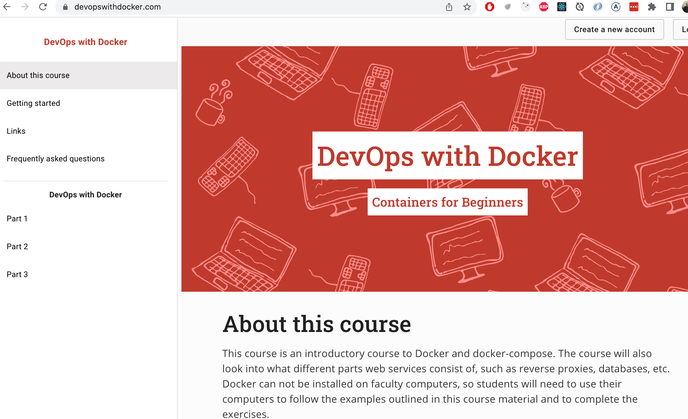
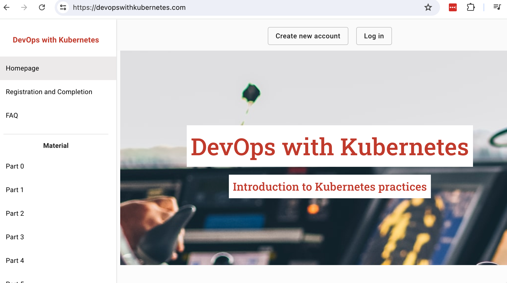

% Ohjelmistotuotanto
% Matti Luukkainen ja ohjaajat Antti, Pooki, Riku, Sini, Taneli
% syksy 2024

#

&nbsp;&nbsp;&nbsp;&nbsp;&nbsp;&nbsp;&nbsp;&nbsp;&nbsp;&nbsp;&nbsp;&nbsp;&nbsp;&nbsp;&nbsp;&nbsp;&nbsp;&nbsp;&nbsp;&nbsp;&nbsp;&nbsp;&nbsp;&nbsp;&nbsp;&nbsp;&nbsp;&nbsp;&nbsp;&nbsp;&nbsp;&nbsp;&nbsp;&nbsp;&nbsp;&nbsp;&nbsp;Luento 7

&nbsp;&nbsp;&nbsp;&nbsp;&nbsp;&nbsp;&nbsp;&nbsp;&nbsp;&nbsp;&nbsp;&nbsp;&nbsp;&nbsp;&nbsp;&nbsp;&nbsp;&nbsp;&nbsp;&nbsp;&nbsp;&nbsp;&nbsp;&nbsp;&nbsp;&nbsp;&nbsp;&nbsp;&nbsp;&nbsp;&nbsp;&nbsp;&nbsp;&nbsp;&nbsp;&nbsp;18.11.2024

# Kurssipalaute

- Kurssipalaute
  - Kurssilla lopussa kerättävän palautteen lisäksi ns. jatkuva palaute https://norppa.helsinki.fi

# 

- Luennot
  - ma ja ti 12-14
  - vierailuluentojen ajankohdassa pieni muutos...
    - ti 26.11 vierailijoita
    - ti 3.12 normaali luento

- Pajaa salissa BK107 
  - ma 14-16
  - to 13-15
  - pe 12-14


# Ketterien menetelmien testauskäytänteitä

. . .

- Sprintissä toteutettavat storyt integroidaan ja testataan sprintin aikana

. . .

- Automatisointi tärkeässä roolissa

. . .

- Ideaalitilanteessa testaajia sijoitettu kehittäjätiimiin, myös ohjelmoijat kirjoittavat testejä
  - tiimit _cross functional_ 

# Ketterien menetelmien testauskäytänteitä

. . .

- Test driven development (TDD)
  - Sivutuotteena paljon automaattisesti suoritettavia testejä

. . .

- User storyjen tasolla tapahtuva automatisoitu testaus
  - Robot

. . .

- Exploratory testing, suomeksi tutkiva testaus
  - Järjestelmätestauksen tekniikka, jossa testaaminen tapahtuu ilman formaalia testaussuunnitelmaa

. . .

- Jatkuva integraatio (CI) ja jatkuva toimittaminen (CD)
  - Ulottuu jopa sovelluksen tuotantoonviemiseen


# Tuotannossa tapahtuva testaaminen ja laadunhallinta

- Perinteisesti ajateltu: kaikki laadunhallintaan tehdään ennen kuin uudet toiminnallisuudet otetaan käyttöön 

{ width=400 }


- Viime aikainen trendi on tehdä osa laadunhallinnasta *monitoroimalla* tuotannossa olevaa ohjelmistoa

# Canary release

- Kaksi rinnakkaista tuotantoympäristöä, joista uudet ominaisuudet viedään toiseen


{ width=400 }

- Uuden ominaisuuden sisältävään ympäristöön ohjataan osa järjestelmän käyttäjistä

- Uuden ominaisuuden sisältämää versiota _monitoroidaan_ 
  - jos ei ongelmia  ohjataan kaikki liikenne uuteen versioon

# Feature toggle

- _Feature togglejen_ avulla voidaan canary releaset toteuttaa käyttämällä yhtä tuotantopalvelinta

. . .

- Koodiin _ehtolauseita_: osa liikenteestä ohjataan vanhan toteutuksen sijaan testauksen alla olevaan toteutukseen

- Esim. some-palvelussa feature toggle: _osalle käytetään näytetään uuden algoritmin perusteella generoitu lista uutisia_

```python
def recommended_news_generator(user): 
    if is_in_canary_release(user):
        return experimental_recommendation_algorithm(user)
    else:
        return recommendation_algoritm(user)
```

# Feature togglejen soveltaminen

- Aluksi piilotetaan uusi ominaisuus käyttäjiltä feature toggleilla
  - eli toggle palauttaa vanhan version normaaleille käyttäjille

. . .

- Kun valmiina laajempaan testiin, julkaistaan esim. 
    - ensin kehittäjäyrityksen omaan käyttöön 
    - sitten osalle käyttäjistä canary releasena

. . .

- Käytetään paljon A/B-testaamiseen

. . .

- Lopulta feature toggle ja vanha toteutus voidaan poistaa

# 

- Suuret internetpalvelut soveltavat laajalti canary releaseihin ja feature flageihin perustuvaa kehitysmallia
  - Facebook, Netflix, Google, Flickr, ...
  - Suomessa esim. Veikkaus

{ width=400 }


# Versionhallinnan käyttötavoista

# Feature branchit

. . .  

- Uusi ominaisuus, esim. user story toteutetaan ensin omaan versionhallinnan haaraansa

{ width=400 }

# Feature branchit

- Uusi ominaisuus, esim. user story toteutetaan ensin omaan versionhallinnan haaraansa

{ width=400 }

  - ja ominaisuuden valmistuttua haara mergetään pääkehityshaaraan

# Feature branchit ja merge hell

- Monet pitävät feature brancheja versionhallinnan _parhaana käytänteenä_

. . .  

- Feature branchit aiheuttavat helposti pahoja _merge-konflikteja_ sprintin lopussa

. . .  

- Seurauksena pienimuotoinen integraatiohelvetti: _merge hell_ 

. . .  

- Martin Fowler kuuluisassa artikkelissa Continuous integration: _Everyone Commits To the Mainline Every Day_

. . .

- Voidaanko edes puhua jatkuvasta integraatiosta jos feature branchit ovat käytössä?

# Branchayskäytänteet

- Toisin kuin aiemmissa versionhallintajärjestelmissä, Gitissä brancien teko on erittäin helppoa

. . .

- Tämä on johtanut monimutkaisiin branchayskäytänteisiin

{ width=400 }

. . .

- Tilanne on alkanut osin jo lähteä lapasesta

# Trunk based development

. . .

- Uusi trendi _trunk based development_: pitkäikäisiä feature brancheja ei käytetä ollenkaan
  - Kaikki koodi suoraan pääkehityshaaraan
  - ... josta käytetään nimitystä _trunk_

. . .

{ width=400 }

# Trunk based development

- Uusi trendi _trunk based development_: pitkäikäisiä feature brancheja ei käytetä ollenkaan
  - Kaikki koodi suoraan pääkehityshaaraan
  - ... josta käytetään nimitystä _trunk_

{ width=400 }

- Ohjelmiston kustakin julkaistusta versiosta saatetaan tehdä oma _release branch_

# Trunk based development
 
- Pakottaa sovelluskehittäjät tekemään pieniä, nopeasti päähaaraan mergettäviä muutoksia

. . .

- Käytetään feature toggleja
  - puolivalmiitakin ominaisuuksia voidaan helposti ohjelmoida päähaaraan ilman toiminnallisuuden rikkomista

. . .

- Edellyttää sovelluskehittäjiltä _todella hyvää_ kuria ja systemaattisuutta

. . .

- Kehitysmallia noudattavat esim. Google, Facebook, Netflix ja _GitHub_

# TAUKO 10 min

# Dev vs Ops

- Jatkuva toimittaminen ja toimitusvalmius (CD) sekä tuotannossa testaaminen on haastavaa

. . .

- Perinteisesti tarkka erottelu _sovelluskehittäjien_ (developers, dev) ja _ylläpitäjien_ (operations, ops) välillä
  - sovelluskehittäjät eivät pääse kirjautumaan tuotantopalvelimille 
  - tuotantoon vieminen ja tietokantaan skeeman päivitykset tapahtuvat ylläpitäjien toimesta

. . .

- Jos näin on, tuotantopalvelimelle pystytään viemään uusia versioita vain harvoin, esim 4 kertaa vuodessa

. . .

- Joustavammat toimintamallit vaativat kulttuurinmuutoksen

# DevOps

- _DevOps_: toimintamalli missä kehittäjät (dev) ja ylläpito (ops) työskentelevät tiiviisti yhdessä 
  - Sovelluskehittäjille pääsy tuotantopalvelimelle 
  - Scrum-tiimiin sijoitetaan ylläpitovastuilla olevia ihmisiä


. . .

- DevOps on hypetermi, jonka merkitys osin epäselvä
  - työpaikkailmoituksissa voidaan arvostaa DevOps-taitoja 
  - tai etsiä ihmistä DevOps-tiimiin
  - myynnissä mitä erilaisempia DevOps-työkaluja

. . .

- Järkevä määritelmä: DevOps _kehittäjien ja järjestelmäylläpidon yhteinen työnteon tapa_, DevOps-kulttuuri

. . .

- Työkaluja/asioita jotka liittyvät DevOpsiin:
  - automatisoitu testaus
  - jatkuva integraatio ja toimittaminen (CI/CD)
  - virtualisointi ja kontainerisointi (Docker)
  - infrastructure as code
  - pilvipalveluna toimivat palvelimet ja sovellusympäristöt (PaaS, IaaS, SaaS)

#

- Monet listatuista kehittyneet viimeisen 5-10 vuoden aikana ja mahdollistaneet DevOpsin helpomman soveltamisen

. . .

- Eräs tärkeimmistä DevOpsia mahdollistavista asioista _infrastructure as code_
  - fyysisten palvelinten sijaan virtuaalisia ja pilvessä toimivia palvelimia, joita voi konfiguroida "ohjelmoimalla"

. . .

- Raudastakin on tullut "koodia"
  - palvelinten konfiguraatioita voidaan tallettaa versionhallintaan ja jopa testata
  - sovelluskehitys ja ylläpito ovat alkaneet muistuttaa toisiaan 

. . .

- Työkalujen käyttöönotto ei riitä, DevOpsin "tekeminen" lähtee kulttuurisista tekijöistä, tiimirakenteista, sekä asioiden sallimisesta

# The Big DevOps Misunderstanding (Oliver Wolf)

. . .

- When the term DevOps came up, it was a very simple idea:
  - You build it, you run it — Werner Vogels

. . .

- Somewhere along the way, the idea was misunderstood and the wrong definition of DevOps became the right one
  - We now have specific roles or departments that write "infrastructure as code"

. . .

- This is not DevOps, but an evolution of Systems Operations (SysOps)

#

{ width=400 }

#

{ width=400 }

#

{ width=400 }

# DevOps: ketteryys laajennettuna

. . .

- Scrumin ja ketterän eräs tärkeimmistä periaatteista on tehdä kehitystiimeistä itseorganisoituvia ja "cross functional" 
  
. . .

- DevOps on keino viedä ketteryyttä askeleen pitemmälle
  - kehitystiimi pystyy viemään uudet toiminnallisuudet tuotantoympäristöön 
  - ja jopa testaamaan sekä operoimaan niitä tuotannossa

. . .

- DevOps siis laajentaa ketteryyden koskemaan myös järjestelmäylläpitoa

. . .

- Asettaa sovelluskehittäjille lisää osaamisvaatimuksia

  - kehittäjien pitää hallita enenevissä määrin ylläpitoasioita

# 13.3.2025-

{ width=400 }

- https://devopswithdocker.com/ by Jami Kousa

# 1.6.2025-

{ width=400 }

- https://devopswithkubernetes.com/ by Jami Kousa

# Ohjelmiston elinkaaren vaiheet

- Riippumatta tyylistä ja tavasta jolla ohjelmisto tehdään, ohjelmistojen tekemiseen kuuluu
  - vaatimusten analysointi ja määrittely 
  - **suunnittelu**
  - toteutus
  - testaus/laadunhallinta
  - ohjelmiston ylläpito

. . . 

- Suunnittelun tavoite _miten saadaan toteutettua vaatimusmäärittelyn mukaisella tavalla toimiva ohjelma_

# Ohjelmiston elinkaaren vaiheet

- Riippumatta tyylistä ja tavasta jolla ohjelmisto tehdään, ohjelmistojen tekemiseen kuuluu
  - vaatimusten analysointi ja määrittely 
  - **suunnittelu**
  - **toteutus**
  - testaus/laadunhallinta
  - ohjelmiston ylläpito


- Suunnittelun tavoite _miten saadaan toteutettua vaatimusmäärittelyn mukaisella tavalla toimiva ohjelma_


- Osa suunnittelusta tapahtuu vasta toteutusvaiheessa, joten suunnittelun ja toteuttamisen käsittelyä ei voi eriyttää


# Ohjelmiston suunnittelu

- Jakautuu kahteen vaiheeseen:
  - arkkitehtuurisuunnittelu
  - olio/komponenttisuunnittelu

. . .

- Ajoittuminen riippuu käytettävästä tuotantoprosessista:

. . .

- Vesiputousmallissa vaatimusmäärittelyn jälkeen, ennen toteutuksen aloittamista
  - tarkasti dokumentoitu

. . .

- Ketterissä menetelmissä suunnittelua tehdään tarvittava määrä jokaisessa iteraatiossa
  - ei yleensä tarkkaa suunnitteludokumenttia

. . .

- Vesiputousmallin suunnitteluprosessi tuskin on enää käytössä
  - "jäykimmissäkin" prosesseissa ainakin vaatimusmäärittely ja arkkitehtuurisuunnittelu limittyvät

. . .

- Näiden lisäksi UI/UX-suunnittelu

# Ohjelmiston arkkitehtuuri

. . .

- Abstraktimpi kuvaus joka määrittelee ohjelmiston suuret linjat

. . .

- IEEE: Ohjelmiston arkkitehtuuri on järjestelmän perusorganisaatio, joka sisältää 
  - järjestelmän osat, 
  - osien keskinäiset suhteet, 
  - osien suhteet ympäristöön 
  - sekä periaatteet, jotka ohjaavat järjestelmän suunnittelua ja evoluutiota

# Ohjelmiston arkkitehtuuri

- **Ei-toiminnallisilla vaatimuksilla** suuri vaikutus arkkitehtuuriin
  - käytettävyys, saavutettavuus
  - suorituskyky, skaalautuvuus
  - vikasietoisuus, tiedon ajantasaisuus
  - tietoturva
  - ylläpidettävyys, laajennettavuus
  - hinta, time-to-market, ...

. . . 

- Myös **toimintaympäristö** vaikuttavaa arkkitehtuuriin
  - integraatiot muihin järjestelmiin
  - käytettävät sovelluskehykset ja tietokannat
  - lainsäädäntö 

. . .

- Arkkitehtuuri syntyy joukosta _arkkitehtuurisia valintoja_ 
  - tradeoff 

# Arkkitehtuurityyli

- Ohjelmiston arkkitehtuuri perustuu yleensä yhteen tai useampaan **arkkitehtuurityyliin**
  - hyväksi havaittua tapaa strukturoida tietyntyyppisiä sovelluksia

. . .

- Tyylejä suuri määrä
  - Kerrosarkkitehtuuri
  - Mikropalveluarkkitehtuuri
  - MVC
  - Pipes-and-filters
  - Repository
  - Client-server
  - Publish-subscribe
  - Event driven
  - REST
  - ...

# Kerrosarkkitehtuuri 

- _Kerros_ on kokoelma toisiinsa liittyviä olioita, jotka muodostavat toiminnallisuuden suhteen loogisen kokonaisuuden

{ width=200 }

. . . 

- Kerros käyttää ainoastaan alempana olevan kerroksen palveluita

#

- Kerrokset omalla abstraktiotasollaan
  - Ylimmät kerrokset ovat lähellä käyttäjää: UI ja sovelluslogiikka
  - Alimmat kerrokset taas keskittyvät koneläheisiin asioihin: esim. tiedon tallennus

. . .

- Kerroksittaisuus helpottaa ylläpitoa
  - yhden kerroksen muutokset vaikuttavat korkeintaan yläpuolella olevaan kerrokseen

. . .

- Sovelluslogiikan riippumattomuus käyttöliittymästä helpottaa ohjelman siirtämistä uusille alustoille
  - esim. web-sovelluksesta voidaan tehdä mobiiliversio

. . .

- Alimpien kerroksien palveluja, voidaan osin uusiokäyttää myös muissa sovelluksissa

. . .

- Saattaa johtaa massiivisiin monoliittisiin sovelluksiin
  - vaikea laajentaa ja skaalaata suurille käyttäjämäärille
  - haastavaa kehittää jos sovelluskehittäjiä suuri määrä


# Mikropalveluarkkitehtuuri

- Mikropalveluarkkitehtuuri (microservice) pyrkii vastaamaan näihin haasteisiin  

. . .

{ width=250 }

- sovellus koostataan useista (jopa sadoista) pienistä verkossa toimivista autonomisista palveluista 

. . .

- jotka keskenään verkon yli kommunikoiden toteuttavat järjestelmän toiminnallisuuden

# Mikropalveluarkkitehtuuri

- Yksittäisistä palveluista pyritään tekemään mahdollisimman riippumattomia
  - palvelut eivät kutsu toistensa metodeja, kommunikointi aina verkon välityksellä
  - eivät käytä yhteistä tietokantaa
  - eivät jaa koodia

. . . 

- Mikropalvelut ovat pieniä ja huolehtivat vain "yhdestä asiasta"

. . . 

- Verkkokaupan mikropalveluita voisivat olla
  - käyttäjien hallinta
  - tuotteiden hakutoiminnot
  - tuotteiden suosittelu
  - ostoskorin toiminnallisuus
  - ostosten maksusta huolehtiva toiminnallisuus

# Mikropalveluiden etuja

- Kun lisätään toiminnallisuutta: toteutetaan uusi palvelu tai laajennetaan ainoastaan _jotain_ palvelua
  - Sovelluksen laajentaminen voi olla helpompaa kuin kerrosarkkitehtuurissa

. . . 

- Skaalaaminen helpompaa kuin monoliittisten sovellusten 
  - suorituskyvyn pullonkaulan aiheuttavia mikropalveluja voidaan suorittaa useita rinnakkain

. . . 

- Sovellus voidaan helposti koodata monella ohjelmointikielellä ja sovelluskehyksillä, toisin kuin monoliittisissa projekteissa

. . . 

- Työn jakaminen isolle kehittäjämäärälle helpompaa

# Mikropalveluiden haasteita

- Sovelluksen jakaminen järkeviin mikropalveluihin on vaikeaa

. . .

- Testaaminen ja debuggaus voi olla vaikeaa koska asioita tapahtuu niin monessa paikassa

. . .

- Kymmenistä tai jopa sadoista mikropalveluista koostuvan ohjelmiston operoiminen on haastavaa
  - vaatii pitkälle menevää automatisointia

. . .

- Mikropalveluiden menestyksekäs soveltaminen edellyttää vahvaa DevOps-kulttuuria

. . .

- Kehitetty massiivisiin järjestelmiin (mm Amazon, Netflix)
  - onko järkevä kaikkialla?
