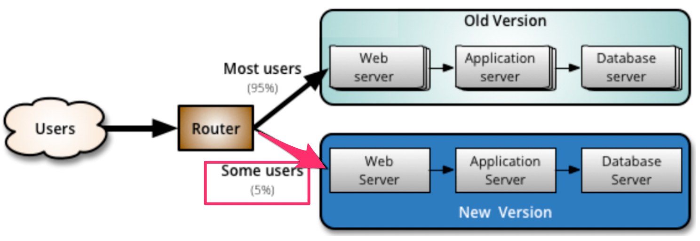
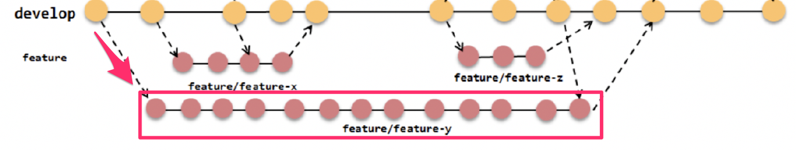
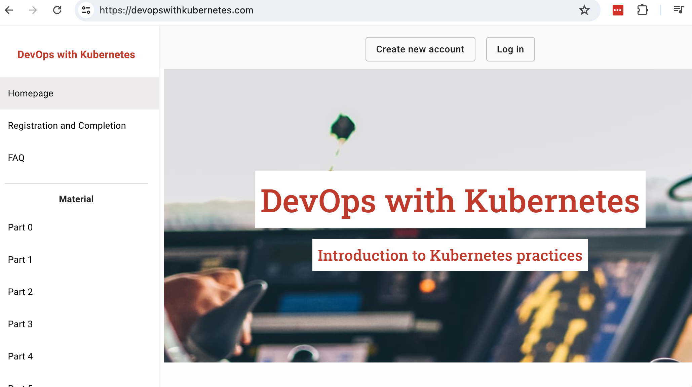

% Ohjelmistotuotanto

% Software production

Translations of % Ohjelmistotuotanto
[ Suomi -> English ]

% Ohjelmistotuotanto
    % Software production, % Software manufacturing

% Matti Luukkainen ja ohjaajat Antti, Pooki, Riku, Sini, Taneli

% Matti Luukkainen and directors Antti, Pooki, Riku, Sini, Taneli

Translations of % Matti Luukkainen ja ohjaajat Antti, Pooki, Riku, Sini, Taneli
[ Suomi -> English ]

% Matti Luukkainen ja ohjaajat Antti, Pooki, Riku, Sini, Taneli
    % Matti Luukkainen and directors Antti, Pooki, Riku, Sini, Taneli, % Matti Luukkainen and the instructors Antti, Pooki, Riku, Sini, Taneli

% syksy 2024

% autumn 2024

Translations of % syksy 2024
[ Suomi -> English ]

% syksy 2024
    % autumn 2024, % fall 2024

#

#

                                      Luento 7

                                     Lecture 7

                                    18.11.2024

                                    18.11.2024

# Kurssipalaute

# Course feedback

Translations of # Kurssipalaute
[ Suomi -> English ]

# Kurssipalaute
    # Course feedback, # Lesson feedback

- Kurssipalaute

- Course feedback

Translations of - Kurssipalaute
[ Suomi -> English ]

- Kurssipalaute
    - Course feedback, - Lesson feedback

- Kurssilla lopussa kerättävän palautteen lisäksi ns.  jatkuva palaute https://norppa.helsinki.fi

- In addition to the feedback collected at the end of the course, the so-called continuous feedback https://norppa.helsinki.fi

Translations of - Kurssilla lopussa kerättävän palautteen lisäksi ns.  jatkuva palaute https://norppa.helsinki.fi
[ Suomi -> English ]

- Kurssilla lopussa kerättävän palautteen lisäksi ns.
    - In addition to the feedback collected at the end of the course, the so-called, - In addition to the feedback gathered at the end of the course, so-called
jatkuva palaute https://norppa.helsinki.fi
    continuous feedback https://norppa.helsinki.fi, ongoing feedback https://norppa.helsinki.fi

#

#

- Luennot

- Lectures

Definitions of - Luennot
[ Suomi -> English ]

noun
    lecture
        luento, esitelmä, saarna, nuhdesaarna, läksytys

- Luennot
    - Lectures, - The lectures

- ma ja ti 12-14

- I'm 12-14

Translations of - ma ja ti 12-14
[ Hrvatski -> English ]

- ma ja ti 12-14
    - I'm 12-14, - but I'm 12-14

- vierailuluentojen ajankohdassa pieni muutos...

- a slight change in the timing of visiting lectures...

Translations of - vierailuluentojen ajankohdassa pieni muutos...
[ Suomi -> English ]

- vierailuluentojen ajankohdassa pieni muutos...
    - a slight change in the timing of visiting lectures..., - a slight change in the time of the visiting lectures...

- ti 26.11 vierailijoita

- Tue 26.11 visitors

Translations of - ti 26.11 vierailijoita
[ Suomi -> English ]

- ti 26.11 vierailijoita
    - Tue 26.11 visitors, - Tue 26 November visitors

- ti 3.12 normaali luento

- Tue 3.12 normal lecture

Translations of - ti 3.12 normaali luento
[ Suomi -> English ]

- ti 3.12 normaali luento
    - Tue 3.12 normal lecture, - Tuesday 3 December normal lecture

- Pajaa salissa BK107

- Workshop in hall BK107

Translations of - Pajaa salissa BK107
[ Suomi -> English ]

- Pajaa salissa BK107
    - Workshop in hall BK107, - The workshop in hall BK107

- ma 14-16

- ma 14-16

- to 13-15

- to 13-15

- pe 12-14

- pe 12-14

# Ketterien menetelmien testauskäytänteitä

# Testing practices for agile methods

Translations of # Ketterien menetelmien testauskäytänteitä
[ Suomi -> English ]

# Ketterien menetelmien testauskäytänteitä
    # Testing practices for agile methods, # Agile methodology testing practices

. . .

. . .

- Sprintissä toteutettavat storyt integroidaan ja testataan sprintin aikana

- The stories implemented in the sprint are integrated and tested during the sprint

Translations of - Sprintissä toteutettavat storyt integroidaan ja testataan sprintin aikana
[ Suomi -> English ]

- Sprintissä toteutettavat storyt integroidaan ja testataan sprintin aikana
    - The stories implemented in the sprint are integrated and tested during the sprint, - Stories implemented in a sprint are integrated and tested during the sprint

. . .

. . .

- Automatisointi tärkeässä roolissa

- Automation plays an important role

Translations of - Automatisointi tärkeässä roolissa
[ Suomi -> English ]

- Automatisointi tärkeässä roolissa
    - Automation plays an important role, - Automation plays a major role

. . .

. . .

- Ideaalitilanteessa testaajia sijoitettu kehittäjätiimiin, myös ohjelmoijat kirjoittavat testejä

- In an ideal situation, testers are placed in the development team, programmers also write tests

Translations of - Ideaalitilanteessa testaajia sijoitettu kehittäjätiimiin, myös ohjelmoijat kirjoittavat testejä
[ Suomi -> English ]

- Ideaalitilanteessa testaajia sijoitettu kehittäjätiimiin, myös ohjelmoijat kirjoittavat testejä
    - In an ideal situation, testers are placed in the development team, programmers also write tests, - In an ideal situation, testers are placed in the development team, also programmers write tests

- tiimit _cross functional_

- tiimit _cross functional_

# Ketterien menetelmien testauskäytänteitä

# Testing practices for agile methods

Translations of # Ketterien menetelmien testauskäytänteitä
[ Suomi -> English ]

# Ketterien menetelmien testauskäytänteitä
    # Testing practices for agile methods, # Agile methodology testing practices

. . .

. . .

- Test driven development (TDD)

- Test driven development (TDD)

- Sivutuotteena paljon automaattisesti suoritettavia testejä

- A lot of automatically performed tests as a byproduct

Translations of - Sivutuotteena paljon automaattisesti suoritettavia testejä
[ Suomi -> English ]

- Sivutuotteena paljon automaattisesti suoritettavia testejä
    - A lot of automatically performed tests as a byproduct, - As a side product, many automatically performed tests

. . .

. . .

- User storyjen tasolla tapahtuva automatisoitu testaus

- Automated testing at the level of user stories

Translations of - User storyjen tasolla tapahtuva automatisoitu testaus
[ Suomi -> English ]

- User storyjen tasolla tapahtuva automatisoitu testaus
    - Automated testing at the level of user stories, - Automated testing at user story level

- Robot

noun
    (especially in science fiction) a machine resembling a human being and able to replicate certain human movements and functions automatically.
        - "the robot closed the door behind us"
    Synonyms: automaton, android, mechanoid, machine, golem

    another term for crawler.

Synonyms
    noun
        - bot, droid
        - automaton, android, mechanoid, machine, golem

. . .

. . .

- Exploratory testing, suomeksi tutkiva testaus

- Exploratory testing, in Finnish

Translations of - Exploratory testing, suomeksi tutkiva testaus
[ Suomi -> English ]

- Exploratory testing, suomeksi tutkiva testaus
    - Exploratory testing, in Finnish, - Exploratory testing, in Finnish, exploratory testing

- Järjestelmätestauksen tekniikka, jossa testaaminen tapahtuu ilman formaalia testaussuunnitelmaa

- A system testing technique where testing takes place without a formal test plan

Translations of - Järjestelmätestauksen tekniikka, jossa testaaminen tapahtuu ilman formaalia testaussuunnitelmaa
[ Suomi -> English ]

- Järjestelmätestauksen tekniikka, jossa testaaminen tapahtuu ilman formaalia testaussuunnitelmaa
    - A system testing technique where testing takes place without a formal test plan, - The technique of system testing, where testing takes place without a formal test plan

. . .

. . .

- Jatkuva integraatio (CI) ja jatkuva toimittaminen (CD)

- Continuous Integration (CI) and Continuous Delivery (CD)

Translations of - Jatkuva integraatio (CI) ja jatkuva toimittaminen (CD)
[ Suomi -> English ]

- Jatkuva integraatio (CI) ja jatkuva toimittaminen (CD)
    - Continuous Integration (CI) and Continuous Delivery (CD), - Continuous integration (CI) and continuous delivery (CD)

- Ulottuu jopa sovelluksen tuotantoonviemiseen

- It even extends to taking the application into production

Translations of - Ulottuu jopa sovelluksen tuotantoonviemiseen
[ Suomi -> English ]

- Ulottuu jopa sovelluksen tuotantoonviemiseen
    - It even extends to taking the application into production, - It even extends to bringing the application to production

# Tuotannossa tapahtuva testaaminen ja laadunhallinta

# Testing and quality control in production

Translations of # Tuotannossa tapahtuva testaaminen ja laadunhallinta
[ Suomi -> English ]

# Tuotannossa tapahtuva testaaminen ja laadunhallinta
    # Testing and quality control in production, # Production testing and quality control

- Perinteisesti ajateltu: kaikki laadunhallintaan tehdään ennen kuin uudet toiminnallisuudet otetaan käyttöön

- Traditionally thought: everything for quality management is done before the new functionalities are implemented

Translations of - Perinteisesti ajateltu: kaikki laadunhallintaan tehdään ennen kuin uudet toiminnallisuudet otetaan käyttöön
[ Suomi -> English ]

- Perinteisesti ajateltu: kaikki laadunhallintaan tehdään ennen kuin uudet toiminnallisuudet otetaan käyttöön
    - Traditionally thought: everything for quality management is done before the new functionalities are implemented, - Traditionally thought of: everything for quality management is done before the new functionalities are put into use

{ width=400 }

{ width=400 }

- Viime aikainen trendi on tehdä osa laadunhallinnasta *monitoroimalla* tuotannossa olevaa ohjelmistoa

- The recent trend is to make part of quality management by *monitoring* the software in production

Translations of - Viime aikainen trendi on tehdä osa laadunhallinnasta *monitoroimalla* tuotannossa olevaa ohjelmistoa
[ Suomi -> English ]

- Viime aikainen trendi on tehdä osa laadunhallinnasta *monitoroimalla* tuotannossa olevaa ohjelmistoa
    - The recent trend is to make part of quality management by *monitoring* the software in production, - A recent trend is to make part of quality management *monitoring* the software in production

# Canary release

# Canary release

- Kaksi rinnakkaista tuotantoympäristöä, joista uudet ominaisuudet viedään toiseen

- Two parallel production environments, from which new features are exported to the other

Translations of - Kaksi rinnakkaista tuotantoympäristöä, joista uudet ominaisuudet viedään toiseen
[ Suomi -> English ]

- Kaksi rinnakkaista tuotantoympäristöä, joista uudet ominaisuudet viedään toiseen
    - Two parallel production environments, from which new features are exported to the other, - Two parallel production environments, from which the new features are exported to the other

{ width=400 }

{ width=400 }

- Uuden ominaisuuden sisältävään ympäristöön ohjataan osa järjestelmän käyttäjistä

- Some of the system users will be redirected to the environment containing the new feature

Translations of - Uuden ominaisuuden sisältävään ympäristöön ohjataan osa järjestelmän käyttäjistä
[ Suomi -> English ]

- Uuden ominaisuuden sisältävään ympäristöön ohjataan osa järjestelmän käyttäjistä
    - Some of the system users will be redirected to the environment containing the new feature, - Some of the system's users will be directed to the environment containing the new feature

- Uuden ominaisuuden sisältämää versiota _monitoroidaan_

- The version containing the new feature is _monitored_

Translations of - Uuden ominaisuuden sisältämää versiota _monitoroidaan_
[ Suomi -> English ]

- Uuden ominaisuuden sisältämää versiota _monitoroidaan_
    - The version containing the new feature is _monitored_, - The version with the new feature is _monitored_

- jos ei ongelmia  ohjataan kaikki liikenne uuteen versioon

- if there are no problems, all traffic is redirected to the new version

Translations of - jos ei ongelmia  ohjataan kaikki liikenne uuteen versioon
[ Suomi -> English ]

- jos ei ongelmia  ohjataan kaikki liikenne uuteen versioon
    - if there are no problems, all traffic is redirected to the new version, - if there are no problems, all traffic will be redirected to the new version

# Feature toggle

# Feature toggle

- _Feature togglejen_ avulla voidaan canary releaset toteuttaa käyttämällä yhtä tuotantopalvelinta

- _Feature toggles_ can be used to implement Canary releases using one production server

Translations of - _Feature togglejen_ avulla voidaan canary releaset toteuttaa käyttämällä yhtä tuotantopalvelinta
[ Suomi -> English ]

- _Feature togglejen_ avulla voidaan canary releaset toteuttaa käyttämällä yhtä tuotantopalvelinta
    - _Feature toggles_ can be used to implement Canary releases using one production server, - With the help of _Feature toggles_, Canary releases can be implemented using one production server

. . .

. . .

- Koodiin _ehtolauseita_: osa liikenteestä ohjataan vanhan toteutuksen sijaan testauksen alla olevaan toteutukseen

- _conditions_ to the code: part of the traffic is redirected to the implementation under testing instead of the old implementation

Translations of - Koodiin _ehtolauseita_: osa liikenteestä ohjataan vanhan toteutuksen sijaan testauksen alla olevaan toteutukseen
[ Suomi -> English ]

- Koodiin _ehtolauseita_: osa liikenteestä ohjataan vanhan toteutuksen sijaan testauksen alla olevaan toteutukseen
    - _conditions_ to the code: part of the traffic is redirected to the implementation under testing instead of the old implementation, - _conditional statements_ to the code: part of the traffic is directed to the implementation under testing instead of the old implementation

- Esim.  some-palvelussa feature toggle: _osalle käytetään näytetään uuden algoritmin perusteella generoitu lista uutisia_

- E.g. in the social service feature toggle: _a list of news generated based on the new algorithm is displayed for some_

Translations of - Esim.  some-palvelussa feature toggle: _osalle käytetään näytetään uuden algoritmin perusteella generoitu lista uutisia_
[ Suomi -> English ]

- Esim.
    - E.g., - For example
some-palvelussa feature toggle: _osalle käytetään näytetään uuden algoritmin perusteella generoitu lista uutisia_
    in the social service feature toggle: _a list of news generated based on the new algorithm is displayed for some_, in the social service feature toggle: _a list of news generated on the basis of the new algorithm is displayed for some_

```python

```python

Translations of ```python
[ Svenska -> English ]

```python
    ```python, Python

def recommended_news_generator(user):

def recommended_news_generator(user):

if is_in_canary_release(user):

if is_in_canary_release(user):

return experimental_recommendation_algorithm(user)

return experimental_recommendation_algorithm(user)

else:
/els/

adverb
    in addition; besides.
        - "anything else you need to know?"

    different; instead.
        - "isn't there anyone else you could ask?"

    short for or else.
        - "keep your mouth shut, else you might contradict my story"

Examples
    - they moved on to somewhere else

    - they will offer low prices but little else

    - keep your mouth shut, else you might contradict my story

    - I just brought basics—I wasn't sure what else you'd want

    - it's fate, destiny, or whatever else you like to call it

    - isn't there anyone else you could ask?

    - they took songs owned by someone else and used them without permission

    - anything else you need to know?

return recommendation_algoritm(user)

return recommendation_algoritm(user)

```

```

# Feature togglejen soveltaminen

# Applying feature toggles

Translations of # Feature togglejen soveltaminen
[ Suomi -> English ]

# Feature togglejen soveltaminen
    # Applying feature toggles, # Application of Feature toggles

- Aluksi piilotetaan uusi ominaisuus käyttäjiltä feature toggleilla

- At first, the new feature is hidden from users with feature toggles

Translations of - Aluksi piilotetaan uusi ominaisuus käyttäjiltä feature toggleilla
[ Suomi -> English ]

- Aluksi piilotetaan uusi ominaisuus käyttäjiltä feature toggleilla
    - At first, the new feature is hidden from users with feature toggles, - Initially, the new feature is hidden from the users with feature toggles

- eli toggle palauttaa vanhan version normaaleille käyttäjille

- i.e. toggle returns the old version to normal users

Translations of - eli toggle palauttaa vanhan version normaaleille käyttäjille
[ Suomi -> English ]

- eli toggle palauttaa vanhan version normaaleille käyttäjille
    - i.e. toggle returns the old version to normal users, - that is, the toggle returns the old version to normal users

. . .

. . .

- Kun valmiina laajempaan testiin, julkaistaan esim.

- When ready for a wider test, we publish e.g.

Translations of - Kun valmiina laajempaan testiin, julkaistaan esim.
[ Suomi -> English ]

- Kun valmiina laajempaan testiin, julkaistaan esim.
    - When ready for a wider test, we publish e.g., - When ready for a wider test, e.g. will be published

- ensin kehittäjäyrityksen omaan käyttöön

- first for the developer company's own use

Translations of - ensin kehittäjäyrityksen omaan käyttöön
[ Suomi -> English ]

- ensin kehittäjäyrityksen omaan käyttöön
    - first for the developer company's own use, - first for the developer's own use

- sitten osalle käyttäjistä canary releasena

- then for some users as a Canary release

Translations of - sitten osalle käyttäjistä canary releasena
[ Suomi -> English ]

- sitten osalle käyttäjistä canary releasena
    - then for some users as a Canary release, - then for part of the users as a Canary release

. . .

. . .

- Käytetään paljon A/B-testaamiseen

- Used a lot for A/B testing

Translations of - Käytetään paljon A/B-testaamiseen
[ Suomi -> English ]

- Käytetään paljon A/B-testaamiseen
    - Used a lot for A/B testing, - Used extensively for A/B testing

. . .

. . .

- Lopulta feature toggle ja vanha toteutus voidaan poistaa

- Finally, the feature toggle and the old implementation can be removed

Translations of - Lopulta feature toggle ja vanha toteutus voidaan poistaa
[ Suomi -> English ]

- Lopulta feature toggle ja vanha toteutus voidaan poistaa
    - Finally, the feature toggle and the old implementation can be removed, - Finally, feature toggle and old implementation can be removed

#

#

- Suuret internetpalvelut soveltavat laajalti canary releaseihin ja feature flageihin perustuvaa kehitysmallia

- Large internet services widely apply a development model based on Canary releases and feature flags

Translations of - Suuret internetpalvelut soveltavat laajalti canary releaseihin ja feature flageihin perustuvaa kehitysmallia
[ Suomi -> English ]

- Suuret internetpalvelut soveltavat laajalti canary releaseihin ja feature flageihin perustuvaa kehitysmallia
    - Large internet services widely apply a development model based on Canary releases and feature flags, - Major internet services widely apply the development model based on Canary releases and feature flags

- Facebook, Netflix, Google, Flickr, ...

- Facebook, Netflix, Google, Flickr, ...

- Suomessa esim.  Veikkaus

- In Finland, e.g. Pools

Translations of - Suomessa esim.  Veikkaus
[ Suomi -> English ]

- Suomessa esim.
    - In Finland, e.g., - in Finland, for example
Veikkaus
    Pools, Football pools, Bet, A guess, Guessing

{ width=400 }

{ width=400 }

# Versionhallinnan käyttötavoista

# About using version control

Translations of # Versionhallinnan käyttötavoista
[ Suomi -> English ]

# Versionhallinnan käyttötavoista
    # About using version control, # About the ways to use version control

# Feature branchit

# Feature branchit

. . .

. . .

- Uusi ominaisuus, esim.  user story toteutetaan ensin omaan versionhallinnan haaraansa

- New feature, e.g. the user story is first implemented in its own version control branch

Translations of - Uusi ominaisuus, esim.  user story toteutetaan ensin omaan versionhallinnan haaraansa
[ Suomi -> English ]

- Uusi ominaisuus, esim.
    - New feature, e.g., - A new feature, eg.
user story toteutetaan ensin omaan versionhallinnan haaraansa
    the user story is first implemented in its own version control branch, the user story is first implemented in its own branch of version control

{ width=400 }

{ width=400 }

# Feature branchit

# Feature branchit

- Uusi ominaisuus, esim.  user story toteutetaan ensin omaan versionhallinnan haaraansa

- New feature, e.g. the user story is first implemented in its own version control branch

Translations of - Uusi ominaisuus, esim.  user story toteutetaan ensin omaan versionhallinnan haaraansa
[ Suomi -> English ]

- Uusi ominaisuus, esim.
    - New feature, e.g., - A new feature, eg.
user story toteutetaan ensin omaan versionhallinnan haaraansa
    the user story is first implemented in its own version control branch, the user story is first implemented in its own branch of version control

{ width=400 }

{ width=400 }

- ja ominaisuuden valmistuttua haara mergetään pääkehityshaaraan

- and after the feature is completed, the branch is merged into the main development branch

Translations of - ja ominaisuuden valmistuttua haara mergetään pääkehityshaaraan
[ Suomi -> English ]

- ja ominaisuuden valmistuttua haara mergetään pääkehityshaaraan
    - and after the feature is completed, the branch is merged into the main development branch, - and after the feature is finished, the branch is merged into the main development branch

# Feature branchit ja merge hell

# Feature branchit ja merge hell

- Monet pitävät feature branches versionhallinnan parhaana käytäntönä

- Many consider feature branches to be the best practice for version control

Translations of - Monet pitävät feature branches versionhallinnan parhaana käytäntönä
[ Suomi -> English ]

- Monet pitävät feature branches versionhallinnan parhaana käytäntönä
    - Many consider feature branches to be the best practice for version control, - Many people consider feature branches to be the best practice for version control

. . .

. . .

- Feature branch aiheuttavat helposti pahoja _merge-konflikteja sprintin lopussa

- Feature branches easily cause bad _merge conflicts at the end of the sprint

Translations of - Feature branch aiheuttavat helposti pahoja _merge-konflikteja sprintin lopussa
[ Suomi -> English ]

- Feature branch aiheuttavat helposti pahoja _merge-konflikteja sprintin lopussa
    - Feature branches easily cause bad _merge conflicts at the end of the sprint, - Feature branches easily cause bad _merge conflicts at the end of sprint

. . .

. . .

- Seurauksena pienimuotoinen integraatiohelvetti: _merge hell_

- As a result, a small-scale integration hell: _merge hell_

Translations of - Seurauksena pienimuotoinen integraatiohelvetti: _merge hell_
[ Suomi -> English ]

- Seurauksena pienimuotoinen integraatiohelvetti: _merge hell_
    - As a result, a small-scale integration hell: _merge hell_, - As a result, small integration hell: _merge hell_

. . .

. . .

- Martin Fowler kuuluisassa artikkelissa Continuous integration: _Everyone Commits To the Mainline Every Day_

- Martin Fowler in the famous article Continuous integration: _Everyone Commits To the Mainline Every Day_

Translations of - Martin Fowler kuuluisassa artikkelissa Continuous integration: _Everyone Commits To the Mainline Every Day_
[ Suomi -> English ]

- Martin Fowler kuuluisassa artikkelissa Continuous integration: _Everyone Commits To the Mainline Every Day_
    - Martin Fowler in the famous article Continuous integration: _Everyone Commits To the Mainline Every Day_, - Martin Fowler in his famous article Continuous integration: _Everyone Commits To the Mainline Every Day_

. . .

. . .

- Voidaanko edes puhua jatkuvasta integraatiosta jos feature branchit ovat käytössä?

- Can we even talk about continuous integration if feature branches are in use?

Translations of - Voidaanko edes puhua jatkuvasta integraatiosta jos feature branchit ovat käytössä?
[ Suomi -> English ]

- Voidaanko edes puhua jatkuvasta integraatiosta jos feature branchit ovat käytössä?
    - Can we even talk about continuous integration if feature branches are in use?, - Is it even possible to talk about continuous integration if feature branches are in use?

# Branchayskäytänteet

# Branchay practices

Translations of # Branchayskäytänteet
[ Suomi -> English ]

# Branchayskäytänteet
    # Branchay practices, # Branchay policies

- Toisin kuin aiemmissa versionhallintajärjestelmissä, Gitissä brancien teko on erittäin helppoa

- Unlike previous version control systems, making branches in Git is very easy

Translations of - Toisin kuin aiemmissa versionhallintajärjestelmissä, Gitissä brancien teko on erittäin helppoa
[ Suomi -> English ]

- Toisin kuin aiemmissa versionhallintajärjestelmissä, Gitissä brancien teko on erittäin helppoa
    - Unlike previous version control systems, making branches in Git is very easy, - Unlike previous version control systems, branching is very easy in Git

. . .

. . .

- Tämä on johtanut monimutkaisiin branchayskäytänteisiin

- This has led to complex branch practices

Translations of - Tämä on johtanut monimutkaisiin branchayskäytänteisiin
[ Suomi -> English ]

- Tämä on johtanut monimutkaisiin branchayskäytänteisiin
    - This has led to complex branch practices, - This has led to complicated branching practices

{ width=400 }

{ width=400 }

. . .

. . .

- Tilanne on alkanut osin jo lähteä lapasesta

- The situation has already started to get out of control

Translations of - Tilanne on alkanut osin jo lähteä lapasesta
[ Suomi -> English ]

- Tilanne on alkanut osin jo lähteä lapasesta
    - The situation has already started to get out of control, - The situation has already begun to get out of hand

# Trunk based development

# Trunk based development

. . .

. . .

- Uusi trendi trunk based development: pitkäikäisiä feature branches ei käytetä ollenkaan

- New trend trunk based development: long-lived feature branches are not used at all

Translations of - Uusi trendi trunk based development: pitkäikäisiä feature branches ei käytetä ollenkaan
[ Suomi -> English ]

- Uusi trendi trunk based development: pitkäikäisiä feature branches ei käytetä ollenkaan
    - New trend trunk based development: long-lived feature branches are not used at all, - A new trend in trunk based development: long-lived feature branches are not used at all

- Kaikki koodi suoraan pääkehityshaaraan

- All code directly to the main development branch

Translations of - Kaikki koodi suoraan pääkehityshaaraan
[ Suomi -> English ]

- Kaikki koodi suoraan pääkehityshaaraan
    - All code directly to the main development branch, - All code directly into main development branch

- ... josta käytetään nimitystä _trunk_

- ... which is called _trunk_

Translations of - ... josta käytetään nimitystä _trunk_
[ Suomi -> English ]

- ... josta käytetään nimitystä _trunk_
    - ... which is called _trunk_, - ... from which the designation _trunk_ is used

. . .

. . .

{ width=400 }

{ width=400 }

# Trunk based development

# Trunk based development

- Uusi trendi trunk based development: pitkäikäisiä feature branches ei käytetä ollenkaan

- New trend trunk based development: long-lived feature branches are not used at all

Translations of - Uusi trendi trunk based development: pitkäikäisiä feature branches ei käytetä ollenkaan
[ Suomi -> English ]

- Uusi trendi trunk based development: pitkäikäisiä feature branches ei käytetä ollenkaan
    - New trend trunk based development: long-lived feature branches are not used at all, - A new trend in trunk based development: long-lived feature branches are not used at all

- Kaikki koodi suoraan pääkehityshaaraan

- All code directly to the main development branch

Translations of - Kaikki koodi suoraan pääkehityshaaraan
[ Suomi -> English ]

- Kaikki koodi suoraan pääkehityshaaraan
    - All code directly to the main development branch, - All code directly into main development branch

- ... josta käytetään nimitystä _trunk_

- ... which is called _trunk_

Translations of - ... josta käytetään nimitystä _trunk_
[ Suomi -> English ]

- ... josta käytetään nimitystä _trunk_
    - ... which is called _trunk_, - ... from which the designation _trunk_ is used

{ width=400 }

{ width=400 }

- Ohjelmiston kustakin julkaistusta versiosta saatetaan tehdä oma _release branch_

- Each published version of the software may be made its own _release branch_

Translations of - Ohjelmiston kustakin julkaistusta versiosta saatetaan tehdä oma _release branch_
[ Suomi -> English ]

- Ohjelmiston kustakin julkaistusta versiosta saatetaan tehdä oma _release branch_
    - Each published version of the software may be made its own _release branch_, - Each released version of the software may be made into its own _release branch_

# Trunk based development

# Trunk based development


- Pakottaa sovelluskehittäjät tekemään pieniä, nopeasti päähaaraan mergettäviä muutoksia

- Forces application developers to make small changes that can be quickly merged into the main branch

Translations of - Pakottaa sovelluskehittäjät tekemään pieniä, nopeasti päähaaraan mergettäviä muutoksia
[ Suomi -> English ]

- Pakottaa sovelluskehittäjät tekemään pieniä, nopeasti päähaaraan mergettäviä muutoksia
    - Forces application developers to make small changes that can be quickly merged into the main branch, - Forces application developers to make small changes that can quickly be merged into the main branch

. . .

. . .

- Käytetään feature toggleja

- Feature toggles are used

Translations of - Käytetään feature toggleja
[ Suomi -> English ]

- Käytetään feature toggleja
    - Feature toggles are used, - We use feature toggles

- puolivalmiitakin ominaisuuksia voidaan helposti ohjelmoida päähaaraan ilman toiminnallisuuden rikkomista

- even semi-finished features can be easily programmed into the main branch without breaking the functionality

Translations of - puolivalmiitakin ominaisuuksia voidaan helposti ohjelmoida päähaaraan ilman toiminnallisuuden rikkomista
[ Suomi -> English ]

- puolivalmiitakin ominaisuuksia voidaan helposti ohjelmoida päähaaraan ilman toiminnallisuuden rikkomista
    - even semi-finished features can be easily programmed into the main branch without breaking the functionality, - even half-finished features can be easily programmed into the main branch without breaking functionality

. . .

. . .

- Edellyttää sovellus kehittäjältä _ todella hyvää _ kuria ja systemaattisuutta

- The application developer requires _ really good _ discipline and systematicity

Translations of - Edellyttää sovellus kehittäjältä _ todella hyvää _ kuria ja systemaattisuutta
[ Suomi -> English ]

- Edellyttää sovellus kehittäjältä _ todella hyvää _ kuria ja systemaattisuutta
    - The application developer requires _ really good _ discipline and systematicity, - Requires the application developer _ really good _ discipline and systematicity

. . .

. . .

- Kehitysmallia noudattavat esim.  Google, Facebook, Netflix ja _GitHub_

- The development model is followed by e.g. Google, Facebook, Netflix and _GitHub_

Translations of - Kehitysmallia noudattavat esim.  Google, Facebook, Netflix ja _GitHub_
[ Suomi -> English ]

- Kehitysmallia noudattavat esim.
    - The development model is followed by e.g., - The development model is followed, for example, by
Google, Facebook, Netflix ja _GitHub_
    Google, Facebook, Netflix and _GitHub_, Google, Facebook, Netflix & _GitHub_

# TAUKO 10 min

# BREAK 10 min

Translations of # TAUKO 10 min
[ Suomi -> English ]

# TAUKO 10 min
    # BREAK 10 min, # BREAK for 10 min

# Dev vs Ops

# Dev vs Ops

- Jatkuva toimittaminen ja toimitusvalmius (CD) sekä tuotannossa testaaminen on haastavaa

- Continuous delivery and delivery readiness (CD) as well as testing in production is challenging

Translations of - Jatkuva toimittaminen ja toimitusvalmius (CD) sekä tuotannossa testaaminen on haastavaa
[ Suomi -> English ]

- Jatkuva toimittaminen ja toimitusvalmius (CD) sekä tuotannossa testaaminen on haastavaa
    - Continuous delivery and delivery readiness (CD) as well as testing in production is challenging, - Continuous delivery and readiness for delivery (CD) and testing in production is challenging

. . .

. . .

- Perinteisesti tarkka erottelu _sovelluskehittäjien_ (developers, dev) ja _ylläpitäjien_ (operations, ops) välillä

- Traditionally, a clear distinction between _application developers_ (developers, dev) and _maintainers_ (operations, ops)

Translations of - Perinteisesti tarkka erottelu _sovelluskehittäjien_ (developers, dev) ja _ylläpitäjien_ (operations, ops) välillä
[ Suomi -> English ]

- Perinteisesti tarkka erottelu _sovelluskehittäjien_ (developers, dev) ja _ylläpitäjien_ (operations, ops) välillä
    - Traditionally, a clear distinction between _application developers_ (developers, dev) and _maintainers_ (operations, ops), - Traditionally, precise separation between _application developers_ (developers, dev) and _maintainers_ (operations, ops)

- sovelluskehittäjät eivät pääse kirjautumaan tuotantopalvelimille

- application developers cannot log in to the production servers

Translations of - sovelluskehittäjät eivät pääse kirjautumaan tuotantopalvelimille
[ Suomi -> English ]

- sovelluskehittäjät eivät pääse kirjautumaan tuotantopalvelimille
    - application developers cannot log in to the production servers, - application developers cannot log into production servers

- tuotantoon vieminen ja tietokantaan skeeman päivitykset tapahtuvat ylläpitäjien toimesta

- putting it into production and updating the schema in the database is done by the administrators

Translations of - tuotantoon vieminen ja tietokantaan skeeman päivitykset tapahtuvat ylläpitäjien toimesta
[ Suomi -> English ]

- tuotantoon vieminen ja tietokantaan skeeman päivitykset tapahtuvat ylläpitäjien toimesta
    - putting it into production and updating the schema in the database is done by the administrators, - putting it into production and updating the database schema are done by administrators

. . .

. . .

- Jos näin on, tuotantopalvelimelle pystytään viemään uusia versioita vain harvoin, esim 4 kertaa vuodessa

- If this is the case, new versions can only be exported to the production server rarely, e.g. 4 times a year

Translations of - Jos näin on, tuotantopalvelimelle pystytään viemään uusia versioita vain harvoin, esim 4 kertaa vuodessa
[ Suomi -> English ]

- Jos näin on, tuotantopalvelimelle pystytään viemään uusia versioita vain harvoin, esim 4 kertaa vuodessa
    - If this is the case, new versions can only be exported to the production server rarely, e.g. 4 times a year, - If this is the case, it is only possible to export new versions to the production server rarely, for example 4 times a year

. . .

. . .

- Joustavammat toimintamallit vaativat kulttuurinmuutoksen

- More flexible operating models require a culture change

Translations of - Joustavammat toimintamallit vaativat kulttuurinmuutoksen
[ Suomi -> English ]

- Joustavammat toimintamallit vaativat kulttuurinmuutoksen
    - More flexible operating models require a culture change, - More flexible operating models require cultural change

# DevOps

# DevOps

- _DevOps_: toimintamalli missä kehittäjät (dev) ja ylläpito (ops) työskentelevät tiiviisti yhdessä

- _DevOps_: operating model where developers (dev) and maintenance (ops) work closely together

Translations of - _DevOps_: toimintamalli missä kehittäjät (dev) ja ylläpito (ops) työskentelevät tiiviisti yhdessä
[ Suomi -> English ]

- _DevOps_: toimintamalli missä kehittäjät (dev) ja ylläpito (ops) työskentelevät tiiviisti yhdessä
    - _DevOps_: operating model where developers (dev) and maintenance (ops) work closely together, - _DevOps_: a business model where developers (dev) and maintenance (ops) work closely together

- Sovelluskehittäjille pääsy tuotantopalvelimelle

- Access to the production server for application developers

Translations of - Sovelluskehittäjille pääsy tuotantopalvelimelle
[ Suomi -> English ]

- Sovelluskehittäjille pääsy tuotantopalvelimelle
    - Access to the production server for application developers, - For application developers, access to the production server

- Scrum-tiimiin sijoitetaan ylläpitovastuilla olevia ihmisiä

- People with maintenance responsibilities are placed in the Scrum team

Translations of - Scrum-tiimiin sijoitetaan ylläpitovastuilla olevia ihmisiä
[ Suomi -> English ]

- Scrum-tiimiin sijoitetaan ylläpitovastuilla olevia ihmisiä
    - People with maintenance responsibilities are placed in the Scrum team, - People with maintenance responsibilities are assigned to the Scrum team

. . .

. . .

- DevOps on hypetermi, jonka merkitys osin epäselvä

- DevOps is a hype term whose meaning is partly unclear

Translations of - DevOps on hypetermi, jonka merkitys osin epäselvä
[ Suomi -> English ]

- DevOps on hypetermi, jonka merkitys osin epäselvä
    - DevOps is a hype term whose meaning is partly unclear, - DevOps is a hype term, the meaning of which is partially unclear

- työpaikkailmoituksissa voidaan arvostaa DevOps-taitoja

- DevOps skills can be valued in job advertisements

Translations of - työpaikkailmoituksissa voidaan arvostaa DevOps-taitoja
[ Suomi -> English ]

- työpaikkailmoituksissa voidaan arvostaa DevOps-taitoja
    - DevOps skills can be valued in job advertisements, - in job advertisements, DevOps skills can be appreciated

- tai etsiä ihmistä DevOps-tiimiin

- or looking for someone to join the DevOps team

Translations of - tai etsiä ihmistä DevOps-tiimiin
[ Suomi -> English ]

- tai etsiä ihmistä DevOps-tiimiin
    - or looking for someone to join the DevOps team, - or looking for a person for the DevOps team

- myynnissä mitä erilaisempia DevOps-työkaluja

- a wide variety of DevOps tools for sale

Translations of - myynnissä mitä erilaisempia DevOps-työkaluja
[ Suomi -> English ]

- myynnissä mitä erilaisempia DevOps-työkaluja
    - a wide variety of DevOps tools for sale, - on sale the most diverse DevOps tools

. . .

. . .

- Järkevä määritelmä: DevOps _kehittäjien ja järjestelmäylläpidon yhteinen työnteon tapa_, DevOps-kulttuuri

- Reasonable definition: DevOps _a common way of working between developers and system maintenance_, DevOps culture

Translations of - Järkevä määritelmä: DevOps _kehittäjien ja järjestelmäylläpidon yhteinen työnteon tapa_, DevOps-kulttuuri
[ Suomi -> English ]

- Järkevä määritelmä: DevOps _kehittäjien ja järjestelmäylläpidon yhteinen työnteon tapa_, DevOps-kulttuuri
    - Reasonable definition: DevOps _a common way of working between developers and system maintenance_, DevOps culture, - Reasonable definition: DevOps _a shared way of working between developers and system maintenance_, DevOps culture

. . .

. . .

- Työkaluja/asioita jotka liittyvät DevOpsiin:

- Tools/things related to DevOps:

Translations of - Työkaluja/asioita jotka liittyvät DevOpsiin:
[ Suomi -> English ]

- Työkaluja/asioita jotka liittyvät DevOpsiin:
    - Tools/things related to DevOps:, - Tools/things that are related to DevOps:

- automatisoitu testaus

- automated testing

Translations of - automatisoitu testaus
[ Suomi -> English ]

- automatisoitu testaus
    - automated testing, - Automated Testing

- jatkuva integraatio ja toimittaminen (CI/CD)

- continuous integration and delivery (CI/CD)

Translations of - jatkuva integraatio ja toimittaminen (CI/CD)
[ Suomi -> English ]

- jatkuva integraatio ja toimittaminen (CI/CD)
    - continuous integration and delivery (CI/CD), - Continuous Integration and Delivery (CI/CD)

- virtualisointi ja kontainerisointi (Docker)

- virtualization and containerization (Docker)

Translations of - virtualisointi ja kontainerisointi (Docker)
[ Suomi -> English ]

- virtualisointi ja kontainerisointi (Docker)
    - virtualization and containerization (Docker), - virtualisation and containerisation (Docker)

- infrastructure as code

- infrastructure as code

- pilvipalveluna toimivat palvelimet ja sovellusympäristöt (PaaS, IaaS, SaaS)

- servers and application environments operating as a cloud service (PaaS, IaaS, SaaS)

Translations of - pilvipalveluna toimivat palvelimet ja sovellusympäristöt (PaaS, IaaS, SaaS)
[ Suomi -> English ]

- pilvipalveluna toimivat palvelimet ja sovellusympäristöt (PaaS, IaaS, SaaS)
    - servers and application environments operating as a cloud service (PaaS, IaaS, SaaS), - servers and application environments serving as cloud services (PaaS, IaaS, SaaS)

#

#

- Monet listatuista kehittyneet viimeisen 5-10 vuoden aikana ja mahdollistaneet DevOpsin helpomman soveltamisen

- Many of those listed have developed in the last 5-10 years and enabled the easier application of DevOps

Translations of - Monet listatuista kehittyneet viimeisen 5-10 vuoden aikana ja mahdollistaneet DevOpsin helpomman soveltamisen
[ Suomi -> English ]

- Monet listatuista kehittyneet viimeisen 5-10 vuoden aikana ja mahdollistaneet DevOpsin helpomman soveltamisen
    - Many of those listed have developed in the last 5-10 years and enabled the easier application of DevOps, - Many of the ones listed have developed in the last 5-10 years and enabled DevOps to be more easily applied

. . .

. . .

- Eräs tärkeimmistä DevOps mahdollistavista asioista infrastructure as code

- One of the most important things enabling DevOps is infrastructure as code

Translations of - Eräs tärkeimmistä DevOps mahdollistavista asioista infrastructure as code
[ Suomi -> English ]

- Eräs tärkeimmistä DevOps mahdollistavista asioista infrastructure as code
    - One of the most important things enabling DevOps is infrastructure as code, - One of the most important DevOps enablers is infrastructure as code

- fyysisten palvelinten sijaan virtuaalisia ja pilvessä toimivia palvelimia, joita voi konfiguroida "ohjelmoimalla"

- instead of physical servers, virtual and cloud-based servers that can be configured by "programming"

Translations of - fyysisten palvelinten sijaan virtuaalisia ja pilvessä toimivia palvelimia, joita voi konfiguroida "ohjelmoimalla"
[ Suomi -> English ]

- fyysisten palvelinten sijaan virtuaalisia ja pilvessä toimivia palvelimia, joita voi konfiguroida "ohjelmoimalla"
    - instead of physical servers, virtual and cloud-based servers that can be configured by "programming", - instead of physical servers, virtual and cloud servers, which can be configured by "programming"

. . .

. . .

- Raudastakin on tullut "koodia"

- Even iron has become "code"

Translations of - Raudastakin on tullut "koodia"
[ Suomi -> English ]

- Raudastakin on tullut "koodia"
    - Even iron has become "code", - Iron has also become a "code"

- palvelinten konfiguraatioita voidaan tallettaa versionhallintaan ja jopa testata

- server configurations can be stored in version control and even tested

Translations of - palvelinten konfiguraatioita voidaan tallettaa versionhallintaan ja jopa testata
[ Suomi -> English ]

- palvelinten konfiguraatioita voidaan tallettaa versionhallintaan ja jopa testata
    - server configurations can be stored in version control and even tested, - server configurations can be saved to version control and even tested

- sovelluskehitys ja ylläpito ovat alkaneet muistuttaa toisiaan

- application development and maintenance have started to resemble each other

Translations of - sovelluskehitys ja ylläpito ovat alkaneet muistuttaa toisiaan
[ Suomi -> English ]

- sovelluskehitys ja ylläpito ovat alkaneet muistuttaa toisiaan
    - application development and maintenance have started to resemble each other, - application development and maintenance are beginning to resemble each other

. . .

. . .

- Työkalujen käyttöönotto ei riitä, DevOpsin "tekeminen" lähtee kulttuurisista tekijöistä, tiimirakenteista, sekä asioiden sallimisesta

- Implementing tools is not enough, "doing" DevOps starts from cultural factors, team structures, and allowing things

Translations of - Työkalujen käyttöönotto ei riitä, DevOpsin "tekeminen" lähtee kulttuurisista tekijöistä, tiimirakenteista, sekä asioiden sallimisesta
[ Suomi -> English ]

- Työkalujen käyttöönotto ei riitä, DevOpsin "tekeminen" lähtee kulttuurisista tekijöistä, tiimirakenteista, sekä asioiden sallimisesta
    - Implementing tools is not enough, "doing" DevOps starts from cultural factors, team structures, and allowing things, - The introduction of tools is not enough, "doing" DevOps starts from cultural factors, team structures, and allowing things

# The Big DevOps Misunderstanding (Oliver Wolf)

# The Big DevOps Misunderstanding (Oliver Wolf)

. . .

. . .

- When the term DevOps came up, it was a very simple idea:

- When the term DevOps came up, it was a very simple idea:

- You build it, you run it — Werner Vogels

- You build it, you run it — Werner Vogels

. . .

. . .

- Somewhere along the way, the idea was misunderstood and the wrong definition of DevOps became the right one

- Somewhere along the way, the idea was misunderstood and the wrong definition of DevOps became the right one

- We now have specific roles or departments that write "infrastructure as code"

- We now have specific roles or departments that write "infrastructure as code"

. . .

. . .

- This is not DevOps, but an evolution of Systems Operations (SysOps)

- This is not DevOps, but an evolution of Systems Operations (SysOps)

#

#

{ width=400 }

{ width=400 }

#

#

{ width=400 }

{ width=400 }

#

#

{ width=400 }

{ width=400 }

# DevOps: ketteryys laajennettuna

# DevOps: agility extended

Translations of # DevOps: ketteryys laajennettuna
[ Suomi -> English ]

# DevOps: ketteryys laajennettuna
    # DevOps: agility extended, # DevOps: Agility expanded

. . .

. . .

- Scrumin ja ketterän eräs tärkeimmistä periaatteista on tehdä kehitystiimeistä itseorganisoituvia ja "cross functional"

- One of the most important principles of Scrum and agile is to make development teams self-organizing and "cross functional"

Translations of - Scrumin ja ketterän eräs tärkeimmistä periaatteista on tehdä kehitystiimeistä itseorganisoituvia ja "cross functional"
[ Suomi -> English ]

- Scrumin ja ketterän eräs tärkeimmistä periaatteista on tehdä kehitystiimeistä itseorganisoituvia ja "cross functional"
    - One of the most important principles of Scrum and agile is to make development teams self-organizing and "cross functional", - One of the most important principles of Scrum and agile is to make development teams self-organizing and cross-functional


. . .

. . .

- DevOps on keino viedä ketteryyttä askeleen pitemmälle

- DevOps is a way to take agility one step further

Translations of - DevOps on keino viedä ketteryyttä askeleen pitemmälle
[ Suomi -> English ]

- DevOps on keino viedä ketteryyttä askeleen pitemmälle
    - DevOps is a way to take agility one step further, - DevOps is a means of taking agility a step further

- kehitystiimi pystyy viemään uudet toiminnallisuudet tuotantoympäristöön

- the development team is able to bring new functionalities to the production environment

Translations of - kehitystiimi pystyy viemään uudet toiminnallisuudet tuotantoympäristöön
[ Suomi -> English ]

- kehitystiimi pystyy viemään uudet toiminnallisuudet tuotantoympäristöön
    - the development team is able to bring new functionalities to the production environment, - the development team is able to take the new functionalities into the production environment

- ja jopa testaamaan sekä operoimaan niitä tuotannossa

- and even to test and operate them in production

Translations of - ja jopa testaamaan sekä operoimaan niitä tuotannossa
[ Suomi -> English ]

- ja jopa testaamaan sekä operoimaan niitä tuotannossa
    - and even to test and operate them in production, - and even testing and operating them in production

. . .

. . .

- DevOps siis laajentaa ketteryyden koskemaan myös järjestelmäylläpitoa

- DevOps therefore extends agility to system maintenance as well

Translations of - DevOps siis laajentaa ketteryyden koskemaan myös järjestelmäylläpitoa
[ Suomi -> English ]

- DevOps siis laajentaa ketteryyden koskemaan myös järjestelmäylläpitoa
    - DevOps therefore extends agility to system maintenance as well, - DevOps therefore extends agility to also apply to system maintenance

. . .

. . .

- Asettaa sovelluskehittäjille lisää osaamisvaatimuksia

- Set more skill requirements for application developers

Translations of - Asettaa sovelluskehittäjille lisää osaamisvaatimuksia
[ Suomi -> English ]

- Asettaa sovelluskehittäjille lisää osaamisvaatimuksia
    - Set more skill requirements for application developers, - Sets more competence requirements for application developers

- kehittäjien pitää hallita enenevissä määrin ylläpitoasioita

- developers have to manage maintenance issues to an increasing extent

Translations of - kehittäjien pitää hallita enenevissä määrin ylläpitoasioita
[ Suomi -> English ]

- kehittäjien pitää hallita enenevissä määrin ylläpitoasioita
    - developers have to manage maintenance issues to an increasing extent, - developers have to increasingly manage maintenance issues

# 13.3.2025-

# 13.3.2025-

{ width=400 }

{ width=400 }

- https://devopswithdocker.com/ by Jami Kousa

- https://devopswithdocker.com/ by Jami Kousa

Translations of - https://devopswithdocker.com/ by Jami Kousa
[ Polski -> English ]

- https://devopswithdocker.com/ by Jami Kousa
    - https://devopswithdocker.com/ by Jami Kousa, – https://devopswithdocker.com/ by Jami Kousa

# 1.6.2025-

# 1.6.2025-

{ width=400 }

{ width=400 }

- https://devopswithkubernetes.com/ by Jami Kousa

- https://devopswithkubernetes.com/ by Jami Kousa

Translations of - https://devopswithkubernetes.com/ by Jami Kousa
[ Polski -> English ]

- https://devopswithkubernetes.com/ by Jami Kousa
    - https://devopswithkubernetes.com/ by Jami Kousa, – https://devopswithkubernetes.com/ by Jami Kousa

# Ohjelmiston elinkaaren vaiheet

# Stages of the software life cycle

Translations of # Ohjelmiston elinkaaren vaiheet
[ Suomi -> English ]

# Ohjelmiston elinkaaren vaiheet
    # Stages of the software life cycle, # Software life cycle stages

- Riippumatta tyylistä ja tavasta jolla ohjelmisto tehdään, ohjelmistojen tekemiseen kuuluu

- Regardless of the style and the way software is made, making software is part of it

Translations of - Riippumatta tyylistä ja tavasta jolla ohjelmisto tehdään, ohjelmistojen tekemiseen kuuluu
[ Suomi -> English ]

- Riippumatta tyylistä ja tavasta jolla ohjelmisto tehdään, ohjelmistojen tekemiseen kuuluu
    - Regardless of the style and the way software is made, making software is part of it, - Regardless of the style and the way the software is made, it is part of making software

- vaatimusten analysointi ja määrittely

- analysis and definition of requirements

Translations of - vaatimusten analysointi ja määrittely
[ Suomi -> English ]

- vaatimusten analysointi ja määrittely
    - analysis and definition of requirements, - requirements analysis and definition

- **suunnittelu**

- **design**

Definitions of - **suunnittelu**
[ Suomi -> English ]

noun
    design
        design, malli, suunnittelu, muotoilu, kuvio, suunnitelma
    planning
        suunnittelu, kaavoitus
    designing
        suunnittelu, muotoilu, design
    contemplation
        miettiminen, mietiskely, suunnittelu

- **suunnittelu**
    - **design**, - **planning**

- toteutus

- implementation

Definitions of - toteutus
[ Suomi -> English ]

noun
    achievement
        saavutus, saavuttaminen, suoritus, toteutus

- toteutus
    - implementation, - execution

- testaus/laadunhallinta

- testing/quality control

Translations of - testaus/laadunhallinta
[ Suomi -> English ]

- testaus/laadunhallinta
    - testing/quality control, - testing / quality management

- ohjelmiston ylläpito

- software maintenance

Translations of - ohjelmiston ylläpito
[ Suomi -> English ]

- ohjelmiston ylläpito
    - software maintenance, - maintenance of the software

. . .

. . .

- Suunnittelun tavoite _miten saadaan toteutettua vaatimusmäärittelyn mukaisella tavalla toimiva ohjelma_

- Planning goal _how to implement a program that works in accordance with the requirement definition_

Translations of - Suunnittelun tavoite _miten saadaan toteutettua vaatimusmäärittelyn mukaisella tavalla toimiva ohjelma_
[ Suomi -> English ]

- Suunnittelun tavoite _miten saadaan toteutettua vaatimusmäärittelyn mukaisella tavalla toimiva ohjelma_
    - Planning goal _how to implement a program that works in accordance with the requirement definition_, - The goal of planning _how to implement a program that works in accordance with the requirements specification_

# Ohjelmiston elinkaaren vaiheet

# Stages of the software life cycle

Translations of # Ohjelmiston elinkaaren vaiheet
[ Suomi -> English ]

# Ohjelmiston elinkaaren vaiheet
    # Stages of the software life cycle, # Software life cycle stages

- Riippumatta tyylistä ja tavasta jolla ohjelmisto tehdään, ohjelmistojen tekemiseen kuuluu

- Regardless of the style and the way software is made, making software is part of it

Translations of - Riippumatta tyylistä ja tavasta jolla ohjelmisto tehdään, ohjelmistojen tekemiseen kuuluu
[ Suomi -> English ]

- Riippumatta tyylistä ja tavasta jolla ohjelmisto tehdään, ohjelmistojen tekemiseen kuuluu
    - Regardless of the style and the way software is made, making software is part of it, - Regardless of the style and the way the software is made, it is part of making software

- vaatimusten analysointi ja määrittely

- analysis and definition of requirements

Translations of - vaatimusten analysointi ja määrittely
[ Suomi -> English ]

- vaatimusten analysointi ja määrittely
    - analysis and definition of requirements, - requirements analysis and definition

- **suunnittelu**

- **design**

Definitions of - **suunnittelu**
[ Suomi -> English ]

noun
    design
        design, malli, suunnittelu, muotoilu, kuvio, suunnitelma
    planning
        suunnittelu, kaavoitus
    designing
        suunnittelu, muotoilu, design
    contemplation
        miettiminen, mietiskely, suunnittelu

- **suunnittelu**
    - **design**, - **planning**

- **toteutus**

- **implementation**

Definitions of - **toteutus**
[ Suomi -> English ]

noun
    achievement
        saavutus, saavuttaminen, suoritus, toteutus

- **toteutus**
    - **implementation**, - **execution**

- testaus/laadunhallinta

- testing/quality control

Translations of - testaus/laadunhallinta
[ Suomi -> English ]

- testaus/laadunhallinta
    - testing/quality control, - testing / quality management

- ohjelmiston ylläpito

- software maintenance

Translations of - ohjelmiston ylläpito
[ Suomi -> English ]

- ohjelmiston ylläpito
    - software maintenance, - maintenance of the software

- Suunnittelun tavoite _miten saadaan toteutettua vaatimusmäärittelyn mukaisella tavalla toimiva ohjelma_

- Planning goal _how to implement a program that works in accordance with the requirement definition_

Translations of - Suunnittelun tavoite _miten saadaan toteutettua vaatimusmäärittelyn mukaisella tavalla toimiva ohjelma_
[ Suomi -> English ]

- Suunnittelun tavoite _miten saadaan toteutettua vaatimusmäärittelyn mukaisella tavalla toimiva ohjelma_
    - Planning goal _how to implement a program that works in accordance with the requirement definition_, - The goal of planning _how to implement a program that works in accordance with the requirements specification_

- Osa suunnittelusta tapahtuu vasta toteutusvaiheessa, joten suunnittelun ja toteuttamisen käsittelyä ei voi eriyttää

- Part of the planning only takes place in the implementation phase, so the processing of planning and implementation cannot be separated

Translations of - Osa suunnittelusta tapahtuu vasta toteutusvaiheessa, joten suunnittelun ja toteuttamisen käsittelyä ei voi eriyttää
[ Suomi -> English ]

- Osa suunnittelusta tapahtuu vasta toteutusvaiheessa, joten suunnittelun ja toteuttamisen käsittelyä ei voi eriyttää
    - Part of the planning only takes place in the implementation phase, so the processing of planning and implementation cannot be separated, - Part of the planning only takes place in the implementation phase, so the processing of planning and implementation cannot be differentiated

# Ohjelmiston suunnittelu

# Software design

Translations of # Ohjelmiston suunnittelu
[ Suomi -> English ]

# Ohjelmiston suunnittelu
    # Software design, # Design of the software

- Jakautuu kahteen vaiheeseen:

- Divided into two phases:

Translations of - Jakautuu kahteen vaiheeseen:
[ Suomi -> English ]

- Jakautuu kahteen vaiheeseen:
    - Divided into two phases:, - It is divided into two phases:

- arkkitehtuurisuunnittelu

- architectural design

Translations of - arkkitehtuurisuunnittelu
[ Suomi -> English ]

- arkkitehtuurisuunnittelu
    - architectural design, - architecture planning

- olio/komponenttisuunnittelu

- object/component design

Translations of - olio/komponenttisuunnittelu
[ Suomi -> English ]

- olio/komponenttisuunnittelu
    - object/component design, - object/component planning

. . .

. . .

- Ajoittuminen riippuu käytettävästä tuotantoprosessista:

- Timing depends on the production process used:

Translations of - Ajoittuminen riippuu käytettävästä tuotantoprosessista:
[ Suomi -> English ]

- Ajoittuminen riippuu käytettävästä tuotantoprosessista:
    - Timing depends on the production process used:, - The timing depends on the used production process:

. . .

. . .

- Vesiputousmallissa vaatimusmäärittelyn jälkeen, ennen toteutuksen aloittamista

- In the waterfall model, after defining the requirements, before starting the implementation

Translations of - Vesiputousmallissa vaatimusmäärittelyn jälkeen, ennen toteutuksen aloittamista
[ Suomi -> English ]

- Vesiputousmallissa vaatimusmäärittelyn jälkeen, ennen toteutuksen aloittamista
    - In the waterfall model, after defining the requirements, before starting the implementation, - In the waterfall model, after defining requirements, before starting implementation

- tarkasti dokumentoitu

- accurately documented

Translations of - tarkasti dokumentoitu
[ Suomi -> English ]

- tarkasti dokumentoitu
    - accurately documented, - well documented

. . .

. . .

- Ketterissä menetelmissä suunnittelua tehdään tarvittava määrä jokaisessa iteraatiossa

- In agile methods, the necessary amount of planning is done in each iteration

Translations of - Ketterissä menetelmissä suunnittelua tehdään tarvittava määrä jokaisessa iteraatiossa
[ Suomi -> English ]

- Ketterissä menetelmissä suunnittelua tehdään tarvittava määrä jokaisessa iteraatiossa
    - In agile methods, the necessary amount of planning is done in each iteration, - In agile methods, the required amount of planning is done in each iteration

- ei yleensä tarkkaa suunnitteludokumenttia

- usually no precise design document

Translations of - ei yleensä tarkkaa suunnitteludokumenttia
[ Suomi -> English ]

- ei yleensä tarkkaa suunnitteludokumenttia
    - usually no precise design document, - usually not an accurate design document

. . .

. . .

- Vesiputousmallin suunnitteluprosessi tuskin on enää käytössä

- The design process of the waterfall model is hardly used anymore

Translations of - Vesiputousmallin suunnitteluprosessi tuskin on enää käytössä
[ Suomi -> English ]

- Vesiputousmallin suunnitteluprosessi tuskin on enää käytössä
    - The design process of the waterfall model is hardly used anymore, - The waterfall model design process is hardly in use anymore

- "jäykimmissäkin" prosesseissa ainakin vaatimusmäärittely ja arkkitehtuurisuunnittelu limittyvät

- even in the "rigidest" processes, at least requirement definition and architecture design overlap

Translations of - "jäykimmissäkin" prosesseissa ainakin vaatimusmäärittely ja arkkitehtuurisuunnittelu limittyvät
[ Suomi -> English ]

- "jäykimmissäkin" prosesseissa ainakin vaatimusmäärittely ja arkkitehtuurisuunnittelu limittyvät
    - even in the "rigidest" processes, at least requirement definition and architecture design overlap, - even in the "rigidest" processes, at least requirements definition and architecture planning overlap

. . .

. . .

- Näiden lisäksi UI/UX-suunnittelu

- In addition to these, UI/UX design

Translations of - Näiden lisäksi UI/UX-suunnittelu
[ Suomi -> English ]

- Näiden lisäksi UI/UX-suunnittelu
    - In addition to these, UI/UX design, - Besides these, UI/UX design

# Ohjelmiston arkkitehtuuri

# Software architecture

Translations of # Ohjelmiston arkkitehtuuri
[ Suomi -> English ]

# Ohjelmiston arkkitehtuuri
    # Software architecture, # The architecture of the software

. . .

. . .

- Abstraktimpi kuvaus joka määrittelee ohjelmiston suuret linjat

- A more abstract description that defines the main lines of the software

Translations of - Abstraktimpi kuvaus joka määrittelee ohjelmiston suuret linjat
[ Suomi -> English ]

- Abstraktimpi kuvaus joka määrittelee ohjelmiston suuret linjat
    - A more abstract description that defines the main lines of the software, - A more abstract description that defines the broad outlines of the software

. . .

. . .

- IEEE: Ohjelmiston arkkitehtuuri on järjestelmän perusorganisaatio, joka sisältää

- IEEE: Software architecture is the basic organization of a system, which includes

Translations of - IEEE: Ohjelmiston arkkitehtuuri on järjestelmän perusorganisaatio, joka sisältää
[ Suomi -> English ]

- IEEE: Ohjelmiston arkkitehtuuri on järjestelmän perusorganisaatio, joka sisältää
    - IEEE: Software architecture is the basic organization of a system, which includes, - IEEE: Software architecture is the basic organization of a system that includes

- järjestelmän osat,

- system components,

Translations of - järjestelmän osat,
[ Suomi -> English ]

- järjestelmän osat,
    - system components,, - parts of the system,

- osien keskinäiset suhteet,

- the mutual relations of the parts,

Translations of - osien keskinäiset suhteet,
[ Suomi -> English ]

- osien keskinäiset suhteet,
    - the mutual relations of the parts,, - the interrelationships of the parts,

- osien suhteet ympäristöön

- the relations of the parts to the environment

Translations of - osien suhteet ympäristöön
[ Suomi -> English ]

- osien suhteet ympäristöön
    - the relations of the parts to the environment, - the relationships of parts to the environment

- sekä periaatteet, jotka ohjaavat järjestelmän suunnittelua ja evoluutiota

- and the principles that guide the design and evolution of the system

Translations of - sekä periaatteet, jotka ohjaavat järjestelmän suunnittelua ja evoluutiota
[ Suomi -> English ]

- sekä periaatteet, jotka ohjaavat järjestelmän suunnittelua ja evoluutiota
    - and the principles that guide the design and evolution of the system, - as well as the principles that guide the system's design and evolution

# Ohjelmiston arkkitehtuuri

# Software architecture

Translations of # Ohjelmiston arkkitehtuuri
[ Suomi -> English ]

# Ohjelmiston arkkitehtuuri
    # Software architecture, # The architecture of the software

- **Ei-toiminnallisilla vaatimuksilla** suuri vaikutus arkkitehtuuriin

- **Non-functional requirements** have a big impact on the architecture

Translations of - **Ei-toiminnallisilla vaatimuksilla** suuri vaikutus arkkitehtuuriin
[ Suomi -> English ]

- **Ei-toiminnallisilla vaatimuksilla** suuri vaikutus arkkitehtuuriin
    - **Non-functional requirements** have a big impact on the architecture, - **Non-functional requirements** have a major impact on the architecture

- käytettävyys, saavutettavuus

- usability, accessibility

Translations of - käytettävyys, saavutettavuus
[ Suomi -> English ]

- käytettävyys, saavutettavuus
    - usability, accessibility, - accessibility, usability

- suorituskyky, skaalautuvuus

- performance, scalability

Translations of - suorituskyky, skaalautuvuus
[ Suomi -> English ]

- suorituskyky, skaalautuvuus
    - performance, scalability, - Performance, scalability

- vikasietoisuus, tiedon ajantasaisuus

- fault tolerance, up-to-date information

Translations of - vikasietoisuus, tiedon ajantasaisuus
[ Suomi -> English ]

- vikasietoisuus, tiedon ajantasaisuus
    - fault tolerance, up-to-date information, - fault tolerance, information up-to-date

- tietoturva

- information security

Translations of - tietoturva
[ Suomi -> English ]

- tietoturva
    - information security, - data protection

- ylläpidettävyys, laajennettavuus

- maintainability, extensibility

Translations of - ylläpidettävyys, laajennettavuus
[ Suomi -> English ]

- ylläpidettävyys, laajennettavuus
    - maintainability, extensibility, - maintainability, expandability

- hinta, time-to-market, ...

- price, time-to-market, ...

Translations of - hinta, time-to-market, ...
[ Suomi -> English ]

- hinta, time-to-market, ...
    - price, time-to-market, ..., - price, time to market, ...

. . .

. . .

- Myös **toimintaympäristö** vaikuttavaa arkkitehtuuriin

- The **operating environment** also influences the architecture

Translations of - Myös **toimintaympäristö** vaikuttavaa arkkitehtuuriin
[ Suomi -> English ]

- Myös **toimintaympäristö** vaikuttavaa arkkitehtuuriin
    - The **operating environment** also influences the architecture, - The **operational environment** also affects the architecture

- integraatiot muihin järjestelmiin

- integrations with other systems

Translations of - integraatiot muihin järjestelmiin
[ Suomi -> English ]

- integraatiot muihin järjestelmiin
    - integrations with other systems, - integrations to other systems

- käytettävät sovelluskehykset ja tietokannat

- application frameworks and databases to be used

Translations of - käytettävät sovelluskehykset ja tietokannat
[ Suomi -> English ]

- käytettävät sovelluskehykset ja tietokannat
    - application frameworks and databases to be used, - used application frameworks and databases

- lainsäädäntö

- legislation

Definitions of - lainsäädäntö
[ Suomi -> English ]

noun
    legislation
        lainsäädäntö

- lainsäädäntö
    - legislation, - the law

. . .

. . .

- Arkkitehtuuri syntyy joukosta _arkkitehtuurisia valintoja_

- Architecture is born from a set of _architectural choices_

Translations of - Arkkitehtuuri syntyy joukosta _arkkitehtuurisia valintoja_
[ Suomi -> English ]

- Arkkitehtuuri syntyy joukosta _arkkitehtuurisia valintoja_
    - Architecture is born from a set of _architectural choices_, - Architecture is created from a set of _architectural choices_

- tradeoff

noun
    a balance achieved between two desirable but incompatible features; a compromise.
        - "a trade-off between objectivity and relevance"

# Arkkitehtuurityyli

# Architectural style

Translations of # Arkkitehtuurityyli
[ Suomi -> English ]

# Arkkitehtuurityyli
    # Architectural style, # Architecture Style

- Ohjelmiston arkkitehtuuri perustuu yleensä yhteen tai useampaan **arkkitehtuurityyliin**

- Software architecture is usually based on one or more **architectural styles**

Translations of - Ohjelmiston arkkitehtuuri perustuu yleensä yhteen tai useampaan **arkkitehtuurityyliin**
[ Suomi -> English ]

- Ohjelmiston arkkitehtuuri perustuu yleensä yhteen tai useampaan **arkkitehtuurityyliin**
    - Software architecture is usually based on one or more **architectural styles**, - The architecture of the software is usually based on one or more **architectural styles**

- hyväksi havaittua tapaa strukturoida tietyntyyppisiä sovelluksia

- a proven way to structure certain types of applications

Translations of - hyväksi havaittua tapaa strukturoida tietyntyyppisiä sovelluksia
[ Suomi -> English ]

- hyväksi havaittua tapaa strukturoida tietyntyyppisiä sovelluksia
    - a proven way to structure certain types of applications, - a tried and tested way of structuring certain types of applications

. . .

. . .

- Tyylejä suuri määrä

- A large number of styles

Translations of - Tyylejä suuri määrä
[ Suomi -> English ]

- Tyylejä suuri määrä
    - A large number of styles, - Lots of styles

- Kerrosarkkitehtuuri

- Layered architecture

Translations of - Kerrosarkkitehtuuri
[ Suomi -> English ]

- Kerrosarkkitehtuuri
    - Layered architecture, - Multi-story architecture

- Mikropalveluarkkitehtuuri

- Microservice architecture

Translations of - Mikropalveluarkkitehtuuri
[ Suomi -> English ]

- Mikropalveluarkkitehtuuri
    - Microservice architecture, - Microservices architecture

- MVC

- MVC

- Pipes-and-filters

- Pipes-and-filters

- Repository

noun
    a place, building, or receptacle where things are or may be stored.
        - "a deep repository for nuclear waste"

Synonyms
    noun
        - store, storing place, storehouse, depository, reservoir, bank, cache, treasury, treasure house, treasure trove, fund, mine, archive, repertory, warehouse, depot, storeroom, safe, container, receptacle

- Client-server

- Client-server

- Publish-subscribe

- Publish-subscribe

- Event driven

- Event driven

- REST

verb
    cease work or movement in order to relax, refresh oneself, or recover strength.
        - "he needed to rest after the feverish activity"
    Synonyms: slumber

    be placed or supported so as to stay in a specified position.
        - "her elbow was resting on the arm of the sofa"
    Synonyms: lie, be laid, recline, repose, be, be placed, be positioned, be supported by, be propped up by

    be based on or grounded in; depend on.
        - "the country's security rested on its alliances"
    Synonyms: be based on, be grounded in, be founded on, depend on, be dependent on, rely on, hinge on, turn on, hang on, pivot on, be contingent on, revolve around, center on

    remain or be left in a specified condition.
        - "you can rest assured she will do everything she can to help her"
    Synonyms: remain, continue to be, stay, keep, persist in being, carry on being, go on being

noun
    an instance or period of relaxing or ceasing to engage in strenuous or stressful activity.
        - "you look as though you need a rest"
    Synonyms: break, breathing space, pause, interval, interlude, intermission, time off, time out, leave, annual leave, recess, holiday, vacation

    an interval of silence of a specified duration.

    an object that is used to support something.
        - "a chin-rest"
    Synonyms: stand, base, holder, support, stay, prop, brace, rack, hook, frame, shelf, bracket, trestle, tripod, plinth, pedestal, foundation, bed, foot, substructure

    the remaining part of something.
        - "what do you want to do for the rest of your life?"

Synonyms
    verb
        - de-stress, take five, have/take a breather, veg out, snooze, snatch forty winks, get some shut-eye, kip, have a kip, get some kip, chill out, kick back, catch some Zs
        - relax, take a rest, ease up/off, let up, slow down, pause, have/take a break, unbend, repose, laze, idle, loaf, do nothing, take time off, slack off, unwind, recharge one's batteries, be at leisure, take it easy, sit back, sit down, stand down, lounge, luxuriate, loll, slump, flop, put one's feet up, lie down, go to bed, have/take a nap, nap, catnap, doze, have/take a siesta, drowse, sleep
        - slumber
        - lie, be laid, recline, repose, be, be placed, be positioned, be supported by, be propped up by
        - support, prop (up), steady, balance, lean, lay, set, sit, stand, position, place, put
        - be based on, be grounded in, be founded on, depend on, be dependent on, rely on, hinge on, turn on, hang on, pivot on, be contingent on, revolve around, center on
        - remain, continue to be, stay, keep, persist in being, carry on being, go on being

    noun
        - shut-eye, snooze, lie-down, forty winks, kip
        - repose, relaxation, leisure, ease, inactivity, respite, time off, time out, breathing space, sleep, period of relaxation, period of repose, nap, doze, siesta
        - slumber
        - breather, vacay
        - break, breathing space, pause, interval, interlude, intermission, time off, time out, leave, annual leave, recess, holiday, vacation
        - a standstill, a halt, a stop, stationary
        - stand, base, holder, support, stay, prop, brace, rack, hook, frame, shelf, bracket, trestle, tripod, plinth, pedestal, foundation, bed, foot, substructure
        - residuum
        - remainder, residue, balance, remaining part/number/quantity, part/number/quantity (that is) left over, others, those left, remains, remnant, remnants, rump, surplus, difference, extra, excess, superfluity, overflow, overspill, additional people/material/things, extra people/material/things

- ...

- ...

# Kerrosarkkitehtuuri

# Layered architecture

Translations of # Kerrosarkkitehtuuri
[ Suomi -> English ]

# Kerrosarkkitehtuuri
    # Layered architecture, # Layer architecture

- _Kerros_ on kokoelma toisiinsa liittyviä olioita, jotka muodostavat toiminnallisuuden suhteen loogisen kokonaisuuden

- _Layer_ is a collection of interconnected objects that form a logical entity in terms of functionality

Translations of - _Kerros_ on kokoelma toisiinsa liittyviä olioita, jotka muodostavat toiminnallisuuden suhteen loogisen kokonaisuuden
[ Suomi -> English ]

- _Kerros_ on kokoelma toisiinsa liittyviä olioita, jotka muodostavat toiminnallisuuden suhteen loogisen kokonaisuuden
    - _Layer_ is a collection of interconnected objects that form a logical entity in terms of functionality, - _Layer_ is a collection of interconnected entities that form a logical whole in terms of functionality

{ width=200 }

{ width=200 }

. . .

. . .

- Kerros käyttää ainoastaan alempana olevan kerroksen palveluita

- The floor only uses the services of the floor below

Translations of - Kerros käyttää ainoastaan alempana olevan kerroksen palveluita
[ Suomi -> English ]

- Kerros käyttää ainoastaan alempana olevan kerroksen palveluita
    - The floor only uses the services of the floor below, - A floor uses only the services of the floor below

#

#

- Kerrokset omalla abstraktiotasollaan

- Layers at their own level of abstraction

Translations of - Kerrokset omalla abstraktiotasollaan
[ Suomi -> English ]

- Kerrokset omalla abstraktiotasollaan
    - Layers at their own level of abstraction, - Layers with their own abstraction level

- Ylimmät kerrokset ovat lähellä käyttäjää: UI ja sovelluslogiikka

- The top layers are close to the user: UI and application logic

Translations of - Ylimmät kerrokset ovat lähellä käyttäjää: UI ja sovelluslogiikka
[ Suomi -> English ]

- Ylimmät kerrokset ovat lähellä käyttäjää: UI ja sovelluslogiikka
    - The top layers are close to the user: UI and application logic, - The uppermost layers are close to the user: UI and application logic

- Alimmat kerrokset taas keskittyvät koneläheisiin asioihin: esim.  tiedon tallennus

- The lowest layers, on the other hand, focus on machine-related things: e.g. data storage

Translations of - Alimmat kerrokset taas keskittyvät koneläheisiin asioihin: esim.  tiedon tallennus
[ Suomi -> English ]

- Alimmat kerrokset taas keskittyvät koneläheisiin asioihin: esim.
    - The lowest layers, on the other hand, focus on machine-related things: e.g., - The lowest layers, on the other hand, focus on machine-related matters: e.g.
tiedon tallennus
    data storage, storage of information

. . .

. . .

- Kerroksittaisuus helpottaa ylläpitoa

- Layering makes maintenance easier

Translations of - Kerroksittaisuus helpottaa ylläpitoa
[ Suomi -> English ]

- Kerroksittaisuus helpottaa ylläpitoa
    - Layering makes maintenance easier, - The layering makes it easier to maintain

- yhden kerroksen muutokset vaikuttavat korkeintaan yläpuolella olevaan kerrokseen

- changes in one layer only affect the layer above

Translations of - yhden kerroksen muutokset vaikuttavat korkeintaan yläpuolella olevaan kerrokseen
[ Suomi -> English ]

- yhden kerroksen muutokset vaikuttavat korkeintaan yläpuolella olevaan kerrokseen
    - changes in one layer only affect the layer above, - changes in one layer affect the layer above at most

. . .

. . .

- Sovelluslogiikan riippumattomuus käyttöliittymästä helpottaa ohjelman siirtämistä uusille alustoille

- The independence of the application logic from the user interface makes it easier to transfer the program to new platforms

Translations of - Sovelluslogiikan riippumattomuus käyttöliittymästä helpottaa ohjelman siirtämistä uusille alustoille
[ Suomi -> English ]

- Sovelluslogiikan riippumattomuus käyttöliittymästä helpottaa ohjelman siirtämistä uusille alustoille
    - The independence of the application logic from the user interface makes it easier to transfer the program to new platforms, - The independence of the application logic from the user interface facilitates transferring the program to new platforms

- esim.  web-sovelluksesta voidaan tehdä mobiiliversio

- e.g. the web application can be made into a mobile version

Translations of - esim.  web-sovelluksesta voidaan tehdä mobiiliversio
[ Suomi -> English ]

- esim.
    - e.g., - for example
web-sovelluksesta voidaan tehdä mobiiliversio
    the web application can be made into a mobile version, a mobile version can be made from the web application

. . .

. . .

- Alimpien kerroksien palveluja, voidaan osin uusiokäyttää myös muissa sovelluksissa

- The services of the lowest layers can partly be reused in other applications as well

Translations of - Alimpien kerroksien palveluja, voidaan osin uusiokäyttää myös muissa sovelluksissa
[ Suomi -> English ]

- Alimpien kerroksien palveluja, voidaan osin uusiokäyttää myös muissa sovelluksissa
    - The services of the lowest layers can partly be reused in other applications as well, - The services of the lowest layers can be partially reused in other applications as well

. . .

. . .

- Saattaa johtaa massiivisiin monoliittisiin sovelluksiin

- May lead to massive monolithic applications

Translations of - Saattaa johtaa massiivisiin monoliittisiin sovelluksiin
[ Suomi -> English ]

- Saattaa johtaa massiivisiin monoliittisiin sovelluksiin
    - May lead to massive monolithic applications, - May result in massive monolithic applications

- vaikea laajentaa ja skaalaata suurille käyttäjämäärille

- difficult to expand and scale for large numbers of users

Translations of - vaikea laajentaa ja skaalaata suurille käyttäjämäärille
[ Suomi -> English ]

- vaikea laajentaa ja skaalaata suurille käyttäjämäärille
    - difficult to expand and scale for large numbers of users, - difficult to extend and scale to large numbers of users

- haastavaa kehittää jos sovelluskehittäjiä suuri määrä

- challenging to develop if there are a large number of application developers

Translations of - haastavaa kehittää jos sovelluskehittäjiä suuri määrä
[ Suomi -> English ]

- haastavaa kehittää jos sovelluskehittäjiä suuri määrä
    - challenging to develop if there are a large number of application developers, - challenging to develop if a large number of application developers

# Mikropalveluarkkitehtuuri

# Microservice architecture

Translations of # Mikropalveluarkkitehtuuri
[ Suomi -> English ]

# Mikropalveluarkkitehtuuri
    # Microservice architecture, # Microservices architecture

- Mikropalveluarkkitehtuuri (microservice) pyrkii vastaamaan näihin haasteisiin

- Microservice architecture (microservice) aims to meet these challenges

Translations of - Mikropalveluarkkitehtuuri (microservice) pyrkii vastaamaan näihin haasteisiin
[ Suomi -> English ]

- Mikropalveluarkkitehtuuri (microservice) pyrkii vastaamaan näihin haasteisiin
    - Microservice architecture (microservice) aims to meet these challenges, - The microservice architecture (microservice) aims to meet these challenges

. . .

. . .

{ width=250 }

{ width=250 }

- sovellus koostataan useista (jopa sadoista) pienistä verkossa toimivista autonomisista palveluista

- the application is compiled from several (even hundreds) of small autonomous services operating online

Translations of - sovellus koostataan useista (jopa sadoista) pienistä verkossa toimivista autonomisista palveluista
[ Suomi -> English ]

- sovellus koostataan useista (jopa sadoista) pienistä verkossa toimivista autonomisista palveluista
    - the application is compiled from several (even hundreds) of small autonomous services operating online, - the application is compiled from several (up to hundreds) small autonomous services operating online

. . .

. . .

- jotka keskenään verkon yli kommunikoiden toteuttavat järjestelmän toiminnallisuuden

- which, communicating with each other over the network, implement the functionality of the system

Translations of - jotka keskenään verkon yli kommunikoiden toteuttavat järjestelmän toiminnallisuuden
[ Suomi -> English ]

- jotka keskenään verkon yli kommunikoiden toteuttavat järjestelmän toiminnallisuuden
    - which, communicating with each other over the network, implement the functionality of the system, - which, by communicating with each other over the network, implement the system's functionality

# Mikropalveluarkkitehtuuri

# Microservice architecture

Translations of # Mikropalveluarkkitehtuuri
[ Suomi -> English ]

# Mikropalveluarkkitehtuuri
    # Microservice architecture, # Microservices architecture

- Yksittäisistä palveluista pyritään tekemään mahdollisimman riippumattomia

- The aim is to make individual services as independent as possible

Translations of - Yksittäisistä palveluista pyritään tekemään mahdollisimman riippumattomia
[ Suomi -> English ]

- Yksittäisistä palveluista pyritään tekemään mahdollisimman riippumattomia
    - The aim is to make individual services as independent as possible, - We try to make individual services as independent as possible

- palvelut eivät kutsu toistensa metodeja, kommunikointi aina verkon välityksellä

- services do not call each other's methods, communication is always via the network

Translations of - palvelut eivät kutsu toistensa metodeja, kommunikointi aina verkon välityksellä
[ Suomi -> English ]

- palvelut eivät kutsu toistensa metodeja, kommunikointi aina verkon välityksellä
    - services do not call each other's methods, communication is always via the network, - the services do not call each other's methods, communication is always via the network

- eivät käytä yhteistä tietokantaa

- do not use a common database

Translations of - eivät käytä yhteistä tietokantaa
[ Suomi -> English ]

- eivät käytä yhteistä tietokantaa
    - do not use a common database, - do not use a shared database

- eivät jaa koodia

- do not share code

Translations of - eivät jaa koodia
[ Suomi -> English ]

- eivät jaa koodia
    - do not share code, - don't share the code

. . .

. . .

- Mikropalvelut ovat pieniä ja huolehtivat vain "yhdestä asiasta"

- Microservices are small and only take care of "one thing"

Translations of - Mikropalvelut ovat pieniä ja huolehtivat vain "yhdestä asiasta"
[ Suomi -> English ]

- Mikropalvelut ovat pieniä ja huolehtivat vain "yhdestä asiasta"
    - Microservices are small and only take care of "one thing", - Microservices are small and take care of only "one thing"

. . .

. . .

- Verkkokaupan mikropalveluita voisivat olla

- E-commerce microservices could exist

Translations of - Verkkokaupan mikropalveluita voisivat olla
[ Suomi -> English ]

- Verkkokaupan mikropalveluita voisivat olla
    - E-commerce microservices could exist, - There could be microservices for online shopping

- käyttäjien hallinta

- user management

Translations of - käyttäjien hallinta
[ Suomi -> English ]

- käyttäjien hallinta
    - user management, - managing users

- tuotteiden hakutoiminnot

- product search functions

Translations of - tuotteiden hakutoiminnot
[ Suomi -> English ]

- tuotteiden hakutoiminnot
    - product search functions, - search functions for products

- tuotteiden suosittelu

- product recommendation

Translations of - tuotteiden suosittelu
[ Suomi -> English ]

- tuotteiden suosittelu
    - product recommendation, - recommendation of products

- ostoskorin toiminnallisuus

- Shopping cart functionality

Translations of - ostoskorin toiminnallisuus
[ Suomi -> English ]

- ostoskorin toiminnallisuus
    - Shopping cart functionality, - Functionality of the shopping basket

- ostosten maksusta huolehtiva toiminnallisuus

- functionality for paying for purchases

Translations of - ostosten maksusta huolehtiva toiminnallisuus
[ Suomi -> English ]

- ostosten maksusta huolehtiva toiminnallisuus
    - functionality for paying for purchases, - the functionality that takes care of payment for purchases

# Mikropalveluiden etuja

# Advantages of microservices

Translations of # Mikropalveluiden etuja
[ Suomi -> English ]

# Mikropalveluiden etuja
    # Advantages of microservices, # The benefits of microservices

- Kun lisätään toiminnallisuutta: toteutetaan uusi palvelu tai laajennetaan ainoastaan _jotain_ palvelua

- When functionality is added: a new service is implemented or only _some_ service is expanded

Translations of - Kun lisätään toiminnallisuutta: toteutetaan uusi palvelu tai laajennetaan ainoastaan _jotain_ palvelua
[ Suomi -> English ]

- Kun lisätään toiminnallisuutta: toteutetaan uusi palvelu tai laajennetaan ainoastaan _jotain_ palvelua
    - When functionality is added: a new service is implemented or only _some_ service is expanded, - When adding functionality: implementing a new service or expanding only _some_ service

- Sovelluksen laajentaminen voi olla helpompaa kuin kerrosarkkitehtuurissa

- Extending the application can be easier than in a layered architecture

Translations of - Sovelluksen laajentaminen voi olla helpompaa kuin kerrosarkkitehtuurissa
[ Suomi -> English ]

- Sovelluksen laajentaminen voi olla helpompaa kuin kerrosarkkitehtuurissa
    - Extending the application can be easier than in a layered architecture, - Expanding the application can be easier than in layered architecture

. . .

. . .

- Skaalaaminen helpompaa kuin monoliittisten sovellusten

- Scaling easier than monolithic applications

Translations of - Skaalaaminen helpompaa kuin monoliittisten sovellusten
[ Suomi -> English ]

- Skaalaaminen helpompaa kuin monoliittisten sovellusten
    - Scaling easier than monolithic applications, - Scaling easier than with monolithic applications

- suorituskyvyn pullonkaulan aiheuttavia mikropalveluja voidaan suorittaa useita rinnakkain

- several microservices causing performance bottlenecks can be executed in parallel

Translations of - suorituskyvyn pullonkaulan aiheuttavia mikropalveluja voidaan suorittaa useita rinnakkain
[ Suomi -> English ]

- suorituskyvyn pullonkaulan aiheuttavia mikropalveluja voidaan suorittaa useita rinnakkain
    - several microservices causing performance bottlenecks can be executed in parallel, - several microservices that cause a performance bottleneck can be executed in parallel

. . .

. . .

- Sovellus voidaan helposti koodata monella ohjelmointikielellä ja sovelluskehyksillä, toisin kuin monoliittisissa projekteissa

- The application can be easily coded in many programming languages and application frameworks, unlike monolithic projects

Translations of - Sovellus voidaan helposti koodata monella ohjelmointikielellä ja sovelluskehyksillä, toisin kuin monoliittisissa projekteissa
[ Suomi -> English ]

- Sovellus voidaan helposti koodata monella ohjelmointikielellä ja sovelluskehyksillä, toisin kuin monoliittisissa projekteissa
    - The application can be easily coded in many programming languages and application frameworks, unlike monolithic projects, - The application can be easily coded in several programming languages and application frameworks, unlike monolithic projects

. . .

. . .

- Työn jakaminen isolle kehittäjämäärälle helpompaa

- Easier to distribute work to a large number of developers

Translations of - Työn jakaminen isolle kehittäjämäärälle helpompaa
[ Suomi -> English ]

- Työn jakaminen isolle kehittäjämäärälle helpompaa
    - Easier to distribute work to a large number of developers, - Sharing work among a large number of developers is easier

# Mikropalveluiden haasteita

# Challenges of microservices

Translations of # Mikropalveluiden haasteita
[ Suomi -> English ]

# Mikropalveluiden haasteita
    # Challenges of microservices, # Microservices challenges

- Sovelluksen jakaminen järkeviin mikropalveluihin on vaikeaa

- Dividing the application into reasonable microservices is difficult

Translations of - Sovelluksen jakaminen järkeviin mikropalveluihin on vaikeaa
[ Suomi -> English ]

- Sovelluksen jakaminen järkeviin mikropalveluihin on vaikeaa
    - Dividing the application into reasonable microservices is difficult, - Dividing an application into sensible microservices is difficult

. . .

. . .

- Testaaminen ja debuggaus voi olla vaikeaa koska asioita tapahtuu niin monessa paikassa

- Testing and debugging can be difficult because things happen in so many places

Translations of - Testaaminen ja debuggaus voi olla vaikeaa koska asioita tapahtuu niin monessa paikassa
[ Suomi -> English ]

- Testaaminen ja debuggaus voi olla vaikeaa koska asioita tapahtuu niin monessa paikassa
    - Testing and debugging can be difficult because things happen in so many places, - Testing and debugging can be hard because things happen in so many places

. . .

. . .

- Kymmenistä tai jopa sadoista mikropalveluista koostuvan ohjelmiston operoiminen on haastavaa

- Operating software consisting of tens or even hundreds of microservices is challenging

Translations of - Kymmenistä tai jopa sadoista mikropalveluista koostuvan ohjelmiston operoiminen on haastavaa
[ Suomi -> English ]

- Kymmenistä tai jopa sadoista mikropalveluista koostuvan ohjelmiston operoiminen on haastavaa
    - Operating software consisting of tens or even hundreds of microservices is challenging, - Operating a software consisting of tens or even hundreds of micro-services is challenging

- vaatii pitkälle menevää automatisointia

- requires far-reaching automation

Translations of - vaatii pitkälle menevää automatisointia
[ Suomi -> English ]

- vaatii pitkälle menevää automatisointia
    - requires far-reaching automation, - requires extensive automation

. . .

. . .

- Mikropalveluiden menestyksekäs soveltaminen edellyttää vahvaa DevOps-kulttuuria

- The successful application of microservices requires a strong DevOps culture

Translations of - Mikropalveluiden menestyksekäs soveltaminen edellyttää vahvaa DevOps-kulttuuria
[ Suomi -> English ]

- Mikropalveluiden menestyksekäs soveltaminen edellyttää vahvaa DevOps-kulttuuria
    - The successful application of microservices requires a strong DevOps culture, - Successful implementation of microservices requires a strong DevOps culture

. . .

. . .

- Kehitetty massiivisiin järjestelmiin (mm Amazon, Netflix)

- Developed for massive systems (e.g. Amazon, Netflix)

Translations of - Kehitetty massiivisiin järjestelmiin (mm Amazon, Netflix)
[ Suomi -> English ]

- Kehitetty massiivisiin järjestelmiin (mm Amazon, Netflix)
    - Developed for massive systems (e.g. Amazon, Netflix), - Developed for massive systems (including Amazon, Netflix)

- onko järkevä kaikkialla?

- is reasonable everywhere?

Translations of - onko järkevä kaikkialla?
[ Suomi -> English ]

- onko järkevä kaikkialla?
    - is reasonable everywhere?, - does it make sense everywhere?
