% Ohjelmistotuotanto

% Software production

Translations of % Ohjelmistotuotanto
[ Suomi -> English ]

% Ohjelmistotuotanto
    % Software production, % Software manufacturing

% Matti Luukkainen ja ohjaajat Antti, Pooki, Riku, Sini, Taneli

% Matti Luukkainen and directors Antti, Pooki, Riku, Sini, Taneli

Translations of % Matti Luukkainen ja ohjaajat Antti, Pooki, Riku, Sini, Taneli
[ Suomi -> English ]

% Matti Luukkainen ja ohjaajat Antti, Pooki, Riku, Sini, Taneli
    % Matti Luukkainen and directors Antti, Pooki, Riku, Sini, Taneli, % Matti Luukkainen and the instructors Antti, Pooki, Riku, Sini, Taneli

% syksy 2024

% autumn 2024

Translations of % syksy 2024
[ Suomi -> English ]

% syksy 2024
    % autumn 2024, % fall 2024

#

#

                                      Luento 8

                                     Lecture 8

                                    19.11.2024

                                    19.11.2024

# Kurssipalaute

# Course feedback

Translations of # Kurssipalaute
[ Suomi -> English ]

# Kurssipalaute
    # Course feedback, # Lesson feedback

- Kurssipalaute

- Course feedback

Translations of - Kurssipalaute
[ Suomi -> English ]

- Kurssipalaute
    - Course feedback, - Lesson feedback

- Kurssilla lopussa kerättävän palautteen lisäksi ns.  jatkuva palaute https://norppa.helsinki.fi

- In addition to the feedback collected at the end of the course, the so-called continuous feedback https://norppa.helsinki.fi

Translations of - Kurssilla lopussa kerättävän palautteen lisäksi ns.  jatkuva palaute https://norppa.helsinki.fi
[ Suomi -> English ]

- Kurssilla lopussa kerättävän palautteen lisäksi ns.
    - In addition to the feedback collected at the end of the course, the so-called, - In addition to the feedback gathered at the end of the course, so-called
jatkuva palaute https://norppa.helsinki.fi
    continuous feedback https://norppa.helsinki.fi, ongoing feedback https://norppa.helsinki.fi

# Ohjelmiston elinkaaren vaiheet

# Stages of the software life cycle

Translations of # Ohjelmiston elinkaaren vaiheet
[ Suomi -> English ]

# Ohjelmiston elinkaaren vaiheet
    # Stages of the software life cycle, # Software life cycle stages

- Riippumatta tyylistä ja tavasta jolla ohjelmisto tehdään, ohjelmistojen tekemiseen kuuluu

- Regardless of the style and the way software is made, making software is part of it

Translations of - Riippumatta tyylistä ja tavasta jolla ohjelmisto tehdään, ohjelmistojen tekemiseen kuuluu
[ Suomi -> English ]

- Riippumatta tyylistä ja tavasta jolla ohjelmisto tehdään, ohjelmistojen tekemiseen kuuluu
    - Regardless of the style and the way software is made, making software is part of it, - Regardless of the style and the way the software is made, it is part of making software

- vaatimusten analysointi ja määrittely

- analysis and definition of requirements

Translations of - vaatimusten analysointi ja määrittely
[ Suomi -> English ]

- vaatimusten analysointi ja määrittely
    - analysis and definition of requirements, - requirements analysis and definition

- **suunnittelu**

- **design**

Definitions of - **suunnittelu**
[ Suomi -> English ]

noun
    design
        design, malli, suunnittelu, muotoilu, kuvio, suunnitelma
    planning
        suunnittelu, kaavoitus
    designing
        suunnittelu, muotoilu, design
    contemplation
        miettiminen, mietiskely, suunnittelu

- **suunnittelu**
    - **design**, - **planning**

- **toteutus**

- **implementation**

Definitions of - **toteutus**
[ Suomi -> English ]

noun
    achievement
        saavutus, saavuttaminen, suoritus, toteutus

- **toteutus**
    - **implementation**, - **execution**

- testaus/laadunhallinta

- testing/quality control

Translations of - testaus/laadunhallinta
[ Suomi -> English ]

- testaus/laadunhallinta
    - testing/quality control, - testing / quality management

- ohjelmiston ylläpito

- software maintenance

Translations of - ohjelmiston ylläpito
[ Suomi -> English ]

- ohjelmiston ylläpito
    - software maintenance, - maintenance of the software

. . .

. . .

- Jakautuu kahteen vaiheeseen:

- Divided into two phases:

Translations of - Jakautuu kahteen vaiheeseen:
[ Suomi -> English ]

- Jakautuu kahteen vaiheeseen:
    - Divided into two phases:, - It is divided into two phases:

- arkkitehtuurisuunnittelu

- architectural design

Translations of - arkkitehtuurisuunnittelu
[ Suomi -> English ]

- arkkitehtuurisuunnittelu
    - architectural design, - architecture planning

- olio/komponenttisuunnittelu

- object/component design

Translations of - olio/komponenttisuunnittelu
[ Suomi -> English ]

- olio/komponenttisuunnittelu
    - object/component design, - object/component planning

. . .

. . .

- Näiden lisäksi UI/UX-suunnittelu

- In addition to these, UI/UX design

Translations of - Näiden lisäksi UI/UX-suunnittelu
[ Suomi -> English ]

- Näiden lisäksi UI/UX-suunnittelu
    - In addition to these, UI/UX design, - Besides these, UI/UX design

# Arkkitehtuurityyli

# Architectural style

Translations of # Arkkitehtuurityyli
[ Suomi -> English ]

# Arkkitehtuurityyli
    # Architectural style, # Architecture Style

- Ohjelmiston arkkitehtuuri perustuu yleensä yhteen tai useampaan **arkkitehtuurityyliin** (architectural style)

- The architecture of the software is usually based on one or more **architectural styles** (architectural style)

Translations of - Ohjelmiston arkkitehtuuri perustuu yleensä yhteen tai useampaan **arkkitehtuurityyliin** (architectural style)
[ Suomi -> English ]

- Ohjelmiston arkkitehtuuri perustuu yleensä yhteen tai useampaan **arkkitehtuurityyliin** (architectural style)
    - The architecture of the software is usually based on one or more **architectural styles** (architectural style), - The software architecture is usually based on one or more **architectural styles**

- hyväksi havaittua tapaa strukturoida tietyntyyppisiä sovelluksia

- a proven way to structure certain types of applications

Translations of - hyväksi havaittua tapaa strukturoida tietyntyyppisiä sovelluksia
[ Suomi -> English ]

- hyväksi havaittua tapaa strukturoida tietyntyyppisiä sovelluksia
    - a proven way to structure certain types of applications, - a tried and tested way of structuring certain types of applications

- Tyylejä suuri määrä

- A large number of styles

Translations of - Tyylejä suuri määrä
[ Suomi -> English ]

- Tyylejä suuri määrä
    - A large number of styles, - Lots of styles

- Kerrosarkkitehtuuri

- Layered architecture

Translations of - Kerrosarkkitehtuuri
[ Suomi -> English ]

- Kerrosarkkitehtuuri
    - Layered architecture, - Multi-story architecture

- Mikropalveluarkkitehtuuri

- Microservice architecture

Translations of - Mikropalveluarkkitehtuuri
[ Suomi -> English ]

- Mikropalveluarkkitehtuuri
    - Microservice architecture, - Microservices architecture

- MVC

- MVC

- Pipes-and-filters

- Pipes-and-filters

- Repository

noun
    a place, building, or receptacle where things are or may be stored.
        - "a deep repository for nuclear waste"

Synonyms
    noun
        - store, storing place, storehouse, depository, reservoir, bank, cache, treasury, treasure house, treasure trove, fund, mine, archive, repertory, warehouse, depot, storeroom, safe, container, receptacle

- Client-server

- Client-server

- Publish-subscribe

- Publish-subscribe

- Event driven

- Event driven

- REST

verb
    cease work or movement in order to relax, refresh oneself, or recover strength.
        - "he needed to rest after the feverish activity"
    Synonyms: slumber

    be placed or supported so as to stay in a specified position.
        - "her elbow was resting on the arm of the sofa"
    Synonyms: lie, be laid, recline, repose, be, be placed, be positioned, be supported by, be propped up by

    be based on or grounded in; depend on.
        - "the country's security rested on its alliances"
    Synonyms: be based on, be grounded in, be founded on, depend on, be dependent on, rely on, hinge on, turn on, hang on, pivot on, be contingent on, revolve around, center on

    remain or be left in a specified condition.
        - "you can rest assured she will do everything she can to help her"
    Synonyms: remain, continue to be, stay, keep, persist in being, carry on being, go on being

noun
    an instance or period of relaxing or ceasing to engage in strenuous or stressful activity.
        - "you look as though you need a rest"
    Synonyms: break, breathing space, pause, interval, interlude, intermission, time off, time out, leave, annual leave, recess, holiday, vacation

    an interval of silence of a specified duration.

    an object that is used to support something.
        - "a chin-rest"
    Synonyms: stand, base, holder, support, stay, prop, brace, rack, hook, frame, shelf, bracket, trestle, tripod, plinth, pedestal, foundation, bed, foot, substructure

    the remaining part of something.
        - "what do you want to do for the rest of your life?"

Synonyms
    verb
        - de-stress, take five, have/take a breather, veg out, snooze, snatch forty winks, get some shut-eye, kip, have a kip, get some kip, chill out, kick back, catch some Zs
        - relax, take a rest, ease up/off, let up, slow down, pause, have/take a break, unbend, repose, laze, idle, loaf, do nothing, take time off, slack off, unwind, recharge one's batteries, be at leisure, take it easy, sit back, sit down, stand down, lounge, luxuriate, loll, slump, flop, put one's feet up, lie down, go to bed, have/take a nap, nap, catnap, doze, have/take a siesta, drowse, sleep
        - slumber
        - lie, be laid, recline, repose, be, be placed, be positioned, be supported by, be propped up by
        - support, prop (up), steady, balance, lean, lay, set, sit, stand, position, place, put
        - be based on, be grounded in, be founded on, depend on, be dependent on, rely on, hinge on, turn on, hang on, pivot on, be contingent on, revolve around, center on
        - remain, continue to be, stay, keep, persist in being, carry on being, go on being

    noun
        - shut-eye, snooze, lie-down, forty winks, kip
        - repose, relaxation, leisure, ease, inactivity, respite, time off, time out, breathing space, sleep, period of relaxation, period of repose, nap, doze, siesta
        - slumber
        - breather, vacay
        - break, breathing space, pause, interval, interlude, intermission, time off, time out, leave, annual leave, recess, holiday, vacation
        - a standstill, a halt, a stop, stationary
        - stand, base, holder, support, stay, prop, brace, rack, hook, frame, shelf, bracket, trestle, tripod, plinth, pedestal, foundation, bed, foot, substructure
        - residuum
        - remainder, residue, balance, remaining part/number/quantity, part/number/quantity (that is) left over, others, those left, remains, remnant, remnants, rump, surplus, difference, extra, excess, superfluity, overflow, overspill, additional people/material/things, extra people/material/things

- ...

- ...

# Kerrosarkkitehtuuri

# Layered architecture

Translations of # Kerrosarkkitehtuuri
[ Suomi -> English ]

# Kerrosarkkitehtuuri
    # Layered architecture, # Layer architecture

- _Kerros_ on kokoelma toisiinsa liittyviä olioita, jotka muodostavat toiminnallisuuden suhteen loogisen kokonaisuuden

- _Layer_ is a collection of interconnected objects that form a logical entity in terms of functionality

Translations of - _Kerros_ on kokoelma toisiinsa liittyviä olioita, jotka muodostavat toiminnallisuuden suhteen loogisen kokonaisuuden
[ Suomi -> English ]

- _Kerros_ on kokoelma toisiinsa liittyviä olioita, jotka muodostavat toiminnallisuuden suhteen loogisen kokonaisuuden
    - _Layer_ is a collection of interconnected objects that form a logical entity in terms of functionality, - _Layer_ is a collection of interconnected entities that form a logical whole in terms of functionality

{ width=200 }

{ width=200 }

# Mikropalveluarkkitehtuuri

# Microservice architecture

Translations of # Mikropalveluarkkitehtuuri
[ Suomi -> English ]

# Mikropalveluarkkitehtuuri
    # Microservice architecture, # Microservices architecture

- Mikropalveluarkkitehtuuri (microservice) pyrkii vastaamaan näihin haasteisiin

- Microservice architecture (microservice) aims to meet these challenges

Translations of - Mikropalveluarkkitehtuuri (microservice) pyrkii vastaamaan näihin haasteisiin
[ Suomi -> English ]

- Mikropalveluarkkitehtuuri (microservice) pyrkii vastaamaan näihin haasteisiin
    - Microservice architecture (microservice) aims to meet these challenges, - The microservice architecture (microservice) aims to meet these challenges

. . .

. . .

{ width=250 }

{ width=250 }

- sovellus koostataan useista (jopa sadoista) pienistä verkossa toimivista autonomisista palveluista

- the application is compiled from several (even hundreds) of small autonomous services operating online

Translations of - sovellus koostataan useista (jopa sadoista) pienistä verkossa toimivista autonomisista palveluista
[ Suomi -> English ]

- sovellus koostataan useista (jopa sadoista) pienistä verkossa toimivista autonomisista palveluista
    - the application is compiled from several (even hundreds) of small autonomous services operating online, - the application is compiled from several (up to hundreds) small autonomous services operating online

. . .

. . .

- jotka keskenään verkon yli kommunikoiden toteuttavat järjestelmän toiminnallisuuden

- which, communicating with each other over the network, implement the functionality of the system

Translations of - jotka keskenään verkon yli kommunikoiden toteuttavat järjestelmän toiminnallisuuden
[ Suomi -> English ]

- jotka keskenään verkon yli kommunikoiden toteuttavat järjestelmän toiminnallisuuden
    - which, communicating with each other over the network, implement the functionality of the system, - which, by communicating with each other over the network, implement the system's functionality

# Mikropalveluarkkitehtuuri

# Microservice architecture

Translations of # Mikropalveluarkkitehtuuri
[ Suomi -> English ]

# Mikropalveluarkkitehtuuri
    # Microservice architecture, # Microservices architecture

- Yksittäisistä palveluista pyritään tekemään mahdollisimman riippumattomia

- The aim is to make individual services as independent as possible

Translations of - Yksittäisistä palveluista pyritään tekemään mahdollisimman riippumattomia
[ Suomi -> English ]

- Yksittäisistä palveluista pyritään tekemään mahdollisimman riippumattomia
    - The aim is to make individual services as independent as possible, - We try to make individual services as independent as possible

- palvelut eivät kutsu toistensa metodeja, kommunikointi aina verkon välityksellä

- services do not call each other's methods, communication is always via the network

Translations of - palvelut eivät kutsu toistensa metodeja, kommunikointi aina verkon välityksellä
[ Suomi -> English ]

- palvelut eivät kutsu toistensa metodeja, kommunikointi aina verkon välityksellä
    - services do not call each other's methods, communication is always via the network, - the services do not call each other's methods, communication is always via the network

- eivät käytä yhteistä tietokantaa

- do not use a common database

Translations of - eivät käytä yhteistä tietokantaa
[ Suomi -> English ]

- eivät käytä yhteistä tietokantaa
    - do not use a common database, - do not use a shared database

- eivät jaa koodia

- do not share code

Translations of - eivät jaa koodia
[ Suomi -> English ]

- eivät jaa koodia
    - do not share code, - don't share the code

. . .

. . .

- Mikropalvelut ovat pieniä ja huolehtivat vain "yhdestä asiasta"

- Microservices are small and only take care of "one thing"

Translations of - Mikropalvelut ovat pieniä ja huolehtivat vain "yhdestä asiasta"
[ Suomi -> English ]

- Mikropalvelut ovat pieniä ja huolehtivat vain "yhdestä asiasta"
    - Microservices are small and only take care of "one thing", - Microservices are small and take care of only "one thing"

. . .

. . .

- Verkkokaupan mikropalveluita voisivat olla

- E-commerce microservices could exist

Translations of - Verkkokaupan mikropalveluita voisivat olla
[ Suomi -> English ]

- Verkkokaupan mikropalveluita voisivat olla
    - E-commerce microservices could exist, - There could be microservices for online shopping

- käyttäjien hallinta

- user management

Translations of - käyttäjien hallinta
[ Suomi -> English ]

- käyttäjien hallinta
    - user management, - managing users

- tuotteiden hakutoiminnot

- product search functions

Translations of - tuotteiden hakutoiminnot
[ Suomi -> English ]

- tuotteiden hakutoiminnot
    - product search functions, - search functions for products

- tuotteiden suosittelu

- product recommendation

Translations of - tuotteiden suosittelu
[ Suomi -> English ]

- tuotteiden suosittelu
    - product recommendation, - recommendation of products

- ostoskorin toiminnallisuus

- Shopping cart functionality

Translations of - ostoskorin toiminnallisuus
[ Suomi -> English ]

- ostoskorin toiminnallisuus
    - Shopping cart functionality, - Functionality of the shopping basket

- ostosten maksusta huolehtiva toiminnallisuus

- functionality for paying for purchases

Translations of - ostosten maksusta huolehtiva toiminnallisuus
[ Suomi -> English ]

- ostosten maksusta huolehtiva toiminnallisuus
    - functionality for paying for purchases, - the functionality that takes care of payment for purchases

# Mikropalveluiden etuja

# Advantages of microservices

Translations of # Mikropalveluiden etuja
[ Suomi -> English ]

# Mikropalveluiden etuja
    # Advantages of microservices, # The benefits of microservices

- Kun lisätään toiminnallisuutta: toteutetaan uusi palvelu tai laajennetaan ainoastaan _jotain_ palvelua

- When functionality is added: a new service is implemented or only _some_ service is expanded

Translations of - Kun lisätään toiminnallisuutta: toteutetaan uusi palvelu tai laajennetaan ainoastaan _jotain_ palvelua
[ Suomi -> English ]

- Kun lisätään toiminnallisuutta: toteutetaan uusi palvelu tai laajennetaan ainoastaan _jotain_ palvelua
    - When functionality is added: a new service is implemented or only _some_ service is expanded, - When adding functionality: implementing a new service or expanding only _some_ service

- Sovelluksen laajentaminen voi olla helpompaa kuin kerrosarkkitehtuurissa

- Extending the application can be easier than in a layered architecture

Translations of - Sovelluksen laajentaminen voi olla helpompaa kuin kerrosarkkitehtuurissa
[ Suomi -> English ]

- Sovelluksen laajentaminen voi olla helpompaa kuin kerrosarkkitehtuurissa
    - Extending the application can be easier than in a layered architecture, - Expanding the application can be easier than in layered architecture

. . .

. . .

- Skaalaaminen helpompaa kuin monoliittisten sovellusten

- Scaling easier than monolithic applications

Translations of - Skaalaaminen helpompaa kuin monoliittisten sovellusten
[ Suomi -> English ]

- Skaalaaminen helpompaa kuin monoliittisten sovellusten
    - Scaling easier than monolithic applications, - Scaling easier than with monolithic applications

- suorituskyvyn pullonkaulan aiheuttavia mikropalveluja voidaan suorittaa useita rinnakkain

- several microservices causing performance bottlenecks can be executed in parallel

Translations of - suorituskyvyn pullonkaulan aiheuttavia mikropalveluja voidaan suorittaa useita rinnakkain
[ Suomi -> English ]

- suorituskyvyn pullonkaulan aiheuttavia mikropalveluja voidaan suorittaa useita rinnakkain
    - several microservices causing performance bottlenecks can be executed in parallel, - several microservices that cause a performance bottleneck can be executed in parallel

. . .

. . .

- Sovellus voidaan helposti koodata monella ohjelmointikielellä ja sovelluskehyksillä, toisin kuin monoliittisissa projekteissa

- The application can be easily coded in many programming languages and application frameworks, unlike monolithic projects

Translations of - Sovellus voidaan helposti koodata monella ohjelmointikielellä ja sovelluskehyksillä, toisin kuin monoliittisissa projekteissa
[ Suomi -> English ]

- Sovellus voidaan helposti koodata monella ohjelmointikielellä ja sovelluskehyksillä, toisin kuin monoliittisissa projekteissa
    - The application can be easily coded in many programming languages and application frameworks, unlike monolithic projects, - The application can be easily coded in several programming languages and application frameworks, unlike monolithic projects

. . .

. . .

- Työn jakaminen isolle kehittäjämäärälle helpompaa

- Easier to distribute work to a large number of developers

Translations of - Työn jakaminen isolle kehittäjämäärälle helpompaa
[ Suomi -> English ]

- Työn jakaminen isolle kehittäjämäärälle helpompaa
    - Easier to distribute work to a large number of developers, - Sharing work among a large number of developers is easier

# Lähtökohta: The Bezos mandate

# Starting point: The Bezos Mandate

Translations of # Lähtökohta: The Bezos mandate
[ Suomi -> English ]

# Lähtökohta: The Bezos mandate
    # Starting point: The Bezos Mandate, # Source: The Bezos Mandate

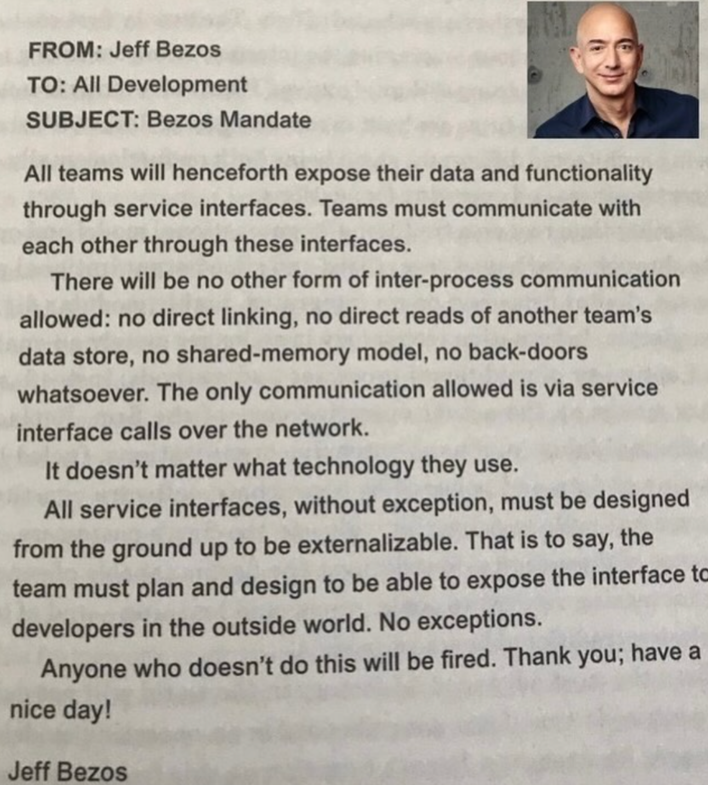{ width=400 }

{ width=400 }

# Lähtökohta: The Bezos mandate

# Starting point: The Bezos Mandate

Translations of # Lähtökohta: The Bezos mandate
[ Suomi -> English ]

# Lähtökohta: The Bezos mandate
    # Starting point: The Bezos Mandate, # Source: The Bezos Mandate

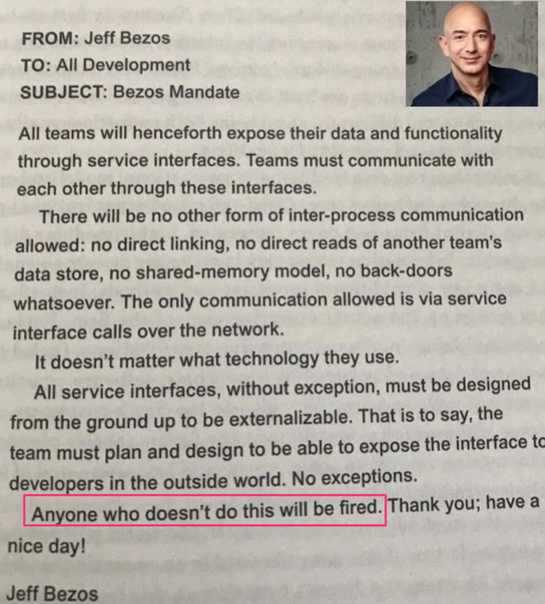{ width=400 }

{ width=400 }

# Lähtökohta

# Starting point

Definitions of # Lähtökohta
[ Suomi -> English ]

noun
    starting point
        lähtökohta
    premise
        lähtökohta, edellytys, premissi
    basis
        perusta, pohja, lähtökohta
    base
        tukikohta, pohja, perusta, emäs, alusta, lähtökohta
    datum
        tieto, tosiseikka, tosio, perusta, lähtökohta
    jumping-off place
        lähtökohta, lähtöasema
    jumping-off point
        lähtökohta, lähtöasema

# Lähtökohta
    # Starting point, # The point of departure

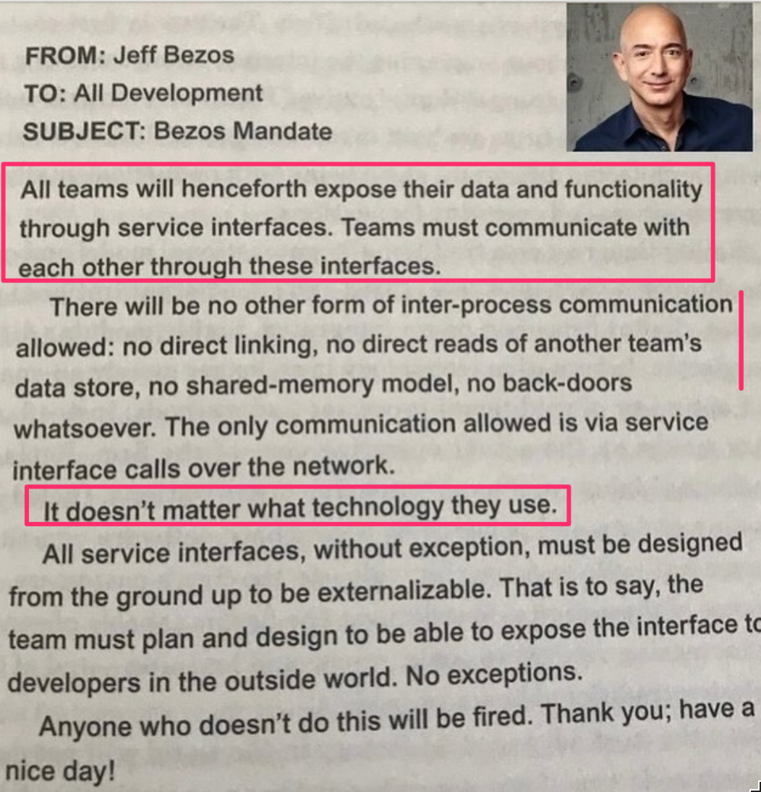{ width=400 }

{ width=400 }

# Mikropalveluiden haasteita

# Challenges of microservices

Translations of # Mikropalveluiden haasteita
[ Suomi -> English ]

# Mikropalveluiden haasteita
    # Challenges of microservices, # Microservices challenges

- Sovelluksen jakaminen järkeviin mikropalveluihin on vaikeaa

- Dividing the application into reasonable microservices is difficult

Translations of - Sovelluksen jakaminen järkeviin mikropalveluihin on vaikeaa
[ Suomi -> English ]

- Sovelluksen jakaminen järkeviin mikropalveluihin on vaikeaa
    - Dividing the application into reasonable microservices is difficult, - Dividing an application into sensible microservices is difficult

. . .

. . .

- Testaaminen ja debuggaus voi olla vaikeaa koska asioita tapahtuu niin monessa paikassa

- Testing and debugging can be difficult because things happen in so many places

Translations of - Testaaminen ja debuggaus voi olla vaikeaa koska asioita tapahtuu niin monessa paikassa
[ Suomi -> English ]

- Testaaminen ja debuggaus voi olla vaikeaa koska asioita tapahtuu niin monessa paikassa
    - Testing and debugging can be difficult because things happen in so many places, - Testing and debugging can be hard because things happen in so many places

. . .

. . .

- Kymmenistä tai jopa sadoista mikropalveluista koostuvan ohjelmiston operoiminen on haastavaa

- Operating software consisting of tens or even hundreds of microservices is challenging

Translations of - Kymmenistä tai jopa sadoista mikropalveluista koostuvan ohjelmiston operoiminen on haastavaa
[ Suomi -> English ]

- Kymmenistä tai jopa sadoista mikropalveluista koostuvan ohjelmiston operoiminen on haastavaa
    - Operating software consisting of tens or even hundreds of microservices is challenging, - Operating a software consisting of tens or even hundreds of micro-services is challenging

- vaatii pitkälle menevää automatisointia

- requires far-reaching automation

Translations of - vaatii pitkälle menevää automatisointia
[ Suomi -> English ]

- vaatii pitkälle menevää automatisointia
    - requires far-reaching automation, - requires extensive automation

. . .

. . .

- Mikropalveluiden menestyksekäs soveltaminen edellyttää vahvaa DevOps-kulttuuria

- The successful application of microservices requires a strong DevOps culture

Translations of - Mikropalveluiden menestyksekäs soveltaminen edellyttää vahvaa DevOps-kulttuuria
[ Suomi -> English ]

- Mikropalveluiden menestyksekäs soveltaminen edellyttää vahvaa DevOps-kulttuuria
    - The successful application of microservices requires a strong DevOps culture, - Successful implementation of microservices requires a strong DevOps culture

. . .

. . .

- Kehitetty massiivisiin järjestelmiin (mm Amazon, Netflix)

- Developed for massive systems (e.g. Amazon, Netflix)

Translations of - Kehitetty massiivisiin järjestelmiin (mm Amazon, Netflix)
[ Suomi -> English ]

- Kehitetty massiivisiin järjestelmiin (mm Amazon, Netflix)
    - Developed for massive systems (e.g. Amazon, Netflix), - Developed for massive systems (including Amazon, Netflix)

- onko järkevä kaikkialla?

- is reasonable everywhere?

Translations of - onko järkevä kaikkialla?
[ Suomi -> English ]

- onko järkevä kaikkialla?
    - is reasonable everywhere?, - does it make sense everywhere?

# Kurssipalautejärjestelmä Norppa

# Course feedback system Norppa

Translations of # Kurssipalautejärjestelmä Norppa
[ Suomi -> English ]

# Kurssipalautejärjestelmä Norppa
    # Course feedback system Norppa, # Norppa course feedback system

- Kerrosarkkitehtuuri

- Layered architecture

Translations of - Kerrosarkkitehtuuri
[ Suomi -> English ]

- Kerrosarkkitehtuuri
    - Layered architecture, - Multi-story architecture

- Mikropalvelu

- Microservice

Translations of - Mikropalvelu
[ Suomi -> English ]

- Mikropalvelu
    - Microservice, - The microservice

- Publish subscribe / Event driven

- Publish subscribe / Event driven

#

#

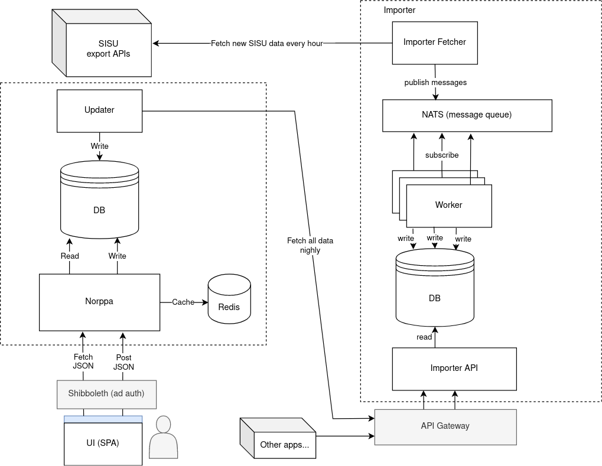{ width=400 }

{ width=400 }

# kerrosarkkitehtuuri

# layered architecture

Translations of # kerrosarkkitehtuuri
[ Suomi -> English ]

# kerrosarkkitehtuuri
    # layered architecture, # floor architecture

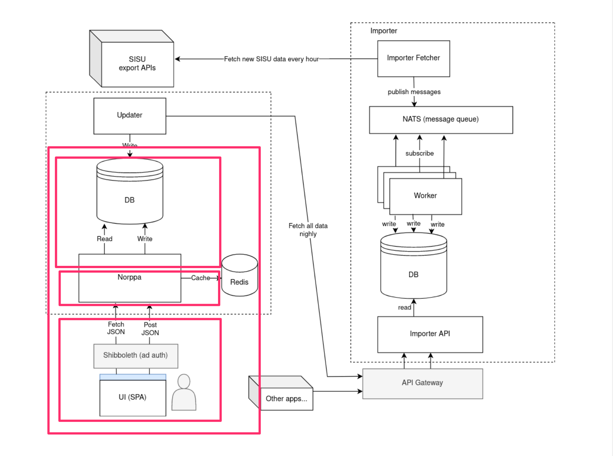{ width=400 }

{ width=400 }

# mikropalvelut

# microservices

Translations of # mikropalvelut
[ Suomi -> English ]

# mikropalvelut
    # microservices, # micro-services

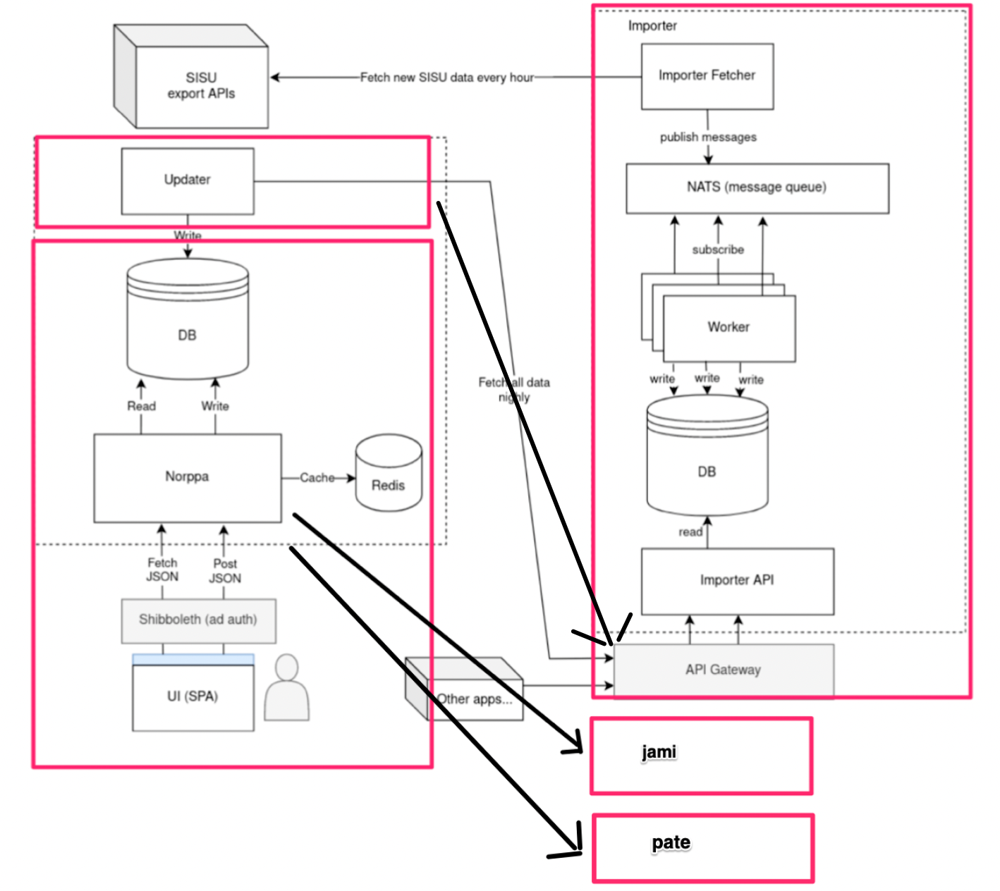{ width=350 }

{ width=350 }

# event driven / messaging

# event driven / messaging

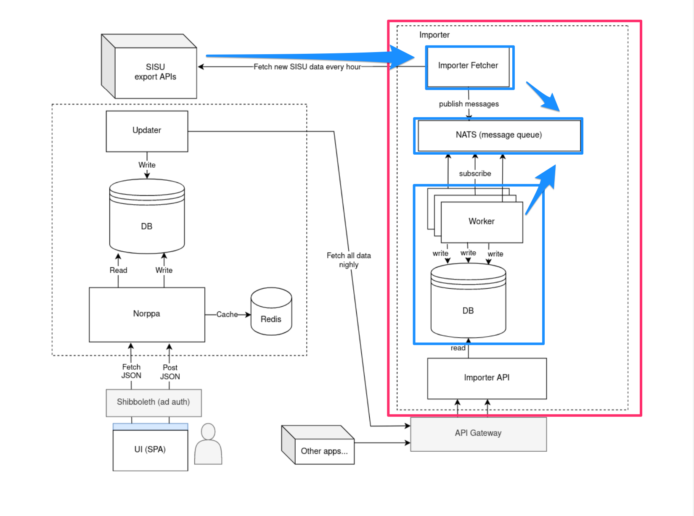{ width=400 }

{ width=400 }

# Arkkitehtuurin kuvaamisesta

# About describing architecture

Translations of # Arkkitehtuurin kuvaamisesta
[ Suomi -> English ]

# Arkkitehtuurin kuvaamisesta
    # About describing architecture, # On describing architecture

- On tilanteita, missä sovelluksen arkkitehtuuri on dokumentoitava jollain tavalla

- There are situations where the architecture of the application must be documented in some way

Translations of - On tilanteita, missä sovelluksen arkkitehtuuri on dokumentoitava jollain tavalla
[ Suomi -> English ]

- On tilanteita, missä sovelluksen arkkitehtuuri on dokumentoitava jollain tavalla
    - There are situations where the architecture of the application must be documented in some way, - There are situations where the application's architecture must be documented in some way

. . .

. . .

- Arkkitehtuurien kuvaamiselle ei olemassa vakiintunutta formaattia

- There is no established format for describing architectures

Translations of - Arkkitehtuurien kuvaamiselle ei olemassa vakiintunutta formaattia
[ Suomi -> English ]

- Arkkitehtuurien kuvaamiselle ei olemassa vakiintunutta formaattia
    - There is no established format for describing architectures, - There is no established format for the description of architecture

- UML:n luokka- ja pakkauskaaviot sekä komponentti- ja sijoittelukaaviot joskus käyttökelpoisia

- UML class and package diagrams and component and placement diagrams sometimes useful

Translations of - UML:n luokka- ja pakkauskaaviot sekä komponentti- ja sijoittelukaaviot joskus käyttökelpoisia
[ Suomi -> English ]

- UML:n luokka- ja pakkauskaaviot sekä komponentti- ja sijoittelukaaviot joskus käyttökelpoisia
    - UML class and package diagrams and component and placement diagrams sometimes useful, - UML class and packaging diagrams, and component and placement diagrams sometimes useful

- Useimmiten käytetään epäformaaleja laatikko/nuoli-kaavioita

- Informal box/arrow charts are mostly used

Translations of - Useimmiten käytetään epäformaaleja laatikko/nuoli-kaavioita
[ Suomi -> English ]

- Useimmiten käytetään epäformaaleja laatikko/nuoli-kaavioita
    - Informal box/arrow charts are mostly used, - Most often informal box/arrow charts are used

# Laatikko ja nuoli  -kaavio

# Box and arrow diagram

Translations of # Laatikko ja nuoli  -kaavio
[ Suomi -> English ]

# Laatikko ja nuoli  -kaavio
    # Box and arrow diagram, # Box and arrow plot

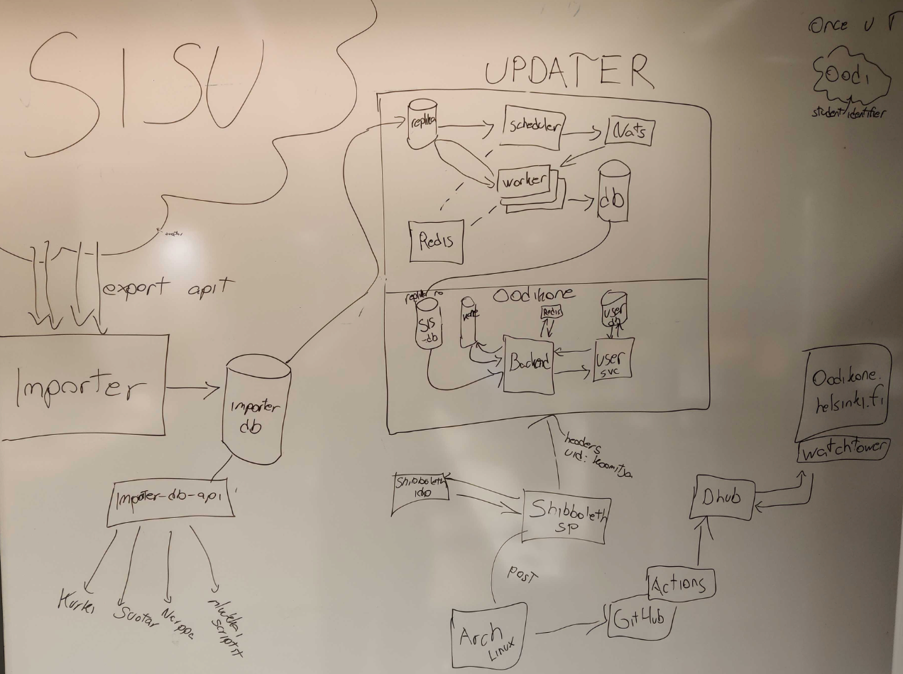{ width=400 }

{ width=400 }

# Hienompi laatikko ja nuoli  -kaavio

# Finer box and arrow diagram

Translations of # Hienompi laatikko ja nuoli  -kaavio
[ Suomi -> English ]

# Hienompi laatikko ja nuoli  -kaavio
    # Finer box and arrow diagram, # A finer box-and-arrow plot

{ width=400 }

{ width=400 }

# Arkkitehtuurin kuvaamisesta

# About describing architecture

Translations of # Arkkitehtuurin kuvaamisesta
[ Suomi -> English ]

# Arkkitehtuurin kuvaamisesta
    # About describing architecture, # On describing architecture

- Arkkitehtuurikuvaus voi olla tarpeen tehdä useasta eri tarpeita palvelevasta _näkökulmasta_

- It may be necessary to make an architectural description from several _perspectives_ that serve different needs

Translations of - Arkkitehtuurikuvaus voi olla tarpeen tehdä useasta eri tarpeita palvelevasta _näkökulmasta_
[ Suomi -> English ]

- Arkkitehtuurikuvaus voi olla tarpeen tehdä useasta eri tarpeita palvelevasta _näkökulmasta_
    - It may be necessary to make an architectural description from several _perspectives_ that serve different needs, - Architectural description may need to be done from several _perspectives_ that serve different needs

- korkean tason kuvauksen voi olla hyödyksi esim.  vaatimusmäärittelyssä

- a high-level description can be useful, e.g. in requirements specification

Translations of - korkean tason kuvauksen voi olla hyödyksi esim.  vaatimusmäärittelyssä
[ Suomi -> English ]

- korkean tason kuvauksen voi olla hyödyksi esim.
    - a high-level description can be useful, e.g., - high level description can be useful, e.g.
vaatimusmäärittelyssä
    in requirements specification, in the requirements definition

- tarkemmat kuvaukset toimivat ohjeena tarkemmassa suunnittelussa ja ylläpitovaiheen aikaisessa laajentamisessa

- more detailed descriptions serve as guidelines for more detailed planning and expansion during the maintenance phase

Translations of - tarkemmat kuvaukset toimivat ohjeena tarkemmassa suunnittelussa ja ylläpitovaiheen aikaisessa laajentamisessa
[ Suomi -> English ]

- tarkemmat kuvaukset toimivat ohjeena tarkemmassa suunnittelussa ja ylläpitovaiheen aikaisessa laajentamisessa
    - more detailed descriptions serve as guidelines for more detailed planning and expansion during the maintenance phase, - more detailed descriptions serve as a guide for more detailed planning and expansion during the maintenance phase

. . .

. . .

- Hyödyllinen arkkitehtuurikuvaus dokumentoi ja perustelee tehtyjä _ arkkitehtuurisia valintoja _

- A useful architectural description documents and justifies the _ architectural choices made _

Translations of - Hyödyllinen arkkitehtuurikuvaus dokumentoi ja perustelee tehtyjä _ arkkitehtuurisia valintoja _
[ Suomi -> English ]

- Hyödyllinen arkkitehtuurikuvaus dokumentoi ja perustelee tehtyjä _ arkkitehtuurisia valintoja _
    - A useful architectural description documents and justifies the _ architectural choices made _, - A useful architectural description documents and justifies the _ architectural choices _

# Arkkitehtuuri ketterissä menetelmissä

# Architecture in agile methods

Translations of # Arkkitehtuuri ketterissä menetelmissä
[ Suomi -> English ]

# Arkkitehtuuri ketterissä menetelmissä
    # Architecture in agile methods, # Architecture in agile methodologies

. . .

. . .

- Ketterien menetelmien kantava teema on toimivan, asiakkaalle arvoa tuottavan ohjelmiston nopea toimittaminen

- The main theme of agile methods is the fast delivery of functional software that generates value for the customer

Translations of - Ketterien menetelmien kantava teema on toimivan, asiakkaalle arvoa tuottavan ohjelmiston nopea toimittaminen
[ Suomi -> English ]

- Ketterien menetelmien kantava teema on toimivan, asiakkaalle arvoa tuottavan ohjelmiston nopea toimittaminen
    - The main theme of agile methods is the fast delivery of functional software that generates value for the customer, - The main theme of agile methods is the quick delivery of software that works and produces value for the customer

. . .

. . .

- Periaatteita

- Principles

Definitions of - Periaatteita
[ Suomi -> English ]

noun
    principle
        periaate, toimintaperiaate, laki

- Periaatteita
    - Principles, - Basics

- _Our highest priority is to satisfy the customer through early and continuous delivery of valuable software_

- _Our highest priority is to satisfy the customer through early and continuous delivery of valuable software_

- _Deliver working software frequently..._

- _Deliver working software frequently..._

. . .

. . .

- Ketterät menetelmät suosivat yksinkertaisuutta

- Agile methods favor simplicity

Translations of - Ketterät menetelmät suosivat yksinkertaisuutta
[ Suomi -> English ]

- Ketterät menetelmät suosivat yksinkertaisuutta
    - Agile methods favor simplicity, - Agile methodologies prefer simplicity

- _Simplicity, the art of maximizing the amount of work not done, is essential_

- _Simplicity, the art of maximizing the amount of work not done, is essential_

. . .

. . .

- Arkkitehtuuriin suunnittelu ja dokumentointi on perinteisesti pitkäkestoinen, ohjelmoinnin aloittamista edeltävä vaihe

- Designing and documenting architecture is traditionally a long-lasting phase before starting programming

Translations of - Arkkitehtuuriin suunnittelu ja dokumentointi on perinteisesti pitkäkestoinen, ohjelmoinnin aloittamista edeltävä vaihe
[ Suomi -> English ]

- Arkkitehtuuriin suunnittelu ja dokumentointi on perinteisesti pitkäkestoinen, ohjelmoinnin aloittamista edeltävä vaihe
    - Designing and documenting architecture is traditionally a long-lasting phase before starting programming, - Designing and documenting architecture is traditionally a long-term phase, before starting programming

. . .

. . .

- Ketterät menetelmät ja "arkkitehtuurivetoinen" ohjelmistotuotanto siis jossain määrin ristiriidassa

- Agile methods and "architecture-driven" Software production therefore somewhat in conflict

Translations of - Ketterät menetelmät ja "arkkitehtuurivetoinen" ohjelmistotuotanto siis jossain määrin ristiriidassa
[ Suomi -> English ]

- Ketterät menetelmät ja "arkkitehtuurivetoinen" ohjelmistotuotanto siis jossain määrin ristiriidassa
    - Agile methods and "architecture-driven" Software production therefore somewhat in conflict, - Agile methods and "architecture-driven" Software production therefore to some extent at odds

# Arkkitehtuuri ketterissä menetelmissä

# Architecture in agile methods

Translations of # Arkkitehtuuri ketterissä menetelmissä
[ Suomi -> English ]

# Arkkitehtuuri ketterissä menetelmissä
    # Architecture in agile methods, # Architecture in agile methodologies

- Ketterien menetelmien yhteydessä puhutaan _inkrementaalisesta suunnittelusta ja arkkitehtuurista_

- In connection with agile methods, we talk about _incremental design and architecture_

Translations of - Ketterien menetelmien yhteydessä puhutaan _inkrementaalisesta suunnittelusta ja arkkitehtuurista_
[ Suomi -> English ]

- Ketterien menetelmien yhteydessä puhutaan _inkrementaalisesta suunnittelusta ja arkkitehtuurista_
    - In connection with agile methods, we talk about _incremental design and architecture_, - In connection with agile methods we talk about _incremental planning and architecture_

. . .

. . .

- Arkkitehtuuri mietitään riittävällä tasolla projektin alussa

- Architecture is considered at a sufficient level at the beginning of the project

Translations of - Arkkitehtuuri mietitään riittävällä tasolla projektin alussa
[ Suomi -> English ]

- Arkkitehtuuri mietitään riittävällä tasolla projektin alussa
    - Architecture is considered at a sufficient level at the beginning of the project, - The architecture is thought about at a sufficient level at the beginning of the project

- Jotkut projektit alkavat ns.  nollasprintillä ja alustava arkkitehtuuri määritellään tällöin

- Some projects start with so-called with a zero print and the initial architecture is then defined

Translations of - Jotkut projektit alkavat ns.  nollasprintillä ja alustava arkkitehtuuri määritellään tällöin
[ Suomi -> English ]

- Jotkut projektit alkavat ns.
    - Some projects start with so-called, - Some projects begin with so-called
nollasprintillä ja alustava arkkitehtuuri määritellään tällöin
    with a zero print and the initial architecture is then defined, with a zero print and the initial architecture is defined in that case

. . .

. . .

- Ohjelmiston "lopullinen" arkkitehtuuri muodostuu iteraatio iteraatiolta samalla kun uutta toiminnallisuutta toteutetaan

- The "final" architecture of the software is formed iteration by iteration while new functionality is implemented

Translations of - Ohjelmiston "lopullinen" arkkitehtuuri muodostuu iteraatio iteraatiolta samalla kun uutta toiminnallisuutta toteutetaan
[ Suomi -> English ]

- Ohjelmiston "lopullinen" arkkitehtuuri muodostuu iteraatio iteraatiolta samalla kun uutta toiminnallisuutta toteutetaan
    - The "final" architecture of the software is formed iteration by iteration while new functionality is implemented, - The "final" architecture of the software is formed iteration by iteration while new functionality is being implemented

. . .

. . .

- Esim.  kerrosarkkitehtuurin mukaista sovellusta ei rakenneta "kerros kerrallaan"

- E.g. an application based on a layered architecture is not built "layer by layer"

Translations of - Esim.  kerrosarkkitehtuurin mukaista sovellusta ei rakenneta "kerros kerrallaan"
[ Suomi -> English ]

- Esim.
    - E.g., - For example
kerrosarkkitehtuurin mukaista sovellusta ei rakenneta "kerros kerrallaan"
    an application based on a layered architecture is not built "layer by layer", an application according to the layered architecture is not built "layer by layer"

- Jokaisessa iteraatiossa tehdään pieni pala jokaista kerrosta, sen verran kuin iteraation tavoitteiden toteuttaminen edellyttää

- In each iteration, a small piece of each layer is made, as much as is required to fulfill the goals of the iteration

Translations of - Jokaisessa iteraatiossa tehdään pieni pala jokaista kerrosta, sen verran kuin iteraation tavoitteiden toteuttaminen edellyttää
[ Suomi -> English ]

- Jokaisessa iteraatiossa tehdään pieni pala jokaista kerrosta, sen verran kuin iteraation tavoitteiden toteuttaminen edellyttää
    - In each iteration, a small piece of each layer is made, as much as is required to fulfill the goals of the iteration, - In each iteration, a small piece of each layer is made, as much as is required to realize the iteration's goals

# Inkrementaalinen arkkitehtuuri

# Incremental architecture

Translations of # Inkrementaalinen arkkitehtuuri
[ Suomi -> English ]

# Inkrementaalinen arkkitehtuuri
    # Incremental architecture, # The incremental architecture

- Alussa ns.  _walking skeleton_

- In the beginning, the so-called _walking skeleton_

Translations of - Alussa ns.  _walking skeleton_
[ Suomi -> English ]

- Alussa ns.
    - In the beginning, the so-called, - At the beginning the so-called
_walking skeleton_
    _walking skeleton_, _walking_

- sisältää tynkäversiot ohjelmiston komponenttirakenteesta

- contains stub versions of the software's component structure

Translations of - sisältää tynkäversiot ohjelmiston komponenttirakenteesta
[ Suomi -> English ]

- sisältää tynkäversiot ohjelmiston komponenttirakenteesta
    - contains stub versions of the software's component structure, - contains stub versions of the component structure of the software

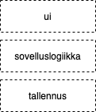{ width=120 }

{ width=120 }

. . .

. . .

- Rakennetaan skeletonin varaan tuotetta story storyltä

- Let's build a product from story story based on the skeleton

Translations of - Rakennetaan skeletonin varaan tuotetta story storyltä
[ Suomi -> English ]

- Rakennetaan skeletonin varaan tuotetta story storyltä
    - Let's build a product from story story based on the skeleton, - We are building a product from story story based on the skeleton

# Ominaisuuksiin perustuva integraatio

# Feature-based integration

Translations of # Ominaisuuksiin perustuva integraatio
[ Suomi -> English ]

# Ominaisuuksiin perustuva integraatio
    # Feature-based integration, # Integration based on features

- Alussa ns.  _walking skeleton_

- In the beginning, the so-called _walking skeleton_

Translations of - Alussa ns.  _walking skeleton_
[ Suomi -> English ]

- Alussa ns.
    - In the beginning, the so-called, - At the beginning the so-called
_walking skeleton_
    _walking skeleton_, _walking_

- sisältää tynkäversiot ohjelmiston komponenttirakenteesta

- contains stub versions of the software's component structure

Translations of - sisältää tynkäversiot ohjelmiston komponenttirakenteesta
[ Suomi -> English ]

- sisältää tynkäversiot ohjelmiston komponenttirakenteesta
    - contains stub versions of the software's component structure, - contains stub versions of the component structure of the software

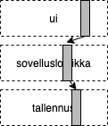{ width=120 }

{ width=120 }

- Rakennetaan skeletonin varaan tuotetta story storyltä

- Let's build a product from story story based on the skeleton

Translations of - Rakennetaan skeletonin varaan tuotetta story storyltä
[ Suomi -> English ]

- Rakennetaan skeletonin varaan tuotetta story storyltä
    - Let's build a product from story story based on the skeleton, - We are building a product from story story based on the skeleton

# Ominaisuuksiin perustuva integraatio

# Feature-based integration

Translations of # Ominaisuuksiin perustuva integraatio
[ Suomi -> English ]

# Ominaisuuksiin perustuva integraatio
    # Feature-based integration, # Integration based on features

- Alussa ns.  _walking skeleton_

- In the beginning, the so-called _walking skeleton_

Translations of - Alussa ns.  _walking skeleton_
[ Suomi -> English ]

- Alussa ns.
    - In the beginning, the so-called, - At the beginning the so-called
_walking skeleton_
    _walking skeleton_, _walking_

- sisältää tynkäversiot ohjelmiston komponenttirakenteesta

- contains stub versions of the software's component structure

Translations of - sisältää tynkäversiot ohjelmiston komponenttirakenteesta
[ Suomi -> English ]

- sisältää tynkäversiot ohjelmiston komponenttirakenteesta
    - contains stub versions of the software's component structure, - contains stub versions of the component structure of the software

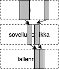{ width=120 }

{ width=120 }

- Rakennetaan skeletonin varaan tuotetta story storyltä

- Let's build a product from story story based on the skeleton

Translations of - Rakennetaan skeletonin varaan tuotetta story storyltä
[ Suomi -> English ]

- Rakennetaan skeletonin varaan tuotetta story storyltä
    - Let's build a product from story story based on the skeleton, - We are building a product from story story based on the skeleton

# Ominaisuuksiin perustuva integraatio

# Feature-based integration

Translations of # Ominaisuuksiin perustuva integraatio
[ Suomi -> English ]

# Ominaisuuksiin perustuva integraatio
    # Feature-based integration, # Integration based on features

- Alussa ns.  _walking skeleton_

- In the beginning, the so-called _walking skeleton_

Translations of - Alussa ns.  _walking skeleton_
[ Suomi -> English ]

- Alussa ns.
    - In the beginning, the so-called, - At the beginning the so-called
_walking skeleton_
    _walking skeleton_, _walking_

- sisältää tynkäversiot ohjelmiston komponenttirakenteesta

- contains stub versions of the software's component structure

Translations of - sisältää tynkäversiot ohjelmiston komponenttirakenteesta
[ Suomi -> English ]

- sisältää tynkäversiot ohjelmiston komponenttirakenteesta
    - contains stub versions of the software's component structure, - contains stub versions of the component structure of the software

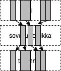{ width=120 }

{ width=120 }

- Rakennetaan skeletonin varaan tuotetta story storyltä

- Let's build a product from story story based on the skeleton

Translations of - Rakennetaan skeletonin varaan tuotetta story storyltä
[ Suomi -> English ]

- Rakennetaan skeletonin varaan tuotetta story storyltä
    - Let's build a product from story story based on the skeleton, - We are building a product from story story based on the skeleton

# Arkkitehtuuri ketterissä menetelmissä

# Architecture in agile methods

Translations of # Arkkitehtuuri ketterissä menetelmissä
[ Suomi -> English ]

# Arkkitehtuuri ketterissä menetelmissä
    # Architecture in agile methods, # Architecture in agile methodologies

- Perinteisesti arkkitehtuurin luonut *ohjelmistoarkkitehti*

- Traditionally, the *software architect* who created the architecture

Translations of - Perinteisesti arkkitehtuurin luonut *ohjelmistoarkkitehti*
[ Suomi -> English ]

- Perinteisesti arkkitehtuurin luonut *ohjelmistoarkkitehti*
    - Traditionally, the *software architect* who created the architecture, - Traditionally the architecture was created by a *software architect*

- ohjelmoijat velvoitettuja noudattamaan arkkitehtuuria

- programmers obliged to follow the architecture

Translations of - ohjelmoijat velvoitettuja noudattamaan arkkitehtuuria
[ Suomi -> English ]

- ohjelmoijat velvoitettuja noudattamaan arkkitehtuuria
    - programmers obliged to follow the architecture, - programmers are required to follow the architecture

. . .

. . .

- Ketterissä menetelmissä ei suosita erillistä arkkitehdin roolia

- Agile methods do not recommend a separate architect role

Translations of - Ketterissä menetelmissä ei suosita erillistä arkkitehdin roolia
[ Suomi -> English ]

- Ketterissä menetelmissä ei suosita erillistä arkkitehdin roolia
    - Agile methods do not recommend a separate architect role, - In agile methods, a separate role of an architect is not recommended

- Scrumissa kaikista tiimiläisistä käytetään nimikettä developer

- In Scrum, all team members are called Developer

Translations of - Scrumissa kaikista tiimiläisistä käytetään nimikettä developer
[ Suomi -> English ]

- Scrumissa kaikista tiimiläisistä käytetään nimikettä developer
    - In Scrum, all team members are called Developer, - In Scrum, the title Developer is used for all team members

. . .

. . .

- Ketterä idealli: kehitystiimi luo arkkitehtuurin yhdessä

- Agile with an idea: the development team creates the architecture together

Translations of - Ketterä idealli: kehitystiimi luo arkkitehtuurin yhdessä
[ Suomi -> English ]

- Ketterä idealli: kehitystiimi luo arkkitehtuurin yhdessä
    - Agile with an idea: the development team creates the architecture together, - With an agile idea: the development team creates the architecture together

- _The best architectures, requirements, and designs emerge from self-organizing teams_

- _The best architectures, requirements, and designs emerge from self-organizing teams_

. . .

. . .

- **Arkkitehtuuri koodin tapaan tiimin yhteisomistama**

- **Architecture, like code, jointly owned by the team**

Translations of - **Arkkitehtuuri koodin tapaan tiimin yhteisomistama**
[ Suomi -> English ]

- **Arkkitehtuuri koodin tapaan tiimin yhteisomistama**
    - **Architecture, like code, jointly owned by the team**, - **Architecture, like the code, is jointly owned by the team**

. . .

. . .

- Etuja:

- Advantages:

Definitions of - Etuja:
[ Suomi -> English ]

noun
    advantage
        etu, hyöty, etumatka, yliote, etuisuus, edullisempi asema
    benefit
        hyöty, etu, korvaus, avustus, lahjanäytäntö, lahjaottelu
    interests
        eturyhmät, etu, intressi, eturyhmä
    asset
        etu, hyvä asia
    plus
        plussa, etu, plusmerkki, ansio
    merit
        ansio, arvo, etu, meriitti, hyvä puoli, ansiokkuus
    profit
        voitto, tuotto, hyöty, etu
    favor
        suosio, palvelus, etu, suosiollisuus, mielisuosio, puolueellisuus
    virtue
        hyve, hyveellisyys, etu, hyvä puoli, siveys
    vantage
        etu, etulyöntiasema
    van
        pakettiauto, vaunu, etu, matkailuauto, matkailuvaunu, kärki
    account
        tili, asiakastili, selvitys, tilit, arvo, etu
    pull
        veto, vedin, siemaus, vetovoima, nykäisy, etu
    facility
        laitos, mahdollisuus, tilat, palvelut, toiminto, etu
    favour
        suosio, palvelus, etu, suosiollisuus, mielisuosio, puolueellisuus

- Etuja:
    - Advantages:, - The benefits

- kehittäjät sitoutuvat paremmin arkkitehtuurin noudattamiseen kuin "norsunluutornissa" olevan arkkitehdin määrittelemään

- developers are more committed to following the architecture than to what is defined by the architect in the "ivory tower".

Translations of - kehittäjät sitoutuvat paremmin arkkitehtuurin noudattamiseen kuin "norsunluutornissa" olevan arkkitehdin määrittelemään
[ Suomi -> English ]

- kehittäjät sitoutuvat paremmin arkkitehtuurin noudattamiseen kuin "norsunluutornissa" olevan arkkitehdin määrittelemään
    - developers are more committed to following the architecture than to what is defined by the architect in the "ivory tower"., - developers are more committed to complying with the architecture rather than what is defined by the architect in the "ivory tower".

- dokumentaatio voi olla kevyt, tiimi tuntee arkkitehtuurin hengen ja pystyy sitä noudattamaan

- the documentation can be light, the team knows the spirit of the architecture and is able to follow it

Translations of - dokumentaatio voi olla kevyt, tiimi tuntee arkkitehtuurin hengen ja pystyy sitä noudattamaan
[ Suomi -> English ]

- dokumentaatio voi olla kevyt, tiimi tuntee arkkitehtuurin hengen ja pystyy sitä noudattamaan
    - the documentation can be light, the team knows the spirit of the architecture and is able to follow it, - documentation can be light, the team knows the spirit of the architecture and can follow it

# Inkrementaalinen arkkitehtuuri: edut ja riskit

# Incremental architecture: benefits and risks

Translations of # Inkrementaalinen arkkitehtuuri: edut ja riskit
[ Suomi -> English ]

# Inkrementaalinen arkkitehtuuri: edut ja riskit
    # Incremental architecture: benefits and risks, # Incremental Architecture: Advantages and Risks

- Oletus: optimaalista arkkitehtuuria ei pystytä suunnittelemaan projektin aluss

- Assumption: optimal architecture cannot be planned at the beginning of the project

Translations of - Oletus: optimaalista arkkitehtuuria ei pystytä suunnittelemaan projektin aluss
[ Suomi -> English ]

- Oletus: optimaalista arkkitehtuuria ei pystytä suunnittelemaan projektin aluss
    - Assumption: optimal architecture cannot be planned at the beginning of the project, - Assumption: the optimal architecture cannot be designed at the beginning of the project

- Jo tehtyjä arkkitehtuuriratkaisuja muutetaan tarvittaessa

- Architectural solutions that have already been made are changed if necessary

Translations of - Jo tehtyjä arkkitehtuuriratkaisuja muutetaan tarvittaessa
[ Suomi -> English ]

- Jo tehtyjä arkkitehtuuriratkaisuja muutetaan tarvittaessa
    - Architectural solutions that have already been made are changed if necessary, - Architecture solutions that have already been made will be changed if necessary

. . .

. . .

- Kuten vaatimusmäärittelyssä, myös arkkitehtuurin suunnittelussa ketterä pyrkii _välttämään liian aikaisin tehtävää, ehkä turhaksi osoittautuvaa työtä_

- As in the definition of requirements, also in the design of architecture, agile strives to _avoid work done too soon, which may turn out to be useless_

Translations of - Kuten vaatimusmäärittelyssä, myös arkkitehtuurin suunnittelussa ketterä pyrkii _välttämään liian aikaisin tehtävää, ehkä turhaksi osoittautuvaa työtä_
[ Suomi -> English ]

- Kuten vaatimusmäärittelyssä, myös arkkitehtuurin suunnittelussa ketterä pyrkii _välttämään liian aikaisin tehtävää, ehkä turhaksi osoittautuvaa työtä_
    - As in the definition of requirements, also in the design of architecture, agile strives to _avoid work done too soon, which may turn out to be useless_, - As in the definition of requirements, also in the design of architecture, agile strives to _avoid work done too early, which may turn out to be unnecessary_

. . .

. . .

- Inkrementaalinen arkkitehtuuri edellyttää koodilta hyvää sisäistä laatua ja kehittäjiltä kurinalaisuutta

- Incremental architecture requires good internal quality from the code and discipline from the developers

Translations of - Inkrementaalinen arkkitehtuuri edellyttää koodilta hyvää sisäistä laatua ja kehittäjiltä kurinalaisuutta
[ Suomi -> English ]

- Inkrementaalinen arkkitehtuuri edellyttää koodilta hyvää sisäistä laatua ja kehittäjiltä kurinalaisuutta
    - Incremental architecture requires good internal quality from the code and discipline from the developers, - Incremental architecture requires good internal quality from code and discipline from developers

- muuten seurauksena on kaaos

- otherwise the result is chaos

Translations of - muuten seurauksena on kaaos
[ Suomi -> English ]

- muuten seurauksena on kaaos
    - otherwise the result is chaos, - otherwise chaos will result

# TAUKO 10 min

# BREAK 10 min

Translations of # TAUKO 10 min
[ Suomi -> English ]

# TAUKO 10 min
    # BREAK 10 min, # BREAK for 10 min

# Olio/komponenttisuunnittelu

# Object/component design

Translations of # Olio/komponenttisuunnittelu
[ Suomi -> English ]

# Olio/komponenttisuunnittelu
    # Object/component design, # Object/Component Design

. . .

. . .

- Sovelluksen arkkitehtuuri antaa raamit, jotka ohjaavat sovelluksen tarkempaa suunnittelua ja toteuttamista

- The architecture of the application provides the framework that guides the more precise planning and implementation of the application

Translations of - Sovelluksen arkkitehtuuri antaa raamit, jotka ohjaavat sovelluksen tarkempaa suunnittelua ja toteuttamista
[ Suomi -> English ]

- Sovelluksen arkkitehtuuri antaa raamit, jotka ohjaavat sovelluksen tarkempaa suunnittelua ja toteuttamista
    - The architecture of the application provides the framework that guides the more precise planning and implementation of the application, - The application's architecture provides the framework that guides the application's more precise design and implementation

. . .

. . .

- _Olio- tai komponenttisuunnittelu_

- _Object or component design_

Translations of - _Olio- tai komponenttisuunnittelu_
[ Suomi -> English ]

- _Olio- tai komponenttisuunnittelu_
    - _Object or component design_, - _Object or component planning_

- tarkentaa arkkitehtuuristen komponenttien väliset rajapinnat sekä hahmottelee ohjelman luokka- tai moduulirakenteen

- specifies the interfaces between the architectural components and outlines the class or module structure of the program

Translations of - tarkentaa arkkitehtuuristen komponenttien väliset rajapinnat sekä hahmottelee ohjelman luokka- tai moduulirakenteen
[ Suomi -> English ]

- tarkentaa arkkitehtuuristen komponenttien väliset rajapinnat sekä hahmottelee ohjelman luokka- tai moduulirakenteen
    - specifies the interfaces between the architectural components and outlines the class or module structure of the program, - specifies the interfaces between architectural components and outlines the program's class or module structure

. . .

. . .

- Vesiputousmallissa komponenttisuunnittelu tehty ennen ohjelmointia ja  dokumentoitu tarkkaan esim.  UML:lä

- In the waterfall model, the component design is done before programming and documented accurately, e.g. UML

Translations of - Vesiputousmallissa komponenttisuunnittelu tehty ennen ohjelmointia ja  dokumentoitu tarkkaan esim.  UML:lä
[ Suomi -> English ]

- Vesiputousmallissa komponenttisuunnittelu tehty ennen ohjelmointia ja  dokumentoitu tarkkaan esim.
    - In the waterfall model, the component design is done before programming and documented accurately, e.g., - In the waterfall model, the component design is done before programming and is documented carefully, e.g.
UML:lä
    UML, from UML

. . .

. . .

- Ketterässä tarkka suunnittelu tehdään vasta ohjelmoitaessa

- In agile, precise planning is done only when programming

Translations of - Ketterässä tarkka suunnittelu tehdään vasta ohjelmoitaessa
[ Suomi -> English ]

- Ketterässä tarkka suunnittelu tehdään vasta ohjelmoitaessa
    - In agile, precise planning is done only when programming, - In agile, the exact planning is only done when programming

. . .

. . .

- Suunnittelussa pyritään maksimoimaan _koodin sisäinen laatu_

- The design aims to maximize the _internal quality of the code_

Translations of - Suunnittelussa pyritään maksimoimaan _koodin sisäinen laatu_
[ Suomi -> English ]

- Suunnittelussa pyritään maksimoimaan _koodin sisäinen laatu_
    - The design aims to maximize the _internal quality of the code_, - In planning, the aim is to maximize _the internal quality of the code_

- helppo ylläpidettävyys ja laajennettavuus

- easy maintainability and expandability

Translations of - helppo ylläpidettävyys ja laajennettavuus
[ Suomi -> English ]

- helppo ylläpidettävyys ja laajennettavuus
    - easy maintainability and expandability, - easy maintenance and extensibility

. . .

. . .

- Ohjelmistosuunnittelu on "enemmän taidetta kuin tiedettä", kokemus ja hyvien käytänteiden tuntemus auttaa

- Software design is "more art than science", experience and knowledge of good practices help

Translations of - Ohjelmistosuunnittelu on "enemmän taidetta kuin tiedettä", kokemus ja hyvien käytänteiden tuntemus auttaa
[ Suomi -> English ]

- Ohjelmistosuunnittelu on "enemmän taidetta kuin tiedettä", kokemus ja hyvien käytänteiden tuntemus auttaa
    - Software design is "more art than science", experience and knowledge of good practices help, - Software design is "more of an art than a science", experience and knowledge of good practices help

- kehitetty monia suunnittelumenetelmiä, mikään niistä ei ole vakiintunut

- developed many design methods, none of them are established

Translations of - kehitetty monia suunnittelumenetelmiä, mikään niistä ei ole vakiintunut
[ Suomi -> English ]

- kehitetty monia suunnittelumenetelmiä, mikään niistä ei ole vakiintunut
    - developed many design methods, none of them are established, - many design methods have been developed, none of them have been established

# Laadukas koodi

# Quality code

Translations of # Laadukas koodi
[ Suomi -> English ]

# Laadukas koodi
    # Quality code, # High quality code

- Tavoitteena siis **sisäiseltä laadultaan** hyvä koodi

- So the goal is **internal quality** good code

Translations of - Tavoitteena siis **sisäiseltä laadultaan** hyvä koodi
[ Suomi -> English ]

- Tavoitteena siis **sisäiseltä laadultaan** hyvä koodi
    - So the goal is **internal quality** good code, - So the goal is **intrinsically good** code

. . .

. . .

- _Sisäinen laatu_ (internal quality)

- _Internal quality_ (internal quality)

Translations of - _Sisäinen laatu_ (internal quality)
[ Suomi -> English ]

- _Sisäinen laatu_ (internal quality)
    - _Internal quality_ (internal quality), - _Internal quality_

- onko virheiden jäljitys ja korjaaminen helppoa

- is it easy to trace and correct errors

Translations of - onko virheiden jäljitys ja korjaaminen helppoa
[ Suomi -> English ]

- onko virheiden jäljitys ja korjaaminen helppoa
    - is it easy to trace and correct errors, - is it easy to track down and fix errors

- onko koodia helppo laajentaa ja jatkokehittää

- is the code easy to expand and further develop

Translations of - onko koodia helppo laajentaa ja jatkokehittää
[ Suomi -> English ]

- onko koodia helppo laajentaa ja jatkokehittää
    - is the code easy to expand and further develop, - is the code easy to expand and develop further?

- pystytäänkö koodin toiminnallisuuden oikeellisuus varmistamaan muutoksia tehtäessä

- is it possible to ensure the correctness of the functionality of the code when making changes

Translations of - pystytäänkö koodin toiminnallisuuden oikeellisuus varmistamaan muutoksia tehtäessä
[ Suomi -> English ]

- pystytäänkö koodin toiminnallisuuden oikeellisuus varmistamaan muutoksia tehtäessä
    - is it possible to ensure the correctness of the functionality of the code when making changes, - whether it is possible to ensure the correctness of the code's functionality when making changes

. . .

. . .

- Jos sisäinen laatu rapistuu

- If the internal quality deteriorates

Translations of - Jos sisäinen laatu rapistuu
[ Suomi -> English ]

- Jos sisäinen laatu rapistuu
    - If the internal quality deteriorates, - If the internal quality decays

- alkaa vaikuttamaan myös ulkoiseen eli käyttäjän kokemaan laatuun

- begins to affect the external quality as well, i.e. the quality experienced by the user

Translations of - alkaa vaikuttamaan myös ulkoiseen eli käyttäjän kokemaan laatuun
[ Suomi -> English ]

- alkaa vaikuttamaan myös ulkoiseen eli käyttäjän kokemaan laatuun
    - begins to affect the external quality as well, i.e. the quality experienced by the user, - begins to affect also the external, i.e. the quality experienced by the user

- kehitystiimin velositeetti alkaa tippua

- the velocity of the development team starts to drop

Translations of - kehitystiimin velositeetti alkaa tippua
[ Suomi -> English ]

- kehitystiimin velositeetti alkaa tippua
    - the velocity of the development team starts to drop, - the development team's velocity is starting to drop

# Laadukkaan koodin tuntomerkkejä

# Hallmarks of high-quality code

Translations of # Laadukkaan koodin tuntomerkkejä
[ Suomi -> English ]

# Laadukkaan koodin tuntomerkkejä
    # Hallmarks of high-quality code, # Characteristics of high-quality code

. . .

. . .

- Laadukkaalla koodilla joukko yhteneviä ominaisuuksia, tai _laatuattribuutteja_, esim.  seuraavat:

- High-quality code has a set of consistent properties, or _quality attributes_, e.g. the following:

Translations of - Laadukkaalla koodilla joukko yhteneviä ominaisuuksia, tai _laatuattribuutteja_, esim.  seuraavat:
[ Suomi -> English ]

- Laadukkaalla koodilla joukko yhteneviä ominaisuuksia, tai _laatuattribuutteja_, esim.
    - High-quality code has a set of consistent properties, or _quality attributes_, e.g., - A high-quality code has a set of congruent properties, or _quality attributes_, e.g.
seuraavat:
    the following:, as follows:

- kapselointi

- encapsulation

Translations of - kapselointi
[ Suomi -> English ]

- kapselointi
    - encapsulation, - encapsulating

- korkea koheesion aste

- high degree of cohesion

Translations of - korkea koheesion aste
[ Suomi -> English ]

- korkea koheesion aste
    - high degree of cohesion, - a high level of cohesion

- riippuvuuksien vähäisyys

- few dependencies

Translations of - riippuvuuksien vähäisyys
[ Suomi -> English ]

- riippuvuuksien vähäisyys
    - few dependencies, - low level of dependencies

- toisteettomuus

- non-repeatability

Translations of - toisteettomuus
[ Suomi -> English ]

- toisteettomuus
    - non-repeatability, - non-repetitiveness

- testattavuus

- testability

Translations of - testattavuus
[ Suomi -> English ]

- testattavuus
    - testability, testability

- selkeys

- clarity

Definitions of - selkeys
[ Suomi -> English ]

noun
    clarity
        selkeys, kirkkaus
    lucidity
        selkeys, kirkkaus
    luminosity
        kirkkaus, selkeys

- selkeys
    - clarity, - the clarity

. . .

. . .

- _Suunnittelumallit_ auttavat luomaan koodia, joissa sisäinen laatu kunnossa

- _Design templates_ help to create code with good internal quality

Translations of - _Suunnittelumallit_ auttavat luomaan koodia, joissa sisäinen laatu kunnossa
[ Suomi -> English ]

- _Suunnittelumallit_ auttavat luomaan koodia, joissa sisäinen laatu kunnossa
    - _Design templates_ help to create code with good internal quality, - _Design models_ help to create code with good internal quality

- kurssin aikana nähty jo _dependency injection_, _repository_

- already seen during the course _dependency injection_, _repository_

Translations of - kurssin aikana nähty jo _dependency injection_, _repository_
[ Suomi -> English ]

- kurssin aikana nähty jo _dependency injection_, _repository_
    - already seen during the course _dependency injection_, _repository_, - _dependency injection_, _repository_ already seen during the course

- lisää kurssimateriaalissa ja laskareissa

- more in course material and calculators

Translations of - lisää kurssimateriaalissa ja laskareissa
[ Suomi -> English ]

- lisää kurssimateriaalissa ja laskareissa
    - more in course material and calculators, - more in the course materials and calculators

# Koodin laatuattribuutti: kapselointi

# Code quality attribute: encapsulation

Translations of # Koodin laatuattribuutti: kapselointi
[ Suomi -> English ]

# Koodin laatuattribuutti: kapselointi
    # Code quality attribute: encapsulation, # Code Quality Attribute: Encapsulation

. . .

. . .

- _Kapselointi_ ohjelmoinnin peruskursseilla:

- _Encapsulation_ in basic programming courses:

Translations of - _Kapselointi_ ohjelmoinnin peruskursseilla:
[ Suomi -> English ]

- _Kapselointi_ ohjelmoinnin peruskursseilla:
    - _Encapsulation_ in basic programming courses:, - _Encapsulation_ in programming basic courses:

- _oliomuuttujat tulee määritellä piilotetuksi ja niille tulee tehdä tarvittaessa aksessorimetodit_

- _object variables should be defined as hidden and accessor methods should be created for them if necessary_

Translations of - _oliomuuttujat tulee määritellä piilotetuksi ja niille tulee tehdä tarvittaessa aksessorimetodit_
[ Suomi -> English ]

- _oliomuuttujat tulee määritellä piilotetuksi ja niille tulee tehdä tarvittaessa aksessorimetodit_
    - _object variables should be defined as hidden and accessor methods should be created for them if necessary_, - _object variables should be defined as hidden and accessor methods should be added to them if necessary_

. . .

. . .

- Olion sisäisen tilan lisäksi kapseloinnin kohde voi olla mm.  _käytettävän olion tyyppi, käytetty algoritmi, olioiden luomisen tapa, käytettävän komponentin rakenne_

- In addition to the internal space of the object, the object of encapsulation can be e.g. _the type of object to be used, the algorithm used, the way objects are created, the structure of the component to be used_

Translations of - Olion sisäisen tilan lisäksi kapseloinnin kohde voi olla mm.  _käytettävän olion tyyppi, käytetty algoritmi, olioiden luomisen tapa, käytettävän komponentin rakenne_
[ Suomi -> English ]

- Olion sisäisen tilan lisäksi kapseloinnin kohde voi olla mm.
    - In addition to the internal space of the object, the object of encapsulation can be e.g., - In addition to the internal space of the object, the object of the encapsulation can be, for example,
_käytettävän olion tyyppi, käytetty algoritmi, olioiden luomisen tapa, käytettävän komponentin rakenne_
    _the type of object to be used, the algorithm used, the way objects are created, the structure of the component to be used_, _type of object to be used, algorithm used, method of creating objects, structure of the component to be used_

. . .

. . .

- Näkyy myös arkkitehtuurin tasolla

- Also visible at the architectural level

Translations of - Näkyy myös arkkitehtuurin tasolla
[ Suomi -> English ]

- Näkyy myös arkkitehtuurin tasolla
    - Also visible at the architectural level, - Can also be seen at the level of architecture

- kerrosarkkitehtuuri: ylempi kerros käyttää ainoastaan alemman kerroksen ulospäin tarjoamaa rajapintaa, muu kapseloitu

- layered architecture: the upper layer only uses the interface provided by the lower layer to the outside, the rest encapsulated

Translations of - kerrosarkkitehtuuri: ylempi kerros käyttää ainoastaan alemman kerroksen ulospäin tarjoamaa rajapintaa, muu kapseloitu
[ Suomi -> English ]

- kerrosarkkitehtuuri: ylempi kerros käyttää ainoastaan alemman kerroksen ulospäin tarjoamaa rajapintaa, muu kapseloitu
    - layered architecture: the upper layer only uses the interface provided by the lower layer to the outside, the rest encapsulated, - layered architecture: the upper layer uses only the interface provided by the lower layer to the outside, the rest encapsulated

- mikropalvelut: yksittäinen palvelu kapseloi sisäisen logiikan, tiedon säilytystavan ja tarjoaa ainoastaan verkon välityksellä käytettävän rajapinnan

- microservices: a single service encapsulates the internal logic, the data storage method and only provides an interface that can be used via the network

Translations of - mikropalvelut: yksittäinen palvelu kapseloi sisäisen logiikan, tiedon säilytystavan ja tarjoaa ainoastaan verkon välityksellä käytettävän rajapinnan
[ Suomi -> English ]

- mikropalvelut: yksittäinen palvelu kapseloi sisäisen logiikan, tiedon säilytystavan ja tarjoaa ainoastaan verkon välityksellä käytettävän rajapinnan
    - microservices: a single service encapsulates the internal logic, the data storage method and only provides an interface that can be used via the network, - microservices: a single service encapsulates the internal logic, the method of data storage and provides an interface that can only be used via the network

# Koodin laatuattribuutti: koheesio

# Code quality attribute: cohesion

Translations of # Koodin laatuattribuutti: koheesio
[ Suomi -> English ]

# Koodin laatuattribuutti: koheesio
    # Code quality attribute: cohesion, # Quality attribute of code: cohesion

. . .

. . .

- _Koheesio_:

- _Cohesion_:

Translations of - _Koheesio_:
[ Māori -> English ]

- _Koheesio_:
    - _Cohesion_:, - _Coheesio_:

- kuinka pitkälle metodin, luokan tai komponentin koodi keskittyy tietyn yksittäisen toiminnallisuuden toteuttamiseen

- how far the code of the method, class or component focuses on the implementation of a certain single functionality

Translations of - kuinka pitkälle metodin, luokan tai komponentin koodi keskittyy tietyn yksittäisen toiminnallisuuden toteuttamiseen
[ Suomi -> English ]

- kuinka pitkälle metodin, luokan tai komponentin koodi keskittyy tietyn yksittäisen toiminnallisuuden toteuttamiseen
    - how far the code of the method, class or component focuses on the implementation of a certain single functionality, - how far the code of a method, class or component is focused on implementing a certain single functionality

- hyvänä pidetään mahdollisimman korkeaa koheesion astetta

- the highest possible degree of cohesion is considered good

Translations of - hyvänä pidetään mahdollisimman korkeaa koheesion astetta
[ Suomi -> English ]

- hyvänä pidetään mahdollisimman korkeaa koheesion astetta
    - the highest possible degree of cohesion is considered good, - a high degree of cohesion is considered good

. . .

. . .

- Luokkatason koheesio

- Class-level cohesion

Translations of - Luokkatason koheesio
[ Suomi -> English ]

- Luokkatason koheesio
    - Class-level cohesion, - Cohesion at class level

- luokan _vastuulla_ vain yksi asia, tunnetaan myös nimellä _single responsibility principle_

- only one thing is _responsible_ for the class, also known as the _single responsibility principle_

Translations of - luokan _vastuulla_ vain yksi asia, tunnetaan myös nimellä _single responsibility principle_
[ Suomi -> English ]

- luokan _vastuulla_ vain yksi asia, tunnetaan myös nimellä _single responsibility principle_
    - only one thing is _responsible_ for the class, also known as the _single responsibility principle_, - a class is _responsible_ for only one thing, also known as the _single responsibility principle_

. . .

. . .

- Arkkitehtuurin tasolla

- At the level of architecture

Translations of - Arkkitehtuurin tasolla
[ Suomi -> English ]

- Arkkitehtuurin tasolla
    - At the level of architecture, - At the architectural level

- kerrosarkkitehtuurin kerrokset samalla abstraktiotasolla, esim.  käyttöliittymä tai tietokantarajapinta

- the layers of the layered architecture at the same level of abstraction, e.g. user interface or database interface

Translations of - kerrosarkkitehtuurin kerrokset samalla abstraktiotasolla, esim.  käyttöliittymä tai tietokantarajapinta
[ Suomi -> English ]

- kerrosarkkitehtuurin kerrokset samalla abstraktiotasolla, esim.
    - the layers of the layered architecture at the same level of abstraction, e.g., - the layers of the layer architecture at the same abstraction level, e.g.
käyttöliittymä tai tietokantarajapinta
    user interface or database interface, interface or database interface

- mikropalvelu toteuttaa tiettyyn liiketoiminnan tason toiminnallisuuden, esim.  suosittelualgoritmin tai käyttäjien hallinnan

- the microservice implements certain business level functionality, e.g. recommendation algorithm or user management

Translations of - mikropalvelu toteuttaa tiettyyn liiketoiminnan tason toiminnallisuuden, esim.  suosittelualgoritmin tai käyttäjien hallinnan
[ Suomi -> English ]

- mikropalvelu toteuttaa tiettyyn liiketoiminnan tason toiminnallisuuden, esim.
    - the microservice implements certain business level functionality, e.g., - the microservice implements functionality at a certain business level, e.g.
suosittelualgoritmin tai käyttäjien hallinnan
    recommendation algorithm or user management, recommender algorithm or user control

