# Ohjelmistotuotanto

# Software production

Translations of # Ohjelmistotuotanto
[ Suomi -> English ]

# Ohjelmistotuotanto
    # Software production, # Software development

                                    Syksy 2024

                                   Autumn 2024

                                      Luento 1

                                     Lecture 1

                                    28.10.2024

                                    28.10.2024

#

#

{ width=400 }

{ width=400 }

# Ohjelmistotuotanto

# Software production

Translations of # Ohjelmistotuotanto
[ Suomi -> English ]

# Ohjelmistotuotanto
    # Software production, # Software development

Luenntot:

Lectures:

Translations of Luenntot:
[ Suomi -> English ]

Luenntot:
    Lectures:, The lectures:

- Matti Luukkainen

- Matti Luukkainen

Translations of - Matti Luukkainen
[ Suomi -> English ]

- Matti Luukkainen
    - Matti Luukkainen, Matti Luukkainen

- Joulukuun vierailijat

- December visitors

Translations of - Joulukuun vierailijat
[ Suomi -> English ]

- Joulukuun vierailijat
    - December visitors, - The December visitors

Ohjaajat:

Instructors:

Definitions of Ohjaajat:
[ Suomi -> English ]

noun
    supervisor
        ohjaaja, valvoja, työnvalvoja, valvojaopettaja
    pilot
        pilotti, lentäjä, ohjaaja, luotsi, merkkivalo, pilottiohjelma
    director
        johtaja, ohjaaja, esimies, suuntain
    instructor
        ohjaaja, opettaja, kouluttaja
    counselor
        neuvonantaja, ohjaaja, neuvoja, asianajaja
    driver
        kuljettaja, ajuri, ajaja, ohjaaja, draiveri, puuykkösmaila
    guide
        opas, ohjain, ohje, matkaopas, opaskirja, ohjaaja
    marshal
        marsalkka, seriffi, sotamarsalkka, käräjäkirjuri, ohjaaja, oikeudenkirjuri
    producer
        tuottaja, valmistaja, ohjaaja
    counsellor
        neuvonantaja, ohjaaja, neuvoja, asianajaja

Ohjaajat:
    Instructors:, Supervisors:

- Sini Arkko

- This is Arkko

Translations of - Sini Arkko
[ Bahasa Melayu -> English ]

- Sini Arkko
    - This is Arkko, - It's Arkko

- Taneli Härkönen

- Taneli Härkönen

Translations of - Taneli Härkönen
[ Suomi -> English ]

- Taneli Härkönen
    - Taneli Härkönen, Taneli Härkönen

- Riku Rauhala

- Riku Rauhala

Translations of - Riku Rauhala
[ Suomi -> English ]

- Riku Rauhala
    - Riku Rauhala, - Riku Calm down

- Pooki Vehviläinen

- Pooki Vehviläinen

Translations of - Pooki Vehviläinen
[ Suomi -> English ]

- Pooki Vehviläinen
    - Pooki Vehviläinen, - Pooki Vehvilainen

- Antti Vuorenmaa

- Antti Vuorenmaa

Translations of - Antti Vuorenmaa
[ Suomi -> English ]

- Antti Vuorenmaa
    - Antti Vuorenmaa, Antti Vuorenmaa

# Team Ohtu

# Team Danger

Translations of # Team Ohtu
[ Eesti -> English ]

# Team Ohtu
    # Team Danger, # Team Ohtu

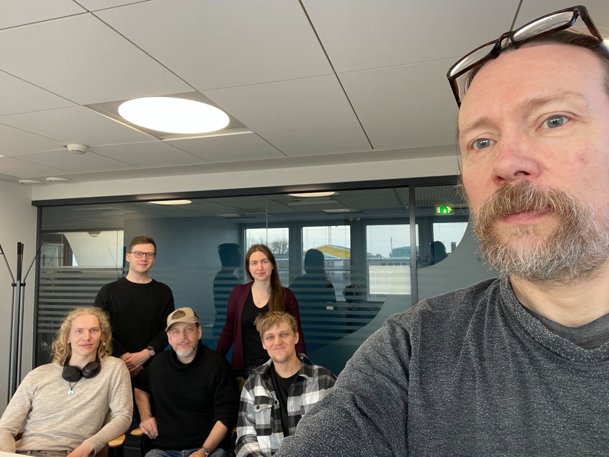{ width=300 }

{ width=300 }

# Ohjelmistotuotanto

# Software production

Translations of # Ohjelmistotuotanto
[ Suomi -> English ]

# Ohjelmistotuotanto
    # Software production, # Software development

                                       ?

                                       ?

# Ohjelmistotuotanto

# Software production

Translations of # Ohjelmistotuotanto
[ Suomi -> English ]

# Ohjelmistotuotanto
    # Software production, # Software development

Johdanto _ohjelmistotuotantoon_ (engl. software engineering), eli systemaattiseen tapaan tehdä hieman laajempia ohjelmistoja useamman hengen tiimissä ulkoiselle asiakkaalle

Introduction to _software engineering_ (eng. software engineering), i.e. the systematic way of making slightly larger software in a team of several people for an external customer

Translations of Johdanto _ohjelmistotuotantoon_ (engl. software engineering), eli systemaattiseen tapaan tehdä hieman laajempia ohjelmistoja useamman hengen tiimissä ulkoiselle asiakkaalle
[ Suomi -> English ]

Johdanto _ohjelmistotuotantoon_ (engl. software engineering), eli systemaattiseen tapaan tehdä hieman laajempia ohjelmistoja useamman hengen tiimissä ulkoiselle asiakkaalle
    Introduction to _software engineering_ (eng. software engineering), i.e. the systematic way of making slightly larger software in a team of several people for an external customer, Introduction to _software engineering_ (eng. software engineering), i.e. the systematic way of making slightly larger software in a team of several people for an external client

. . .

. . .

Erityinen paino ns.  ketterissä (engl. agile) ohjelmistotuotantomenetelmissä

The so-called special weight in agile software production methods

Translations of Erityinen paino ns.  ketterissä (engl. agile) ohjelmistotuotantomenetelmissä
[ Suomi -> English ]

Erityinen paino ns.
    The so-called special weight, Special weight, so-called
ketterissä (engl. agile) ohjelmistotuotantomenetelmissä
    in agile software production methods, in agile software development methods

# Kurssin oppimistavoitteet

# Learning objectives of the course

Translations of # Kurssin oppimistavoitteet
[ Suomi -> English ]

# Kurssin oppimistavoitteet
    # Learning objectives of the course, # Course learning goals

Tiedolliset ja tekniset valmiudet toimia _juniorikehittäjän roolissa_ pienessä ohjelmistotiimissä, esim.  _ohjelmistoprojektissa_ TKT20007

Knowledgeable and technical capabilities to act _in the role of a junior developer_ in a small software team, e.g. in the _software project_ TKT20007

Translations of Tiedolliset ja tekniset valmiudet toimia _juniorikehittäjän roolissa_ pienessä ohjelmistotiimissä, esim.  _ohjelmistoprojektissa_ TKT20007
[ Suomi -> English ]

Tiedolliset ja tekniset valmiudet toimia _juniorikehittäjän roolissa_ pienessä ohjelmistotiimissä, esim.
    Knowledgeable and technical capabilities to act _in the role of a junior developer_ in a small software team, e.g., Informative and technical capabilities to act _in the role of a junior developer_ in a small software team, e.g.
_ohjelmistoprojektissa_ TKT20007
    in the _software project_ TKT20007, in _software project_ TKT20007

. . .

. . .

Suoritettuaan kurssin opiskelija

After completing the course, the student

Translations of Suoritettuaan kurssin opiskelija
[ Suomi -> English ]

Suoritettuaan kurssin opiskelija
    After completing the course, the student, After completing the course, a student

- tuntee ohjelmistoprosessin vaiheet (vaatimusmäärittely, suunnittelu, toteutus ja laadunhallinta)

- knows the phases of the software process (requirement definition, design, implementation and quality management)

Translations of - tuntee ohjelmistoprosessin vaiheet (vaatimusmäärittely, suunnittelu, toteutus ja laadunhallinta)
[ Suomi -> English ]

- tuntee ohjelmistoprosessin vaiheet (vaatimusmäärittely, suunnittelu, toteutus ja laadunhallinta)
    - knows the phases of the software process (requirement definition, design, implementation and quality management), - knows the stages of the software process (requirement definition, planning, implementation and quality management)

. . .

. . .

- tietää miten vaatimuksia hallitaan ketterässä ohjelmistotuotantoprosessissa

- know how requirements are managed in an agile software production process

Translations of - tietää miten vaatimuksia hallitaan ketterässä ohjelmistotuotantoprosessissa
[ Suomi -> English ]

- tietää miten vaatimuksia hallitaan ketterässä ohjelmistotuotantoprosessissa
    - know how requirements are managed in an agile software production process, - knows how to manage requirements in an agile software production process

. . .

. . .

- ymmärtää suunnittelun, toteutuksen ja testauksen vastuut ja luonteen ketterässä ohjelmistotuotannossa

- understand the responsibilities and nature of planning, implementation and testing in agile software production

Translations of - ymmärtää suunnittelun, toteutuksen ja testauksen vastuut ja luonteen ketterässä ohjelmistotuotannossa
[ Suomi -> English ]

- ymmärtää suunnittelun, toteutuksen ja testauksen vastuut ja luonteen ketterässä ohjelmistotuotannossa
    - understand the responsibilities and nature of planning, implementation and testing in agile software production, - understands the responsibilities and nature of design, implementation and testing in agile software production

. . .

. . .

- ymmärtää laadunhallinnan perusteet

- understand the basics of quality management

Translations of - ymmärtää laadunhallinnan perusteet
[ Suomi -> English ]

- ymmärtää laadunhallinnan perusteet
    - understand the basics of quality management, - understand the fundamentals of quality control

. . .

. . .

- osaa toimia ympäristössä, jossa ohjelmistokehitys tapahtuu hallitusti ja toistettavalla tavalla

- knows how to work in an environment where software development takes place in a controlled and repeatable manner

Translations of - osaa toimia ympäristössä, jossa ohjelmistokehitys tapahtuu hallitusti ja toistettavalla tavalla
[ Suomi -> English ]

- osaa toimia ympäristössä, jossa ohjelmistokehitys tapahtuu hallitusti ja toistettavalla tavalla
    - knows how to work in an environment where software development takes place in a controlled and repeatable manner, - can work in an environment where software development takes place in a controlled and repeatable manner

# Esitietovaatimukset

# Prerequisites

Translations of # Esitietovaatimukset
[ Suomi -> English ]

# Esitietovaatimukset
    # Prerequisites, # Pre-knowledge requirements

- Tietokannat ja Internet tai vastaavat tiedot

- Databases and Internet or similar information

Translations of - Tietokannat ja Internet tai vastaavat tiedot
[ Suomi -> English ]

- Tietokannat ja Internet tai vastaavat tiedot
    - Databases and Internet or similar information, - Databases and the Internet or similar data

. . .

. . .

- Vanhalta nimeltään _ Aineopintojen harjoitustyö: tietokantasovellus _

- Formerly called _ Coursework exercise: database application _

Translations of - Vanhalta nimeltään _ Aineopintojen harjoitustyö: tietokantasovellus _
[ Suomi -> English ]

- Vanhalta nimeltään _ Aineopintojen harjoitustyö: tietokantasovellus _
    - Formerly called _ Coursework exercise: database application _, - Formerly called _ Exercise work for subject studies: database application _

. . .

. . .

- ja näiden esitiedot: Ohpe, Ohja, Tikape

- and prerequisites for these: Ohpe, Ohja, Tikape

Translations of - ja näiden esitiedot: Ohpe, Ohja, Tikape
[ Suomi -> English ]

- ja näiden esitiedot: Ohpe, Ohja, Tikape
    - and prerequisites for these: Ohpe, Ohja, Tikape, - and the preliminary information of these: Ohpe, Ohja, Tikape

- hyötyä jos Ohte ja Lapio

- useful if Ohte and Spade

Translations of - hyötyä jos Ohte ja Lapio
[ Suomi -> English ]

- hyötyä jos Ohte ja Lapio
    - useful if Ohte and Spade, - beneficial if Ohte and Spade

# Kurssin rakenne

# Structure of the course

Translations of # Kurssin rakenne
[ Suomi -> English ]

# Kurssin rakenne
    # Structure of the course, # Course structure

- Luennot

- Lectures

Definitions of - Luennot
[ Suomi -> English ]

noun
    lecture
        luento, esitelmä, saarna, nuhdesaarna, läksytys

- Luennot
    - Lectures, - The lectures

- ma ja ti 12-14, paitsi

- Mon and Tue 12-2pm, except

Translations of - ma ja ti 12-14, paitsi
[ Suomi -> English ]

- ma ja ti 12-14, paitsi
    - Mon and Tue 12-2pm, except, - Mon and Tue 12-14, except

- viikko 1: ei luentoa

- week 1: no lecture

Translations of - viikko 1: ei luentoa
[ Suomi -> English ]

- viikko 1: ei luentoa
    - week 1: no lecture, - week 1: no class

- viikko 2: ti 12, to 12, pe 12

- week 2: Tue 12, Thu 12, Fri 12

Translations of - viikko 2: ti 12, to 12, pe 12
[ Suomi -> English ]

- viikko 2: ti 12, to 12, pe 12
    - week 2: Tue 12, Thu 12, Fri 12, - week 2: Tues 12, Thurs 12, Fri 12

- Ohjelmistotuotantoon liittyvää käsitteistöä ja teoriaa

- Conceptualization and theory related to software production

Translations of - Ohjelmistotuotantoon liittyvää käsitteistöä ja teoriaa
[ Suomi -> English ]

- Ohjelmistotuotantoon liittyvää käsitteistöä ja teoriaa
    - Conceptualization and theory related to software production, - Software production-related concepts and theory

- Vierailuluennot (2 viimeistä viikkoa)

- Visiting lectures (last 2 weeks)

Translations of - Vierailuluennot (2 viimeistä viikkoa)
[ Suomi -> English ]

- Vierailuluennot (2 viimeistä viikkoa)
    - Visiting lectures (last 2 weeks), - Guest lectures (2 last weeks)

. . .

. . .

- Laskarit

- Calculators

Translations of - Laskarit
[ Suomi -> English ]

- Laskarit
    - Calculators, - The calculators

- teoriaa kertaavat _ monivalintatehtävät _, deadline su 23.59

- theory review _ multiple choice tasks _, deadline Sun 23.59

Translations of - teoriaa kertaavat _ monivalintatehtävät _, deadline su 23.59
[ Suomi -> English ]

- teoriaa kertaavat _ monivalintatehtävät _, deadline su 23.59
    - theory review _ multiple choice tasks _, deadline Sun 23.59, - theory review _ multiple-choice assignments _, deadline Sun 23.59

- viikon 1 deadline poikkeaa

- week 1 deadline differs

Translations of - viikon 1 deadline poikkeaa
[ Suomi -> English ]

- viikon 1 deadline poikkeaa
    - week 1 deadline differs, - the deadline of week 1 differs

- versionhallintaa, testaamista ja ohjelmistojen konfigurointia käsittelevät, deadline _maanantaina klo 23:59_

- dealing with version control, testing and software configuration, deadline _Monday at 23:59_

Translations of - versionhallintaa, testaamista ja ohjelmistojen konfigurointia käsittelevät, deadline _maanantaina klo 23:59_
[ Suomi -> English ]

- versionhallintaa, testaamista ja ohjelmistojen konfigurointia käsittelevät, deadline _maanantaina klo 23:59_
    - dealing with version control, testing and software configuration, deadline _Monday at 23:59_, - those dealing with version control, testing and software configuration, deadline _Monday at 11:59 p.m._

. . .

. . .

- oletettu kuormittavuus on noin 8 tuntia ensimmäisen kahden viikon aikana, viikolla 3 noin 6 tuntia  ja 4 tuntia sen jälkeen

- the expected workload is about 8 hours during the first two weeks, about 6 hours in week 3 and 4 hours after that

Translations of - oletettu kuormittavuus on noin 8 tuntia ensimmäisen kahden viikon aikana, viikolla 3 noin 6 tuntia  ja 4 tuntia sen jälkeen
[ Suomi -> English ]

- oletettu kuormittavuus on noin 8 tuntia ensimmäisen kahden viikon aikana, viikolla 3 noin 6 tuntia  ja 4 tuntia sen jälkeen
    - the expected workload is about 8 hours during the first two weeks, about 6 hours in week 3 and 4 hours after that, - the assumed load capacity is about 8 hours during the first two weeks, about 6 hours in week 3 and 4 hours after that

- monivalintoihin vastaaminen nopeaa, jos...

- answering multiple choices quickly, if...

Translations of - monivalintoihin vastaaminen nopeaa, jos...
[ Suomi -> English ]

- monivalintoihin vastaaminen nopeaa, jos...
    - answering multiple choices quickly, if..., - answering multiple choice questions quickly if...

. . .

. . .

- Miniprojekti

- Mini projects

Translations of - Miniprojekti
[ Lëtzebuergesch -> English ]

- Miniprojekti
    - Mini projects, - mini-projects

- alkaa kurssin 3. viikolla

- starts in the 3rd week of the course

Translations of - alkaa kurssin 3. viikolla
[ Suomi -> English ]

- alkaa kurssin 3. viikolla
    - starts in the 3rd week of the course, - begins in the 3rd week of the course

- yhdistää teorian ja käytännön

- combines theory and practice

Translations of - yhdistää teorian ja käytännön
[ Suomi -> English ]

- yhdistää teorian ja käytännön
    - combines theory and practice, - connects theory and practice

# Miniprojekti

# Mini projects

Translations of # Miniprojekti
[ Lëtzebuergesch -> English ]

# Miniprojekti
    # Mini projects, # Miniprojects

- kurssin viikoilla 3-7

- during course weeks 3-7

Translations of - kurssin viikoilla 3-7
[ Suomi -> English ]

- kurssin viikoilla 3-7
    - during course weeks 3-7, - in weeks 3-7 of the course

- ryhmätyö: koodataan hiukan, harjotellaan projektinhallintaa sekä eräitä laadunhallintatekniikoita

- group work: we code a little, practice project management and some quality management techniques

Translations of - ryhmätyö: koodataan hiukan, harjotellaan projektinhallintaa sekä eräitä laadunhallintatekniikoita
[ Suomi -> English ]

- ryhmätyö: koodataan hiukan, harjotellaan projektinhallintaa sekä eräitä laadunhallintatekniikoita
    - group work: we code a little, practice project management and some quality management techniques, - teamwork: coding a little, practicing project management and some quality management techniques

. . .

. . .

- ryhmässä 4-6 opiskelijaa, ryhmillä on myös asiakas, jota tavataan viikoittain

- 4-6 students in a group, the groups also have a client who meets weekly

Translations of - ryhmässä 4-6 opiskelijaa, ryhmillä on myös asiakas, jota tavataan viikoittain
[ Suomi -> English ]

- ryhmässä 4-6 opiskelijaa, ryhmillä on myös asiakas, jota tavataan viikoittain
    - 4-6 students in a group, the groups also have a client who meets weekly, - 4-6 students in a group, the groups also have a client, who is met weekly

- ensimmäisellä viikolla asiakastapaamiseen tulee varata 90 minuuttia, jälkimmäisillä 30 minuuttia

- in the first week, 90 minutes should be reserved for the customer meeting, in the latter 30 minutes

Translations of - ensimmäisellä viikolla asiakastapaamiseen tulee varata 90 minuuttia, jälkimmäisillä 30 minuuttia
[ Suomi -> English ]

- ensimmäisellä viikolla asiakastapaamiseen tulee varata 90 minuuttia, jälkimmäisillä 30 minuuttia
    - in the first week, 90 minutes should be reserved for the customer meeting, in the latter 30 minutes, - in the first week, you should reserve 90 minutes for the customer meeting, 30 minutes in the latter

- kurssin lopussa on miniprojektien yhteinen 2h kestoinen demotilaisuus

- at the end of the course there is a joint 2-hour demo session of the mini-projects

Translations of - kurssin lopussa on miniprojektien yhteinen 2h kestoinen demotilaisuus
[ Suomi -> English ]

- kurssin lopussa on miniprojektien yhteinen 2h kestoinen demotilaisuus
    - at the end of the course there is a joint 2-hour demo session of the mini-projects, - at the end of the course, there is a joint 2-hour demo event for the mini-projects

. . .

. . .

- miniprojekteissa työskentelyyn tulee varata aikaa noin 6 tuntia viikossa

- about 6 hours a week should be reserved for working on mini-projects

Translations of - miniprojekteissa työskentelyyn tulee varata aikaa noin 6 tuntia viikossa
[ Suomi -> English ]

- miniprojekteissa työskentelyyn tulee varata aikaa noin 6 tuntia viikossa
    - about 6 hours a week should be reserved for working on mini-projects, - about 6 hours per week should be reserved for working on mini projects

_Kurssin läpäisyn edellytyksenä_ on hyväksytysti suoritettu tai hyväksiluettu miniprojekti

_A prerequisite for passing the course_ is a mini-project that has been successfully completed or approved

Translations of _Kurssin läpäisyn edellytyksenä_ on hyväksytysti suoritettu tai hyväksiluettu miniprojekti
[ Suomi -> English ]

_Kurssin läpäisyn edellytyksenä_ on hyväksytysti suoritettu tai hyväksiluettu miniprojekti
    _A prerequisite for passing the course_ is a mini-project that has been successfully completed or approved, _A prerequisite for passing the course_ is a mini-project that has been successfully completed or read with credit

# Miniprojektin hyväksilukeminen

# Validating the mini-project

Translations of # Miniprojektin hyväksilukeminen
[ Suomi -> English ]

# Miniprojektin hyväksilukeminen
    # Validating the mini-project, # Testing the mini-project

Vähintään kolmen kuukauden työkokemus tiimityönä tehtävästä ohjelmistokehityksestä

At least three months of work experience in team-based software development

Translations of Vähintään kolmen kuukauden työkokemus tiimityönä tehtävästä ohjelmistokehityksestä
[ Suomi -> English ]

Vähintään kolmen kuukauden työkokemus tiimityönä tehtävästä ohjelmistokehityksestä
    At least three months of work experience in team-based software development, At least three months' work experience in software development performed as a team

Lähetä emailia sen jälkeen kun olet palauttanut viikon 1 tehtävät

Send an email after you have returned the assignments from week 1

Translations of Lähetä emailia sen jälkeen kun olet palauttanut viikon 1 tehtävät
[ Suomi -> English ]

Lähetä emailia sen jälkeen kun olet palauttanut viikon 1 tehtävät
    Send an email after you have returned the assignments from week 1, Send an email after you have returned the tasks of week 1

# Kurssin arvostelu

# Course review

Translations of # Kurssin arvostelu
[ Suomi -> English ]

# Kurssin arvostelu
    # Course review, # Review of the course

Jaossa yhteensä 40 pistettä

A total of 40 points in the division

Translations of Jaossa yhteensä 40 pistettä
[ Suomi -> English ]

Jaossa yhteensä 40 pistettä
    A total of 40 points in the division, A total of 40 points are awarded

- laskarit 10 pistettä

- calculators 10 points

Translations of - laskarit 10 pistettä
[ Suomi -> English ]

- laskarit 10 pistettä
    - calculators 10 points, - counters 10 points

- monivalintatehtävät 2 pistettä

- multiple choice tasks 2 points

Translations of - monivalintatehtävät 2 pistettä
[ Suomi -> English ]

- monivalintatehtävät 2 pistettä
    - multiple choice tasks 2 points, - multiple choice exercises 2 points

- viikoittaiset ohjelmointi/versionhallinta/konfigurointitehtävät 8 pistettä

- weekly programming/version control/configuration tasks 8 points

Translations of - viikoittaiset ohjelmointi/versionhallinta/konfigurointitehtävät 8 pistettä
[ Suomi -> English ]

- viikoittaiset ohjelmointi/versionhallinta/konfigurointitehtävät 8 pistettä
    - weekly programming/version control/configuration tasks 8 points, - weekly programming/version management/configuration assignments 8 points

- miniprojekti 11 pistettä

- mini project 11 points

Translations of - miniprojekti 11 pistettä
[ Suomi -> English ]

- miniprojekti 11 pistettä
    - mini project 11 points, - a mini-project 11 points

- koe 18 pistettä

- experience 18 points

Translations of - koe 18 pistettä
[ Suomi -> English ]

- koe 18 pistettä
    - experience 18 points, - try 18 points

- osallistuminen vierailuluennoille 1 piste (0.33 pistettä per luentokerta)

- participation in visiting lectures 1 point (0.33 points per lecture session)

Translations of - osallistuminen vierailuluennoille 1 piste (0.33 pistettä per luentokerta)
[ Suomi -> English ]

- osallistuminen vierailuluennoille 1 piste (0.33 pistettä per luentokerta)
    - participation in visiting lectures 1 point (0.33 points per lecture session), - participation in guest lectures 1 point (0.33 points per lecture)

Arvosanaan 1 riittää 20 pistettä, arvosanaan 5 tarvitaan 36 pistettä.

20 points are enough for a grade of 1, 36 points are needed for a grade of 5.

Translations of Arvosanaan 1 riittää 20 pistettä, arvosanaan 5 tarvitaan 36 pistettä.
[ Suomi -> English ]

Arvosanaan 1 riittää 20 pistettä, arvosanaan 5 tarvitaan 36 pistettä.
    20 points are enough for a grade of 1, 36 points are needed for a grade of 5., 20 points are enough for grade 1, 36 points are required for grade 5.

Läpipääsy edellyttää lisäksi miniprojektin hyväksyttyä suoritusta (tai hyväksilukua) ja vähintään puolia kokeen pisteistä

Passing also requires an approved completion of the mini-project (or a passing grade) and at least half of the exam points

Translations of Läpipääsy edellyttää lisäksi miniprojektin hyväksyttyä suoritusta (tai hyväksilukua) ja vähintään puolia kokeen pisteistä
[ Suomi -> English ]

Läpipääsy edellyttää lisäksi miniprojektin hyväksyttyä suoritusta (tai hyväksilukua) ja vähintään puolia kokeen pisteistä
    Passing also requires an approved completion of the mini-project (or a passing grade) and at least half of the exam points, Passing also requires an approved completion of the mini-project (or passing the exam) and at least half of the exam points

# Luennot - laskarit - miniprojekti

# Lectures - calculators - mini project

Translations of # Luennot - laskarit - miniprojekti
[ Suomi -> English ]

# Luennot - laskarit - miniprojekti
    # Lectures - calculators - mini project, # Lectures - calculators - mini-project

**Luennoilla** ohjelmistokehityksen teoriaa ja käsitteistöä

**Lectures** software development theory and concepts

Translations of **Luennoilla** ohjelmistokehityksen teoriaa ja käsitteistöä
[ Suomi -> English ]

**Luennoilla** ohjelmistokehityksen teoriaa ja käsitteistöä
    **Lectures** software development theory and concepts, **Lectures** software development theory and conceptualization

- laskarien _monivalintatehtävät_ liittyvät kunkin viikon luentoihin

- the calculators' _multiple choice tasks_ are related to each week's lectures

Translations of - laskarien _monivalintatehtävät_ liittyvät kunkin viikon luentoihin
[ Suomi -> English ]

- laskarien _monivalintatehtävät_ liittyvät kunkin viikon luentoihin
    - the calculators' _multiple choice tasks_ are related to each week's lectures, - the _multiple-choice assignments_ of the calculators are related to the lectures of each week

. . .

. . .

Versionhallintaa, konfigurointia, testausta ja ohjelmointia käsittelevien **teknisempien laskarien** aihepiirejä ei paljoa käsitellä luennoilla

The topics of **more technical calculators** dealing with version control, configuration, testing and programming are not covered much in the lectures

Translations of Versionhallintaa, konfigurointia, testausta ja ohjelmointia käsittelevien **teknisempien laskarien** aihepiirejä ei paljoa käsitellä luennoilla
[ Suomi -> English ]

Versionhallintaa, konfigurointia, testausta ja ohjelmointia käsittelevien **teknisempien laskarien** aihepiirejä ei paljoa käsitellä luennoilla
    The topics of **more technical calculators** dealing with version control, configuration, testing and programming are not covered much in the lectures, The topics of **more technical calculators** dealing with version management, configuration, testing and programming are not covered much in lectures

. . .

. . .

**Miniprojekti** yhdistää luentojen teoria ja laskareissa käsitellyt teknisemmät asiat, ja soveltaa niitä käytännössä

**Mini project** combines the theory of the lectures and the more technical issues discussed in the calculators, and applies them in practice

Translations of **Miniprojekti** yhdistää luentojen teoria ja laskareissa käsitellyt teknisemmät asiat, ja soveltaa niitä käytännössä
[ Suomi -> English ]

**Miniprojekti** yhdistää luentojen teoria ja laskareissa käsitellyt teknisemmät asiat, ja soveltaa niitä käytännössä
    **Mini project** combines the theory of the lectures and the more technical issues discussed in the calculators, and applies them in practice, **Mini-project** combines the theory of the lectures and the more technical issues covered in the calculators, and applies them in practice

. . .

. . .

**Kokeessa** suurin painoarvo teoriassa ja sen soveltamisessa käytäntöön

**In the exam**, the greatest weight is on theory and its application in practice

Translations of **Kokeessa** suurin painoarvo teoriassa ja sen soveltamisessa käytäntöön
[ Suomi -> English ]

**Kokeessa** suurin painoarvo teoriassa ja sen soveltamisessa käytäntöön
    **In the exam**, the greatest weight is on theory and its application in practice, In the **examination**, the greatest emphasis is placed on theory and its application in practice

- laskareiden teknisimpiä asioita ei kokeessa tulla kysymään

- the most technical things about calculators will not be asked in the exam

Translations of - laskareiden teknisimpiä asioita ei kokeessa tulla kysymään
[ Suomi -> English ]

- laskareiden teknisimpiä asioita ei kokeessa tulla kysymään
    - the most technical things about calculators will not be asked in the exam, - the most technical aspects of calculators will not be asked in the exam

- tarkemmin kokeesta kurssin viimeisellä luennolla

- more details about the exam in the last lecture of the course

Translations of - tarkemmin kokeesta kurssin viimeisellä luennolla
[ Suomi -> English ]

- tarkemmin kokeesta kurssin viimeisellä luennolla
    - more details about the exam in the last lecture of the course, - in more detail about the test in the last lecture of the course

# Versionhallinta 1 op

# Versionhallinta 1 op

Saat suoritusmerkinnän tekemällä kaikki kurssin versiohallintatehtävät ja suorittamalla hyväksytysti miniprojektin

You will receive a performance mark by completing all course version control tasks and successfully completing the mini-project

Translations of Saat suoritusmerkinnän tekemällä kaikki kurssin versiohallintatehtävät ja suorittamalla hyväksytysti miniprojektin
[ Suomi -> English ]

Saat suoritusmerkinnän tekemällä kaikki kurssin versiohallintatehtävät ja suorittamalla hyväksytysti miniprojektin
    You will receive a performance mark by completing all course version control tasks and successfully completing the mini-project, You will receive a mark of completion by completing all version control tasks in the course and successfully completing the mini-project

# Kurssimateriaali

# Course material

Translations of # Kurssimateriaali
[ Suomi -> English ]

# Kurssimateriaali
    # Course material, # Course materials

https://translate.google.com/translate?hl=en&sl=auto&tl=en&u=https://ohjelmistotuotanto-hy.github.io/

# Kurssipalaute

# Course feedback

Translations of # Kurssipalaute
[ Suomi -> English ]

# Kurssipalaute
    # Course feedback, # Lesson feedback

. . .

. . .

- Kurssipalaute

- Course feedback

Translations of - Kurssipalaute
[ Suomi -> English ]

- Kurssipalaute
    - Course feedback, - Lesson feedback

- Kurssilla lopussa kerättävän palautteen lisäksi ns.  jatkuva palaute https://norppa.helsinki.fi

- In addition to the feedback collected at the end of the course, the so-called continuous feedback https://norppa.helsinki.fi

Translations of - Kurssilla lopussa kerättävän palautteen lisäksi ns.  jatkuva palaute https://norppa.helsinki.fi
[ Suomi -> English ]

- Kurssilla lopussa kerättävän palautteen lisäksi ns.
    - In addition to the feedback collected at the end of the course, the so-called, - In addition to the feedback gathered at the end of the course, so-called
jatkuva palaute https://norppa.helsinki.fi
    continuous feedback https://norppa.helsinki.fi, ongoing feedback https://norppa.helsinki.fi

. . .

. . .

- Kurssipalaute **vaikuttaa**

- Course feedback **has an effect**

Translations of - Kurssipalaute **vaikuttaa**
[ Suomi -> English ]

- Kurssipalaute **vaikuttaa**
    - Course feedback **has an effect**, - Course feedback **affects**

- Edellisen kurssin palautteen "moitteita"

- "reprimands" from the previous course's feedback

Translations of - Edellisen kurssin palautteen "moitteita"
[ Suomi -> English ]

- Edellisen kurssin palautteen "moitteita"
    - "reprimands" from the previous course's feedback, - "Criticisms" from the previous course feedback

- Miniprojekti

- Mini projects

Translations of - Miniprojekti
[ Lëtzebuergesch -> English ]

- Miniprojekti
    - Mini projects, - mini-projects

- tekniset haasteet: boilerplate

- technical challenges: boilerplate

Translations of - tekniset haasteet: boilerplate
[ Suomi -> English ]

- tekniset haasteet: boilerplate
    - technical challenges: boilerplate, - tech challenges: boilerplate

- ryhmätyöskentely: ohjeita

- teamwork: instructions

Translations of - ryhmätyöskentely: ohjeita
[ Suomi -> English ]

- ryhmätyöskentely: ohjeita
    - teamwork: instructions, - group work: guidelines

- Kokeen painoarvo ja ylipäätään merkitys

- The importance of the exam and its importance in general

Translations of - Kokeen painoarvo ja ylipäätään merkitys
[ Suomi -> English ]

- Kokeen painoarvo ja ylipäätään merkitys
    - The importance of the exam and its importance in general, - The importance of the exam and overall importance

- Materiaalin navigoitavuus

- Navigability of the material

Translations of - Materiaalin navigoitavuus
[ Suomi -> English ]

- Materiaalin navigoitavuus
    - Navigability of the material, - Material navigability

. . .

. . .

- Monivalintoihin kohdistunut kritiikki vähentynyt

- Criticism of multiple choices decreased

Translations of - Monivalintoihin kohdistunut kritiikki vähentynyt
[ Suomi -> English ]

- Monivalintoihin kohdistunut kritiikki vähentynyt
    - Criticism of multiple choices decreased, - Criticism directed at multiple choices has decreased

- haastavampia väittämiä paranneltu/poistettu

- more challenging statements improved/removed

Translations of - haastavampia väittämiä paranneltu/poistettu
[ Suomi -> English ]

- haastavampia väittämiä paranneltu/poistettu
    - more challenging statements improved/removed, - improved/removed more challenging statements

# Monivalintojen korvaaminen luentopäiväkirjalla

# Replacing multiple choices with a lecture diary

Translations of # Monivalintojen korvaaminen luentopäiväkirjalla
[ Suomi -> English ]

# Monivalintojen korvaaminen luentopäiväkirjalla
    # Replacing multiple choices with a lecture diary, # Replacement of multiple choices with a lecture diary

. . .

. . .

- Kurssin viikoilla 1-5 viikon luentoja kertaavat monivalinnat (2/40 kurssin pisteistä)

- During the weeks of the course, multiple choices repeat the lectures of weeks 1-5 (2/40 of the course points)

Translations of - Kurssin viikoilla 1-5 viikon luentoja kertaavat monivalinnat (2/40 kurssin pisteistä)
[ Suomi -> English ]

- Kurssin viikoilla 1-5 viikon luentoja kertaavat monivalinnat (2/40 kurssin pisteistä)
    - During the weeks of the course, multiple choices repeat the lectures of weeks 1-5 (2/40 of the course points), - During the weeks of the course, multiple choices repeat the lectures of weeks 1-5 (2/40 of the course's points)

. . .

. . .

- Monivalinnat herättäneet tunteita, en ole itsekään niiden fani

- Multiple choices aroused emotions, I'm not a fan of them myself

Translations of - Monivalinnat herättäneet tunteita, en ole itsekään niiden fani
[ Suomi -> English ]

- Monivalinnat herättäneet tunteita, en ole itsekään niiden fani
    - Multiple choices aroused emotions, I'm not a fan of them myself, - The multiple choices aroused emotions, I'm not a fan of them myself

- Hyödyt ovat kiistattomat, kokeet menevät nykyään paremmin kuin monivalintoja edeltävänä aikana

- The benefits are indisputable, exams go better today than in the time before multiple choice

Translations of - Hyödyt ovat kiistattomat, kokeet menevät nykyään paremmin kuin monivalintoja edeltävänä aikana
[ Suomi -> English ]

- Hyödyt ovat kiistattomat, kokeet menevät nykyään paremmin kuin monivalintoja edeltävänä aikana
    - The benefits are indisputable, exams go better today than in the time before multiple choice, - The benefits are indisputable, the exams are going better today than in the time before multiple choice

. . .

. . .

- Tarjolla vaihtoehto: **viikoittainen luentopäiväkirja**

- Option available: **weekly lecture diary**

Translations of - Tarjolla vaihtoehto: **viikoittainen luentopäiväkirja**
[ Suomi -> English ]

- Tarjolla vaihtoehto: **viikoittainen luentopäiväkirja**
    - Option available: **weekly lecture diary**, - Available option: **weekly lecture diary**

- Noin A4:n kokoinen omin sanoin tehty yhteenveto viikon luentojen asioista

- A summary of the week's lectures in my own words, about A4 size

Translations of - Noin A4:n kokoinen omin sanoin tehty yhteenveto viikon luentojen asioista
[ Suomi -> English ]

- Noin A4:n kokoinen omin sanoin tehty yhteenveto viikon luentojen asioista
    - A summary of the week's lectures in my own words, about A4 size, - A summary of the topics of the week's lectures, made in my own words, about the size of A4

- voi olla tehty käsin, joko tekstiä, lista ranskalaisia viivoja tai esim.  mind map

- can be made by hand, either text, a list of French lines or e.g. mind map

Translations of - voi olla tehty käsin, joko tekstiä, lista ranskalaisia viivoja tai esim.  mind map
[ Suomi -> English ]

- voi olla tehty käsin, joko tekstiä, lista ranskalaisia viivoja tai esim.
    - can be made by hand, either text, a list of French lines or e.g., - can be made by hand, either a text, a list of French lines or, for example,
mind map
    mind map, mindmap

- ei kuitenkaan missään tapauksessa plagiaatti tai ChatGPT:llä generoitu (opintovilppi: käsitellään HY:n prosessin mukaan)

- however, in no case plagiarism or generated with ChatGPT (study fraud: handled according to HY's process)

Translations of - ei kuitenkaan missään tapauksessa plagiaatti tai ChatGPT:llä generoitu (opintovilppi: käsitellään HY:n prosessin mukaan)
[ Suomi -> English ]

- ei kuitenkaan missään tapauksessa plagiaatti tai ChatGPT:llä generoitu (opintovilppi: käsitellään HY:n prosessin mukaan)
    - however, in no case plagiarism or generated with ChatGPT (study fraud: handled according to HY's process), - however, in no case is it plagiarized or generated with ChatGPT (study fraud: handled according to the HY process)

. . .

. . .

- Deadline kunkin viikon sunnuntai klo 23:59, lähetetään emailitse matti.luukkainen@helsinki.fi (poikkeus vko 1 jonka deadline samaan aikaan kuin vko 2)

- Deadline Sunday of each week at 23:59, sent by email matti.luukkainen@helsinki.fi (exception week 1 whose deadline is the same as week 2)

Translations of - Deadline kunkin viikon sunnuntai klo 23:59, lähetetään emailitse matti.luukkainen@helsinki.fi (poikkeus vko 1 jonka deadline samaan aikaan kuin vko 2)
[ Suomi -> English ]

- Deadline kunkin viikon sunnuntai klo 23:59, lähetetään emailitse matti.luukkainen@helsinki.fi (poikkeus vko 1 jonka deadline samaan aikaan kuin vko 2)
    - Deadline Sunday of each week at 23:59, sent by email matti.luukkainen@helsinki.fi (exception week 1 whose deadline is the same as week 2), - Deadline Sunday of each week at 23:59, sent by email matti.luukkainen@helsinki.fi (exception for week 1 whose deadline is the same as week 2)

- Arvostelu, ks kurssimateriaalin osa 0

- Evaluation, see part 0 of the course material

Translations of - Arvostelu, ks kurssimateriaalin osa 0
[ Suomi -> English ]

- Arvostelu, ks kurssimateriaalin osa 0
    - Evaluation, see part 0 of the course material, - Assessment, see part 0 of the course material

# Ohjelmistotuotanto engl.  software engineering

# Software production in English software engineering

Translations of # Ohjelmistotuotanto engl.  software engineering
[ Suomi -> English ]

# Ohjelmistotuotanto engl.
    # Software production in English, # Software production engl.
software engineering
    software engineering, software engineer

. . .

. . .

The IEEE Computer Society defines software engineering as:

The IEEE Computer Society defines software engineering as:

- _The application of a systematic, disciplined, quantifiable approach to the development, operation, and maintenance of software; that is, the application of engineering to software_

- _The application of a systematic, disciplined, quantifiable approach to the development, operation, and maintenance of software; that is, the application of engineering to software_

# Ohjelmistotuotanto engl.  software engineering

# Software production in English software engineering

Translations of # Ohjelmistotuotanto engl.  software engineering
[ Suomi -> English ]

# Ohjelmistotuotanto engl.
    # Software production in English, # Software production engl.
software engineering
    software engineering, software engineer

The IEEE Computer Society defines software engineering as:

The IEEE Computer Society defines software engineering as:

- _Systemaattisen, kurinalaisen ja mitattavissa olevan lähestymistavan soveltaminen ohjelmistojen kehittämiseen, käyttöön ja ylläpitoon, eli "insinöörityön" soveltaminen ohjelmistoihin_

- _Applying a systematic, disciplined and measurable approach to software development, use and maintenance, i.e. applying "engineering" to software_

Translations of - _Systemaattisen, kurinalaisen ja mitattavissa olevan lähestymistavan soveltaminen ohjelmistojen kehittämiseen, käyttöön ja ylläpitoon, eli "insinöörityön" soveltaminen ohjelmistoihin_
[ Suomi -> English ]

- _Systemaattisen, kurinalaisen ja mitattavissa olevan lähestymistavan soveltaminen ohjelmistojen kehittämiseen, käyttöön ja ylläpitoon, eli "insinöörityön" soveltaminen ohjelmistoihin_
    - _Applying a systematic, disciplined and measurable approach to software development, use and maintenance, i.e. applying "engineering" to software_, - _Applying a systematic, disciplined and measurable approach to the development, use and maintenance of software, i.e. the application of "engineering" to software_

. . .

. . .

Lähde _SWEBOK_ eli _Guide to the Software Engineering Body of Knowledge_

Lähde _SWEBOK_ eli _Guide to the Software Engineering Body of Knowledge_

- ison komitean yritys määritellä mitä ohjelmistotuotannolla tarkoitetaan ja mitä osa-alueita siihen kuuluu

- the big committee's attempt to define what is meant by software production and what areas it includes

Translations of - ison komitean yritys määritellä mitä ohjelmistotuotannolla tarkoitetaan ja mitä osa-alueita siihen kuuluu
[ Suomi -> English ]

- ison komitean yritys määritellä mitä ohjelmistotuotannolla tarkoitetaan ja mitä osa-alueita siihen kuuluu
    - the big committee's attempt to define what is meant by software production and what areas it includes, - the large committee's attempt to define what is meant by software production and which areas it includes

- uusin versio ilmestyi 15.11.2024!

- the latest version appeared on 15.11.2024!

Translations of - uusin versio ilmestyi 15.11.2024!
[ Suomi -> English ]

- uusin versio ilmestyi 15.11.2024!
    - the latest version appeared on 15.11.2024!, - the latest version came out on 15 November 2024!

# Ohjelmistotuotannon osa-alueet SWEBOK:in mukaan

# Areas of software production according to SWEBOK

Translations of # Ohjelmistotuotannon osa-alueet SWEBOK:in mukaan
[ Suomi -> English ]

# Ohjelmistotuotannon osa-alueet SWEBOK:in mukaan
    # Areas of software production according to SWEBOK, # Software production areas according to SWEBOK

- Software requirements eli **vaatimusmäärittely**

- Software requirements, i.e. **requirement definition**

Translations of - Software requirements eli **vaatimusmäärittely**
[ Suomi -> English ]

- Software requirements eli **vaatimusmäärittely**
    - Software requirements, i.e. **requirement definition**, - Software requirements, i.e. **requirement specification**

- Software design eli **suunnittelu**

- Software design or **planning**

Translations of - Software design eli **suunnittelu**
[ Suomi -> English ]

- Software design eli **suunnittelu**
    - Software design or **planning**, - Software design, i.e. **design**

- Software construction eli **toteutus/ohjelmointi**

- Software construction, i.e. **implementation/programming**

Translations of - Software construction eli **toteutus/ohjelmointi**
[ Suomi -> English ]

- Software construction eli **toteutus/ohjelmointi**
    - Software construction, i.e. **implementation/programming**, - Software construction or **implementation/programming**

- Software testing eli **testaus**

- Software testing or **testing**

Translations of - Software testing eli **testaus**
[ Suomi -> English ]

- Software testing eli **testaus**
    - Software testing or **testing**, - Software testing, i.e. **testing**

- Software maintenance eli **ylläpito**

- Software maintenance or **maintenance**

Translations of - Software maintenance eli **ylläpito**
[ Suomi -> English ]

- Software maintenance eli **ylläpito**
    - Software maintenance or **maintenance**, - Software maintenance, i.e. **maintenance**

. . .

. . .

- Software configuration management eli **konfiguraatiot**

- Software configuration management eli **konfiguraatiot**

- Software engineering tools and methods eli **työkalut**

- Software engineering tools and methods, i.e. **tools**

Translations of - Software engineering tools and methods eli **työkalut**
[ Suomi -> English ]

- Software engineering tools and methods eli **työkalut**
    - Software engineering tools and methods, i.e. **tools**, - Software engineering tools and methods or **tools**

- Software quality eli **laadunhallinta**

- Software quality or **quality management**

Translations of - Software quality eli **laadunhallinta**
[ Suomi -> English ]

- Software quality eli **laadunhallinta**
    - Software quality or **quality management**, - Software quality, i.e. **quality management**

- Software engineering process eli **ohjelmistotuotantoprosessi**

- Software engineering process or **software production process**

Translations of - Software engineering process eli **ohjelmistotuotantoprosessi**
[ Suomi -> English ]

- Software engineering process eli **ohjelmistotuotantoprosessi**
    - Software engineering process or **software production process**, - Software engineering process, i.e. **software production process**

- Software engineering management eli **projektien johtaminen**

- Software engineering management, i.e. **project management**

Translations of - Software engineering management eli **projektien johtaminen**
[ Suomi -> English ]

- Software engineering management eli **projektien johtaminen**
    - Software engineering management, i.e. **project management**, - Software engineering management or **project management**

. . .

. . .

- Software architecture eli **arkkitehtuuri**

- Software architecture or **architecture**

Translations of - Software architecture eli **arkkitehtuuri**
[ Suomi -> English ]

- Software architecture eli **arkkitehtuuri**
    - Software architecture or **architecture**, - Software architecture, i.e. **architecture**

- Software engineering operations eli **operointi tuotannossa**

- Software engineering operations, i.e. **operations in production**

Translations of - Software engineering operations eli **operointi tuotannossa**
[ Suomi -> English ]

- Software engineering operations eli **operointi tuotannossa**
    - Software engineering operations, i.e. **operations in production**, - Software engineering operations, or **operations in production**

- Software security eli **tietoturva**

- Software security or **information security**

Translations of - Software security eli **tietoturva**
[ Suomi -> English ]

- Software security eli **tietoturva**
    - Software security or **information security**, - Software security, i.e. **data security**

- Software engineering economics eli **talous**

- Software engineering Economics or **economics**

Translations of - Software engineering economics eli **talous**
[ Suomi -> English ]

- Software engineering economics eli **talous**
    - Software engineering Economics or **economics**, - Software engineering Economics

- Software engineering professional practice eli **ammattietiikka ja ryhmärynamiikka**

- Software engineering professional practice, i.e. **professional ethics and group dynamics**

Translations of - Software engineering professional practice eli **ammattietiikka ja ryhmärynamiikka**
[ Suomi -> English ]

- Software engineering professional practice eli **ammattietiikka ja ryhmärynamiikka**
    - Software engineering professional practice, i.e. **professional ethics and group dynamics**, - Software engineering professional practice, i.e. **professional ethics and team dynamics**

# Ohjelmiston elinkaari (software lifecycle)

# Software lifecycle

Translations of # Ohjelmiston elinkaari (software lifecycle)
[ Suomi -> English ]

# Ohjelmiston elinkaari (software lifecycle)
    # Software lifecycle, # Software life cycle (software lifecycle)

Riippumatta tyylistä ja tavasta, jolla ohjelmisto tehdään, käy ohjelmisto läpi seuraavat _vaiheet_

Regardless of the style and way the software is made, the software goes through the following _stages_

Translations of Riippumatta tyylistä ja tavasta, jolla ohjelmisto tehdään, käy ohjelmisto läpi seuraavat _vaiheet_
[ Suomi -> English ]

Riippumatta tyylistä ja tavasta, jolla ohjelmisto tehdään, käy ohjelmisto läpi seuraavat _vaiheet_
    Regardless of the style and way the software is made, the software goes through the following _stages_, Regardless of the style and manner in which the software is made, the software goes through the following _phases_

- Vaatimusten analysointi ja määrittely

- Analysis and definition of requirements

Translations of - Vaatimusten analysointi ja määrittely
[ Suomi -> English ]

- Vaatimusten analysointi ja määrittely
    - Analysis and definition of requirements, - Requirements analysis and definition

- Suunnittelu

- Planning

Definitions of - Suunnittelu
[ Suomi -> English ]

noun
    design
        design, malli, suunnittelu, muotoilu, kuvio, suunnitelma
    planning
        suunnittelu, kaavoitus
    designing
        suunnittelu, muotoilu, design
    contemplation
        miettiminen, mietiskely, suunnittelu

- Suunnittelu
    - Planning, - The design

- Toteutus

- Implementation

Definitions of - Toteutus
[ Suomi -> English ]

noun
    achievement
        saavutus, saavuttaminen, suoritus, toteutus

- Toteutus
    - Implementation, - Execution

- Testaus

- Testing

Definitions of - Testaus
[ Suomi -> English ]

noun
    testing
        testaus, koestus

- Testaus
    - Testing, - A test

- Ohjelmiston ylläpito ja evoluutio

- Software maintenance and evolution

Translations of - Ohjelmiston ylläpito ja evoluutio
[ Suomi -> English ]

- Ohjelmiston ylläpito ja evoluutio
    - Software maintenance and evolution, - Maintenance and evolution of the software

. . .

. . .

Vaiheista muodostuu ohjelmiston "elinkaari"

The phases make up the "life cycle" of the software

Translations of Vaiheista muodostuu ohjelmiston "elinkaari"
[ Suomi -> English ]

Vaiheista muodostuu ohjelmiston "elinkaari"
    The phases make up the "life cycle" of the software, The stages make up the software's "life cycle"

. . .

. . .

Käytetty **ohjelmistotuotantoprosessi** määrittelee miten vaiheet suhtautuvat toisiinsa

The **software production process** used defines how the phases relate to each other

Translations of Käytetty **ohjelmistotuotantoprosessi** määrittelee miten vaiheet suhtautuvat toisiinsa
[ Suomi -> English ]

Käytetty **ohjelmistotuotantoprosessi** määrittelee miten vaiheet suhtautuvat toisiinsa
    The **software production process** used defines how the phases relate to each other, The used **software production process** defines how the phases relate to each other

. . .

. . .

Eri vaiheiden sisältöön palaamme myöhemmin tarkemmin

We will return to the content of the different stages in more detail later

Translations of Eri vaiheiden sisältöön palaamme myöhemmin tarkemmin
[ Suomi -> English ]

Eri vaiheiden sisältöön palaamme myöhemmin tarkemmin
    We will return to the content of the different stages in more detail later, We will come back to the content of the different phases in more detail later

# Alussa (ja osin edelleen) code'n'fix

# In the beginning (and partly still) code'n'fix

Translations of # Alussa (ja osin edelleen) code'n'fix
[ Suomi -> English ]

# Alussa (ja osin edelleen) code'n'fix
    # In the beginning (and partly still) code'n'fix, # In the beginning (and still in part) code'n'fix

Historian alkuaikoina laitteet maksoivat paljon, ohjelmat olivat laitteistoihin nähden "triviaaleja"

In the early days of history, devices cost a lot, programs were "trivial" compared to the hardware

Translations of Historian alkuaikoina laitteet maksoivat paljon, ohjelmat olivat laitteistoihin nähden "triviaaleja"
[ Suomi -> English ]

Historian alkuaikoina laitteet maksoivat paljon, ohjelmat olivat laitteistoihin nähden "triviaaleja"
    In the early days of history, devices cost a lot, programs were "trivial" compared to the hardware, In the early days of history, the devices cost a lot, the programs were "trivial" compared to the hardware

- ohjelmointi konekielellä

- programming in machine language

Translations of - ohjelmointi konekielellä
[ Suomi -> English ]

- ohjelmointi konekielellä
    - programming in machine language, - machine language programming

- sovelluksen käyttäjä ohjelmoi itse ohjelmansa

(♂) - the user of the application programs his own program
(♀) - the user of the application programs her own program

Translations of - sovelluksen käyttäjä ohjelmoi itse ohjelmansa
[ Suomi -> English ]

- sovelluksen käyttäjä ohjelmoi itse ohjelmansa
    - the user of the application programs his own program, - the application user programs his own program

. . .

. . .

Vähitellen ohjelmistot alkavat kasvaa ja kehitettiin korkeamman tason ohjelmointikieliä (Fortran, Cobol, Algol)

Gradually, software began to grow and higher-level programming languages were developed (Fortran, Cobol, Algol)

Translations of Vähitellen ohjelmistot alkavat kasvaa ja kehitettiin korkeamman tason ohjelmointikieliä (Fortran, Cobol, Algol)
[ Suomi -> English ]

Vähitellen ohjelmistot alkavat kasvaa ja kehitettiin korkeamman tason ohjelmointikieliä (Fortran, Cobol, Algol)
    Gradually, software began to grow and higher-level programming languages were developed (Fortran, Cobol, Algol), Gradually, the software started to grow and higher level programming languages were developed (Fortran, Cobol, Algol)

- sovellusalue laajenee monille elämänaloille

- the application area expands to many areas of life

Translations of - sovellusalue laajenee monille elämänaloille
[ Suomi -> English ]

- sovellusalue laajenee monille elämänaloille
    - the application area expands to many areas of life, - the field of application expands to many areas of life

. . .

. . .

Pikkuhiljaa homma alkaa karata käsistä:

Little by little, things are getting out of hand:

Translations of Pikkuhiljaa homma alkaa karata käsistä:
[ Suomi -> English ]

Pikkuhiljaa homma alkaa karata käsistä:
    Little by little, things are getting out of hand:, Little by little things start to get out of hand:

- budjetit ylittyivät ja projektit myöhästyivät aikatauluista

- budgets were exceeded and projects were behind schedule

Translations of - budjetit ylittyivät ja projektit myöhästyivät aikatauluista
[ Suomi -> English ]

- budjetit ylittyivät ja projektit myöhästyivät aikatauluista
    - budgets were exceeded and projects were behind schedule, - budgets were exceeded and projects were late

- ohjelmistot olivat tehottomia, niiden laatu oli huono ja ne eivät toimineet käyttäjien tarpeiden mukaan

- the software was inefficient, its quality was poor and it did not work according to the users' needs

Translations of - ohjelmistot olivat tehottomia, niiden laatu oli huono ja ne eivät toimineet käyttäjien tarpeiden mukaan
[ Suomi -> English ]

- ohjelmistot olivat tehottomia, niiden laatu oli huono ja ne eivät toimineet käyttäjien tarpeiden mukaan
    - the software was inefficient, its quality was poor and it did not work according to the users' needs, - the software was inefficient, of poor quality and did not work according to the users' needs

- koodin ylläpito ja laajentaminen oli vaikeaa

- maintaining and extending the code was difficult

Translations of - koodin ylläpito ja laajentaminen oli vaikeaa
[ Suomi -> English ]

- koodin ylläpito ja laajentaminen oli vaikeaa
    - maintaining and extending the code was difficult, - code maintenance and expansion was difficult

- usein ohjelmistoja ei hyvistä aikeista huolimatta saatu ollenkaan toimitettua

- often software was not delivered at all despite good intentions

Translations of - usein ohjelmistoja ei hyvistä aikeista huolimatta saatu ollenkaan toimitettua
[ Suomi -> English ]

- usein ohjelmistoja ei hyvistä aikeista huolimatta saatu ollenkaan toimitettua
    - often software was not delivered at all despite good intentions, - often, despite good intentions, the software was not delivered at all

# Ohjelmistokriisi

# Software crisis

Translations of # Ohjelmistokriisi
[ Suomi -> English ]

# Ohjelmistokriisi
    # Software crisis, # The software crisis

Termi Software crisis lanseerataan kesällä 1968

The term Software crisis is launched in the summer of 1968

Translations of Termi Software crisis lanseerataan kesällä 1968
[ Suomi -> English ]

Termi Software crisis lanseerataan kesällä 1968
    The term Software crisis is launched in the summer of 1968, The term software crisis is launched in summer 1968

- In essence, it refers to the difficulty of writing correct, understandable, and verifiable computer programs.

- In essence, it refers to the difficulty of writing correct, understandable, and verifiable computer programs.

. . .

. . .

Edsger Dijkstra:

Edsger Dijkstra:

Translations of Edsger Dijkstra:
[ Nederlands -> English ]

Edsger Dijkstra:
    Edsger Dijkstra:, Edsger Dijkstra :

- **as long as there were no machines, programming was no problem at all**

- **as long as there were no machines, programming was no problem at all**

. . .

. . .

- when we had a few weak computers, programming became a mild problem

- when we had a few weak computers, programming became a mild problem

. . .

. . .

- **now we have gigantic computers, programming has become an equally gigantic problem**.

- **now we have gigantic computers, programming has become an equally gigantic problem**.

# Kriisi ei ole ohi (syksy 2023)

# The crisis is not over (autumn 2023)

Translations of # Kriisi ei ole ohi (syksy 2023)
[ Suomi -> English ]

# Kriisi ei ole ohi (syksy 2023)
    # The crisis is not over (autumn 2023), # The crisis is not over (fall 2023)

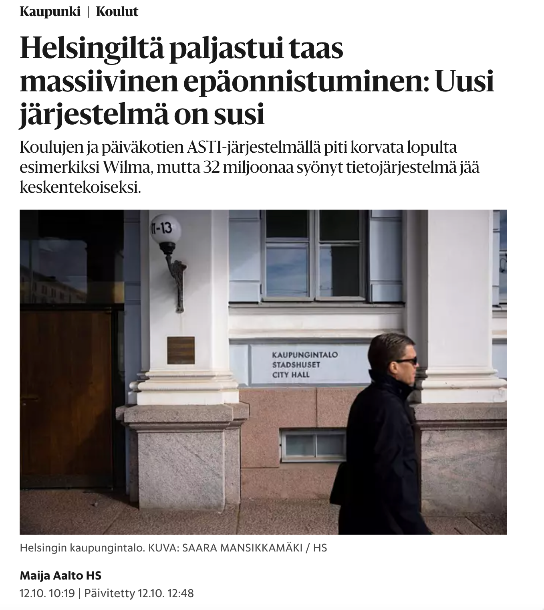{ width=400 }

{ width=400 }

# Software development as Engineering

# Software development as Engineering

. . .

. . .

Termi **software engineering** määritellään ensimmäistä kertaa 1968:

The term **software engineering** is defined for the first time in 1968:

Translations of Termi **software engineering** määritellään ensimmäistä kertaa 1968:
[ Suomi -> English ]

Termi **software engineering** määritellään ensimmäistä kertaa 1968:
    The term **software engineering** is defined for the first time in 1968:, The term **software engineering** was first defined in 1968:

- _The establishment and use of sound engineering principles in order to obtain economically software that is reliable and works efficiently on real machines_

- _The establishment and use of sound engineering principles in order to obtain economically software that is reliable and works efficiently on real machines_

. . .

. . .

Ajatus siitä, että ohjelmistojen tekemisen tulisi olla kuin mikä tahansa muu insinöörityö

The idea that making software should be like any other engineering job

Translations of Ajatus siitä, että ohjelmistojen tekemisen tulisi olla kuin mikä tahansa muu insinöörityö
[ Suomi -> English ]

Ajatus siitä, että ohjelmistojen tekemisen tulisi olla kuin mikä tahansa muu insinöörityö
    The idea that making software should be like any other engineering job, The idea that software development should be like any other engineering job

- ensin rakennettava artefakti _ määritellään _ (requirements)

- the first artifact to be built _ is defined _ (requirements)

Translations of - ensin rakennettava artefakti _ määritellään _ (requirements)
[ Suomi -> English ]

- ensin rakennettava artefakti _ määritellään _ (requirements)
    - the first artifact to be built _ is defined _ (requirements), - the artifact to be built first _ is defined _ (requirements)

- ja _suunnitellan_ (design) aukottomasti

- and I _plan_ (design) endlessly

Translations of - ja _suunnitellan_ (design) aukottomasti
[ Suomi -> English ]

- ja _suunnitellan_ (design) aukottomasti
    - and I _plan_ (design) endlessly, - and I _plan_ (design) without any gaps

- tämän jälkeen _rakentaminen_ (construction) on melko suoraviivainen vaihe

- after this _construction_ (construction) is a fairly straightforward step

Translations of - tämän jälkeen _rakentaminen_ (construction) on melko suoraviivainen vaihe
[ Suomi -> English ]

- tämän jälkeen _rakentaminen_ (construction) on melko suoraviivainen vaihe
    - after this _construction_ (construction) is a fairly straightforward step, - after this, construction is a fairly straightforward step

# Vesiputousmalli

# Waterfall model

Translations of # Vesiputousmalli
[ Suomi -> English ]

# Vesiputousmalli
    # Waterfall model, # Waterfall template

Winston W. Royce: Management of the development of Large Software, 1970

Winston W. Royce: Management of the development of Large Software, 1970

Sivulla 2 Royce esittelee yksinkertaisen prosessimallin, jossa elinkaaren vaiheet suoritetaan lineaarisesti peräkkäin:

On page 2, Royce presents a simple process model in which the stages of the life cycle are performed in a linear sequence:

Translations of Sivulla 2 Royce esittelee yksinkertaisen prosessimallin, jossa elinkaaren vaiheet suoritetaan lineaarisesti peräkkäin:
[ Suomi -> English ]

Sivulla 2 Royce esittelee yksinkertaisen prosessimallin, jossa elinkaaren vaiheet suoritetaan lineaarisesti peräkkäin:
    On page 2, Royce presents a simple process model in which the stages of the life cycle are performed in a linear sequence:, On page 2, Royce presents a simple process model in which life cycle stages are performed in a linear sequence:

{ width=440 }

{ width=440 }

# Vesiputousmalli Roycen artikkelista

# Waterfall model from Royce's article

Translations of # Vesiputousmalli Roycen artikkelista
[ Suomi -> English ]

# Vesiputousmalli Roycen artikkelista
    # Waterfall model from Royce's article, # Waterfall pattern from Royce's article

{ width=440 }

{ width=440 }

# Vesiputousmallin suosion taustaa

# The background to the popularity of the waterfall model

Translations of # Vesiputousmallin suosion taustaa
[ Suomi -> English ]

# Vesiputousmallin suosion taustaa
    # The background to the popularity of the waterfall model, # Background of the popularity of the waterfall model

Vesiputousmalli saavutti nopeasti suosiota

The waterfall model quickly gained popularity

Translations of Vesiputousmalli saavutti nopeasti suosiota
[ Suomi -> English ]

Vesiputousmalli saavutti nopeasti suosiota
    The waterfall model quickly gained popularity, The waterfall model gained popularity quickly

Yhdysvaltain puolustusministerö rupesi vaatimaan kaikilta alihankkijoiltaan vesiputousmallin noudattamista

The US Department of Defense began to require all of its subcontractors to follow the waterfall model

Translations of Yhdysvaltain puolustusministerö rupesi vaatimaan kaikilta alihankkijoiltaan vesiputousmallin noudattamista
[ Suomi -> English ]

Yhdysvaltain puolustusministerö rupesi vaatimaan kaikilta alihankkijoiltaan vesiputousmallin noudattamista
    The US Department of Defense began to require all of its subcontractors to follow the waterfall model, The US Ministry of Defense began to demand that all its subcontractors follow the waterfall model

- Standardi DoD STD 2167

- DoD STD 2167

Translations of - Standardi DoD STD 2167
[ Eesti -> English ]

- Standardi DoD STD 2167
    - DoD STD 2167, - DoD STD 2167 of the standard

. . .

. . .

Muutkin ohjelmistoja tuottaneet tahot ajattelivat, että koska DoD vaatii vesiputousmallia, tapa kannattaa omaksua itselleen

Other parties that produced software also thought that since the DoD requires a waterfall model, the way should be adopted for themselves

Translations of Muutkin ohjelmistoja tuottaneet tahot ajattelivat, että koska DoD vaatii vesiputousmallia, tapa kannattaa omaksua itselleen
[ Suomi -> English ]

Muutkin ohjelmistoja tuottaneet tahot ajattelivat, että koska DoD vaatii vesiputousmallia, tapa kannattaa omaksua itselleen
    Other parties that produced software also thought that since the DoD requires a waterfall model, the way should be adopted for themselves, Other parties who produced software also thought that since the DoD requires a waterfall model, it is worth adopting the way for themselves

# Vesiputousmallin oletuksia

# Waterfall model assumptions

Translations of # Vesiputousmallin oletuksia
[ Suomi -> English ]

# Vesiputousmallin oletuksia
    # Waterfall model assumptions, # Assumptions of the waterfall model

Vesiputousmalli perustuu vahvasti siihen, että _eri vaiheet ovat erillisten tuotantotiimien tekemiä_

The waterfall model is strongly based on the fact that _different stages are done by separate production teams_

Translations of Vesiputousmalli perustuu vahvasti siihen, että _eri vaiheet ovat erillisten tuotantotiimien tekemiä_
[ Suomi -> English ]

Vesiputousmalli perustuu vahvasti siihen, että _eri vaiheet ovat erillisten tuotantotiimien tekemiä_
    The waterfall model is strongly based on the fact that _different stages are done by separate production teams_, The waterfall model is strongly based on the fact that _the different phases are done by separate production teams_

- Tämän takia kunkin vaiheen tulokset _dokumentoidaan tarkoin_

- For this reason, the results of each phase are _documented precisely_

Translations of - Tämän takia kunkin vaiheen tulokset _dokumentoidaan tarkoin_
[ Suomi -> English ]

- Tämän takia kunkin vaiheen tulokset _dokumentoidaan tarkoin_
    - For this reason, the results of each phase are _documented precisely_, - This is why the results of each phase are _documented precisely_

. . .

. . .

_Vaiheet tehdään peräkkäin_

_The steps are done one after the other_

Translations of _Vaiheet tehdään peräkkäin_
[ Suomi -> English ]

_Vaiheet tehdään peräkkäin_
    _The steps are done one after the other_, _The steps are done consecutively_

- esim.  tekninen suunnittelu aloitetaan kun vaatimusmäärittely on valmis

- e.g. technical planning is started when the requirement definition is ready

Translations of - esim.  tekninen suunnittelu aloitetaan kun vaatimusmäärittely on valmis
[ Suomi -> English ]

- esim.
    - e.g., - for example
tekninen suunnittelu aloitetaan kun vaatimusmäärittely on valmis
    technical planning is started when the requirement definition is ready, the technical design is started when the requirement specification is ready

. . .

. . .

Vesiputousmallin mukainen ohjelmistoprosessi on yleensä etukäteen _tarkkaan suunniteltu, resursoitu ja aikataulutettu_

The software process according to the waterfall model is usually _precisely planned, resourced and scheduled_ in advance

Translations of Vesiputousmallin mukainen ohjelmistoprosessi on yleensä etukäteen _tarkkaan suunniteltu, resursoitu ja aikataulutettu_
[ Suomi -> English ]

Vesiputousmallin mukainen ohjelmistoprosessi on yleensä etukäteen _tarkkaan suunniteltu, resursoitu ja aikataulutettu_
    The software process according to the waterfall model is usually _precisely planned, resourced and scheduled_ in advance, The software process according to the waterfall model is usually planned in advance _exactly, resourced and scheduled_

. . .

. . .

**Vesiputousmallin mukainen ohjelmistotuotanto ei ole osoittautunut erityisen onnistuneeksi**

**Software production according to the waterfall model has not proven to be particularly successful**

Translations of **Vesiputousmallin mukainen ohjelmistotuotanto ei ole osoittautunut erityisen onnistuneeksi**
[ Suomi -> English ]

**Vesiputousmallin mukainen ohjelmistotuotanto ei ole osoittautunut erityisen onnistuneeksi**
    **Software production according to the waterfall model has not proven to be particularly successful**, **Software production based on the waterfall model has not proven to be particularly successful**

# Vesiputousmallin ongelmia

# Problems with the waterfall model

Translations of # Vesiputousmallin ongelmia
[ Suomi -> English ]

# Vesiputousmallin ongelmia
    # Problems with the waterfall model, # Waterfall model problems

Asiakkaan _vaatimukset muuttuvat_ usein matkan varrella:

The customer's _requirements_ often change along the way:

Translations of Asiakkaan _vaatimukset muuttuvat_ usein matkan varrella:
[ Suomi -> English ]

Asiakkaan _vaatimukset muuttuvat_ usein matkan varrella:
    The customer's _requirements_ often change along the way:, The customer's _demands_ often change along the way:

- Asiakas ei tiedä tai osaa sanoa mitä haluaa/tarvitsee

(♂) - The customer does not know or can say what he wants/needs
(♀) - The customer does not know or can say what she wants / needs

Translations of - Asiakas ei tiedä tai osaa sanoa mitä haluaa/tarvitsee
[ Suomi -> English ]

- Asiakas ei tiedä tai osaa sanoa mitä haluaa/tarvitsee
    - The customer does not know or can say what he wants/needs, - The customer does not know or know how to say what he wants/needs

- Asiakkaan tarve muuttuu projektin kuluessa

- The customer's needs change during the project

Translations of - Asiakkaan tarve muuttuu projektin kuluessa
[ Suomi -> English ]

- Asiakkaan tarve muuttuu projektin kuluessa
    - The customer's needs change during the project, - The client's need changes during the project

- Asiakas alkaa haluta muutoksia kun näkee lopputuotteen

(♂) - The customer starts wanting changes when he sees the final product
(♀) - The customer starts wanting changes when she sees the final product

Translations of - Asiakas alkaa haluta muutoksia kun näkee lopputuotteen
[ Suomi -> English ]

- Asiakas alkaa haluta muutoksia kun näkee lopputuotteen
    - The customer starts wanting changes when he sees the final product, - The customer starts to want changes when they see the final product

. . .

. . .

Vaatimusmäärittelyn, suunnittelun ja toteutuksen erottaminen ei järkevää

It does not make sense to separate requirement definition, planning and implementation

Translations of Vaatimusmäärittelyn, suunnittelun ja toteutuksen erottaminen ei järkevää
[ Suomi -> English ]

Vaatimusmäärittelyn, suunnittelun ja toteutuksen erottaminen ei järkevää
    It does not make sense to separate requirement definition, planning and implementation, It doesn't make sense to separate requirements definition, planning and implementation

- Ohjelmaa on mahdotonta suunnitella siten, että toteutus on suoraviivaista

- It is impossible to plan the program in such a way that the implementation is straightforward

Translations of - Ohjelmaa on mahdotonta suunnitella siten, että toteutus on suoraviivaista
[ Suomi -> English ]

- Ohjelmaa on mahdotonta suunnitella siten, että toteutus on suoraviivaista
    - It is impossible to plan the program in such a way that the implementation is straightforward, - It is impossible to plan the program so that the implementation is straightforward

- Toteutusteknologiat vaikuttavat suuresti määriteltyjen ominaisuuksien hintaan

- Implementation technologies greatly affect the price of the specified features

Translations of - Toteutusteknologiat vaikuttavat suuresti määriteltyjen ominaisuuksien hintaan
[ Suomi -> English ]

- Toteutusteknologiat vaikuttavat suuresti määriteltyjen ominaisuuksien hintaan
    - Implementation technologies greatly affect the price of the specified features, - The implementation technologies greatly affect the price of the defined features

- Osa suunnittelusta tapahtuu pakosti vasta ohjelmoitaessa

- Part of the planning necessarily happens only when programming

Translations of - Osa suunnittelusta tapahtuu pakosti vasta ohjelmoitaessa
[ Suomi -> English ]

- Osa suunnittelusta tapahtuu pakosti vasta ohjelmoitaessa
    - Part of the planning necessarily happens only when programming, - Part of the planning is necessarily only done when programming

. . .

. . .

_Lopuksi tapahtuva laadunhallinta_ paljastaa ongelmat liian myöhään

_Finally quality control_ reveals problems too late

Translations of _Lopuksi tapahtuva laadunhallinta_ paljastaa ongelmat liian myöhään
[ Suomi -> English ]

_Lopuksi tapahtuva laadunhallinta_ paljastaa ongelmat liian myöhään
    _Finally quality control_ reveals problems too late, _Finally, quality control_ will reveal problems too late

- Korjaukset mahdollisesti kalliita: voi paljastua ongelmia jotka pakottavat muuttamaan ohjelmiston vaatimuksia

- Repairs potentially expensive: problems may be revealed that force you to change the software's requirements

Translations of - Korjaukset mahdollisesti kalliita: voi paljastua ongelmia jotka pakottavat muuttamaan ohjelmiston vaatimuksia
[ Suomi -> English ]

- Korjaukset mahdollisesti kalliita: voi paljastua ongelmia jotka pakottavat muuttamaan ohjelmiston vaatimuksia
    - Repairs potentially expensive: problems may be revealed that force you to change the software's requirements, - Repairs possibly expensive: problems may be revealed that force you to change the software requirements

# Vesiputous oli väärinymmärrys

# The waterfall was a misunderstanding

Translations of # Vesiputous oli väärinymmärrys
[ Suomi -> English ]

# Vesiputous oli väärinymmärrys
    # The waterfall was a misunderstanding, # The waterfall was a miscommunication

Paradoksaalista kyllä vesiputousmallin isänä pidetty Royce **ei suosittele** artikkelissaan suoraviivaisen lineaarisen mallin käyttöä

Paradoxically, Royce, who is considered the father of the waterfall model, **does not recommend** using a straightforward linear model in his article

Translations of Paradoksaalista kyllä vesiputousmallin isänä pidetty Royce **ei suosittele** artikkelissaan suoraviivaisen lineaarisen mallin käyttöä
[ Suomi -> English ]

Paradoksaalista kyllä vesiputousmallin isänä pidetty Royce **ei suosittele** artikkelissaan suoraviivaisen lineaarisen mallin käyttöä
    Paradoxically, Royce, who is considered the father of the waterfall model, **does not recommend** using a straightforward linear model in his article, Paradoxically, Royce, who is considered the father of the waterfall model, **does not recommend** the use of a straight linear model in his article

. . .

. . .

Royce esittelee lineaarisen vesiputousmallin **sivulla 2**, mutta toteaa että se **ei sovellu** monimutkaisiin ohjelmistoprojekteihin

Royce introduces the linear waterfall model **on page 2**, but notes that it is **not suitable** for complex software projects

Translations of Royce esittelee lineaarisen vesiputousmallin **sivulla 2**, mutta toteaa että se **ei sovellu** monimutkaisiin ohjelmistoprojekteihin
[ Suomi -> English ]

Royce esittelee lineaarisen vesiputousmallin **sivulla 2**, mutta toteaa että se **ei sovellu** monimutkaisiin ohjelmistoprojekteihin
    Royce introduces the linear waterfall model **on page 2**, but notes that it is **not suitable** for complex software projects, Royce presents the linear waterfall model **on page 2**, but states that it is **not suitable** for complex software projects

. . .

. . .

Roycen mukaan

According to Royce

Translations of Roycen mukaan
[ Suomi -> English ]

Roycen mukaan
    According to Royce, By Royce

- ensin tulee tehdä prototyyppi

- first you have to make a prototype

Translations of - ensin tulee tehdä prototyyppi
[ Suomi -> English ]

- ensin tulee tehdä prototyyppi
    - first you have to make a prototype, - a prototype must be made first

- ja siitä saatujen kokemusten valossa suunnitellaan ja toteutetaan lopullinen ohjelmisto

- and in the light of the experiences gained from it, the final software is planned and implemented

Translations of - ja siitä saatujen kokemusten valossa suunnitellaan ja toteutetaan lopullinen ohjelmisto
[ Suomi -> English ]

- ja siitä saatujen kokemusten valossa suunnitellaan ja toteutetaan lopullinen ohjelmisto
    - and in the light of the experiences gained from it, the final software is planned and implemented, - and in the light of the experiences gained from it, the final software will be designed and implemented

# Roycen kahden iteraation malli

# Royce's two-iteration model

Translations of # Roycen kahden iteraation malli
[ Suomi -> English ]

# Roycen kahden iteraation malli
    # Royce's two-iteration model, # Royce's two iterations model

{ width=400 }

{ width=400 }

# Iteratiivinen ohjelmistokehitys

# Iterative software development

Translations of # Iteratiivinen ohjelmistokehitys
[ Suomi -> English ]

# Iteratiivinen ohjelmistokehitys
    # Iterative software development, # Iterative Software Development

Vesiputousmallin ongelmiin reagoinut _iteratiivinen_ tapa tehdä ohjelmistoja alkoi yleistyä 90-luvulla

The _iterative_ way of making software, which responded to the problems of the waterfall model, started to become common in the 90s

Translations of Vesiputousmallin ongelmiin reagoinut _iteratiivinen_ tapa tehdä ohjelmistoja alkoi yleistyä 90-luvulla
[ Suomi -> English ]

Vesiputousmallin ongelmiin reagoinut _iteratiivinen_ tapa tehdä ohjelmistoja alkoi yleistyä 90-luvulla
    The _iterative_ way of making software, which responded to the problems of the waterfall model, started to become common in the 90s, The _iterative_ way of making software, which responded to the problems of the waterfall model, began to become common in the 90s

- mm. spiraalimalli, prototyyppimalli, Rational Unified Process

- mm. spiraalimalli, prototyyppimalli, Rational Unified Process

. . .

. . .

Interatiivisessa ohjelmistokehityksessä

In interactive software development

Translations of Interatiivisessa ohjelmistokehityksessä
[ Suomi -> English ]

Interatiivisessa ohjelmistokehityksessä
    In interactive software development, In interactive software engineering

- ohjelmistotuotanto jaetaan jaksoihin, eli _iteraatioihin_

- Software production is divided into periods, i.e. _iterations_

Translations of - ohjelmistotuotanto jaetaan jaksoihin, eli _iteraatioihin_
[ Suomi -> English ]

- ohjelmistotuotanto jaetaan jaksoihin, eli _iteraatioihin_
    - Software production is divided into periods, i.e. _iterations_, - Software production is divided into cycles, i.e. into _iterations_

- jokaisen iteraation aikana määritellään, suunnitellaan toteutetaan ja testataan ohjelmistoa

- during each iteration, the software is defined, planned, implemented and tested

Translations of - jokaisen iteraation aikana määritellään, suunnitellaan toteutetaan ja testataan ohjelmistoa
[ Suomi -> English ]

- jokaisen iteraation aikana määritellään, suunnitellaan toteutetaan ja testataan ohjelmistoa
    - during each iteration, the software is defined, planned, implemented and tested, - during each iteration, software is defined, designed, implemented and tested

- eli ohjelmisto kehittyy vähitellen (inkrementaalisesti)

- i.e. the software develops gradually (incrementally)

Translations of - eli ohjelmisto kehittyy vähitellen (inkrementaalisesti)
[ Suomi -> English ]

- eli ohjelmisto kehittyy vähitellen (inkrementaalisesti)
    - i.e. the software develops gradually (incrementally), - that is, the software develops gradually (incrementally)

# Iteratiivinen ohjelmistokehitys

# Iterative software development

Translations of # Iteratiivinen ohjelmistokehitys
[ Suomi -> English ]

# Iteratiivinen ohjelmistokehitys
    # Iterative software development, # Iterative Software Development

{ width=400 }

{ width=400 }

. . .

. . .

- asiakasta tavataan jokaisen iteraation välissä

- the client is met between each iteration

Translations of - asiakasta tavataan jokaisen iteraation välissä
[ Suomi -> English ]

- asiakasta tavataan jokaisen iteraation välissä
    - the client is met between each iteration, - the customer is met between each iteration

- asiakas näkee sen hetkisen version ohjelmasta ja pystyy vaikuttamaan seuraavien iteraatioiden kulkuun

- the customer sees the current version of the program and is able to influence the course of the next iterations

Translations of - asiakas näkee sen hetkisen version ohjelmasta ja pystyy vaikuttamaan seuraavien iteraatioiden kulkuun
[ Suomi -> English ]

- asiakas näkee sen hetkisen version ohjelmasta ja pystyy vaikuttamaan seuraavien iteraatioiden kulkuun
    - the customer sees the current version of the program and is able to influence the course of the next iterations, - the customer sees the current version of the program and can influence the course of the next iterations

# Iteratiivinen ohjelmistokehitys ei ole uusi keksintö

# Iterative software development is not a new invention

Translations of # Iteratiivinen ohjelmistokehitys ei ole uusi keksintö
[ Suomi -> English ]

# Iteratiivinen ohjelmistokehitys ei ole uusi keksintö
    # Iterative software development is not a new invention, # Iterative software development is not new

Yhdysvaltojen puolustusministeriön 2000 julkaisema standardi (MIL-STD-498) alkaa suositella iteratiivista ohjelmistoprosessia:

A standard published by the United States Department of Defense in 2000 (MIL-STD-498) begins to recommend an iterative software process:

Translations of Yhdysvaltojen puolustusministeriön 2000 julkaisema standardi (MIL-STD-498) alkaa suositella iteratiivista ohjelmistoprosessia:
[ Suomi -> English ]

Yhdysvaltojen puolustusministeriön 2000 julkaisema standardi (MIL-STD-498) alkaa suositella iteratiivista ohjelmistoprosessia:
    A standard published by the United States Department of Defense in 2000 (MIL-STD-498) begins to recommend an iterative software process:, The US Department of Defense standard published in 2000 (MIL-STD-498) begins to recommend an iterative software process:

- There are two approaches, evolutionary (_iterative_) and single step (_waterfall_), to full capability. An _evolutionary approach is preferred_...

- There are two approaches, evolutionary (_iterative_) and single step (_waterfall_), to full capability. An _evolutionary approach is preferred_...

. . .

. . .

Iteratiivinen ohjelmistokehitys on paljon vanhempi idea kun vesiputosmalli

Iterative software development is a much older idea than the waterfall model

Translations of Iteratiivinen ohjelmistokehitys on paljon vanhempi idea kun vesiputosmalli
[ Suomi -> English ]

Iteratiivinen ohjelmistokehitys on paljon vanhempi idea kun vesiputosmalli
    Iterative software development is a much older idea than the waterfall model, Iterative software development is a much older concept than the waterfall model

- esim.  NASA:n ensimmäisen amerikkalaisen avaruuteen vieneen Project Mercuryn ohjelmisto kehitettiin iteratiivisesti

- e.g. The software for NASA's Project Mercury, the first American in space, was developed iteratively

Translations of - esim.  NASA:n ensimmäisen amerikkalaisen avaruuteen vieneen Project Mercuryn ohjelmisto kehitettiin iteratiivisesti
[ Suomi -> English ]

- esim.
    - e.g., - for example
NASA:n ensimmäisen amerikkalaisen avaruuteen vieneen Project Mercuryn ohjelmisto kehitettiin iteratiivisesti
    The software for NASA's Project Mercury, the first American in space, was developed iteratively, The software for NASA's Project Mercury, the first American into space, was iteratively developed

- avaruussukkuloiden ohjelmisto tehtiin vesiputousmallin valtakaudella, mutta iteratiivisesti

- space shuttle software was made during the waterfall model era, but iteratively

Translations of - avaruussukkuloiden ohjelmisto tehtiin vesiputousmallin valtakaudella, mutta iteratiivisesti
[ Suomi -> English ]

- avaruussukkuloiden ohjelmisto tehtiin vesiputousmallin valtakaudella, mutta iteratiivisesti
    - space shuttle software was made during the waterfall model era, but iteratively, - the software for space shuttles was made during the waterfall model era, but iteratively

- 8 viikon iteraatioissa, 31 kuukaudessa

- in 8-week iterations, 31 per month

Translations of - 8 viikon iteraatioissa, 31 kuukaudessa
[ Suomi -> English ]

- 8 viikon iteraatioissa, 31 kuukaudessa
    - in 8-week iterations, 31 per month, - In 8 week iterations, 31 per month

. . .

. . .

Roycen artikkelikin (vuonna 1970) ehdotti _kahden iteraation_ menetelmää ohjelmistojen tekemiseen

Even Royce's article (in 1970) proposed a _two iteration_ method for making software

Translations of Roycen artikkelikin (vuonna 1970) ehdotti _kahden iteraation_ menetelmää ohjelmistojen tekemiseen
[ Suomi -> English ]

Roycen artikkelikin (vuonna 1970) ehdotti _kahden iteraation_ menetelmää ohjelmistojen tekemiseen
    Even Royce's article (in 1970) proposed a _two iteration_ method for making software, Even Royce's article (in 1970) proposed a _two iteration_ method for software development

#  Ketterien menetelmien synty...

# The birth of agile methods...

Translations of #  Ketterien menetelmien synty...
[ Suomi -> English ]

#  Ketterien menetelmien synty...
    # The birth of agile methods..., # The emergence of agile methods...

Perinteisissä prosessimalleissa korostettiin

In traditional process models, emphasis was placed on

Translations of Perinteisissä prosessimalleissa korostettiin
[ Suomi -> English ]

Perinteisissä prosessimalleissa korostettiin
    In traditional process models, emphasis was placed on, Traditional process models emphasized

- huolellista projektisuunnittelua

- careful project planning

Translations of - huolellista projektisuunnittelua
[ Suomi -> English ]

- huolellista projektisuunnittelua
    - careful project planning, - meticulous project planning

- formaalia laadunvalvontaa

- formal quality control

Translations of - formaalia laadunvalvontaa
[ Suomi -> English ]

- formaalia laadunvalvontaa
    - formal quality control, - formal quality assurance

- yksityiskohtaisia analyysi- ja suunnittelumenetelmiä

- detailed analysis and design methods

Translations of - yksityiskohtaisia analyysi- ja suunnittelumenetelmiä
[ Suomi -> English ]

- yksityiskohtaisia analyysi- ja suunnittelumenetelmiä
    - detailed analysis and design methods, - detailed methods of analysis and design

- täsmällistä, tarkasti ohjattua ohjelmistoprosessia

- precise, precisely controlled software process

Translations of - täsmällistä, tarkasti ohjattua ohjelmistoprosessia
[ Suomi -> English ]

- täsmällistä, tarkasti ohjattua ohjelmistoprosessia
    - precise, precisely controlled software process, - an accurate, precisely controlled software process

. . .

. . .

_Tukivat erityisesti laajojen, pitkäikäisten ohjelmistojen kehitystyötä_

_They especially supported the development of extensive, long-lived software_

Translations of _Tukivat erityisesti laajojen, pitkäikäisten ohjelmistojen kehitystyötä_
[ Suomi -> English ]

_Tukivat erityisesti laajojen, pitkäikäisten ohjelmistojen kehitystyötä_
    _They especially supported the development of extensive, long-lived software_, _They particularly supported the development of large, long-lived software_

- pienten ja keskisuurten ohjelmistojen tekoon turhan jäykkiä

- making small and medium-sized software too rigid

Translations of - pienten ja keskisuurten ohjelmistojen tekoon turhan jäykkiä
[ Suomi -> English ]

- pienten ja keskisuurten ohjelmistojen tekoon turhan jäykkiä
    - making small and medium-sized software too rigid, - to make small and medium-sized software unnecessarily rigid

. . .

. . .

Pyrittiin työtä tekevän yksilön merkityksen minimoimiseen

Efforts were made to minimize the importance of the working individual

Translations of Pyrittiin työtä tekevän yksilön merkityksen minimoimiseen
[ Suomi -> English ]

Pyrittiin työtä tekevän yksilön merkityksen minimoimiseen
    Efforts were made to minimize the importance of the working individual, An effort was made to minimize the importance of the individual doing the work

- yksilö on "tehdastyöläinen", joka voidaan helposti korvata toisella ja tällä ei ole ohjelmiston kehittämiseen vaikutusta

- an individual is a "factory worker" who can easily be replaced by another and this has no effect on the development of the software

Translations of - yksilö on "tehdastyöläinen", joka voidaan helposti korvata toisella ja tällä ei ole ohjelmiston kehittämiseen vaikutusta
[ Suomi -> English ]

- yksilö on "tehdastyöläinen", joka voidaan helposti korvata toisella ja tällä ei ole ohjelmiston kehittämiseen vaikutusta
    - an individual is a "factory worker" who can easily be replaced by another and this has no effect on the development of the software, - an individual is a "factory worker" who can easily be replaced by another person and this has no effect on the software development

# Ketterien menetelmien synty

# The birth of agile methods

Translations of # Ketterien menetelmien synty
[ Suomi -> English ]

# Ketterien menetelmien synty
    # The birth of agile methods, # The emergence of agile methods

Ristiriita/turhauma synnytti joukon **ketteriä prosessimalleja** (agile)

The conflict/frustration gave birth to a set of **agile process models** (agile)

Translations of Ristiriita/turhauma synnytti joukon **ketteriä prosessimalleja** (agile)
[ Suomi -> English ]

Ristiriita/turhauma synnytti joukon **ketteriä prosessimalleja** (agile)
    The conflict/frustration gave birth to a set of **agile process models** (agile), Conflict/frustration gave rise to a set of **agile process models** (agile)

- korostivat itse ohjelmistoa sekä ohjelmiston asiakkaan ja toteuttajien merkitystä yksityiskohtaisen suunnittelun ja dokumentaation sijaan

- emphasized the software itself and the importance of the customer and implementers of the software instead of detailed planning and documentation

Translations of - korostivat itse ohjelmistoa sekä ohjelmiston asiakkaan ja toteuttajien merkitystä yksityiskohtaisen suunnittelun ja dokumentaation sijaan
[ Suomi -> English ]

- korostivat itse ohjelmistoa sekä ohjelmiston asiakkaan ja toteuttajien merkitystä yksityiskohtaisen suunnittelun ja dokumentaation sijaan
    - emphasized the software itself and the importance of the customer and implementers of the software instead of detailed planning and documentation, - emphasized the software itself and the importance of the client and the implementers of the software instead of detailed planning and documentation

. . .

. . .

- Useita samanhenkisiä menetelmiä 90-luvun luppupuolelta lähtien

- Several similar methods since the end of the 90s

Translations of - Useita samanhenkisiä menetelmiä 90-luvun luppupuolelta lähtien
[ Suomi -> English ]

- Useita samanhenkisiä menetelmiä 90-luvun luppupuolelta lähtien
    - Several similar methods since the end of the 90s, - Several like-minded methods since the end of the 90's

# Ketterä manifesti 2001

# Agile Manifesto 2001

Translations of # Ketterä manifesti 2001
[ Suomi -> English ]

# Ketterä manifesti 2001
    # Agile Manifesto 2001, # The agile manifesto 2001

. . .

. . .

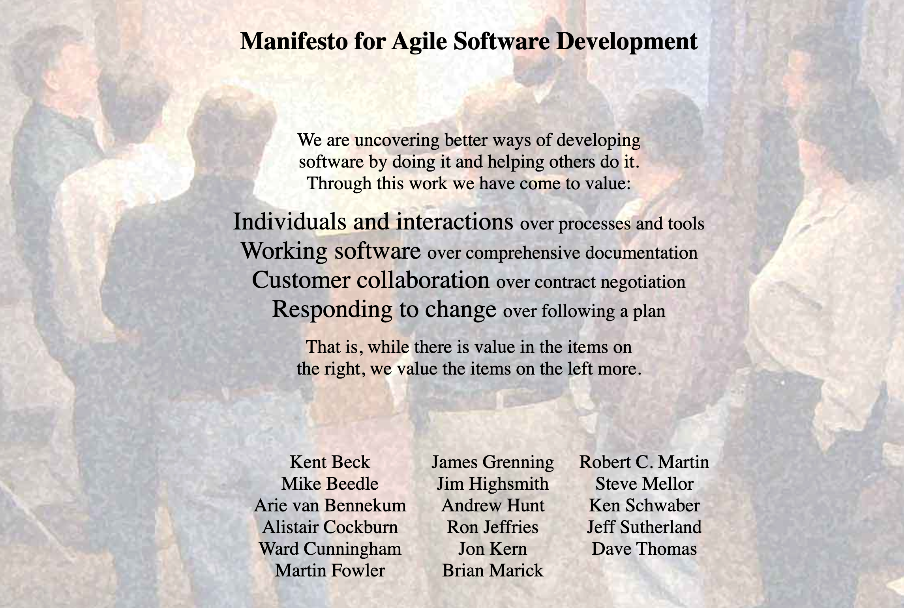{ width=400 }

{ width=400 }

# Ketterä manifesti 2001

# Agile Manifesto 2001

Translations of # Ketterä manifesti 2001
[ Suomi -> English ]

# Ketterä manifesti 2001
    # Agile Manifesto 2001, # The agile manifesto 2001

We are uncovering better ways of developing software by doing it and helping others do it.

We are uncovering better ways of developing software by doing it and helping others do it.

Through this work we have come to value:

Through this work we have come to value:

- **Individuals and interactions** over processes and tools

- **Individuals and interactions** over processes and tools

- **Working software** over comprehensive documentation

- **Working software** over comprehensive documentation

- **Customer collaboration** over contract negotiation

- **Customer collaboration** over contract negotiation

- **Responding to change** over following a plan

- **Responding to change** over following a plan

That is, while there is value in the items on the right, we value the items on the left more

That is, while there is value in the items on the right, we value the items on the left more

. . .

. . .

Manifestin laativat ja allekirjoittivat 17 ketterien menetelmien varhaista pioneeria, mm.  Kent Beck, Robert Martin, Ken Schwaber ja Martin Fowler

The manifesto was drawn up and signed by 17 early pioneers of agile methods, e.g. Kent Beck, Robert Martin, Ken Schwaber and Martin Fowler

Translations of Manifestin laativat ja allekirjoittivat 17 ketterien menetelmien varhaista pioneeria, mm.  Kent Beck, Robert Martin, Ken Schwaber ja Martin Fowler
[ Suomi -> English ]

Manifestin laativat ja allekirjoittivat 17 ketterien menetelmien varhaista pioneeria, mm.
    The manifesto was drawn up and signed by 17 early pioneers of agile methods, e.g., The Manifesto was prepared and signed by 17 early pioneers of agile methods, e.g.
Kent Beck, Robert Martin, Ken Schwaber ja Martin Fowler
    Kent Beck, Robert Martin, Ken Schwaber and Martin Fowler, By Kent Beck, Robert Martin, Ken Schwaber, and Martin Fowler

# Ketterät periaatteet, osa 1

# Agile principles, part 1

Translations of # Ketterät periaatteet, osa 1
[ Suomi -> English ]

# Ketterät periaatteet, osa 1
    # Agile principles, part 1, # Agile Principles Part 1

. . .

. . .

Our highest priority is to satisfy the customer through **early and

Our highest priority is to satisfy the customer through **early and

continuous delivery of valuable software**

continuous delivery of valuable software**

. . .

. . .

**Deliver working software frequently**, from a couple of weeks to

**Deliver working software frequently**, from a couple of weeks to

a couple of months, with a preference to the shorter timescale

a couple of months, with a preference to the shorter timescale

. . .

. . .

Business people and developers must **work together daily** throughout the project

Business people and developers must **work together daily** throughout the project

. . .

. . .

The most efficient and effective method of conveying information to and within a development team is **face-to-face** conversation

The most efficient and effective method of conveying information to and within a development team is **face-to-face** conversation

. . .

. . .

**Welcome changing requirements**, even late in development. Agile processes harness change for the customer's competitive advantage

**Welcome changing requirements**, even late in development. Agile processes harness change for the customer's competitive advantage

# Ketterät periaatteet, osa 2

# Agile principles, part 2

Translations of # Ketterät periaatteet, osa 2
[ Suomi -> English ]

# Ketterät periaatteet, osa 2
    # Agile principles, part 2, # Agile Principles Part 2

Build projects around motivated individuals. Give them the environment and support they need, and **trust them to get the job done**

Build projects around motivated individuals. Give them the environment and support they need, and **trust them to get the job done**

. . .

. . .

The best architectures, requirements, and designs emerge from **self-organizing teams**

The best architectures, requirements, and designs emerge from **self-organizing teams**

. . .

. . .

At regular intervals, the **team reflects on how to become more effective**, then tunes and adjusts its behavior accordingly

At regular intervals, the **team reflects on how to become more effective**, then tunes and adjusts its behavior accordingly

. . .

. . .

**Simplicity** – the art of maximizing the amount of work not done – is essential

**Simplicity** – the art of maximizing the amount of work not done – is essential

. . .

. . .

Continuous attention to **technical excellence and good design** enhances agility

Continuous attention to **technical excellence and good design** enhances agility

. . .

. . .

Agile processes promote **sustainable development**. The sponsors, developers, and users should be able to maintain a constant pace indefinitely

Agile processes promote **sustainable development**. The sponsors, developers, and users should be able to maintain a constant pace indefinitely

# Ketterät menetelmät

# Agile methods

Translations of # Ketterät menetelmät
[ Suomi -> English ]

# Ketterät menetelmät
    # Agile methods, # Agile methodologies

Sateenvarjotermi useille ketterille prosessimalleille

An umbrella term for several agile process models

Translations of Sateenvarjotermi useille ketterille prosessimalleille
[ Suomi -> English ]

Sateenvarjotermi useille ketterille prosessimalleille
    An umbrella term for several agile process models, An umbrella term for a number of agile process models

- Näistä tunnetuimpia Scrum ja eXtreme programming eli XP

- The most famous of these are Scrum and eXtreme programming, i.e. XP

Translations of - Näistä tunnetuimpia Scrum ja eXtreme programming eli XP
[ Suomi -> English ]

- Näistä tunnetuimpia Scrum ja eXtreme programming eli XP
    - The most famous of these are Scrum and eXtreme programming, i.e. XP, - The best known of these are Scrum and eXtreme programming, or XP

- Molempiin, erityisesti Scrumiin tutustutaan kurssin aikana

- Both, especially Scrum, will be introduced during the course

Translations of - Molempiin, erityisesti Scrumiin tutustutaan kurssin aikana
[ Suomi -> English ]

- Molempiin, erityisesti Scrumiin tutustutaan kurssin aikana
    - Both, especially Scrum, will be introduced during the course, - Both of them, especially Scrum, will be introduced during the course

. . .

. . .

Ketterä ohjelmistotuotanto on ottanut vaikutteita myös Toyota production systemin taustalla olevasta _lean-ajattelusta_

Agile software production has also been influenced by the underlying _lean thinking_ of the Toyota production system

Translations of Ketterä ohjelmistotuotanto on ottanut vaikutteita myös Toyota production systemin taustalla olevasta _lean-ajattelusta_
[ Suomi -> English ]

Ketterä ohjelmistotuotanto on ottanut vaikutteita myös Toyota production systemin taustalla olevasta _lean-ajattelusta_
    Agile software production has also been influenced by the underlying _lean thinking_ of the Toyota production system, Agile software production has also been influenced by the _lean thinking_ underlying the Toyota production system

Viime vuosina syntynyt joukko "lean-menetelmiä"

A number of "lean methods" that have emerged in recent years

Translations of Viime vuosina syntynyt joukko "lean-menetelmiä"
[ Suomi -> English ]

Viime vuosina syntynyt joukko "lean-menetelmiä"
    A number of "lean methods" that have emerged in recent years, A set of "lean methods" that emerged in recent years

ー 看板
(̄ Kanban)

- Signboard

Translations of ー 看板
[ 日本語 -> English ]

ー 看板
    - Signboard, - Sign board

- Scrumban

- Crumb

Translations of - Scrumban
[ Română -> English ]

- Scrumban
    - Crumb, - Crumbling

. . .

. . .

... sekä laajan mittakaavan leaniin ja ketterään kehitykseen tarkoitettuja menetelmiä kuten SaFe

... and methods for large-scale lean and agile development such as SaFe

Translations of ... sekä laajan mittakaavan leaniin ja ketterään kehitykseen tarkoitettuja menetelmiä kuten SaFe
[ Suomi -> English ]

... sekä laajan mittakaavan leaniin ja ketterään kehitykseen tarkoitettuja menetelmiä kuten SaFe
    ... and methods for large-scale lean and agile development such as SaFe, ... as well as methods for large-scale lean and agile development, such as SaFe

Myös nämä kuuluvat kurssin aihepiiriin

These are also covered by the course

Translations of Myös nämä kuuluvat kurssin aihepiiriin
[ Suomi -> English ]

Myös nämä kuuluvat kurssin aihepiiriin
    These are also covered by the course, These are also included in the scope of the course

# Viikon 1 laskarit

# Week 1 calculators

Translations of # Viikon 1 laskarit
[ Suomi -> English ]

# Viikon 1 laskarit
    # Week 1 calculators, # Week 1 scores

. . .

. . .

Ohjelmistokehityksen käytännön työkaluja

Practical tools for software development

Translations of Ohjelmistokehityksen käytännön työkaluja
[ Suomi -> English ]

Ohjelmistokehityksen käytännön työkaluja
    Practical tools for software development, Software development practical tools

- Versionhallinta: Git

- Version control: Git

Translations of - Versionhallinta: Git
[ Suomi -> English ]

- Versionhallinta: Git
    - Version control: Git, - Version management: Git

- Automatisoitu testaus: Unittest

- Automated testing: Unittest

Translations of - Automatisoitu testaus: Unittest
[ Suomi -> English ]

- Automatisoitu testaus: Unittest
    - Automated testing: Unittest, - Automated Testing: Unittest

- Projektin riippuvuuksienhallinta ja "buildaus": Poetry

- Project dependency management and "building": Poetry

Translations of - Projektin riippuvuuksienhallinta ja "buildaus": Poetry
[ Suomi -> English ]

- Projektin riippuvuuksienhallinta ja "buildaus": Poetry
    - Project dependency management and "building": Poetry, - Project's dependency management and "build": Poetry

- CI- ja build-palvelinohjelmisto: Github Action

- CI and build server software: Github Action

Translations of - CI- ja build-palvelinohjelmisto: Github Action
[ Suomi -> English ]

- CI- ja build-palvelinohjelmisto: Github Action
    - CI and build server software: Github Action, - CI & build server software: Github Action

Tavoitteena mahdollistaa hallittu- ja toistettavissa oleva ohjelmistokehitys

The goal is to enable controlled and repeatable software development

Translations of Tavoitteena mahdollistaa hallittu- ja toistettavissa oleva ohjelmistokehitys
[ Suomi -> English ]

Tavoitteena mahdollistaa hallittu- ja toistettavissa oleva ohjelmistokehitys
    The goal is to enable controlled and repeatable software development, The goal is to enable managed and repeatable software development

. . .

. . .

_Deadline maanantaina klo 23:59_

_Deadline Monday at 23:59_

Translations of _Deadline maanantaina klo 23:59_
[ Suomi -> English ]

_Deadline maanantaina klo 23:59_
    _Deadline Monday at 23:59_, _Deadline on Monday at 11:59 p.m._

# AI: viekö se koodarin työt?

# AI: does it take the coder's work?

Translations of # AI: viekö se koodarin työt?
[ Suomi -> English ]

# AI: viekö se koodarin työt?
    # AI: does it take the coder's work?, # AI: does it take away the work of the coder?

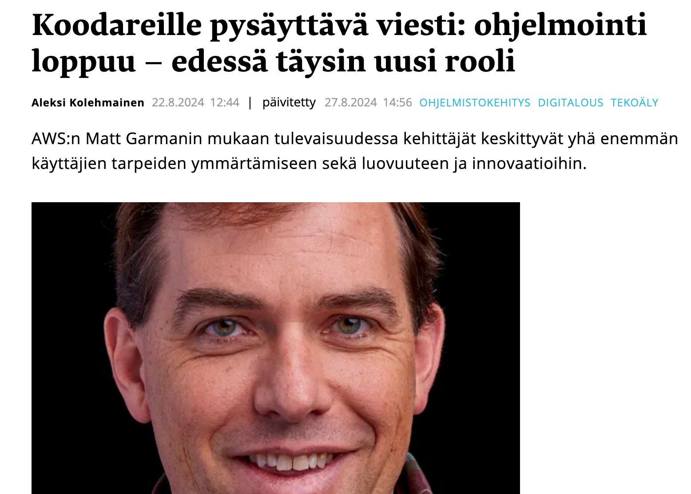{ width=400 }

{ width=400 }

# Mikä on juniorikoodarin tulevaisuus

# What is the future of the junior coder

Translations of # Mikä on juniorikoodarin tulevaisuus
[ Suomi -> English ]

# Mikä on juniorikoodarin tulevaisuus
    # What is the future of the junior coder, # What is the future of junior coding

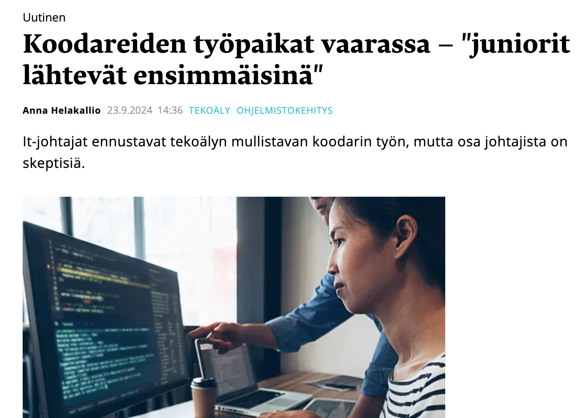{ width=400 }

{ width=400 }

# AI: voi olla itseasiassa aika huono

# AI: can actually be pretty bad

Translations of # AI: voi olla itseasiassa aika huono
[ Suomi -> English ]

# AI: voi olla itseasiassa aika huono
    # AI: can actually be pretty bad, # AI: can be quite bad actually

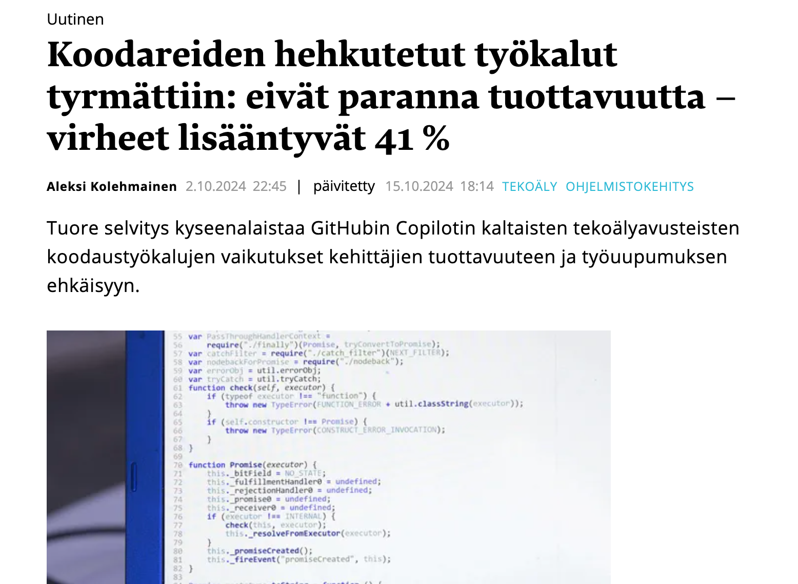{ width=400 }

{ width=400 }

# AI: voi myös olla uhka

# AI: can also be a threat

Translations of # AI: voi myös olla uhka
[ Suomi -> English ]

# AI: voi myös olla uhka
    # AI: can also be a threat, # AI: can be a threat too

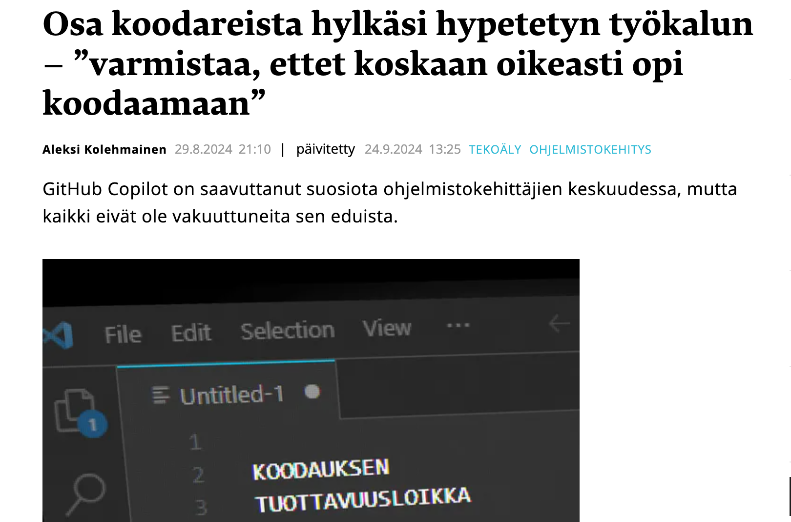{ width=400 }

{ width=400 }

# AI: työn painopiste saattaa muuttua

# AI: the focus of work may change

Translations of # AI: työn painopiste saattaa muuttua
[ Suomi -> English ]

# AI: työn painopiste saattaa muuttua
    # AI: the focus of work may change, # AI: work focus may change

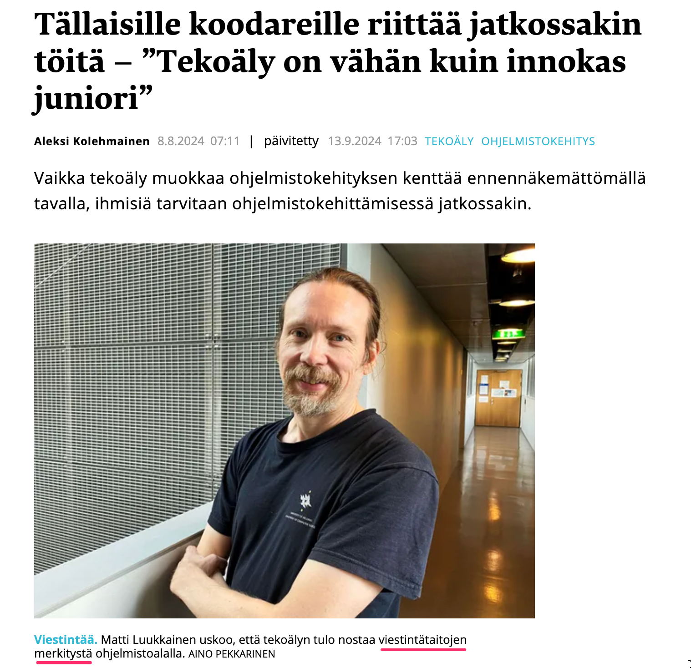{ width=340 }

{ width=340 }

# AI: uusia temppuja tarvitaan mutta ehkä duuni säilyy

# AI: new tricks are needed, but maybe the dune will remain

Translations of # AI: uusia temppuja tarvitaan mutta ehkä duuni säilyy
[ Suomi -> English ]

# AI: uusia temppuja tarvitaan mutta ehkä duuni säilyy
    # AI: new tricks are needed, but maybe the dune will remain, # AI: new tricks are needed, but maybe duni will be preserved

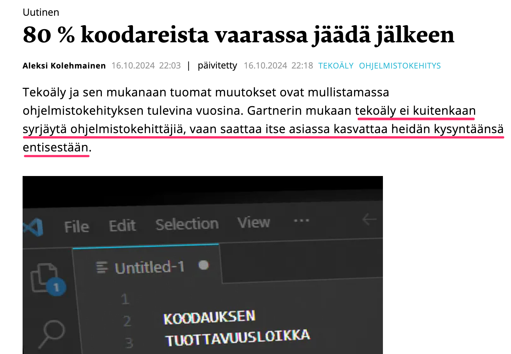{ width=400 }

{ width=400 }

# AI: hyvä renki, huono isäntä/emäntä

# AI: good ring, bad host/hostess

Translations of # AI: hyvä renki, huono isäntä/emäntä
[ Suomi -> English ]

# AI: hyvä renki, huono isäntä/emäntä
    # AI: good ring, bad host/hostess, # AI: good ring, bad master/mistress

{ width=450 }

{ width=450 }

. . .

. . .

https://translate.google.com/translate?hl=en&sl=auto&tl=en&u=https://curre.helsinki.fi/chat/chats

% Ohjelmistotuotanto

% Software production

Translations of % Ohjelmistotuotanto
[ Suomi -> English ]

% Ohjelmistotuotanto
    % Software production, % Software manufacturing

% Matti Luukkainen ja ohjaajat Antti, Pooki, Riku, Sini, Taneli

% Matti Luukkainen and directors Antti, Pooki, Riku, Sini, Taneli

Translations of % Matti Luukkainen ja ohjaajat Antti, Pooki, Riku, Sini, Taneli
[ Suomi -> English ]

% Matti Luukkainen ja ohjaajat Antti, Pooki, Riku, Sini, Taneli
    % Matti Luukkainen and directors Antti, Pooki, Riku, Sini, Taneli, % Matti Luukkainen and the instructors Antti, Pooki, Riku, Sini, Taneli

% syksy 2024

% autumn 2024

Translations of % syksy 2024
[ Suomi -> English ]

% syksy 2024
    % autumn 2024, % fall 2024

#

#

                                      Luento 2

                                     Lecture 2

                                    5.11.2024

                                    5.11.2024

# Kurssipalaute

# Course feedback

Translations of # Kurssipalaute
[ Suomi -> English ]

# Kurssipalaute
    # Course feedback, # Lesson feedback

- Kurssipalaute

- Course feedback

Translations of - Kurssipalaute
[ Suomi -> English ]

- Kurssipalaute
    - Course feedback, - Lesson feedback

- Kurssilla lopussa kerättävän palautteen lisäksi ns.  jatkuva palaute https://norppa.helsinki.fi

- In addition to the feedback collected at the end of the course, the so-called continuous feedback https://norppa.helsinki.fi

Translations of - Kurssilla lopussa kerättävän palautteen lisäksi ns.  jatkuva palaute https://norppa.helsinki.fi
[ Suomi -> English ]

- Kurssilla lopussa kerättävän palautteen lisäksi ns.
    - In addition to the feedback collected at the end of the course, the so-called, - In addition to the feedback gathered at the end of the course, so-called
jatkuva palaute https://norppa.helsinki.fi
    continuous feedback https://norppa.helsinki.fi, ongoing feedback https://norppa.helsinki.fi

# Paja

# Straw

Definitions of # Paja
[ Español -> English ]

noun
    straw
        paja, pajita, popote, sorbete, pitillo
    thatch
        paja, techo de paja, cubierta de paja
    chaff
        paja, barcia, paja menuda, bagazo, burlas
    padding
        relleno, acolchado, paja
    waffle
        gofre, palabrería, paja, palabras
    masturbation
        masturbación, paja
    blow job
        mamada, paja, francés
    blah
        paja
    tap
        grifo, golpecito, llave, derivación, canilla, paja

# Paja
    # Straw, #straw

- BK107

- BK107

Translations of - BK107
[ Türkçe -> English ]

- BK107
    - BK107, –BK107

- ma 14-16

- ma 14-16

- to 13-15

- to 13-15

- pe 12-14 (8.11. poikkeuksellisesti klo 14-16)

- Friday 12-14 (8.11. exceptionally from 14-16)

Translations of - pe 12-14 (8.11. poikkeuksellisesti klo 14-16)
[ Suomi -> English ]

- pe 12-14 (8.11. poikkeuksellisesti klo 14-16)
    - Friday 12-14 (8.11. exceptionally from 14-16), - Fri 12-14 (8.11. exceptionally 14-16)

# Miniprojektit

# Mini projects

Translations of # Miniprojektit
[ Suomi -> English ]

# Miniprojektit
    # Mini projects, # Mini-projects

- Käynnistyvät 11.11 alkavalla viikolla

- Will start in the week starting 11.11

Translations of - Käynnistyvät 11.11 alkavalla viikolla
[ Suomi -> English ]

- Käynnistyvät 11.11 alkavalla viikolla
    - Will start in the week starting 11.11, - Starts in the week starting 11.11

- **Ilmoittautumisen deadline su 10.11.  klo 23.59**

- **Registration deadline Sun 10.11. at 23:59**

Translations of - **Ilmoittautumisen deadline su 10.11.  klo 23.59**
[ Suomi -> English ]

- **Ilmoittautumisen deadline su 10.11.
    - **Registration deadline Sun 10.11., - **Deadline for registration Sun 10.11.
klo 23.59**
    at 23:59**, at 11:59 p.m.**

- Aloitustilaisuudet

- Opening ceremonies

Translations of - Aloitustilaisuudet
[ Suomi -> English ]

- Aloitustilaisuudet
    - Opening ceremonies, - Kick-off events

- ti 14-16

- of 14-16

Translations of - ti 14-16
[ Yorùbá -> English ]

- ti 14-16
    - of 14-16, - from 14 to 16

- ke 14-16

- the 14-16

Translations of - ke 14-16
[ ʻŌlelo Hawaiʻi -> English ]

- ke 14-16
    - the 14-16, - 14-16

- ke 16-18

- when 16-18

Translations of - ke 16-18
[ ʻŌlelo Hawaiʻi -> English ]

- ke 16-18
    - when 16-18, - 16-18

- to 10-12

- to 10-12

- to 14-16

- to 14-16

- Seuraavat viikot:  sprinttien katselmus ja suunnittelu samassa aikaikkunassa

- The following weeks: viewing and planning sprints in the same time window

Translations of - Seuraavat viikot:  sprinttien katselmus ja suunnittelu samassa aikaikkunassa
[ Suomi -> English ]

- Seuraavat viikot:
    - The following weeks:, - Next weeks:
sprinttien katselmus ja suunnittelu samassa aikaikkunassa
    viewing and planning sprints in the same time window, sprint viewing and planning in the same time window

- Loppudemot

- End of life

Translations of - Loppudemot
[ Svenska -> English ]

- Loppudemot
    - End of life, - Lopmodemot

- ke 11.12.  klo 12-14 B123

- to 11.12. klo 12-14 B123

Translations of - ke 11.12.  klo 12-14 B123
[ Bahasa Indonesia -> English ]

- ke 11.12.
    - to 11.12., - 11.12.
klo 12-14 B123
    klo 12-14 B123, 12-14 B123

- to 12.12. klo 12-14 CK112

- to 12.12. klo 12-14 CK112

# Vesiputousmalli

# Waterfall model

Translations of # Vesiputousmalli
[ Suomi -> English ]

# Vesiputousmalli
    # Waterfall model, # Waterfall template

{ width=440 }

{ width=440 }

# Vesiputousmallin suurimmat ongelmat

# The biggest problems with the waterfall model

Translations of # Vesiputousmallin suurimmat ongelmat
[ Suomi -> English ]

# Vesiputousmallin suurimmat ongelmat
    # The biggest problems with the waterfall model, # The biggest issues with the waterfall model

. . .

. . .

- Vaatimukset mahdotonta määritellä tyhjentävästi heti alussa

- It is impossible to define the requirements exhaustively at the very beginning

Translations of - Vaatimukset mahdotonta määritellä tyhjentävästi heti alussa
[ Suomi -> English ]

- Vaatimukset mahdotonta määritellä tyhjentävästi heti alussa
    - It is impossible to define the requirements exhaustively at the very beginning, - It is impossible to define the requirements exhaustively right from the start

- asiakas ei ymmärrä vielä alussa mitä haluaa

- the customer doesn't understand what he wants at the beginning

Translations of - asiakas ei ymmärrä vielä alussa mitä haluaa
[ Suomi -> English ]

- asiakas ei ymmärrä vielä alussa mitä haluaa
    - the customer doesn't understand what he wants at the beginning, - the customer does not yet understand what he wants at the beginning

- bisnesympäristö muuttuu projektin kuluessa

- the business environment changes during the project

Translations of - bisnesympäristö muuttuu projektin kuluessa
[ Suomi -> English ]

- bisnesympäristö muuttuu projektin kuluessa
    - the business environment changes during the project, - the business environment changes during the course of the project

. . .

. . .

- Suunnittelu sillä tasolla, että ohjelmointi on suoraviivainen "rakennusvaihe" on mahdotonta

- Planning at the level that programming is a straightforward "building phase" is impossible

Translations of - Suunnittelu sillä tasolla, että ohjelmointi on suoraviivainen "rakennusvaihe" on mahdotonta
[ Suomi -> English ]

- Suunnittelu sillä tasolla, että ohjelmointi on suoraviivainen "rakennusvaihe" on mahdotonta
    - Planning at the level that programming is a straightforward "building phase" is impossible, - Designing at the level that programming is a straightforward "construction phase" is impossible

- ohjelmointi on osa suunnitteluprosessia, ohjelmakoodi on tuotteen lopullinen suunnitelma

- programming is part of the design process, the program code is the final design of the product

Translations of - ohjelmointi on osa suunnitteluprosessia, ohjelmakoodi on tuotteen lopullinen suunnitelma
[ Suomi -> English ]

- ohjelmointi on osa suunnitteluprosessia, ohjelmakoodi on tuotteen lopullinen suunnitelma
    - programming is part of the design process, the program code is the final design of the product, - programming is a part of the design process, the program code is the final plan of the product

. . .

. . .

- Suunnittelu taas on teknisesti haastavaa, riskejä sisältävää toimintaa

- Planning, on the other hand, is a technically challenging, risky activity

Translations of - Suunnittelu taas on teknisesti haastavaa, riskejä sisältävää toimintaa
[ Suomi -> English ]

- Suunnittelu taas on teknisesti haastavaa, riskejä sisältävää toimintaa
    - Planning, on the other hand, is a technically challenging, risky activity, - Planning, on the other hand, is a technically challenging activity that involves risks

. . .

. . .

- Lopussa tehtävä testaus paljastaa ongelmat liian myöhään

- The testing done at the end reveals the problems too late

Translations of - Lopussa tehtävä testaus paljastaa ongelmat liian myöhään
[ Suomi -> English ]

- Lopussa tehtävä testaus paljastaa ongelmat liian myöhään
    - The testing done at the end reveals the problems too late, - Testing at the end reveals problems too late

- onglemien korjaaminen voi edellyttää kalliita muutoksia

- fixing problems may require expensive changes

Translations of - onglemien korjaaminen voi edellyttää kalliita muutoksia
[ Suomi -> English ]

- onglemien korjaaminen voi edellyttää kalliita muutoksia
    - fixing problems may require expensive changes, - correcting problems may require expensive changes

# Ohjelmiston tuottaminen ei ole kontrolloitu prosessi

# Software production is not a controlled process

Translations of # Ohjelmiston tuottaminen ei ole kontrolloitu prosessi
[ Suomi -> English ]

# Ohjelmiston tuottaminen ei ole kontrolloitu prosessi
    # Software production is not a controlled process, # Producing the software is not a controlled process

- 90-luvun iteratiiviset prosessimallit korjaavat monia edellisen kalvon epäkohdista

- The iterative process models of the 90s correct many of the shortcomings of the previous film

Translations of - 90-luvun iteratiiviset prosessimallit korjaavat monia edellisen kalvon epäkohdista
[ Suomi -> English ]

- 90-luvun iteratiiviset prosessimallit korjaavat monia edellisen kalvon epäkohdista
    - The iterative process models of the 90s correct many of the shortcomings of the previous film, - The iterative process models of the 90s correct many of the flaws of the previous film

- Olivat edelleen tarkkoihin etukäteissuunnitelmiin perustuvia

- They were still based on precise advance plans

Translations of - Olivat edelleen tarkkoihin etukäteissuunnitelmiin perustuvia
[ Suomi -> English ]

- Olivat edelleen tarkkoihin etukäteissuunnitelmiin perustuvia
    - They were still based on precise advance plans, - They were still based on precise plans in advance

- Tarkka projektisuunnitelma ja sen noudattaminen

- Accurate project plan and its compliance

Translations of - Tarkka projektisuunnitelma ja sen noudattaminen
[ Suomi -> English ]

- Tarkka projektisuunnitelma ja sen noudattaminen
    - Accurate project plan and its compliance, - Exact project plan and its compliance

- Selkeä roolijako: projektipäälliköt, analyytikot, arkkitehdit, ohjelmoijat, testaajat

- Clear division of roles: project managers, analysts, architects, programmers, testers

Translations of - Selkeä roolijako: projektipäälliköt, analyytikot, arkkitehdit, ohjelmoijat, testaajat
[ Suomi -> English ]

- Selkeä roolijako: projektipäälliköt, analyytikot, arkkitehdit, ohjelmoijat, testaajat
    - Clear division of roles: project managers, analysts, architects, programmers, testers, - Clear role division: project managers, analysts, architects, programmers, testers

. . .

. . .

- eli ne olettivat että ohjelmistotuotanto on jossain määrin kontrolloitavissa oleva prosessi_

- i.e. they assumed that software production is a somewhat controllable process_

Translations of - eli ne olettivat että ohjelmistotuotanto on jossain määrin kontrolloitavissa oleva prosessi_
[ Suomi -> English ]

- eli ne olettivat että ohjelmistotuotanto on jossain määrin kontrolloitavissa oleva prosessi_
    - i.e. they assumed that software production is a somewhat controllable process_, - i.e. they assumed that Software Production is a process that can be controlled to some extent_

# Ketterien menetelmien perusolettamuksia

# Basic assumptions of agile methods

Translations of # Ketterien menetelmien perusolettamuksia
[ Suomi -> English ]

# Ketterien menetelmien perusolettamuksia
    # Basic assumptions of agile methods, # Basic assumptions of agile methodologies

. . .

. . .

- Useimmat ohjelmistoprojektit ovat laadultaan uniikkeja

- Most software projects are unique in quality

Translations of - Useimmat ohjelmistoprojektit ovat laadultaan uniikkeja
[ Suomi -> English ]

- Useimmat ohjelmistoprojektit ovat laadultaan uniikkeja
    - Most software projects are unique in quality, - Most of the software projects are unique in quality

- **Vaatimukset erilaiset** kuin millään jo tehdyllä ohjelmistolla

- **The requirements are different** than with any software already made

Translations of - **Vaatimukset erilaiset** kuin millään jo tehdyllä ohjelmistolla
[ Suomi -> English ]

- **Vaatimukset erilaiset** kuin millään jo tehdyllä ohjelmistolla
    - **The requirements are different** than with any software already made, - **Requirements different** than any software already made

- **Uusi tekijätiimi**, varustettu omanlaisilla kompetensseilla ja persoonallisuuksilla

- **New author team**, equipped with unique competencies and personalities

Translations of - **Uusi tekijätiimi**, varustettu omanlaisilla kompetensseilla ja persoonallisuuksilla
[ Suomi -> English ]

- **Uusi tekijätiimi**, varustettu omanlaisilla kompetensseilla ja persoonallisuuksilla
    - **New author team**, equipped with unique competencies and personalities, - **A new team of authors**, equipped with unique competencies and personalities

- **Toteutusteknologiat kehittyvät** tehdään todennäköisesti tavalla, joka ei ole kaikille tuttu

- **Implementation technologies are developing** will probably be done in a way that is not familiar to everyone

Translations of - **Toteutusteknologiat kehittyvät** tehdään todennäköisesti tavalla, joka ei ole kaikille tuttu
[ Suomi -> English ]

- **Toteutusteknologiat kehittyvät** tehdään todennäköisesti tavalla, joka ei ole kaikille tuttu
    - **Implementation technologies are developing** will probably be done in a way that is not familiar to everyone, - **Implementation technologies are developing** probably done in a way that is not familiar to everyone

. . .

. . .

- Järkevää lähteä oletuksesta että kyseessä ei ole _kontrolloitu prosessi_, joka voidaan tarkkaan etukäteen aikatauluttaa ja suunnitella

- It makes sense to start from the assumption that it is not a _controlled process_ that can be precisely scheduled and planned in advance

Translations of - Järkevää lähteä oletuksesta että kyseessä ei ole _kontrolloitu prosessi_, joka voidaan tarkkaan etukäteen aikatauluttaa ja suunnitella
[ Suomi -> English ]

- Järkevää lähteä oletuksesta että kyseessä ei ole _kontrolloitu prosessi_, joka voidaan tarkkaan etukäteen aikatauluttaa ja suunnitella
    - It makes sense to start from the assumption that it is not a _controlled process_ that can be precisely scheduled and planned in advance, - It makes sense to start from the assumption that it is not a _controlled process_ that can be precisely scheduled and planned beforehand

. . .

. . .

- Parempi ajatella _tuotekehitysprojektina_, jonka kontrollointiin sopii paremmin _empiirinen prosessi_ jonka periaatteina

- Better to think of it as a _product development project_, whose control is better suited to an _empirical process_ whose principles

Translations of - Parempi ajatella _tuotekehitysprojektina_, jonka kontrollointiin sopii paremmin _empiirinen prosessi_ jonka periaatteina
[ Suomi -> English ]

- Parempi ajatella _tuotekehitysprojektina_, jonka kontrollointiin sopii paremmin _empiirinen prosessi_ jonka periaatteina
    - Better to think of it as a _product development project_, whose control is better suited to an _empirical process_ whose principles, - Better to think of it as a _product development project_, the control of which is better suited to an _empirical process_, the principles of which

- _transparency_ läpinäkyvyys

- _transparency_ transparency

Translations of - _transparency_ läpinäkyvyys
[ Suomi -> English ]

- _transparency_ läpinäkyvyys
    - _transparency_ transparency, - transparency

- _inspection_ tarkkailu

- _inspection_ observation

Translations of - _inspection_ tarkkailu
[ Suomi -> English ]

- _inspection_ tarkkailu
    - _inspection_ observation, - _inspection_ monitoring

- _adaption_ mukauttaminen

- adaptation of _adaption_

Translations of - _adaption_ mukauttaminen
[ Suomi -> English ]

- _adaption_ mukauttaminen
    - adaptation of _adaption_, - _adaption_ adaptation

# Ketterien menetelmien perusolettamuksia

# Basic assumptions of agile methods

Translations of # Ketterien menetelmien perusolettamuksia
[ Suomi -> English ]

# Ketterien menetelmien perusolettamuksia
    # Basic assumptions of agile methods, # Basic assumptions of agile methodologies

- Tekijät yksilöitä: toimivat paremmin kun heihin luotetaan ja annetaan tiimille vapaus organisoida itse toimintansa

- Individuals: work better when they are trusted and the team is given the freedom to organize its own activities

Translations of - Tekijät yksilöitä: toimivat paremmin kun heihin luotetaan ja annetaan tiimille vapaus organisoida itse toimintansa
[ Suomi -> English ]

- Tekijät yksilöitä: toimivat paremmin kun heihin luotetaan ja annetaan tiimille vapaus organisoida itse toimintansa
    - Individuals: work better when they are trusted and the team is given the freedom to organize its own activities, - Individual contributors: work better when they are trusted and the team is given the freedom to organize its own activities

. . .

. . .

- Oletuksena että perinteinen command-and-control ja jako eri vastuualueisiin ei tuota optimaalista tulosta

- Assuming that traditional command-and-control and division into different areas of responsibility does not produce optimal results

Translations of - Oletuksena että perinteinen command-and-control ja jako eri vastuualueisiin ei tuota optimaalista tulosta
[ Suomi -> English ]

- Oletuksena että perinteinen command-and-control ja jako eri vastuualueisiin ei tuota optimaalista tulosta
    - Assuming that traditional command-and-control and division into different areas of responsibility does not produce optimal results, - On the assumption that the traditional command-and-control and division into different areas of responsibility does not produce an optimal result

. . .

. . .

- "The whole team"-periaate: tiimi kollektiivina vastuussa aikaansaannoksesta

- "The whole team" principle: the team as a collective is responsible for the achievement

Translations of - "The whole team"-periaate: tiimi kollektiivina vastuussa aikaansaannoksesta
[ Suomi -> English ]

- "The whole team"-periaate: tiimi kollektiivina vastuussa aikaansaannoksesta
    - "The whole team" principle: the team as a collective is responsible for the achievement, - "The whole team" principle: the team collectively responsible for the achievement

. . .

. . .

Ensimmäisellä luennolla käsitelty _ketterän manifesti_ heijastelee näitä olettamuksia

The _agile manifesto_ discussed in the first lecture reflects these assumptions

Translations of Ensimmäisellä luennolla käsitelty _ketterän manifesti_ heijastelee näitä olettamuksia
[ Suomi -> English ]

Ensimmäisellä luennolla käsitelty _ketterän manifesti_ heijastelee näitä olettamuksia
    The _agile manifesto_ discussed in the first lecture reflects these assumptions, The _agile manifesto_ covered in the first lecture reflects these assumptions

. . .

. . .

Ovatko nämä valideja olettamuksia?

Are these valid assumptions?

Translations of Ovatko nämä valideja olettamuksia?
[ Suomi -> English ]

Ovatko nämä valideja olettamuksia?
    Are these valid assumptions?, Are these valid hypotheses?

# Scrum

noun
    an ordered formation of players, used to restart play, in which the forwards of a team form up with arms interlocked and heads down, and push forward against a similar group from the opposing side. The ball is thrown into the scrum and the players try to gain possession of it by kicking it backward toward their own side.

    a set of practices used in agile project management that emphasize daily communication and the flexible reassessment of plans that are carried out in short, iterative phases of work.

verb
    form or take part in a scrum.
        - "the two men scrummed down together for University College, Dublin"

- Tutustumme kurssilla Scrumiin, joka on tällä hetkellä selvästi suosituin ketterä menetelmä/prosessimalli

- In the course, we get to know Scrum, which is currently clearly the most popular agile method/process model

Translations of - Tutustumme kurssilla Scrumiin, joka on tällä hetkellä selvästi suosituin ketterä menetelmä/prosessimalli
[ Suomi -> English ]

- Tutustumme kurssilla Scrumiin, joka on tällä hetkellä selvästi suosituin ketterä menetelmä/prosessimalli
    - In the course, we get to know Scrum, which is currently clearly the most popular agile method/process model, - In the course, we get to know Scrum, which is clearly the most popular agile method/process model at the moment

. . .

. . .

- Kehittäjiensä mukaa Scrum on

- According to its developers, Scrum is

Translations of - Kehittäjiensä mukaa Scrum on
[ Suomi -> English ]

- Kehittäjiensä mukaa Scrum on
    - According to its developers, Scrum is, - According to the developers, Scrum is

- menetelmäkehys

- method framework

Translations of - menetelmäkehys
[ Suomi -> English ]

- menetelmäkehys
    - method framework, - the method framework

- monimutkaisten ongelmien ratkaisuun

- for solving complex problems

Translations of - monimutkaisten ongelmien ratkaisuun
[ Suomi -> English ]

- monimutkaisten ongelmien ratkaisuun
    - for solving complex problems, - to the solution of complex problems

- tuottavalla, luovalla ja maksimaalisen arvoa tuottavalla tavalla

- in a productive, creative and maximum value generating way

Translations of - tuottavalla, luovalla ja maksimaalisen arvoa tuottavalla tavalla
[ Suomi -> English ]

- tuottavalla, luovalla ja maksimaalisen arvoa tuottavalla tavalla
    - in a productive, creative and maximum value generating way, - in a productive, creative and maximum value-producing manner

. . .

. . .

- Scrum on:

- Scrum on:

- kevyt (lightweight)

- lightweight

Translations of - kevyt (lightweight)
[ Suomi -> English ]

- kevyt (lightweight)
    - lightweight, - lightweight (lightweight)

- helppo ymmärtää

- easy to understand

Translations of - helppo ymmärtää
[ Suomi -> English ]

- helppo ymmärtää
    - easy to understand, - simple to understand

- mutta **äärimmäisen vaikea hallita** (extremely difficult to master)

- but **extremely difficult to master**

Translations of - mutta **äärimmäisen vaikea hallita** (extremely difficult to master)
[ Suomi -> English ]

- mutta **äärimmäisen vaikea hallita** (extremely difficult to master)
    - but **extremely difficult to master**, - but **extremely hard to master**

# Scrum kuvana

# Scrum for kids

Translations of # Scrum kuvana
[ chiShona -> English ]

# Scrum kuvana
    # Scrum for kids, # Scrum for children

{ width=440 }

{ width=440 }

# Scrum: roles, artifacts and events

# Scrum: roles, artifacts and events

Terminologiaa

Terminology

Definitions of Terminologiaa
[ Suomi -> English ]

noun
    terminology
        terminologia, oppisanasto, ammattisanasto
    nomenclature
        nimistö, terminologia

Terminologiaa
    Terminology, Some terminology

- Scrum määrittelee 3 erilaista **roolia**:

- Scrum defines 3 different **roles**:

Translations of - Scrum määrittelee 3 erilaista **roolia**:
[ Suomi -> English ]

- Scrum määrittelee 3 erilaista **roolia**:
    - Scrum defines 3 different **roles**:, - Scrum defines three different **roles**:

- Kehittäjä

- Developer

Definitions of - Kehittäjä
[ Suomi -> English ]

noun
    developer
        kehittäjä, kehite, rakentaja, aluerakentaja, grynderi
    generator
        generaattori, kehittäjä

- Kehittäjä
    - Developer, - The developer

- Scrum master

- Scrum master

- Product owner

- Product owner

. . .

. . .

- Scrumiin kuuluvat **artefaktit** eli ”konkreettiset asiat” ovat

- The **artifacts** that belong to Scrum, i.e. "concrete things" are

Translations of - Scrumiin kuuluvat **artefaktit** eli ”konkreettiset asiat” ovat
[ Suomi -> English ]

- Scrumiin kuuluvat **artefaktit** eli ”konkreettiset asiat” ovat
    - The **artifacts** that belong to Scrum, i.e. "concrete things" are, - The **artifacts** that belong to Scrum, i.e. "tangible things" are

- Product backlog eli projektin kehitysjono

- Product backlog, i.e. the project's development queue

Translations of - Product backlog eli projektin kehitysjono
[ Suomi -> English ]

- Product backlog eli projektin kehitysjono
    - Product backlog, i.e. the project's development queue, - Product backlog i.e. project development queue

- Sprint backlog eli sprintin tehtävälista

- Sprint backlog, i.e. sprint task list

Translations of - Sprint backlog eli sprintin tehtävälista
[ Suomi -> English ]

- Sprint backlog eli sprintin tehtävälista
    - Sprint backlog, i.e. sprint task list, - Sprint backlog i.e. the sprint task list

- Työn alla olevan ohjelmiston uudet versiot (product increment)

- New versions of the software under work (product increment)

Translations of - Työn alla olevan ohjelmiston uudet versiot (product increment)
[ Suomi -> English ]

- Työn alla olevan ohjelmiston uudet versiot (product increment)
    - New versions of the software under work (product increment), - New versions (product increment) of the software under work

. . .

. . .

- Scrumissa tekeminen rytmittyy sprintteihin eli 1-4 viikon mittaisiin iteraatioihin

- Doing things in Scrum is rhythmic in sprints, i.e. iterations lasting 1-4 weeks

Translations of - Scrumissa tekeminen rytmittyy sprintteihin eli 1-4 viikon mittaisiin iteraatioihin
[ Suomi -> English ]

- Scrumissa tekeminen rytmittyy sprintteihin eli 1-4 viikon mittaisiin iteraatioihin
    - Doing things in Scrum is rhythmic in sprints, i.e. iterations lasting 1-4 weeks, - Doing in Scrum is rhythmic in sprints, i.e. 1-4 week iterations

. . .

. . .

- Sprintteihin kuuluu muutamia **standardipalavereja** (events):

- Sprints include a few **standard meetings** (events):

Translations of - Sprintteihin kuuluu muutamia **standardipalavereja** (events):
[ Suomi -> English ]

- Sprintteihin kuuluu muutamia **standardipalavereja** (events):
    - Sprints include a few **standard meetings** (events):, - Sprints include several **standard meetings** (events):

- Sprintin suunnittelupalaveri

- Sprint planning meeting

Translations of - Sprintin suunnittelupalaveri
[ Suomi -> English ]

- Sprintin suunnittelupalaveri
    - Sprint planning meeting, - Sprint's design meeting

- Daily scrum -palaverit

- Daily Scrum meetings

Translations of - Daily scrum -palaverit
[ Suomi -> English ]

- Daily scrum -palaverit
    - Daily Scrum meetings, - Daily Scrum sessions

- Sprintin katselmointi

- Viewing Sprint

Translations of - Sprintin katselmointi
[ Suomi -> English ]

- Sprintin katselmointi
    - Viewing Sprint, - Sprint viewing

- Retrospektiivi

- Retrospective

Translations of - Retrospektiivi
[ Eesti -> English ]

- Retrospektiivi
    - Retrospective, - In retrospect

# Product backlog

# Product backlog

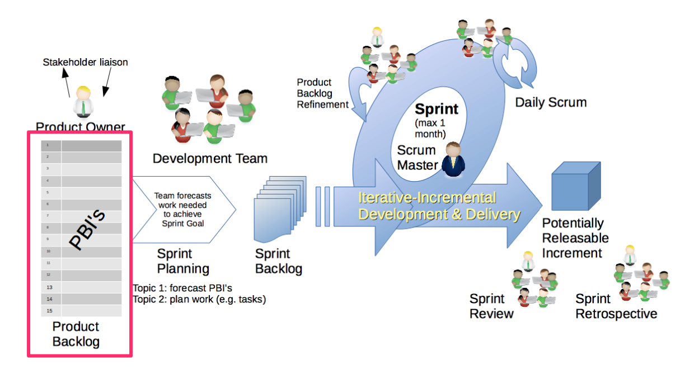{ width=440 }

{ width=440 }

# Product backlog

# Product backlog

- Priorisoitu lista asiakkaan tuotteelle asettamista _vaatimuksista_

- A prioritized list of the customer's _requirements_ for the product

Translations of - Priorisoitu lista asiakkaan tuotteelle asettamista _vaatimuksista_
[ Suomi -> English ]

- Priorisoitu lista asiakkaan tuotteelle asettamista _vaatimuksista_
    - A prioritized list of the customer's _requirements_ for the product, - A prioritized list of _requirements_ set by the customer for the product

- asiakkaan tasolla olevia _arvoa tuottavia_ toiminnallisuuksia, kirjattuna asiakkaan ymmärtämällä kielellä

- customer-level _value-producing_ functionalities, recorded in a language the customer understands

Translations of - asiakkaan tasolla olevia _arvoa tuottavia_ toiminnallisuuksia, kirjattuna asiakkaan ymmärtämällä kielellä
[ Suomi -> English ]

- asiakkaan tasolla olevia _arvoa tuottavia_ toiminnallisuuksia, kirjattuna asiakkaan ymmärtämällä kielellä
    - customer-level _value-producing_ functionalities, recorded in a language the customer understands, - customer-level _value-generating_ functionalities, written in a language the customer understands

. . .

. . .

- Priorisoidun listan kärkipään vaatimukset valitaan toteutettavaksi seuraaviin sprintteihin

- The requirements at the top of the prioritized list are selected to be implemented in the following sprints

Translations of - Priorisoidun listan kärkipään vaatimukset valitaan toteutettavaksi seuraaviin sprintteihin
[ Suomi -> English ]

- Priorisoidun listan kärkipään vaatimukset valitaan toteutettavaksi seuraaviin sprintteihin
    - The requirements at the top of the prioritized list are selected to be implemented in the following sprints, - The requirements at the top of the prioritized list are selected to be implemented in the next sprints

- kirjattu tarkemmin kuin backlogin häntäpään vaatimukset

- recorded more precisely than the tail end requirements of the backlog

Translations of - kirjattu tarkemmin kuin backlogin häntäpään vaatimukset
[ Suomi -> English ]

- kirjattu tarkemmin kuin backlogin häntäpään vaatimukset
    - recorded more precisely than the tail end requirements of the backlog, - recorded in more detail than the backlog tail end requirements

. . .

. . .

- Vaatimukset ovat usein _estimoituja_ eli toteutuksen vaatima työmäärä on arvioitu

- The requirements are often _estimated_, i.e. the amount of work required by the implementation has been estimated

Translations of - Vaatimukset ovat usein _estimoituja_ eli toteutuksen vaatima työmäärä on arvioitu
[ Suomi -> English ]

- Vaatimukset ovat usein _estimoituja_ eli toteutuksen vaatima työmäärä on arvioitu
    - The requirements are often _estimated_, i.e. the amount of work required by the implementation has been estimated, - Requirements are often _estimated_, i.e. the amount of work required by the implementation is estimated

- Työmääräarviot tekee kehittäjätiimi

- Workload estimates are made by the development team

Translations of - Työmääräarviot tekee kehittäjätiimi
[ Suomi -> English ]

- Työmääräarviot tekee kehittäjätiimi
    - Workload estimates are made by the development team, - The workload estimates are made by the development team

. . .

. . .

- Scrum ei määrittele missä muodossa backlog ja siinä olevat vaatimukset esitetään

- Scrum does not define in what form the backlog and the requirements in it are presented

Translations of - Scrum ei määrittele missä muodossa backlog ja siinä olevat vaatimukset esitetään
[ Suomi -> English ]

- Scrum ei määrittele missä muodossa backlog ja siinä olevat vaatimukset esitetään
    - Scrum does not define in what form the backlog and the requirements in it are presented, - Scrum does not specify in which form the backlog and the requirements in it are presented

- nykyään käytetään usein _user story_ -formaattia

- nowadays the _user story_ format is often used

Translations of - nykyään käytetään usein _user story_ -formaattia
[ Suomi -> English ]

- nykyään käytetään usein _user story_ -formaattia
    - nowadays the _user story_ format is often used, - the _user story_ format is often used nowadays

# Product owner

# Product owner

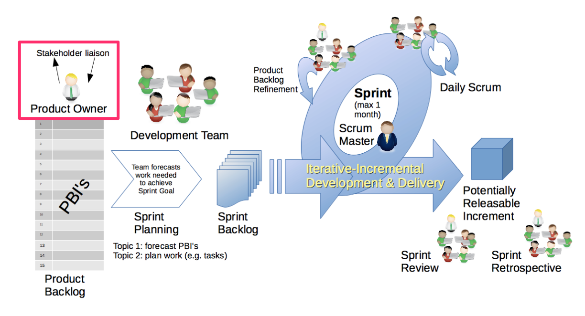{ width=440 }

{ width=440 }

# Product owner

# Product owner

- Scrumin mukaan kuka vaan voi milloin tahansa lisätä backlogiin vaatimuksia

- According to Scrum, anyone can add requirements to the backlog at any time

Translations of - Scrumin mukaan kuka vaan voi milloin tahansa lisätä backlogiin vaatimuksia
[ Suomi -> English ]

- Scrumin mukaan kuka vaan voi milloin tahansa lisätä backlogiin vaatimuksia
    - According to Scrum, anyone can add requirements to the backlog at any time, - According to Scrum, anyone can add requirements to the backlog anytime

- Backlogia priorisoi ainoastaan _product owner_ eli tuotteen omistaja

- Backlog is prioritized only by the _product owner_

Translations of - Backlogia priorisoi ainoastaan _product owner_ eli tuotteen omistaja
[ Suomi -> English ]

- Backlogia priorisoi ainoastaan _product owner_ eli tuotteen omistaja
    - Backlog is prioritized only by the _product owner_, - The backlog is prioritized only by the _product owner_

. . .

. . .

- Product owner on yksittäinen henkilö

- Product owner is an individual person

Translations of - Product owner on yksittäinen henkilö
[ Suomi -> English ]

- Product owner on yksittäinen henkilö
    - Product owner is an individual person, - A product owner is a single person

- Priorisointiin voi toki olla vaikuttamassa useampikin henkilö

- Of course, more than one person can influence the prioritization

Translations of - Priorisointiin voi toki olla vaikuttamassa useampikin henkilö
[ Suomi -> English ]

- Priorisointiin voi toki olla vaikuttamassa useampikin henkilö
    - Of course, more than one person can influence the prioritization, - Of course, there can be more than one person influencing the prioritization

- Product owner tekee lopulliset päätökset prioriteettien suhteen

- Product owner makes final decisions regarding priorities

Translations of - Product owner tekee lopulliset päätökset prioriteettien suhteen
[ Suomi -> English ]

- Product owner tekee lopulliset päätökset prioriteettien suhteen
    - Product owner makes final decisions regarding priorities, - The product owner makes the final decisions regarding priorities

. . .

. . .

- Product owner on vastuussa backlogista

- The product owner is responsible for the backlog

Translations of - Product owner on vastuussa backlogista
[ Suomi -> English ]

- Product owner on vastuussa backlogista
    - The product owner is responsible for the backlog, - Product owner is responsible for backlog

- Varmistaa että kehittäjätiimi ymmärtää toteutettavaksi valitut vaatimukset

- Ensures that the development team understands the requirements selected for implementation

Translations of - Varmistaa että kehittäjätiimi ymmärtää toteutettavaksi valitut vaatimukset
[ Suomi -> English ]

- Varmistaa että kehittäjätiimi ymmärtää toteutettavaksi valitut vaatimukset
    - Ensures that the development team understands the requirements selected for implementation, - Makes sure that the development team understands the requirements chosen for implementation

- Priorisoi vaatimukset maksimoiden asiakkaan tuotteesta saaman hyödyn/arvon

- Prioritize the requirements, maximizing the benefit/value the customer gets from the product

Translations of - Priorisoi vaatimukset maksimoiden asiakkaan tuotteesta saaman hyödyn/arvon
[ Suomi -> English ]

- Priorisoi vaatimukset maksimoiden asiakkaan tuotteesta saaman hyödyn/arvon
    - Prioritize the requirements, maximizing the benefit/value the customer gets from the product, - Prioritize requirements maximizing the benefit/value the customer gets from the product

# Scrum master

# Scrum master

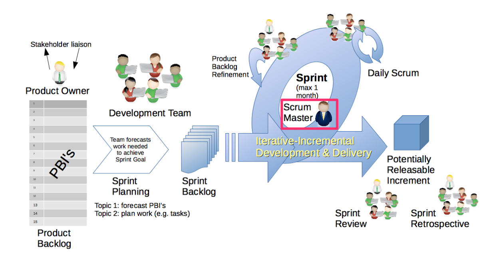{ width=440 }

{ width=440 }

# Scrum master

# Scrum master

- Tiimeillä on _scrum master_, eli henkilö joka huolehtii siitä että ohjelmistokehitys etenee sujuvasti

- Teams have a _scrum master_, i.e. a person who makes sure that software development progresses smoothly

Translations of - Tiimeillä on _scrum master_, eli henkilö joka huolehtii siitä että ohjelmistokehitys etenee sujuvasti
[ Suomi -> English ]

- Tiimeillä on _scrum master_, eli henkilö joka huolehtii siitä että ohjelmistokehitys etenee sujuvasti
    - Teams have a _scrum master_, i.e. a person who makes sure that software development progresses smoothly, - The teams have a _scrum master_, i.e. a person who makes sure that the software development progresses smoothly

. . .

. . .

- Ei perinteinen projektipäällikkö vaan _servant-leader_

- Not a traditional project manager but a _servant-leader_

Translations of - Ei perinteinen projektipäällikkö vaan _servant-leader_
[ Suomi -> English ]

- Ei perinteinen projektipäällikkö vaan _servant-leader_
    - Not a traditional project manager but a _servant-leader_, - Not a traditional project manager, but a _servant leader_

- järjestää Scrumiin liittyvät palaverit

- organizes meetings related to Scrum

Translations of - järjestää Scrumiin liittyvät palaverit
[ Suomi -> English ]

- järjestää Scrumiin liittyvät palaverit
    - organizes meetings related to Scrum, - organizes Scrum-related meetings

- huolehtii että Scrumia noudatetaan järkevällä tavalla

- ensures that Scrum is followed in a reasonable way

Translations of - huolehtii että Scrumia noudatetaan järkevällä tavalla
[ Suomi -> English ]

- huolehtii että Scrumia noudatetaan järkevällä tavalla
    - ensures that Scrum is followed in a reasonable way, - makes sure that Scrum is followed in a reasonable manner

- opastaa hyvien käytänteiden noudattamisessa

- guides in following good practices

Translations of - opastaa hyvien käytänteiden noudattamisessa
[ Suomi -> English ]

- opastaa hyvien käytänteiden noudattamisessa
    - guides in following good practices, - guides in the observance of good practices

- rohkaisee ja auttaa tiimiä itseorganisoitumisessa

- encourages and helps the team in self-organization

Translations of - rohkaisee ja auttaa tiimiä itseorganisoitumisessa
[ Suomi -> English ]

- rohkaisee ja auttaa tiimiä itseorganisoitumisessa
    - encourages and helps the team in self-organization, - encourages and helps the team self-organize

. . .

. . .

- Pyrkii poistamaan kehitystyön **esteitä**

- Strives to remove **obstacles** to development work

Translations of - Pyrkii poistamaan kehitystyön **esteitä**
[ Suomi -> English ]

- Pyrkii poistamaan kehitystyön **esteitä**
    - Strives to remove **obstacles** to development work, - Strives to remove the **obstacles** of the development work

- voi olla tiimistä riippumaton asia, jonka poistamiseksi scrum master joutuu neuvottelemaan yrityksen hallinnon kanssa

- can be a matter independent of the team, to eliminate which the Scrum master has to negotiate with the company administration

Translations of - voi olla tiimistä riippumaton asia, jonka poistamiseksi scrum master joutuu neuvottelemaan yrityksen hallinnon kanssa
[ Suomi -> English ]

- voi olla tiimistä riippumaton asia, jonka poistamiseksi scrum master joutuu neuvottelemaan yrityksen hallinnon kanssa
    - can be a matter independent of the team, to eliminate which the Scrum master has to negotiate with the company administration, - can be a matter independent of the team, to eliminate which the Scrum master has to negotiate with the company's management

- voi liittyä ryhmän työtapoihin, tällöin scrum master opastaa ryhmää toimimaan siten, että este poistuu

- can join the group's working methods, in which case the Scrum master guides the group to act in such a way that the obstacle is removed

Translations of - voi liittyä ryhmän työtapoihin, tällöin scrum master opastaa ryhmää toimimaan siten, että este poistuu
[ Suomi -> English ]

- voi liittyä ryhmän työtapoihin, tällöin scrum master opastaa ryhmää toimimaan siten, että este poistuu
    - can join the group's working methods, in which case the Scrum master guides the group to act in such a way that the obstacle is removed, - can join the working methods of the group, in which case the Scrum master guides the group to act in such a way that the obstacle is removed

. . .

. . .

- Scrum master tekee kaikkensa, jotta tiimillä olisi optimaaliset olosuhteen kehittää tuotetta

- The scrum master does everything to ensure that the team has optimal conditions to develop the product

Translations of - Scrum master tekee kaikkensa, jotta tiimillä olisi optimaaliset olosuhteen kehittää tuotetta
[ Suomi -> English ]

- Scrum master tekee kaikkensa, jotta tiimillä olisi optimaaliset olosuhteen kehittää tuotetta
    - The scrum master does everything to ensure that the team has optimal conditions to develop the product, - The scrum master does everything he can to ensure that the team has the optimal conditions to develop the product

# Kehittäjätiimi

# Development team

Translations of # Kehittäjätiimi
[ Suomi -> English ]

# Kehittäjätiimi
    # Development team, # The development team

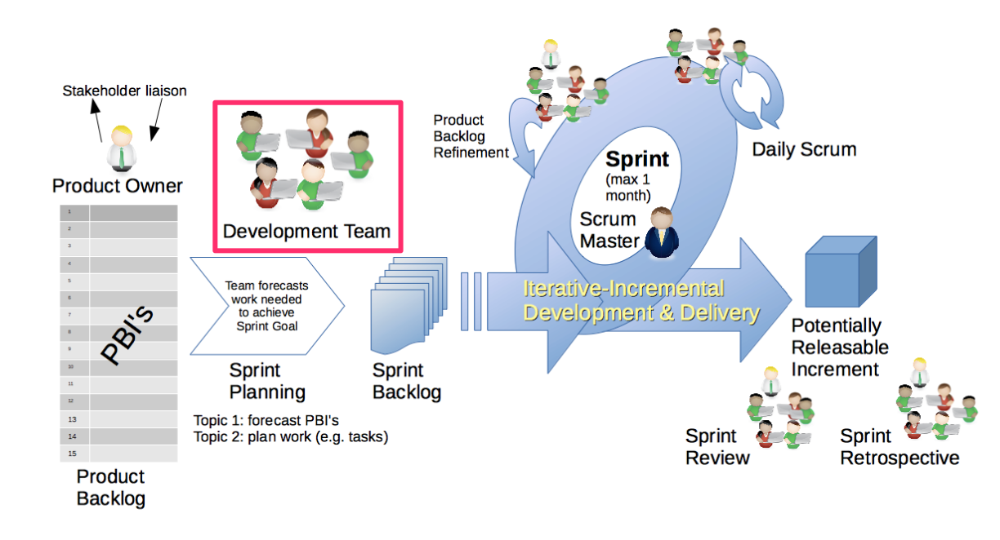{ width=440 }

{ width=440 }

# Kehittäjätiimi

# Development team

Translations of # Kehittäjätiimi
[ Suomi -> English ]

# Kehittäjätiimi
    # Development team, # The development team

- Kehittäjätiimi koostuu noin 3-9:stä henkilöstä, kaikista käytetään nimikettä developer

- The development team consists of approximately 3-9 people, all of whom use the title Developer

Translations of - Kehittäjätiimi koostuu noin 3-9:stä henkilöstä, kaikista käytetään nimikettä developer
[ Suomi -> English ]

- Kehittäjätiimi koostuu noin 3-9:stä henkilöstä, kaikista käytetään nimikettä developer
    - The development team consists of approximately 3-9 people, all of whom use the title Developer, - The development team consists of about 3-9 people, all of whom use the title Developer

- vaikka kaikilla nimike developer, voivat jotkut tiimin jäsenistä olla erikoistuneet omaan osa-alueeseensa

- although everyone has the title developer, some of the team members may be specialized in their own area

Translations of - vaikka kaikilla nimike developer, voivat jotkut tiimin jäsenistä olla erikoistuneet omaan osa-alueeseensa
[ Suomi -> English ]

- vaikka kaikilla nimike developer, voivat jotkut tiimin jäsenistä olla erikoistuneet omaan osa-alueeseensa
    - although everyone has the title developer, some of the team members may be specialized in their own area, - although everyone has the title developer, some team members may be specialized in their own area

. . .

. . .

- koko tiimi kantaa aina yhteisen vastuun kehitystyöstä

- the whole team always bears joint responsibility for the development work

Translations of - koko tiimi kantaa aina yhteisen vastuun kehitystyöstä
[ Suomi -> English ]

- koko tiimi kantaa aina yhteisen vastuun kehitystyöstä
    - the whole team always bears joint responsibility for the development work, - the entire team always bears joint responsibility for development work

. . .

. . .

- Oletuksena on että tiimin jäsenet työskentelevät tiimissä 100%:lla työajalla

- The assumption is that team members work in the team 100% of the time

Translations of - Oletuksena on että tiimin jäsenet työskentelevät tiimissä 100%:lla työajalla
[ Suomi -> English ]

- Oletuksena on että tiimin jäsenet työskentelevät tiimissä 100%:lla työajalla
    - The assumption is that team members work in the team 100% of the time, - It is assumed that the team members work in the team 100% of the time

. . .

. . .

- Tiimin tulee oletusarvoisesti työskennellä samassa paikassa, mieluiten yhteisessä tiimille varatussa avokonttorissa

- By default, the team should work in the same place, preferably in a common open office reserved for the team

Translations of - Tiimin tulee oletusarvoisesti työskennellä samassa paikassa, mieluiten yhteisessä tiimille varatussa avokonttorissa
[ Suomi -> English ]

- Tiimin tulee oletusarvoisesti työskennellä samassa paikassa, mieluiten yhteisessä tiimille varatussa avokonttorissa
    - By default, the team should work in the same place, preferably in a common open office reserved for the team, - By default, the team should work in the same place, preferably in a shared office space reserved for the team

- COVID ja sen jälkeinen hybridityöskentely aiheuttaneet haasteita...

- COVID and subsequent hybrid working caused challenges...

Translations of - COVID ja sen jälkeinen hybridityöskentely aiheuttaneet haasteita...
[ Suomi -> English ]

- COVID ja sen jälkeinen hybridityöskentely aiheuttaneet haasteita...
    - COVID and subsequent hybrid working caused challenges..., - COVID and the hybrid working that followed caused challenges...

# Kehittäjätiimi

# Development team

Translations of # Kehittäjätiimi
[ Suomi -> English ]

# Kehittäjätiimi
    # Development team, # The development team

- Tiimi on _cross-functional_, eli sen tulisi sisältää kaikki tarvittava osaaminen järjestelmän suunnitteluun, toteuttamiseen ja testaamiseen

- The team is _cross-functional_, i.e. it should include all the necessary expertise for planning, implementing and testing the system

Translations of - Tiimi on _cross-functional_, eli sen tulisi sisältää kaikki tarvittava osaaminen järjestelmän suunnitteluun, toteuttamiseen ja testaamiseen
[ Suomi -> English ]

- Tiimi on _cross-functional_, eli sen tulisi sisältää kaikki tarvittava osaaminen järjestelmän suunnitteluun, toteuttamiseen ja testaamiseen
    - The team is _cross-functional_, i.e. it should include all the necessary expertise for planning, implementing and testing the system, - The team is _cross-functional_, i.e. it should include all the necessary expertise for system planning, implementation and testing

. . .

. . .

- Kehitystiimiä ei johdeta ulkopuolelta

- The development team is not managed from the outside

Translations of - Kehitystiimiä ei johdeta ulkopuolelta
[ Suomi -> English ]

- Kehitystiimiä ei johdeta ulkopuolelta
    - The development team is not managed from the outside, - The development team is not led from outside

- päättää mihin tavoitteisiin se kussakin sprintissä sitoutuu, eli miten paljon vaatimuksia backlogilta valitaan sprintiin

- decide which goals it commits to in each sprint, i.e. how many requirements from the backlog are selected for the Sprint

Translations of - päättää mihin tavoitteisiin se kussakin sprintissä sitoutuu, eli miten paljon vaatimuksia backlogilta valitaan sprintiin
[ Suomi -> English ]

- päättää mihin tavoitteisiin se kussakin sprintissä sitoutuu, eli miten paljon vaatimuksia backlogilta valitaan sprintiin
    - decide which goals it commits to in each sprint, i.e. how many requirements from the backlog are selected for the Sprint, - decide which goals it commits to in each sprint, that is, how many requirements from the backlog are selected for the Sprint

- päättää myös (tiettyjen reunaehtojen puitteissa) itse miten se sprintin tavoiteen toteuttaa

- also decides (within certain boundary conditions) how to realize the sprint goal

Translations of - päättää myös (tiettyjen reunaehtojen puitteissa) itse miten se sprintin tavoiteen toteuttaa
[ Suomi -> English ]

- päättää myös (tiettyjen reunaehtojen puitteissa) itse miten se sprintin tavoiteen toteuttaa
    - also decides (within certain boundary conditions) how to realize the sprint goal, - also decides (within certain boundary conditions) himself how to realize the sprint goal

. . .

. . .

- Tiimi on siis _ itseorganisoituva _ (self organizing)

- So the team is _ self-organizing _ (self organizing)

Translations of - Tiimi on siis _ itseorganisoituva _ (self organizing)
[ Suomi -> English ]

- Tiimi on siis _ itseorganisoituva _ (self organizing)
    - So the team is _ self-organizing _ (self organizing), - The team is therefore _ self-organizing _ (self organizing)

# Sprintti

# Sprint

Translations of # Sprintti
[ Suomi -> English ]

# Sprintti
    # Sprint, # The sprint

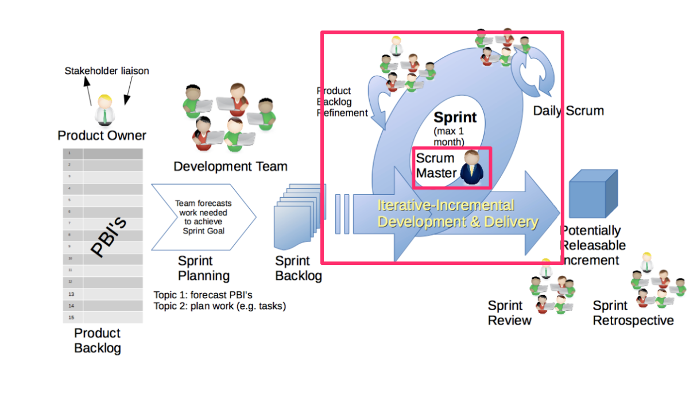{ width=440 }

{ width=440 }

# Sprintti

# Sprint

Translations of # Sprintti
[ Suomi -> English ]

# Sprintti
    # Sprint, # The sprint

- Scrumissa kehitystyö siis jakautuu 1-4 viikon mittaisiin iteraatioihin eli sprintteihin

- In Scrum, the development work is therefore divided into 1-4 week iterations, i.e. sprints

Translations of - Scrumissa kehitystyö siis jakautuu 1-4 viikon mittaisiin iteraatioihin eli sprintteihin
[ Suomi -> English ]

- Scrumissa kehitystyö siis jakautuu 1-4 viikon mittaisiin iteraatioihin eli sprintteihin
    - In Scrum, the development work is therefore divided into 1-4 week iterations, i.e. sprints, - In Scrum, the development work is thus divided into 1-4 week iterations, or sprints

- Sprintti on _time-boxed_, sitä ei missään olosuhteissa pidennetä

- The sprint is _time-boxed_, it cannot be extended under any circumstances

Translations of - Sprintti on _time-boxed_, sitä ei missään olosuhteissa pidennetä
[ Suomi -> English ]

- Sprintti on _time-boxed_, sitä ei missään olosuhteissa pidennetä
    - The sprint is _time-boxed_, it cannot be extended under any circumstances, - The sprint is _time-boxed_, under no circumstances will it be extended

. . .

. . .

- Jokaisen sprintin alussa tiimi valitsee projektin backlog lista sprintin aikana toteutettavat vaatimukset

- At the beginning of each sprint, the team selects the requirements to be implemented during the sprint from the project backlog list

Translations of - Jokaisen sprintin alussa tiimi valitsee projektin backlog lista sprintin aikana toteutettavat vaatimukset
[ Suomi -> English ]

- Jokaisen sprintin alussa tiimi valitsee projektin backlog lista sprintin aikana toteutettavat vaatimukset
    - At the beginning of each sprint, the team selects the requirements to be implemented during the sprint from the project backlog list, - At the beginning of each sprint, the team selects the project's backlog list of requirements to be implemented during the sprint

- Backlog on priorisoitu ja vaatimukset valitaan aina priorisoidun listan kärjestä

- The backlog is prioritized and the requirements are always selected from the top of the prioritized list

Translations of - Backlog on priorisoitu ja vaatimukset valitaan aina priorisoidun listan kärjestä
[ Suomi -> English ]

- Backlog on priorisoitu ja vaatimukset valitaan aina priorisoidun listan kärjestä
    - The backlog is prioritized and the requirements are always selected from the top of the prioritized list, - The backlog is prioritized and requirements are always chosen from the top of the prioritized list

- Product ownerin asettama prioriteettijärjestys määrää missä missä järjestyksessä asioita toteutetaan

- The order of priority set by the Product Owner determines in which order things are implemented

Translations of - Product ownerin asettama prioriteettijärjestys määrää missä missä järjestyksessä asioita toteutetaan
[ Suomi -> English ]

- Product ownerin asettama prioriteettijärjestys määrää missä missä järjestyksessä asioita toteutetaan
    - The order of priority set by the Product Owner determines in which order things are implemented, - The priority order set by the Product Owner determines in which order things are implemented

. . .

. . .

- Tiimi valitsee sprinttiin ainoastaan sen verran toteutettavaa minkä valmistumiseen se uskoo kykenevänsä sitoutumaan

- The team chooses only as much to implement for the sprint as it believes it can commit to completion

Translations of - Tiimi valitsee sprinttiin ainoastaan sen verran toteutettavaa minkä valmistumiseen se uskoo kykenevänsä sitoutumaan
[ Suomi -> English ]

- Tiimi valitsee sprinttiin ainoastaan sen verran toteutettavaa minkä valmistumiseen se uskoo kykenevänsä sitoutumaan
    - The team chooses only as much to implement for the sprint as it believes it can commit to completion, - The team only chooses to implement as much for the sprint as it believes it can commit to completing

. . .

. . .

- Sprintin aikana scrum-tiimi toteuttaa _itseorganisoidusti_ sprinttiin valitut ohjelmiston ominaisuudet

- During the sprint, the scrum team implements _self-organized_ the features of the software selected for the sprint

Translations of - Sprintin aikana scrum-tiimi toteuttaa _itseorganisoidusti_ sprinttiin valitut ohjelmiston ominaisuudet
[ Suomi -> English ]

- Sprintin aikana scrum-tiimi toteuttaa _itseorganisoidusti_ sprinttiin valitut ohjelmiston ominaisuudet
    - During the sprint, the scrum team implements _self-organized_ the features of the software selected for the sprint, - During the sprint, the scrum team implements the software features selected for the sprint in a _self-organized manner

- Sprintin aikana tiimille ei esitetä uusia vaatimuksia

- During the sprint, no new requirements are presented to the team

Translations of - Sprintin aikana tiimille ei esitetä uusia vaatimuksia
[ Suomi -> English ]

- Sprintin aikana tiimille ei esitetä uusia vaatimuksia
    - During the sprint, no new requirements are presented to the team, - No new requirements are presented to the team during the sprint

. . .

. . .

- Sprintin lopuksi tuotteesta on oltava olemassa _toimiva versio_ (potentially shippable product increment)

- At the end of the sprint, there must be a _working version_ of the product (potentially shippable product increment)

Translations of - Sprintin lopuksi tuotteesta on oltava olemassa _toimiva versio_ (potentially shippable product increment)
[ Suomi -> English ]

- Sprintin lopuksi tuotteesta on oltava olemassa _toimiva versio_ (potentially shippable product increment)
    - At the end of the sprint, there must be a _working version_ of the product (potentially shippable product increment), - At the end of the sprint, there must be a _working version_ (potentially shippable product increment) of the product.

# TAUKO

# PAUSE

Definitions of # TAUKO
[ Suomi -> English ]

noun
    break
        tauko, katkos, murtuma, keskeytys, murtuminen, muutos
    pause
        tauko, keskeytys, paussi, fermaatti
    interval
        intervalli, väli, aikaväli, väliaika, tauko, välimatka
    stop
        stop, pysäkki, pysäytys, pysähdys, pysäytin, tauko
    lull
        tauko, pysähdys, tyven, hiljainen kausi
    recess
        syvennys, välitunti, tauko, loma, alkovi, uumenet
    cessation
        lakkaaminen, keskeyttäminen, tauko
    interlude
        välisoitto, väliaika, välinäytös, tauko, katko
    respite
        hengähdystauko, lykkäys, helpotus, armonaika, tauko
    let-up
        pysähdys, tauko, hellittäminen
    time-out
        tauko, aikalisä

# TAUKO
    # PAUSE, # BREAK

# Definition of done

# Definition of done

- Jokaisessa sprintissä lopputuloksena toimiva, valmiiksi tehty osa ohjelmistoa

- In each sprint, a functional, ready-made part of the software is the end result

Translations of - Jokaisessa sprintissä lopputuloksena toimiva, valmiiksi tehty osa ohjelmistoa
[ Suomi -> English ]

- Jokaisessa sprintissä lopputuloksena toimiva, valmiiksi tehty osa ohjelmistoa
    - In each sprint, a functional, ready-made part of the software is the end result, - In each sprint, a working, ready-made part of the software is the final result

. . .

. . .

- Scrumissa on määriteltävä projektio tasolla definition of done: mitä tarkoittaa, että jokin vaatimus on toteutettu valmiiksi

- In Scrum, the projection must be defined at the definition of done level: what does it mean that a requirement has already been implemented

Translations of - Scrumissa on määriteltävä projektio tasolla definition of done: mitä tarkoittaa, että jokin vaatimus on toteutettu valmiiksi
[ Suomi -> English ]

- Scrumissa on määriteltävä projektio tasolla definition of done: mitä tarkoittaa, että jokin vaatimus on toteutettu valmiiksi
    - In Scrum, the projection must be defined at the definition of done level: what does it mean that a requirement has already been implemented, - In Scrum, the projection must be defined at the level of definition of done: what does it mean that a requirement has been implemented already

. . .

. . .

- Määritellään yleensä tarkoittamaan sitä, että vaatimus on

- Usually defined to mean that the requirement is

Translations of - Määritellään yleensä tarkoittamaan sitä, että vaatimus on
[ Suomi -> English ]

- Määritellään yleensä tarkoittamaan sitä, että vaatimus on
    - Usually defined to mean that the requirement is, - Usually defined to mean that the claim is

- _analysoitu, suunniteltu, ohjelmoitu, testattu, testaus automatisoitu, dokumentoitu, integroitu muuhun ohjelmistoon ja viety tuotantoympäristöön_

- _analyzed, designed, programmed, tested, testing automated, documented, integrated with other software and exported to the production environment_

Translations of - _analysoitu, suunniteltu, ohjelmoitu, testattu, testaus automatisoitu, dokumentoitu, integroitu muuhun ohjelmistoon ja viety tuotantoympäristöön_
[ Suomi -> English ]

- _analysoitu, suunniteltu, ohjelmoitu, testattu, testaus automatisoitu, dokumentoitu, integroitu muuhun ohjelmistoon ja viety tuotantoympäristöön_
    - _analyzed, designed, programmed, tested, testing automated, documented, integrated with other software and exported to the production environment_, - _analysed, planned, programmed, tested, testing automated, documented, integrated with other software and exported to the production environment_

. . .

. . .

- Jos Sprintissä on toteutettu joitain vaatimuksia puutteellisesti DoD:in kannalta, niitä ei tule raportoida valmiina

- If some requirements in the Sprint have been implemented incompletely from DoD's point of view, they should not be reported as ready

Translations of - Jos Sprintissä on toteutettu joitain vaatimuksia puutteellisesti DoD:in kannalta, niitä ei tule raportoida valmiina
[ Suomi -> English ]

- Jos Sprintissä on toteutettu joitain vaatimuksia puutteellisesti DoD:in kannalta, niitä ei tule raportoida valmiina
    - If some requirements in the Sprint have been implemented incompletely from DoD's point of view, they should not be reported as ready, - If in the Sprint some requirements have been implemented incompletely from DoD's point of view, they should not be reported as ready

. . .

. . .

- Jos sprintin aikana osoittautuu että tiimi ei ehdi toteuttamaan kaikkia vaatimuksia _laadusta ei tingitä_

- If during the sprint it turns out that the team does not have time to implement all the requirements _quality is not compromised_

Translations of - Jos sprintin aikana osoittautuu että tiimi ei ehdi toteuttamaan kaikkia vaatimuksia _laadusta ei tingitä_
[ Suomi -> English ]

- Jos sprintin aikana osoittautuu että tiimi ei ehdi toteuttamaan kaikkia vaatimuksia _laadusta ei tingitä_
    - If during the sprint it turns out that the team does not have time to implement all the requirements _quality is not compromised_, - If it turns out during the sprint that the team does not have time to implement all the requirements _quality is not compromised_

- osa vaatimuksista jätetään seuraavaan sprinttiin

- some requirements are left for the next sprint

Translations of - osa vaatimuksista jätetään seuraavaan sprinttiin
[ Suomi -> English ]

- osa vaatimuksista jätetään seuraavaan sprinttiin
    - some requirements are left for the next sprint, - some of the requirements are left to the next sprint

# Sprintin suunnittelu

# Sprint planning

Translations of # Sprintin suunnittelu
[ Suomi -> English ]

# Sprintin suunnittelu
    # Sprint planning, # Planning the Sprint

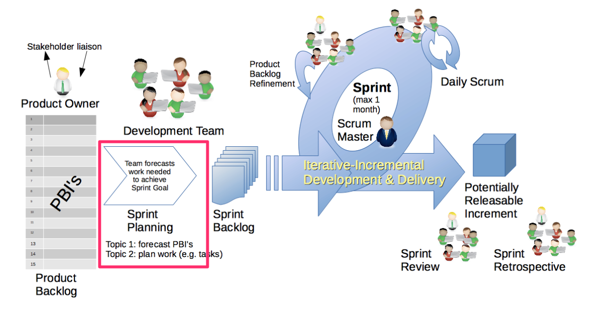{ width=440 }

{ width=440 }

# Sprintin suunnittelu

# Sprint planning

Translations of # Sprintin suunnittelu
[ Suomi -> English ]

# Sprintin suunnittelu
    # Sprint planning, # Planning the Sprint

- Ennen jokaista sprinttiä järjestetään sprintin _ suunnittelukokous _

- Before each sprint, a sprint _ planning meeting _ is organized

Translations of - Ennen jokaista sprinttiä järjestetään sprintin _ suunnittelukokous _
[ Suomi -> English ]

- Ennen jokaista sprinttiä järjestetään sprintin _ suunnittelukokous _
    - Before each sprint, a sprint _ planning meeting _ is organized, - A sprint _ planning meeting _ is organized before each sprint

- Kokouksella kaksi tavoitetta, Scrumin sanoin _aiheetta_

- The meeting has two goals, in the words of Scrum _no topic_

Translations of - Kokouksella kaksi tavoitetta, Scrumin sanoin _aiheetta_
[ Suomi -> English ]

- Kokouksella kaksi tavoitetta, Scrumin sanoin _aiheetta_
    - The meeting has two goals, in the words of Scrum _no topic_, - The meeting has two objectives, in the words of Scrum _no subject_

. . .

. . .

- Ensimmäisen aihe on selvittää **mitä** sprintin aikana tehdään

- The subject of the first one is to find out **what** will be done during the sprint

Translations of - Ensimmäisen aihe on selvittää **mitä** sprintin aikana tehdään
[ Suomi -> English ]

- Ensimmäisen aihe on selvittää **mitä** sprintin aikana tehdään
    - The subject of the first one is to find out **what** will be done during the sprint, - The topic of the first one is to find out **what** is done during the sprint

- Product owner esittelee product backlogin kärjessä olevat vaatimukset

- The product owner presents the requirements at the top of the product backlog

Translations of - Product owner esittelee product backlogin kärjessä olevat vaatimukset
[ Suomi -> English ]

- Product owner esittelee product backlogin kärjessä olevat vaatimukset
    - The product owner presents the requirements at the top of the product backlog, - Product owner presents the top requirements of the product backlog

- Tiimin tulee olla selvillä siitä, mitä vaatimuksilla tarkoitetaan

- The team must be clear about what is meant by the requirements

Translations of - Tiimin tulee olla selvillä siitä, mitä vaatimuksilla tarkoitetaan
[ Suomi -> English ]

- Tiimin tulee olla selvillä siitä, mitä vaatimuksilla tarkoitetaan
    - The team must be clear about what is meant by the requirements, - The team should be clear about what the requirements mean

- Tiimi arvioi kuinka monta backlogin vaatimuksista se kykenee sprintin aikana toteuttamaan

- The team estimates how many of the backlog requirements it is able to implement during the sprint

Translations of - Tiimi arvioi kuinka monta backlogin vaatimuksista se kykenee sprintin aikana toteuttamaan
[ Suomi -> English ]

- Tiimi arvioi kuinka monta backlogin vaatimuksista se kykenee sprintin aikana toteuttamaan
    - The team estimates how many of the backlog requirements it is able to implement during the sprint, - The team evaluates how many of the backlog requirements it is able to fulfill during the sprint

# Sprintin suunnittelu

# Sprint planning

Translations of # Sprintin suunnittelu
[ Suomi -> English ]

# Sprintin suunnittelu
    # Sprint planning, # Planning the Sprint

- Suunnittelukokouksen toisena aiheena on selvittää **miten** sprintin tavoitteet saavutetaan

- The second topic of the planning meeting is to find out **how** the goals of the sprint will be achieved

Translations of - Suunnittelukokouksen toisena aiheena on selvittää **miten** sprintin tavoitteet saavutetaan
[ Suomi -> English ]

- Suunnittelukokouksen toisena aiheena on selvittää **miten** sprintin tavoitteet saavutetaan
    - The second topic of the planning meeting is to find out **how** the goals of the sprint will be achieved, - Another topic of the planning meeting is to find out **how** the goals of the sprint are achieved

. . .

. . .

- Tämä yleensä edellyttää että tiimi suunnittelee toteutettavaksi valitut vaatimukset tarvittavalla tasolla

- This usually requires that the team plans the requirements selected for implementation at the necessary level

Translations of - Tämä yleensä edellyttää että tiimi suunnittelee toteutettavaksi valitut vaatimukset tarvittavalla tasolla
[ Suomi -> English ]

- Tämä yleensä edellyttää että tiimi suunnittelee toteutettavaksi valitut vaatimukset tarvittavalla tasolla
    - This usually requires that the team plans the requirements selected for implementation at the necessary level, - This usually requires that the team plans the requirements selected to be implemented at the required level

- Aikaansaannoksena on usein lista teknisistä _tehtävistä_ (task), jotka sprintin aikana on toteutettava

- The time commitment is often a list of technical _tasks_ (task) that must be implemented during the sprint

Translations of - Aikaansaannoksena on usein lista teknisistä _tehtävistä_ (task), jotka sprintin aikana on toteutettava
[ Suomi -> English ]

- Aikaansaannoksena on usein lista teknisistä _tehtävistä_ (task), jotka sprintin aikana on toteutettava
    - The time commitment is often a list of technical _tasks_ (task) that must be implemented during the sprint, - The time limit is often a list of technical _tasks_ (tasks) that must be implemented during the sprint

. . .

. . .

- Suunnittelun aikana identifioidut tehtävät kirjataan _sprintin backlogiin_ eli sprintin tehtävälistaan

- The tasks identified during planning are recorded in the _sprint backlog_, i.e. the sprint task list

Translations of - Suunnittelun aikana identifioidut tehtävät kirjataan _sprintin backlogiin_ eli sprintin tehtävälistaan
[ Suomi -> English ]

- Suunnittelun aikana identifioidut tehtävät kirjataan _sprintin backlogiin_ eli sprintin tehtävälistaan
    - The tasks identified during planning are recorded in the _sprint backlog_, i.e. the sprint task list, - Tasks identified during planning are recorded in the _sprint's backlog_, i.e. the sprint's task list

. . .

. . .

Palaamme sprintin suunnitteluun tarkemmin ja konkreettisten esimerkkien kanssa torstaina

We will return to sprint planning in more detail and with concrete examples on Thursday

Translations of Palaamme sprintin suunnitteluun tarkemmin ja konkreettisten esimerkkien kanssa torstaina
[ Suomi -> English ]

Palaamme sprintin suunnitteluun tarkemmin ja konkreettisten esimerkkien kanssa torstaina
    We will return to sprint planning in more detail and with concrete examples on Thursday, We will come back to the sprint planning in more detail and with concrete examples on Thursday

# Sprintin suunnittelu: *product backlogilta sprint backlogille*

# Sprint planning: *from product backlog to Sprint backlog*

Translations of # Sprintin suunnittelu: *product backlogilta sprint backlogille*
[ Suomi -> English ]

# Sprintin suunnittelu: *product backlogilta sprint backlogille*
    # Sprint planning: *from product backlog to Sprint backlog*, # Planning the sprint: *from product backlog to sprint backlog*

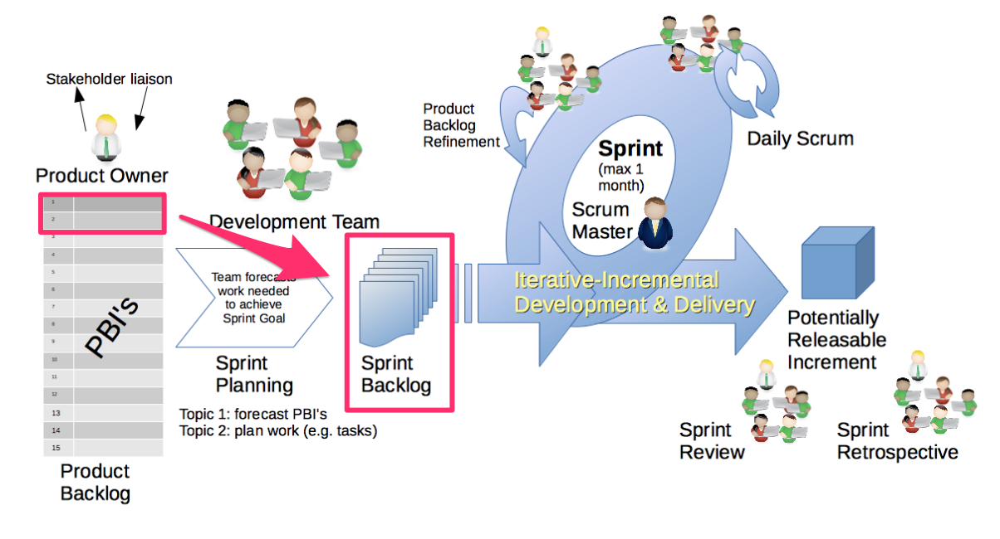{ width=440 }

{ width=440 }

# Daily scrum – päiväpalaveri

# Daily Scrum – daily meeting

Translations of # Daily scrum – päiväpalaveri
[ Suomi -> English ]

# Daily scrum – päiväpalaveri
    # Daily Scrum – daily meeting, # Daily Scrum – a day meeting

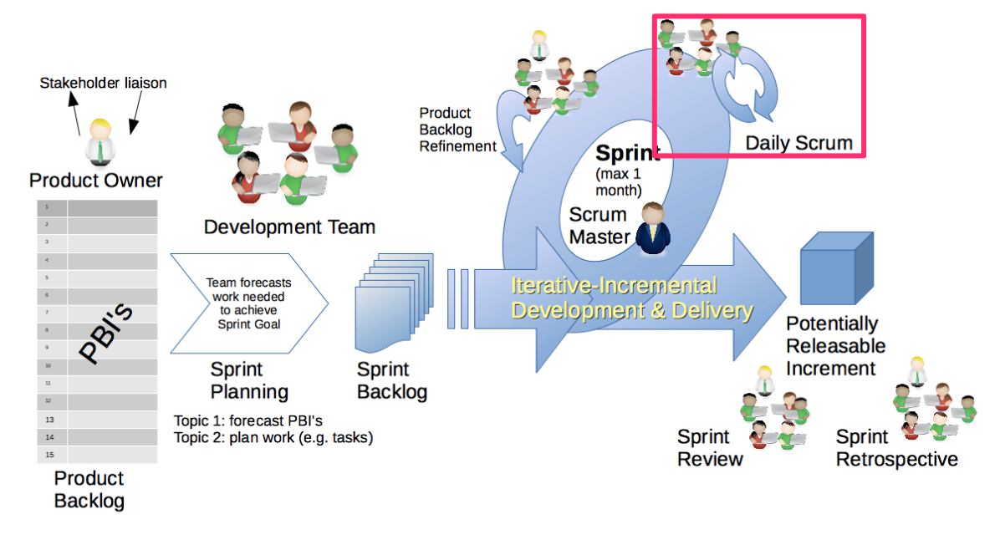{ width=440 }

{ width=440 }

# Daily scrum – päiväpalaveri

# Daily Scrum – daily meeting

Translations of # Daily scrum – päiväpalaveri
[ Suomi -> English ]

# Daily scrum – päiväpalaveri
    # Daily Scrum – daily meeting, # Daily Scrum – a day meeting

- Jokainen päivä sprintin aikana aloitetaan _daily scrumilla_ eli korkeintaan 15 minuutin mittaisella palaverilla

- Each day during the sprint starts with a _daily scrum_, i.e. a meeting lasting no more than 15 minutes

Translations of - Jokainen päivä sprintin aikana aloitetaan _daily scrumilla_ eli korkeintaan 15 minuutin mittaisella palaverilla
[ Suomi -> English ]

- Jokainen päivä sprintin aikana aloitetaan _daily scrumilla_ eli korkeintaan 15 minuutin mittaisella palaverilla
    - Each day during the sprint starts with a _daily scrum_, i.e. a meeting lasting no more than 15 minutes, - Every day during the sprint starts with a _daily scrum_, i.e. with a meeting lasting no more than 15 minutes

- Aina samaan aikaan, samassa paikassa, kaikkien kehittäjien oltava paikalla

- Always at the same time, in the same place, all developers must be there

Translations of - Aina samaan aikaan, samassa paikassa, kaikkien kehittäjien oltava paikalla
[ Suomi -> English ]

- Aina samaan aikaan, samassa paikassa, kaikkien kehittäjien oltava paikalla
    - Always at the same time, in the same place, all developers must be there, - Always at the same time, in the same place, all the developers must be present

. . .

. . .

- Jokainen tiimin jäsen vastaa vuorollaan kolmeen kysymykseen

- Each team member answers three questions in turn

Translations of - Jokainen tiimin jäsen vastaa vuorollaan kolmeen kysymykseen
[ Suomi -> English ]

- Jokainen tiimin jäsen vastaa vuorollaan kolmeen kysymykseen
    - Each team member answers three questions in turn, - Each member of the team takes turns answering three questions

- Mitä sain aikaan edellisen tapaamisen jälkeen?

- What did I accomplish after the last meeting?

Translations of - Mitä sain aikaan edellisen tapaamisen jälkeen?
[ Suomi -> English ]

- Mitä sain aikaan edellisen tapaamisen jälkeen?
    - What did I accomplish after the last meeting?, - What did I accomplish after the previous meeting?

- Mitä aion saada aikaan ennen seuraavaa tapaamista?

- What am I going to accomplish before the next meeting?

Translations of - Mitä aion saada aikaan ennen seuraavaa tapaamista?
[ Suomi -> English ]

- Mitä aion saada aikaan ennen seuraavaa tapaamista?
    - What am I going to accomplish before the next meeting?, - What will I accomplish before the next meeting?

- Mitä esteitä etenemiselläni on?

- What are the obstacles to my progress?

Translations of - Mitä esteitä etenemiselläni on?
[ Suomi -> English ]

- Mitä esteitä etenemiselläni on?
    - What are the obstacles to my progress?, - What obstacles are there in my progress?

. . .

. . .

- Kuka tahansa saa olla seuraamassa daily scrumia, mutta vain tiimin jäsenillä on puheoikeus

- Anyone can follow the daily scrum, but only team members have the right to speak

Translations of - Kuka tahansa saa olla seuraamassa daily scrumia, mutta vain tiimin jäsenillä on puheoikeus
[ Suomi -> English ]

- Kuka tahansa saa olla seuraamassa daily scrumia, mutta vain tiimin jäsenillä on puheoikeus
    - Anyone can follow the daily scrum, but only team members have the right to speak, - Anyone can be watching the daily scrum, but only team members have the right to speak

. . .

. . .

- Palaverin on tarkoitus olla lyhyt, muu keskustelu ei sallittua

- The meeting is supposed to be short, no other conversation is allowed

Translations of - Palaverin on tarkoitus olla lyhyt, muu keskustelu ei sallittua
[ Suomi -> English ]

- Palaverin on tarkoitus olla lyhyt, muu keskustelu ei sallittua
    - The meeting is supposed to be short, no other conversation is allowed, - The meeting is meant to be short, no other discussion is allowed

- Jos jollakin on ongelmia, scrum master keskustelee asianomaisen kanssa daily scrumin jälkeen

- If someone has problems, the Scrum master talks with the person concerned after the daily Scrum

Translations of - Jos jollakin on ongelmia, scrum master keskustelee asianomaisen kanssa daily scrumin jälkeen
[ Suomi -> English ]

- Jos jollakin on ongelmia, scrum master keskustelee asianomaisen kanssa daily scrumin jälkeen
    - If someone has problems, the Scrum master talks with the person concerned after the daily Scrum, - If someone has problems, the Scrum master will talk to the person concerned after the daily Scrum

. . .

. . .

- Jos muuhun palaverointiin tarvetta, tulee palaverit järjestää daily scrumista erillään

- If there is a need for other meetings, the meetings should be organized separately from the daily scrum

Translations of - Jos muuhun palaverointiin tarvetta, tulee palaverit järjestää daily scrumista erillään
[ Suomi -> English ]

- Jos muuhun palaverointiin tarvetta, tulee palaverit järjestää daily scrumista erillään
    - If there is a need for other meetings, the meetings should be organized separately from the daily scrum, - If there is a need for other meetings, meetings should be organized separately from daily scrum

# Sprintin katselmointi

# Sprint viewing

Translations of # Sprintin katselmointi
[ Suomi -> English ]

# Sprintin katselmointi
    # Sprint viewing, # Viewing the sprint

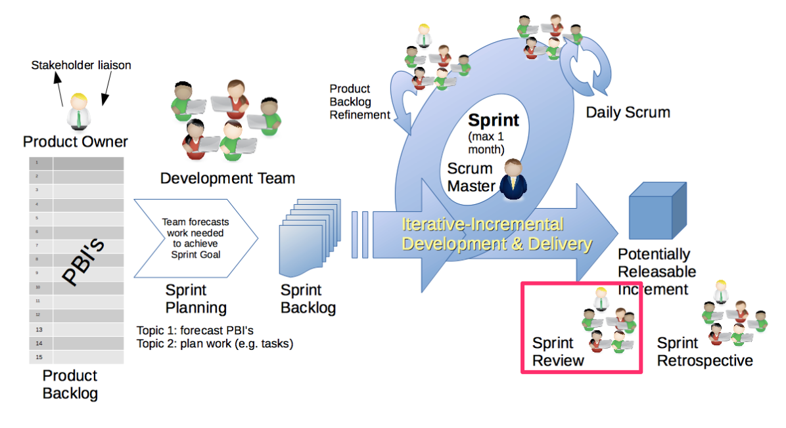{ width=440 }

{ width=440 }

# Sprintin katselmointi

# Sprint viewing

Translations of # Sprintin katselmointi
[ Suomi -> English ]

# Sprintin katselmointi
    # Sprint viewing, # Viewing the sprint

- Sprintin päätteeksi järjestetään _ sprint review _ eli katselmointi

- Sprint review is organized at the end of the sprint

Translations of - Sprintin päätteeksi järjestetään _ sprint review _ eli katselmointi
[ Suomi -> English ]

- Sprintin päätteeksi järjestetään _ sprint review _ eli katselmointi
    - Sprint review is organized at the end of the sprint, - At the end of the Sprint, _ Sprint review _ is organized

- Katselmointiin voi osallistua kuka tahansa

- Anyone can participate in the viewing

Translations of - Katselmointiin voi osallistua kuka tahansa
[ Suomi -> English ]

- Katselmointiin voi osallistua kuka tahansa
    - Anyone can participate in the viewing, - Anyone can take part in viewing

. . .

. . .

- Tiimi esittelee sprintin aikaansaannoksia

- The team presents the achievements of the sprint

Translations of - Tiimi esittelee sprintin aikaansaannoksia
[ Suomi -> English ]

- Tiimi esittelee sprintin aikaansaannoksia
    - The team presents the achievements of the sprint, - The team presents the sprint achievements

- tarkastellaan/demotaan toteutettua toimivaa ohjelmistoa

- we look at/demo the implemented working software

Translations of - tarkastellaan/demotaan toteutettua toimivaa ohjelmistoa
[ Suomi -> English ]

- tarkastellaan/demotaan toteutettua toimivaa ohjelmistoa
    - we look at/demo the implemented working software, - the implemented working software is examined/demozed

. . .

. . .

- Scrum master huolehtii, että ainoastaan definition of donen mukaisesti toteutetut vaatimukset demotaan

- The scrum master ensures that only the requirements implemented according to the definition of done are demoted

Translations of - Scrum master huolehtii, että ainoastaan definition of donen mukaisesti toteutetut vaatimukset demotaan
[ Suomi -> English ]

- Scrum master huolehtii, että ainoastaan definition of donen mukaisesti toteutetut vaatimukset demotaan
    - The scrum master ensures that only the requirements implemented according to the definition of done are demoted, - The Scrum master ensures that only the requirements implemented in accordance with the definition of done are demoted

. . .

. . .

- Product owner varmistaa, mitkä vaatimuksista toteutettiin hyväksyttävällä tavalla

- The product owner verifies which of the requirements were implemented in an acceptable manner

Translations of - Product owner varmistaa, mitkä vaatimuksista toteutettiin hyväksyttävällä tavalla
[ Suomi -> English ]

- Product owner varmistaa, mitkä vaatimuksista toteutettiin hyväksyttävällä tavalla
    - The product owner verifies which of the requirements were implemented in an acceptable manner, - The product owner verifies which of the requirements were implemented in an acceptable way

- Ne vaatimukset joita ei hyväksytä toteutetuksi siirretään takaisin product backlogiin

- The requirements that are not accepted as implemented are moved back to the product backlog

Translations of - Ne vaatimukset joita ei hyväksytä toteutetuksi siirretään takaisin product backlogiin
[ Suomi -> English ]

- Ne vaatimukset joita ei hyväksytä toteutetuksi siirretään takaisin product backlogiin
    - The requirements that are not accepted as implemented are moved back to the product backlog, - The requirements that are not accepted as implemented are transferred back to the product backlog

# Sprintin katselmointi

# Sprint viewing

Translations of # Sprintin katselmointi
[ Suomi -> English ]

# Sprintin katselmointi
    # Sprint viewing, # Viewing the sprint

- Katselmoinnin aikana kuka tahansa saa antaa palautetta tuotteesta ja esim.  ehdottaa uusia vaatimuksia lisättäväksi product backlogiin

- During the viewing, anyone can give feedback about the product and e.g. suggests new requirements to be added to the product backlog

Translations of - Katselmoinnin aikana kuka tahansa saa antaa palautetta tuotteesta ja esim.  ehdottaa uusia vaatimuksia lisättäväksi product backlogiin
[ Suomi -> English ]

- Katselmoinnin aikana kuka tahansa saa antaa palautetta tuotteesta ja esim.
    - During the viewing, anyone can give feedback about the product and e.g., - During viewing, anyone can give feedback on the product and e.g.
ehdottaa uusia vaatimuksia lisättäväksi product backlogiin
    suggests new requirements to be added to the product backlog, propose new requirements to be added to the product backlog

. . .

. . .

- Katselmointi aiheuttaa usein myös tarpeen product backlogin uudelleenpriorisoimiseen

- Viewing often also causes the need to reprioritize the product backlog

Translations of - Katselmointi aiheuttaa usein myös tarpeen product backlogin uudelleenpriorisoimiseen
[ Suomi -> English ]

- Katselmointi aiheuttaa usein myös tarpeen product backlogin uudelleenpriorisoimiseen
    - Viewing often also causes the need to reprioritize the product backlog, - Review often also causes the need to reprioritize the product backlog

# Retrospektiivi

# Retrospective

Translations of # Retrospektiivi
[ Eesti -> English ]

# Retrospektiivi
    # Retrospective, # In retrospect

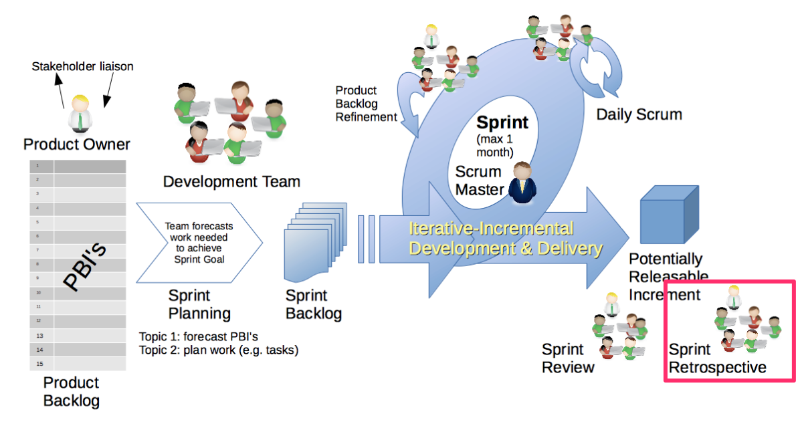{ width=440 }

{ width=440 }

# Retrospektiivi

# Retrospective

Translations of # Retrospektiivi
[ Eesti -> English ]

# Retrospektiivi
    # Retrospective, # In retrospect

- _Retrospektiivi_ on sprintin katselmoinnin ja seuraavan sprintin alun välissä pidettävä palaveri, jonka aikana tiimi tarkastelee omaa työskentelyprosessiaan

- _Retrospective_ is a meeting held between the sprint review and the start of the next sprint, during which the team examines its own working process

Translations of - _Retrospektiivi_ on sprintin katselmoinnin ja seuraavan sprintin alun välissä pidettävä palaveri, jonka aikana tiimi tarkastelee omaa työskentelyprosessiaan
[ Suomi -> English ]

- _Retrospektiivi_ on sprintin katselmoinnin ja seuraavan sprintin alun välissä pidettävä palaveri, jonka aikana tiimi tarkastelee omaa työskentelyprosessiaan
    - _Retrospective_ is a meeting held between the sprint review and the start of the next sprint, during which the team examines its own working process, - _Retrospective_ is a meeting held between the review of the sprint and the start of the next sprint, during which the team reviews its own working process

. . .

. . .

- Identifioidaan mikä meni hyvin ja missä asioissa on parantamisen varaa

- We identify what went well and where there is room for improvement

Translations of - Identifioidaan mikä meni hyvin ja missä asioissa on parantamisen varaa
[ Suomi -> English ]

- Identifioidaan mikä meni hyvin ja missä asioissa on parantamisen varaa
    - We identify what went well and where there is room for improvement, - We will identify what went well and in which areas there is room for improvement

. . .

. . .

- Mietitään ratkaisuja ongelmakohtiin, joita pyritään korjaamaan seuraavan sprintin aikana

- Let's think about solutions to problem areas, which we aim to fix during the next sprint

Translations of - Mietitään ratkaisuja ongelmakohtiin, joita pyritään korjaamaan seuraavan sprintin aikana
[ Suomi -> English ]

- Mietitään ratkaisuja ongelmakohtiin, joita pyritään korjaamaan seuraavan sprintin aikana
    - Let's think about solutions to problem areas, which we aim to fix during the next sprint, - Let's think about solutions to problem areas, which will be corrected during the next sprint

# Retrospektiivi

# Retrospective

Translations of # Retrospektiivi
[ Eesti -> English ]

# Retrospektiivi
    # Retrospective, # In retrospect

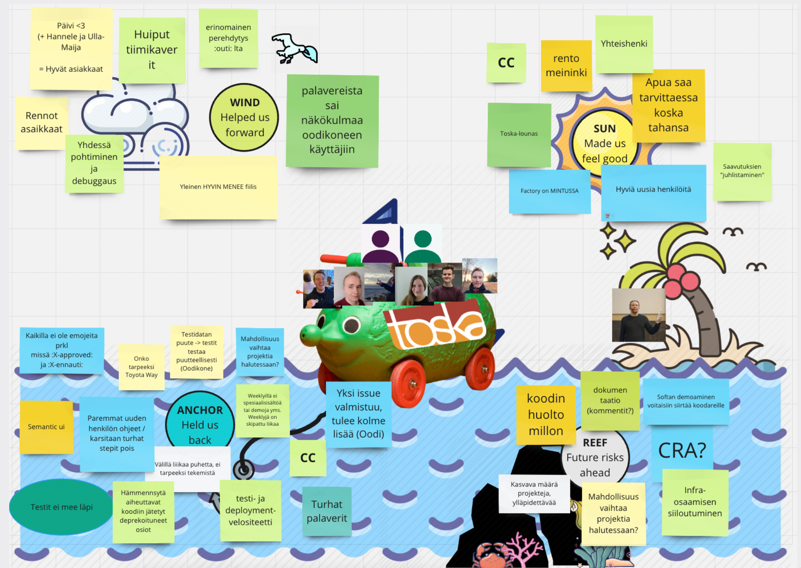{ width=440 }

{ width=440 }

# Transparency - inspect - adapt

# Transparency - inspect - adapt

- Scrumin taustaperiaatteet ovat

- The underlying principles of Scrum are

Translations of - Scrumin taustaperiaatteet ovat
[ Suomi -> English ]

- Scrumin taustaperiaatteet ovat
    - The underlying principles of Scrum are, - The basic principles of Scrum are

- _transparency_ (läpinäkyvyys)

- _transparency_ (transparency)

Translations of - _transparency_ (läpinäkyvyys)
[ Suomi -> English ]

- _transparency_ (läpinäkyvyys)
    - _transparency_ (transparency), - _transparency_

- _inspection_ (tarkkailu)

- _inspection_ (observation)

Translations of - _inspection_ (tarkkailu)
[ Suomi -> English ]

- _inspection_ (tarkkailu)
    - _inspection_ (observation), - _inspection_

- _adaption_ (mukauttaminen)

- _adaption_ (adaptation)

Translations of - _adaption_ (mukauttaminen)
[ Suomi -> English ]

- _adaption_ (mukauttaminen)
    - _adaption_ (adaptation), - _adaption_

. . .

. . .

- Asioiden läpinäkyvyys mahdollistaa niiden jatkuvan tarkkailun

- The transparency of things enables them to be constantly monitored

Translations of - Asioiden läpinäkyvyys mahdollistaa niiden jatkuvan tarkkailun
[ Suomi -> English ]

- Asioiden läpinäkyvyys mahdollistaa niiden jatkuvan tarkkailun
    - The transparency of things enables them to be constantly monitored, - The transparency of things enables them to be monitored continuously

- ja sen seurauksena toimintatapoja ja kehitettävää tuotetta on mahdollista mukauttaa

- and as a result, it is possible to adapt the operating methods and the product being developed

Translations of - ja sen seurauksena toimintatapoja ja kehitettävää tuotetta on mahdollista mukauttaa
[ Suomi -> English ]

- ja sen seurauksena toimintatapoja ja kehitettävää tuotetta on mahdollista mukauttaa
    - and as a result, it is possible to adapt the operating methods and the product being developed, - and as a result, it is possible to adapt the operating methods and the product under development

. . .

. . .

- Läpinäkyvyys: backlogit, daily scrum, definition of done, sprintin katselmointi, product increment...

- Transparency: backlogs, daily scrum, definition of done, sprint review, product increment...

Translations of - Läpinäkyvyys: backlogit, daily scrum, definition of done, sprintin katselmointi, product increment...
[ Suomi -> English ]

- Läpinäkyvyys: backlogit, daily scrum, definition of done, sprintin katselmointi, product increment...
    - Transparency: backlogs, daily scrum, definition of done, sprint review, product increment..., - Transparency: backlogs, daily scrum, definition of done, sprint viewing, product increment...

. . .

. . .

- Lyhyt kehityssykli mahdollistaa sekä tuotteen että toimintatapojen nopean inkrementaalisen parantamisen

- A short development cycle enables rapid incremental improvement of both the product and the operating methods

Translations of - Lyhyt kehityssykli mahdollistaa sekä tuotteen että toimintatapojen nopean inkrementaalisen parantamisen
[ Suomi -> English ]

- Lyhyt kehityssykli mahdollistaa sekä tuotteen että toimintatapojen nopean inkrementaalisen parantamisen
    - A short development cycle enables rapid incremental improvement of both the product and the operating methods, - The short development cycle enables fast incremental improvement of both the product and the operating methods

- backlogia uudelleenpriorisoidaan ja muokataan palautteen sekä opitun perusteella

- the backlog is reprioritized and edited based on feedback and lessons learned

Translations of - backlogia uudelleenpriorisoidaan ja muokataan palautteen sekä opitun perusteella
[ Suomi -> English ]

- backlogia uudelleenpriorisoidaan ja muokataan palautteen sekä opitun perusteella
    - the backlog is reprioritized and edited based on feedback and lessons learned, - the backlog is re-prioritised and modified based on feedback and lessons learned

- retrospektiivi kannustaa tiimiä jatkuvasti parantamaan työprosessiaan

- the retrospective encourages the team to continuously improve their work process

Translations of - retrospektiivi kannustaa tiimiä jatkuvasti parantamaan työprosessiaan
[ Suomi -> English ]

- retrospektiivi kannustaa tiimiä jatkuvasti parantamaan työprosessiaan
    - the retrospective encourages the team to continuously improve their work process, - the retrospective encourages the team to constantly improve its work process

# Scrumin arvot

# The values of Scrum

Translations of # Scrumin arvot
[ Suomi -> English ]

# Scrumin arvot
    # The values of Scrum, # Scrum's values

- Scrum sisältää joukon _arvoja_ joiden noudattamista se pitää oleellisena: _commitment, focus, courage, respect_

- Scrum contains a set of _values_ whose observance it considers essential: _commitment, focus, courage, respect_

Translations of - Scrum sisältää joukon _arvoja_ joiden noudattamista se pitää oleellisena: _commitment, focus, courage, respect_
[ Suomi -> English ]

- Scrum sisältää joukon _arvoja_ joiden noudattamista se pitää oleellisena: _commitment, focus, courage, respect_
    - Scrum contains a set of _values_ whose observance it considers essential: _commitment, focus, courage, respect_, - Scrum contains a set of _values_ which it considers essential to follow: _commitment, focus, courage, respect_

. . .

. . .

- tiimin tulee olla _sitoutunut_ (commitment) yhteisen tavoitteen saavuttamiseksi

- the team must be _committed_ (commitment) to achieve the common goal

Translations of - tiimin tulee olla _sitoutunut_ (commitment) yhteisen tavoitteen saavuttamiseksi
[ Suomi -> English ]

- tiimin tulee olla _sitoutunut_ (commitment) yhteisen tavoitteen saavuttamiseksi
    - the team must be _committed_ (commitment) to achieve the common goal, - the team must be _committed_ to achieve a common goal

. . .

. . .

- ja _fokusoitua_ (focus) oikeiden asioiden tekemiseen

- and to _focus_ on doing the right things

Translations of - ja _fokusoitua_ (focus) oikeiden asioiden tekemiseen
[ Suomi -> English ]

- ja _fokusoitua_ (focus) oikeiden asioiden tekemiseen
    - and to _focus_ on doing the right things, - and to _focus_ (focus) on doing the right things

. . .

. . .

- tulee olla _rohkeutta_ (courage) tehdä päätöksiä ja kohdata myös vaikeimpia asioita

- you must have _courage_ to make decisions and face even the most difficult things

Translations of - tulee olla _rohkeutta_ (courage) tehdä päätöksiä ja kohdata myös vaikeimpia asioita
[ Suomi -> English ]

- tulee olla _rohkeutta_ (courage) tehdä päätöksiä ja kohdata myös vaikeimpia asioita
    - you must have _courage_ to make decisions and face even the most difficult things, - one must have _courage_ to make decisions and face even the most difficult issues

- tulee olla avoimia sekä onnistumisten että ongelmien suhteen

- must be open about both successes and problems

Translations of - tulee olla avoimia sekä onnistumisten että ongelmien suhteen
[ Suomi -> English ]

- tulee olla avoimia sekä onnistumisten että ongelmien suhteen
    - must be open about both successes and problems, - should be open to both successes and problems

. . .

. . .

- oleellista on _kunnioittaa_ (respect) koko ajan kaikkia kehitystiimin jäseniä sekä ohjelmiston sidosryhmiä

- it is essential to _respect_ all the members of the development team and the stakeholders of the software at all times

Translations of - oleellista on _kunnioittaa_ (respect) koko ajan kaikkia kehitystiimin jäseniä sekä ohjelmiston sidosryhmiä
[ Suomi -> English ]

- oleellista on _kunnioittaa_ (respect) koko ajan kaikkia kehitystiimin jäseniä sekä ohjelmiston sidosryhmiä
    - it is essential to _respect_ all the members of the development team and the stakeholders of the software at all times, - it is essential to _respect_ all the development team members and software stakeholders at all times

# Scrumin tehokas soveltaminen

# Effective application of Scrum

Translations of # Scrumin tehokas soveltaminen
[ Suomi -> English ]

# Scrumin tehokas soveltaminen
    # Effective application of Scrum, # Efficient application of scrum

- Jotta Scrum toimisi _tehokkaasti_, tarvitaan sen soveltamiseen sopiva asenne ja orientaatio, eli on noudatettava Scrumin arvoja

- In order for Scrum to work _effectively_, a suitable attitude and orientation are needed for its application, i.e. the values of Scrum must be followed

Translations of - Jotta Scrum toimisi _tehokkaasti_, tarvitaan sen soveltamiseen sopiva asenne ja orientaatio, eli on noudatettava Scrumin arvoja
[ Suomi -> English ]

- Jotta Scrum toimisi _tehokkaasti_, tarvitaan sen soveltamiseen sopiva asenne ja orientaatio, eli on noudatettava Scrumin arvoja
    - In order for Scrum to work _effectively_, a suitable attitude and orientation are needed for its application, i.e. the values of Scrum must be followed, - In order for Scrum to work _effectively_, an attitude and orientation suitable for its application are needed, i.e. the values of Scrum must be followed

. . .

. . .

- Scrumin tekemisen ei ole tarkoitus olla ainoastaan pelisäänöjen orjallista noudattamista

- Doing Scrum is not meant to be only slavishly following the rules of the game

Translations of - Scrumin tekemisen ei ole tarkoitus olla ainoastaan pelisäänöjen orjallista noudattamista
[ Suomi -> English ]

- Scrumin tekemisen ei ole tarkoitus olla ainoastaan pelisäänöjen orjallista noudattamista
    - Doing Scrum is not meant to be only slavishly following the rules of the game, - Doing Scrum is not meant to be only slavishly following the game rules

. . .

. . .

- Scrumin inspect-and-adapt (tarkkaile ja mukauta) -luonne ohjaa siihen, **tiimien on koko ajan mukautettava toimintaansa**

- The inspect-and-adapt nature of Scrum leads to **teams must constantly adapt their operations**

Translations of - Scrumin inspect-and-adapt (tarkkaile ja mukauta) -luonne ohjaa siihen, **tiimien on koko ajan mukautettava toimintaansa**
[ Suomi -> English ]

- Scrumin inspect-and-adapt (tarkkaile ja mukauta) -luonne ohjaa siihen, **tiimien on koko ajan mukautettava toimintaansa**
    - The inspect-and-adapt nature of Scrum leads to **teams must constantly adapt their operations**, - Scrum's inspect-and-adapt nature guides it, **teams must constantly adapt their actions**

. . .

. . .

- *Tiimien optimaalisen toiminnan kannalta on joskus parempi toimia jopa joidenkin Scrumin ohjeiden vastaisesti*

- *In terms of the optimal functioning of teams, it is sometimes better to act even against some Scrum guidelines*

Translations of - *Tiimien optimaalisen toiminnan kannalta on joskus parempi toimia jopa joidenkin Scrumin ohjeiden vastaisesti*
[ Suomi -> English ]

- *Tiimien optimaalisen toiminnan kannalta on joskus parempi toimia jopa joidenkin Scrumin ohjeiden vastaisesti*
    - *In terms of the optimal functioning of teams, it is sometimes better to act even against some Scrum guidelines*, - *In terms of the optimal functioning of the teams, it is sometimes better to act even against some Scrum instructions*

# Scrumin ongelmat

# Problems with Scrum

Translations of # Scrumin ongelmat
[ Suomi -> English ]

# Scrumin ongelmat
    # Problems with Scrum, # Scrum issues

- Scrum on osoittautunut monin paikoin paremmaksi tavaksi ohjelmistojen tuottamiseen kuin vesiputousmalli tai muut suunnitelmavetoiset mallit

- In many places, Scrum has proven to be a better way to produce software than the waterfall model or other plan-driven models

Translations of - Scrum on osoittautunut monin paikoin paremmaksi tavaksi ohjelmistojen tuottamiseen kuin vesiputousmalli tai muut suunnitelmavetoiset mallit
[ Suomi -> English ]

- Scrum on osoittautunut monin paikoin paremmaksi tavaksi ohjelmistojen tuottamiseen kuin vesiputousmalli tai muut suunnitelmavetoiset mallit
    - In many places, Scrum has proven to be a better way to produce software than the waterfall model or other plan-driven models, - Scrum has proven in many places to be a better method for producing software than the waterfall model or other plan-driven models

. . .

. . .

- Yleinen ratkaisu ohjelmistotuotannon ongelmiin se ei ole

- It is not a general solution to the problems of software production

Translations of - Yleinen ratkaisu ohjelmistotuotannon ongelmiin se ei ole
[ Suomi -> English ]

- Yleinen ratkaisu ohjelmistotuotannon ongelmiin se ei ole
    - It is not a general solution to the problems of software production, - It's not a general solution to software production problems

- Scrumin käytön yleistyessä myös epäonnistuneiden Scrum-projektien määrä kasvaa

- As the use of Scrum becomes more common, the number of failed Scrum projects also increases

Translations of - Scrumin käytön yleistyessä myös epäonnistuneiden Scrum-projektien määrä kasvaa
[ Suomi -> English ]

- Scrumin käytön yleistyessä myös epäonnistuneiden Scrum-projektien määrä kasvaa
    - As the use of Scrum becomes more common, the number of failed Scrum projects also increases, - As the use of Scrum becomes more common, the number of failed Scrum projects increases as well

. . .

. . .

- Yksi ongelmista on ns.  **scrumbut**

- One of the problems is the so-called **scrumbut**

Translations of - Yksi ongelmista on ns.  **scrumbut**
[ Suomi -> English ]

- Yksi ongelmista on ns.
    - One of the problems is the so-called, - One of the problems is the
**scrumbut**
    **scrumbut**, **scrumbs**

- We use Scrum, **but** having a Daily Scrum every day is too much overhead, so we only have one per week.

- We use Scrum, **but** having a Daily Scrum every day is too much overhead, so we only have one per week.

- We use Scrum, **but** retrospectives are a waste of time, so we don't do them.

- We use Scrum, **but** retrospectives are a waste of time, so we don't do them.

- We use Scrum, **but** we can't build a piece of functionality in two weeks, so our Sprints are 3 months long

- We use Scrum, **but** we can't build a piece of functionality in two weeks, so our Sprints are 3 months long

. . .

. . .

- Transparency-inspect-adapt voi vaarantua

- Transparency-inspect-adapt can be compromised

Translations of - Transparency-inspect-adapt voi vaarantua
[ Suomi -> English ]

- Transparency-inspect-adapt voi vaarantua
    - Transparency-inspect-adapt can be compromised, - Transparency-inspect-adapt could be compromised

# Scrumin ongelmia Robert Martinin listaamina

# Problems with Scrum as listed by Robert Martin

Translations of # Scrumin ongelmia Robert Martinin listaamina
[ Suomi -> English ]

# Scrumin ongelmia Robert Martinin listaamina
    # Problems with Scrum as listed by Robert Martin, # Scrum problems listed by Robert Martin

- No Technical Practices

- No Technical Practices

. . .

. . .

- Automated Testing

- Automated Testing

. . .

. . .

- Certification in CSM

- Certification in CSM

. . .

. . .

- Scrum Master sometimes turns into Project Manager

- Scrum Master sometimes turns into Project Manager

. . .

. . .

- Scrum carries an anti-management undercurrent: "Scrum over-emphasizes the role of the team as self-managing

- Scrum carries an anti-management undercurrent: "Scrum over-emphasizes the role of the team as self-managing

. . .

. . .

- Scrum and generic Agile have little to say about how to scale

- Scrum and generic Agile have little to say about how to scale

. . .

. . .

- Insufficient Guidance Regarding the Product Backlog

- Insufficient Guidance Regarding the Product Backlog

# Waterscrumfall

# Waterscrumfall

- Yleisesti raportoitu ongelma ketterään ohjelmistokehitykseen siirryttäessä on se, että muu organisaatio jää ennalleen

- A commonly reported problem when moving to agile software development is that the rest of the organization remains the same

Translations of - Yleisesti raportoitu ongelma ketterään ohjelmistokehitykseen siirryttäessä on se, että muu organisaatio jää ennalleen
[ Suomi -> English ]

- Yleisesti raportoitu ongelma ketterään ohjelmistokehitykseen siirryttäessä on se, että muu organisaatio jää ennalleen
    - A commonly reported problem when moving to agile software development is that the rest of the organization remains the same, - A commonly reported problem when transitioning to agile software development is that the rest of the organization remains the same

. . .

. . .

- Waterscrumfall

- Waterscrumfall

- ohjelmistokehitys tapahtuu Scrumia mukaillen

- software development takes place according to Scrum

Translations of - ohjelmistokehitys tapahtuu Scrumia mukaillen
[ Suomi -> English ]

- ohjelmistokehitys tapahtuu Scrumia mukaillen
    - software development takes place according to Scrum, - software development is done in accordance with Scrum

- budjetointi, vaatimusten hallinta sekä tuotantoonvienti etenevät edelleen vanhoja kontrolloituja prosesseja noudattaen

- budgeting, requirements management and production import continue to follow the old controlled processes

Translations of - budjetointi, vaatimusten hallinta sekä tuotantoonvienti etenevät edelleen vanhoja kontrolloituja prosesseja noudattaen
[ Suomi -> English ]

- budjetointi, vaatimusten hallinta sekä tuotantoonvienti etenevät edelleen vanhoja kontrolloituja prosesseja noudattaen
    - budgeting, requirements management and production import continue to follow the old controlled processes, - budgeting, requirements management and production import and export continue to follow the old controlled processes

. . .

. . .

- Päätetään alustava Scrumiin tutustumisemme menetelmän kehittäjien sanoihin:

- Let's conclude our preliminary introduction to Scrum with the words of the developers of the method:

Translations of - Päätetään alustava Scrumiin tutustumisemme menetelmän kehittäjien sanoihin:
[ Suomi -> English ]

- Päätetään alustava Scrumiin tutustumisemme menetelmän kehittäjien sanoihin:
    - Let's conclude our preliminary introduction to Scrum with the words of the developers of the method:, - Let's conclude our preliminary introduction to Scrum with the words of the method developers:

**Scrum is easy to undestand but extremely difficult to master**

**Scrum is easy to undestand but extremely difficult to master**

% Ohjelmistotuotanto

% Software production

Translations of % Ohjelmistotuotanto
[ Suomi -> English ]

% Ohjelmistotuotanto
    % Software production, % Software manufacturing

% Matti Luukkainen ja ohjaajat Antti, Pooki, Riku, Sini, Taneli

% Matti Luukkainen and directors Antti, Pooki, Riku, Sini, Taneli

Translations of % Matti Luukkainen ja ohjaajat Antti, Pooki, Riku, Sini, Taneli
[ Suomi -> English ]

% Matti Luukkainen ja ohjaajat Antti, Pooki, Riku, Sini, Taneli
    % Matti Luukkainen and directors Antti, Pooki, Riku, Sini, Taneli, % Matti Luukkainen and the instructors Antti, Pooki, Riku, Sini, Taneli

% syksy 2024

% autumn 2024

Translations of % syksy 2024
[ Suomi -> English ]

% syksy 2024
    % autumn 2024, % fall 2024

#

#

                                      Luento 3

                                     Lecture 3

                                    7.11.2024

                                    7.11.2024

# Kurssipalaute

# Course feedback

Translations of # Kurssipalaute
[ Suomi -> English ]

# Kurssipalaute
    # Course feedback, # Lesson feedback

- Kurssipalaute

- Course feedback

Translations of - Kurssipalaute
[ Suomi -> English ]

- Kurssipalaute
    - Course feedback, - Lesson feedback

- Kurssilla lopussa kerättävän palautteen lisäksi ns.  jatkuva palaute https://norppa.helsinki.fi

- In addition to the feedback collected at the end of the course, the so-called continuous feedback https://norppa.helsinki.fi

Translations of - Kurssilla lopussa kerättävän palautteen lisäksi ns.  jatkuva palaute https://norppa.helsinki.fi
[ Suomi -> English ]

- Kurssilla lopussa kerättävän palautteen lisäksi ns.
    - In addition to the feedback collected at the end of the course, the so-called, - In addition to the feedback gathered at the end of the course, so-called
jatkuva palaute https://norppa.helsinki.fi
    continuous feedback https://norppa.helsinki.fi, ongoing feedback https://norppa.helsinki.fi

#

#

- Luennot

- Lectures

Definitions of - Luennot
[ Suomi -> English ]

noun
    lecture
        luento, esitelmä, saarna, nuhdesaarna, läksytys

- Luennot
    - Lectures, - The lectures

- huomenna klo 12-14 B123

- tomorrow from 12:00 to 14:00 B123

Translations of - huomenna klo 12-14 B123
[ Suomi -> English ]

- huomenna klo 12-14 B123
    - tomorrow from 12:00 to 14:00 B123, - tomorrow from 12-14 B123

- ensi viikosta alkaen ma ja ti 12-14 B123

- starting next week Mon and Tue 12-14 B123

Translations of - ensi viikosta alkaen ma ja ti 12-14 B123
[ Suomi -> English ]

- ensi viikosta alkaen ma ja ti 12-14 B123
    - starting next week Mon and Tue 12-14 B123, - starting next week, Mon and Tue 12-2 PM B123

- Pajaa salissa BK107

- Workshop in hall BK107

Translations of - Pajaa salissa BK107
[ Suomi -> English ]

- Pajaa salissa BK107
    - Workshop in hall BK107, - The workshop in hall BK107

- ma 14-16

- ma 14-16

- to 13-15

- to 13-15

- pe 12-14 (huomenna poikkeuksellisesti klo 14-16)

- Friday 12-14 (exceptionally tomorrow 14-16)

Translations of - pe 12-14 (huomenna poikkeuksellisesti klo 14-16)
[ Suomi -> English ]

- pe 12-14 (huomenna poikkeuksellisesti klo 14-16)
    - Friday 12-14 (exceptionally tomorrow 14-16), - Friday 12-2pm (exceptionally tomorrow 2-4pm)

# Miniprojektit

# Mini projects

Translations of # Miniprojektit
[ Suomi -> English ]

# Miniprojektit
    # Mini projects, # Mini-projects

- Käynnistyvät 11.11 alkavalla viikolla

- Will start in the week starting 11.11

Translations of - Käynnistyvät 11.11 alkavalla viikolla
[ Suomi -> English ]

- Käynnistyvät 11.11 alkavalla viikolla
    - Will start in the week starting 11.11, - Starts in the week starting 11.11

- **Ilmoittautumisen deadline su 10.11.  klo 23.59**

- **Registration deadline Sun 10.11. at 23:59**

Translations of - **Ilmoittautumisen deadline su 10.11.  klo 23.59**
[ Suomi -> English ]

- **Ilmoittautumisen deadline su 10.11.
    - **Registration deadline Sun 10.11., - **Deadline for registration Sun 10.11.
klo 23.59**
    at 23:59**, at 11:59 p.m.**

- Aloitustilaisuudet

- Opening ceremonies

Translations of - Aloitustilaisuudet
[ Suomi -> English ]

- Aloitustilaisuudet
    - Opening ceremonies, - Kick-off events

- ti 14-16

- of 14-16

Translations of - ti 14-16
[ Yorùbá -> English ]

- ti 14-16
    - of 14-16, - from 14 to 16

- ke 14-16

- the 14-16

Translations of - ke 14-16
[ ʻŌlelo Hawaiʻi -> English ]

- ke 14-16
    - the 14-16, - 14-16

- ke 16-18

- when 16-18

Translations of - ke 16-18
[ ʻŌlelo Hawaiʻi -> English ]

- ke 16-18
    - when 16-18, - 16-18

- to 10-12

- to 10-12

- to 14-16

- to 14-16

- Seuraavat viikot: sprinttien katselmus ja suunnittelu samassa aikaikkunassa

- Next weeks: review and planning of sprints in the same time window

Translations of - Seuraavat viikot: sprinttien katselmus ja suunnittelu samassa aikaikkunassa
[ Suomi -> English ]

- Seuraavat viikot: sprinttien katselmus ja suunnittelu samassa aikaikkunassa
    - Next weeks: review and planning of sprints in the same time window, - The following weeks: sprint review and planning in the same time window

- Loppudemot

- End of life

Translations of - Loppudemot
[ Svenska -> English ]

- Loppudemot
    - End of life, - Lopmodemot

- ke 11.12.  klo 12-14 B123

- to 11.12. klo 12-14 B123

Translations of - ke 11.12.  klo 12-14 B123
[ Bahasa Indonesia -> English ]

- ke 11.12.
    - to 11.12., - 11.12.
klo 12-14 B123
    klo 12-14 B123, 12-14 B123

- to 12.12. klo 12-14 CK112

- to 12.12. klo 12-14 CK112

# Ohjelmiston elinkaari (software lifecycle)

# Software lifecycle

Translations of # Ohjelmiston elinkaari (software lifecycle)
[ Suomi -> English ]

# Ohjelmiston elinkaari (software lifecycle)
    # Software lifecycle, # Software life cycle (software lifecycle)

- **Vaatimusten analysointi ja määrittely**

- **Analysis and definition of requirements**

Translations of - **Vaatimusten analysointi ja määrittely**
[ Suomi -> English ]

- **Vaatimusten analysointi ja määrittely**
    - **Analysis and definition of requirements**, - **Requirements analysis and definition**

- Suunnittelu

- Planning

Definitions of - Suunnittelu
[ Suomi -> English ]

noun
    design
        design, malli, suunnittelu, muotoilu, kuvio, suunnitelma
    planning
        suunnittelu, kaavoitus
    designing
        suunnittelu, muotoilu, design
    contemplation
        miettiminen, mietiskely, suunnittelu

- Suunnittelu
    - Planning, - The design

- Toteutus

- Implementation

Definitions of - Toteutus
[ Suomi -> English ]

noun
    achievement
        saavutus, saavuttaminen, suoritus, toteutus

- Toteutus
    - Implementation, - Execution

- Testaus

- Testing

Definitions of - Testaus
[ Suomi -> English ]

noun
    testing
        testaus, koestus

- Testaus
    - Testing, - A test

- Ohjelmiston ylläpito ja evoluutio

- Software maintenance and evolution

Translations of - Ohjelmiston ylläpito ja evoluutio
[ Suomi -> English ]

- Ohjelmiston ylläpito ja evoluutio
    - Software maintenance and evolution, - Maintenance and evolution of the software

# Vaatimusmäärittely engl requirements engineering

# Requirements engineering engl requirements engineering

Translations of # Vaatimusmäärittely engl requirements engineering
[ Suomi -> English ]

# Vaatimusmäärittely engl requirements engineering
    # Requirements engineering engl requirements engineering, # Requirements specification engl requirements engineering

- Keskeisin ongelma ohjelmistotuotantoprosessissa on määritellä

- The most central problem in the software production process is to define

Translations of - Keskeisin ongelma ohjelmistotuotantoprosessissa on määritellä
[ Suomi -> English ]

- Keskeisin ongelma ohjelmistotuotantoprosessissa on määritellä
    - The most central problem in the software production process is to define, - The main problem in the software production process is to define

asiakkaan vaatimukset rakennettavalle ohjelmistolle

customer requirements for the software being built

Translations of asiakkaan vaatimukset rakennettavalle ohjelmistolle
[ Suomi -> English ]

asiakkaan vaatimukset rakennettavalle ohjelmistolle
    customer requirements for the software being built, the customer's requirements for the software to be built

. . .

. . .

- Jakaantuvat kahteen luokkaan

- Divided into two categories

Translations of - Jakaantuvat kahteen luokkaan
[ Suomi -> English ]

- Jakaantuvat kahteen luokkaan
    - Divided into two categories, - They are divided into two categories

- Toiminnalliset vaatimukset

- Functional requirements

Translations of - Toiminnalliset vaatimukset
[ Suomi -> English ]

- Toiminnalliset vaatimukset
    - Functional requirements, - Operational requirements

- ohjelman toiminnot

- program functions

Translations of - ohjelman toiminnot
[ Suomi -> English ]

- ohjelman toiminnot
    - program functions, - the functions of the program

- Ei-toiminnalliset vaatimukset

- Non-functional requirements

Translations of - Ei-toiminnalliset vaatimukset
[ Suomi -> English ]

- Ei-toiminnalliset vaatimukset
    - Non-functional requirements, - Non-Functional Requirements

- koko ohjelmistoa koskevat "laatuvaatimukset" ja

- "quality requirements" for the entire software and

Translations of - koko ohjelmistoa koskevat "laatuvaatimukset" ja
[ Suomi -> English ]

- koko ohjelmistoa koskevat "laatuvaatimukset" ja
    - "quality requirements" for the entire software and, - the "quality requirements" for the whole software and

- toimintaympäristön asettamat rajoitteet

- the constraints imposed by the operating environment

Translations of - toimintaympäristön asettamat rajoitteet
[ Suomi -> English ]

- toimintaympäristön asettamat rajoitteet
    - the constraints imposed by the operating environment, - limitations set by the operating environment

. . .

. . .

- Vaatimusmäärittelyn tulee ainakin alkaa ennen ohjelmiston suunnittelua ja toteuttamista

- Requirements definition should at least start before planning and implementing the software

Translations of - Vaatimusmäärittelyn tulee ainakin alkaa ennen ohjelmiston suunnittelua ja toteuttamista
[ Suomi -> English ]

- Vaatimusmäärittelyn tulee ainakin alkaa ennen ohjelmiston suunnittelua ja toteuttamista
    - Requirements definition should at least start before planning and implementing the software, - Requirements definition should at least start before the software design and implementation

- vesiputouksessa vaatimukset määritellään heti alussa

- in waterfall, the requirements are defined at the very beginning

Translations of - vesiputouksessa vaatimukset määritellään heti alussa
[ Suomi -> English ]

- vesiputouksessa vaatimukset määritellään heti alussa
    - in waterfall, the requirements are defined at the very beginning, - in a waterfall, the requirements are defined right at the beginning

- iteratiivisessa ja ketterässä kehityksestä projektin kuluessa

- in iterative and agile development during the project

Translations of - iteratiivisessa ja ketterässä kehityksestä projektin kuluessa
[ Suomi -> English ]

- iteratiivisessa ja ketterässä kehityksestä projektin kuluessa
    - in iterative and agile development during the project, - about iterative and agile development during the project

# Vaatimusmäärittelyn vaiheet

# Requirements specification steps

Translations of # Vaatimusmäärittelyn vaiheet
[ Suomi -> English ]

# Vaatimusmäärittelyn vaiheet
    # Requirements specification steps, # Steps of requirement definition

- Vaatimusmäärittelyn luonne vaihtelee paljon riippuen

- The nature of the requirement definition varies a lot depending on the situation

Translations of - Vaatimusmäärittelyn luonne vaihtelee paljon riippuen
[ Suomi -> English ]

- Vaatimusmäärittelyn luonne vaihtelee paljon riippuen
    - The nature of the requirement definition varies a lot depending on the situation, - The nature of the requirements specification varies a lot depending on the situation

- kehitettävästä ohjelmistosta

- about the software to be developed

Translations of - kehitettävästä ohjelmistosta
[ Suomi -> English ]

- kehitettävästä ohjelmistosta
    - about the software to be developed, - the software to be developed

- kehittäjäorganisaatiosta

- from the developer organization

Translations of - kehittäjäorganisaatiosta
[ Suomi -> English ]

- kehittäjäorganisaatiosta
    - from the developer organization, - the developer organization

- ohjelmistokehitykseen käytettävästä prosessimallista

- about the process model used for software development

Translations of - ohjelmistokehitykseen käytettävästä prosessimallista
[ Suomi -> English ]

- ohjelmistokehitykseen käytettävästä prosessimallista
    - about the process model used for software development, - process model used for software development

. . .

. . .

- Asiakkaan tai asiakkaan edustajan on oltava prosessissa aktiivisesti mukana

- The customer or the customer's representative must be actively involved in the process

Translations of - Asiakkaan tai asiakkaan edustajan on oltava prosessissa aktiivisesti mukana
[ Suomi -> English ]

- Asiakkaan tai asiakkaan edustajan on oltava prosessissa aktiivisesti mukana
    - The customer or the customer's representative must be actively involved in the process, - The client or the client's representative must be actively involved in the process

. . .

. . .

- Jaotellaan yleensä muutamaan työvaiheeseen

- Usually divided into a few work phases

Translations of - Jaotellaan yleensä muutamaan työvaiheeseen
[ Suomi -> English ]

- Jaotellaan yleensä muutamaan työvaiheeseen
    - Usually divided into a few work phases, - Usually divided into several work phases

- kartoitus (engl. elicitation)

- elicitation

Translations of - kartoitus (engl. elicitation)
[ Suomi -> English ]

- kartoitus (engl. elicitation)
    - elicitation, - mapping (English elicitation)

- analyysi

- analysis

Definitions of - analyysi
[ Suomi -> English ]

noun
    analysis
        analyysi, tutkimus, erittely, koe, psykoanalyysi
    assay
        määritys, analyysi, koe
    breakdown
        erittely, katkeaminen, romahdus, konevika, konerikko, analyysi

- analyysi
    - analysis, - the analysis

- validointi

- validation

Translations of - validointi
[ Suomi -> English ]

- validointi
    - validation, - the validation

- dokumentointi

- documentation

Definitions of - dokumentointi
[ Suomi -> English ]

noun
    documentation
        asiakirjat, dokumentointi, todisteet, todistaminen

- dokumentointi
    - documentation, - the documentation

- hallinnointi

- administration

Translations of - hallinnointi
[ Suomi -> English ]

- hallinnointi
    - administration, - the management

. . .

. . .

- Työvaiheet limittyvät ja vaatimusmäärittely etenee spiraalimaisesti tarkentuen

- The work phases overlap and the definition of requirements progresses spirally, becoming more detailed

Translations of - Työvaiheet limittyvät ja vaatimusmäärittely etenee spiraalimaisesti tarkentuen
[ Suomi -> English ]

- Työvaiheet limittyvät ja vaatimusmäärittely etenee spiraalimaisesti tarkentuen
    - The work phases overlap and the definition of requirements progresses spirally, becoming more detailed, - The work phases overlap and the specification of requirements progresses in a spiral, becoming more detailed

# Vaatimusten kartoituksen menetelmiä

# Requirements mapping methods

Translations of # Vaatimusten kartoituksen menetelmiä
[ Suomi -> English ]

# Vaatimusten kartoituksen menetelmiä
    # Requirements mapping methods, # Methods of mapping requirements

- Selvitetään järjestelmän sidosryhmät (stakeholders) eli tahot, jotka tekemisissä järjestelmän kanssa

- The system's stakeholders (stakeholders), i.e. entities that interact with the system, are clarified

Translations of - Selvitetään järjestelmän sidosryhmät (stakeholders) eli tahot, jotka tekemisissä järjestelmän kanssa
[ Suomi -> English ]

- Selvitetään järjestelmän sidosryhmät (stakeholders) eli tahot, jotka tekemisissä järjestelmän kanssa
    - The system's stakeholders (stakeholders), i.e. entities that interact with the system, are clarified, - The system's stakeholders (stakeholders), i.e. the entities that deal with the system, are clarified

. . .

. . .

- Käytetään kaikki mahdolliset keinot:

- All possible means are used:

Translations of - Käytetään kaikki mahdolliset keinot:
[ Suomi -> English ]

- Käytetään kaikki mahdolliset keinot:
    - All possible means are used:, - We will use all possible means:

- Haastatellaan sidosryhmien edustajia

- Representatives of stakeholders are interviewed

Translations of - Haastatellaan sidosryhmien edustajia
[ Suomi -> English ]

- Haastatellaan sidosryhmien edustajia
    - Representatives of stakeholders are interviewed, - We will interview the representatives of the stakeholders

- Pidetään brainstormaussessioita asiakkaan ja kehittäjien kesken

- Brainstorming sessions are held between the client and the developers

Translations of - Pidetään brainstormaussessioita asiakkaan ja kehittäjien kesken
[ Suomi -> English ]

- Pidetään brainstormaussessioita asiakkaan ja kehittäjien kesken
    - Brainstorming sessions are held between the client and the developers, - We hold brainstorming sessions between the client and developers

. . .

. . .

- Kehittäjätiimi voi strukturoida vaatimusten kartoitusta

- The development team can structure the requirements mapping

Translations of - Kehittäjätiimi voi strukturoida vaatimusten kartoitusta
[ Suomi -> English ]

- Kehittäjätiimi voi strukturoida vaatimusten kartoitusta
    - The development team can structure the requirements mapping, - The development team can structure the mapping of the requirements

- Mietitään _kuviteltuja käyttäjiä_ ja keksitään käyttäjille tyypillisiä _käyttöskenaarioita_

- Let's think about _imagined users_ and come up with typical user _use scenarios_

Translations of - Mietitään _kuviteltuja käyttäjiä_ ja keksitään käyttäjille tyypillisiä _käyttöskenaarioita_
[ Suomi -> English ]

- Mietitään _kuviteltuja käyttäjiä_ ja keksitään käyttäjille tyypillisiä _käyttöskenaarioita_
    - Let's think about _imagined users_ and come up with typical user _use scenarios_, - Let's think about _imaginary users_ and come up with typical _use scenarios_ for users

- Tehdään paperi prototyyppejä ja käyttöliittymä luonnoksia

- Let's make paper prototypes and user interface sketches

Translations of - Tehdään paperi prototyyppejä ja käyttöliittymä luonnoksia
[ Suomi -> English ]

- Tehdään paperi prototyyppejä ja käyttöliittymä luonnoksia
    - Let's make paper prototypes and user interface sketches, - Make paper prototypes and user interface sketches

. . .

. . .

- Skenaarioita ja prototyyppejä läpikäymällä asiakas näkemys tarkentuu

- By going through scenarios and prototypes, the customer's vision becomes more precise

Translations of - Skenaarioita ja prototyyppejä läpikäymällä asiakas näkemys tarkentuu
[ Suomi -> English ]

- Skenaarioita ja prototyyppejä läpikäymällä asiakas näkemys tarkentuu
    - By going through scenarios and prototypes, the customer's vision becomes more precise, - By going through scenarios and prototypes, the customer's view becomes more detailed

. . .

. . .

- Jos ollaan korvaamassa vanhaa järjestelmää, voidaan havainnoida loppukäyttäjän työskentelyä (etnografia)

- If we are replacing an old system, the work of the end user can be observed (ethnography)

Translations of - Jos ollaan korvaamassa vanhaa järjestelmää, voidaan havainnoida loppukäyttäjän työskentelyä (etnografia)
[ Suomi -> English ]

- Jos ollaan korvaamassa vanhaa järjestelmää, voidaan havainnoida loppukäyttäjän työskentelyä (etnografia)
    - If we are replacing an old system, the work of the end user can be observed (ethnography), - If we are replacing an old system, it is possible to observe the work of the end user (ethnography)

#

#

- Kartoitettuja vaatimuksia täytyy **analysoida**, eli ovatko ne

- Mapped requirements must be **analyzed**, i.e. are they present

Translations of - Kartoitettuja vaatimuksia täytyy **analysoida**, eli ovatko ne
[ Suomi -> English ]

- Kartoitettuja vaatimuksia täytyy **analysoida**, eli ovatko ne
    - Mapped requirements must be **analyzed**, i.e. are they present, - Mapped requirements must be **analyzed**, that is, whether they are

- riittävän kattavat

- sufficiently comprehensive

Translations of - riittävän kattavat
[ Suomi -> English ]

- riittävän kattavat
    - sufficiently comprehensive, - comprehensive enough

- keskenään ristiriidattomia

- mutually exclusive

Translations of - keskenään ristiriidattomia
[ Suomi -> English ]

- keskenään ristiriidattomia
    - mutually exclusive, - mutually contradictory

- testattavissa

- testable

Translations of - testattavissa
[ Suomi -> English ]

- testattavissa
    - testable, - available for testing

- toteutuminen on mahdollista ja taloudellisesti järkevää

- implementation is possible and economically reasonable

Translations of - toteutuminen on mahdollista ja taloudellisesti järkevää
[ Suomi -> English ]

- toteutuminen on mahdollista ja taloudellisesti järkevää
    - implementation is possible and economically reasonable, - the implementation is possible and financially reasonable

. . .

. . .

- Vaatimukset on myös pakko **dokumentoida** muodossa tai toisessa

- The requirements must also be **documented** in one form or another

Translations of - Vaatimukset on myös pakko **dokumentoida** muodossa tai toisessa
[ Suomi -> English ]

- Vaatimukset on myös pakko **dokumentoida** muodossa tai toisessa
    - The requirements must also be **documented** in one form or another, - Requirements also have to be **documented** in one form or another

- Ohjelmistokehittäjiä varten: mitä tehdään

- For software developers: what to do

Translations of - Ohjelmistokehittäjiä varten: mitä tehdään
[ Suomi -> English ]

- Ohjelmistokehittäjiä varten: mitä tehdään
    - For software developers: what to do, - For software developers: what is being done

- Testaajia varten: toimiiko järjestelmä kuten vaatimukset määrittelevät

- For testers: does the system work as defined by the requirements

Translations of - Testaajia varten: toimiiko järjestelmä kuten vaatimukset määrittelevät
[ Suomi -> English ]

- Testaajia varten: toimiiko järjestelmä kuten vaatimukset määrittelevät
    - For testers: does the system work as defined by the requirements, - For testers: does the system work as the requirements define

. . .

. . .

- Joskus vaatimusdokumentti toimii oleellisena osana asiakkaan ja kehittäjien välisessä sopimuksessa

- Sometimes the requirements document acts as an essential part of the contract between the client and the developers

Translations of - Joskus vaatimusdokumentti toimii oleellisena osana asiakkaan ja kehittäjien välisessä sopimuksessa
[ Suomi -> English ]

- Joskus vaatimusdokumentti toimii oleellisena osana asiakkaan ja kehittäjien välisessä sopimuksessa
    - Sometimes the requirements document acts as an essential part of the contract between the client and the developers, - Sometimes the requirement document functions as an essential part of the contract between the client and the developers

. . .

. . .

- Ja **validoida**:

- And **validate**:

Translations of - Ja **validoida**:
[ Suomi -> English ]

- Ja **validoida**:
    - And **validate**:, - And to **validate**:

- Onko asiakas sitä mieltä että kirjatut vaatimukset kuvaavat sellaisen järjestelmät mitä asiakas tarvitsee

- Does the customer think that the recorded requirements describe the kind of systems the customer needs

Translations of - Onko asiakas sitä mieltä että kirjatut vaatimukset kuvaavat sellaisen järjestelmät mitä asiakas tarvitsee
[ Suomi -> English ]

- Onko asiakas sitä mieltä että kirjatut vaatimukset kuvaavat sellaisen järjestelmät mitä asiakas tarvitsee
    - Does the customer think that the recorded requirements describe the kind of systems the customer needs, - Does the client think that the recorded requirements describe the kind of systems the client needs

# Toiminnalliset vaatimukset

# Functional requirements

Translations of # Toiminnalliset vaatimukset
[ Suomi -> English ]

# Toiminnalliset vaatimukset
    # Functional requirements, # Operational Requirements

- Vaatimukset jakaantuvat toiminnallisiin ja ei-toiminnallisiin vaatimuksiin

- Requirements are divided into functional and non-functional requirements

Translations of - Vaatimukset jakaantuvat toiminnallisiin ja ei-toiminnallisiin vaatimuksiin
[ Suomi -> English ]

- Vaatimukset jakaantuvat toiminnallisiin ja ei-toiminnallisiin vaatimuksiin
    - Requirements are divided into functional and non-functional requirements, - The requirements are divided into operational and non-functional requirements

. . .

. . .

- _Toiminnalliset vaatimukset_ (functional requirements) kuvaavat mitä toimintoja järjestelmällä on

- _Functional requirements_ (functional requirements) describe what functions the system has

Translations of - _Toiminnalliset vaatimukset_ (functional requirements) kuvaavat mitä toimintoja järjestelmällä on
[ Suomi -> English ]

- _Toiminnalliset vaatimukset_ (functional requirements) kuvaavat mitä toimintoja järjestelmällä on
    - _Functional requirements_ (functional requirements) describe what functions the system has, - _Functional requirements_ describe what functions the system has

- Esim:

- For example:

Definitions of - Esim:
[ Suomi -> English ]

abbreviation
    e.g.
        esim., esimerkiksi

- Esim:
    - For example:, - E.g.:

- Asiakas voi lisätä tuotteen ostoskoriin

- The customer can add the product to the shopping cart

Translations of - Asiakas voi lisätä tuotteen ostoskoriin
[ Suomi -> English ]

- Asiakas voi lisätä tuotteen ostoskoriin
    - The customer can add the product to the shopping cart, - The customer can add the product to the basket

- Onnistuneen luottokorttimaksun yhteydessä asiakkaalle vahvistetaan ostotapahtuman onnistuminen sähköpostitse

- In connection with a successful credit card payment, the success of the purchase transaction is confirmed to the customer by e-mail

Translations of - Onnistuneen luottokorttimaksun yhteydessä asiakkaalle vahvistetaan ostotapahtuman onnistuminen sähköpostitse
[ Suomi -> English ]

- Onnistuneen luottokorttimaksun yhteydessä asiakkaalle vahvistetaan ostotapahtuman onnistuminen sähköpostitse
    - In connection with a successful credit card payment, the success of the purchase transaction is confirmed to the customer by e-mail, - In connection with a successful credit card payment, the customer will receive confirmation of the success of the purchase transaction by email

. . .

. . .

- Toiminnallisten vaatimusten dokumentointi voi tapahtua esim.

- Documentation of functional requirements can take place e.g.

Translations of - Toiminnallisten vaatimusten dokumentointi voi tapahtua esim.
[ Suomi -> English ]

- Toiminnallisten vaatimusten dokumentointi voi tapahtua esim.
    - Documentation of functional requirements can take place e.g., - Documentation of the functional requirements can take place, e.g.

- feature-listoina

- as feature lists

Translations of - feature-listoina
[ Suomi -> English ]

- feature-listoina
    - as feature lists, - as a feature list

- UML-käyttötapauksina (joita käsiteltiin kurssilla Ohjelmistotekniikka ennen vuotta 2018)

- as UML use cases (which were covered in the course Software Engineering before 2018)

Translations of - UML-käyttötapauksina (joita käsiteltiin kurssilla Ohjelmistotekniikka ennen vuotta 2018)
[ Suomi -> English ]

- UML-käyttötapauksina (joita käsiteltiin kurssilla Ohjelmistotekniikka ennen vuotta 2018)
    - as UML use cases (which were covered in the course Software Engineering before 2018), - as UML use cases (which were covered in the Software Engineering course before 2018)

- Ketterissä menetelmissä usein _user storyinä_

- In agile methods, often as _user stories_

Translations of - Ketterissä menetelmissä usein _user storyinä_
[ Suomi -> English ]

- Ketterissä menetelmissä usein _user storyinä_
    - In agile methods, often as _user stories_, - Often _user stories_ in agile methods

# Ei-toiminnalliset vaatimukset

# Non-functional requirements

Translations of # Ei-toiminnalliset vaatimukset
[ Suomi -> English ]

# Ei-toiminnalliset vaatimukset
    # Non-functional requirements, # Non-Functional Requirements

- Ei-toiminnalliset vaatimukset jakautuvat kahteen luokkaan

- Non-functional requirements fall into two categories

Translations of - Ei-toiminnalliset vaatimukset jakautuvat kahteen luokkaan
[ Suomi -> English ]

- Ei-toiminnalliset vaatimukset jakautuvat kahteen luokkaan
    - Non-functional requirements fall into two categories, - The non-functional requirements are divided into two categories

. . .

. . .

- _Laatuvaatimukset_ (quality attributes), ovat koko järjestelmän toiminnallisuutta rajoittavia/ohjaavia tekijöitä, esim.

- _Quality requirements_ (quality attributes), are factors that limit/control the functionality of the entire system, e.g.

Translations of - _Laatuvaatimukset_ (quality attributes), ovat koko järjestelmän toiminnallisuutta rajoittavia/ohjaavia tekijöitä, esim.
[ Suomi -> English ]

- _Laatuvaatimukset_ (quality attributes), ovat koko järjestelmän toiminnallisuutta rajoittavia/ohjaavia tekijöitä, esim.
    - _Quality requirements_ (quality attributes), are factors that limit/control the functionality of the entire system, e.g., - _Quality requirements_ (quality attributes), are factors limiting/guiding the functionality of the entire system, e.g.

- Käytettävyys

- Usability

Translations of - Käytettävyys
[ Suomi -> English ]

- Käytettävyys
    - Usability, - Accessibility

- Saavutettavuus

- Accessibility

Translations of - Saavutettavuus
[ Suomi -> English ]

- Saavutettavuus
    - Accessibility, - Availability

- Tietoturva

- Information security

Translations of - Tietoturva
[ Suomi -> English ]

- Tietoturva
    - Information security, - Data Security

- Suorituskyky

- Performance

Definitions of - Suorituskyky
[ Suomi -> English ]

noun
    performance
        suorituskyky, toiminta, suoritus, esitys, suorittaminen, esiintyminen
    efficiency
        tehokkuus, hyötysuhde, suorituskyky, teho, yksiö

- Suorituskyky
    - Performance, - The performance

- Skaalautuvuus

- Scalability

Translations of - Skaalautuvuus
[ Suomi -> English ]

- Skaalautuvuus
    - Scalability, - The scalability

- Testattavuus

- Testability

Translations of - Testattavuus
[ Suomi -> English ]

- Testattavuus
    - Testability, - testability

- Laajennettavuus

- Extensibility

Translations of - Laajennettavuus
[ Suomi -> English ]

- Laajennettavuus
    - Extensibility, - Scalability

. . .

. . .

- _Toimintaympäristön rajoitteita_ (constraints) ovat esim:

- _Constraints of the operating environment_ (constraints) are e.g.:

Translations of - _Toimintaympäristön rajoitteita_ (constraints) ovat esim:
[ Suomi -> English ]

- _Toimintaympäristön rajoitteita_ (constraints) ovat esim:
    - _Constraints of the operating environment_ (constraints) are e.g.:, - _Operating environment constraints_ (constraints) are e.g.:

- Toteutus Teknologia (tulee toteuttaa Node JS:llä ja Reactilla)

- Implementation Technology (must be implemented with Node JS and React)

Translations of - Toteutus Teknologia (tulee toteuttaa Node JS:llä ja Reactilla)
[ Suomi -> English ]

- Toteutus Teknologia (tulee toteuttaa Node JS:llä ja Reactilla)
    - Implementation Technology (must be implemented with Node JS and React), - Implementation Technology (should be implemented with Node JS and React)

- Integroituminen muihin järjestelmiin (kirjautuminen HY-tunnuksilla, data SISU:sta)

- Integration with other systems (login with HY credentials, data from SISU)

Translations of - Integroituminen muihin järjestelmiin (kirjautuminen HY-tunnuksilla, data SISU:sta)
[ Suomi -> English ]

- Integroituminen muihin järjestelmiin (kirjautuminen HY-tunnuksilla, data SISU:sta)
    - Integration with other systems (login with HY credentials, data from SISU), - Integration with other systems (login with HY IDs, data from SISU)

- Mukautuminen lakeihin ja standardeihin (ei riko GDPR:ää)

- Compliance with laws and standards (does not violate GDPR)

Translations of - Mukautuminen lakeihin ja standardeihin (ei riko GDPR:ää)
[ Suomi -> English ]

- Mukautuminen lakeihin ja standardeihin (ei riko GDPR:ää)
    - Compliance with laws and standards (does not violate GDPR), - Adaptation to laws and standards (does not violate GDPR)

. . .

. . .

- Ei-toiminnalliset vaatimukset vaikuttavat yleensä ohjelman arkkitehtuurin suunnitteluun

- Non-functional requirements usually affect the design of the program architecture

Translations of - Ei-toiminnalliset vaatimukset vaikuttavat yleensä ohjelman arkkitehtuurin suunnitteluun
[ Suomi -> English ]

- Ei-toiminnalliset vaatimukset vaikuttavat yleensä ohjelman arkkitehtuurin suunnitteluun
    - Non-functional requirements usually affect the design of the program architecture, - Non-functional requirements usually influence the design of the program's architecture

# Vaatimusmäärittely 1900-luvulla

# Definition of requirements in the 20th century

Translations of # Vaatimusmäärittely 1900-luvulla
[ Suomi -> English ]

# Vaatimusmäärittely 1900-luvulla
    # Definition of requirements in the 20th century, # Requirements specification in the 20th century

. . .

. . .

- Vesiputousmallissa vaatimusmäärittely erillinen ohjelmistoprosessin vaihe

- In the waterfall model, requirement definition is a separate phase of the software process

Translations of - Vesiputousmallissa vaatimusmäärittely erillinen ohjelmistoprosessin vaihe
[ Suomi -> English ]

- Vesiputousmallissa vaatimusmäärittely erillinen ohjelmistoprosessin vaihe
    - In the waterfall model, requirement definition is a separate phase of the software process, - In the waterfall model, requirements definition is a separate software process step

- tehdään kokonaan ennen suunnittelun aloittamista

- is done completely before starting the design

Translations of - tehdään kokonaan ennen suunnittelun aloittamista
[ Suomi -> English ]

- tehdään kokonaan ennen suunnittelun aloittamista
    - is done completely before starting the design, - is completely done before starting the design

. . .

. . .

- Jos määrittelyssä tehdään virhe, joka huomataan vasta testauksessa, muutoksen tekeminen kallista

- If a mistake is made in the specification that is only noticed during testing, making the change is expensive

Translations of - Jos määrittelyssä tehdään virhe, joka huomataan vasta testauksessa, muutoksen tekeminen kallista
[ Suomi -> English ]

- Jos määrittelyssä tehdään virhe, joka huomataan vasta testauksessa, muutoksen tekeminen kallista
    - If a mistake is made in the specification that is only noticed during testing, making the change is expensive, - If a mistake is made in the definition, which is only noticed during testing, making the change is expensive

. . .

. . .

- Tästä loogisena johtopäätöksenä oli tehdä vaatimusmäärittelystä erittäin järeä ja huolella tehty työvaihe

- From this, the logical conclusion was to make the definition of requirements a very robust and carefully done work phase

Translations of - Tästä loogisena johtopäätöksenä oli tehdä vaatimusmäärittelystä erittäin järeä ja huolella tehty työvaihe
[ Suomi -> English ]

- Tästä loogisena johtopäätöksenä oli tehdä vaatimusmäärittelystä erittäin järeä ja huolella tehty työvaihe
    - From this, the logical conclusion was to make the definition of requirements a very robust and carefully done work phase, - From this, the logical conclusion was to make the definition of requirements a very solid and carefully made work phase

# Vaatimusmäärittely 1900-luvulla: ei toimi

# Requirements specification in the 20th century: does not work

Translations of # Vaatimusmäärittely 1900-luvulla: ei toimi
[ Suomi -> English ]

# Vaatimusmäärittely 1900-luvulla: ei toimi
    # Requirements specification in the 20th century: does not work, # Definition of requirements in the 20th century: does not work

- Ideaali jonka mukaan vaatimusmäärittely voidaan irrottaa erilliseksi vaiheeksi on osoittautunut utopiaksi

- The ideal according to which requirement definition can be separated into a separate phase has turned out to be a utopia

Translations of - Ideaali jonka mukaan vaatimusmäärittely voidaan irrottaa erilliseksi vaiheeksi on osoittautunut utopiaksi
[ Suomi -> English ]

- Ideaali jonka mukaan vaatimusmäärittely voidaan irrottaa erilliseksi vaiheeksi on osoittautunut utopiaksi
    - The ideal according to which requirement definition can be separated into a separate phase has turned out to be a utopia, - The ideal according to which requirements definition can be separated into a separate phase has proven to be a utopia

. . .

. . .

- Vaatimusten muuttumien on väistämätöntä

- It is inevitable that requirements change

Translations of - Vaatimusten muuttumien on väistämätöntä
[ Suomi -> English ]

- Vaatimusten muuttumien on väistämätöntä
    - It is inevitable that requirements change, - Changes in requirements are inevitable

- asiakas ei osaa ilmaista tarpeita, toimintaympäristö muuttuu, vaatimusdokumenttia tulkitaan väärin...

- the customer does not know how to express needs, the operating environment changes, the requirements document is misinterpreted...

Translations of - asiakas ei osaa ilmaista tarpeita, toimintaympäristö muuttuu, vaatimusdokumenttia tulkitaan väärin...
[ Suomi -> English ]

- asiakas ei osaa ilmaista tarpeita, toimintaympäristö muuttuu, vaatimusdokumenttia tulkitaan väärin...
    - the customer does not know how to express needs, the operating environment changes, the requirements document is misinterpreted..., - the customer does not know how to express their needs, the operating environment changes, the requirements document is interpreted incorrectly...

. . .

. . .

- Vaatimusmäärittelyä ei ole mahdollista/järkevää irrottaa suunnittelusta ja toteutuksesta

- It is not possible/reasonable to separate requirements definition from planning and implementation

Translations of - Vaatimusmäärittelyä ei ole mahdollista/järkevää irrottaa suunnittelusta ja toteutuksesta
[ Suomi -> English ]

- Vaatimusmäärittelyä ei ole mahdollista/järkevää irrottaa suunnittelusta ja toteutuksesta
    - It is not possible/reasonable to separate requirements definition from planning and implementation, - It is not possible/reasonable to separate the requirement definition from the design and implementation

- Suunnittelu auttaa ymmärtämään ongelma-aluetta syvällisemmin ja generoi muutoksia vaatimuksiin

- Planning helps to understand the problem area more deeply and generates changes to the requirements

Translations of - Suunnittelu auttaa ymmärtämään ongelma-aluetta syvällisemmin ja generoi muutoksia vaatimuksiin
[ Suomi -> English ]

- Suunnittelu auttaa ymmärtämään ongelma-aluetta syvällisemmin ja generoi muutoksia vaatimuksiin
    - Planning helps to understand the problem area more deeply and generates changes to the requirements, - Planning helps to understand the problem area in more depth and generates changes to the requirements

- Ohjelmia tehdään maksimoiden valmiiden ja muualta, esim.  open sourcena saatavien komponenttien käyttö

- Programs are made with the maximum of ready-made ones and from elsewhere, e.g. use of open source components

Translations of - Ohjelmia tehdään maksimoiden valmiiden ja muualta, esim.  open sourcena saatavien komponenttien käyttö
[ Suomi -> English ]

- Ohjelmia tehdään maksimoiden valmiiden ja muualta, esim.
    - Programs are made with the maximum of ready-made ones and from elsewhere, e.g., - Programs are made with the maximum of ready-made and elsewhere, e.g.
open sourcena saatavien komponenttien käyttö
    use of open source components, the use of components available as open source

. . .

. . .

- **Jos toteutus otetaan huomioon, on helpompi arvioida vaatimusten toteuttamisen hintaa**

- **If the implementation is taken into account, it is easier to estimate the price of implementing the requirements**

Translations of - **Jos toteutus otetaan huomioon, on helpompi arvioida vaatimusten toteuttamisen hintaa**
[ Suomi -> English ]

- **Jos toteutus otetaan huomioon, on helpompi arvioida vaatimusten toteuttamisen hintaa**
    - **If the implementation is taken into account, it is easier to estimate the price of implementing the requirements**, - **If the implementation is taken into account, it is easier to estimate the price of the requirements implementation**

# Vaatimusmäärittely 2000-luvulla

# Requirements definition in the 21st century

Translations of # Vaatimusmäärittely 2000-luvulla
[ Suomi -> English ]

# Vaatimusmäärittely 2000-luvulla
    # Requirements definition in the 21st century, # Specification of requirements in the 21st century

. . .

. . .

- Iteratiivisen ja ketterän ohjelmistotuotannon tapa on integroida kaikki ohjelmistotuotannon vaiheet yhteen

- The way of iterative and agile software production is to integrate all phases of software production together

Translations of - Iteratiivisen ja ketterän ohjelmistotuotannon tapa on integroida kaikki ohjelmistotuotannon vaiheet yhteen
[ Suomi -> English ]

- Iteratiivisen ja ketterän ohjelmistotuotannon tapa on integroida kaikki ohjelmistotuotannon vaiheet yhteen
    - The way of iterative and agile software production is to integrate all phases of software production together, - The method of iterative and agile software production is to integrate all phases of software production together

. . .

. . .

- Projektin alussa määritellään vaatimuksia tarkemmalla tasolla ainakin yhden iteraation tarpeiden verran

- At the beginning of the project, the requirements are defined at a more detailed level, at least equal to the needs of one iteration

Translations of - Projektin alussa määritellään vaatimuksia tarkemmalla tasolla ainakin yhden iteraation tarpeiden verran
[ Suomi -> English ]

- Projektin alussa määritellään vaatimuksia tarkemmalla tasolla ainakin yhden iteraation tarpeiden verran
    - At the beginning of the project, the requirements are defined at a more detailed level, at least equal to the needs of one iteration, - At the beginning of the project, requirements are defined at a more precise level, at least as much as the needs of one iteration

. . .

. . .

- Ohjelmistokehittäjät arvioivat vaatimusten toteuttamisen hintaa

- Software developers estimate the price of implementing the requirements

Translations of - Ohjelmistokehittäjät arvioivat vaatimusten toteuttamisen hintaa
[ Suomi -> English ]

- Ohjelmistokehittäjät arvioivat vaatimusten toteuttamisen hintaa
    - Software developers estimate the price of implementing the requirements, - Software developers estimate the cost of implementing requirements

- Asiakas priorisoi: iteraatioon valitaan toteutettavaksi ne vaatimukset, jotka maksimoivat liiketoiminnallisen arvon

- The customer prioritizes: the requirements that maximize the business value are selected for implementation in the iteration

Translations of - Asiakas priorisoi: iteraatioon valitaan toteutettavaksi ne vaatimukset, jotka maksimoivat liiketoiminnallisen arvon
[ Suomi -> English ]

- Asiakas priorisoi: iteraatioon valitaan toteutettavaksi ne vaatimukset, jotka maksimoivat liiketoiminnallisen arvon
    - The customer prioritizes: the requirements that maximize the business value are selected for implementation in the iteration, - The customer prioritises: the requirements that maximize business value are selected for implementation in the iteration

# Vaatimusmäärittely 2000-luvulla

# Requirements definition in the 21st century

Translations of # Vaatimusmäärittely 2000-luvulla
[ Suomi -> English ]

# Vaatimusmäärittely 2000-luvulla
    # Requirements definition in the 21st century, # Specification of requirements in the 21st century

- Jokaisen iteraation aikana tehdään määrittelyä, suunnittelua, ohjelmointia ja testausta

- Definition, design, programming and testing are done during each iteration

Translations of - Jokaisen iteraation aikana tehdään määrittelyä, suunnittelua, ohjelmointia ja testausta
[ Suomi -> English ]

- Jokaisen iteraation aikana tehdään määrittelyä, suunnittelua, ohjelmointia ja testausta
    - Definition, design, programming and testing are done during each iteration, - During each iteration, specification, design, programming and testing are done

. . .

. . .

- Jokainen iteraatio tuottaa valmiin osan järjestelmää

- Each iteration produces a finished part of the system

Translations of - Jokainen iteraatio tuottaa valmiin osan järjestelmää
[ Suomi -> English ]

- Jokainen iteraatio tuottaa valmiin osan järjestelmää
    - Each iteration produces a finished part of the system, - Every iteration produces a completed part of the system

. . .

. . .

- Edellisen iteraation tuotos toimii syötteenä seuraavan iteraation vaatimusten määrittelyyn

- The output of the previous iteration serves as input for defining the requirements of the next iteration

Translations of - Edellisen iteraation tuotos toimii syötteenä seuraavan iteraation vaatimusten määrittelyyn
[ Suomi -> English ]

- Edellisen iteraation tuotos toimii syötteenä seuraavan iteraation vaatimusten määrittelyyn
    - The output of the previous iteration serves as input for defining the requirements of the next iteration, - The output of the previous iteration serves as an input to define the requirements of the next iteration

. . .

. . .

- **Ohjelmisto on mahdollista saada tuotantoon jo ennen kaikkien vaatimusten valmistumista**

- **It is possible to get the software into production even before all requirements are completed**

Translations of - **Ohjelmisto on mahdollista saada tuotantoon jo ennen kaikkien vaatimusten valmistumista**
[ Suomi -> English ]

- **Ohjelmisto on mahdollista saada tuotantoon jo ennen kaikkien vaatimusten valmistumista**
    - **It is possible to get the software into production even before all requirements are completed**, - **It is possible to get the software into production even before all the requirements have been completed**

. . .

. . .

- Kattavana teemana tuottaa asiakkaalle maksimaalisesti arvoa

- As a comprehensive theme, it produces maximum value for the customer

Translations of - Kattavana teemana tuottaa asiakkaalle maksimaalisesti arvoa
[ Suomi -> English ]

- Kattavana teemana tuottaa asiakkaalle maksimaalisesti arvoa
    - As a comprehensive theme, it produces maximum value for the customer, - As an overarching theme, it produces maximum value for the customer

# Vaatimusmäärittely 2010-luvulla: Lean startup

# Requirements definition in the 2010s: Lean startup

Translations of # Vaatimusmäärittely 2010-luvulla: Lean startup
[ Suomi -> English ]

# Vaatimusmäärittely 2010-luvulla: Lean startup
    # Requirements definition in the 2010s: Lean startup, # Definition of requirements in the 2010s: Lean startup

- Eric Ries (2011): _Lean startup_

- Eric Ries (2011): _Lean startup_

- kuvaa systemaattisen tavan kartoittaa vaatimuksia erityisen epävarmoissa konteksteissa

- describes a systematic way of mapping requirements in particularly uncertain contexts

Translations of - kuvaa systemaattisen tavan kartoittaa vaatimuksia erityisen epävarmoissa konteksteissa
[ Suomi -> English ]

- kuvaa systemaattisen tavan kartoittaa vaatimuksia erityisen epävarmoissa konteksteissa
    - describes a systematic way of mapping requirements in particularly uncertain contexts, - describes a systematic way to map requirements in particularly uncertain contexts

. . .

. . .

- Malli perustuu kolmiosaisen build-measure-learn-syklin toistamiseen

- The model is based on repeating the three-part build-measure-learn cycle

Translations of - Malli perustuu kolmiosaisen build-measure-learn-syklin toistamiseen
[ Suomi -> English ]

- Malli perustuu kolmiosaisen build-measure-learn-syklin toistamiseen
    - The model is based on repeating the three-part build-measure-learn cycle, - The model is based on the repetition of a three-part build-measure-learn cycle

{ width=200 }

{ width=200 }

#

#

- Esim.  internetpalveluja tai mobiilisovelluksia rakennettaessa käyttäjien tarpeista ei minkäänlaista varmuutta

- E.g. when building internet services or mobile applications, there is no certainty about the users' needs

Translations of - Esim.  internetpalveluja tai mobiilisovelluksia rakennettaessa käyttäjien tarpeista ei minkäänlaista varmuutta
[ Suomi -> English ]

- Esim.
    - E.g., - For example
internetpalveluja tai mobiilisovelluksia rakennettaessa käyttäjien tarpeista ei minkäänlaista varmuutta
    when building internet services or mobile applications, there is no certainty about the users' needs, when building internet services or mobile applications, there is no certainty about the needs of the users

- Alkuvaiheessa ei edes ole vielä käyttäjiä, joilta voitaisiin kysyä

- In the beginning, there aren't even any users to ask

Translations of - Alkuvaiheessa ei edes ole vielä käyttäjiä, joilta voitaisiin kysyä
[ Suomi -> English ]

- Alkuvaiheessa ei edes ole vielä käyttäjiä, joilta voitaisiin kysyä
    - In the beginning, there aren't even any users to ask, - In the beginning, there aren't even any users who could be asked

- voidaan vain olettaa mitä ihmiset tulisivat käyttämään

- one can only assume what people would use

Translations of - voidaan vain olettaa mitä ihmiset tulisivat käyttämään
[ Suomi -> English ]

- voidaan vain olettaa mitä ihmiset tulisivat käyttämään
    - one can only assume what people would use, - you can only assume what people would use

. . .

. . .

- Otetaan lähtökohdaksi jokin idea siitä, mitä käyttäjät haluavat

- Let's start with some idea of what the users want

Translations of - Otetaan lähtökohdaksi jokin idea siitä, mitä käyttäjät haluavat
[ Suomi -> English ]

- Otetaan lähtökohdaksi jokin idea siitä, mitä käyttäjät haluavat
    - Let's start with some idea of what the users want, - Let's start with an idea of what users want

. . .

. . .

- Rakennetaan nopeasti **minimal viable product (MVP)** joka toteuttaa ominaisuuden

- Quickly build a **minimal viable product (MVP)** that implements the feature

Translations of - Rakennetaan nopeasti **minimal viable product (MVP)** joka toteuttaa ominaisuuden
[ Suomi -> English ]

- Rakennetaan nopeasti **minimal viable product (MVP)** joka toteuttaa ominaisuuden
    - Quickly build a **minimal viable product (MVP)** that implements the feature, - We quickly build a **minimal viable product (MVP)** that implements the feature

. . .

. . .

- MVP laitetaan tuotantoon ja **mitataan miten asiakkaat käyttäytyvät** uuden toiminnallisuuden suhteen

- The MVP is put into production and **we measure how the customers behave** regarding the new functionality

Translations of - MVP laitetaan tuotantoon ja **mitataan miten asiakkaat käyttäytyvät** uuden toiminnallisuuden suhteen
[ Suomi -> English ]

- MVP laitetaan tuotantoon ja **mitataan miten asiakkaat käyttäytyvät** uuden toiminnallisuuden suhteen
    - The MVP is put into production and **we measure how the customers behave** regarding the new functionality, - The MVP is put into production and **we measure how the customers behave** in relation to the new functionality

#

#

- Jos MVP jonkin toiminnallisuuden uusi versio, käytetään **A/B-testausta**

- If the MVP is a new version of some functionality, **A/B testing** is used

Translations of - Jos MVP jonkin toiminnallisuuden uusi versio, käytetään **A/B-testausta**
[ Suomi -> English ]

- Jos MVP jonkin toiminnallisuuden uusi versio, käytetään **A/B-testausta**
    - If the MVP is a new version of some functionality, **A/B testing** is used, - If the MVP is a new version of a functionality, **A/B testing** is used

- uusi ominaisuus julkaistaan osalle käyttäjistä, loput jatkavat vanhan ominaisuuden käyttöä

- the new feature will be released to some users, the rest will continue to use the old feature

Translations of - uusi ominaisuus julkaistaan osalle käyttäjistä, loput jatkavat vanhan ominaisuuden käyttöä
[ Suomi -> English ]

- uusi ominaisuus julkaistaan osalle käyttäjistä, loput jatkavat vanhan ominaisuuden käyttöä
    - the new feature will be released to some users, the rest will continue to use the old feature, - the new feature is released to some users, the rest will continue using the old feature

. . .

. . .

- Mitattua käyttäytymistä: olivatko toteutetut toiminnallisuuden käyttäjien mieleen

- Measured behavior: did the implemented functionality appeal to users

Translations of - Mitattua käyttäytymistä: olivatko toteutetut toiminnallisuuden käyttäjien mieleen
[ Suomi -> English ]

- Mitattua käyttäytymistä: olivatko toteutetut toiminnallisuuden käyttäjien mieleen
    - Measured behavior: did the implemented functionality appeal to users, - Measured behavior: whether the implemented functionality was to the liking of the users

. . .

. . .

- Jos toteutettu idea ei osoittautunut hyväksi, voidaan palata järjestelmän edelliseen versioon

- If the implemented idea did not turn out to be good, you can go back to the previous version of the system

Translations of - Jos toteutettu idea ei osoittautunut hyväksi, voidaan palata järjestelmän edelliseen versioon
[ Suomi -> English ]

- Jos toteutettu idea ei osoittautunut hyväksi, voidaan palata järjestelmän edelliseen versioon
    - If the implemented idea did not turn out to be good, you can go back to the previous version of the system, - If the implemented idea did not turn out to be good, it is possible to return to the previous version of the system

- Jos idea on hyvä, toteutetaan sen toiminnallisuus robustilla tavalla

- If the idea is good, its functionality will be implemented in a robust way

Translations of - Jos idea on hyvä, toteutetaan sen toiminnallisuus robustilla tavalla
[ Suomi -> English ]

- Jos idea on hyvä, toteutetaan sen toiminnallisuus robustilla tavalla
    - If the idea is good, its functionality will be implemented in a robust way, - If the idea is good, we implement its functionality in a robust way

. . .

. . .

- Menetelmällä on siis tarkoitus oppia systemaattisesti ja mahdollisimman nopeasti mitä asiakkaat haluavat

- The purpose of the method is to learn systematically and as quickly as possible what the customers want

Translations of - Menetelmällä on siis tarkoitus oppia systemaattisesti ja mahdollisimman nopeasti mitä asiakkaat haluavat
[ Suomi -> English ]

- Menetelmällä on siis tarkoitus oppia systemaattisesti ja mahdollisimman nopeasti mitä asiakkaat haluavat
    - The purpose of the method is to learn systematically and as quickly as possible what the customers want, - The purpose of the method is therefore to learn systematically and as quickly as possible what customers want

# TAUKO 10 minuuttia

# BREAK 10 minutes

Translations of # TAUKO 10 minuuttia
[ Suomi -> English ]

# TAUKO 10 minuuttia
    # BREAK 10 minutes, # A BREAK for 10 minutes

# Vaatimusmäärittely ja projektisuunnittelu ketterässä prosessimallissa

# Definition of requirements and project planning in an agile process model

Translations of # Vaatimusmäärittely ja projektisuunnittelu ketterässä prosessimallissa
[ Suomi -> English ]

# Vaatimusmäärittely ja projektisuunnittelu ketterässä prosessimallissa
    # Definition of requirements and project planning in an agile process model, # Requirements specification and project planning in an agile process model

# User story

# User story

. . .

. . .

- Ketterän vaatimusmäärittelyn tärkein työväline on user story

- The most important tool for agile requirements definition is the user story

Translations of - Ketterän vaatimusmäärittelyn tärkein työväline on user story
[ Suomi -> English ]

- Ketterän vaatimusmäärittelyn tärkein työväline on user story
    - The most important tool for agile requirements definition is the user story, - The most important working tool for agile requirements definition is the user story

- Mike Cohn:

- Mike Cohn:

- _A user story describes **functionality that will be valuable** to either user or purchaser of software._

- _A user story describes **functionality that will be valuable** to either user or purchaser of software._

. . .

. . .

- User stories are composed of three aspects:

- User stories are composed of three aspects:

1. **A written description** of the story, used for planning and reminder

1. **A written description** of the story, used for planning and reminder

2. **Conversations** about the story to serve to flesh the details of the story

2. **Conversations** about the story to serve to flesh the details of the story

3. **Tests** that convey and document details and that will be used to determine that the story is complete

3. **Tests** that convey and document details and that will be used to determine that the story is complete

# User story

# User story

- User storyt kuvaavat loppukäyttäjän kannalta arvoa tuottavia toiminnallisuuksia

- User stories describe functionalities that generate value for the end user

Translations of - User storyt kuvaavat loppukäyttäjän kannalta arvoa tuottavia toiminnallisuuksia
[ Suomi -> English ]

- User storyt kuvaavat loppukäyttäjän kannalta arvoa tuottavia toiminnallisuuksia
    - User stories describe functionalities that generate value for the end user, - User stories describe functionalities that produce value from the end user's point of view

. . .

. . .

- User story on karkean tason tekstuaalinen kuvaus

- User story is a rough level textual description

Translations of - User story on karkean tason tekstuaalinen kuvaus
[ Suomi -> English ]

- User story on karkean tason tekstuaalinen kuvaus
    - User story is a rough level textual description, - A user story is a textual description at a rough level

- ja lupaus/muistutus siitä, että toiminnallisuuden vaatimukset on selvitettävä asiakkaan kanssa

- and a promise/reminder that the functionality requirements must be clarified with the customer

Translations of - ja lupaus/muistutus siitä, että toiminnallisuuden vaatimukset on selvitettävä asiakkaan kanssa
[ Suomi -> English ]

- ja lupaus/muistutus siitä, että toiminnallisuuden vaatimukset on selvitettävä asiakkaan kanssa
    - and a promise/reminder that the functionality requirements must be clarified with the customer, - and a promise/reminder that the requirements of the functionality must be clarified with the customer

. . .

. . .

- Seuraavat voisivat olla verkkokaupan user storyjen tekstuaalisia kuvauksia:

- The following could be textual descriptions of online store user stories:

Translations of - Seuraavat voisivat olla verkkokaupan user storyjen tekstuaalisia kuvauksia:
[ Suomi -> English ]

- Seuraavat voisivat olla verkkokaupan user storyjen tekstuaalisia kuvauksia:
    - The following could be textual descriptions of online store user stories:, - The following could be the textual descriptions of the online store user stories:

- Asiakas voi lisätä tuotteen ostoskoriin

- The customer can add the product to the shopping cart

Translations of - Asiakas voi lisätä tuotteen ostoskoriin
[ Suomi -> English ]

- Asiakas voi lisätä tuotteen ostoskoriin
    - The customer can add the product to the shopping cart, - The customer can add the product to the basket

- Asiakas voi poistaa ostoskorissa olevan tuotteen

- The customer can remove the product in the shopping cart

Translations of - Asiakas voi poistaa ostoskorissa olevan tuotteen
[ Suomi -> English ]

- Asiakas voi poistaa ostoskorissa olevan tuotteen
    - The customer can remove the product in the shopping cart, - The customer can delete the product in the shopping cart

- Asiakas voi maksaa luottokortilla ostoskorissa olevat tuotteet

- The customer can pay for the products in the shopping cart with a credit card

Translations of - Asiakas voi maksaa luottokortilla ostoskorissa olevat tuotteet
[ Suomi -> English ]

- Asiakas voi maksaa luottokortilla ostoskorissa olevat tuotteet
    - The customer can pay for the products in the shopping cart with a credit card, - The customer can pay with a credit card for the products in the shopping cart

# User story

# User story

- Kun user story päätetään toteuttaa, on sen tarkat vaatimukset pakko selvittää

- When it is decided to implement a user story, its exact requirements must be clarified

Translations of - Kun user story päätetään toteuttaa, on sen tarkat vaatimukset pakko selvittää
[ Suomi -> English ]

- Kun user story päätetään toteuttaa, on sen tarkat vaatimukset pakko selvittää
    - When it is decided to implement a user story, its exact requirements must be clarified, - When it is decided to implement the user story, it is necessary to find out its exact requirements

. . .

. . .

- Story on lupaus kommunikoinnista asiakkaan kanssa _conversations about the story to serve to flesh the details of the story_

- Story is a promise of communication with the customer _conversations about the story to serve to flesh the details of the story_

Translations of - Story on lupaus kommunikoinnista asiakkaan kanssa _conversations about the story to serve to flesh the details of the story_
[ Suomi -> English ]

- Story on lupaus kommunikoinnista asiakkaan kanssa _conversations about the story to serve to flesh the details of the story_
    - Story is a promise of communication with the customer _conversations about the story to serve to flesh the details of the story_, - Story is a promise about communicating with the customer _conversations about the story to serve to flesh the details of the story_

. . .

. . .

- Määritelmän kolmas alikohta sanoo että storyyn kuuluu _Tests that convey and document details and that will be used to determine that the story is complete_

- The third subsection of the definition says that the story includes _Tests that convey and document details and that will be used to determine that the story is complete_

Translations of - Määritelmän kolmas alikohta sanoo että storyyn kuuluu _Tests that convey and document details and that will be used to determine that the story is complete_
[ Suomi -> English ]

- Määritelmän kolmas alikohta sanoo että storyyn kuuluu _Tests that convey and document details and that will be used to determine that the story is complete_
    - The third subsection of the definition says that the story includes _Tests that convey and document details and that will be used to determine that the story is complete_, - The third subparagraph of the definition states that the story includes _Tests that convey and document details and that will be used to determine that the story is complete_

. . .

. . .

- Storyyn testejä kutsutaan **hyväksymät eestiksi** (acceptance test) tai **hyväksymät kriteereiksi** (acceptance criteria)

- Tests in Story are called **accepted in Estonian** (acceptance test) or **accepted criteria** (acceptance criteria)

Translations of - Storyyn testejä kutsutaan **hyväksymät eestiksi** (acceptance test) tai **hyväksymät kriteereiksi** (acceptance criteria)
[ Suomi -> English ]

- Storyyn testejä kutsutaan **hyväksymät eestiksi** (acceptance test) tai **hyväksymät kriteereiksi** (acceptance criteria)
    - Tests in Story are called **accepted in Estonian** (acceptance test) or **accepted criteria** (acceptance criteria), - Tests in Story are called **acceptance test** or **acceptance criteria**

. . .

. . .

- Yleensä joukko konkreettisia testiskenaarioita joiden toimittava, jotta storyn voidaan todeta olevan valmis

- Usually a set of concrete test scenarios that need to work so that the Story can be declared ready

Translations of - Yleensä joukko konkreettisia testiskenaarioita joiden toimittava, jotta storyn voidaan todeta olevan valmis
[ Suomi -> English ]

- Yleensä joukko konkreettisia testiskenaarioita joiden toimittava, jotta storyn voidaan todeta olevan valmis
    - Usually a set of concrete test scenarios that need to work so that the Story can be declared ready, - Usually a set of concrete test scenarios that need to work so that the Story can be declared complete

. . .

. . .

- Luonne vaihtelee projekteittain

- The nature varies from project to project

Translations of - Luonne vaihtelee projekteittain
[ Suomi -> English ]

- Luonne vaihtelee projekteittain
    - The nature varies from project to project, - The character varies by project

- Tekstinä dokumentoituja skenaarioita

- Scenarios documented in text

Translations of - Tekstinä dokumentoituja skenaarioita
[ Suomi -> English ]

- Tekstinä dokumentoituja skenaarioita
    - Scenarios documented in text, - Documented scenarios in text

- Parhaassa tapauksessa automaattisesti suoritettavia testejä

- In the best case, automatically performed tests

Translations of - Parhaassa tapauksessa automaattisesti suoritettavia testejä
[ Suomi -> English ]

- Parhaassa tapauksessa automaattisesti suoritettavia testejä
    - In the best case, automatically performed tests, - In the best case, tests that can be performed automatically

#

#

{ width=450 }

{ width=450 }

# Hyvän storyn kriteerejä

# Criteria of a good Story

Translations of # Hyvän storyn kriteerejä
[ Suomi -> English ]

# Hyvän storyn kriteerejä
    # Criteria of a good Story, # Criteria for a good story

. . .

. . .

- User storyn tulee kuvata sovelluksen käyttäjälle arvoa tuottavia toimintoja

- The User Story should describe the functions that generate value for the application's user

Translations of - User storyn tulee kuvata sovelluksen käyttäjälle arvoa tuottavia toimintoja
[ Suomi -> English ]

- User storyn tulee kuvata sovelluksen käyttäjälle arvoa tuottavia toimintoja
    - The User Story should describe the functions that generate value for the application's user, - User Story should describe functions that generate value for the application user

- Käytettävä asiakkaan kieltä, ei teknistä jargonia

- Use the customer's language, not technical jargon

Translations of - Käytettävä asiakkaan kieltä, ei teknistä jargonia
[ Suomi -> English ]

- Käytettävä asiakkaan kieltä, ei teknistä jargonia
    - Use the customer's language, not technical jargon, - Use the language of the customer, not technical jargon

. . .

. . .

- User story tulisi kuvata "end to end"-toiminnallisuutta (kattaen käyttöliittymän, bisneslogiikan, ja tietokannan)

- User story should describe "end to end" functionality (covering user interface, business logic, and database)

Translations of - User story tulisi kuvata "end to end"-toiminnallisuutta (kattaen käyttöliittymän, bisneslogiikan, ja tietokannan)
[ Suomi -> English ]

- User story tulisi kuvata "end to end"-toiminnallisuutta (kattaen käyttöliittymän, bisneslogiikan, ja tietokannan)
    - User story should describe "end to end" functionality (covering user interface, business logic, and database), - The user story should describe "end to end" functionality (covering the user interface, business logic, and database)

- Esimerkki huonosta storystä _lisää jokaisesta asiakkaasta rivi tietokantatauluun customers_

- An example of a bad story _add a row for each customer to the database table customers_

Translations of - Esimerkki huonosta storystä _lisää jokaisesta asiakkaasta rivi tietokantatauluun customers_
[ Suomi -> English ]

- Esimerkki huonosta storystä _lisää jokaisesta asiakkaasta rivi tietokantatauluun customers_
    - An example of a bad story _add a row for each customer to the database table customers_, - Example of a bad story _add a row from each customer to the database table customers_

. . .

. . .

- Edellinen sivu erään muodin mukaisessa muodossa

- The previous page in a fashionable format

Translations of - Edellinen sivu erään muodin mukaisessa muodossa
[ Suomi -> English ]

- Edellinen sivu erään muodin mukaisessa muodossa
    - The previous page in a fashionable format, - The previous page in a certain fashion

- As a _type of user_, I want _functionality_ so that _business value_

- As a _type of user_, I want _functionality_ so that _business value_

- As a _student_ I want _to purchase a parking pass_ so that _I can drive to school_

- As a _student_ I want _to purchase a parking pass_ so that _I can drive to school_

# Hyvän storyn kriteerit

# Criteria for a good Story

Translations of # Hyvän storyn kriteerit
[ Suomi -> English ]

# Hyvän storyn kriteerit
    # Criteria for a good Story, # The criteria of a good Story

- Bill Wake's Invest in good User Stories, kuusi toivottavaa ominaisuutta

- Bill Wake's Invest in good User Stories, six desirable characteristics

Translations of - Bill Wake's Invest in good User Stories, kuusi toivottavaa ominaisuutta
[ Suomi -> English ]

- Bill Wake's Invest in good User Stories, kuusi toivottavaa ominaisuutta
    - Bill Wake's Invest in good User Stories, six desirable characteristics, - Bill Wake's Invest in good User Stories, six desirable features

- Independent

adjective
    free from outside control; not depending on another's authority.
        - "Canada's largest independent investment firm"
    Synonyms: freethinking, individualistic, unconventional, maverick, free, liberated, bold, free-spirited, unconstrained, unrestrained, unfettered, untrammeled, unhampered, undisciplined, wild, willful, headstrong, contrary

    not depending on another for livelihood or subsistence.
        - "I wanted to remain independent in old age"
    Synonyms: self-sufficient, self-supporting, self-sustaining, self-reliant, self-standing, able to stand on one's own two feet, self-contained, self-made

    capable of thinking or acting for oneself.
        - "advice for independent travelers"

    not connected with another or with each other; separate.
        - "the legislature and the judicature are independent of each other"
    Synonyms: unconnected, unrelated, unassociated, dissociated, unattached, separate

noun
    an independent person or body.
        - "one of the few independents left in the music business"

Synonyms
    adjective
        - freethinking, individualistic, unconventional, maverick, free, liberated, bold, free-spirited, unconstrained, unrestrained, unfettered, untrammeled, unhampered, undisciplined, wild, willful, headstrong, contrary
        - self-governing, self-legislating, self-determining, sovereign, autonomous, autonomic, autarkic, free, nonaligned
        - private, public, non-state-controlled, non-state-run, nonpublic, private-sector, private-enterprise, fee-paying, commercial, privatized, denationalized
        - living on one's hump
        - self-sufficient, self-supporting, self-sustaining, self-reliant, self-standing, able to stand on one's own two feet, self-contained, self-made
        - on the fence
        - impartial, unbiased, unprejudiced, neutral, disinterested, uninvolved, uncommitted, detached, dispassionate, objective, open-minded, equitable, nonpartisan, even-handed, fair, fair-minded, just, without favoritism, free from discrimination, nondiscriminatory, with no axe to grind, without fear or favor
        - unconnected, unrelated, unassociated, dissociated, unattached, separate
        - separate, discrete, different, distinct, freestanding, self-contained, complete

- Negotiable
/nəˈɡōSH(ē)əb(ə)l/

adjective
    open to discussion or modification.
        - "the price was not negotiable"
    Synonyms: open to discussion, subject to discussion, flexible, open to modification, discussable, unsettled, undecided, debatable

Synonyms
    adjective
        - open to discussion, subject to discussion, flexible, open to modification, discussable, unsettled, undecided, debatable
        - transferable, usable as legal tender, valid
        - passable, navigable, crossable, traversable, free from obstruction, open, clear, unblocked, unobstructed

Examples
    - the price was not negotiable

    - such walkways must be accessible and negotiable for all users

