# Ohjelmistotuotanto

&nbsp;&nbsp;&nbsp;&nbsp;&nbsp;&nbsp;&nbsp;&nbsp;&nbsp;&nbsp;&nbsp;&nbsp;&nbsp;&nbsp;&nbsp;&nbsp;&nbsp;&nbsp;&nbsp;&nbsp;&nbsp;&nbsp;&nbsp;&nbsp;&nbsp;&nbsp;&nbsp;&nbsp;&nbsp;&nbsp;&nbsp;&nbsp;&nbsp;&nbsp;&nbsp;Syksy 2024

&nbsp;&nbsp;&nbsp;&nbsp;&nbsp;&nbsp;&nbsp;&nbsp;&nbsp;&nbsp;&nbsp;&nbsp;&nbsp;&nbsp;&nbsp;&nbsp;&nbsp;&nbsp;&nbsp;&nbsp;&nbsp;&nbsp;&nbsp;&nbsp;&nbsp;&nbsp;&nbsp;&nbsp;&nbsp;&nbsp;&nbsp;&nbsp;&nbsp;&nbsp;&nbsp;&nbsp;&nbsp;Luento 1

&nbsp;&nbsp;&nbsp;&nbsp;&nbsp;&nbsp;&nbsp;&nbsp;&nbsp;&nbsp;&nbsp;&nbsp;&nbsp;&nbsp;&nbsp;&nbsp;&nbsp;&nbsp;&nbsp;&nbsp;&nbsp;&nbsp;&nbsp;&nbsp;&nbsp;&nbsp;&nbsp;&nbsp;&nbsp;&nbsp;&nbsp;&nbsp;&nbsp;&nbsp;&nbsp;&nbsp;28.10.2024

#

{ width=400 }

# Ohjelmistotuotanto

Luenntot:

- Matti Luukkainen 
- Joulukuun vierailijat

Ohjaajat: 

- Sini Arkko
- Taneli Härkönen
- Riku Rauhala
- Pooki Vehviläinen
- Antti Vuorenmaa 

# Team Ohtu

{ width=300 }

# Ohjelmistotuotanto

&nbsp;&nbsp;&nbsp;&nbsp;&nbsp;&nbsp;&nbsp;&nbsp;&nbsp;&nbsp;&nbsp;&nbsp;&nbsp;&nbsp;&nbsp;&nbsp;&nbsp;&nbsp;&nbsp;&nbsp;&nbsp;&nbsp;&nbsp;&nbsp;&nbsp;&nbsp;&nbsp;&nbsp;&nbsp;&nbsp;&nbsp;&nbsp;&nbsp;&nbsp;&nbsp;&nbsp;&nbsp;&nbsp;&nbsp;?

# Ohjelmistotuotanto

Johdanto _ohjelmistotuotantoon_ (engl. software engineering), eli systemaattiseen tapaan tehdä hieman laajempia ohjelmistoja useamman hengen tiimissä ulkoiselle asiakkaalle

. . .

Erityinen paino ns. ketterissä (engl. agile) ohjelmistotuotantomenetelmissä

# Kurssin oppimistavoitteet

Tiedolliset ja tekniset valmiudet toimia _juniorikehittäjän roolissa_ pienessä ohjelmistotiimissä, esim. _ohjelmistoprojektissa_ TKT20007

. . .

Suoritettuaan kurssin opiskelija

- tuntee ohjelmistoprosessin vaiheet (vaatimusmäärittely, suunnittelu, toteutus ja laadunhallinta)

. . .

- tietää miten vaatimuksia hallitaan ketterässä ohjelmistotuotantoprosessissa

. . .

- ymmärtää suunnittelun, toteutuksen ja testauksen vastuut ja luonteen ketterässä ohjelmistotuotannossa

. . .

- ymmärtää laadunhallinnan perusteet

. . .

- osaa toimia ympäristössä, jossa ohjelmistokehitys tapahtuu hallitusti ja toistettavalla tavalla

# Esitietovaatimukset

- Tietokannat ja Internet tai vastaavat tiedot

. . .

- Vanhalta nimeltään _Aineopintojen harjoitustyö: tietokantasovellus_

. . .

- ja näiden esitiedot: Ohpe, Ohja, Tikape

- hyötyä jos Ohte ja Lapio

# Kurssin rakenne

- Luennot
  - ma ja ti 12-14, paitsi
    - viikko 1: ei luentoa
    - viikko 2: ti 12, to 12, pe 12
  - Ohjelmistotuotantoon liittyvää käsitteistöä ja teoriaa
  - Vierailuluennot (2 viimeistä viikkoa)

. . .

- Laskarit

  - teoriaa kertaavat _monivalintatehtävät_, deadline su 23.59
    - viikon 1 deadline poikkeaa
  - versionhallintaa, testaamista ja ohjelmistojen konfigurointia käsittelevät, deadline _maanantaina klo 23:59_

  . . .

  - oletettu kuormittavuus on noin 8 tuntia ensimmäisen kahden viikon aikana, viikolla 3 noin 6 tuntia  ja 4 tuntia sen jälkeen
  - monivalintoihin vastaaminen nopeaa, jos...

. . .

- Miniprojekti
  - alkaa kurssin 3. viikolla
  - yhdistää teorian ja käytännön

# Miniprojekti

- kurssin viikoilla 3-7
- ryhmätyö: koodataan hiukan, harjotellaan projektinhallintaa sekä eräitä laadunhallintatekniikoita

. . .

- ryhmässä 4-6 opiskelijaa, ryhmillä on myös asiakas, jota tavataan viikoittain
- ensimmäisellä viikolla asiakastapaamiseen tulee varata 90 minuuttia, jälkimmäisillä 30 minuuttia
- kurssin lopussa on miniprojektien yhteinen 2h kestoinen demotilaisuus

. . .

- miniprojekteissa työskentelyyn tulee varata aikaa noin 6 tuntia viikossa

_Kurssin läpäisyn edellytyksenä_ on hyväksytysti suoritettu tai hyväksiluettu miniprojekti

# Miniprojektin hyväksilukeminen

Vähintään kolmen kuukauden työkokemus tiimityönä tehtävästä ohjelmistokehityksestä

Lähetä emailia sen jälkeen kun olet palauttanut viikon 1 tehtävät

# Kurssin arvostelu

Jaossa yhteensä 40 pistettä

- laskarit 10 pistettä
  - monivalintatehtävät 2 pistettä
  - viikoittaiset ohjelmointi/versionhallinta/konfigurointitehtävät 8 pistettä
- miniprojekti 11 pistettä
- koe 18 pistettä
- osallistuminen vierailuluennoille 1 piste (0.33 pistettä per luentokerta)

Arvosanaan 1 riittää 20 pistettä, arvosanaan 5 tarvitaan 36 pistettä.

Läpipääsy edellyttää lisäksi miniprojektin hyväksyttyä suoritusta (tai hyväksilukua) ja vähintään puolia kokeen pisteistä

# Luennot - laskarit - miniprojekti

**Luennoilla** ohjelmistokehityksen teoriaa ja käsitteistöä

- laskarien _monivalintatehtävät_ liittyvät kunkin viikon luentoihin

. . .

Versionhallintaa, konfigurointia, testausta ja ohjelmointia käsittelevien **teknisempien laskarien** aihepiirejä ei paljoa käsitellä luennoilla

. . .

**Miniprojekti** yhdistää luentojen teoria ja laskareissa käsitellyt teknisemmät asiat, ja soveltaa niitä käytännössä

. . .

**Kokeessa** suurin painoarvo teoriassa ja sen soveltamisessa käytäntöön

- laskareiden teknisimpiä asioita ei kokeessa tulla kysymään
- tarkemmin kokeesta kurssin viimeisellä luennolla

# Versionhallinta 1 op

Saat suoritusmerkinnän tekemällä kaikki kurssin versiohallintatehtävät ja suorittamalla hyväksytysti miniprojektin

# Kurssimateriaali

https://ohjelmistotuotanto-hy.github.io/

# Kurssipalaute

. . .

- Kurssipalaute
  - Kurssilla lopussa kerättävän palautteen lisäksi ns. jatkuva palaute https://norppa.helsinki.fi

. . .

- Kurssipalaute **vaikuttaa**
- Edellisen kurssin palautteen "moitteita"

  - Miniprojekti
    - tekniset haasteet: boilerplate
    - ryhmätyöskentely: ohjeita
  - Kokeen painoarvo ja ylipäätään merkitys
  - Materiaalin navigoitavuus

. . .

- Monivalintoihin kohdistunut kritiikki vähentynyt
  - haastavampia väittämiä paranneltu/poistettu

# Monivalintojen korvaaminen luentopäiväkirjalla

. . .

- Kurssin viikoilla 1-5 viikon luentoja kertaavat monivalinnat (2/40 kurssin pisteistä)

. . . 

- Monivalinnat herättäneet tunteita, en ole itsekään niiden fani
- Hyödyt ovat kiistattomat, kokeet menevät nykyään paremmin kuin monivalintoja edeltävänä aikana

. . .

- Tarjolla vaihtoehto: **viikoittainen luentopäiväkirja**
- Noin A4:n kokoinen omin sanoin tehty yhteenveto viikon luentojen asioista
  - voi olla tehty käsin, joko tekstiä, lista ranskalaisia viivoja tai esim. mind map
  - ei kuitenkaan missään tapauksessa plagiaatti tai ChatGPT:llä generoitu (opintovilppi: käsitellään HY:n prosessin mukaan)

. . .

- Deadline kunkin viikon sunnuntai klo 23:59, lähetetään emailitse matti.luukkainen@helsinki.fi (poikkeus vko 1 jonka deadline samaan aikaan kuin vko 2)
- Arvostelu, ks kurssimateriaalin osa 0

# Ohjelmistotuotanto engl. software engineering

. . .

The IEEE Computer Society defines software engineering as:

- _The application of a systematic, disciplined, quantifiable approach to the development, operation, and maintenance of software; that is, the application of engineering to software_


# Ohjelmistotuotanto engl. software engineering

The IEEE Computer Society defines software engineering as:

- _Systemaattisen, kurinalaisen ja mitattavissa olevan lähestymistavan soveltaminen ohjelmistojen kehittämiseen, käyttöön ja ylläpitoon, eli "insinöörityön" soveltaminen ohjelmistoihin_

. . .

Lähde _SWEBOK_ eli _Guide to the Software Engineering Body of Knowledge_

- ison komitean yritys määritellä mitä ohjelmistotuotannolla tarkoitetaan ja mitä osa-alueita siihen kuuluu
- uusin versio ilmestyi 15.11.2024!


# Ohjelmistotuotannon osa-alueet SWEBOK:in mukaan

- Software requirements eli **vaatimusmäärittely**
- Software design eli **suunnittelu**
- Software construction eli **toteutus/ohjelmointi**
- Software testing eli **testaus**
- Software maintenance eli **ylläpito**

. . .

- Software configuration management eli **konfiguraatiot**
- Software engineering tools and methods eli **työkalut**
- Software quality eli **laadunhallinta**
- Software engineering process eli **ohjelmistotuotantoprosessi**
- Software engineering management eli **projektien johtaminen**

. . .

- Software architecture eli **arkkitehtuuri**
- Software engineering operations eli **operointi tuotannossa**
- Software security eli **tietoturva**
- Software engineering economics eli **talous**
- Software engineering professional practice eli **ammattietiikka ja ryhmärynamiikka**

# Ohjelmiston elinkaari (software lifecycle)

Riippumatta tyylistä ja tavasta, jolla ohjelmisto tehdään, käy ohjelmisto läpi seuraavat _vaiheet_

- Vaatimusten analysointi ja määrittely
- Suunnittelu
- Toteutus
- Testaus
- Ohjelmiston ylläpito ja evoluutio

. . .

Vaiheista muodostuu ohjelmiston "elinkaari"

. . .

Käytetty **ohjelmistotuotantoprosessi** määrittelee miten vaiheet suhtautuvat toisiinsa

. . .

Eri vaiheiden sisältöön palaamme myöhemmin tarkemmin

# Alussa (ja osin edelleen) code'n'fix

Historian alkuaikoina laitteet maksoivat paljon, ohjelmat olivat laitteistoihin nähden "triviaaleja"

- ohjelmointi konekielellä
- sovelluksen käyttäjä ohjelmoi itse ohjelmansa

. . .

Vähitellen ohjelmistot alkavat kasvaa ja kehitettiin korkeamman tason ohjelmointikieliä (Fortran, Cobol, Algol)

- sovellusalue laajenee monille elämänaloille

. . .

Pikkuhiljaa homma alkaa karata käsistä:

- budjetit ylittyivät ja projektit myöhästyivät aikatauluista
- ohjelmistot olivat tehottomia, niiden laatu oli huono ja ne eivät toimineet käyttäjien tarpeiden mukaan
- koodin ylläpito ja laajentaminen oli vaikeaa
- usein ohjelmistoja ei hyvistä aikeista huolimatta saatu ollenkaan toimitettua

# Ohjelmistokriisi

Termi Software crisis lanseerataan kesällä 1968

- In essence, it refers to the difficulty of writing correct, understandable, and verifiable computer programs.

. . .

Edsger Dijkstra:

- **as long as there were no machines, programming was no problem at all**

. . .

- when we had a few weak computers, programming became a mild problem

. . .

- **now we have gigantic computers, programming has become an equally gigantic problem**.

# Kriisi ei ole ohi (syksy 2023)

{ width=400 }


# Software development as Engineering

. . .

Termi **software engineering** määritellään ensimmäistä kertaa 1968:

- _The establishment and use of sound engineering principles in order to obtain economically software that is reliable and works efficiently on real machines_

  . . .

Ajatus siitä, että ohjelmistojen tekemisen tulisi olla kuin mikä tahansa muu insinöörityö

- ensin rakennettava artefakti _määritellään_ (requirements)
- ja _suunnitellan_ (design) aukottomasti
- tämän jälkeen _rakentaminen_ (construction) on melko suoraviivainen vaihe

# Vesiputousmalli

Winston W. Royce: Management of the development of Large Software, 1970

Sivulla 2 Royce esittelee yksinkertaisen prosessimallin, jossa elinkaaren vaiheet suoritetaan lineaarisesti peräkkäin:

{ width=440 }

# Vesiputousmalli Roycen artikkelista

{ width=440 }

# Vesiputousmallin suosion taustaa

Vesiputousmalli saavutti nopeasti suosiota

Yhdysvaltain puolustusministerö rupesi vaatimaan kaikilta alihankkijoiltaan vesiputousmallin noudattamista

- Standardi DoD STD 2167

. . .

Muutkin ohjelmistoja tuottaneet tahot ajattelivat, että koska DoD vaatii vesiputousmallia, tapa kannattaa omaksua itselleen

# Vesiputousmallin oletuksia

Vesiputousmalli perustuu vahvasti siihen, että _eri vaiheet ovat erillisten tuotantotiimien tekemiä_

- Tämän takia kunkin vaiheen tulokset _dokumentoidaan tarkoin_

. . .

_Vaiheet tehdään peräkkäin_

- esim. tekninen suunnittelu aloitetaan kun vaatimusmäärittely on valmis

. . .

Vesiputousmallin mukainen ohjelmistoprosessi on yleensä etukäteen _tarkkaan suunniteltu, resursoitu ja aikataulutettu_

. . .

**Vesiputousmallin mukainen ohjelmistotuotanto ei ole osoittautunut erityisen onnistuneeksi**

# Vesiputousmallin ongelmia

Asiakkaan _vaatimukset muuttuvat_ usein matkan varrella:

- Asiakas ei tiedä tai osaa sanoa mitä haluaa/tarvitsee
- Asiakkaan tarve muuttuu projektin kuluessa
- Asiakas alkaa haluta muutoksia kun näkee lopputuotteen

. . .

Vaatimusmäärittelyn, suunnittelun ja toteutuksen erottaminen ei järkevää

- Ohjelmaa on mahdotonta suunnitella siten, että toteutus on suoraviivaista
- Toteutusteknologiat vaikuttavat suuresti määriteltyjen ominaisuuksien hintaan
- Osa suunnittelusta tapahtuu pakosti vasta ohjelmoitaessa

. . .

_Lopuksi tapahtuva laadunhallinta_ paljastaa ongelmat liian myöhään

- Korjaukset mahdollisesti kalliita: voi paljastua ongelmia jotka pakottavat muuttamaan ohjelmiston vaatimuksia

# Vesiputous oli väärinymmärrys

Paradoksaalista kyllä vesiputousmallin isänä pidetty Royce **ei suosittele** artikkelissaan suoraviivaisen lineaarisen mallin käyttöä

. . .

Royce esittelee lineaarisen vesiputousmallin **sivulla 2**, mutta toteaa että se **ei sovellu** monimutkaisiin ohjelmistoprojekteihin

. . .

Roycen mukaan 

- ensin tulee tehdä prototyyppi
- ja siitä saatujen kokemusten valossa suunnitellaan ja toteutetaan lopullinen ohjelmisto

# Roycen kahden iteraation malli

{ width=400 }

# Iteratiivinen ohjelmistokehitys

Vesiputousmallin ongelmiin reagoinut _iteratiivinen_ tapa tehdä ohjelmistoja alkoi yleistyä 90-luvulla

- mm. spiraalimalli, prototyyppimalli, Rational Unified Process

. . .

Interatiivisessa ohjelmistokehityksessä

- ohjelmistotuotanto jaetaan jaksoihin, eli _iteraatioihin_
- jokaisen iteraation aikana määritellään, suunnitellaan toteutetaan ja testataan ohjelmistoa
- eli ohjelmisto kehittyy vähitellen (inkrementaalisesti)

# Iteratiivinen ohjelmistokehitys

{ width=400 }

. . .

- asiakasta tavataan jokaisen iteraation välissä
- asiakas näkee sen hetkisen version ohjelmasta ja pystyy vaikuttamaan seuraavien iteraatioiden kulkuun

# Iteratiivinen ohjelmistokehitys ei ole uusi keksintö

Yhdysvaltojen puolustusministeriön 2000 julkaisema standardi (MIL-STD-498) alkaa suositella iteratiivista ohjelmistoprosessia:

- There are two approaches, evolutionary (_iterative_) and single step (_waterfall_), to full capability. An _evolutionary approach is preferred_...

. . .

Iteratiivinen ohjelmistokehitys on paljon vanhempi idea kun vesiputosmalli

- esim. NASA:n ensimmäisen amerikkalaisen avaruuteen vieneen Project Mercuryn ohjelmisto kehitettiin iteratiivisesti
- avaruussukkuloiden ohjelmisto tehtiin vesiputousmallin valtakaudella, mutta iteratiivisesti
  - 8 viikon iteraatioissa, 31 kuukaudessa

. . .

Roycen artikkelikin (vuonna 1970) ehdotti _kahden iteraation_ menetelmää ohjelmistojen tekemiseen

#  Ketterien menetelmien synty...

Perinteisissä prosessimalleissa korostettiin

- huolellista projektisuunnittelua
- formaalia laadunvalvontaa
- yksityiskohtaisia analyysi- ja suunnittelumenetelmiä
- täsmällistä, tarkasti ohjattua ohjelmistoprosessia

. . .

_Tukivat erityisesti laajojen, pitkäikäisten ohjelmistojen kehitystyötä_

- pienten ja keskisuurten ohjelmistojen tekoon turhan jäykkiä

. . .

Pyrittiin työtä tekevän yksilön merkityksen minimoimiseen

- yksilö on "tehdastyöläinen", joka voidaan helposti korvata toisella ja tällä ei ole ohjelmiston kehittämiseen vaikutusta

# Ketterien menetelmien synty

Ristiriita/turhauma synnytti joukon **ketteriä prosessimalleja** (agile)

- korostivat itse ohjelmistoa sekä ohjelmiston asiakkaan ja toteuttajien merkitystä yksityiskohtaisen suunnittelun ja dokumentaation sijaan

. . .

- Useita samanhenkisiä menetelmiä 90-luvun luppupuolelta lähtien

# Ketterä manifesti 2001

. . .

{ width=400 }

# Ketterä manifesti 2001

We are uncovering better ways of developing software by doing it and helping others do it.

Through this work we have come to value:

- **Individuals and interactions** over processes and tools
- **Working software** over comprehensive documentation
- **Customer collaboration** over contract negotiation
- **Responding to change** over following a plan

That is, while there is value in the items on the right, we value the items on the left more

. . .

Manifestin laativat ja allekirjoittivat 17 ketterien menetelmien varhaista pioneeria, mm. Kent Beck, Robert Martin, Ken Schwaber ja Martin Fowler

# Ketterät periaatteet, osa 1

. . .

Our highest priority is to satisfy the customer through **early and
continuous delivery of valuable software**

. . .

**Deliver working software frequently**, from a couple of weeks to
a couple of months, with a preference to the shorter timescale

. . .

Business people and developers must **work together daily** throughout the project

. . .

The most efficient and effective method of conveying information to and within a development team is **face-to-face** conversation

. . .

**Welcome changing requirements**, even late in development. Agile processes harness change for the customer's competitive advantage

# Ketterät periaatteet, osa 2

Build projects around motivated individuals. Give them the environment and support they need, and **trust them to get the job done**

. . .

The best architectures, requirements, and designs emerge from **self-organizing teams**

. . .

At regular intervals, the **team reflects on how to become more effective**, then tunes and adjusts its behavior accordingly

. . .

**Simplicity** – the art of maximizing the amount of work not done – is essential

. . .

Continuous attention to **technical excellence and good design** enhances agility

. . .

Agile processes promote **sustainable development**. The sponsors, developers, and users should be able to maintain a constant pace indefinitely

# Ketterät menetelmät

Sateenvarjotermi useille ketterille prosessimalleille

- Näistä tunnetuimpia Scrum ja eXtreme programming eli XP
- Molempiin, erityisesti Scrumiin tutustutaan kurssin aikana

. . .

Ketterä ohjelmistotuotanto on ottanut vaikutteita myös Toyota production systemin taustalla olevasta _lean-ajattelusta_

Viime vuosina syntynyt joukko "lean-menetelmiä"

- Kanban
- Scrumban

. . .

... sekä laajan mittakaavan leaniin ja ketterään kehitykseen tarkoitettuja menetelmiä kuten SaFe

Myös nämä kuuluvat kurssin aihepiiriin

# Viikon 1 laskarit

. . .

Ohjelmistokehityksen käytännön työkaluja

- Versionhallinta: Git
- Automatisoitu testaus: Unittest
- Projektin riippuvuuksienhallinta ja "buildaus": Poetry
- CI- ja build-palvelinohjelmisto: Github Action

Tavoitteena mahdollistaa hallittu- ja toistettavissa oleva ohjelmistokehitys

. . .

_Deadline maanantaina klo 23:59_

# AI: viekö se koodarin työt?

{ width=400 }

# Mikä on juniorikoodarin tulevaisuus

{ width=400 }

# AI: voi olla itseasiassa aika huono

{ width=400 }

# AI: voi myös olla uhka

{ width=400 }

# AI: työn painopiste saattaa muuttua

{ width=340 }

# AI: uusia temppuja tarvitaan mutta ehkä duuni säilyy

{ width=400 }

# AI: hyvä renki, huono isäntä/emäntä

{ width=450 }

. . .

https://curre.helsinki.fi/chat/chats
% Ohjelmistotuotanto
% Matti Luukkainen ja ohjaajat Antti, Pooki, Riku, Sini, Taneli
% syksy 2024

#

&nbsp;&nbsp;&nbsp;&nbsp;&nbsp;&nbsp;&nbsp;&nbsp;&nbsp;&nbsp;&nbsp;&nbsp;&nbsp;&nbsp;&nbsp;&nbsp;&nbsp;&nbsp;&nbsp;&nbsp;&nbsp;&nbsp;&nbsp;&nbsp;&nbsp;&nbsp;&nbsp;&nbsp;&nbsp;&nbsp;&nbsp;&nbsp;&nbsp;&nbsp;&nbsp;&nbsp;&nbsp;Luento 2

&nbsp;&nbsp;&nbsp;&nbsp;&nbsp;&nbsp;&nbsp;&nbsp;&nbsp;&nbsp;&nbsp;&nbsp;&nbsp;&nbsp;&nbsp;&nbsp;&nbsp;&nbsp;&nbsp;&nbsp;&nbsp;&nbsp;&nbsp;&nbsp;&nbsp;&nbsp;&nbsp;&nbsp;&nbsp;&nbsp;&nbsp;&nbsp;&nbsp;&nbsp;&nbsp;&nbsp;5.11.2024

# Kurssipalaute

- Kurssipalaute
  - Kurssilla lopussa kerättävän palautteen lisäksi ns. jatkuva palaute https://norppa.helsinki.fi


# Paja

- BK107 
  - ma 14-16
  - to 13-15
  - pe 12-14 (8.11. poikkeuksellisesti klo 14-16)

# Miniprojektit

- Käynnistyvät 11.11 alkavalla viikolla

- **Ilmoittautumisen deadline su 10.11. klo 23.59**

- Aloitustilaisuudet
  - ti 14-16
  - ke 14-16
  - ke 16-18
  - to 10-12
  - to 14-16

- Seuraavat viikot: sprinttien katselmus ja suunnittelu samassa aikaikkunassa

- Loppudemot
  - ke 11.12. klo 12-14 B123
  - to 12.12. klo 12-14 CK112


# Vesiputousmalli

{ width=440 }

# Vesiputousmallin suurimmat ongelmat

. . .

- Vaatimukset mahdotonta määritellä tyhjentävästi heti alussa
  - asiakas ei ymmärrä vielä alussa mitä haluaa
  - bisnesympäristö muuttuu projektin kuluessa

. . .

- Suunnittelu sillä tasolla, että ohjelmointi on suoraviivainen "rakennusvaihe" on mahdotonta
  - ohjelmointi on osa suunnitteluprosessia, ohjelmakoodi on tuotteen lopullinen suunnitelma

. . .

- Suunnittelu taas on teknisesti haastavaa, riskejä sisältävää toimintaa

. . .

- Lopussa tehtävä testaus paljastaa ongelmat liian myöhään
  - onglemien korjaaminen voi edellyttää kalliita muutoksia

# Ohjelmiston tuottaminen ei ole kontrolloitu prosessi

- 90-luvun iteratiiviset prosessimallit korjaavat monia edellisen kalvon epäkohdista
- Olivat edelleen tarkkoihin etukäteissuunnitelmiin perustuvia
  - Tarkka projektisuunnitelma ja sen noudattaminen
  - Selkeä roolijako: projektipäälliköt, analyytikot, arkkitehdit, ohjelmoijat, testaajat

. . .

- eli ne olettivat että ohjelmistotuotanto on jossain määrin _kontrolloitavissa oleva prosessi_

# Ketterien menetelmien perusolettamuksia

. . .

- Useimmat ohjelmistoprojektit ovat laadultaan uniikkeja
  - **Vaatimukset erilaiset** kuin millään jo tehdyllä ohjelmistolla
  - **Uusi tekijätiimi**, varustettu omanlaisilla kompetensseilla ja persoonallisuuksilla
  - **Toteutusteknologiat kehittyvät** tehdään todennäköisesti tavalla, joka ei ole kaikille tuttu

. . .

- Järkevää lähteä oletuksesta että kyseessä ei ole _kontrolloitu prosessi_, joka voidaan tarkkaan etukäteen aikatauluttaa ja suunnitella

. . .

- Parempi ajatella _tuotekehitysprojektina_, jonka kontrollointiin sopii paremmin _empiirinen prosessi_ jonka periaatteina
  - _transparency_ läpinäkyvyys
  - _inspection_ tarkkailu
  - _adaption_ mukauttaminen

# Ketterien menetelmien perusolettamuksia

- Tekijät yksilöitä: toimivat paremmin kun heihin luotetaan ja annetaan tiimille vapaus organisoida itse toimintansa

. . .

- Oletuksena että perinteinen command-and-control ja jako eri vastuualueisiin ei tuota optimaalista tulosta

. . .

- "The whole team"-periaate: tiimi kollektiivina vastuussa aikaansaannoksesta

. . .

Ensimmäisellä luennolla käsitelty _ketterän manifesti_ heijastelee näitä olettamuksia

. . .

Ovatko nämä valideja olettamuksia?

# Scrum

- Tutustumme kurssilla Scrumiin, joka on tällä hetkellä selvästi suosituin ketterä menetelmä/prosessimalli

. . .

- Kehittäjiensä mukaa Scrum on
  - menetelmäkehys
  - monimutkaisten ongelmien ratkaisuun
  - tuottavalla, luovalla ja maksimaalisen arvoa tuottavalla tavalla

. . .

- Scrum on:
  - kevyt (lightweight)
  - helppo ymmärtää
  - mutta **äärimmäisen vaikea hallita** (extremely difficult to master)

# Scrum kuvana

{ width=440 }

# Scrum: roles, artifacts and events

Terminologiaa

- Scrum määrittelee 3 erilaista **roolia**:
  - Kehittäjä
  - Scrum master
  - Product owner

. . .

- Scrumiin kuuluvat **artefaktit** eli ”konkreettiset asiat” ovat
  - Product backlog eli projektin kehitysjono
  - Sprint backlog eli sprintin tehtävälista
  - Työn alla olevan ohjelmiston uudet versiot (product increment)

. . .

- Scrumissa tekeminen rytmittyy sprintteihin eli 1-4 viikon mittaisiin iteraatioihin

. . .

- Sprintteihin kuuluu muutamia **standardipalavereja** (events):
  - Sprintin suunnittelupalaveri
  - Daily scrum -palaverit
  - Sprintin katselmointi
  - Retrospektiivi

# Product backlog

{ width=440 }

# Product backlog

- Priorisoitu lista asiakkaan tuotteelle asettamista _vaatimuksista_
  - asiakkaan tasolla olevia _arvoa tuottavia_ toiminnallisuuksia, kirjattuna asiakkaan ymmärtämällä kielellä

. . .

- Priorisoidun listan kärkipään vaatimukset valitaan toteutettavaksi seuraaviin sprintteihin
  - kirjattu tarkemmin kuin backlogin häntäpään vaatimukset

. . .

- Vaatimukset ovat usein _estimoituja_ eli toteutuksen vaatima työmäärä on arvioitu
  - Työmääräarviot tekee kehittäjätiimi

. . .

- Scrum ei määrittele missä muodossa backlog ja siinä olevat vaatimukset esitetään
  - nykyään käytetään usein _user story_ -formaattia

# Product owner

{ width=440 }

# Product owner

- Scrumin mukaan kuka vaan voi milloin tahansa lisätä backlogiin vaatimuksia
- Backlogia priorisoi ainoastaan _product owner_ eli tuotteen omistaja

. . .

- Product owner on yksittäinen henkilö
  - Priorisointiin voi toki olla vaikuttamassa useampikin henkilö
  - Product owner tekee lopulliset päätökset prioriteettien suhteen

. . .

- Product owner on vastuussa backlogista
  - Varmistaa että kehittäjätiimi ymmärtää toteutettavaksi valitut vaatimukset
  - Priorisoi vaatimukset maksimoiden asiakkaan tuotteesta saaman hyödyn/arvon

# Scrum master

{ width=440 }

# Scrum master

- Tiimeillä on _scrum master_, eli henkilö joka huolehtii siitä että ohjelmistokehitys etenee sujuvasti

. . .

- Ei perinteinen projektipäällikkö vaan _servant-leader_
  - järjestää Scrumiin liittyvät palaverit
  - huolehtii että Scrumia noudatetaan järkevällä tavalla
  - opastaa hyvien käytänteiden noudattamisessa
  - rohkaisee ja auttaa tiimiä itseorganisoitumisessa

. . .

- Pyrkii poistamaan kehitystyön **esteitä**
  - voi olla tiimistä riippumaton asia, jonka poistamiseksi scrum master joutuu neuvottelemaan yrityksen hallinnon kanssa
  - voi liittyä ryhmän työtapoihin, tällöin scrum master opastaa ryhmää toimimaan siten, että este poistuu

. . .

- Scrum master tekee kaikkensa, jotta tiimillä olisi optimaaliset olosuhteen kehittää tuotetta

# Kehittäjätiimi

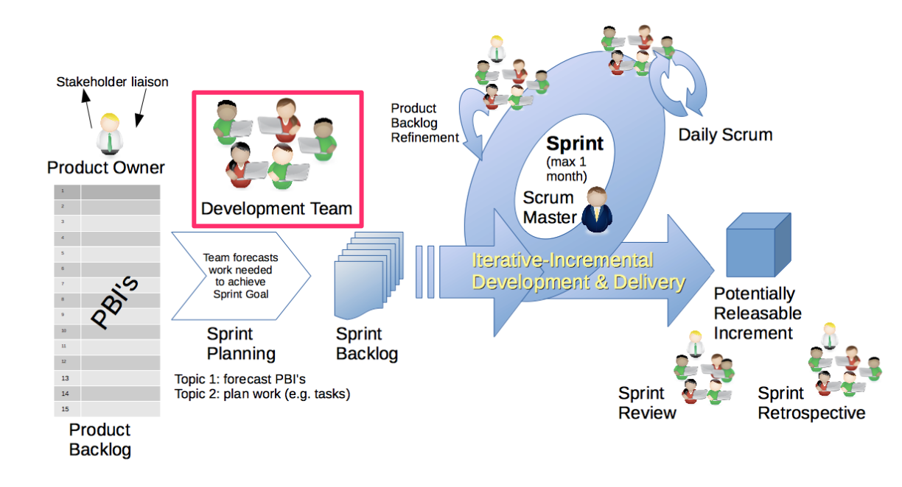{ width=440 }

# Kehittäjätiimi

- Kehittäjätiimi koostuu noin 3-9:stä henkilöstä, kaikista käytetään nimikettä developer
  - vaikka kaikilla nimike developer, voivat jotkut tiimin jäsenistä olla erikoistuneet omaan osa-alueeseensa

. . .

- koko tiimi kantaa aina yhteisen vastuun kehitystyöstä

. . .

- Oletuksena on että tiimin jäsenet työskentelevät tiimissä 100%:lla työajalla

. . .

- Tiimin tulee oletusarvoisesti työskennellä samassa paikassa, mieluiten yhteisessä tiimille varatussa avokonttorissa
  - COVID ja sen jälkeinen hybridityöskentely aiheuttaneet haasteita...

# Kehittäjätiimi

- Tiimi on _cross-functional_, eli sen tulisi sisältää kaikki tarvittava osaaminen järjestelmän suunnitteluun, toteuttamiseen ja testaamiseen

. . .

- Kehitystiimiä ei johdeta ulkopuolelta
  - päättää mihin tavoitteisiin se kussakin sprintissä sitoutuu, eli miten paljon vaatimuksia backlogilta valitaan sprintiin
  - päättää myös (tiettyjen reunaehtojen puitteissa) itse miten se sprintin tavoiteen toteuttaa

. . .

- Tiimi on siis _itseorganisoituva_ (self organizing)

# Sprintti

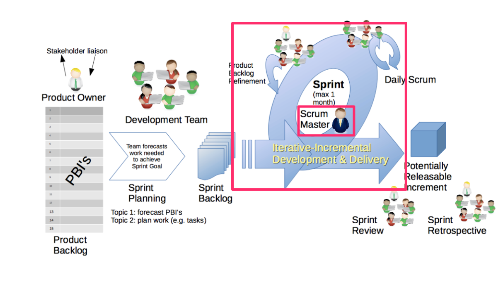{ width=440 }

# Sprintti

- Scrumissa kehitystyö siis jakautuu 1-4 viikon mittaisiin iteraatioihin eli sprintteihin
- Sprintti on _time-boxed_, sitä ei missään olosuhteissa pidennetä

. . .

- Jokaisen sprintin alussa tiimi valitsee projektin backlogista sprintin aikana toteutettavat vaatimukset
  - Backlog on priorisoitu ja vaatimukset valitaan aina priorisoidun listan kärjestä
  - Product ownerin asettama prioriteettijärjestys määrää missä missä _järjestyksessä_ asioita toteutetaan

. . .

- Tiimi valitsee sprinttiin ainoastaan sen verran toteutettavaa minkä valmistumiseen se uskoo kykenevänsä sitoutumaan

. . .

- Sprintin aikana scrum-tiimi toteuttaa _itseorganisoidusti_ sprinttiin valitut ohjelmiston ominaisuudet
- Sprintin aikana tiimille ei esitetä uusia vaatimuksia

. . .

- Sprintin lopuksi tuotteesta on oltava olemassa _toimiva versio_ (potentially shippable product increment)

# TAUKO

# Definition of done

- Jokaisessa sprintissä lopputuloksena toimiva, valmiiksi tehty osa ohjelmistoa

. . .

- Scrumissa on määriteltävä projektitasolla _definition of done_: mitä tarkoittaa, että jokin vaatimus on toteutettu valmiiksi

. . .

- Määritellään yleensä tarkoittamaan sitä, että vaatimus on
  - _analysoitu, suunniteltu, ohjelmoitu, testattu, testaus automatisoitu, dokumentoitu, integroitu muuhun ohjelmistoon ja viety tuotantoympäristöön_

. . .

- Jos Sprintissä on toteutettu joitain vaatimuksia puutteellisesti DoD:in kannalta, niitä ei tule raportoida valmiina

. . .

- Jos sprintin aikana osoittautuu että tiimi ei ehdi toteuttamaan kaikkia vaatimuksia _laadusta ei tingitä_
  - osa vaatimuksista jätetään seuraavaan sprinttiin

# Sprintin suunnittelu

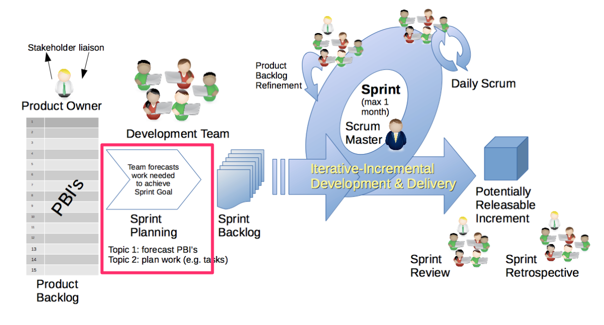{ width=440 }

# Sprintin suunnittelu

- Ennen jokaista sprinttiä järjestetään sprintin _suunnittelukokous_
- Kokouksella kaksi tavoitetta, Scrumin sanoin _aiheetta_

. . .

- Ensimmäisen aihe on selvittää **mitä** sprintin aikana tehdään
  - Product owner esittelee product backlogin kärjessä olevat vaatimukset
  - Tiimin tulee olla selvillä siitä, mitä vaatimuksilla tarkoitetaan
  - Tiimi arvioi kuinka monta backlogin vaatimuksista se kykenee sprintin aikana toteuttamaan

# Sprintin suunnittelu

- Suunnittelukokouksen toisena aiheena on selvittää **miten** sprintin tavoitteet saavutetaan

. . .

- Tämä yleensä edellyttää että tiimi suunnittelee toteutettavaksi valitut vaatimukset tarvittavalla tasolla
  - Aikaansaannoksena on usein lista teknisistä _tehtävistä_ (task), jotka sprintin aikana on toteutettava

. . .

- Suunnittelun aikana identifioidut tehtävät kirjataan _sprintin backlogiin_ eli sprintin tehtävälistaan

. . .

Palaamme sprintin suunnitteluun tarkemmin ja konkreettisten esimerkkien kanssa torstaina

# Sprintin suunnittelu: *product backlogilta sprint backlogille*

{ width=440 }

# Daily scrum – päiväpalaveri

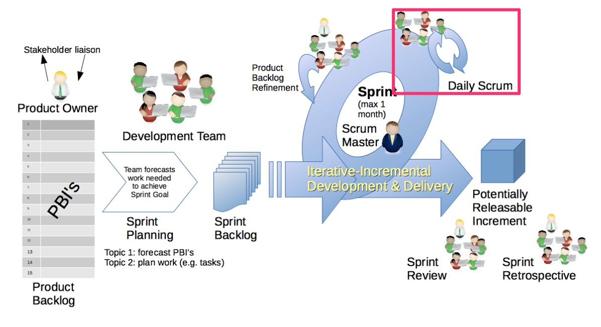{ width=440 }

# Daily scrum – päiväpalaveri

- Jokainen päivä sprintin aikana aloitetaan _daily scrumilla_ eli korkeintaan 15 minuutin mittaisella palaverilla
  - Aina samaan aikaan, samassa paikassa, kaikkien kehittäjien oltava paikalla

. . .

- Jokainen tiimin jäsen vastaa vuorollaan kolmeen kysymykseen
  - Mitä sain aikaan edellisen tapaamisen jälkeen?
  - Mitä aion saada aikaan ennen seuraavaa tapaamista?
  - Mitä esteitä etenemiselläni on?

. . .

- Kuka tahansa saa olla seuraamassa daily scrumia, mutta vain tiimin jäsenillä on puheoikeus

. . .

- Palaverin on tarkoitus olla lyhyt, muu keskustelu ei sallittua
- Jos jollakin on ongelmia, scrum master keskustelee asianomaisen kanssa daily scrumin jälkeen

. . .

- Jos muuhun palaverointiin tarvetta, tulee palaverit järjestää daily scrumista erillään

# Sprintin katselmointi

{ width=440 }

# Sprintin katselmointi

- Sprintin päätteeksi järjestetään _sprint review_ eli katselmointi
- Katselmointiin voi osallistua kuka tahansa

. . .

- Tiimi esittelee sprintin aikaansaannoksia
  - tarkastellaan/demotaan toteutettua toimivaa ohjelmistoa

. . .

- Scrum master huolehtii, että ainoastaan definition of donen mukaisesti toteutetut vaatimukset demotaan

. . .

- Product owner varmistaa, mitkä vaatimuksista toteutettiin hyväksyttävällä tavalla
- Ne vaatimukset joita ei hyväksytä toteutetuksi siirretään takaisin product backlogiin

# Sprintin katselmointi

- Katselmoinnin aikana kuka tahansa saa antaa palautetta tuotteesta ja esim. ehdottaa uusia vaatimuksia lisättäväksi product backlogiin

. . .

- Katselmointi aiheuttaa usein myös tarpeen product backlogin uudelleenpriorisoimiseen

# Retrospektiivi

{ width=440 }

# Retrospektiivi

- _Retrospektiivi_ on sprintin katselmoinnin ja seuraavan sprintin alun välissä pidettävä palaveri, jonka aikana tiimi tarkastelee omaa työskentelyprosessiaan

. . .

- Identifioidaan mikä meni hyvin ja missä asioissa on parantamisen varaa

. . .

- Mietitään ratkaisuja ongelmakohtiin, joita pyritään korjaamaan seuraavan sprintin aikana

# Retrospektiivi

{ width=440 }

# Transparency - inspect - adapt

- Scrumin taustaperiaatteet ovat
  - _transparency_ (läpinäkyvyys)
  - _inspection_ (tarkkailu)
  - _adaption_ (mukauttaminen)

. . .

- Asioiden läpinäkyvyys mahdollistaa niiden jatkuvan tarkkailun
- ja sen seurauksena toimintatapoja ja kehitettävää tuotetta on mahdollista mukauttaa

. . .

- Läpinäkyvyys: backlogit, daily scrum, definition of done, sprintin katselmointi, product increment...

. . .

- Lyhyt kehityssykli mahdollistaa sekä tuotteen että toimintatapojen nopean inkrementaalisen parantamisen
  - backlogia uudelleenpriorisoidaan ja muokataan palautteen sekä opitun perusteella
  - retrospektiivi kannustaa tiimiä jatkuvasti parantamaan työprosessiaan

# Scrumin arvot

- Scrum sisältää joukon _arvoja_ joiden noudattamista se pitää oleellisena: _commitment, focus, courage, respect_

. . .

- tiimin tulee olla _sitoutunut_ (commitment) yhteisen tavoitteen saavuttamiseksi

. . .

- ja _fokusoitua_ (focus) oikeiden asioiden tekemiseen

. . .

- tulee olla _rohkeutta_ (courage) tehdä päätöksiä ja kohdata myös vaikeimpia asioita
  - tulee olla avoimia sekä onnistumisten että ongelmien suhteen

. . .

- oleellista on _kunnioittaa_ (respect) koko ajan kaikkia kehitystiimin jäseniä sekä ohjelmiston sidosryhmiä

# Scrumin tehokas soveltaminen

- Jotta Scrum toimisi _tehokkaasti_, tarvitaan sen soveltamiseen sopiva asenne ja orientaatio, eli on noudatettava Scrumin arvoja

. . .

- Scrumin tekemisen ei ole tarkoitus olla ainoastaan pelisäänöjen orjallista noudattamista

. . .

- Scrumin inspect-and-adapt (tarkkaile ja mukauta) -luonne ohjaa siihen, **tiimien on koko ajan mukautettava toimintaansa**

. . .

- *Tiimien optimaalisen toiminnan kannalta on joskus parempi toimia jopa joidenkin Scrumin ohjeiden vastaisesti*

# Scrumin ongelmat

- Scrum on osoittautunut monin paikoin paremmaksi tavaksi ohjelmistojen tuottamiseen kuin vesiputousmalli tai muut suunnitelmavetoiset mallit

. . .

- Yleinen ratkaisu ohjelmistotuotannon ongelmiin se ei ole
- Scrumin käytön yleistyessä myös epäonnistuneiden Scrum-projektien määrä kasvaa

. . .

- Yksi ongelmista on ns. **scrumbut**
  - We use Scrum, **but** having a Daily Scrum every day is too much overhead, so we only have one per week.
  - We use Scrum, **but** retrospectives are a waste of time, so we don't do them.
  - We use Scrum, **but** we can't build a piece of functionality in two weeks, so our Sprints are 3 months long

. . .

- Transparency-inspect-adapt voi vaarantua

# Scrumin ongelmia Robert Martinin listaamina

- No Technical Practices
  . . .

- Automated Testing

. . .

- Certification in CSM

. . .

- Scrum Master sometimes turns into Project Manager

. . .

- Scrum carries an anti-management undercurrent: "Scrum over-emphasizes the role of the team as self-managing

. . .

- Scrum and generic Agile have little to say about how to scale

. . .

- Insufficient Guidance Regarding the Product Backlog

# Waterscrumfall

- Yleisesti raportoitu ongelma ketterään ohjelmistokehitykseen siirryttäessä on se, että muu organisaatio jää ennalleen

. . .

- Waterscrumfall
  - ohjelmistokehitys tapahtuu Scrumia mukaillen
  - budjetointi, vaatimusten hallinta sekä tuotantoonvienti etenevät edelleen vanhoja kontrolloituja prosesseja noudattaen

. . .

- Päätetään alustava Scrumiin tutustumisemme menetelmän kehittäjien sanoihin:

**Scrum is easy to undestand but extremely difficult to master**
% Ohjelmistotuotanto
% Matti Luukkainen ja ohjaajat Antti, Pooki, Riku, Sini, Taneli
% syksy 2024

#

&nbsp;&nbsp;&nbsp;&nbsp;&nbsp;&nbsp;&nbsp;&nbsp;&nbsp;&nbsp;&nbsp;&nbsp;&nbsp;&nbsp;&nbsp;&nbsp;&nbsp;&nbsp;&nbsp;&nbsp;&nbsp;&nbsp;&nbsp;&nbsp;&nbsp;&nbsp;&nbsp;&nbsp;&nbsp;&nbsp;&nbsp;&nbsp;&nbsp;&nbsp;&nbsp;&nbsp;&nbsp;Luento 3

&nbsp;&nbsp;&nbsp;&nbsp;&nbsp;&nbsp;&nbsp;&nbsp;&nbsp;&nbsp;&nbsp;&nbsp;&nbsp;&nbsp;&nbsp;&nbsp;&nbsp;&nbsp;&nbsp;&nbsp;&nbsp;&nbsp;&nbsp;&nbsp;&nbsp;&nbsp;&nbsp;&nbsp;&nbsp;&nbsp;&nbsp;&nbsp;&nbsp;&nbsp;&nbsp;&nbsp;7.11.2024

# Kurssipalaute

- Kurssipalaute
  - Kurssilla lopussa kerättävän palautteen lisäksi ns. jatkuva palaute https://norppa.helsinki.fi

# 

- Luennot
  - huomenna klo 12-14 B123
  - ensi viikosta alkaen ma ja ti 12-14 B123

- Pajaa salissa BK107 
  - ma 14-16
  - to 13-15
  - pe 12-14 (huomenna poikkeuksellisesti klo 14-16)

# Miniprojektit

- Käynnistyvät 11.11 alkavalla viikolla

- **Ilmoittautumisen deadline su 10.11. klo 23.59**

- Aloitustilaisuudet
  - ti 14-16
  - ke 14-16
  - ke 16-18
  - to 10-12
  - to 14-16

- Seuraavat viikot: sprinttien katselmus ja suunnittelu samassa aikaikkunassa

- Loppudemot
  - ke 11.12. klo 12-14 B123
  - to 12.12. klo 12-14 CK112

# Ohjelmiston elinkaari (software lifecycle)

- **Vaatimusten analysointi ja määrittely**
- Suunnittelu
- Toteutus
- Testaus
- Ohjelmiston ylläpito ja evoluutio

# Vaatimusmäärittely engl requirements engineering

- Keskeisin ongelma ohjelmistotuotantoprosessissa on määritellä
  asiakkaan vaatimukset rakennettavalle ohjelmistolle

. . .

- Jakaantuvat kahteen luokkaan
  - Toiminnalliset vaatimukset
    - ohjelman toiminnot
  - Ei-toiminnalliset vaatimukset
    - koko ohjelmistoa koskevat "laatuvaatimukset" ja
    - toimintaympäristön asettamat rajoitteet

. . .

- Vaatimusmäärittelyn tulee ainakin alkaa ennen ohjelmiston suunnittelua ja toteuttamista
  - vesiputouksessa vaatimukset määritellään heti alussa
  - iteratiivisessa ja ketterässä kehityksestä projektin kuluessa

# Vaatimusmäärittelyn vaiheet

- Vaatimusmäärittelyn luonne vaihtelee paljon riippuen
  - kehitettävästä ohjelmistosta
  - kehittäjäorganisaatiosta
  - ohjelmistokehitykseen käytettävästä prosessimallista

. . .

- Asiakkaan tai asiakkaan edustajan on oltava prosessissa aktiivisesti mukana

. . .

- Jaotellaan yleensä muutamaan työvaiheeseen
  - kartoitus (engl. elicitation)
  - analyysi
  - validointi
  - dokumentointi
  - hallinnointi

. . .

- Työvaiheet limittyvät ja vaatimusmäärittely etenee spiraalimaisesti tarkentuen

# Vaatimusten kartoituksen menetelmiä

- Selvitetään järjestelmän sidosryhmät (stakeholders) eli tahot, jotka tekemisissä järjestelmän kanssa

. . .

- Käytetään kaikki mahdolliset keinot:
  - Haastatellaan sidosryhmien edustajia
  - Pidetään brainstormaussessioita asiakkaan ja kehittäjien kesken

. . .

- Kehittäjätiimi voi strukturoida vaatimusten kartoitusta
  - Mietitään _kuviteltuja käyttäjiä_ ja keksitään käyttäjille tyypillisiä _käyttöskenaarioita_
  - Tehdään paperiprototyyppejä ja käyttöliittymäluonnoksia

. . .

- Skenaarioita ja prototyyppejä läpikäymällä asiakas näkemys tarkentuu

. . .

- Jos ollaan korvaamassa vanhaa järjestelmää, voidaan havainnoida loppukäyttäjän työskentelyä (etnografia)

#

- Kartoitettuja vaatimuksia täytyy **analysoida**, eli ovatko ne
  - riittävän kattavat
  - keskenään ristiriidattomia
  - testattavissa
  - toteutuminen on mahdollista ja taloudellisesti järkevää

. . .

- Vaatimukset on myös pakko **dokumentoida** muodossa tai toisessa
  - Ohjelmistokehittäjiä varten: mitä tehdään
  - Testaajia varten: toimiiko järjestelmä kuten vaatimukset määrittelevät

. . .

- Joskus vaatimusdokumentti toimii oleellisena osana asiakkaan ja kehittäjien välisessä sopimuksessa

. . .

- Ja **validoida**:
  - Onko asiakas sitä mieltä että kirjatut vaatimukset kuvaavat sellaisen järjestelmät mitä asiakas tarvitsee

# Toiminnalliset vaatimukset

- Vaatimukset jakaantuvat toiminnallisiin ja ei-toiminnallisiin vaatimuksiin

. . .

- _Toiminnalliset vaatimukset_ (functional requirements) kuvaavat mitä toimintoja järjestelmällä on
- Esim:
  - Asiakas voi lisätä tuotteen ostoskoriin
  - Onnistuneen luottokorttimaksun yhteydessä asiakkaalle vahvistetaan ostotapahtuman onnistuminen sähköpostitse

. . .

- Toiminnallisten vaatimusten dokumentointi voi tapahtua esim.
  - feature-listoina
  - UML-käyttötapauksina (joita käsiteltiin kurssilla Ohjelmistotekniikka ennen vuotta 2018)
  - Ketterissä menetelmissä usein _user storyinä_

# Ei-toiminnalliset vaatimukset

- Ei-toiminnalliset vaatimukset jakautuvat kahteen luokkaan

. . .

- _Laatuvaatimukset_ (quality attributes), ovat koko järjestelmän toiminnallisuutta rajoittavia/ohjaavia tekijöitä, esim.
  - Käytettävyys
  - Saavutettavuus
  - Tietoturva
  - Suorituskyky
  - Skaalautuvuus
  - Testattavuus
  - Laajennettavuus

. . .

- _Toimintaympäristön rajoitteita_ (constraints) ovat esim:
  - Toteutusteknologia (tulee toteuttaa NodeJS:llä ja Reactilla)
  - Integroituminen muihin järjestelmiin (kirjautuminen HY-tunnuksilla, data SISU:sta)
  - Mukautuminen lakeihin ja standardeihin (ei riko GDPR:ää)

. . .

- Ei-toiminnalliset vaatimukset vaikuttavat yleensä ohjelman arkkitehtuurin suunnitteluun

# Vaatimusmäärittely 1900-luvulla

. . .

- Vesiputousmallissa vaatimusmäärittely erillinen ohjelmistoprosessin vaihe
  - tehdään kokonaan ennen suunnittelun aloittamista

. . .

- Jos määrittelyssä tehdään virhe, joka huomataan vasta testauksessa, muutoksen tekeminen kallista

. . .

- Tästä loogisena johtopäätöksenä oli tehdä vaatimusmäärittelystä erittäin järeä ja huolella tehty työvaihe

# Vaatimusmäärittely 1900-luvulla: ei toimi

- Ideaali jonka mukaan vaatimusmäärittely voidaan irrottaa erilliseksi vaiheeksi on osoittautunut utopiaksi

. . .

- Vaatimusten muuttumien on väistämätöntä
  - asiakas ei osaa ilmaista tarpeita, toimintaympäristö muuttuu, vaatimusdokumenttia tulkitaan väärin...

. . .

- Vaatimusmäärittelyä ei ole mahdollista/järkevää irrottaa suunnittelusta ja toteutuksesta
  - Suunnittelu auttaa ymmärtämään ongelma-aluetta syvällisemmin ja generoi muutoksia vaatimuksiin
  - Ohjelmia tehdään maksimoiden valmiiden ja muualta, esim. open sourcena saatavien komponenttien käyttö

. . .

- **Jos toteutus otetaan huomioon, on helpompi arvioida vaatimusten toteuttamisen hintaa**

# Vaatimusmäärittely 2000-luvulla

. . .

- Iteratiivisen ja ketterän ohjelmistotuotannon tapa on integroida kaikki ohjelmistotuotannon vaiheet yhteen

. . .

- Projektin alussa määritellään vaatimuksia tarkemmalla tasolla ainakin yhden iteraation tarpeiden verran

. . .

- Ohjelmistokehittäjät arvioivat vaatimusten toteuttamisen hintaa
- Asiakas priorisoi: iteraatioon valitaan toteutettavaksi ne vaatimukset, jotka maksimoivat liiketoiminnallisen arvon

# Vaatimusmäärittely 2000-luvulla

- Jokaisen iteraation aikana tehdään määrittelyä, suunnittelua, ohjelmointia ja testausta

. . .

- Jokainen iteraatio tuottaa valmiin osan järjestelmää

. . .

- Edellisen iteraation tuotos toimii syötteenä seuraavan iteraation vaatimusten määrittelyyn

. . .

- **Ohjelmisto on mahdollista saada tuotantoon jo ennen kaikkien vaatimusten valmistumista**

. . .

- Kattavana teemana tuottaa asiakkaalle maksimaalisesti arvoa

# Vaatimusmäärittely 2010-luvulla: Lean startup

- Eric Ries (2011): _Lean startup_

  - kuvaa systemaattisen tavan kartoittaa vaatimuksia erityisen epävarmoissa konteksteissa

. . .

- Malli perustuu kolmiosaisen build-measure-learn-syklin toistamiseen

{ width=200 }

#

- Esim. internetpalveluja tai mobiilisovelluksia rakennettaessa käyttäjien tarpeista ei minkäänlaista varmuutta
  - Alkuvaiheessa ei edes ole vielä käyttäjiä, joilta voitaisiin kysyä
  - voidaan vain olettaa mitä ihmiset tulisivat käyttämään

. . .

- Otetaan lähtökohdaksi jokin idea siitä, mitä käyttäjät haluavat

. . .

- Rakennetaan nopeasti **minimal viable product (MVP)** joka toteuttaa ominaisuuden

. . .

- MVP laitetaan tuotantoon ja **mitataan miten asiakkaat käyttäytyvät** uuden toiminnallisuuden suhteen

#

- Jos MVP jonkin toiminnallisuuden uusi versio, käytetään **A/B-testausta**
  - uusi ominaisuus julkaistaan osalle käyttäjistä, loput jatkavat vanhan ominaisuuden käyttöä

. . .

- Mitattua käyttäytymistä: olivatko toteutetut toiminnallisuuden käyttäjien mieleen

. . .

- Jos toteutettu idea ei osoittautunut hyväksi, voidaan palata järjestelmän edelliseen versioon
  - Jos idea on hyvä, toteutetaan sen toiminnallisuus robustilla tavalla

. . .

- Menetelmällä on siis tarkoitus oppia systemaattisesti ja mahdollisimman nopeasti mitä asiakkaat haluavat

# TAUKO 10 minuuttia

# Vaatimusmäärittely ja projektisuunnittelu ketterässä prosessimallissa

# User story

. . .

- Ketterän vaatimusmäärittelyn tärkein työväline on user story

- Mike Cohn:
  - _A user story describes **functionality that will be valuable** to either user or purchaser of software._

. . .

- User stories are composed of three aspects:
  1. **A written description** of the story, used for planning and reminder
  2. **Conversations** about the story to serve to flesh the details of the story
  3. **Tests** that convey and document details and that will be used to determine that the story is complete

# User story

- User storyt kuvaavat loppukäyttäjän kannalta arvoa tuottavia toiminnallisuuksia

. . .

- User story on karkean tason tekstuaalinen kuvaus
- ja lupaus/muistutus siitä, että toiminnallisuuden vaatimukset on selvitettävä asiakkaan kanssa

. . .

- Seuraavat voisivat olla verkkokaupan user storyjen tekstuaalisia kuvauksia:
  - Asiakas voi lisätä tuotteen ostoskoriin
  - Asiakas voi poistaa ostoskorissa olevan tuotteen
  - Asiakas voi maksaa luottokortilla ostoskorissa olevat tuotteet


# User story

- Kun user story päätetään toteuttaa, on sen tarkat vaatimukset pakko selvittää

. . .

- Story on lupaus kommunikoinnista asiakkaan kanssa _conversations about the story to serve to flesh the details of the story_

. . .

- Määritelmän kolmas alikohta sanoo että storyyn kuuluu _Tests that convey and document details and that will be used to determine that the story is complete_

. . .

- Storyyn testejä kutsutaan **hyväksymätesteiksi** (acceptance test) tai **hyväksymäkriteereiksi** (acceptance criteria)

. . .

- Yleensä joukko konkreettisia testiskenaarioita joiden toimittava, jotta storyn voidaan todeta olevan valmis

. . .

- Luonne vaihtelee projekteittain
  - Tekstinä dokumentoituja skenaarioita
  - Parhaassa tapauksessa automaattisesti suoritettavia testejä

#

{ width=450 }

# Hyvän storyn kriteerejä

. . .

- User storyn tulee kuvata sovelluksen käyttäjälle arvoa tuottavia toimintoja
  - Käytettävä asiakkaan kieltä, ei teknistä jargonia

. . .

- User story tulisi kuvata "end to end"-toiminnallisuutta (kattaen käyttöliittymän, bisneslogiikan, ja tietokannan)
  - Esimerkki huonosta storystä _lisää jokaisesta asiakkaasta rivi tietokantatauluun customers_

. . .

- Edellinen sivu erään muodin mukaisessa muodossa
  - As a _type of user_, I want _functionality_ so that _business value_
  - As a _student_ I want _to purchase a parking pass_ so that _I can drive to school_

# Hyvän storyn kriteerit

- Bill Wake _INVEST in good User Stories_, kuusi toivottavaa ominaisuutta
  - Independent
  - Negotiable
  - Valuable to user or customer
  - Estimable
  - Small
  - Testable

. . .

- **Independent**: storyjen pitäisi olla toteutusjärjestykseltään mahdollisimman riippumattomia
  - antaa asiakkaalle enemmän vapauksia

. . .

- **Negotiable**: storyn luonne "muistilappuna" ja keskusteluna
- **Valuable**

# Hyvän storyn kriteerit

- **Estimatable**: storyn toteuttamisen vaatima työmäärä pitää olla arvioitavissa kohtuullisella tasolla

. . .

- **Small** storyt on oltava riittävän pieniä, yhden sprintin aikana toteutettavissa olevia

. . .

- **Testability**: storyille pitää pystyä laatimaan kriteerit, joiden avulla voi yksikäsitteisesti todeta onko story toteutettu hyväksyttävästi

. . .

- Ei-toiminnalliset vaatimukset (esim. suorituskyky, käytettävyys) aiheuttavat usein haasteita testattavuudelle
  - Esim. story _verkkokaupan tulee toimia tarpeeksi nopeasti kovassakin kuormituksessa_
  - voidaan muotoilla testattavaksi seuraavasti: _käyttäjän vasteaika saa olla korkeintaan 0.5 sekuntia 99% tapauksissa jos yhtäaikaisia käyttäjiä sivulla on maksimissaan 1000_

# Ketterää vaatimusten hallintaa...

# Alustava backlog

- Projektin alussa etsimään ja määrittelellään user storyja ja muodostaa näistä alustava product backlog

. . .

- Käytettävissä ovat kaikki yleiset vaatimusten kartoitustekniikat:
  - haastattelut, brainstormaus, paperiprototyypit, käyttöliittymäluonnokset...

. . .

- Alustavan storyjen keräämisvaiheen ei ole tarkoituksenmukaista kestää kovin kauaa, maksimissaan muutaman päivän

. . .

- User story on muistilappu ja lupaus tarkennuksesta:
  - Turhiin detaljeihin ei puututa
  - Ei edes tavoitella täydellistä ja kattavaa listaa vaatimuksista, asioita tarkennetaan myöhemmin

. . .

- Kun alustavat storyt identifioitu, ne priorisoidaan ja työmäärä arvioidaan karkealla tasolla

# Backlogin priorisointi

. . .

- Prioriteetti määrää järjestyksen, missä ohjelmistokehittäjät toteuttavat ohjelmiston ominaisuuksia
- **Priorisoinnin hoitaa product owner**

. . .

- Motivaationa on pyrkiä maksimoimaan asiakkaan kehitettävästä ohjelmistosta saama hyöty/arvo

. . .

- Tärkeimmät asiat halutaan toteuttaa nopeasti
  - saadaan tuotteen alustava versio nopeasti julkaistua

. . .

- Arvon lisäksi priorisoinnissa kannattaa huomioida
  - Storyn toteuttamiseen kuluva työmäärä
  - Storyn kuvaamaan ominaisuuteen sisältyvä tekninen riski

# Estimointi

. . .

- User storyjen estimointiin eli niiden viemän työmäärän arvioimiseen on kaksi motivaatiota
  - Auttaa asiakasta priorisoinnissa
  - Mahdollistaa koko projektin viemän ajan arvioinnin

. . .

- Työmäärän arvioimiseen on kehitetty vuosien varrella useita erilaisia menetelmiä
  - Kaikille yhteistä on se, että ne eivät toimi kunnolla
  - **tarkkoja työmääräarvioita on mahdoton antaa**

. . .

- Mitä kauempana tuotteen/ominaisuuden valmistuminen on, sitä epätarkempia työmääräarviot ovat

# cone of uncertainity

{ width=300 }

. . .

- Ketterän kehityksen _lähtökohta_ on että estimointi on epävarmaa ja tarkentuu vasta projektin kuluessa
  - ei tehdä sitovia estimointiin perustuvia lupauksia

# Suhteelliseen kokoon perustuva estimointi

- Ominaisuuksien toteuttamiseen menevän tarkan ajan arvioiminen on vaikeaa

. . .

- Ohjelmistokehittäjät pystyvät jossain määrin arvioida _eri ominaisuuksien vaatimaa työmäärää suhteessa toisiinsa_

. . .

- Esim.
  - _Tuotteen lisääminen ostoskoriin toteuttaminen_ vie yhtä kauan kuin _Tuotteen poistaminen ostoskorista_
  - _Ostoskorissa olevien tuotteiden maksaminen luottokortilla_ taas vie noin kolme kertaa kauemmin kun edelliset

. . .

- Ketterissä menetelmissä käytetäänkin yleisesti _suhteelliseen kokoon perustuvaa estimointia_
  - Yksikkönä arvioinnissa on yleensä **story point**
  - Ei yleensä vastaa mitään todellista tuntimäärää

# Kehittäjätiimi estimoi

- Estimointi tapahtuu **aina** ohjelmistokehitystiimin toimesta
  - Product owner tarkentaa estimoitaviin storyihin liittyviä vaatimuksia

. . .

- Estimointia auttaa user storyn pilkkominen teknisiin työvaiheisiin

. . .

- _Tuotteen lisääminen ostoskoriin_, voisi sisältää toteutuksen kannalta seuraavat tekniset tehtävät:

  - tarvitaan sessio, joka muistaa asiakkaan
  - oliot/tietorakenteet ostoskorin ja ostoksen esittämiseen
  - html-näkymää päivitettävä tarvittavilla painikkeilla
  - Kontrolleri painikkeiden käsittelyyn
  - yksikkötestit kontrollerille ja tietorakenteille
  - hyväksymätestien automatisointi

- Jos kyseessä on samantapainen toiminnallisuus kuin joku aiemmin toteutettu, ei pilkkomista välttämättä tarvita

# Estimointi definition of donen tarkkuudella

- Estimoinnissa tulee arvioida storyn viemä aika _definition of donen_ tarkkuudella
- Tämä sisältää yleensä kaiken storyn toteuttamiseen liittyvän
  - määrittely, suunnittelu, toteutus, automatisoitujen tekstien tekeminen, testaus, integrointi ja dokumentointi

. . .

- Estimointi on joka tapauksessa suhteellisen epätarkkaa, joten estimoinnin on tarkoitus tapahtua nopeasti
  - Storyn estimointiin kannattaa käyttää aikaa max 15 minuuttia

. . .

- Jos se ei riitä, storya ei tunneta niin hyvin että se kannattaisi estimoida
  - story kannattaanee pilkkoa

# Estimoinnin menetelmiä

- Kiinnitetään muutama erikokoinen story _referenssiksi_ ja verrata muiden storyjen työmäärää näihin

{ width=300 }

. . .

- Käytetään yläpäästä harvenevaa skaalaa esim. 1, 2, 3, 5, 10, 20, 40, 100
- Koska isojen storyjen estimointiin liittyy suuri epävarmuus, ei teeskennellä että skaala olisi yläpäästä tarkka

# Planning poker: osallistetaan koko tiimi

{ width=250 }

. . .

- Kaikille yhtenäinen näkemys sisällöstä ja tieto leviämään kaikille (transparency)
% Ohjelmistotuotanto
% Matti Luukkainen ja ohjaajat Antti, Pooki, Riku, Sini, Taneli
% syksy 2024

#

&nbsp;&nbsp;&nbsp;&nbsp;&nbsp;&nbsp;&nbsp;&nbsp;&nbsp;&nbsp;&nbsp;&nbsp;&nbsp;&nbsp;&nbsp;&nbsp;&nbsp;&nbsp;&nbsp;&nbsp;&nbsp;&nbsp;&nbsp;&nbsp;&nbsp;&nbsp;&nbsp;&nbsp;&nbsp;&nbsp;&nbsp;&nbsp;&nbsp;&nbsp;&nbsp;&nbsp;&nbsp;Luento 4

&nbsp;&nbsp;&nbsp;&nbsp;&nbsp;&nbsp;&nbsp;&nbsp;&nbsp;&nbsp;&nbsp;&nbsp;&nbsp;&nbsp;&nbsp;&nbsp;&nbsp;&nbsp;&nbsp;&nbsp;&nbsp;&nbsp;&nbsp;&nbsp;&nbsp;&nbsp;&nbsp;&nbsp;&nbsp;&nbsp;&nbsp;&nbsp;&nbsp;&nbsp;&nbsp;&nbsp;8.11.2024

# Kurssipalaute

- Kurssipalaute
  - Kurssilla lopussa kerättävän palautteen lisäksi ns. jatkuva palaute https://norppa.helsinki.fi

# 

- Luennot
  - huomenna klo 12-14 B123
  - ensi viikosta alkaen ma ja ti 12-14 B123

- Pajaa salissa BK107 
  - ma 14-16
  - to 13-15
  - pe 12-14 (huomenna poikkeuksellisesti klo 14-16)

# Miniprojektit

- Käynnistyvät 11.11 alkavalla viikolla

- **Ilmoittautumisen deadline su 10.11. klo 23.59**

- Aloitustilaisuudet
  - ti 14-16
  - ke 14-16
  - ke 16-18
  - to 10-12
  - to 14-16

- Seuraavat viikot: sprinttien katselmus ja suunnittelu samassa aikaikkunassa

- Loppudemot
  - ke 11.12. klo 12-14 B123
  - to 12.12. klo 12-14 CK112

# Nopea kertaus eiliseltä

- User story

  - description
  - conversations
  - acceptance criteria

  . . .

- Hyvä user story: INVEST

  . . .

- Estimointi
  - Miksi? Kuka? Miten?

. . .

- Product Backlog
  - Kuka vastuussa?
  - Miten saadaan projektin alussa muodostettua?

# Hyvä product backlog on DEEP

- Mike Cohn lanseerasi lyhenteen DEEP kuvaamaan hyvän backlogin ominaisuuksia
  - Detailed appropriatly
  - Estimated
  - Emergent
  - Prioritized

#

- Estimated, Prioritized

. . .

- _Detailed appropriately_ eli sopivan detaljoitu
  - ylempänä tarkkoja
  - alempana suurpiirteisempiä

{ width=350 }

#

- _Emergent_ kuvaa backlogin muuttuvaa luonnetta:
  - uusia storyja tulee
  - vanhoja poistetaan, uudelleenpriorisoidaan ja uudelleenestimoidaan, muokataan ja pilkotaan

. . .

- Muuttuvan luonteen takia backlogia tulee hoitaa projektin edetessä (engl. backlog refinement/grooming)
  - Pääasiallinen vastuu on product ownerilla
  - Backlogin hoitamiseen osallistuu koko kehitystiimi
  - Scrum suosittelee että noin 10% sprintin työajasta käytetään backlog refinementiin

# "Ready" story ja epiikki

- Hyvä story on siis INVEST (independent, negotiable, valuable, estimable, small, testable)
- DEEP taas taas sanoo, että backlogin pitää olla _sopivan_ detaljoitu

. . .

- INVEST päteekin vain backlogin korkeamman prioriteetin storyihin
  - Joskus sanotaan että story on **ready**, kun se on valmiina toteutettavaksi (hyvin tunnettu ja INVEST)

. . .

- Alemman prioriteetin storyt voivat olla **epiikkejä** (epic)
  - scope ei tiedossa, ei mielekästä estimoida

# Velositeetti

- Estimoinnin yksi tarkoitus on mahdollistaa koko projektin viemän aikamäärän summittainen arviointi

. . .

- Estimoinnin yksikkönä on abstrakti käsite _story point_, miten sen avulla voidaan arvioida projektin kestoa?

. . .

- Kehitystiimin _velositeetti_ (engl velocity) tarjoaa osittaisen ratkaisun tähän

- Velositeetilla tarkoitetaan _tiimin keskimäärin yhdessä sprintissä toteuttamien story pointtien määrää_

. . .

- Jos velositeetti selvillä ja toteutettavaksi tarkoitetut storyt estimoitu, projektin keston arvio on helppo laskea

_(storyjen estimaattien summa) / velositeetti \* sprintin pituus_

#

- Projektin alkaessa velositeetti ei ole selvillä, ellei kyseessä ole jo yhdessä työskennellyt tiimi

. . .

- Velositeetti vaihtelee alussa melko paljon
  - Estimointi aluksi vaikeampaa varsinkin jos sovellusalue ja käytetyt teknologiat eivät ole täysin tuttuja

{ width=300 }

. . .

- Velositeetti ja siihen perustuva projektin keston arvio alkaakin tarkentumaan pikkuhiljaa

#

- Ketterissä menetelmissä on oleellista kuvata mahdollisimman realistisesti projektin etenemistä

. . .

- Velositeettiin lasketaan mukaan ainoastaan definition of donen mukaisesti toteutetut storyt
  - "lähes valmiiksi" tehtyä työtä ei katsota ollenkaan tehdyksi

{ width=350 }

# Burndown

- Projektin etenemistä kuvataan joskus release burndown -kaavion avulla

. . .

{ width=350 }

# Burndown

- Projektin etenemistä kuvataan yleensä release burndown -kaavion avulla

{ width=350 }

# Burndown

- Projektin etenemistä kuvataan yleensä release burndown -kaavion avulla

{ width=350 }

# Burndown

- Projektin etenemistä kuvataan yleensä release burndown -kaavion avulla

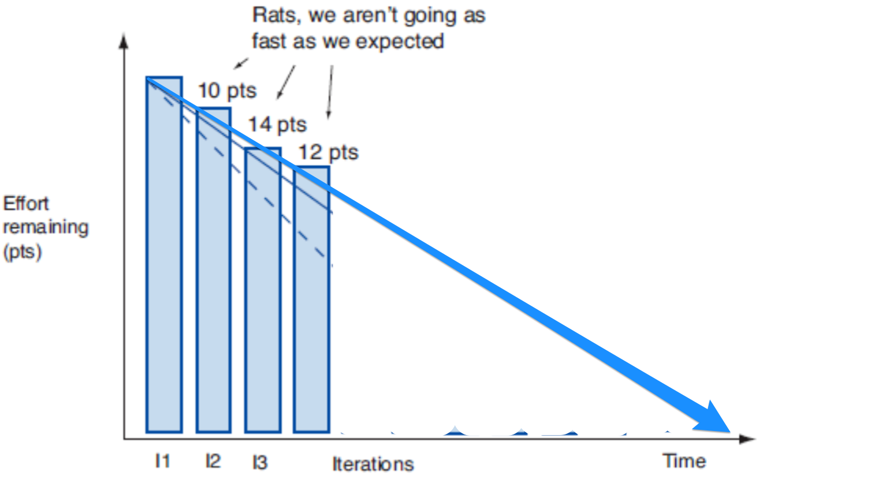{ width=350 }

# Burndown

- Projektin etenemistä kuvataan yleensä release burndown -kaavion avulla

{ width=350 }

# Burndown

- Projektin etenemistä kuvataan yleensä release burndown -kaavion avulla

{ width=350 }

# Burndown

- Projektin etenemistä kuvataan yleensä release burndown -kaavion avulla

{ width=350 }

# Kannattaako estimointi? #NoEstimates

- Storyjen viemän työmäärän arvioimiseen kaksi motivaatiota
  - auttaa asiakasta priorisoinnissa
  - mahdollistaa koko projektin tai kokonaisuuden viemän ajan ja kustannuksen arvioinnin

. . .

- Story point -pohjainen suhteellinen estimointi on saavuttanut vankan aseman
  - Scrum guide mainitsee että backlogin vaatimukset estimoituja
  - Samoin kuten monet parhaat käytänteet kuten DEEP

. . .

- _#NoEstimates_-liike ruvennut kyseenalaistamaan story point -perustaista estimointitapaa
  - pitää siitä saavutettuja hyötyjä liian vähäisinä verrattuna käytettyyn aikaan ja vaivaan

. . .

- Yksinkertainen vaihtoehto: **arvioidaan velositeetti laskemalla kussakin sprintissä valmistuneiden storyjen lukumäärä**

. . .

- Toimii jos storyt riittävän tasakokoisia?

# Tauko 10 min

# Sprintti

# Sprintin suunnittelu

- Kertauksena alkuviikolta: Scrum määrittelee pidettäväksi ennen jokaista sprinttiä _suunnittelupalaverin_

. . .

- Palaverin ensimmäinen tavoite on selvittää _mitä_ sprintin aikana tehdään
  - Lähtökohtana DEEP product backlog

. . .

- Product owner esittelee backlogin kärjessä olevat vaatimukset
  - Tiimin on tarkoitus olla riittävällä tasolla selvillä mitä vaatimuksilla tarkoitetaan

. . .

- Tiimi valitsee niin monta storyä kuin se arvioi kykenevänsä sprintin aikana toteuttamaan definition of donen laadulla

# Sprintin tavoite

- Suunnittelun yhteydessä määritellään _sprintin tavoite_ (goal)
  - Lyhyt, yhden tai kahden lauseen kuvausta siitä, mitä tiimi on aikeissa sprintin aikana tehdä

. . .

- K. Schwaber, ensimmäisen sprintin tavoite: _demonstrate a key piece of user functionality on the selected technology_

. . .

- Verkkokaupan sprinttien tavoitteita voisivat olla:
  - Ostoskorin perustoiminnallisuus: tuotteiden lisäys ja poisto
  - Ostosten maksaminen ja toimitustavan valinta

. . .

- Lyhyt kuvaus parempi niille sidosryhmäläisille, joita ei kiinnosta seurata tapahtumia yksittäisten storyjen tarkkuudella

# Sprintiin valittavat storyt

- Sprintin tavoitteen asettamisen lisäksi tulee valita backlogista sprintin aikana toteutettavat storyt
  - Kehitystiimi päättää kuinka monta storya sprinttiin otetaan

. . .

- Jos velositeetti on selvillä, on valinta periaatteessa helppo

{ width=230 }

- Jos velositettia ei tiedossa, käytetään harkintaa

#

- Product owner voi vaikuttaa sprinttiin mukaan otettaviin storyihin tekemällä uudelleenpriorisointia

{ width=230 }

- Entä jos myös D halutaan sprinttiin?

#

- Uudelleenpriorisoidaan

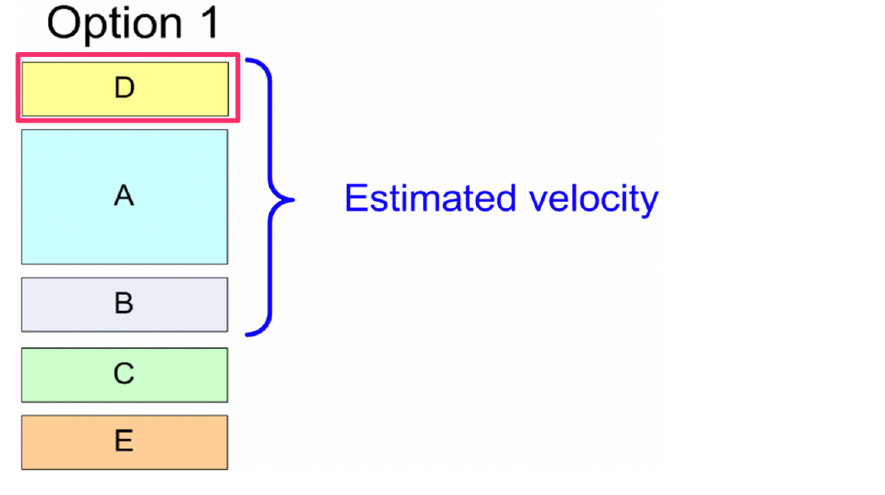{ width=250 }

. . .

- Entä jos myös C halutaan mukaan?

#

- Pienennetään A:n kuvaamaa toiminnallisuutta

{ width=280 }

. . .

- Entä jos A ei saa pienentyä

#

- Jaetaan A kahteen osaan

{ width=280 }

- Tärkeämpi osa toiminnallisuutta eli A1 mahtuu mukaan sprinttiin, vähemmän tärkeät osat eli A2 jää myöhempiin sprintteihin

# User storyjen jakaminen useampaan osaan

- Haastava aihe, palataan siihen tänään jos aikaa jää
- Kurssinmateriaalissa jonkin verran ohjeistusta asiaan

- Pääperiaate: jakamisessa syntyvien storyjen edelleen noudatettava INVEST-kriteerejä

# Miten sprintin tavoitteeseen päästään?

- Sprintin suunnittelun yhteydessä sprinttiin valituille user storyille tehdään karkean tason suunnittelu

. . .

- Mietitään mitä _teknisen tason tehtäviä_ (task) on toteutettava, jotta user story saadaan valmiiksi

. . .

- Suunnitellaan komponentteja ja rajapintoja karkealla tasolla

. . .

- Huomioidaan uusien storyjen aiheuttamat muutokset olemassa olevaan osaan sovelluksesta

# Storyn jako taskeihin, esimerkki

- Esimerkiksi _tuotteen lisääminen ostoskoriin_, voitaisiin jakaa seuraaviin teknisiin taskeihin:
  - sessio, joka muistaa asiakkaan tila
  - oliot ja tietorakenteet ostoskorin ja ostoksen esittämiseen
  - laajennus tietokantaskeemaan
  - html-näkymää päivitettävä tarvittavilla painikkeilla
  - kontrolleri painikkeiden käsittelyyn
  - yksikkötestit kontrollerille ja ostoskorin logiikalle
  - hyväksymätestien automatisointi

. . .

- Kaikkia storyyn liittyviä taskeja ei sprintin suunnittelun aikana löydetä
  - Uusia taskeja generoidaan tarvittaessa sprintin edetessä

# Sprint backlog

- _Sprint backlog_ koostuu sprintiin valituista storyista ja niihin liittyvistä tehtävistä eli taskeista

. . .

- Sprint backlog usein organisoitu taskboardiksi

{ width=250 }

- Taskit niiden valmistumisastetta kuvaavassa sarakkeessa

# Sprint backlogin työmääräarviot

- Sprintissä arvioidaan päivittäin kunkin taskin _jäljellä olevaksi arvioitua työmäärää_
  - Usein tapana tehdä arviot tunteina

. . .

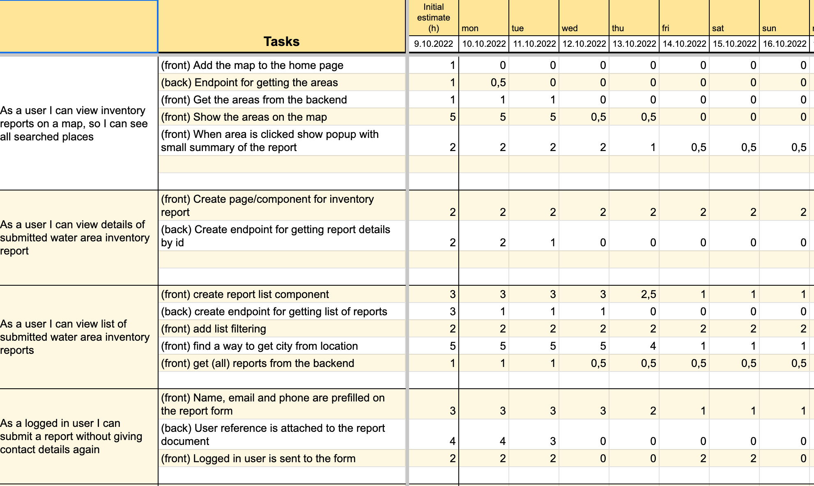{ width=400 }

# Sprintin burndown etenemisen seurantaan

{ width=450 }

# Kannattaako taskeille tehdä työmääräarviot?

- _A Scrum book 2019_ ei suosittele taskien tasolla tehtävää työmääräarviointia
  - Kehottaa seuraamaan sprinttien aikana ainoastaan sitä kuinka monen story pointin verran storyja saatu valmiiksi

. . .

- On mahdollista, että tiimi saa sprintissä valmiiksi lähes kaikki taskit, saamatta valmiiksi yhtäkään storya
  - Burn down voi näyttää pitkään melko hyvältä, mutta asiakkaan saama arvo on lopulta nolla

. . .

- Yksinkertainen tapa sprintin etenemisen seurantaan
  - laske, tai katsoa taskboardilta, mikä on jo valmiiden ja vielä valmistumattomien sprinttiin kuuluvien taskien lukumäärä

# Joskus Sprinteissä ...

{ width=350 }

# Joskus Sprinteissä käy näin

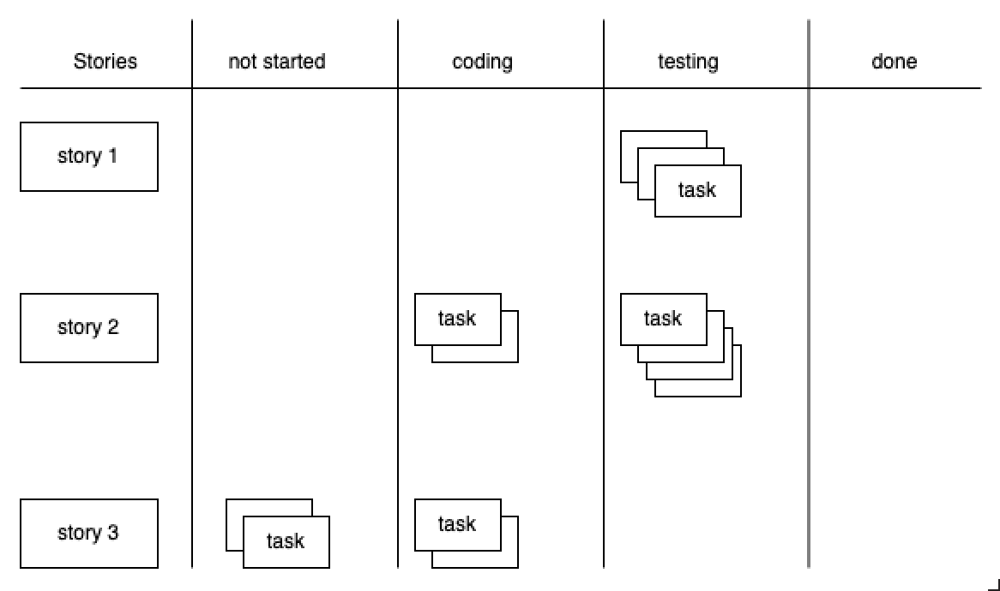{ width=350 }

# Puolivalmis työ kasautuu ja asiat eivät valmistu

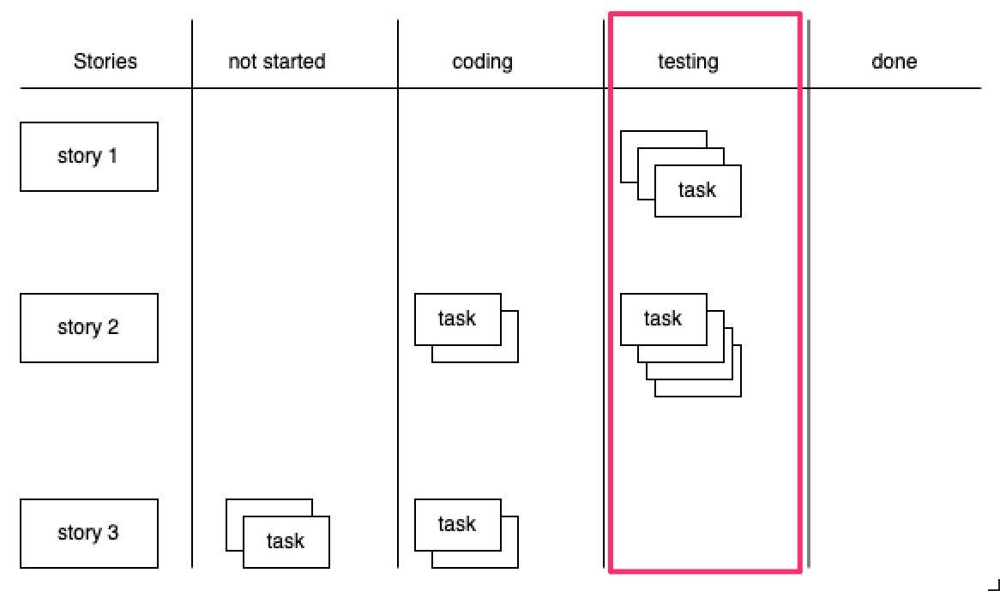{ width=350 }

# WIP-rajoitteet

- Yhtä aikaa työn alla olevien taskien suuri määrä voi koitua ongelmaksi
  - Riski sille, että sprintin päätyttyä paljon osittain valmiita storyja kasvaa

. . .

- Ratkaisu: _work in progress eli WIP_ -rajoitteet

{ width=300 }

# Kanban ja Lean

- WIP-rajoitusten idea on peräisin _Kanban_-menetelmästä, joka on eräs keskeisimmistä _Lean_-ajattelun työkaluista
  - Lean-ajattelu on peräisin jo kymmeniä vuosia vanhasta Toyota Production Systemistä

. . .

- Lean-ajattelun taustalla on idea _hukan_ eli asiakkaalle arvoa tuottamattomien asioiden eliminoimisessa

. . .

- Toiminnallisuudet tuovat arvoa vasta käytössä, sitä ennen ne sitovat turhaan kustannuksia ja tuovat riskejä

. . .

- Hukkaa muun muassa: **osittain tehty työ, välivarastointi ja turha odottaminen**

# WIP-rajoitteiden soveltaminen

- WIP-rajoitteita voidaan soveltaa Scrumin yhteydessä monella tavalla

. . .

- Aika tavallista on rajoittaa eri työvaiheessa, esim. toteutuksen olevien taskien määrää

. . .

- tai yksittäisellä sovelluskehittäjän kerrallaan työn alla olevien töiden määrää


. . .

- Järkevintä lienee rajoittaa sprintin aikana yhtäaikaa työn alla olevien storyjen määrää mahdollisimman pieneksi

. . .


- WIP-rajoitteita säädetään usein retrospektiivien yhteydessä jos kehitystyössä havaitaan ongelmia

#

# Storyjen jakaminen

- Haastava aihe aloittelijalle ja joskus myös kokeneille ohjelmistokehittäjille

- Pääperiaate: jakamisessa syntyvien storyjen edelleen noudatettava INVEST-kriteerejä

- Richard Lawrencen ohjeita

# Pattern 1: business rule variations

_As a user, I can search for flights with flexible dates._

. . .

kannattaa jakaa siten että jokainen näistä ehdoista eritellään omaksi storykseen

- _... as "between dates x and y"_
- _... as "a weekend in December"_
- _... as "± n days of dates x and y"_

# Pattern 2: simple/complex

_As a user, I can search for flights between two destinations_

. . .

voidaan jakaa seuraavasti

- _... when only direct flights used_
- _... specifying a max number of stops_
- _... including nearby airports_
- _... using flexible dates_

# Pattern 3: major effort

_As a user, I can pay for my flight with VISA, MasterCard, Diners Club, or American Expres._

. . .

voitaisiin jakaa kahtia, missä ensimmäisessä storyssa vasta hoidettaisiin yksi luottokorttityyppi, ja seuraava story yleistäisi toiminnan kaikkiin kortteihin:

- _... I can pay with VISA_
- _... I can pay with all four credit card types (VISA, MC, DC, AMEX) (given one card type already implemented)_

# Pattern 4: data entry methods

_As a user, I can search for flights between two destinations_

. . .

jakaantuukin helposti kahteen esim. seuraavasti

- _... using simple date input_
- _... with a fancy calendar UI_

# Pattern 5: Defer Performance

_As a user, I can search for flights between two destinations_

. . .

jakaantuu kahtia seuraavasti:

- _... slow—just get it done, show a "searching" animation_
- _... in under 5 seconds_

# Pattern 6: Operations

_As a user, I can manage my account_

. . .

jakaantuu moneen osaan

- _... I can sign up for an account_
- _... I can edit my account settings_
- _... I can cancel my account_

# Pattern 7: Break Out a Spike

Jos tiimi ei ole toteuttanut koskaan luottokorttimaksuun liittyvää toiminnallisuutta, user storysta

_As a user, I can pay by credit card_

kannattaa eriyttää aikarajattu eksperimentti joka suoritetaan aiemmassa sprintissä.

Tämän jälkeen toivon mukaan varsinaisen toiminnallisuuden toteuttava story osataan estimoida paremmin:

- _Investigate credit card processing_
- _Implement credit card processing_
% Ohjelmistotuotanto
% Matti Luukkainen ja ohjaajat Antti, Pooki, Riku, Sini, Taneli
% syksy 2024

#

&nbsp;&nbsp;&nbsp;&nbsp;&nbsp;&nbsp;&nbsp;&nbsp;&nbsp;&nbsp;&nbsp;&nbsp;&nbsp;&nbsp;&nbsp;&nbsp;&nbsp;&nbsp;&nbsp;&nbsp;&nbsp;&nbsp;&nbsp;&nbsp;&nbsp;&nbsp;&nbsp;&nbsp;&nbsp;&nbsp;&nbsp;&nbsp;&nbsp;&nbsp;&nbsp;&nbsp;&nbsp;Luento 5

&nbsp;&nbsp;&nbsp;&nbsp;&nbsp;&nbsp;&nbsp;&nbsp;&nbsp;&nbsp;&nbsp;&nbsp;&nbsp;&nbsp;&nbsp;&nbsp;&nbsp;&nbsp;&nbsp;&nbsp;&nbsp;&nbsp;&nbsp;&nbsp;&nbsp;&nbsp;&nbsp;&nbsp;&nbsp;&nbsp;&nbsp;&nbsp;&nbsp;&nbsp;&nbsp;&nbsp;11.11.2024

# Kurssipalaute

- Kurssipalaute
  - Kurssilla lopussa kerättävän palautteen lisäksi ns. jatkuva palaute https://norppa.helsinki.fi

# Pajaa salissa BK107 
  
- ma 14-16
- to 13-15
- pe 12-14 (tänä pe poikkeuksellisesti klo 13-15)

# Miniprojektit

- Käynnistyvät huomenna!

- Aloitustilaisuudet
  - ti 14-16
  - ke 14-16
  - ke 16-18
  - to 10-12
  - to 14-16

- Seuraavat viikot: sprinttien katselmus ja suunnittelu samassa aikaikkunassa

- Loppudemot
  - ke 11.12. klo 12-14 B123
  - to 12.12. klo 12-14 CK112


# Ohjelmiston elinkaari (software lifecycle)

- Vaatimusten analysointi ja määrittely
- Suunnittelu
- Toteutus
- **Testaus ja laadunhallinta**
- Ohjelmiston ylläpito ja evoluutio


# Ohjelmistojen laadunhallinta

- Laadunhallinnan kaksi oleellista kysymystä
  - verifiointi: _are we building the product right_
  - validointi: _are we building the right product_

. . .

- **Verifiointi**: varmistetaan, että ohjelmisto toteuttaa vaatimusmäärittelyn aikana asetetut vaatimukset
  - Testataan toiminnalliset ja ei-toiminnalliset vaatimukset

. . .

- **Validointi**: varmistetaan, että ohjelmisto täyttää käyttäjän odotukset
  - Vaatimusmäärittelyn aikana kirjatut vaatimukset eivät ole aina se mitä käyttäjä todella tarvitsee

# Verifiointi ja Validointi

- Tavoitteena on varmistaa että ohjelma on "riittävän hyvä" käyttötarkoitukseensa
  - Hyvyys on suhteellista ja riippuu ohjelman käyttötarkoituksesta
  - Ohjelman ei yleensä tarvitse olla virheetön ollakseen riittävän hyvä käytettäväksi

. . .

- Verifioinnin ja validoinnin suorittamista käytetään yleisesti nimitystä _laadunhallinta_ (engl. quality assurance, QA)
  - Jos laadunhallinta on erillisen tiimin vastuulla, käytetään tästä usein nimitystä _QA-tiimi_

# Verifioinnin ja Validoinnin tekniikat

- Verifioinnissa käytetään kahta erilaista tekniikkaa
  - Katselmointeja
  - Testausta

. . .

- **Katselmoinneissa** (review) käydään läpi tuotantoprosessin aikana tehtyjä dokumentteja ja ohjelmakoodia, ja etsitään näistä ongelmia

. . .

- Katselmointi on _staattinen tekniikka_, suorituskelpoista ohjelmakoodia ei tarvita
  - Jos katselmoinnin kohteena on ohjelmakoodi, ei sitä katselmoinnissa suoriteta

. . .

- **Testausksessa** tarkkaillaan miten ohjelma reagoi annettuihin testisyötteisiin
  - _dynaaminen tekniikka_, edellyttää ohjelmakoodin suorittamista

#

&nbsp;&nbsp;&nbsp;&nbsp;&nbsp;&nbsp;&nbsp;&nbsp;&nbsp;&nbsp;&nbsp;&nbsp;&nbsp;&nbsp;&nbsp;&nbsp;&nbsp;&nbsp;&nbsp;&nbsp;&nbsp;&nbsp;&nbsp;&nbsp;&nbsp;&nbsp;&nbsp;&nbsp;&nbsp;&nbsp;&nbsp;&nbsp;&nbsp;&nbsp;&nbsp;&nbsp;&nbsp;Katselmointi

# Vaatimusten validointi katselmoimalla dokumentaatiota

. . .

- Ohjelmistolle määritellyt vaatimukset on validoitava:
  - varmistettava, että määrittelydokumentti määrittelee oikeanlaisen ohjelmiston

. . .

- Vesiputousmallissa määrittelydokumentin kirjattujen vaatimusten validointi suoritetaan _katselmoimalla_

. . .

- Vaatimusmäärittelyn lopuksi asiakas tarkastaa vastaako määrittelydokumentti mielikuvaa tilattavasta järjestelmästä

. . .

- Katselmoinnin jälkeen määrittelydokumentti jäädytetään ja sen muuttaminen vaatii yleensä monimutkaista prosessia

# Vaatimusten ketterä validointi

- Ketterässä ohjelmistotuotannossa vaatimusten validointi tapahtuu sprinttien päättävien demonstraatioiden yhteydessä

. . .

- Asiakkaalle näytetään ohjelman toimivaa versiota

. . .

- Asiakas voi itse verrata onko lopputulos haluttu
  - Jos ei, on seuraavassa sprintissä mahdollista ottaa korjausliike

# Koodin katselmointi

. . .

- Koodin katselmointi eli lukeminen jonkun muun kuin ohjelmoijan toimesta on tehokas keino laadun parantamisessa

. . .

- Voidaan havaita koodista ongelmia, joita testaus ei havaitse
  - noudattaako koodi sovittua tyyliä
  - onko koodi ylläpidettävää
  - onko koodissa tietoturvan kannalta vaarallisia piirteitä

. . .

- Perinteisesti käyty läpi onko koodissa tiettyjä checklisteissä listattuja riskialttiita piirteitä

#

{ width=400 }

# Staattinen analyysi

- Nykyään on tarjolla katselmointia automatisoivia _staattista analyysiä_ tekeviä työkaluja
  - Pythonilla Pylint
  - JavaScriptilla ESlint

. . .

- Myös pilvipalveluna toimivia työkaluja (esim. Codeclimate) 
  - Suorittavat tarkastukset aina kun uutta koodia pushataan GitHubiin
  - Huomaavat koodin laadun muutoksista, esim. jos koodin kompleksisuus kasvaa muutosten yhteydessä

# Esimerkki Codeclimatesta
 
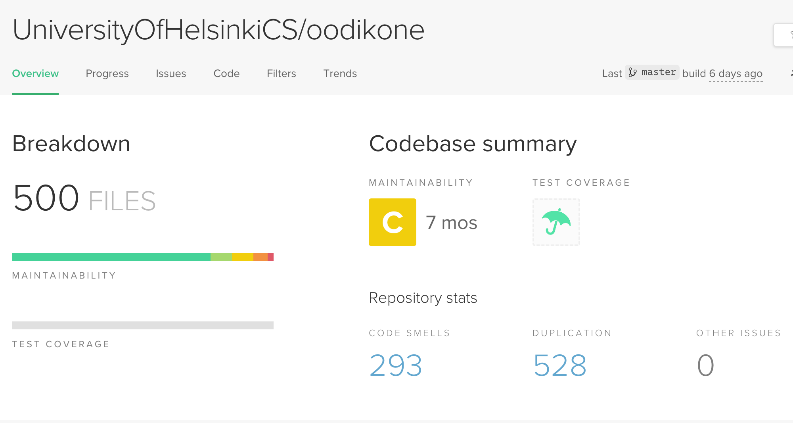{ width=400 }

#

{ width=400 }

#

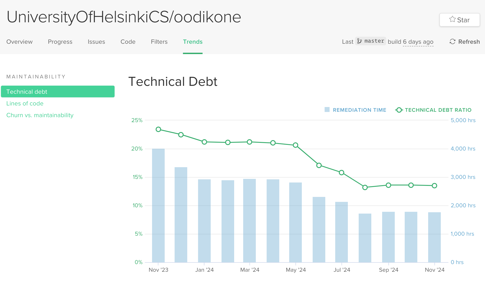{ width=400 }

#

{ width=400 }

# Koodin katselmointi: GitHub ja pull requestit

- GitHubin _pull requestit_ tarjoavat hyvän työkalun koodikatselmointiin

. . .

- Työn kulku on seuraava
  - Sovelluskehittäjä forkkaa repositorin itselleen, tekee muutokset omaan repositorioon ja tekee pull requestin
  - Joku, esim. _senior developer_ tekee katselmoinnin pull requestille
  - Jos koodi ei ole riittävän hyvää, annetaan pull requestin tekijälle parannusehdotuksia
  - Muutosten ollessa hyväksyttäviä, pull request mergetään päärepositorioon

# Pullrequest TMC:hen

{ width=350 }

#

{ width=350 }

# Koodin katselmointi ketterissä menetelmissä

. . .

- Toisin kuin Scrum, eXtreme Programming eli XP määrittelee useita sovelluskehityksen käytänteitä
  - Suuri osa näistä on hyvin tunnettuja _best practiseja_, vietynä äärimmäiseen (extreme) muotoon

. . .

- Osa käytänteistä tähtää laadun maksimoimiseen, kolmen voidaan ajatella olevan katselmoinnin äärimmäinen muoto

# Pariohjelmointi

- _Pariohjelmoinnissa_ (pair programming) kaksi ohjelmoijaa työskentelee yhdessä samalla koneella

. . .

- Koodia kirjoittava osapuoli toimii _ohjaajana_ (driver) ja toinen _navigoijana_ (navigator)
  - Roolia vaihdetaan sopivin väliajoin

. . .

- Navigoija tekee koodiin jatkuvaa katselmointia

# Pariohjelmoinnin etuja

- Parantaa ohjelmoijien kuria ja työhön keskittymistä

. . .

- Hyvä oppimisen väline
  - ohjelmoijat oppivat toisiltaan erityisesti noviisit kokeneimmilta, järjestelmän tietyn osan tuntee aina useampi ohjelmoija

. . .

- Todettu vähentävän bugien määrää 15-50%, kokonaisresurssin kulutus nousee hieman

# Pariohjelmoinnin yleisyys

- Pariohjelmointi tai useamman ihmisen versio siitä, _mob-programming_ on melko yleistä

. . .

- "Määritelmän" mukaista systemaattista pariohjelmointia tehdään aika harvassa paikassa aamusta iltaan

. . .

- Yleensä ohjelmoidaan yksin, mutta spontaania pariutumista ja ryhmäytymistä tapahtuu
  - erityisesti teknisesti haasteellisissa koodin osissa
  - tai jos kyse itselle tuntemattomasta osasta koodia

# Koodin katselmointi ketterissä menetelmissä

- _Koodin yhteisomistajuus_ (collective code ownership): kukaan yksittäinen ohjelmoija ei hallitse yksin mitään kohtaa koodista
  - Kaikilla lupa tehdä muutoksia mihin tahansa kohtaan koodia

. . .

- Pariohjelmointi tukee yhteisomistajuutta

. . .

- Yhteisomistajuudessa on riskinsä: koodia tuntematon voi saada pahaa jälkeä aikaan
  - XP eliminoi riskejä testauksiin liittyvillä käytänteillä

. . .

- _Ohjelmointistandardi_ (coding standards): tiimi määrittelee koodityylin, johon kaikki ohjelmoijat sitoutuvat
  - Tyylillä tarkoitetaan nimeämiskäytäntöä, koodin muotoilua ja myös tiettyjä ohjelman rakenteeseen liittyviä seikkoja

. . .

- Noudattamista kontrolloidaan katselmoimalla sekä automaattisesti staattisen analyysin työkaluilla kuten Pylintillä

# TAUKO 10 min

#

&nbsp;&nbsp;&nbsp;&nbsp;&nbsp;&nbsp;&nbsp;&nbsp;&nbsp;&nbsp;&nbsp;&nbsp;&nbsp;&nbsp;&nbsp;&nbsp;&nbsp;&nbsp;&nbsp;&nbsp;&nbsp;&nbsp;&nbsp;&nbsp;&nbsp;&nbsp;&nbsp;&nbsp;&nbsp;&nbsp;&nbsp;&nbsp;&nbsp;&nbsp;&nbsp;&nbsp;&nbsp;Testaus

# Testaus

- Ohjelmien osoittaminen virheettömäksi on mahdotonta

. . .

- Testauksen tarkoituksena vakuuttaa asiakas ja kehittäjät siitä, että ohjelmisto on _tarpeeksi hyvä_ käytettäväksi

. . .

- Testauksella on kaksi eriävää tavoitetta
  - osoittaa, että ohjelmisto täyttää sille asetetut vaatimukset
  - löytää ohjelmistosta virheitä

. . .

- Tähtää ohjelman _ulkoisen laadun_ (external quality) eli käyttäjän kokeman laadun parantamiseen
  - sopiiko sovellus sen käyttötarkoitukseen
  - toteuttaako halutun toiminnallisuuden
  - onko riittävän bugiton käytettäväksi

# Testauksen tasot

. . .

- _Yksikkötestaus_ (unit testing)
  - Yksittäisten luokkien, metodien ja moduulien testaus erillään muusta kokonaisuudesta

. . .

- _Integraatiotestaus_ (integration testing)
  - Yksittäin testattujen komponenttien liittäminen yhteen eli integrointi ja kokonaisuuden testaus

. . .

- _Järjestelmätestaus_ (system testing)
  - Toimiiko ohjelmisto vaatimuksiin kirjatulla tavalla?
  - Tutkii järjestelmää kokonaisuudessaan: _end to end -testaus_
  - Jakautuu useisiin alalajeihin

. . .

- _Käyttäjän hyväksymistestaus_ (user acceptance testing)
  - Loppukäyttäjän tuotteelle suorittama testaus

# "V-malli"

{ width=400 }

# Järjestelmätestaus

- Tarkoitus varmistaa, että järjestelmä toimii vaatimuksiin kirjatulla tavalla
  - Kehittäjäorganisaatio suorittaa järjestelmätestauksen

. . .

- Testaus tapahtuu yleensä ilman tietoa järjestelmän sisäisestä rakenteesta eli kyseessä _black box_ -testaus

. . .

- Testataan järjestelmää saman rajapinnan kautta, jonka kautta järjestelmää käytetään

. . .

- Tarkastelevat sovelluksen toiminnalisuutta kaikilla tasoilla käyttöliittymästä sovelluslogiikkaan ja tietokantaan
  - Käytetään nimitystä _End to End -testaus_

# Järjestelmätestaus

- Perustuu järjestelmän potentiaalisiin käyttöskenaarioihin
  - user storyinä olevista vaatimuksista helppo muotoilla testejä
  - jos storyillä hyväksymiskriteeriot, tilanne on vieläkin parempi

. . .

- Kutsutaan myös _toiminnallisiksi testeiksi_ (functional test)

. . .

- Toiminnallisen testauksen lisäksi järjestelmätestaukseen kuuluu mm.
  - Käytettävyystestaus
  - Suorituskykytestaus
  - Kuormitustestaus
  - Tietoturvan testaus
  - Saavutettavuuden testaus

# Kuormitustestaus: esimerkki

. . .

{ width=400 }

# Kuormitustestaus: ennen

{ width=400 }

# Kuormitustestaus: jälkeen

{ width=400 }

# Testitapausten valinta

- Yksi _Testitapaus_ testaa toiminnallisuutta joillakin syötteillä

. . .

- Kattava testaaminen on mahdotonta ja testaus työlästä
  - Oleellista löytää kohtuullisen kokoinen _testitapausten joukko_, jonka avulla löytyy suuri määrä virheitä

. . .

- Useat syötteet ohjelmiston toiminnan kannalta samanlaisia
  - nämä muodostavat _ekvivalenssiluokan_

. . .

- Jaetaan syötteet ekvivalenssiluokkiin ja tehdään yksi testitapaus jokaiseta ekvivalenssiluokkasta

. . .

- Erityisen kiinnostavia syötearvoja ovat ekvivalenssiluokkien väliset _raja-arvot_

. . .

- Henkilötietoja käsittelevä järjestelmä: henkilön iän ekvivalenssiluokat?
  - 0-6, 7-17, 18-65, 66-

# Testisyötteiden valinta: palautussovellus

- Mitä testitapauksia kannattaisi valita palautussovelluksen testaamiseen?

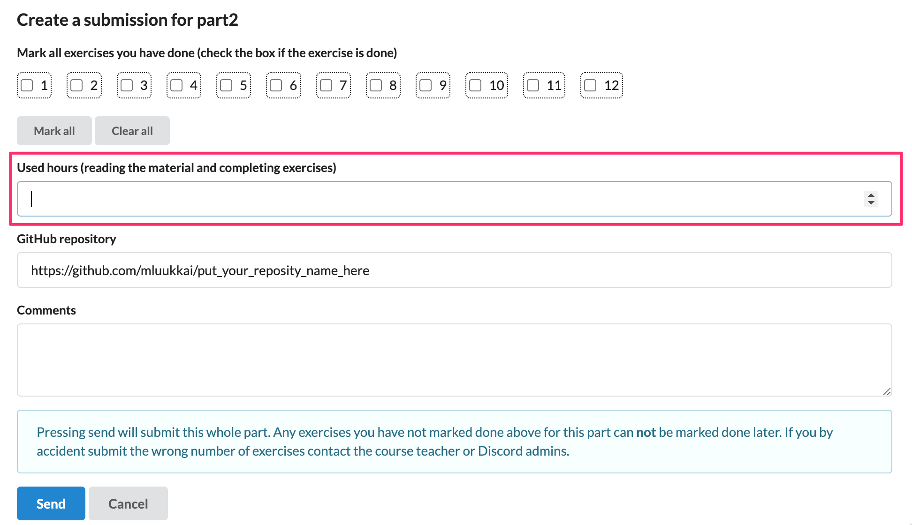{ width=350 }

# Testisyötteiden valinta: palautussovellus

- Tunnit
  - tyhjä
  - negatiivinen
  - nolla
  - positiivinen järkevä arvo (esim. 5)
  - positiivinen mutta epärealistinen (esim. 1000)
  - merkkejä sisältävä syöte

. . .

- Repositorio
  - tyhjä
  - validi repositoriolinkki
  - epävalidi merkkijono 

# Yksikkötestaus

. . .

- Kohteena siis yksittäiset metodit ja luokat

  - _Developer testing_: sovelluskehittäjien vastuulla
      
. . .

- Testattavan koodin rakenne otetaan huomioon testejä laatiessa, _lasilaatikkotestausta_ (white box testing)

. . .

- Päätarkoitus _sisäisen laadun_ (internal quality) kontrollointi
  - onko virheiden jäljitys ja korjaaminen helppoa
  - onko koodia helppo laajentaa ja jatkokehittää
  - pystytäänkö koodin toiminnallisuuden oikeellisuus varmistamaan muutoksia tehtäessä

# Yksikkötestaus

- Iteratiivisessa kehityksessä sisäisellä laadulla suuri merkitys
  - ohjelmistoa laajennetaan koko ajan

. . .

- Edesauttaa myös ulkoista eli asiakkaan kokemaa laatua
  - Yksikkötestit voivat eliminoida joitain asiakkaalle näkyviä virheitä, joita järjestelmätestauksen testitapaukset eivät löydä

. . .

- Bugit on taloudellisesti edullista paikallistaa mahdollisimman aikaisessa vaiheessa
  - yksikkötestauksessa löydetty bugi on halvempi ja nopeampi korjata kuin järjestelmä- tai integraatiotestauksessa löytyvä

. . .

- Koska yksikkötestejä joudutaan suorittamaan moneen kertaan, tulee niiden suorittaminen _automatisoida_

# Mitä tulisi (yksikkö)testata?

- Automatisoidun testauksen esi-isän Kent Beckin vastaus:
  - "Do I have to write a test for everything?"
  - "No, just test everything that could reasonably break"

. . .

- Optimitilanteessa testitapaukset
  - kaikkien metodit ja niiden kutsukombinaatiot hyväksyttävillä parametrien arvoilla
  - ja virheellisillä parametrien arvoilla

. . .

- Ekvivalenssiluokat ja niiden raja-arvot kannattaa huomioida
  - testien parametrien ekvivalenssiluokat ja raja-arvot pääteltävissä koodista

# Testauskattavuus

- Testien laajuutta voidaan mitata _testauskattavuuden_ (test coverage) käsitteellä

. . .

- Muutamaa eri tyyppiä
  - **rivikattavuus**
  - **haarautumakattavuus**
  - ehtokattavuus
  - polkukattavuus

. . .

- Rivi- ja haarautumakattavuudelle hyvä työkalutuki, esim. coverage Pythonille

#

{ width=400 }

# Ohjelmiston integraatio

. . .

- Järjestelmän yksittäiset, erillään yksikkötestatut luokat tulee integroida toimivaksi kokonaisuudeksi

. . .

- Integroinnin yhteydessä tai sen jälkeen suoritetaan integrointitestaus
  - Toimivatko komponentit yhdessä?

. . .

- Kaksi lähestymistapaa:
  - rakenteeseen perustuva
  - toiminnallisuuksiin perustuva

# Rakenteeseen perustuva integraatio

- _Rakenteeseen perustuvassa_ integraatiossa keskitytään kerrallaan sovelluksen yksittäisten arkkitehtuurillisten komponenttien integrointiin

. . .

- Verkkokaupassa integroitaisiin sovelluslogiikan luokat, käyttöliittymän luokat ja tietokantarajapinta ensin omina kokonaisuuksinaan

. . .

{ width=100 }

# Rakenteeseen perustuva integraatio

- _Rakenteeseen perustuvassa_ integraatiossa keskitytään kerrallaan sovelluksen yksittäisten arkkitehtuurillisten komponenttien integrointiin

- Verkkokaupassa integroitaisiin sovelluslogiikan luokat, käyttöliittymän luokat ja tietokantarajapinta ensin omina kokonaisuuksinaan

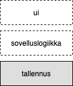{ width=100 }

# Rakenteeseen perustuva integraatio

- _Rakenteeseen perustuvassa_ integraatiossa keskitytään kerrallaan sovelluksen yksittäisten arkkitehtuurillisten komponenttien integrointiin

- Verkkokaupassa integroitaisiin sovelluslogiikan luokat, käyttöliittymän luokat ja tietokantarajapinta ensin omina kokonaisuuksinaan

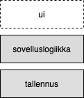{ width=100 }

# Rakenteeseen perustuva integraatio

- _Rakenteeseen perustuvassa_ integraatiossa keskitytään kerrallaan sovelluksen yksittäisten arkkitehtuurillisten komponenttien integrointiin

- Verkkokaupassa integroitaisiin sovelluslogiikan luokat, käyttöliittymän luokat ja tietokantarajapinta ensin omina kokonaisuuksinaan

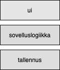{ width=100 }

# Rakenteeseen perustuva integraatio

- _Rakenteeseen perustuvassa_ integraatiossa keskitytään kerrallaan sovelluksen yksittäisten arkkitehtuurillisten komponenttien integrointiin

- Verkkokaupassa integroitaisiin sovelluslogiikan luokat, käyttöliittymän luokat ja tietokantarajapinta ensin omina kokonaisuuksinaan

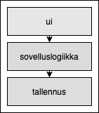{ width=100 }

# Ominaisuuksiin perustuva integraatio

- _Ominaisuuksiin perustuvassa_ integroinnissa liitetään yhteen alikomponentit, jotka toteuttavat järjestelmän loogisen toimintakokonaisuuden

. . .

- Esim. integroidaan kerrallaan kaikki storyn _lisää tuote ostoskoriin_ toteutukseen liittyvä koodi
  - Tämän jälkeen integroidaan seuraavan storyn koodi

. . .

{ width=100 }

# Ominaisuuksiin perustuva integraatio

- _Ominaisuuksiin perustuvassa_ integroinnissa liitetään yhteen alikomponentit, jotka toteuttavat järjestelmän loogisen toimintakokonaisuuden

- Esim. integroidaan kerrallaan kaikki storyn _lisää tuote ostoskoriin_ toteutukseen liittyvä koodi
  - Tämän jälkeen integroidaan seuraavan storyn koodi

{ width=100 }

# Ominaisuuksiin perustuva integraatio

- _Ominaisuuksiin perustuvassa_ integroinnissa liitetään yhteen alikomponentit, jotka toteuttavat järjestelmän loogisen toimintakokonaisuuden

- Esim. integroidaan kerrallaan kaikki storyn _lisää tuote ostoskoriin_ toteutukseen liittyvä koodi
  - Tämän jälkeen integroidaan seuraavan storyn koodi

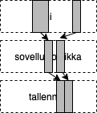{ width=100 }

# Ominaisuuksiin perustuva integraatio

- _Ominaisuuksiin perustuvassa_ integroinnissa liitetään yhteen alikomponentit, jotka toteuttavat järjestelmän loogisen toimintakokonaisuuden

- Esim. integroidaan kerrallaan kaikki storyn _lisää tuote ostoskoriin_ toteutukseen liittyvä koodi
  - Tämän jälkeen integroidaan seuraavan storyn koodi

{ width=100 }

# Ohjelmiston integraatio

- Vesiputuoksen toimintatapa
  - Yksittäiset komponentit ohjelmoidaan ja yksikkötestataan erikseen
  - Tämän jälkeen ne integroidaan, yleensä rakenteeseen perustuen, kerralla yhteen

. . .

- Tämän tyylinen _big bang_ -integraatio on osoittautunut todella riskialttiiksi
  - Seurauksena usein ns. **integraatiohelvetti**

. . .

- Moderni ohjelmistotuotanto suosii ns. _jatkuvaa integraatiota_
  - Hyvin tiheässä tahdissa tapahtuvaa ominaisuuksiin perustuvaa integrointia

# Regressiotestaus

- Iteratiivisessa ohjelmistotuotannossa, jokainen iteraatio tuottaa ohjelmistoon uusia ominaisuuksia
  - Samalla tulee huolehtia, että ei rikota jo toimivia osia

. . .

- Testit on suoritettava uudelleen aina kun ohjelmistoon tehdään muutoksia
- Tätä käytäntöä sanotaan _regressiotestaukseksi_

. . .

- Regressiotestijoukko koostuu kaikista ohjelmistolle tehdyistä testeistä
  - sisältää yksikkö-, integraatio- ja järjestelmätesteistä

. . .

- Testaus on työlästä ja regressiotestauksen tarve tekee siitä entistä työläämpää
  - _Testaus kannattaa automatisoida_ mahdollisimman suurissa määrin

# Testauksen tasot: kertaus

. . .

- _Yksikkötestaus_ (unit testing)
  - Yksittäisten luokkien, metodien ja moduulien testaus erillään muusta kokonaisuudesta

- _Integraatiotestaus_ (integration testing)
  - Yksittäin testattujen komponenttien liittäminen yhteen eli integrointi ja kokonaisuuden testaus

- _Järjestelmätestaus_ (system testing)
  - Toimiiko ohjelmisto vaatimuksiin kirjatulla tavalla?
  - Tutkii järjestelmää kokonaisuudessaan: _end to end -testaus_
  - Jakautuu useisiin alalajeihin

- _Käyttäjän hyväksymistestaus_ (user acceptance testing)
  - Loppukäyttäjän tuotteelle suorittama testaus

# Huomenna

. . .

- Ketterien menetelmien suosimia testauksen ja laadunhallinnan käytänteitä
% Ohjelmistotuotanto
% Matti Luukkainen ja ohjaajat Antti, Pooki, Riku, Sini, Taneli
% syksy 2024

#

&nbsp;&nbsp;&nbsp;&nbsp;&nbsp;&nbsp;&nbsp;&nbsp;&nbsp;&nbsp;&nbsp;&nbsp;&nbsp;&nbsp;&nbsp;&nbsp;&nbsp;&nbsp;&nbsp;&nbsp;&nbsp;&nbsp;&nbsp;&nbsp;&nbsp;&nbsp;&nbsp;&nbsp;&nbsp;&nbsp;&nbsp;&nbsp;&nbsp;&nbsp;&nbsp;&nbsp;&nbsp;Luento 6

&nbsp;&nbsp;&nbsp;&nbsp;&nbsp;&nbsp;&nbsp;&nbsp;&nbsp;&nbsp;&nbsp;&nbsp;&nbsp;&nbsp;&nbsp;&nbsp;&nbsp;&nbsp;&nbsp;&nbsp;&nbsp;&nbsp;&nbsp;&nbsp;&nbsp;&nbsp;&nbsp;&nbsp;&nbsp;&nbsp;&nbsp;&nbsp;&nbsp;&nbsp;&nbsp;&nbsp;12.11.2024

# Kurssipalaute

- Kurssipalaute
  - Kurssilla lopussa kerättävän palautteen lisäksi ns. jatkuva palaute https://norppa.helsinki.fi

# 

- Luennot
  - ma ja ti 12-14
  - vierailuluentojen ajankohdassa pieni muutos...

- Pajaa salissa BK107 
  - ma 14-16
  - to 13-15
  - pe 12-14 (tänä pe poikkeuksellisesti klo 13-15)

# Miniprojektit

- Kohta alkaa!

- Aloitustilaisuudet
  - ti 14-16
  - ke 14-16
  - ke 16-18
  - to 10-12
  - to 14-16

- Seuraavat viikot: sprinttien katselmus ja suunnittelu samassa aikaikkunassa

- Loppudemot
  - ke 11.12. klo 12-14 B123
  - to 12.12. klo 12-14 CK112

# Testauksen tasot

- _Yksikkötestaus_ (unit testing)
  - Yksittäisten luokkien, metodien ja moduulien testaus erillään muusta kokonaisuudesta

- _Integraatiotestaus_ (integration testing)
  - Yksittäin testattujen komponenttien liittäminen yhteen eli integrointi ja kokonaisuuden testaus

- _Järjestelmätestaus_ (system testing)
  - Toimiiko ohjelmisto vaatimuksiin kirjatulla tavalla?
  - Tutkii järjestelmää kokonaisuudessaan: _end to end -testaus_
  - Jakautuu useisiin alalajeihin

- _Käyttäjän hyväksymistestaus_ (user acceptance testing)
  - Loppukäyttäjän tuotteelle suorittama testaus

# Regressiotestaus

- Iteratiivisessa ohjelmistotuotannossa, jokainen iteraatio tuottaa ohjelmistoon uusia ominaisuuksia
  - Samalla tulee huolehtia, että ei rikota jo toimivia osia

. . .

- Testit on suoritettava uudelleen aina kun ohjelmistoon tehdään muutoksia
- Tätä käytäntöä sanotaan _regressiotestaukseksi_

. . .

- Testaus on työlästä ja regressiotestauksen tarve tekee siitä entistä työläämpää
  - syytä automatisoida


# Ketterien menetelmien testauskäytänteet

. . .

- Testauksen rooli ketterissä menetelmissä poikkeaa huomattavasti vesiputousmallista
  - Sprintin aikana toteutettavat ominaisuudet integroidaan muuhun koodiin sekä testataan

. . .

- Sykli ominaisuuden määrittelystä siihen että se on valmis ja testattu on erittäin lyhyt

. . .

- Testausta tehdään sprintin "ensimmäisestä päivästä" lähtien, testaus integroitu suunnitteluun ja toteutukseen

. . .

- Automatisointi erittäin tärkeässä roolissa
  - testejä suoritetaan usein

# Testaajat osana kehitystiimiä

- Ideaalitilanteessa testaajia sijoitettu kehittäjätiimiin, myös ohjelmoijat kirjoittavat testejä
  - tiimit _cross functional_

. . .

- Testaajan rooli: _virheiden etsijästä virheiden estäjään_
  - testaaja auttaa tiimiä kirjoittamaan automatisoituja testejä, jotka pyrkivät estämään bugien pääsyn koodiin
  - _build quality in_

# Ketterien menetelmien testauskäytänteitä

Tänään aiheena

. . .

- Test driven development (TDD)
- User storyjen tasolla tapahtuva automatisoitu testaus
- Continuous Integration (CI) eli jatkuva integraatio
- Exploratory testing, suomeksi tutkiva testaus
- Tuotannossa tapahtuva testaus

# Test driven development (TDD)

{ width=340 }

. . .

1. Kirjoitetaan sen verran testiä että testi ei mene läpi

. . .

2. Kirjoitetaan koodia sen verran, että testi menee läpi

. . .

3. Jos huomataan koodin rakenteen menneen huonoksi refaktoroidaan koodin rakenne paremmaksi

. . .

4. Jatketaan askeleesta 1

# Test driven development (TDD)

- Yksi XP:n käytänteistä, Kent Beckin kehittämä
  - Joskus käytössä _tests first development_

. . .

- TDD:llä ohjelmoitaessa toteutettavaa komponenttia ei yleensä ole tapana suunnitella tyhjentävästi etukäteen

. . .

- Testit kirjoitetaan ensisijaisesti ajatellen komponentin käyttöä
  - huomio komponentin rajapinnassa ja sen helppokäyttöisyydessä
  - ei niinkään komponentin sisäisessä toteutuksessa

. . .

- Komponentin sisäinen rakenne muotoutuu refaktorointien kautta

. . .

- _"Ensin testataan, sitten koodataan, suunnitellaan vasta lopussa"_

#

- TDD:ssä korostetaan lopputuloksen yksinkertaisuutta

. . .

- Toteutetaan toiminnallisuutta vain sen verran, mitä testien läpimeno edellyttää
  - Ei toteuteta ”varalta” ekstratoiminnallisuutta, sillä "You ain't gonna need it" (YAGNI)
  - _Simplicity – the art of maximizing the amount of work not done – is essential_

. . .

- Koodista on vaikea tehdä testattavaa jos se ei ole modulaarista ja löyhästi kytketyistä komponenteista koostuvaa
  - koodista laadukasta ylläpidettävyyden ja laajennettavuuden kannalta

. . .

- Muita TDD:n hyviä puolia:
  - Rohkaisee ottamaan pieniä askelia kerrallaan ja toimimaan fokusoidusti
  - Virheet havaitaan nopeasti suuren testijoukon takia

# TDD:llä on myös ikävät puolensa

- Testikoodia tulee paljon, usein suunnilleen saman verran kuin varsinaista koodia
  - Toisaalta TDD:llä tehty tuotantokoodi on usein hieman normaalisti tehtyä koodia lyhempi

. . .

- Jos ja kun koodi muuttuu, tulee testejä ylläpitää

- Legacy-koodin laajentaminen TDD:llä voi olla haastavaa

. . .

- Tutkimusnäyttö TDD:n hyödyistä vähäistä

# 15.1.2025-

. . .

Open Uni: Test-Driven Development 4 + 1 cr

- Esko Luontola Nitor (Suomen johtava TDD-asiantuntija)

{ width=350 }

# Storyjen testaaminen

. . .

- User storyn käsite pitää sisällään _hyväksymiskriteerit_
  - _tests that convey and document details and that will be used to determine that the story is complete_

. . .

- Storyn _asiakas voi lisätä tuotteen ostoskoriin_ eräs hyväksymiskriteeri voisi olla
  - ollessaan tuotelistauksessa ja valitessaan tuotteen jota on varastossa, menee tuote ostoskoriin 
  - ja ostoskorin hinta sekä korissa olevien tuotteiden määrä päivittyy oikein

. . .

- Hyväksymiskriteereistä saadaan muodostettua suurin osa ohjelmiston järjestelmätason toiminnallisista testeistä

# Järjestelmätestauksen automatisointi, ATDD ja BDD

- Hyväksymiskriteerit on tarkoituksenmukaista kirjoittaa heti storyn toteuttavan sprintin alussa
  - yhteistyössä kehitystiimin ja product ownerin kesken
  - asiakkaan kielellä, käyttämättä teknistä jargonia

. . .

- Ideaalitilanteessa storyjen hyväksymiskriteereistä tehdään automaattisesti suoritettavia

. . .

- Olemassa monia työkaluja
  - eräs suosituimmista on suomalainen Python-pohjainen _Robot framework_ jota kurssin Python-versio käyttää

. . .

- Käytetään nimitystä _Acceptance test driven development_ (ATDD) tai _Behavior driven development_ (BDD)
  - erityisesti jos testit toteutetaan jo iteraation alkupuolella, ennen kun story koodattu

# Käyttäjähallinnan tarjoama palvelu

- Palvelun vaatimukset määrittelevät user storyt
  - A new user account can be created if a proper unused username and a proper password are given
  - User can log in with a valid username/password-combination

. . .

- Robot-frameworkia käytettäessä jokaisesta storystä kirjoitetaan .robot- päätteinen tiedosto
  - sisältää joukon storyyn liittyvä hyväksymistestejä

. . .

- Storyn hyväksymätestit kirjoitetaan hyödyntäen _avainsanoja_

# Testit asiakkan kielellä

{ width=400 }

- _Set username_, _Submit credentials_ ym avainsanoja

# Avainsanat mäpätään suoritettavaksi

- Avainsanojen määrittely toisten avainsanojen avulla

{ width=340 }

- osa avainsanoista SeleniumLibraryn tarjoamia

. . .

- tai koodina


# Motivaatio käyttäjän kielellä kirjoitetuille testeille

. . .

- Product owner kirjoittaa tiimin kanssa storyyn liittyvät testit
  - storyn haluttu toiminnallisuus tulee dokumentoitua ja ohjelmoijat ymmärtävät mistä on kyse

. . .

- Koodaajat/testaajat toteuttavat avainsanat siten, että testien automaattinen suoritus onnistuu

. . .

- Ei toistaiseksi vielä kovin yleinen tyyli, useimmiten hyväksymätestit kirjoitettu suoraan "normalilla" testikirjastolla
  - JUnit, Mocha, Jest, Rspec ...
  - Cypress, Playwright

# Tauko 10 min ehkä nyt...

# Ohjelmiston integraatio

. . .

- Vesiputousmallissa toteutusvaiheen päättää integrointi
  - Yksittäin testatut komponentit yhdessä toimivaksi kokonaisuudeksi
  - Yhteistoiminnallisuus varmistetaan **integraatiotestien** avulla

. . .

- Perinteisesti integrointi on tuonut esiin paljon ongelmia
  - Tarkasta suunnittelusta huolimatta erillisten tiimien toteuttamat komponentit epäyhteensopivia

. . .

- Suurten projektien integrointivaihe on kestänyt ennakoimattoman kauan

. . .

- Integrointivaiheen ongelmat ovat aiheuttaneet ohjelmaan suunnittelutason muutoksia

. . .

- **Integratiohelvetti**

# Pois integraatiohelvetistä

- 90-luvulla huomattiin, että riskien minimoimiseksi integraatio kannattaa tehdä useammin kuin vain projektin lopussa

. . .

- Muodostui uusi paras käytänne: _daily build_ ja _smoke test_
  - The _smoke test_ should exercise the entire system from end to end.
  - It does not have to be exhaustive,
  - but it should be capable of exposing major problems

. . .

- Daily buildia ja smoke testiä käytettäessä järjestelmän integraatio tehdään (ainakin jollain tarkkuustasolla) joka päivä

. . .

- Komponenttien yhteensopivuusongelmat huomataan nopeasti ja niiden korjaaminen helpottuu

. . .

- **Tiimin moraali paranee**, kun ohjelmistosta on olemassa päivittäin kasvava toimiva versio

# Päivittäisestä jatkuvaan integraatioon

- Syntyi idea toistaa integraatiota vielä päivittäistä sykliäkin useammin: _jatkuva integraatio eli continuous integration_
  - eräs XP:n käytenäteistä

. . .

- Koodi, automatisoidut testi, konfiguraatiot ja build-skriptit pidetään keskitetyssä repositoriossa

. . .

- _CI-palvelin_: vastaa konfiguraatioilta mahdollisimman läheisesti tuotantopalvelinta

. . .

- CI-palvelin tarkkailee repositoriota, muutosten tapahtuessa se hakee koodin, kääntää sen ja suorittaa testit

. . .

- Jos koodi ei käänny tai testit eivät mene läpi, seurauksena poikkeustilanne joka korjattava _välittömästi_

. . .

- **Integraatiosta vaivaton operaatio**: ohjelmistosta olemassa koko ajan integroitu ja testattu tuore versio

#

- Sovelluskehittäjä aloittaa työskentelyn hakemalla koodin uusimman version versionhallinnasta

. . .

- Kehittäjä integroi koodinsa heti muuhun koodiin ja tekee riittävän määrän automatisoituja testejä

. . .

- Tarkoitus että jokainen kehittäjä integroi koodinsa muuhun koodiin mahdollisimman usein, vähintään kerran päivässä

. . .

- CI rohkaisee jakamaan työn pieniin osiin, sellaisiin jotka saadaan testeineen valmiiksi yhden työpäivän aikana
  - **CI-työprosessin noudattaminen vaatii kurinalaisuutta**

. . .

- Laskareissa käytetty _GitHub Actions_ suosituin SaaS-palveluna toimiva CI-ratkaisu

. . .

- Vanhempi Jenkins lienee edelleen maailmalla eniten käytetty CI-palvelinohjelmisto
  - Jenkinsin käyttö edellyttää sen asentamista omalle palvelimelle

# Tauko 10 min

# Deployment pipeline

- Viimeaikaisen trendin mukaan CI:tä viedään vielä askel pidemmälle

. . .

- Integraatioprosessiin lisätään automaattinen vienti **staging-palvelimelle**
  - Ympäristö, joka kaikin tavoin mahdollisimman lähellä tuotantoympäristöä

. . .

- Kun uusi versio viety staging-palvelimelle, suoritetaan sille hyväksymistestaus

. . .

- ...jonka jälkeen siirto **tuotantopalvelimelle**

. . .

- Parhaassa tapauksessa staging-ympäristössä tehtävien hyväksymätestien suoritus on automatisoitu
  - Ohjelmisto kulkee koko _deployment pipelinen_ läpi automaattisesti

# Deployment pipeline

- Vaiheet, joiden suorittaminen edellytetään, että commitattu koodi saadaan siirrettyä staging/tuotantoympäristöön

{ width=400 }

# Termejä: jatkuva toimittaminen ja toimitusvalmius

-  **Jatkuvasta toimittaminen engl. continuous deployment**
    - Jokainen testit läpäisevä commit päätyy automaattisesti tuotantoon

. . .

- **Jatkuvaa toimitusvalmius engl. continuous delivery**:
  - tuotantoonvientipäätös tehdään ihmisen toimesta 

. . .

- Viime aikojen trendi julkaista web-palvelusta jopa kymmeniä uusia versiota päivästä
  - Amazon, Netflix, Facebook, Unity, Smartly...

# Tutkiva testaaminen

- Jotta järjestelmä saadaan riittävän virheettömäksi, on testaus suoritettava erittäin perusteellisesti

. . .

- Perinteinen tapa järjestelmätestauksen on ollut laatia ennen testausta hyvin perinpohjainen suunnitelma
  - Jokaisesta testistä on kirjattu testisyötteet ja odotettu tulos

. . .

- Tuloksen tarkastaminen
  - Verrataan ohjelmiston toimintaa testitapaukseen kirjattuun odotettuun tulokseen

#

{ width=400 }

#

{ width=400 }

#

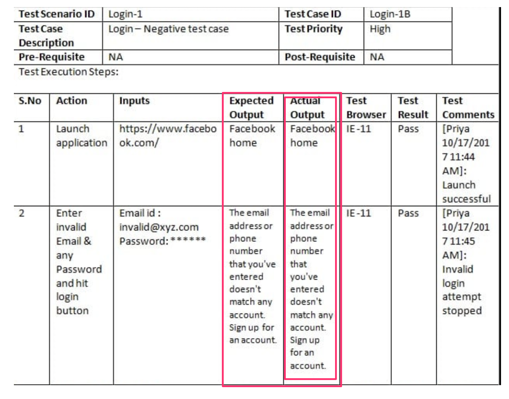{ width=400 }

#

- Automatisoitujen hyväksymistestien luonne sama, syöte on tarkkaan kiinnitetty samoin kuin odotettu tuloskin

. . .

- Jos testataan vain etukäteen mietittyjen testien avulla, ei kaikkia yllättäviä tilanteita osata ennakoida

. . .

- Hyvät testaajat ovat aina tehneet "virallisen" dokumentoidun testauksen lisäksi epävirallista "ad hoc"-testausta

. . .

- Tästä tullut virallisesti hyväksytty testauksen muoto, kulkee nimellä _tutkiva testaaminen_ (engl. exploratory testing)

# Tutkiva testaaminen

- _Exploratory testing is simultaneous learning, test design and test execution_

. . .

- Testitapauksia ei suunnitella kattavasti etukäteen
  - Testaaja pyrkii kokemuksensa avulla löytämään järjestelmästä virheitä
  - Testaaja ohjaa toimintaansa suorittamiensa testien tuloksen perusteella

. . .

- Tutkiva testaaminen ei kuitenkaan etene täysin sattumanvaraisesti
  - Testaussessiolle asetetaan tavoite: mitä tutkitaan ja minkälaisia virheitä etsitään

. . .

- Tavoite voi liittyä esim. muutaman user storyn toiminnallisuuteen
  - _testataan ostosten lisäystä ja poistoa ostoskorista_

# Tutkiva testaaminen

- Keskeistä on kaikkien ohjelmiston tapahtuvien asioiden havainnointi
  - Etukäteen määritellyissä testeissä havainnoidaan ainoastaan reagoiko järjestelmä odotetulla tavalla

. . .

- Kiinnitetään huomio myös varsinaisen testauksen kohteen ulkopuoleisiin asioihin
  - Klikkaillaan käyttöliittymän nappuloita epäloogisissa tilanteissa
  - Jos huomataan selaimen osoiterivillä URL https://www.webshopshop.com/ostoskori?id=10 katsotaan mitä tapahtuu jo id muutetaan käsin
  - ...

. . .

- Tietoturvan testaamisessa on monia tyypillisiä skenaariota, joita testataan tutkivan testaamisen menetelmin
  - Esim. SQL- ja JavaScript-injektiot

# Tutkiva testaaminen

- Löydettyjen virheiden toistuminen jatkossa kannattaa eliminoida tekemällä automatisoituja regressiotestejä

. . .

- Tutkivaa testaamista ei kannata käyttää regressiotestaamisen menetelmänä
  - Testataan sprintin yhteydessä toteutettuja uusia ominaisuuksia

. . .

- Ei vaihtoehto normaaleille tarkkaan etukäteen määritellyille testeille vaan niitä täydentävä testauksen muoto


# Tuotannossa tapahtuva testaaminen ja laadunhallinta

. . .

- Perinteisesti ajateltu: kaikki laadunhallintaan tehdään ennen kuin uudet toiminnallisuudet otetaan käyttöön 

{ width=400 }

# Tuotannossa tapahtuva testaaminen ja laadunhallinta

- Perinteisesti ajateltu: kaikki laadunhallintaan tehdään ennen kuin uudet toiminnallisuudet otetaan käyttöön 

{ width=400 }


- Viime aikainen trendi on tehdä osa laadunhallinnasta *monitoroimalla* tuotannossa olevaa ohjelmistoa

# Canary release

- Kaksi rinnakkaista tuotantoympäristöä, joista uudet ominaisuudet viedään toiseen

. . .

{ width=400 }

- Uuden ominaisuuden sisältävään ympäristöön ohjataan osa järjestelmän käyttäjistä

. . .

- Uuden ominaisuuden sisältämää versiota _monitoroidaan_ 
  - jos ei ongelmia  ohjataan kaikki liikenne uuteen versioon

#

- Uuden version toimivaksi varmistaminen perustuu järjestelmän _monitorointiin_

. . .

- Esim. sosiaalisen median palvelussa 
  - palvelun muistin ja prosessoriajan kulutusta 
  - verkkoliikenteen määrää 
  - sovelluksen eri sivujen vasteaikoja
  - kirjautuneiden käyttäjien määrää
  - luettujen ja lähetettyjen viestien määriä per käyttäjä
  - kirjautuneen käyttäjän sovelluksessa viettämää aikaa

. . .

- Monitoroidaan palvelimen yleisen toimivuuden lisäksi 
_käyttäjätason metriikoita_ (engl. business level metrics)

. . .

- Jos suuria eroja aiempaan, tehdään **rollback edelliseen versioon**
  - esim. kirjautuneet käyttäjät eivät lähetä viestejä samaa määrää kuin keskimäärin normaalisti

. . .

- Testauksen ja kaikkien tuotantoon vientiin liittyvän on syytä tapahtua automatisoidusti

# Feature toggle

- _Feature togglejen_ avulla voidaan canary releaset toteuttaa käyttämällä yhtä tuotantopalvelinta

. . .

- Koodiin _ehtolauseita_: osa liikenteestä ohjataan vanhan toteutuksen sijaan testauksen alla olevaan toteutukseen

. . .

- Esim. some-palvelussa feature toggle: _osalle käytetään näytetään uuden algoritmin perusteella generoitu lista uutisia_

```python
def recommended_news_generator(user): 
    if is_in_canary_release(user):
        return experimental_recommendation_algorithm(user)
    else:
        return recommendation_algoritm(user)
```

# Feature togglejen soveltaminen

- Aluksi piilotetaan uusi ominaisuus käyttäjiltä feature toggleilla
  - eli toggle palauttaa vanhan version normaaleille käyttäjille

. . .

- Sovellus kehittäjien mahdollista valita kumman version toggle palauttaa

. . .

- Kun valmiina laajempaan testiin, julkaistaan esim. 
    - ensin kehittäjäyrityksen omaan käyttöön 
    - sitten osalle käyttäjistä canary releasena

. . .

- Lopulta feature toggle ja vanha toteutus voidaan poistaa

# 

- Suuret internetpalvelut soveltavat laajalti canary releaseihin ja feature flageihin perustuvaa kehitysmallia
  - Facebook, Netflix, Google, Flickr, ...
  - Suomessa esim. Veikkaus

{ width=400 }

. . .

- A/B-testaus: arvioidaan onko uusi toteutus parempi kuin vanha

. . .

- Kerrallaan voi olla menossa useita kymmeniä A/B-testattavia eksperimenttejä
% Ohjelmistotuotanto
% Matti Luukkainen ja ohjaajat Antti, Pooki, Riku, Sini, Taneli
% syksy 2024

#

&nbsp;&nbsp;&nbsp;&nbsp;&nbsp;&nbsp;&nbsp;&nbsp;&nbsp;&nbsp;&nbsp;&nbsp;&nbsp;&nbsp;&nbsp;&nbsp;&nbsp;&nbsp;&nbsp;&nbsp;&nbsp;&nbsp;&nbsp;&nbsp;&nbsp;&nbsp;&nbsp;&nbsp;&nbsp;&nbsp;&nbsp;&nbsp;&nbsp;&nbsp;&nbsp;&nbsp;&nbsp;Luento 7

&nbsp;&nbsp;&nbsp;&nbsp;&nbsp;&nbsp;&nbsp;&nbsp;&nbsp;&nbsp;&nbsp;&nbsp;&nbsp;&nbsp;&nbsp;&nbsp;&nbsp;&nbsp;&nbsp;&nbsp;&nbsp;&nbsp;&nbsp;&nbsp;&nbsp;&nbsp;&nbsp;&nbsp;&nbsp;&nbsp;&nbsp;&nbsp;&nbsp;&nbsp;&nbsp;&nbsp;18.11.2024

# Kurssipalaute

- Kurssipalaute
  - Kurssilla lopussa kerättävän palautteen lisäksi ns. jatkuva palaute https://norppa.helsinki.fi

# 

- Luennot
  - ma ja ti 12-14
  - vierailuluentojen ajankohdassa pieni muutos...
    - ti 26.11 vierailijoita
    - ti 3.12 normaali luento

- Pajaa salissa BK107 
  - ma 14-16
  - to 13-15
  - pe 12-14


# Ketterien menetelmien testauskäytänteitä

. . .

- Sprintissä toteutettavat storyt integroidaan ja testataan sprintin aikana

. . .

- Automatisointi tärkeässä roolissa

. . .

- Ideaalitilanteessa testaajia sijoitettu kehittäjätiimiin, myös ohjelmoijat kirjoittavat testejä
  - tiimit _cross functional_ 

# Ketterien menetelmien testauskäytänteitä

. . .

- Test driven development (TDD)
  - Sivutuotteena paljon automaattisesti suoritettavia testejä

. . .

- User storyjen tasolla tapahtuva automatisoitu testaus
  - Robot

. . .

- Exploratory testing, suomeksi tutkiva testaus
  - Järjestelmätestauksen tekniikka, jossa testaaminen tapahtuu ilman formaalia testaussuunnitelmaa

. . .

- Jatkuva integraatio (CI) ja jatkuva toimittaminen (CD)
  - Ulottuu jopa sovelluksen tuotantoonviemiseen


# Tuotannossa tapahtuva testaaminen ja laadunhallinta

- Perinteisesti ajateltu: kaikki laadunhallintaan tehdään ennen kuin uudet toiminnallisuudet otetaan käyttöön 

{ width=400 }


- Viime aikainen trendi on tehdä osa laadunhallinnasta *monitoroimalla* tuotannossa olevaa ohjelmistoa

# Canary release

- Kaksi rinnakkaista tuotantoympäristöä, joista uudet ominaisuudet viedään toiseen


{ width=400 }

- Uuden ominaisuuden sisältävään ympäristöön ohjataan osa järjestelmän käyttäjistä

- Uuden ominaisuuden sisältämää versiota _monitoroidaan_ 
  - jos ei ongelmia  ohjataan kaikki liikenne uuteen versioon

# Feature toggle

- _Feature togglejen_ avulla voidaan canary releaset toteuttaa käyttämällä yhtä tuotantopalvelinta

. . .

- Koodiin _ehtolauseita_: osa liikenteestä ohjataan vanhan toteutuksen sijaan testauksen alla olevaan toteutukseen

- Esim. some-palvelussa feature toggle: _osalle käytetään näytetään uuden algoritmin perusteella generoitu lista uutisia_

```python
def recommended_news_generator(user): 
    if is_in_canary_release(user):
        return experimental_recommendation_algorithm(user)
    else:
        return recommendation_algoritm(user)
```

# Feature togglejen soveltaminen

- Aluksi piilotetaan uusi ominaisuus käyttäjiltä feature toggleilla
  - eli toggle palauttaa vanhan version normaaleille käyttäjille

. . .

- Kun valmiina laajempaan testiin, julkaistaan esim. 
    - ensin kehittäjäyrityksen omaan käyttöön 
    - sitten osalle käyttäjistä canary releasena

. . .

- Käytetään paljon A/B-testaamiseen

. . .

- Lopulta feature toggle ja vanha toteutus voidaan poistaa

# 

- Suuret internetpalvelut soveltavat laajalti canary releaseihin ja feature flageihin perustuvaa kehitysmallia
  - Facebook, Netflix, Google, Flickr, ...
  - Suomessa esim. Veikkaus

{ width=400 }


# Versionhallinnan käyttötavoista

# Feature branchit

. . .  

- Uusi ominaisuus, esim. user story toteutetaan ensin omaan versionhallinnan haaraansa

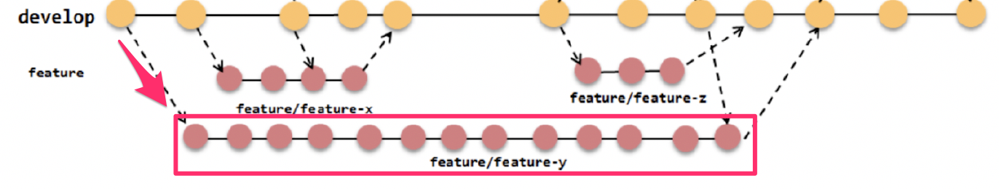{ width=400 }

# Feature branchit

- Uusi ominaisuus, esim. user story toteutetaan ensin omaan versionhallinnan haaraansa

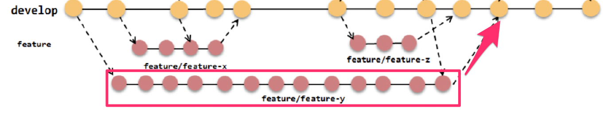{ width=400 }

  - ja ominaisuuden valmistuttua haara mergetään pääkehityshaaraan

# Feature branchit ja merge hell

- Monet pitävät feature brancheja versionhallinnan _parhaana käytänteenä_

. . .  

- Feature branchit aiheuttavat helposti pahoja _merge-konflikteja_ sprintin lopussa

. . .  

- Seurauksena pienimuotoinen integraatiohelvetti: _merge hell_ 

. . .  

- Martin Fowler kuuluisassa artikkelissa Continuous integration: _Everyone Commits To the Mainline Every Day_

. . .

- Voidaanko edes puhua jatkuvasta integraatiosta jos feature branchit ovat käytössä?

# Branchayskäytänteet

- Toisin kuin aiemmissa versionhallintajärjestelmissä, Gitissä brancien teko on erittäin helppoa

. . .

- Tämä on johtanut monimutkaisiin branchayskäytänteisiin

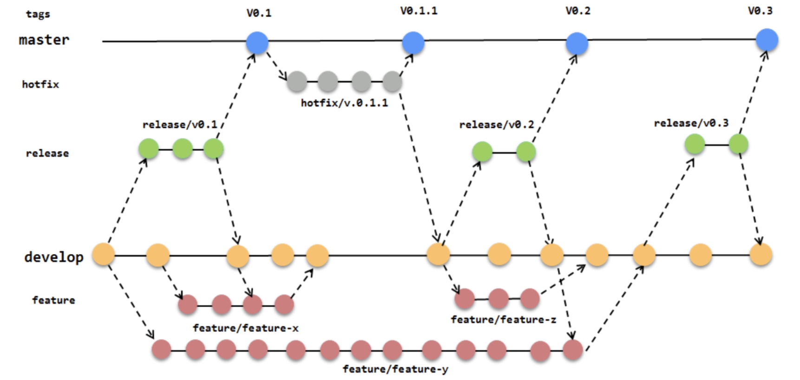{ width=400 }

. . .

- Tilanne on alkanut osin jo lähteä lapasesta

# Trunk based development

. . .

- Uusi trendi _trunk based development_: pitkäikäisiä feature brancheja ei käytetä ollenkaan
  - Kaikki koodi suoraan pääkehityshaaraan
  - ... josta käytetään nimitystä _trunk_

. . .

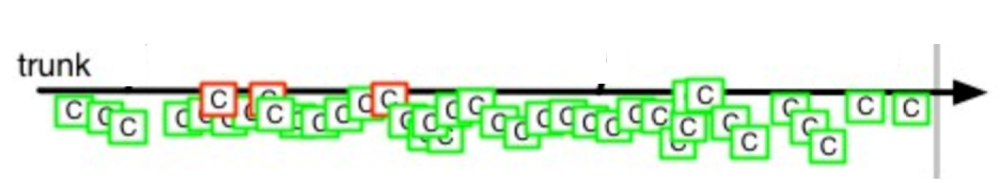{ width=400 }

# Trunk based development

- Uusi trendi _trunk based development_: pitkäikäisiä feature brancheja ei käytetä ollenkaan
  - Kaikki koodi suoraan pääkehityshaaraan
  - ... josta käytetään nimitystä _trunk_

{ width=400 }

- Ohjelmiston kustakin julkaistusta versiosta saatetaan tehdä oma _release branch_

# Trunk based development
 
- Pakottaa sovelluskehittäjät tekemään pieniä, nopeasti päähaaraan mergettäviä muutoksia

. . .

- Käytetään feature toggleja
  - puolivalmiitakin ominaisuuksia voidaan helposti ohjelmoida päähaaraan ilman toiminnallisuuden rikkomista

. . .

- Edellyttää sovelluskehittäjiltä _todella hyvää_ kuria ja systemaattisuutta

. . .

- Kehitysmallia noudattavat esim. Google, Facebook, Netflix ja _GitHub_

# TAUKO 10 min

# Dev vs Ops

- Jatkuva toimittaminen ja toimitusvalmius (CD) sekä tuotannossa testaaminen on haastavaa

. . .

- Perinteisesti tarkka erottelu _sovelluskehittäjien_ (developers, dev) ja _ylläpitäjien_ (operations, ops) välillä
  - sovelluskehittäjät eivät pääse kirjautumaan tuotantopalvelimille 
  - tuotantoon vieminen ja tietokantaan skeeman päivitykset tapahtuvat ylläpitäjien toimesta

. . .

- Jos näin on, tuotantopalvelimelle pystytään viemään uusia versioita vain harvoin, esim 4 kertaa vuodessa

. . .

- Joustavammat toimintamallit vaativat kulttuurinmuutoksen

# DevOps

- _DevOps_: toimintamalli missä kehittäjät (dev) ja ylläpito (ops) työskentelevät tiiviisti yhdessä 
  - Sovelluskehittäjille pääsy tuotantopalvelimelle 
  - Scrum-tiimiin sijoitetaan ylläpitovastuilla olevia ihmisiä


. . .

- DevOps on hypetermi, jonka merkitys osin epäselvä
  - työpaikkailmoituksissa voidaan arvostaa DevOps-taitoja 
  - tai etsiä ihmistä DevOps-tiimiin
  - myynnissä mitä erilaisempia DevOps-työkaluja

. . .

- Järkevä määritelmä: DevOps _kehittäjien ja järjestelmäylläpidon yhteinen työnteon tapa_, DevOps-kulttuuri

. . .

- Työkaluja/asioita jotka liittyvät DevOpsiin:
  - automatisoitu testaus
  - jatkuva integraatio ja toimittaminen (CI/CD)
  - virtualisointi ja kontainerisointi (Docker)
  - infrastructure as code
  - pilvipalveluna toimivat palvelimet ja sovellusympäristöt (PaaS, IaaS, SaaS)

#

- Monet listatuista kehittyneet viimeisen 5-10 vuoden aikana ja mahdollistaneet DevOpsin helpomman soveltamisen

. . .

- Eräs tärkeimmistä DevOpsia mahdollistavista asioista _infrastructure as code_
  - fyysisten palvelinten sijaan virtuaalisia ja pilvessä toimivia palvelimia, joita voi konfiguroida "ohjelmoimalla"

. . .

- Raudastakin on tullut "koodia"
  - palvelinten konfiguraatioita voidaan tallettaa versionhallintaan ja jopa testata
  - sovelluskehitys ja ylläpito ovat alkaneet muistuttaa toisiaan 

. . .

- Työkalujen käyttöönotto ei riitä, DevOpsin "tekeminen" lähtee kulttuurisista tekijöistä, tiimirakenteista, sekä asioiden sallimisesta

# The Big DevOps Misunderstanding (Oliver Wolf)

. . .

- When the term DevOps came up, it was a very simple idea:
  - You build it, you run it — Werner Vogels

. . .

- Somewhere along the way, the idea was misunderstood and the wrong definition of DevOps became the right one
  - We now have specific roles or departments that write "infrastructure as code"

. . .

- This is not DevOps, but an evolution of Systems Operations (SysOps)

#

{ width=400 }

#

{ width=400 }

#

{ width=400 }

# DevOps: ketteryys laajennettuna

. . .

- Scrumin ja ketterän eräs tärkeimmistä periaatteista on tehdä kehitystiimeistä itseorganisoituvia ja "cross functional" 
  
. . .

- DevOps on keino viedä ketteryyttä askeleen pitemmälle
  - kehitystiimi pystyy viemään uudet toiminnallisuudet tuotantoympäristöön 
  - ja jopa testaamaan sekä operoimaan niitä tuotannossa

. . .

- DevOps siis laajentaa ketteryyden koskemaan myös järjestelmäylläpitoa

. . .

- Asettaa sovelluskehittäjille lisää osaamisvaatimuksia

  - kehittäjien pitää hallita enenevissä määrin ylläpitoasioita

# 13.3.2025-

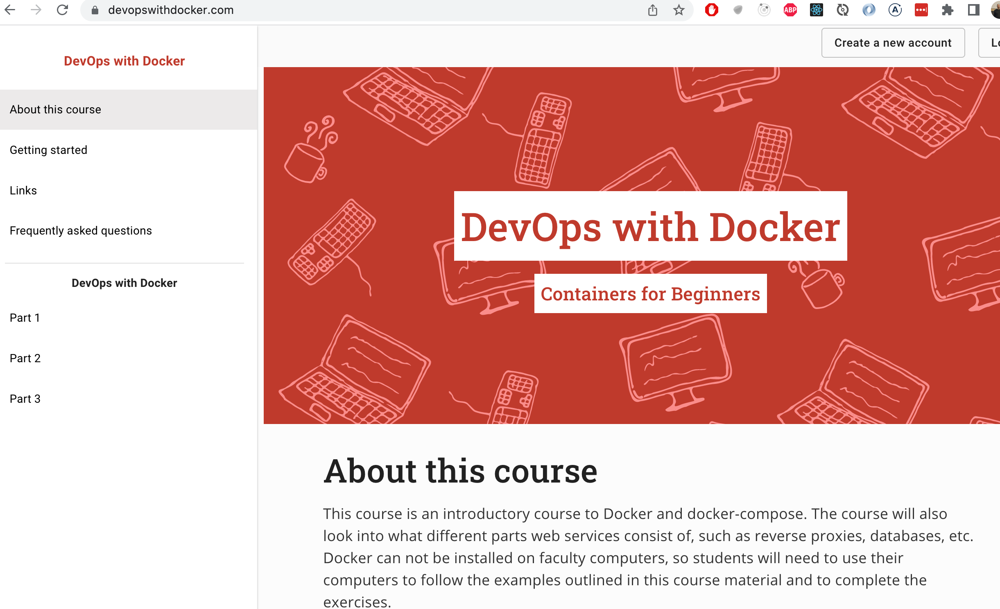{ width=400 }

- https://devopswithdocker.com/ by Jami Kousa

# 1.6.2025-

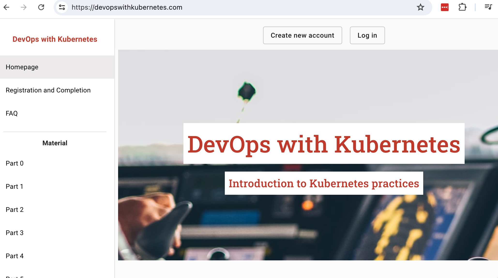{ width=400 }

- https://devopswithkubernetes.com/ by Jami Kousa

# Ohjelmiston elinkaaren vaiheet

- Riippumatta tyylistä ja tavasta jolla ohjelmisto tehdään, ohjelmistojen tekemiseen kuuluu
  - vaatimusten analysointi ja määrittely 
  - **suunnittelu**
  - toteutus
  - testaus/laadunhallinta
  - ohjelmiston ylläpito

. . . 

- Suunnittelun tavoite _miten saadaan toteutettua vaatimusmäärittelyn mukaisella tavalla toimiva ohjelma_

# Ohjelmiston elinkaaren vaiheet

- Riippumatta tyylistä ja tavasta jolla ohjelmisto tehdään, ohjelmistojen tekemiseen kuuluu
  - vaatimusten analysointi ja määrittely 
  - **suunnittelu**
  - **toteutus**
  - testaus/laadunhallinta
  - ohjelmiston ylläpito


- Suunnittelun tavoite _miten saadaan toteutettua vaatimusmäärittelyn mukaisella tavalla toimiva ohjelma_


- Osa suunnittelusta tapahtuu vasta toteutusvaiheessa, joten suunnittelun ja toteuttamisen käsittelyä ei voi eriyttää


# Ohjelmiston suunnittelu

- Jakautuu kahteen vaiheeseen:
  - arkkitehtuurisuunnittelu
  - olio/komponenttisuunnittelu

. . .

- Ajoittuminen riippuu käytettävästä tuotantoprosessista:

. . .

- Vesiputousmallissa vaatimusmäärittelyn jälkeen, ennen toteutuksen aloittamista
  - tarkasti dokumentoitu

. . .

- Ketterissä menetelmissä suunnittelua tehdään tarvittava määrä jokaisessa iteraatiossa
  - ei yleensä tarkkaa suunnitteludokumenttia

. . .

- Vesiputousmallin suunnitteluprosessi tuskin on enää käytössä
  - "jäykimmissäkin" prosesseissa ainakin vaatimusmäärittely ja arkkitehtuurisuunnittelu limittyvät

. . .

- Näiden lisäksi UI/UX-suunnittelu

# Ohjelmiston arkkitehtuuri

. . .

- Abstraktimpi kuvaus joka määrittelee ohjelmiston suuret linjat

. . .

- IEEE: Ohjelmiston arkkitehtuuri on järjestelmän perusorganisaatio, joka sisältää 
  - järjestelmän osat, 
  - osien keskinäiset suhteet, 
  - osien suhteet ympäristöön 
  - sekä periaatteet, jotka ohjaavat järjestelmän suunnittelua ja evoluutiota

# Ohjelmiston arkkitehtuuri

- **Ei-toiminnallisilla vaatimuksilla** suuri vaikutus arkkitehtuuriin
  - käytettävyys, saavutettavuus
  - suorituskyky, skaalautuvuus
  - vikasietoisuus, tiedon ajantasaisuus
  - tietoturva
  - ylläpidettävyys, laajennettavuus
  - hinta, time-to-market, ...

. . . 

- Myös **toimintaympäristö** vaikuttavaa arkkitehtuuriin
  - integraatiot muihin järjestelmiin
  - käytettävät sovelluskehykset ja tietokannat
  - lainsäädäntö 

. . .

- Arkkitehtuuri syntyy joukosta _arkkitehtuurisia valintoja_ 
  - tradeoff 

# Arkkitehtuurityyli

- Ohjelmiston arkkitehtuuri perustuu yleensä yhteen tai useampaan **arkkitehtuurityyliin**
  - hyväksi havaittua tapaa strukturoida tietyntyyppisiä sovelluksia

. . .

- Tyylejä suuri määrä
  - Kerrosarkkitehtuuri
  - Mikropalveluarkkitehtuuri
  - MVC
  - Pipes-and-filters
  - Repository
  - Client-server
  - Publish-subscribe
  - Event driven
  - REST
  - ...

# Kerrosarkkitehtuuri 

- _Kerros_ on kokoelma toisiinsa liittyviä olioita, jotka muodostavat toiminnallisuuden suhteen loogisen kokonaisuuden

{ width=200 }

. . . 

- Kerros käyttää ainoastaan alempana olevan kerroksen palveluita

#

- Kerrokset omalla abstraktiotasollaan
  - Ylimmät kerrokset ovat lähellä käyttäjää: UI ja sovelluslogiikka
  - Alimmat kerrokset taas keskittyvät koneläheisiin asioihin: esim. tiedon tallennus

. . .

- Kerroksittaisuus helpottaa ylläpitoa
  - yhden kerroksen muutokset vaikuttavat korkeintaan yläpuolella olevaan kerrokseen

. . .

- Sovelluslogiikan riippumattomuus käyttöliittymästä helpottaa ohjelman siirtämistä uusille alustoille
  - esim. web-sovelluksesta voidaan tehdä mobiiliversio

. . .

- Alimpien kerroksien palveluja, voidaan osin uusiokäyttää myös muissa sovelluksissa

. . .

- Saattaa johtaa massiivisiin monoliittisiin sovelluksiin
  - vaikea laajentaa ja skaalaata suurille käyttäjämäärille
  - haastavaa kehittää jos sovelluskehittäjiä suuri määrä


# Mikropalveluarkkitehtuuri

- Mikropalveluarkkitehtuuri (microservice) pyrkii vastaamaan näihin haasteisiin  

. . .

{ width=250 }

- sovellus koostataan useista (jopa sadoista) pienistä verkossa toimivista autonomisista palveluista 

. . .

- jotka keskenään verkon yli kommunikoiden toteuttavat järjestelmän toiminnallisuuden

# Mikropalveluarkkitehtuuri

- Yksittäisistä palveluista pyritään tekemään mahdollisimman riippumattomia
  - palvelut eivät kutsu toistensa metodeja, kommunikointi aina verkon välityksellä
  - eivät käytä yhteistä tietokantaa
  - eivät jaa koodia

. . . 

- Mikropalvelut ovat pieniä ja huolehtivat vain "yhdestä asiasta"

. . . 

- Verkkokaupan mikropalveluita voisivat olla
  - käyttäjien hallinta
  - tuotteiden hakutoiminnot
  - tuotteiden suosittelu
  - ostoskorin toiminnallisuus
  - ostosten maksusta huolehtiva toiminnallisuus

# Mikropalveluiden etuja

- Kun lisätään toiminnallisuutta: toteutetaan uusi palvelu tai laajennetaan ainoastaan _jotain_ palvelua
  - Sovelluksen laajentaminen voi olla helpompaa kuin kerrosarkkitehtuurissa

. . . 

- Skaalaaminen helpompaa kuin monoliittisten sovellusten 
  - suorituskyvyn pullonkaulan aiheuttavia mikropalveluja voidaan suorittaa useita rinnakkain

. . . 

- Sovellus voidaan helposti koodata monella ohjelmointikielellä ja sovelluskehyksillä, toisin kuin monoliittisissa projekteissa

. . . 

- Työn jakaminen isolle kehittäjämäärälle helpompaa

# Mikropalveluiden haasteita

- Sovelluksen jakaminen järkeviin mikropalveluihin on vaikeaa

. . .

- Testaaminen ja debuggaus voi olla vaikeaa koska asioita tapahtuu niin monessa paikassa

. . .

- Kymmenistä tai jopa sadoista mikropalveluista koostuvan ohjelmiston operoiminen on haastavaa
  - vaatii pitkälle menevää automatisointia

. . .

- Mikropalveluiden menestyksekäs soveltaminen edellyttää vahvaa DevOps-kulttuuria

. . .

- Kehitetty massiivisiin järjestelmiin (mm Amazon, Netflix)
  - onko järkevä kaikkialla?
% Ohjelmistotuotanto
% Matti Luukkainen ja ohjaajat Antti, Pooki, Riku, Sini, Taneli
% syksy 2024

#

&nbsp;&nbsp;&nbsp;&nbsp;&nbsp;&nbsp;&nbsp;&nbsp;&nbsp;&nbsp;&nbsp;&nbsp;&nbsp;&nbsp;&nbsp;&nbsp;&nbsp;&nbsp;&nbsp;&nbsp;&nbsp;&nbsp;&nbsp;&nbsp;&nbsp;&nbsp;&nbsp;&nbsp;&nbsp;&nbsp;&nbsp;&nbsp;&nbsp;&nbsp;&nbsp;&nbsp;&nbsp;Luento 8

&nbsp;&nbsp;&nbsp;&nbsp;&nbsp;&nbsp;&nbsp;&nbsp;&nbsp;&nbsp;&nbsp;&nbsp;&nbsp;&nbsp;&nbsp;&nbsp;&nbsp;&nbsp;&nbsp;&nbsp;&nbsp;&nbsp;&nbsp;&nbsp;&nbsp;&nbsp;&nbsp;&nbsp;&nbsp;&nbsp;&nbsp;&nbsp;&nbsp;&nbsp;&nbsp;&nbsp;19.11.2024

# Kurssipalaute

- Kurssipalaute
  - Kurssilla lopussa kerättävän palautteen lisäksi ns. jatkuva palaute https://norppa.helsinki.fi

# Ohjelmiston elinkaaren vaiheet

- Riippumatta tyylistä ja tavasta jolla ohjelmisto tehdään, ohjelmistojen tekemiseen kuuluu
  - vaatimusten analysointi ja määrittely 
  - **suunnittelu**
  - **toteutus**
  - testaus/laadunhallinta
  - ohjelmiston ylläpito

. . .

- Jakautuu kahteen vaiheeseen:
  - arkkitehtuurisuunnittelu
  - olio/komponenttisuunnittelu

. . .

- Näiden lisäksi UI/UX-suunnittelu

# Arkkitehtuurityyli

- Ohjelmiston arkkitehtuuri perustuu yleensä yhteen tai useampaan **arkkitehtuurityyliin** (architectural style)
  - hyväksi havaittua tapaa strukturoida tietyntyyppisiä sovelluksia

- Tyylejä suuri määrä
  - Kerrosarkkitehtuuri
  - Mikropalveluarkkitehtuuri
  - MVC
  - Pipes-and-filters
  - Repository
  - Client-server
  - Publish-subscribe
  - Event driven
  - REST
  - ...

# Kerrosarkkitehtuuri 

- _Kerros_ on kokoelma toisiinsa liittyviä olioita, jotka muodostavat toiminnallisuuden suhteen loogisen kokonaisuuden

{ width=200 }


# Mikropalveluarkkitehtuuri

- Mikropalveluarkkitehtuuri (microservice) pyrkii vastaamaan näihin haasteisiin  

. . .

{ width=250 }

- sovellus koostataan useista (jopa sadoista) pienistä verkossa toimivista autonomisista palveluista 

. . .

- jotka keskenään verkon yli kommunikoiden toteuttavat järjestelmän toiminnallisuuden

# Mikropalveluarkkitehtuuri

- Yksittäisistä palveluista pyritään tekemään mahdollisimman riippumattomia
  - palvelut eivät kutsu toistensa metodeja, kommunikointi aina verkon välityksellä
  - eivät käytä yhteistä tietokantaa
  - eivät jaa koodia

. . . 

- Mikropalvelut ovat pieniä ja huolehtivat vain "yhdestä asiasta"

. . . 

- Verkkokaupan mikropalveluita voisivat olla
  - käyttäjien hallinta
  - tuotteiden hakutoiminnot
  - tuotteiden suosittelu
  - ostoskorin toiminnallisuus
  - ostosten maksusta huolehtiva toiminnallisuus

# Mikropalveluiden etuja

- Kun lisätään toiminnallisuutta: toteutetaan uusi palvelu tai laajennetaan ainoastaan _jotain_ palvelua
  - Sovelluksen laajentaminen voi olla helpompaa kuin kerrosarkkitehtuurissa

. . . 

- Skaalaaminen helpompaa kuin monoliittisten sovellusten 
  - suorituskyvyn pullonkaulan aiheuttavia mikropalveluja voidaan suorittaa useita rinnakkain

. . . 

- Sovellus voidaan helposti koodata monella ohjelmointikielellä ja sovelluskehyksillä, toisin kuin monoliittisissa projekteissa

. . . 

- Työn jakaminen isolle kehittäjämäärälle helpompaa

# Lähtökohta: The Bezos mandate

{ width=400 }

# Lähtökohta: The Bezos mandate

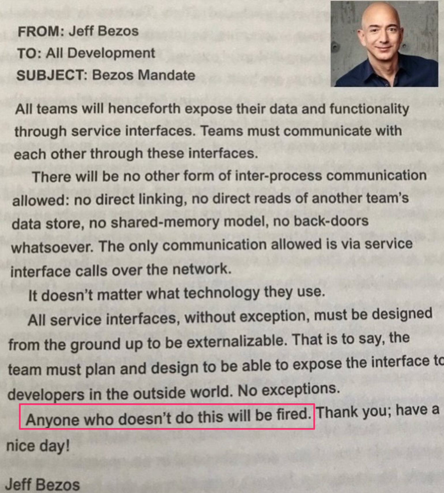{ width=400 }

# Lähtökohta

{ width=400 }

# Mikropalveluiden haasteita

- Sovelluksen jakaminen järkeviin mikropalveluihin on vaikeaa

. . .

- Testaaminen ja debuggaus voi olla vaikeaa koska asioita tapahtuu niin monessa paikassa

. . .

- Kymmenistä tai jopa sadoista mikropalveluista koostuvan ohjelmiston operoiminen on haastavaa
  - vaatii pitkälle menevää automatisointia

. . .

- Mikropalveluiden menestyksekäs soveltaminen edellyttää vahvaa DevOps-kulttuuria

. . .

- Kehitetty massiivisiin järjestelmiin (mm Amazon, Netflix)
  - onko järkevä kaikkialla?

# Kurssipalautejärjestelmä Norppa

- Kerrosarkkitehtuuri
- Mikropalvelu
- Publish subscribe / Event driven

#

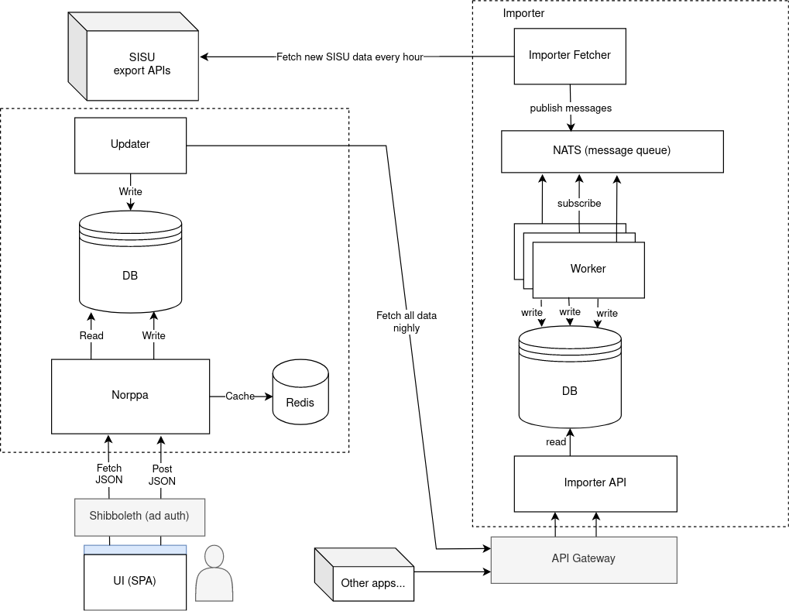{ width=400 }

# kerrosarkkitehtuuri

{ width=400 }

# mikropalvelut

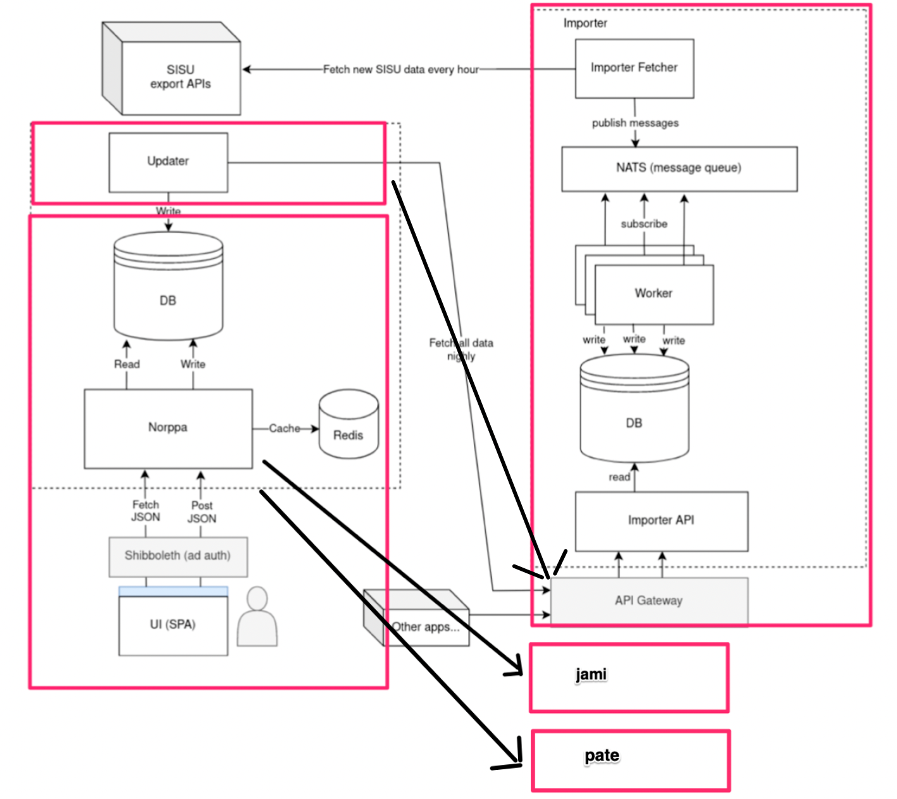{ width=350 }

# event driven / messaging

{ width=400 }


# Arkkitehtuurin kuvaamisesta

- On tilanteita, missä sovelluksen arkkitehtuuri on dokumentoitava jollain tavalla

. . .

- Arkkitehtuurien kuvaamiselle ei olemassa vakiintunutta formaattia
  - UML:n luokka- ja pakkauskaaviot sekä komponentti- ja sijoittelukaaviot joskus käyttökelpoisia 
  - Useimmiten käytetään epäformaaleja laatikko/nuoli-kaavioita

# Laatikko ja nuoli  -kaavio

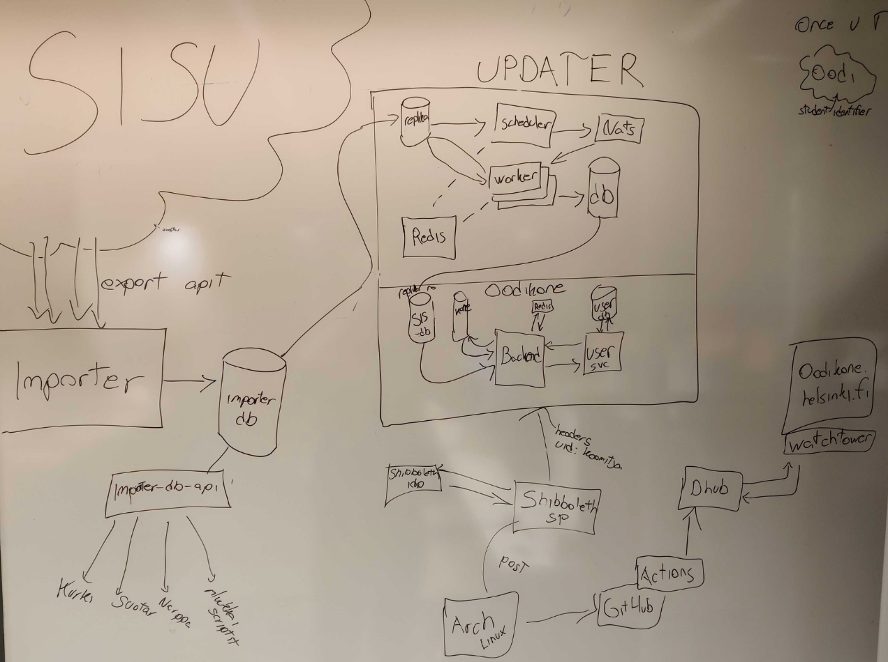{ width=400 }

# Hienompi laatikko ja nuoli  -kaavio

{ width=400 }

# Arkkitehtuurin kuvaamisesta

- Arkkitehtuurikuvaus voi olla tarpeen tehdä useasta eri tarpeita palvelevasta _näkökulmasta_
  - korkean tason kuvauksen voi olla hyödyksi esim. vaatimusmäärittelyssä 
  - tarkemmat kuvaukset toimivat ohjeena tarkemmassa suunnittelussa ja ylläpitovaiheen aikaisessa laajentamisessa

. . .  

-  Hyödyllinen arkkitehtuurikuvaus dokumentoi ja perustelee tehtyjä _arkkitehtuurisia valintoja_

# Arkkitehtuuri ketterissä menetelmissä

. . .

- Ketterien menetelmien kantava teema on toimivan, asiakkaalle arvoa tuottavan ohjelmiston nopea toimittaminen

. . .

- Periaatteita
  - _Our highest priority is to satisfy the customer through early and continuous delivery of valuable software_
  - _Deliver working software frequently..._

. . .

- Ketterät menetelmät suosivat yksinkertaisuutta
  - _Simplicity, the art of maximizing the amount of work not done, is essential_

. . .

- Arkkitehtuuriin suunnittelu ja dokumentointi on perinteisesti pitkäkestoinen, ohjelmoinnin aloittamista edeltävä vaihe

. . .

- Ketterät menetelmät ja "arkkitehtuurivetoinen" ohjelmistotuotanto siis jossain määrin ristiriidassa

# Arkkitehtuuri ketterissä menetelmissä 

- Ketterien menetelmien yhteydessä puhutaan _inkrementaalisesta suunnittelusta ja arkkitehtuurista_

. . .

- Arkkitehtuuri mietitään riittävällä tasolla projektin alussa
  - Jotkut projektit alkavat ns. nollasprintillä ja alustava arkkitehtuuri määritellään tällöin

. . .

- Ohjelmiston "lopullinen" arkkitehtuuri muodostuu iteraatio iteraatiolta samalla kun uutta toiminnallisuutta toteutetaan 

. . .

- Esim. kerrosarkkitehtuurin mukaista sovellusta ei rakenneta "kerros kerrallaan"
  - Jokaisessa iteraatiossa tehdään pieni pala jokaista kerrosta, sen verran kuin iteraation tavoitteiden toteuttaminen edellyttää

# Ankrementaalinen arkkitehtuuri

- Alussa ns. _walking skeleton_
  - sisältää tynkäversiot ohjelmiston komponenttirakenteesta

{ width=120 }

. . .

- Rakennetaan skeletonin varaan tuotetta story storyltä

# Ominaisuuksiin perustuva integraatio

- Alussa ns. _walking skeleton_
  - sisältää tynkäversiot ohjelmiston komponenttirakenteesta

{ width=120 }

- Rakennetaan skeletonin varaan tuotetta story storyltä

# Ominaisuuksiin perustuva integraatio

- Alussa ns. _walking skeleton_
  - sisältää tynkäversiot ohjelmiston komponenttirakenteesta

{ width=120 }

- Rakennetaan skeletonin varaan tuotetta story storyltä

# Ominaisuuksiin perustuva integraatio

- Alussa ns. _walking skeleton_
  - sisältää tynkäversiot ohjelmiston komponenttirakenteesta

{ width=120 }

- Rakennetaan skeletonin varaan tuotetta story storyltä

# Arkkitehtuuri ketterissä menetelmissä

- Perinteisesti arkkitehtuurin luonut *ohjelmistoarkkitehti*
  - ohjelmoijat velvoitettuja noudattamaan arkkitehtuuria

. . .

- Ketterissä menetelmissä ei suosita erillistä arkkitehdin roolia
  - Scrumissa kaikista tiimiläisistä käytetään nimikettä developer

. . .

- Ketterä idealli: kehitystiimi luo arkkitehtuurin yhdessä
  - _The best architectures, requirements, and designs emerge from self-organizing teams_

. . .

- **Arkkitehtuuri koodin tapaan tiimin yhteisomistama**

. . .

- Etuja:
  - kehittäjät sitoutuvat paremmin arkkitehtuurin noudattamiseen kuin "norsunluutornissa" olevan arkkitehdin määrittelemään
  - dokumentaatio voi olla kevyt, tiimi tuntee arkkitehtuurin hengen ja pystyy sitä noudattamaan

# Inkrementaalinen arkkitehtuuri: edut ja riskit

- Oletus: optimaalista arkkitehtuuria ei pystytä suunnittelemaan projektin aluss
  - Jo tehtyjä arkkitehtuuriratkaisuja muutetaan tarvittaessa

. . .

- Kuten vaatimusmäärittelyssä, myös arkkitehtuurin suunnittelussa ketterä pyrkii _välttämään liian aikaisin tehtävää, ehkä turhaksi osoittautuvaa työtä_

. . .

- Inkrementaalinen arkkitehtuuri edellyttää koodilta hyvää sisäistä laatua ja kehittäjiltä kurinalaisuutta
  - muuten seurauksena on kaaos

# TAUKO 10 min

# Olio/komponenttisuunnittelu

. . .

- Sovelluksen arkkitehtuuri antaa raamit, jotka ohjaavat sovelluksen tarkempaa suunnittelua ja toteuttamista

. . .

- _Olio- tai komponenttisuunnittelu_
  - tarkentaa arkkitehtuuristen komponenttien väliset rajapinnat sekä hahmottelee ohjelman luokka- tai moduulirakenteen

. . .   

- Vesiputousmallissa komponenttisuunnittelu tehty ennen ohjelmointia ja  dokumentoitu tarkkaan esim. UML:lä

. . .

- Ketterässä tarkka suunnittelu tehdään vasta ohjelmoitaessa

. . .

- Suunnittelussa pyritään maksimoimaan _koodin sisäinen laatu_ 
  - helppo ylläpidettävyys ja laajennettavuus 

. . .

- Ohjelmistosuunnittelu on "enemmän taidetta kuin tiedettä", kokemus ja hyvien käytänteiden tuntemus auttaa
  - kehitetty monia suunnittelumenetelmiä, mikään niistä ei ole vakiintunut

# Laadukas koodi

- Tavoitteena siis **sisäiseltä laadultaan** hyvä koodi

. . .

- _Sisäinen laatu_ (internal quality)
  - onko virheiden jäljitys ja korjaaminen helppoa
  - onko koodia helppo laajentaa ja jatkokehittää
  - pystytäänkö koodin toiminnallisuuden oikeellisuus varmistamaan muutoksia tehtäessä

. . .

- Jos sisäinen laatu rapistuu
  - alkaa vaikuttamaan myös ulkoiseen eli käyttäjän kokemaan laatuun
  - kehitystiimin velositeetti alkaa tippua

# Laadukkaan koodin tuntomerkkejä

. . .

- Laadukkaalla koodilla joukko yhteneviä ominaisuuksia, tai _laatuattribuutteja_, esim. seuraavat:
  - kapselointi
  - korkea koheesion aste
  - riippuvuuksien vähäisyys 
  - toisteettomuus
  - testattavuus
  - selkeys

. . .

- _Suunnittelumallit_ auttavat luomaan koodia, joissa sisäinen laatu kunnossa
  - kurssin aikana nähty jo _dependency injection_, _repository_
  - lisää kurssimateriaalissa ja laskareissa

# Koodin laatuattribuutti: kapselointi

. . .  

- _Kapselointi_ ohjelmoinnin peruskursseilla: 
  - _oliomuuttujat tulee määritellä piilotetuksi ja niille tulee tehdä tarvittaessa aksessorimetodit_

. . .

- Olion sisäisen tilan lisäksi kapseloinnin kohde voi olla mm. _käytettävän olion tyyppi, käytetty algoritmi, olioiden luomisen tapa, käytettävän komponentin rakenne_

. . .

- Näkyy myös arkkitehtuurin tasolla
  - kerrosarkkitehtuuri: ylempi kerros käyttää ainoastaan alemman kerroksen ulospäin tarjoamaa rajapintaa, muu kapseloitu
  - mikropalvelut: yksittäinen palvelu kapseloi sisäisen logiikan, tiedon säilytystavan ja tarjoaa ainoastaan verkon välityksellä käytettävän rajapinnan

# Koodin laatuattribuutti: koheesio

. . .  

- _Koheesio_:
  - kuinka pitkälle metodin, luokan tai komponentin koodi keskittyy tietyn yksittäisen toiminnallisuuden toteuttamiseen
  - hyvänä pidetään mahdollisimman korkeaa koheesion astetta

. . .

- Luokkatason koheesio
  - luokan _vastuulla_ vain yksi asia, tunnetaan myös nimellä _single responsibility principle_

. . .

- Arkkitehtuurin tasolla
  - kerrosarkkitehtuurin kerrokset samalla abstraktiotasolla, esim. käyttöliittymä tai tietokantarajapinta
  - mikropalvelu toteuttaa tiettyyn liiketoiminnan tason toiminnallisuuden, esim. suosittelualgoritmin tai käyttäjien hallinnan

# Koheesio Flask-sovelluksessa

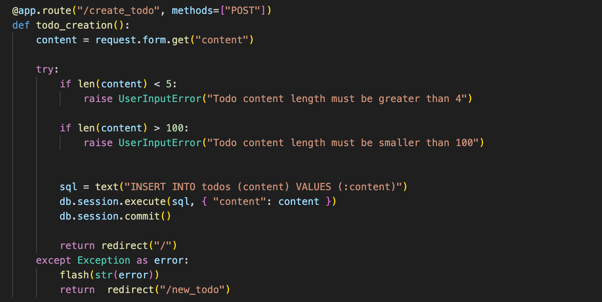{ width=400 }

# Koheesio Flask-sovelluksessa

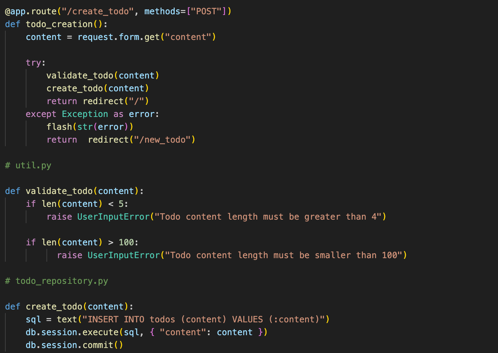{ width=400 }

. . . 

- *delegoidaan osa vastuista* eri komponenteille

# Koodin laatuattribuutti: riippuvuuksien vähäisyys

. . .  

- Pyrkimys korkeaan koheesioon johtaa ohjelmiin, joissa suuri määrä olioita/komponentteja

. . .  

- Olioiden oltava keskenään vuorovaikutuksessa toteuttaakseen ohjelman toiminnallisuuden: _paljon keskinäisiä riippuvuuksia_

. . .  

- _Riippuvuuksien vähäisyyden_ periaate
  - eliminoidaan _tarpeettomat_ riippuvuudet
  - sekä riippuvuudet konkreettisiin asioihin

. . .
 
- Hyödynnetään _dependence injection_ -suunnittelumallia

# Koodin laatuattribuutti: riippuvuuksien vähäisyys

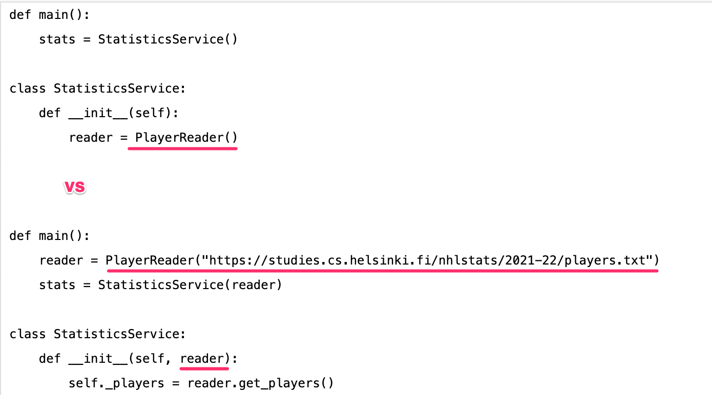{ width=400 }

# Koodin laatuattribuutti: toisteettomuus

. . .  

- Aloittelevaa ohjelmoijaa pelotellaan toisteisuuden vaaroista uran ensiaskelista alkaen: älä copypastaa koodia!

. . .

- Alan piireissä toisteisuudesta varoittava periaate kulkee nimellä DRY, don't repeat yourself
  - _every piece of knowledge must have a single, unambiguous, authoritative representation within a system_

. . .

- Koodin lisäksi periaate ulottuu koskemaan järjestelmän muitakin osia
  - tietokantaskeemaa, testejä, build-skriptejä

. . .

- Suoraviivainen copypaste helppo eliminoida metodien avulla
  - kaikki toisteisuus ei ole yhtä ilmeistä, monissa suunnittelumalleissa kyse hienovaraisempien toisteisuuden muotojen eliminoinnista

. . .

- Hyvä vs. paha copypaste
  - _three strikes and you refactor_

# Koodin laatuattribuutti: testattavuus

. . .  

- Laadukas koodi on helppo testata kattavasti yksikkö- ja integraatiotestein
  - seuraa yleensä siitä, että koodi koostuu löyhästi kytketyistä, selkeän vastuun omaavista komponenteista

. . .

- Hyvää testattavuutta auttaa turhien riippuvuuksien eliminointi dependency injection -periaatteen avulla

. . .

- Test driven development tuottaa varmuudella hyvin testattavissa olevaa koodia

# Koodin laatuattribuutti: selkeys ja luettavuus

- Perinteisesti ajateltu että koodi kryptistä ja vaikeasti luettavaa
  - yleistä C-kielessä, pyritty esim. optimoimaan tehokkuutta ja muistinkäyttöä

. . .

- Nykytrendi: tehdän koodia, joka nimeämisen sekä rakenteen kautta ilmaisee hyvin sen, mitä koodi tekee

. . .

- Miksi selkeä koodi on tärkeää?
  - joidenkin arvioiden mukaan jopa 90% "ohjelmointiin" kuluvasta ajasta menee olemassa olevan koodin lukemiseen
  - oma aikoinaan niin selkeä koodi, ei enää olekaan yhtä selkeää parin kuukauden kuluttua

# Code smell

- Koodi ei ole aina hyvää...

. . .

- Martin Fowlerin mukaan 
  - _koodihaju_ (code smell) on helposti huomattava merkki siitä että koodissa on jotain pielessä
  - jopa aloitteleva ohjelmoija saattaa pystyä havaitsemaan koodihajun
  - sen takana oleva todellinen syy voi olla jossain syvemmällä 

. . .

- Koodihaju siis kertoo, että syystä tai toisesta _koodin sisäinen laatu_ ei ole parhaalla mahdollisella tasolla

# Koodihajuja 

- Koodihajuja on hyvin monenlaisia ja monentasoisia
- Esimerkkejä helposti tunnistettavista hajuista:
  - toisteinen koodi
  - liian pitkät metodit
  - luokat joissa on liikaa oliomuuttujia
  - luokat joissa on liikaa koodia
  - metodien liian pitkät parametrilistat
  - epäselkeät muuttujien, metodien tai luokkien nimet
  - kommentit

. . .

- Pari monimutkaisempaa
  - Primitive obsession
  - Shotgun surgery

# Refaktorointi

. . .

- Lääke koodin sisäisen laadun ongelmiin on _refaktorointi_  
  - koodin toiminnalisuuden ennallaan pitävä sisäisen rakenteen muutos
  
. . .

- Koodin rakennetta parantavia refaktorointeja on lukuisia, mm.
  - _rename variable/method/class_
  - _extract method_ 
  - _move field/method_ 
  - _extract superclass_ 

. . .

- Osa pystytään tekemään sovelluskehitysympäristön avustamana
  - helpompaa staattisesti tyypitetyillä kielillä kuten Java

# Miten refaktorointi kannattaa tehdä

- Refaktoroinnin edellytys on kattavien testien olemassaolo

. . .

- Kannattaa ehdottomasti edetä pienin askelin
  - yksi hallittu muutos kerrallaan
  - testit suoritettava mahdollisimman usein 

. . .

- Refaktorointia kannattaa suorittaa lähes jatkuvasti
  - pitää koodin rakenteen selkeänä ja helpottaa sekä nopeuttaa koodin laajentamista

. . .

- Osa refaktoroinnista on helppoa ja suoraviivaista, aina ei näin ole
  - joskus tarve tehdä isoja, jopa viikkojen kestoisia refaktorointeja joissa ohjelman rakenne muuttuu paljon

# Refaktorointi tärkeä osa Test driven development -menetelmää

{ width=340 }

1. Kirjoitetaan sen verran testiä että testi ei mene läpi
2. Kirjoitetaan koodia sen verran, että testi menee läpi
3. **Jos huomataan koodin rakenteen menneen huonoksi refaktoroidaan koodin rakenne paremmaksi**
4. Jatketaan askeleesta 1

# 15.1.2025-

Avoin yliopisto: Test-Driven Development 4 + 1 cr

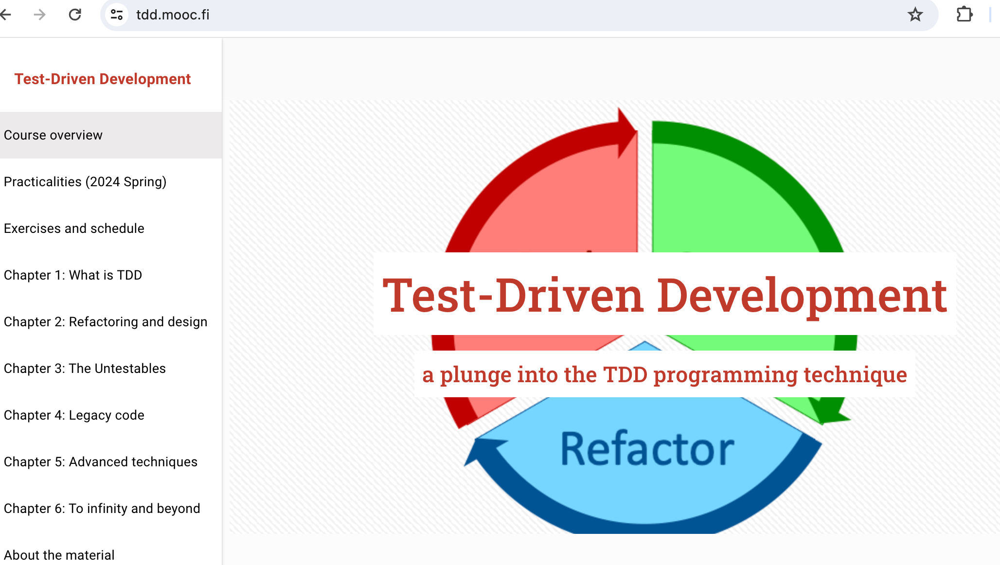{ width=340 }


- Esko Luontola Nitor (Suomen johtava TDD-asiantuntija)

# Tekninen velka

. . .

- Koodi ei ole aina laadultaan optimaalista

. . .

- Huonoa suunnittelua tai/ja ohjelmointia kuvaa käsite _tekninen velka_ (technical debt)

. . .

- Piittaamattomalla ja laiskalla ohjelmoinnilla/suunnittelulla saadaan ehkä nopeasti aikaan jotain
  - hätäinen ratkaisu tullaan maksamaan korkoineen takaisin _jos_ ohjelmaa on tarkoitus laajentaa

. . .

- Jos korkojen maksun aikaa ei koskaan tule, voi "huono koodi" olla asiakkaan etu
  - esim. minimal viable product (MVP) 

. . .

- Tekninen velka voi olla järkevää tai jopa välttämätöntä
  - voidaan saada tuote nopeammin markkinoille tekemällä tietoisesti huonoa designia, joka korjataan myöhemmin

#

- Kaikki tekninen velka ei samanlaista, taustalla voi olla 
  - holtittomuus, osaamattomuus, tietämättömyys tai tarkoituksella tehty päätös

. . .

- Martin Fowler jaottelee teknisen velan neljään eri luokkaan:
  - Reckless and deliberate: "we do not have time for design" 
  - Reckless and inadverent: "what is layering"?
  - Prudent and inadverent: "now we know how we should have done it"
  - **Prudent and deliberate: "we must ship now and will deal with consequences"**

. . .

- Joskus tekninen velka pakottaa koodaamaan koko järjestelmän uudelleen
% Ohjelmistotuotanto
% Matti Luukkainen ja ohjaajat Antti, Pooki, Riku, Sini, Taneli
% syksy 2024

#

&nbsp;&nbsp;&nbsp;&nbsp;&nbsp;&nbsp;&nbsp;&nbsp;&nbsp;&nbsp;&nbsp;&nbsp;&nbsp;&nbsp;&nbsp;&nbsp;&nbsp;&nbsp;&nbsp;&nbsp;&nbsp;&nbsp;&nbsp;&nbsp;&nbsp;&nbsp;&nbsp;&nbsp;&nbsp;&nbsp;&nbsp;&nbsp;&nbsp;&nbsp;&nbsp;&nbsp;&nbsp;Luento 9

&nbsp;&nbsp;&nbsp;&nbsp;&nbsp;&nbsp;&nbsp;&nbsp;&nbsp;&nbsp;&nbsp;&nbsp;&nbsp;&nbsp;&nbsp;&nbsp;&nbsp;&nbsp;&nbsp;&nbsp;&nbsp;&nbsp;&nbsp;&nbsp;&nbsp;&nbsp;&nbsp;&nbsp;&nbsp;&nbsp;&nbsp;&nbsp;&nbsp;&nbsp;&nbsp;&nbsp;25.11.2024

# Kurssipalaute

- Kurssipalaute
  - Kurssilla lopussa kerättävän palautteen lisäksi ns. jatkuva palaute https://norppa.helsinki.fi

. . .

- laskarien työläys?

- tavoitteena
  - viikot 1 ja 2: 8 tuntia
  - viikko 3: 6 tuntia
  - viikot 4-7: 4 tuntia

#

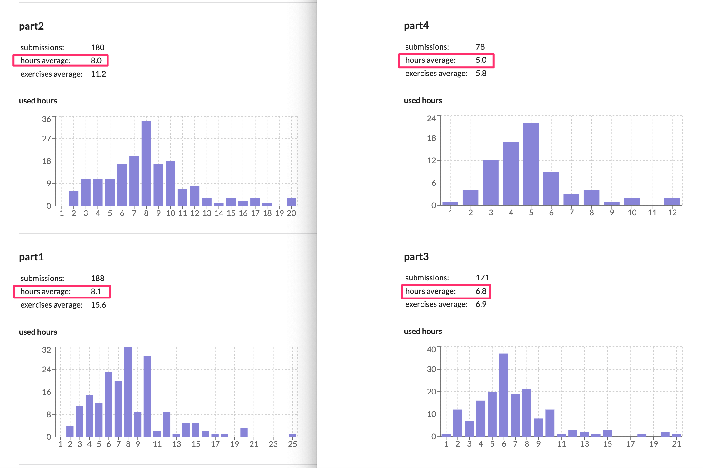


# Kurssin viimeiset 3 viikkoa

- Miniprojektit jatkuvat
  - tällä ja ensiviikolla asiakastapaaminen

. . .

- Loppudemot (jokainen ryhmä osallistuu toiseen demoista)
  - ke 11.12. klo 12-14 B123
  - to 12.12. klo 12-14 CK112
  - ilmoittautuminen käynnissä

. . .

- Normaali luento ti 3.12.

- Vierailuluennot
  - ti 26.11. Kristiina Vainio Houston Inc ja Ville Nordberg Trail openers
  - ma 2.12. Jami Kousa ja Aleksandr Tereshchenko Unity
  - ma 9.12. Kasper Hirvikoski Unity ja Luomus Fossil Database Team
  - ti 10.12. Hannu Kokko Elisa

. . .

- Koe torstaina 19.12. klo 7-14 moodlessa (koeaika 4h)

# Ohjelmiston elinkaaren vaiheet

. . .

- Riippumatta tyylistä ja tavasta jolla ohjelmisto tehdään, ohjelmistojen tekemiseen kuuluu
  - vaatimusten analysointi ja määrittely 
  - suunnittelu
  - toteutus
  - testaus/laadunhallinta
  - **ohjelmiston ylläpito**

. . .

- Ohjelmistot ovat suurimman osan elinajastaan ylläpitovaiheessa

. . .

- Jos ensimmäinen versio julkaistaan nopeasti, ovat ketterät ohjelmistoprojektit "jatkuvassa" ylläpitovaiheessa

# Muutama ylläpitovaiheen kannalta oleellinen asia

- Varmuuskopiointi, ja niiden palautus

. . .

- Sovelluksen lokit
- Analytiikka  
- Virheiden monitorointi

# Sovelluksen lokit

- Sovellusten tulee tulostaa lokiviestejä erilaisista mielenkiintoisista tilanteista

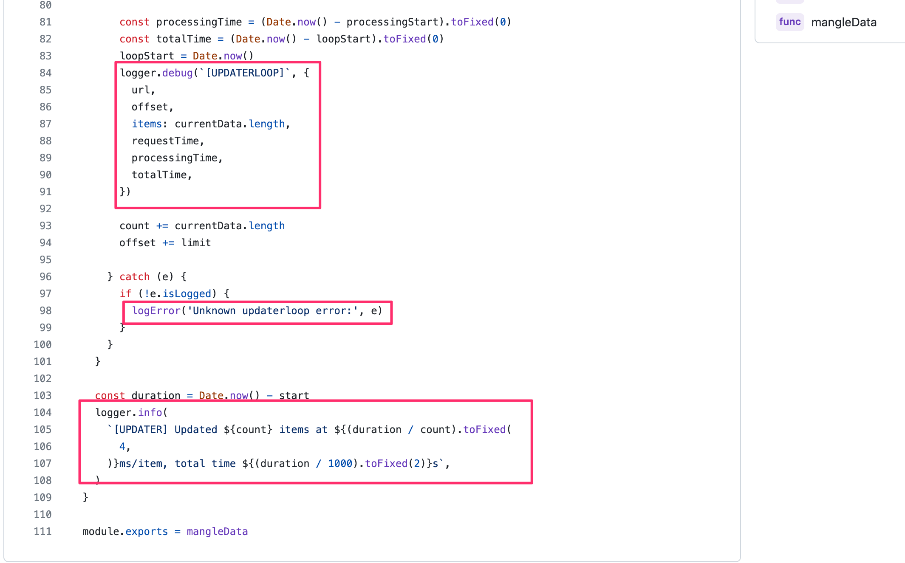{ width=350 }

# Sovelluksen lokit: Graylog

- Sovellusten lokit tulee kerätä paikkaan, mistä niitä helppo tarkastella

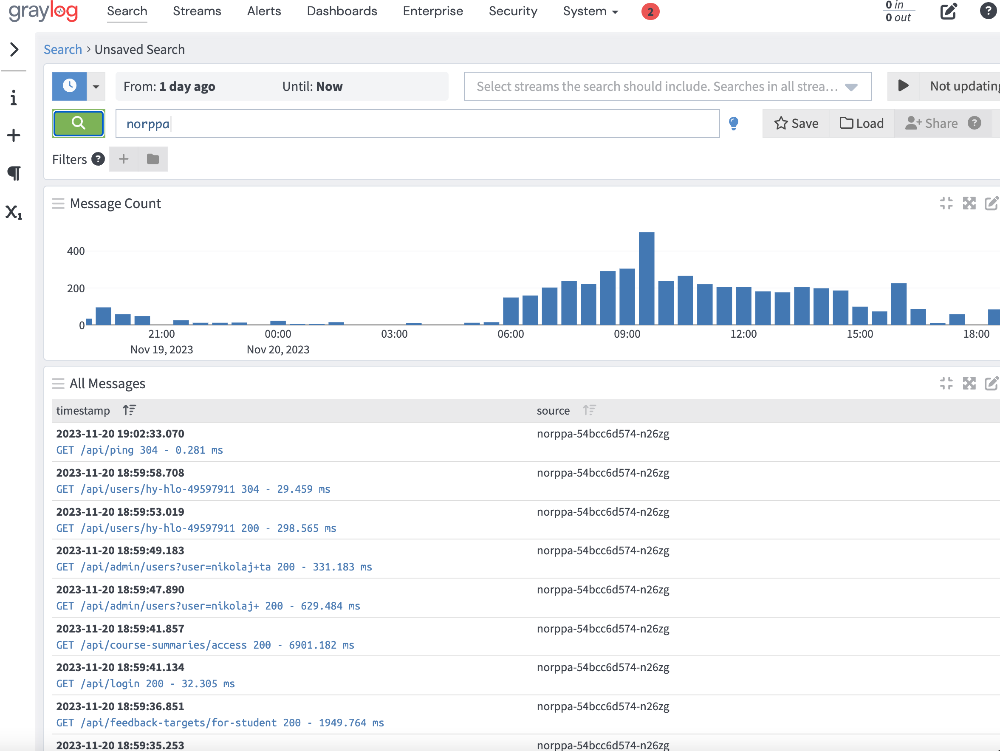{ width=350 }

# Analytiikka: Grafana

- Lokeja voidaan hyödyntää erilaiseen analytiikkaan

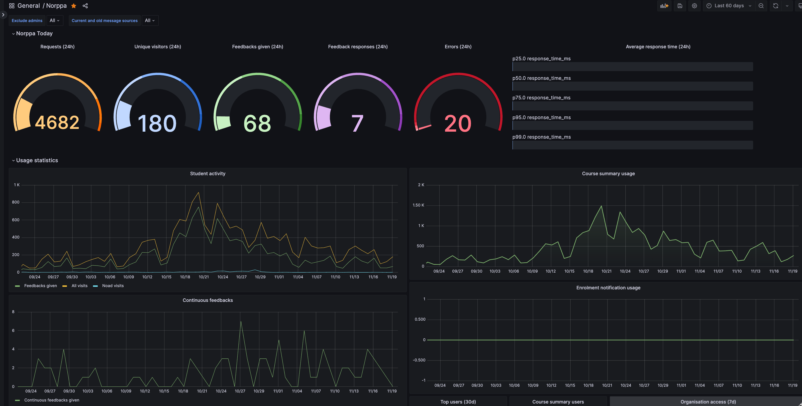{ width=350 }

# Virheiden monitoriointi: Sentry

- Virhetilanteista voidaan muodostaa hälyytyksiä

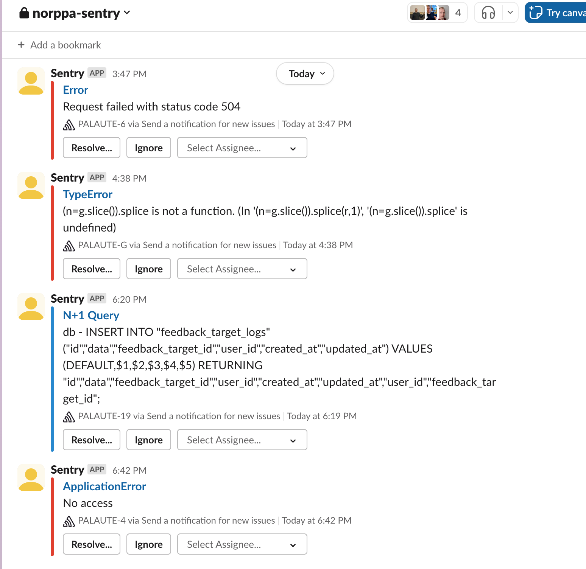{ width=350 }

# Virheiden monitoriointi: Sentry

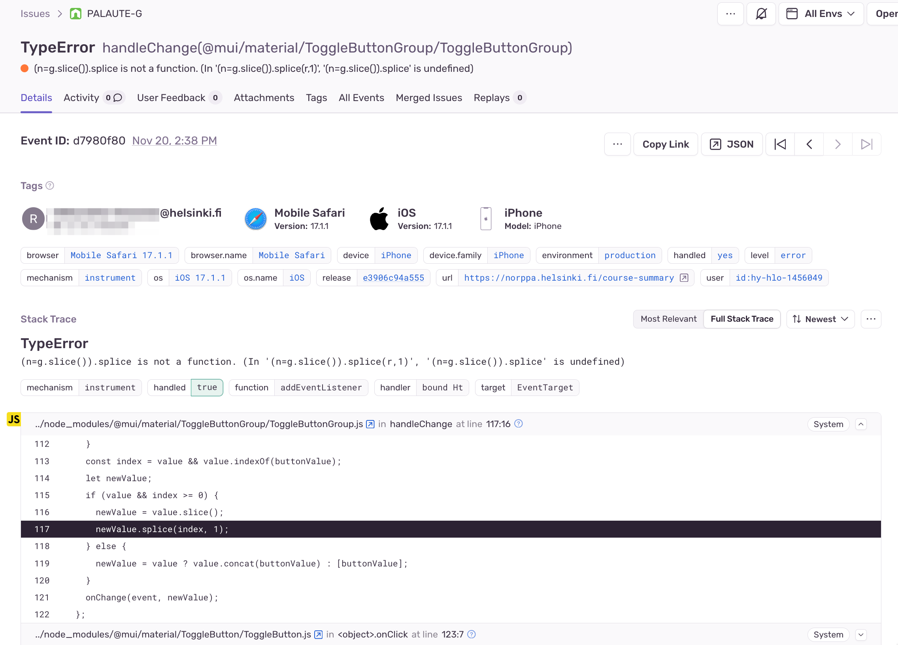{ width=350 }


# Moar buzzwords

2000-luvun alussa **Ketterä/Agile** 

. . .

==>

. . .

2010-luvulla **Lean**

# Lean: taustaa

. . .

- Syntynyt Toyotan tuotannon ja tuotekehityksen menetelmistä

. . .

- Japanissa 2. maailmansodan jälkeen jälleenrakennusbuumi, mutta pääomaa ja raaka-aineita niukalti

. . .

- Huomataan että laadun parantaminen nostaa tuottavuutta
  - mitä vähemmän tuotteissa ja tuotantoprosesseissa ongelmia, sitä enemmän tuottavuus kasvaa

. . .

- Japanilaisiin yrityksiin tuli vahva _laatua korostava kulttuuri_

. . .

- Resurssien niukkuus johti _Just In Time (JIT)_ -tuotantomalliin 
  - aloitetaan tuotteen valmistus vasta kun ostaja tehnyt tilauksen
  - vastakohtana perinteinen massatuotanto: tehdään paljon tuotteita varastoon


# _Just In Time (JIT)_ -tuotantomalli

. . .

- Pyrkimys saada tuote tilauksen jälkeen mahdollisimman nopeasti kuluttajalle: 
  - _lyhyt läpimenoaika_ (lead time) tilauksesta toimitukseen

. . .

- Etuja massatuotantoon verrattuna
  - _läpimenoaika_ lyhyt: laatuongelmat paljastuvat nopeasti
  - asiakkaiden muuttuviin tarpeisiin oli helppo vastata 

. . .

- Massatuotanto pyrkii optimoimaan yksittäisten työntekijöiden ja koneiden työpanosta 
  - ideaali käyttöaste on koko ajan 100%

. . .

- JIT:issä optimoinnin kohde tuotteen *läpimenoaika*
  - eliminoidaan kaikki **hukka** (waste), joka ei edesauta työn nopeampaa _virtausta_ tilauksesta asiakkaalle

# Toyota production system (TPS)

. . .

- Vuodesta 1965 alkaen Toyota alkoi kutsua toimintatapaansa Toyota Production Systemiksi

. . .

- Ensimmäiset englanninkieliset julkaisut vuodelta 1977

. . .

- MIT:in tutkijat alkoivat 1980-luvun lopussa tutkimaan TPS:ää
  - lanseeraavat nimikkeen _lean- (eli virtaviivainen) tuotanto_ 

. . .


- 1990 ilmestynyt kirja _The Machine That Changed the World_ toi leanin laajempaan tietoisuuteen

. . .

- Toyota alkoi 2000-luvulla käyttämään sisäisesti nimitystä lean

. . .


- Viimeisen 25 vuoden aikana on ilmestynyt suuri määrä kirjoja, jotka kuvaavat Toyotan tuotantojärjestelmää
  - Ehkä paras _Jeffrey Liker: The Toyota Way (2001)_


# Lean tuotanto ja tuotekehitys

- Alussa lean oli Toyotalla _tuotantoa_ (production) optimoiva toimintatapa, nykyään myös _tuotekehitystä_ (development)

. . .

- Tuotanto ja tuotekehitys luonteeltaan hyvin erilaisia ja niihin sovellettavat lean-käytänteet eroavatkin paikoin

. . .

- Sovellettu monille aloille, myös ohjelmistotuotantoon
  - Mary ja Tom Poppendieck: _Lean software development, an agile toolkit (2003)_

. . .

- Scrum saanut vaikutteita leanista
  - kehittäjät Ken Schwaber ja Jeff Sutherland tunsivat leanin 

. . .

- Leania sovelletaan nykyään laajasti
  - terveydenhuoltoon, pankkitoimintaan, yliopiston hallintoon, ...
  - vaikea enää sanoa mitä lean tarkoittaa...

# Lean TPS:n mukaan...

. . .

- Leania havainnollistaa _lean thinking house_ 

# Lean thinking house

{ width=300 }

# Lean TPS:n mukaan...

- Leania havainnollistaa _lean thinking house_ 

. . .

- Leanilla on
  - tavoite (**goal**)
  - perusta (**foundation**)
  - kaksi peruspilaria (**pilars**) ja
  - joukko näitä tukevia periaatteita (_14 principles ja product development -periaatteet_)

. . .

- Lisäksi olemassa joukko leania tukevia työkaluja
  - näistä kuuluisin lienee _Kanban_

# Lean: tavoite, perusta ja pilarit

- Tavoite (**goal**)
  - kestävä ja nopea tapa edetä "ideasta asiakkaalle myytyyn tuotteeseen" 
  - työntekijöitä ja yhteistyökumppaneita riistämättä
  - ylläpitäen korkea laatutaso ja asiakastyytyväisyys

. . .

- Perusta (**foundation**)
  - syvälle yrityksen kaikille tasoille juurtunut lean-toimintatapa
  - mitä johtajat soveltavat ja opettavat alaisille

. . .

- Lean rakentuu kahden peruspilarin varaan
  - jatkuvan parantaminen (**continuous improvement**)
  - ihmisten kunnioittaminen (**respect for people**)

# Jatkuvan parantaminen (continuous improvement)

. . .

- The root of the Toyota Way is to be **dissatisfied with the status quo**; you have to ask constantly 
  - _"Why are we doing this?"_

. . .

- Oleellista
  - **jatkuvan oppimisen** ilmapiiri ja
  - ympäristö joka ei pelkästään hyväksy vaan **rohkaisee muutokseen**

# Ihmisten kunnioittaminen (respect for people)

. . .

- Jatkuvaan oppimisen ja parantamisen ilmapiiri mahdollinen vaan, jos toiminta perustuu _ihmisten kunnioittamiseen_. 
  - työntekijöitä kuunnellaan, mentoroidaan ja vastuutetaan 
  - työympäristö mielekäs ja turvallinen
  - työtehtävät mielekkäitä, annetaan mahdollisuus urakehitykselle

. . .

- Periaatteen kattaa myös alihankkijat ja loppuasiakkaat
  - alihankkijoiden kanssa rakennetaan aitoja partneriuksia, joista molemmat hyötyvät sekä opettaa alihankkijoille lean-ajattelua

# Jatkuva parantaminen – arvo ja hukka

. . .

- TPS:n kehittäjä Taiichi Ohno kuvaa _jatkuvan parantamisen periaatetta_ seuraavasti:
  - We are looking at **time line**, from the moment **customer gives us an order to the point where we collect the cash**
  - And we are reducing the time line by **reducing the non-value-adding wastes**

. . .

- Keino päästä nopeampaan tuotantosykliin on siis eliminoida _arvoa_ (value) tuottamattomia asioita eli _hukkaa_ (waste)

. . .

- Mitä arvo ja hukka tarkoittavat?
  - arvo: asiat ja työvaiheet, mistä asiakas on valmis maksamaan
  - hukka: kaikki tuotantoon liittyvä, mikä ei tuota asiakkaalle arvoa

. . .

- Lean tunnisti alunperin 7 lähdettä hukalle (**muda**)

# Lean-hukka ohjelmistotuotannon näkökulmasta 

- **Over-prodution** ylituotanto
  - Tuotteita tulee valmistaa ainoastaan siinä määrin mitä asiakas on niitä tilannut

. . .

- Ohjelmistojen ylimääräiset toiminnallisuudet voidaan ajatella olevan ylituotantoa
  - Tutkimuksien mukaan 64% ohjelmistojen toiminnallisuuksista on joko ei ollenkaan tai ainoastaan erittäin harvoin käytettyjä

. . .

- **In-process inventory** välivarastointi
  - Tähän kategoriaan kuuluu osittain tehty työ ja sen säilöminen

. . .

- Ohjelmistotuotannossa
  - tarkka vaatimusmäärittely ominaisuuksille joita ei vielä toteuteta 
  - valmis koodi mikä ei ole vielä testattu tai otettu käyttöön
  - koodi joka toteuttaa asiakkaan ehkä tulevaisuudessa haluamia toiminnallisuuksia

# Lean-hukka ohjelmistotuotannon näkökulmasta 

- **Extra processing** liikatyö
  - prosessin pakottamat turhat työvaiheet 
  - "pyörän keksiminen uudelleen"
  - liian hyvä laatu (?)

. . .

- **Transportation** tarpeeton materiaalin siirtely

. . .

- Ohjelmistotuotannossa ns "handoff", eli jos ohjelmisto
  - määritellään ja toteutetaan erillisten tiimien toimesta
  - toteutetaan ja viedään tuotantoon erillisten tiimien toimesta 
  - ...

# Lean-hukka ohjelmistotuotannon näkökulmasta 

- **Motion** työntekijöiden tarpeeton liikkuminen

. . .

- Ohjelmistotuotannossa _task switching_
  - työskentely yhtäaikaa monessa projektissa
  - liian monen storyn tekeminen yhtä aikaa

. . .

- **Waiting** turha odotus

. . .

- Ohjelmistotuotannossa
  - aika, joka joudutaan odottamaan että yrityksen johto hyväksyy vaatimusmäärittelyn
  - ... testaajat ehtivät testaamaan ohjelman uuden version
  - ... ylläpito vie sovelluksen uuden version tuotantoon
  - ... joku mergeää pull requestin

# Lean-hukka ohjelmistotuotannon näkökulmasta 

- **Defects** viat
  - Koodissa on väkisinkin vikoja jossain tuotannon vaiheessa 
  - Testaaminen ja vikojen havaitseminen vasta tuotannon loppuvaiheessa erittäin epäoptimaalista

. . .

- Myöhemmin on ehdotettu alkuperäisten lisäksi uusia, mm.
  - _Under-realizing people’s potential and varied skill, insight, ideas, suggestion_

# Mura--ja muri--tyyppinen hukka

- Seitsemän _muda_-tyyppisen hukan lisäksi olemassa kaksi muuta hukkatyypiä: _mura_ ja _muri_

. . .

- **Mura**: epäsäännöllisyyttä tai epäyhdenmukaisuutta työtavoissa tai työstettävässä tuotteessa 
  - Esim. toteutettavien user storyjen suuresti vaihteleva koko  

. . .

- **Muri**:  ylikuormitus tai mahdottomat vaatimukset
  - koneiden käyttäminen 100% kapasiteetilla ilman säännöllistä huoltoa 
  - henkilöstön ylityöllistäminen
  
. . .

- Seurauksena saattaa olla _muda_-tyyppinen hukka, esimerkiksi välivarastoinnin tarve tai viat
  - Heikentää arvon läpivirtausta, eli aikaa, miten kauan user storyltä kestää backlogille asettamisesta valmiiksi tuotteen osaksi

#  Jaktuva parantaminen: kaizen

. . .

- **Kaizen** eli jatkuva parantaminen: _optimoidaan toimintaa eliminoimalla asiakkaalle arvoa tuottamatonta hukkaa_

. . .

- Kaikkia työntekijöitä koskeva toimintafilosofia:
  - As a mindset, it suggests "My work is to do my work **and to improve my work**" 
  - "continuously improve for its own sake"

. . .

- Kaizen on myös konkreettinen tapa toimia
  - valitaan toimintatapa/proseessi ja tehdään siitä uusi **toiminnan standardi**
  - noudatetaan uutta toimintatapaa, kunnes se tunnetaan täysin
  - mietitään parannuksia, ja luodaan uusi toiminnan standardi
  - toistetaan ikuisesti...

. . . 

- Kaizeniin liittyvä syklinen parannusprosessiin saattavat liittyä tasaisin väliajoin pidettävät tilaisuudet "kaizen event":it


# TAUKO 10 min

# Lean-työkalu: value stream mapping

. . .

- Tekniikka/työkalu hukan kartoittamiseen
  - kuvaa tuotteen kulkua eri työvaiheiden läpi  
  - visualisoi arvoa tuottavat työvaiheet suhteessa elinkaareen
 
. . .

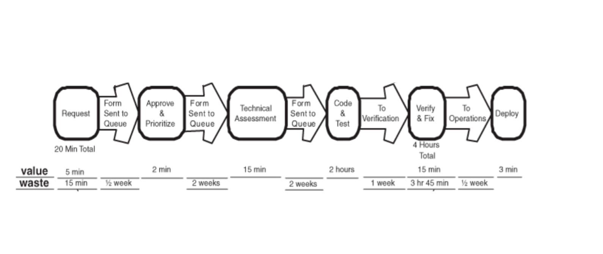{ width=440 }

# Lean-työkalu: value stream mapping

- Tekniikka/työkalu hukan kartoittamiseen
  - kuvaa tuotteen kulkua eri työvaiheiden läpi  
  - visualisoi arvoa tuottavat työvaiheet suhteessa elinkaareen

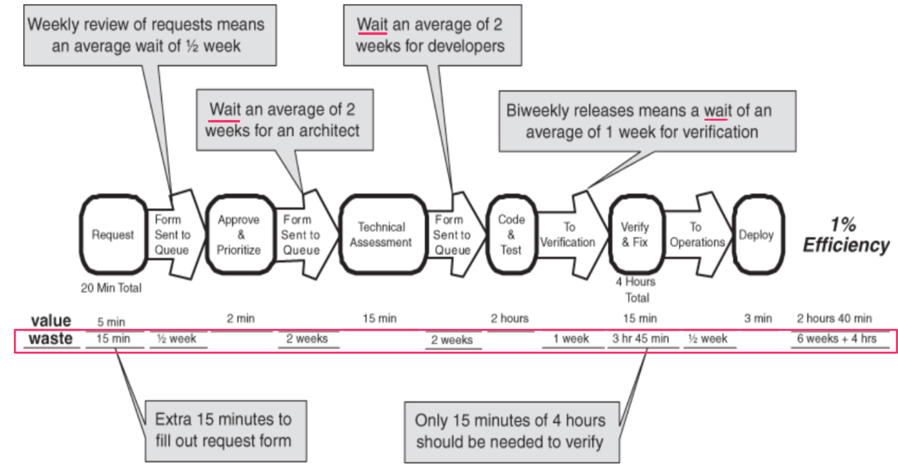{ width=440 }

# Lean-työkalu: perimmäisen syyn analyysi

- Jos tuotantoprosessista on hukkaa, tulee se eliminoida 

. . .

- Kaizenissa tarkoitus tehdä _perimmäisen syyn analyysi_ (root cause analysis) ja korjata hukan taustalla olevat ongelmat

# Perimmäisen syyn analyysi

{ width=400 }

# Perimmäisen syyn analyysi: five whys

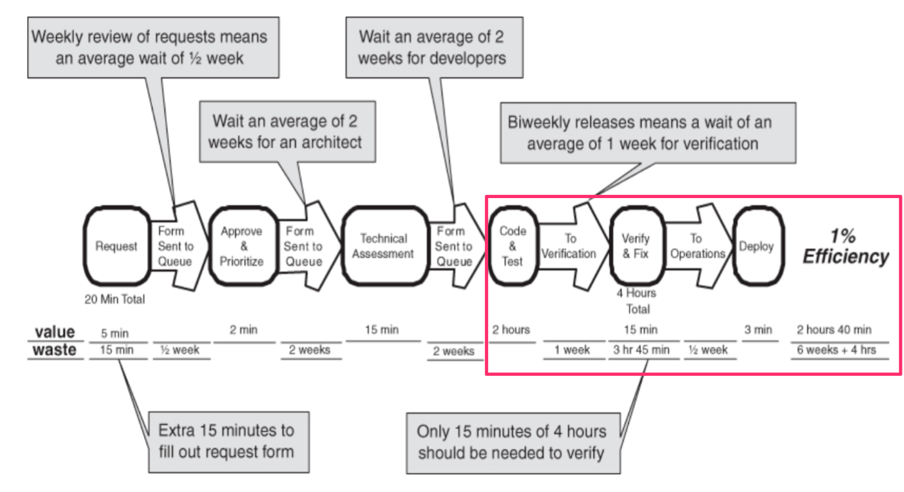{ width=400 }

- Koodin valmistumisesta menee 1.5 viikkoa sen tuotantoon saamiseen

. . .

- **Miksi?**

# Perimmäisen syyn analyysi: five whys

- Koodin valmistumisesta menee 1.5 viikkoa sen tuotantoon saamiseen. **Miksi?**

. . .

- QA-osaston on vielä varmistettava, että koodi toimii staging-ympäristössä. **Miksi?**

. . .

- Ohjelmoijilla ei ole aikaa testata koodia itse staging-ympäristössä. **Miksi?**

. . .

- Ohjelmoijilla on kiire sprintin tavoitteena olevien user storyjen tekemisessä. **Miksi?**

. . .

- Edellisten sprinttien aikana tehtyjen storyjen bugikorjaukset vievät  yllättävän paljon aikaa. **Miksi?**

. . .

- Laadunhallintaa ei ehditä koskaan tekemään kunnolla siinä sprintissä missä storyt toteutetaan. **Miksi?**

. . .

- Sprintteihin otetaan aina liian monta user storya

# Leanin periaatteita

# Leanin periaatteita: pull-systeemi

. . .

- Leanissa on siis tarkoitus optimoida aikaa, mikä kestää tuotteen suunnittelusta sen asiakkaalle toimittamiseen
  - Arvo pyritään saamaan _virtaamaan_ (flow) asiakkaalle ilman turhia viiveitä ja työvaiheita

. . .

- Leanin mekanismi virtauksen optimointiin on _pull-systeemi_ 
  - tehdään tuotteita, tai tuotteiden tarvitsemia komponentteja ainoastaan tilauksen saapuessa
  - tapa toteuttaa JIT (just in time) -tuotanto  

. . .

- Vastakohta on _push-systeemi_, missä tuotteita ja komponentteja tehdään etukäteen varastoon
  - pizzeria: pull-systeemi
  - Unicafe: push-systeemi

. . .

- Pull-systeemi toteutetaan usein _kanbanin_ avulla
  - visuaalisen ohjaus, jonka avulla työntekijöiden on helppo tietää miten seuraavaksi tulee toimittaa

#  Kanban ohjelmistokehityksessä

. . .
 
- Story/task kulkee eri työvaiheiden kautta
- Nopea läpivirtaus saadaan aikaan rajoittamalla tietyissä työvaiheissa kesken olevan työn määrää _WIP-rajoitteilla_

{ width=280 }

. . .

- Voi paljastaa pullonkaulat työprosessissa: mikä "sarake" ruuhkautuu

# Leanin periaatteita

. . .

- Jotta arvo virtaisi tasaisesti, on hyvä jos työvaiheiden kestoon ei liity liikaa varianssia: _level the work_
  - pyrkimys suunilleen tasakokoisiin user storyihin

. . .

- Yksi varianssin aiheuttaja ovat viat. Periaatteena:
  - Stop and fix
  - Build quality in

. . .

- _Stop and fix_: kuka tahansa velvollinen pysäyttämään tuotantolinjan vian havaitessaan
  - vian perimmäinen syy tulee selvittää mahdollisimman nopeasti ja pyrkiä eliminoimaan vian mahdollisuus tulevaisuudessa 
  - laadun tulee olla sisäänrakennettua _build quality in_

. . .

- Jatkuva integraatio ja automaattinen testaus _stop and fix_ - ja _build quality in_ -periaatteiden ilmentymänä

# Leanin periaatteita

- _Decide as late as possible_
  - Pull-systeemeissä tehdään tuotantopäätökset vasta tarvittaessa
  - esim. miten paljon tuotetta ja sen tarvitsemia komponentteja tulee valmistaa

. . .

- _Commit at the last responsible moment_, päätöksiä viivytetään, mutta ei kuitenkaan liian kauaa

. . .

- Kun päätös tehdään myöhään sen tueksi on käytettävissä maksimaalinen määrä tietoa

. . .

- Kun päätökset on tehty, toimitaan mahdollisimman nopeasti: _implement rapidly tai deliver as fast as possible_
  - näin arvo saadaan virtaamaan asiakkaalle ilman turhia viiveitä

. . .

- Mitä nopeammin arvo virtaa, sitä enemmän päätöksiä mahdollista viivyttää ja tehdä ne paremman tiedon valossa

# Arvon virtaaminen ketterässä ohjelmistotuotannossa

. . .

- Vaatimuksia hallitaan product backlogilla, joka on parhaassa tapauksessa DEEP
  - _detailed aproproately_, emergent, estimated, prioritized
  - tarkkoja vaatimuksia ei määritellä spekulatiivisesti vaan _at the last responsible moment_

. . .

- Kun product owner valitsee storyn seuraavaan sprinttiin: määritellään hyväksymäkriteerit ja suunnitellaan story
  - _deliver as fast as possible_ tehdään valmiiksi sprintin aikana

. . .

- *Scrum on pull-systeemi*:
  - jokaiseen sprinttiin otetaan asiakkaan edustajan viime hetkellä viimeistelemät tilaukset
  - arvo eli valmiit toiminnallisuudet virtaa asiakkaalle sprinttien määrittelemässä rytmissä

# Arvon virtaaminen ohjelmistotuotannossa *kiihtyy*

. . .

- Scrum vie uusia ominaisuuksia tuotantoon sprinteittäin 

. . .

- Viime aikojen trendinä on ollut tihentää sykliä
  - _jatkuva toimittaminen_ (CD) voi tarkoittaa sitä, että jopa jokainen commit johtaa tuotantoonvientiin

. . .

- Scrum rajoittaa kesken olevan työn määrää siten, että sprinttiin otetaan vaan tiimin velositeetin verran user storyjä

. . .

- Kaikissa konteksteissa, esim. jatkuvaa käyttöönottoa sovellettaessa aikarajoitettu sprintti ei ole mielekäs

. . .

- Osin siirrytty puhtaampaan pull-systeemiin, storyja toteutetaan yksi (tai muutama) kerrallaan mahdollisimman nopeasti
  - kun tuotantokapasiteettia vapautuu, valitsee product owner tärkeimmän storyn
  - story määritellään, suunnitellaan ja sitten toteutetaan välittömästi alusta loppuun

# Johtaminen leanissa 

- Johtamiskulttuurissa keskiössä on lean-ajattelun opettajina, mentoreina ja työn valmenajana toimivat johtajat/managerit
  - _grow leaders_: johtajat kasvatetaan Toyotan arvoihin
  - _my manager can do my job better than me_: johtajat firman
sisällä eri työtehtävien kautta vastuuseen nousseita

. . .

- Tärkeä johtamisen periaate on _go see_ (genchi genbutsu)
  - asiat tulee "nähdä asiat omin silmin" eikä pelkästään istua työpöydän ääressä raportteja lukemassa

. . .

- Johtajien oletetaan johtavat etulinjassa (gemba) eli siellä missä työ tosiasiallisesti tehdään

. . .

- Scrum masterin rooli on osin leanin ideaalien mukainen

# Lean-tuotekehityen periaatteita

. . .

- Sovellettaessa leania tuotannon optimoinnin sijaan _tuotekehitykseen_ nousee esiin uusia periaatteita

. . .

- _Out-learn the competitors, through generating more useful knowledge and using and remembering it effectively_

. . .

- Fokukseen nousee _oppimisen kiihdyttäminen_ (amplify learning)
  - _high-value information_: pyritään arvokkaaseen tietoon 
  - _focus on uncertain things_: kiinnittämällä huomio epävarmoihin asioihin

. . .

- Epävarmat ja suuren teknisen riskin sisältävät ideat tulee toteuttaa nopeasti, viivyttelyllä voi olla korkea hinta
  - _cost of delay_

# Lean-tuotekehityen periaatteita

- Eräs mekanismi oppimisen nopeuttamiseen on _set based concurrent
development_
  - jos tarkoituksena on kehittää esim. uusi moottorin jäähdytysjärjestelmä, aletaan yhtä aika kehittämään useita vaihtoehtoisia ratkaisuja eri tiimien toimesta
  - tasaisin väliajoin kehitettäviä ratkaisuja ja osa niistä karsitaan
  - lopulta parhaaksi osoittautuva valitaan lopputuotteeseen

. . . 

- Poikkeaa radikaalisti iteratiivisesta kehityksestä
  - Ohjelmistotuotannossa harvinainen

. . . 

- Toyotalla tuotekehitystä johtaa _chief technical engineer_
  - sekä tekninen että liiketoiminnallinen vastuu
  - etulinjassa toimiva johtaja, tuntee tarkasti käytännön työn, mutta on erittäin lähellä asiakasta

# Leanin soveltaminen

. . . 

- 90-luvulta alkaen lean on herättänyt maailmalla suurta kiinnostusta ja sitä on sovellettu laajalti

. . .

- Scrumissa paljon vaikutteita leanista
  - viimeaikoina agile vienyt arvoketjun optimoimista user storyjen läpimenoaikoja minimoimalla Scrumin periaatteita pidemmälle
  - nykyään puhutaan paljon _leanista ohjelmistokehityksestä_

. . . 

- Agilessa ja leanissa sama fundamentaali periaate: _toimintojen jatkuva kehittäminen_
  - rajanveto leanin ja ketterän välillä ei olekaan ollenkaan selvä

. . .

- **Ketteryyden ydin** on läpinäkyvyyden mahdollistava toimintojen parantamiseen keskittyvä inspect-and-adapt-sykli

- Käytännössä tämä on täsmälleen sama idea kuin leanin kaizen

# Leanin soveltamisen vaikeus

- Leanin soveltamisessa on kohdattu myös paljon ongelmia

. . .

- Lean on ajattelumalli, joka on kehitetty Toyotan tarpeisiin, ja jalostunut vuosikymmenten kuluessa
  - epäselvää miten Toyotan käytänteet siirretään eri aloille

. . .

- Usein Lean tulkitaan mekanistisesti, keskittyen työkaluihin
  - esim. kanban ja value stream mapping

. . .

- Unohtaen periaatteet: _jatkuva parantaminen ja ihmisten kunnioittaminen_
  - saadaan ehkä aikaan hetkellisiä parannuksia tuotantoketjussa
  - parannukset eivät ole kauaskantoisia jos ne eivät vaikuta koko organisaation ajatteluun ja toimintatapoihin% Ohjelmistotuotanto
% Matti Luukkainen ja ohjaajat Antti, Pooki, Riku, Sini, Taneli
% syksy 2024

#

&nbsp;&nbsp;&nbsp;&nbsp;&nbsp;&nbsp;&nbsp;&nbsp;&nbsp;&nbsp;&nbsp;&nbsp;&nbsp;&nbsp;&nbsp;&nbsp;&nbsp;&nbsp;&nbsp;&nbsp;&nbsp;&nbsp;&nbsp;&nbsp;&nbsp;&nbsp;&nbsp;&nbsp;&nbsp;&nbsp;&nbsp;&nbsp;&nbsp;&nbsp;&nbsp;&nbsp;&nbsp;Luento 10

&nbsp;&nbsp;&nbsp;&nbsp;&nbsp;&nbsp;&nbsp;&nbsp;&nbsp;&nbsp;&nbsp;&nbsp;&nbsp;&nbsp;&nbsp;&nbsp;&nbsp;&nbsp;&nbsp;&nbsp;&nbsp;&nbsp;&nbsp;&nbsp;&nbsp;&nbsp;&nbsp;&nbsp;&nbsp;&nbsp;&nbsp;&nbsp;&nbsp;&nbsp;&nbsp;&nbsp;3.12.2024

# Kurssipalaute

- Kurssipalaute
  - Kurssilla lopussa kerättävän palautteen lisäksi ns. jatkuva palaute https://norppa.helsinki.fi

# Kurssin viimeiset 2 viikkoa

- Miniprojektit jatkuvat
  - tällä viikolla asiakastapaaminen

. . .

- Loppudemot (jokainen ryhmä osallistuu toiseen demoista)
  - ke 11.12. klo 12-14 B123
  - to 12.12. klo 12-14 CK112
  - ilmoittautuminen käynnissä!

. . .

- Vierailuluennot
  - ma 9.12. Kasper Hirvikoski Unity ja Luomus Fossil Database Team
  - ti 10.12. Hannu Kokko Elisa

. . .

- Koe torstaina 19.12. klo 7-14 moodlessa (koeaika 4h)

# Laajan mittakaavan ketterä

. . .

- Ketterä tarkoitettu alunperin pienten tiimien hallintaan
  - Scrum: 3-9 kehittäjää 
  - Entä jos on kyseessä iso ohjelmisto?

. . .

- Perusperiaate pitää **tiimit pieninä**, ja kasvattaa tuotantokapasiteettia käyttämällä **useampia tiimejä**
  - Tämä edellyttää, tiimien välistä töiden koordinointia 

. . .

- Jo kauan käytetty tapa: _Scrum of Scrums_ 
  - koordinoiva tiimi, johon kuuluu jäseniä jokaisesta Scrum-tiimistä
  - esim. scrum master tai lead developer osallistuu

. . .

- Scrum of Scrums -tiimi voi tavata päivittäin/viikoittain

# Scrum of Scrums 
 
- Scrum of Scrums -periaate on jo hyvin vanha
  - Jeff Sutherland  1996 

. . .

- Fimassa satoja sovelluskehittäjiä, kymmeniä Scrum-tiimejä ja useita eri tuotteita
  - Jokaisen tuotteen tiimejä kordinoi kerran viikossa kokoontuva Scrum of Scrums 

. . .

- Koko tuotejoukkoa hallinnoi kuukausittain kokoontuva "management Scrum"
  - koostui yrityksen johdosta, tuotepäälliköistä ja johtavista ohjelmistoarkkitehdeistä

. . .

- Kuvaus ei ole kovin seikkaperäinen
  - miten esim. backlogien suhteen tulisi toimia?

# Laajan mittakaavan ketterä

- Viimeisen kymmenen vuoden aikana ketterän skaalaamiseen esitelty useita menetelmiä, esim.
  - Scaled Agile Framework eli SAFe
  - Large Scale Scrum eli LeSS
  - Disiplined Agile eli DA
  - Enterprise Scrum
  - Nexus

. . .

- Laajentavat ketteryyttä ottamalla mukaan lean-ajattelua

. . .

- Toisin kuin ketterä, lean on lähtökohtaisesti tarkoitettu toimimaan suuressa skaalassa
  - sisältää enemmän koko organisaation toimintaa ohjaavia periaatteita kuin perinteinen ketterä

# Laajan mittakaavan ketterä

- Viimeisen kymmenen vuoden aikana ketterän skaalaamiseen esitelty useita menetelmiä, esim.
  - **Scaled Agile Framework eli SAFe**
  - **Large Scale Scrum eli LeSS**
  - Disiplined Agile eli DA
  - Enterprise Scrum
  - Nexus


- Laajentavat ketteryyttä ottamalla mukaan lean-ajattelua


- Toisin kuin ketterä, lean on lähtökohtaisesti tarkoitettu toimimaan suuressa skaalassa
  - sisältää enemmän koko organisaation toimintaa ohjaavia periaatteita kuin perinteinen ketterä


# SAFe eli Scaled Agile Framework

. . .

- Pääasiallinen kehittäjä on David Leffingwell joka toimi Nokia Mobile Phonesissa (NMP) konstulttina 2000-luvulla
  - SAFe on syntynyt pitkälti Nokialla tehdyn työn pohjalta
  - NMP:lla olikin käytössä eräänlainen esiversio SAFe:sta

. . .

- SAFe:n virallinen ensimmäinen version julkaistiin 2011

. . .

- Yhdistää _kaikki_ viime vuosien ketterän ja leanin parhaat käytänteet sekä joukon tuotteiden hallinnointiperiaatteita

. . .

- SAFe tarjoaa suuren määrän käytänteitä, henkilö- ja tiimirooleja sekä käsitteitä
  - _menetelmäkehys_, yritykset räätälöivät itselleen sopivanlaisen prosessin käyttäen SAFe:n tarjoamia työkaluja

. . .

- Tarojaa 4 erikokoista valmiiksi räätälöityä konfiguraatiota
  - _Essential SAFe:_ pienemmille yrityksille ja SAFen soveltamisen alkuvaiheeseen
  - _Full SAFe:_ massiivisten, useita eri tuotteita hallitsevan yrityksen käyttöön

#

{ width=450 }

#

{ width=450 }

# Release train ja product increment

- Sovelluskehityksen ytimessä modifioitu Scrum

. . .

- Samaa tuotetta tekevät tiimit muodostavat _release trainin_
  - tuottavat yhdessä isompia kokonaisuuksia useammasta sprintistä koostuvan _product increment_ -ajanjakson aikana


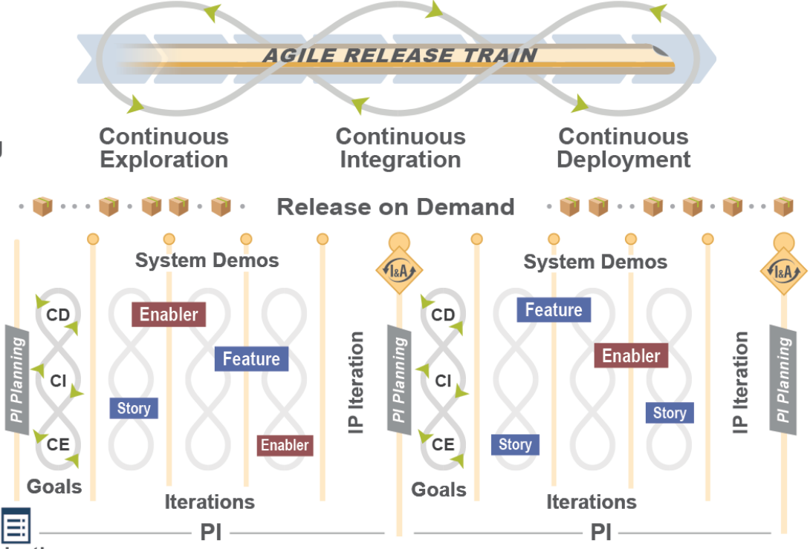{ width=300 }

# SAFe

- Product incrementtejä ja release traineja taas ohjaillaan yhä korkeammalta organisaatiosta erilaisten johtajien toimesta
  - SAFe tarjoaa tähän paljon tukea käsitteistön ja roolien kautta

. . .

- SAFe dokumentoitu laajasti ja tarjoaa tarkat ohjeet SAFen käyttöönottoon ja noudattamiseen

. . .

- SAFe firmojen johdon suosiossa
  - tarjoaakin firman managementille sopivasti tekemistä roolien ja käytänteiden muodossa

# SAFen suosio ja kritiikki

. . .

- SAFe sisältää käytännössä kaikki mahdolliset ketterän ja lean-ohjelmistokehityksen parhaat käytänteet
  - Kaikki vieläpä selkeästi ja yksityiskohtaisesti dokumenoituna
. . .

- SAFe käytetään paljon ja se on erityisen suosittu Suomessa

. . .

- SAFe on saanut osakseen myös paljon kritiikkiä
  - Osa kritiikistä kohdistuu SAFen määrittelemän prosessin raskauteen
  - Osa taas SAFe:n top down -management luonteeseen

. . .

- Ken Schwaber on kyseenalaistanut onko SAFe ylipäätään ketterä menetelmä 
  - _Individuals and Interactions Over Processes and Tools_
  - SAFe taas prosessina vaikuttaa kovin raskaalta

# LeSS eli Large Scale Scrum

. . .

- LeSS:in taustalla on Craig Larman ja Bas Vodde 
  - konsultteina 2000-luvun alussa Nokia Siemens Networksilla

. . .

- Erittäin yksinkertainen, vahvasti Scrumiin pohjautuva
  - Uusia rooleja, artifakteja ja palavereja ei ole 

. . .

- Kaksi eri versiota
  - _LeSS_ tilanteisiin, missä tuotetta tekee 2-8 scrum-tiimiä
  - _LeSS Huge_ tilanteisiin, missä tiimejä tarvitaan suurempi määrä

# LeSSin perusperiaatteet

- Sekä LeSS että LeSS Huge perustuvat seuraavaan

. . .

- Kehitetään yhtä tuotetta, jolla on yksi product owner ja yksi product backlog

. . .

- Kaikilla tiimeillä on samaan aikaan etenevät sprintit

. . .

- Tiimit tekevät sprintin aikana yhdessä tuotteesta uuden version
  - _one shippable product increment_

. . .

- Featuretiimit 


# LeSSin perusperiaatteet

- Jos yrityksellä on useita tuotteita, niitä kutakin varten on oma LeSS-toteutuksensa
  - LeSS ei ota kantaa siihen miten firma hallinnoi tuoteperheitään

. . .

- LeSS korostaa että kyse *ei ole* Scrumin päälle rakennettu erillinen kerros

. . .

- vaan ideana on sovelutaa Scrumin elementtejä laajemmassa skaalassa
  - LeSS is "barely sufficient methodology"

# More with less

- Periaatteet ovat lähes samat kuin SAFe:ssa, yksi periaatteista tekee kuitenkin selvää eroa menetelmien välille

. . .

- We don’t want 
  - **more roles** because more roles leads to less responsibility to teams
  - **more artifacts** because more artifacts leads to a greater distance between teams and customers
  - **more process** because that leads to less learning and team ownership of process

. . .

- Instead we want 
  - more **responsible teams** by having less roles
  - more **customer-focused teams** building useful products by having less artifacts
  - more **team ownership of process** and more meaningful work by having less defined processes

. . .

- **We want more with less**

# LeSS

- Katsotaan hieman tarkemmin LeSS:in pienempää konfiguraatiota

. . .

- Roolit
  - yksi product owner
  - 2-8 tiimiä
  - yksi scrum master 1-3 tiimiä kohti

. . .

- Tiimit:
  - cross functional
  - cross component / full stack
  - feature teams
  - työskentelevät saman koodin parissa

#

- Artefaktit
  - yksi product backlog
  - yhteinen kehitettävä tuote
  - tiimikohtaiset sprinttibacklogit

. . .

- Kaikille yhteinen sprintti

{ width=430 }


# LeSS: kaksiosainen sprintin suunnittelu

. . .

- Ensimmäisessä osassa product owner ja tiimien edustajat valitsevat backlogilta tiimeille seuraavan sprintin storyt

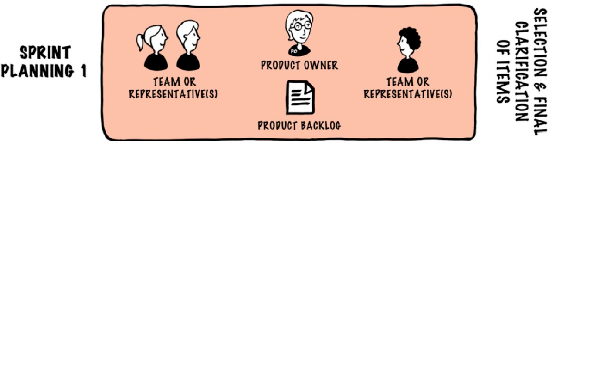{ width=360 }

# LeSS: kaksiosainen sprintin suunnittelu 

- Ensimmäisessä osassa product owner ja tiimien edustajat valitsevat backlogilta tiimeille seuraavan sprintin storyt

{ width=360 }

- Toisessa osassa tiimit muodostavat omat sprint backlogit

#

- Kaikkien tiimien yhteinen aikaansaannos (one shippable product increment) katselmoidaan yhdessä

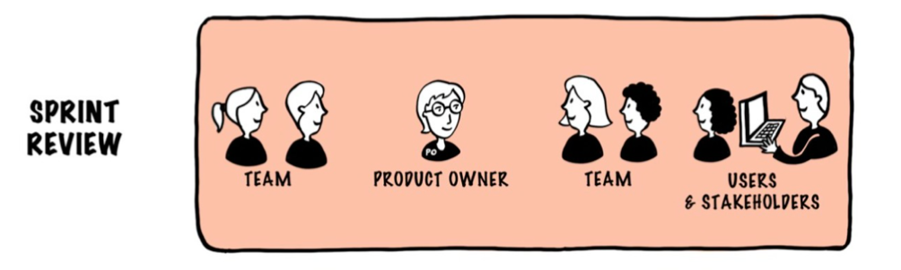{ width=330 }

. . .

- Retrospektiivi on kaksitasoinen
  - tiimikohtainen 
  - overall-retrospektiivi: edustus kaikista tiimeistä ja mahdollisesti yrityksen johdosta

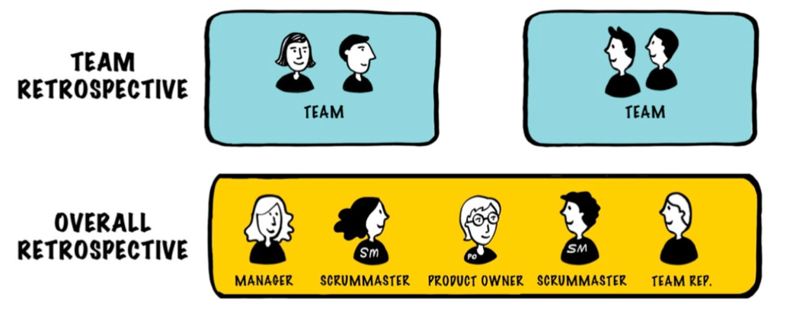{ width=330 }

# LeSS: Muu tiimien välinen koordinointi

- Yhteisen sprintin suunnittelun, reviewin ja overall-retrospektiivin lisäksi ei muita yhteisiä tapaamisia

. . .

- LeSS antaa joukon aiheeseen liittyviä ohjeita ja suosituksia 

. . .

- Tiimit päättävät keskenään miten tiimien välinen koordinointi tapahtuu 
  - Emphasize Just Talk and informal networks 
  - communicate in code
  - cross-team meetings
  - component mentors
  - open spaces
  - scouts 

. . .

- Scrum of Scrums -palaverit mainitaan, mutta suositellaan informaalimpia kommunikaation muotoja

# LeSS huge

- Yksi tuote, backlog ja vastuunalainen product owner
- Backlog jaetaan _vaatimusalueisiin_ (requirement area)
  - jokaiselle alueelle siitä vastaava _area product owner_
  - muodostavat product owner -tiimi
  - backlogiin aluekohtaiset näkymät

{ width=440 }

# LeSS vs SAFe

- SAFen ja LeSSin juuret Suomessa ja Nokialla

. . .

- Nokian organisaatiorakenteen takia Nokia Mobile Phonesin (NMP) ja Nokia Siemens Networksin (NSN) ohjelmistokehitystapa oli täysin erilainen

. . .

- SAFe (NMP) ja LeSS (NSN) ovat samoista taustaperiaatteistaan ja yhteisestä syntykonsernista huolimatta hyvin erilaisia menetelmiä

. . .

- SAFe suosittu yritysjohdon keskuudessa, mutta saanut paljon kritiikkiä
  - Ohjelmistokehittäjiltä en ole kuullut SAFesta juurikaan kiitosta

. . .

- SAFe:n kotia Nokia Mobile Phonesia ei enää ole
- Nokia Networks taas on nykyinen Nokia ja soveltaa yhä LeSS-menetelmää

. . .

- SAFe:n asema vahva, ja vahvistuu koko ajan

# TAUKO 10 min

# Spotifyn skaalaamisen malli

. . .

- 2012 julkaistu artikkeli _Scaling agile @ Spotify_ saavutti paljon huomiota

- Miten Spotify skaalasi toimintansa muutamassa vuodessa yhdestä useampaan kymmeneen tiimiin

. . . 

{ width=350 }

# Squad eli tiimi

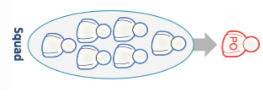{ width=220 }

- Itseorganisoituva, cross-functional, featuretiimi
  - työskentelee yhdessä tilassa

. . .

- Saa itse päättää prosessinsa
  - ei välttämättä Scrum

. . .

- Tiimeillä vahva liiketoiminnallinen missio
  - suuri autonomia myös liiketoiminnallisiin päätöksiin
  - mahdollisimman suora asiakaskontakti
  - firman vision puitteissa

. . .

- Ministartup

. . .

- Agile coachit apuna

# 

- Tiimi vastaa usein suoraan asiakkaalle näkyvästä toiminnallisuudesta

{ width=350 }

- Tai muita tiimejä palvelevasta Spotifyn sisäisestä "palvelusta"

# Tribe eli heimo

{ width=280 }

- Joukko tiimejä jotka työskentelevät jonkin loogisen kokonaisuuden parissa

. . .

- Sijoitettu fyysisesti lähekkäin

. . .

- Yhteisiä kokousia: suunnittelua, demoja...

# Chapter eli jaos

- Riskinä että autonomiset tiimit joutuvat kohtaamaan toistuvasti samoja ongelmia

. . . 

{ width=300 }

- Heimon eri tiimien samaa asiaa tekevien ihmisten joukko
  - esim. testaajat, designerit, frontend-kehittäjät

- levittää tietoa tiimistä toiseen

# Guild eli kilta

{ width=350 }

- Yli heimorajojen ylittyvä samasta asiasta kiinnostuneiden yhteisö

# Spotifyn "malli"

- Kertoo siitä mikä tilanne Spotifyllä noin 2012-14

. . . 

- Dokumentoi ainoastaan pintapuolisesti tiettyjä asioita siitä miten firma oli organisoitunut
  - ei tarkoitettu ohjeeksi muille ...

. . . 

- Monet asiat ovat Spotifyllä sittemmin muuttuneet
  - "Spotify ei käytä Spotifyn mallia"

. . .

- Levisi yllättäen maailmalle
  - myös Suomessa ruvettiin pöhisemään heimoista

. . . 

- Saanut paljon kritiikkiä
  - "keksinyt" tunnettuja asioita uudelleen uusilla termeillä
  - Spotifyn sisältä (antaa utopistisen kuvan firman toiminnasta)
  - myös mallin soveltamista ilman sen hengen ymmärtämistä arvosteltu

# Playlist: Spotifyn "tarina" stiimauspalveluissa...

{ width=330 }

# Miten laajalti ketterää/leania käytetään

. . .

- Paljon kyselytutkimuksia, luvut vaihtelevat 46-86 % välillä
  - Project management institute (2018): 46 % 
  - Stack owerflow (yli 200000 vastaajaa, 2018): 85.9%
  
. . .

- Akateemisia tutkimuksia:

. . .

- Oulun yliopisto _Survey on Agile and Lean usage in Finnish software industry_ 2012: 
  - 58% vastanneista 200 yrityksestä käytti agilea tai leania 

. . .

- Turun ylopisto ym _Adoption and Suitability of Software Development Methods and Practices_ 2016:
  - Scrum 71.2%
  - Kanban 49.5% 
  - Lean 39.7%
  - Vesiputous 35.3%

# 

- Helsingin yliopiston ja Nitorin loppuvuodesta 2018 tekemän selvitys

{ width=420 }

# 

- Yhdysvaltojen hallituksen alaiset ohjelmistoprojektit

{ width=420 }

# State of Agile -raportti: vuodesta 2005

. . .

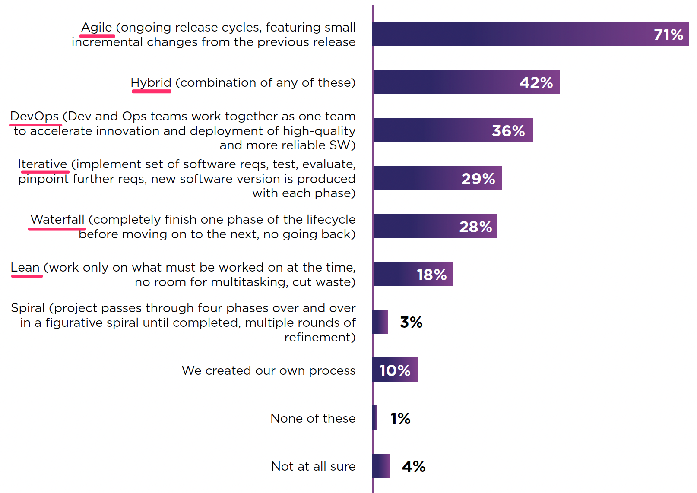{ width=380 }

# State of Agile -raportti

- raportin muoto muuttui 2022...

. . .

- Scrum dominoi 

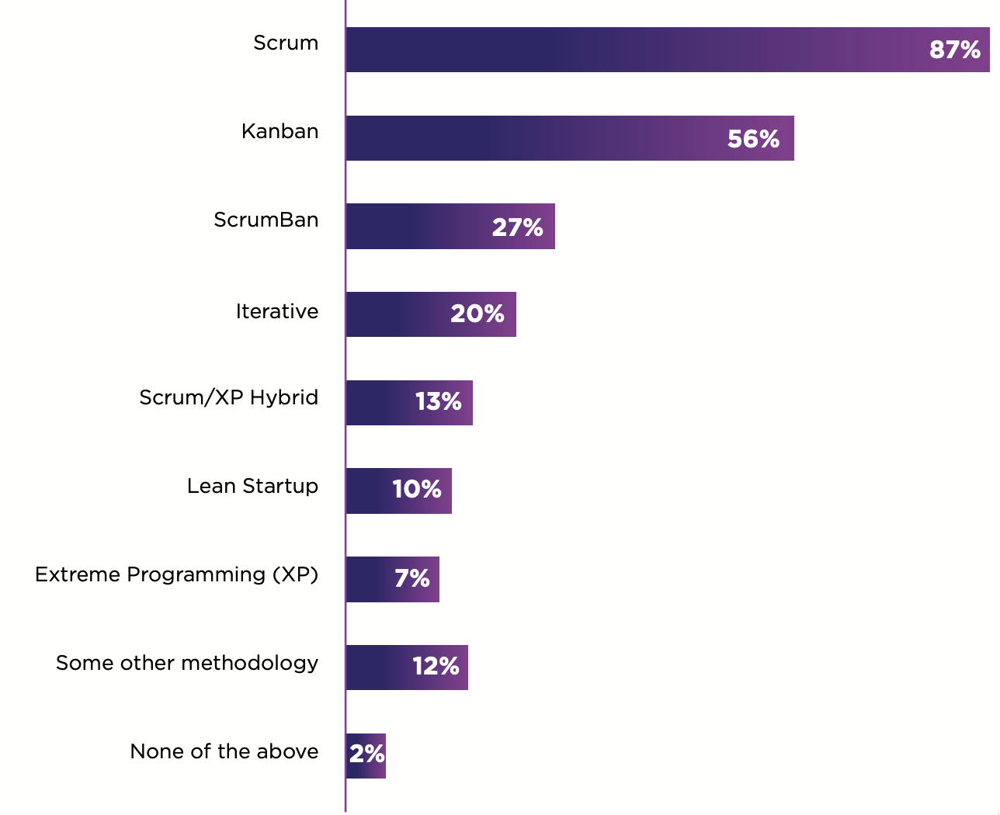{ width=340 }

#

- Projektinhallintakäytänteet

{ width=330 }

. . .

- short iterations 63%

#

- Tekniset käytänteet

{ width=420 }

#

- Ketteryydellä saavutettuja hyötyjä

{ width=350 }


# Laajan mittakaavan ketterä 

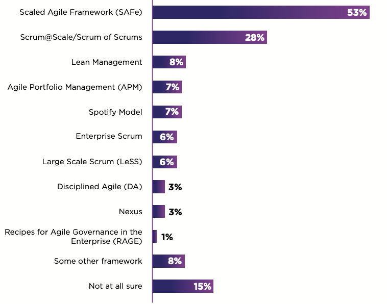{ width=350 }

# Toimiiko ketterä ohjelmistokehitys

- Standish groupin _Chaos raport_, vuodesta 1995
  - Ohjelmistoprojektien onnistuminen

. . .

- 2020:

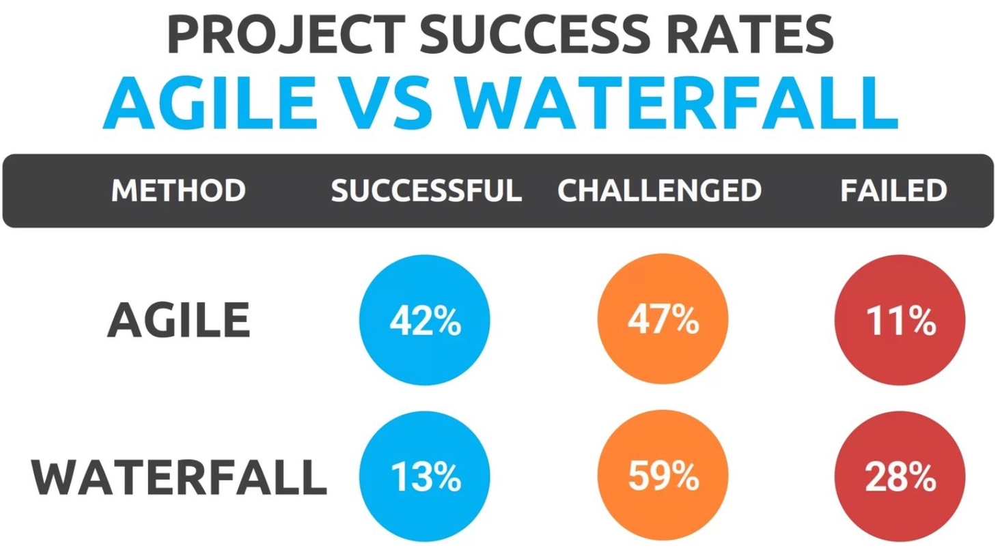{ width=250 }

- successful: aikataulussa, budjetissa, sovittu toiminnallisuus

#

- Projektin koolla on todella suuri merkitys onnistumisen kannalta. 

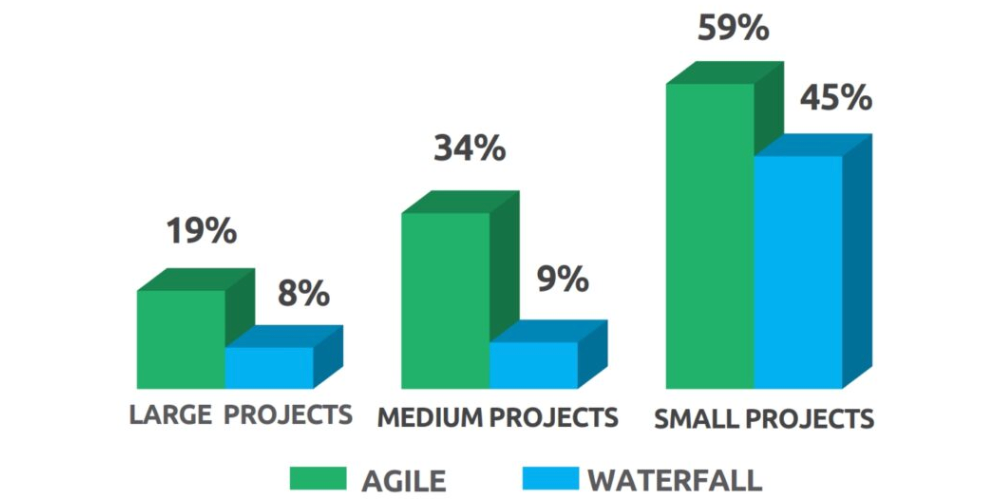{ width=300 }

# State of Agile -raportti: tyytyväisyys agileen 2023

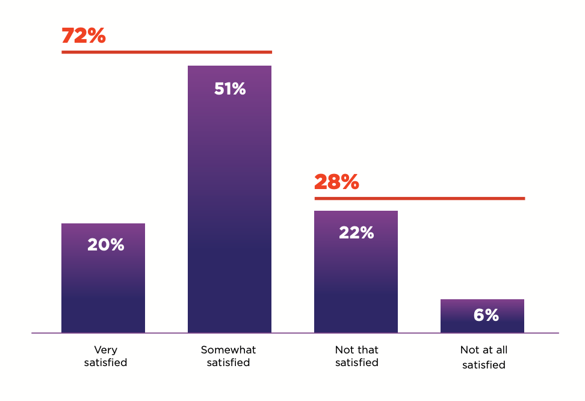{ width=350 }

# State of Agile -raportti: tyytyväisyys agileen 2024

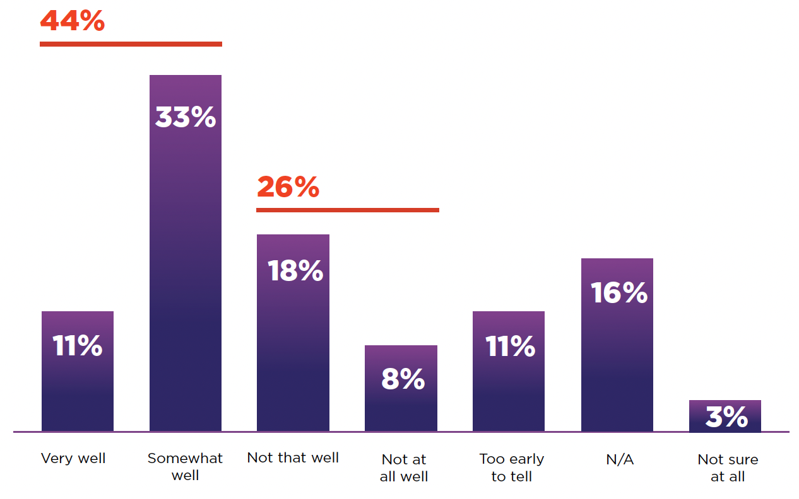{ width=350 }

# Miksi agile epäonnistuu?

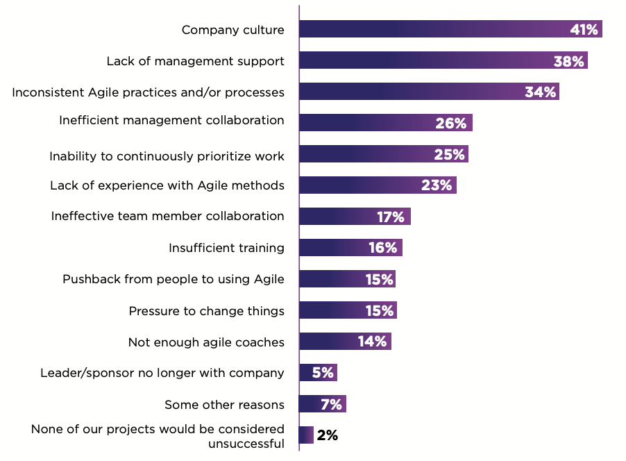{ width=350 }

# Tieteellinen evidenssi

- DevOps-käytenteiden hyödyistä on jonkin verran tieteellistä evidenssiä
  - Accelerate: _The Science of Lean Software and DevOps: Building and Scaling High Performing Technology Organizations_ 2018

. . .

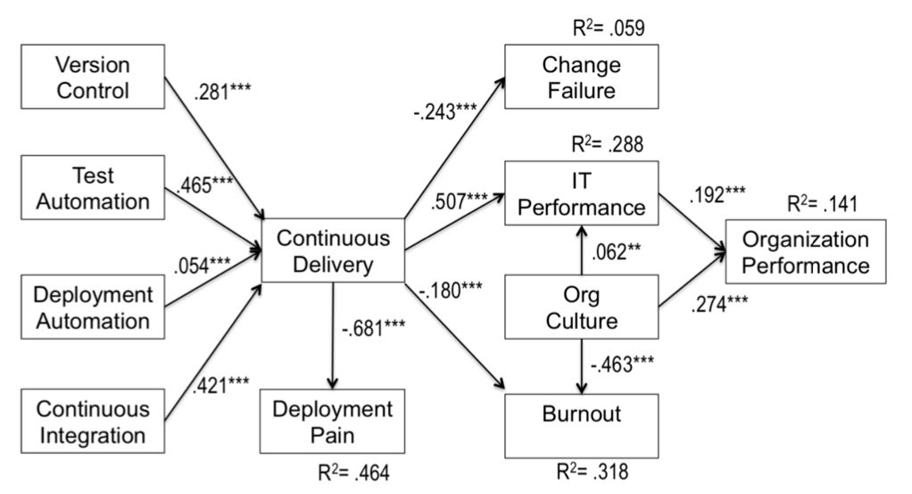{ width=380 }

# Tieteellinen evidenssi

- DevOps-käytenteiden hyödyistä on jonkin verran tieteellistä evidenssiä
  - Accelerate: _The Science of Lean Software and DevOps: Building and Scaling High Performing Technology Organizations_ 2018

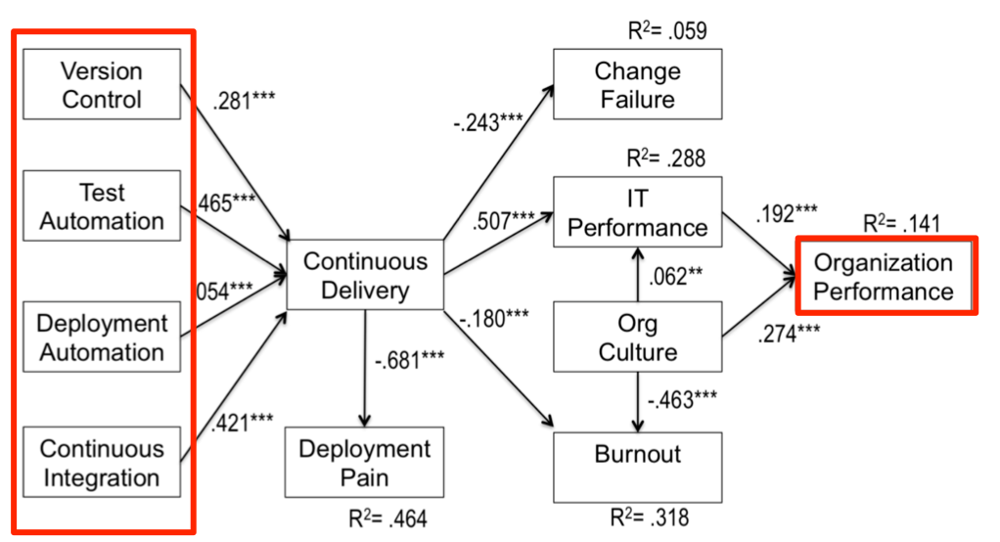{ width=380 }

# Tieteellinen evidenssi

- DevOps-käytenteiden hyödyistä on jonkin verran tieteellistä evidenssiä
  - Accelerate: _The Science of Lean Software and DevOps: Building and Scaling High Performing Technology Organizations_ 2018

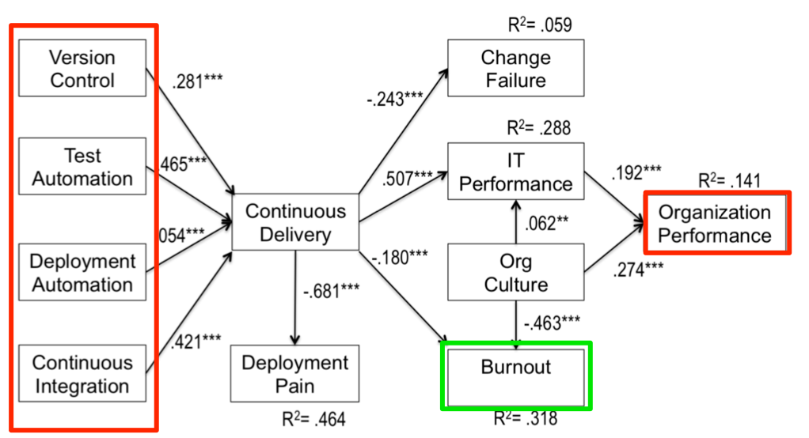{ width=380 }

# The Science of Lean Software and DevOps

- Tutkimus tehty 2013-2017, perustuu yli 20000 tuhanteen kyselytutkimuksen vastaukseen
  - Julkaistu kirjan lisäksi vertaisarvioituina tieteellisinä julkaisuinta

. . .

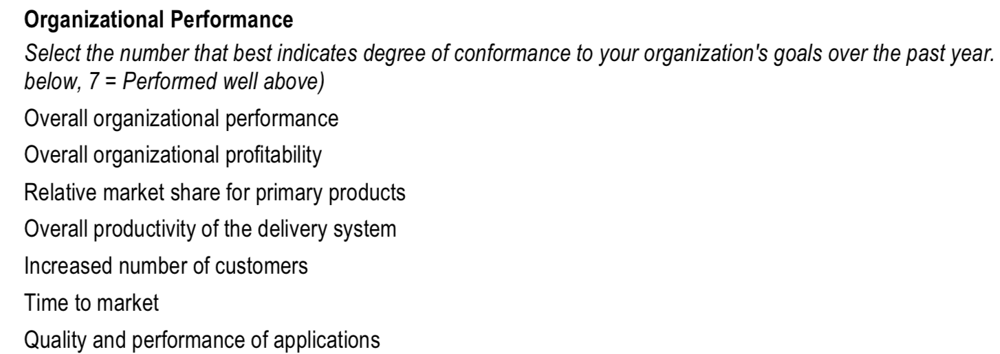{ width=500 }

# 

# Toimiiko ketterä

- Evidenssiä on, mutta... 

. . .

- Kaikki edelliset olivat kyselytutkimuksia
  - käsitteitä ei ole kunnolla määritelty (Scrum vs Scrumbut)
  - osallistuneet eivät ehkä edusta tasaisesti koko populaatiota
  - kyselyjen tekijät eivät ole puolueettomia menetelmien suhteen

. . .

- Akateemisenkin tutkimuksen laatu ja tulosten yleistettävyys vaihtelee

. . .

- Ohjelmistokehityksessä liian paljon muuttujia, jotta jonkin yksittäisen tekijän vaikutusta voitaisiin mitata empiirisesti

. . .

- Menetelmiä soveltavat ihmiset, ja mittaustulos yhdellä tiimillä ei välttämättä yleisty muihin olosuhteisiin

# Ketterä post covid?

- eräs ketterän perusolettamuksia on se, että tiimi jakaa yhteisen työtilan
  - palataanko tähän koskaan?

. . .

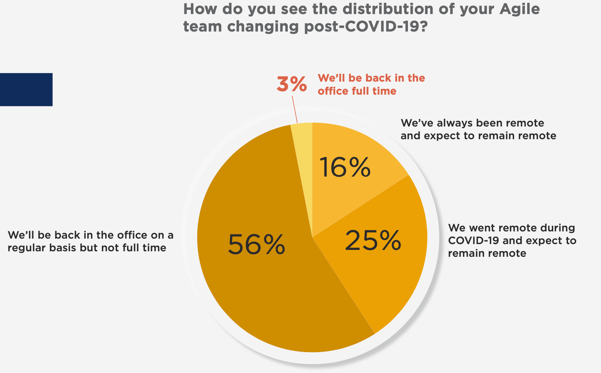{ width=350 }

. . .

- miten ohjelmistokehitys onnistunut etäaikana?

# Koe

- Koe torstaina 19.12. klo 7-14 moodlessa (koeaika 4h)

. . .

- Kaikki materiaali käytössä
  - copy paste tietysti kiellettyä
  - johtaa välittömään hylkäämiseen
  - entä ChatGPT?

. . .

- Koealueena kurssimateriaalin osat 1-5 sekä laskarit, paitsi
  - Git
  - poetry 
  - GitHub Actions
  - unittest
  - Mock 
  - Robot/Selenium

. . .

- Vierailuluennot eivät kuulu koealueeseen

. . .

- Edellisten vuosien kokeita on nähtävillä vanhoilla kurssisivuilla
  - suureksi osaksi esseitä